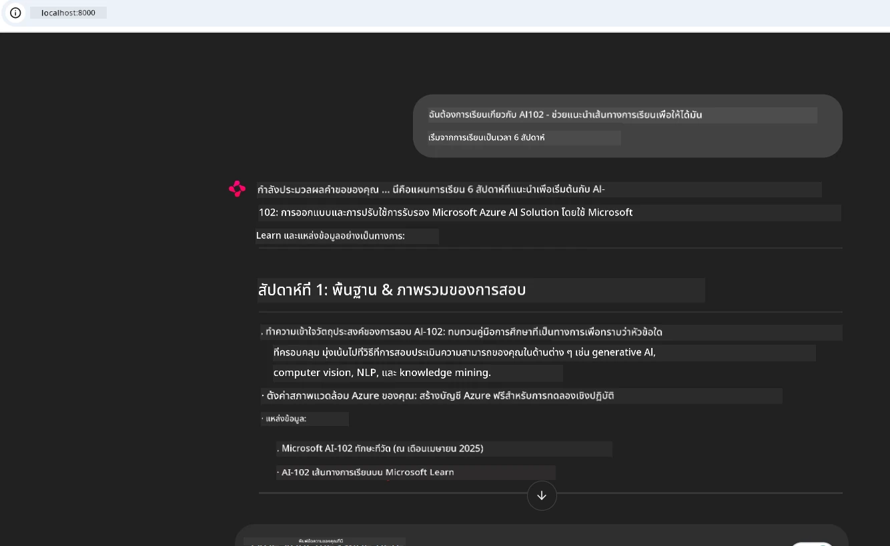
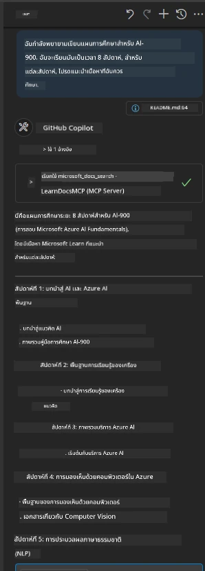

# กรณีศึกษา: การเชื่อมต่อกับ Microsoft Learn Docs MCP Server จากไคลเอนต์

คุณเคยพบตัวเองต้องสลับไปมาระหว่างเว็บไซต์เอกสาร, Stack Overflow และแท็บเครื่องมือค้นหาไม่รู้จบ ในขณะที่พยายามแก้ปัญหาในโค้ดของคุณหรือไม่? บางทีคุณอาจจะมีมอนิเตอร์ตัวที่สองสำหรับดูเอกสารโดยเฉพาะ หรือคุณต้องกด alt-tab สลับระหว่าง IDE กับเว็บเบราว์เซอร์อยู่ตลอดเวลา จะดีกว่าไหมถ้าคุณสามารถนำเอกสารมาไว้ในเวิร์กโฟลว์ของคุณโดยตรง—ผสานเข้ากับแอปรวมถึง IDE หรือแม้กระทั่งเครื่องมือสั่งทำเอง? ในกรณีศึกษานี้ เราจะสำรวจวิธีทำเช่นนั้นโดยเชื่อมต่อโดยตรงกับ Microsoft Learn Docs MCP server จากแอปไคลเอนต์ของคุณเอง

## ภาพรวม

การพัฒนาระบบยุคใหม่ไม่ใช่แค่การเขียนโค้ดเท่านั้น—แต่คือการหาข้อมูลที่ถูกต้องในเวลาที่เหมาะสม เอกสารมีอยู่ทั่วไป แต่ส่วนใหญ่ไม่อยู่ในที่ที่คุณต้องการที่สุด: ภายในเครื่องมือและเวิร์กโฟลว์ของคุณ โดยการผสานการเรียกค้นเอกสารเข้ากับแอปของคุณโดยตรง คุณจะประหยัดเวลา ลดการสลับบริบท และเพิ่มประสิทธิผล ในส่วนนี้เราจะแสดงวิธีเชื่อมต่อไคลเอนต์กับ Microsoft Learn Docs MCP server เพื่อให้คุณเข้าถึงเอกสารที่ฉับไวและมีความเกี่ยวข้องกับบริบทโดยไม่ต้องออกจากแอปของคุณเลย

เราจะพาคุณผ่านขั้นตอนการตั้งค่าการเชื่อมต่อ, การส่งคำขอ และการจัดการการตอบกลับแบบสตรีมอย่างมีประสิทธิภาพ วิธีนี้ไม่เพียงแต่ช่วยให้เวิร์กโฟลว์ของคุณราบรื่นขึ้น แต่ยังเปิดโอกาสในการสร้างเครื่องมือพัฒนาที่ชาญฉลาดและช่วยเหลือได้มากขึ้น

## เป้าหมายการเรียนรู้

ทำไมเราต้องทำเช่นนี้? เพราะประสบการณ์ของนักพัฒนาที่ดีที่สุดคือการลดแรงเสียดทาน จินตนาการโลกที่เครื่องมือแก้ไขโค้ด, แชตบอท หรือเว็บแอปของคุณสามารถตอบคำถามเกี่ยวกับเอกสารได้ในทันที โดยใช้ข้อมูลล่าสุดจาก Microsoft Learn เมื่อจบบทนี้ คุณจะสามารถ:

- เข้าใจพื้นฐานการสื่อสารระหว่าง MCP server กับไคลเอนต์เพื่อเรียกเอกสาร
- สร้างคอนโซลหรือเว็บแอปเพื่อเชื่อมต่อกับ Microsoft Learn Docs MCP server
- ใช้ HTTP client แบบสตรีมมิงเพื่อเรียกเอกสารแบบเรียลไทม์
- บันทึกและตีความผลลัพธ์เอกสารในแอปของคุณ

คุณจะเห็นว่าทักษะเหล่านี้ช่วยให้คุณสร้างเครื่องมือที่ไม่เพียงแต่โต้ตอบได้อย่างรวดเร็ว แต่ยังเข้าใจบริบทอย่างแท้จริง

## กรณีศึกษา 1 - การเรียกเอกสารแบบเรียลไทม์ด้วย MCP

ในกรณีศึกษานี้ เราจะแสดงวิธีเชื่อมต่อไคลเอนต์กับ Microsoft Learn Docs MCP server เพื่อให้คุณเข้าถึงเอกสารแบบเรียลไทม์ที่อิงบริบทโดยไม่ต้องออกจากแอปของคุณ

มาปฏิบัติกันเลย งานของคุณคือเขียนแอปที่เชื่อมต่อกับ Microsoft Learn Docs MCP server, เรียกใช้เครื่องมือ `microsoft_docs_search` และบันทึกการตอบกลับแบบสตรีมมิงลงในคอนโซล

### ทำไมต้องใช้วิธีนี้?
เพราะเป็นรากฐานสำหรับการสร้างการผสานรวมขั้นสูงขึ้น ไม่ว่าคุณจะต้องการขับเคลื่อนแชตบอท, ส่วนขยาย IDE หรือแดชบอร์ดเว็บก็ตาม

คุณจะพบโค้ดและคำแนะนำสำหรับกรณีศึกษานี้ในโฟลเดอร์ [`solution`](./solution/README.md) ภายในกรณีศึกษา ขั้นตอนจะนำทางคุณตั้งค่าการเชื่อมต่อดังนี้:
- ใช้ SDK ของ MCP ที่เป็นทางการและ HTTP client แบบสตรีมมิงสำหรับเชื่อมต่อ
- เรียกเครื่องมือ `microsoft_docs_search` พร้อมพารามิเตอร์คำค้นหาเพื่อดึงเอกสาร
- ทำระบบบันทึกข้อมูลและจัดการข้อผิดพลาดอย่างเหมาะสม
- สร้างอินเทอร์เฟซคอนโซลแบบโต้ตอบเพื่อให้ผู้ใช้ป้อนคำค้นหาหลายครั้งได้

กรณีศึกษานี้แสดงวิธีการ:
- เชื่อมต่อกับ Docs MCP server
- ส่งคำค้นหา
- แยกวิเคราะห์และพิมพ์ผลลัพธ์

นี่คือตัวอย่างการรันโซลูชัน:

```
Prompt> What is Azure Key Vault?
Answer> Azure Key Vault is a cloud service for securely storing and accessing secrets. ...
```

ด้านล่างนี้คือตัวอย่างโซลูชันที่เรียบง่าย โค้ดเต็มรูปแบบและรายละเอียดอยู่ในโฟลเดอร์ solution

<details>
<summary>Python</summary>

```python
import asyncio
from mcp.client.streamable_http import streamablehttp_client
from mcp import ClientSession

async def main():
    async with streamablehttp_client("https://learn.microsoft.com/api/mcp") as (read_stream, write_stream, _):
        async with ClientSession(read_stream, write_stream) as session:
            await session.initialize()
            result = await session.call_tool("microsoft_docs_search", {"query": "Azure Functions best practices"})
            print(result.content)

if __name__ == "__main__":
    asyncio.run(main())
```

- สำหรับการใช้งานเต็มรูปแบบและการบันทึก ดูที่ [`scenario1.py`](../../../../09-CaseStudy/docs-mcp/solution/python/scenario1.py)
- สำหรับคำแนะนำการติดตั้งและการใช้งาน ดูไฟล์ [`README.md`](./solution/python/README.md) ในโฟลเดอร์เดียวกัน
</details>


## กรณีศึกษา 2 - เว็บแอปสร้างแผนการเรียนเชิงโต้ตอบด้วย MCP

ในกรณีศึกษานี้ คุณจะเรียนรู้วิธีบูรณาการ Docs MCP เข้ากับโครงการพัฒนาเว็บ เป้าหมายคือช่วยให้ผู้ใช้ค้นหาเอกสาร Microsoft Learn ได้โดยตรงผ่านเว็บอินเทอร์เฟซ ทำให้เอกสารเข้าถึงได้ทันทีภายในแอปหรือเว็บไซต์ของคุณ

คุณจะเห็นวิธี:
- ตั้งค่าเว็บแอป
- เชื่อมต่อกับ Docs MCP server
- จัดการอินพุตของผู้ใช้และแสดงผลลัพธ์

นี่คือตัวอย่างการรันโซลูชัน:

```
User> I want to learn about AI102 - so suggest the roadmap to get it started from learn for 6 weeks

Assistant> Here’s a detailed 6-week roadmap to start your preparation for the AI-102: Designing and Implementing a Microsoft Azure AI Solution certification, using official Microsoft resources and focusing on exam skills areas:

---
## Week 1: Introduction & Fundamentals
- **Understand the Exam**: Review the [AI-102 exam skills outline](https://learn.microsoft.com/en-us/credentials/certifications/exams/ai-102/).
- **Set up Azure**: Sign up for a free Azure account if you don't have one.
- **Learning Path**: [Introduction to Azure AI services](https://learn.microsoft.com/en-us/training/modules/intro-to-azure-ai/)
- **Focus**: Get familiar with Azure portal, AI capabilities, and necessary tools.

....more weeks of the roadmap...

Let me know if you want module-specific recommendations or need more customized weekly tasks!
```

ด้านล่างนี้คือตัวอย่างโซลูชันที่เรียบง่าย โค้ดเต็มรูปแบบและรายละเอียดอยู่ในโฟลเดอร์ solution



<details>
<summary>Python (Chainlit)</summary>

Chainlit คือเฟรมเวิร์กสำหรับสร้างเว็บแอป AI แบบสนทนา ช่วยให้ง่ายต่อการสร้างแชตบอทและผู้ช่วยที่สามารถเรียกใช้เครื่องมือ MCP และแสดงผลลัพธ์แบบเรียลไทม์ เหมาะสำหรับการสร้างต้นแบบรวดเร็วและอินเทอร์เฟซที่ใช้งานง่าย

```python
import chainlit as cl
import requests

MCP_URL = "https://learn.microsoft.com/api/mcp"

@cl.on_message
def handle_message(message):
    query = {"question": message}
    response = requests.post(MCP_URL, json=query)
    if response.ok:
        result = response.json()
        cl.Message(content=result.get("answer", "No answer found.")).send()
    else:
        cl.Message(content="Error: " + response.text).send()
```

- สำหรับการใช้งานเต็มรูปแบบ ดูที่ [`scenario2.py`](../../../../09-CaseStudy/docs-mcp/solution/python/scenario2.py)
- สำหรับคำแนะนำการติดตั้งและการรัน ดูที่ [`README.md`](./solution/python/README.md)
</details>


## กรณีศึกษา 3: เอกสารในตัวแก้ไขด้วย MCP Server บน VS Code

ถ้าคุณอยากได้เอกสาร Microsoft Learn Docs มาแสดงใน VS Code โดยตรง (แทนการสลับแท็บเบราว์เซอร์) คุณสามารถใช้ MCP server ในตัวแก้ไขของคุณ วิธีนี้ช่วยให้คุณ:
- ค้นหาและอ่านเอกสารใน VS Code โดยไม่ออกจากสภาพแวดล้อมการเขียนโค้ด
- อ้างอิงเอกสารและแทรกลิงก์ตรงในไฟล์ README หรือไฟล์คอร์สของคุณ
- ใช้ร่วมกับ GitHub Copilot และ MCP เพื่อเวิร์กโฟลว์เอกสารที่ขับเคลื่อนด้วย AI อย่างราบรื่น

**คุณจะเห็นวิธี:**
- เพิ่มไฟล์ `.vscode/mcp.json` ที่ถูกต้องใน root workspace ของคุณ (ดูตัวอย่างด้านล่าง)
- เปิดแผง MCP หรือใช้ command palette ใน VS Code เพื่อค้นหาและแทรกเอกสาร
- อ้างอิงเอกสารโดยตรงในไฟล์ markdown ขณะทำงาน
- ผสานเวิร์กโฟลว์นี้กับ GitHub Copilot เพื่อเพิ่มประสิทธิภาพมากขึ้น

นี่คือตัวอย่างการตั้งค่า MCP server ใน VS Code:

```json
{
  "servers": {
    "LearnDocsMCP": {
      "url": "https://learn.microsoft.com/api/mcp"
    }
  }
}
```

</details>

> สำหรับคำแนะนำทีละขั้นตอนพร้อมภาพหน้าจอ ดูไฟล์ [`README.md`](./solution/scenario3/README.md)



วิธีนี้เหมาะสำหรับผู้สร้างคอร์สเทคนิค, เขียนเอกสาร หรือพัฒนาซอฟต์แวร์ที่ต้องอ้างอิงบ่อยๆ

## ประเด็นสำคัญที่ควรจดจำ

การผสานเอกสารเข้ากับเครื่องมือของคุณโดยตรงไม่ใช่แค่เรื่องสะดวกสบาย แต่มันเปลี่ยนเกมด้านประสิทธิภาพ การเชื่อมต่อกับ Microsoft Learn Docs MCP server จากไคลเอนต์ของคุณ คุณจะสามารถ:

- ลดการสลับบริบทระหว่างโค้ดและเอกสาร
- ดึงเอกสารที่อัปเดตและเกี่ยวข้องกับบริบทแบบเรียลไทม์
- สร้างเครื่องมือพัฒนาที่ชาญฉลาดและโต้ตอบได้มากขึ้น

ทักษะเหล่านี้จะช่วยคุณสร้างโซลูชันที่ไม่เพียงแต่มีประสิทธิภาพ แต่ยังใช้งานได้อย่างน่าประทับใจ

## แหล่งข้อมูลเพิ่มเติม

เพื่อเสริมความเข้าใจของคุณ ให้สำรวจแหล่งข้อมูลอย่างเป็นทางการเหล่านี้:

- [Microsoft Learn Docs MCP Server (GitHub)](https://github.com/MicrosoftDocs/mcp)
- [เริ่มต้นใช้งาน Azure MCP Server (mcp-python)](https://learn.microsoft.com/en-us/azure/developer/azure-mcp-server/get-started#create-the-python-app)
- [Azure MCP Server คืออะไร?](https://learn.microsoft.com/en-us/azure/developer/azure-mcp-server/)
- [แนะนำ Model Context Protocol (MCP)](https://modelcontextprotocol.io/introduction)
- [การเพิ่มปลั๊กอินจาก MCP Server (Python)](https://learn.microsoft.com/en-us/semantic-kernel/concepts/plugins/adding-mcp-plugins)

## ต่อไปคืออะไร

- กลับไป: [ภาพรวมกรณีศึกษา](../README.md)
- ดำเนินการต่อที่: [โมดูล 10: การปรับปรุงเวิร์กโฟลว์ AI ด้วย AI Toolkit](../../10-StreamliningAIWorkflowsBuildingAnMCPServerWithAIToolkit/README.md)

---

<!-- CO-OP TRANSLATOR DISCLAIMER START -->
**ข้อจำกัดความรับผิดชอบ**:  
เอกสารฉบับนี้ถูกแปลโดยใช้บริการแปลด้วยปัญญาประดิษฐ์ [Co-op Translator](https://github.com/Azure/co-op-translator) แม้เราจะพยายามให้มีความถูกต้องสูงสุด แต่โปรดทราบว่าการแปลอัตโนมัติอาจมีข้อผิดพลาดหรือความคลาดเคลื่อนได้ เอกสารต้นฉบับในภาษาต้นทางถือเป็นแหล่งข้อมูลที่เชื่อถือได้ สำหรับข้อมูลที่สำคัญควรใช้บริการแปลโดยมนุษย์มืออาชีพ เราไม่รับผิดชอบต่อความเข้าใจผิดหรือการตีความที่ผิดพลาดที่เกิดขึ้นจากการใช้การแปลนี้
<!-- CO-OP TRANSLATOR DISCLAIMER END -->