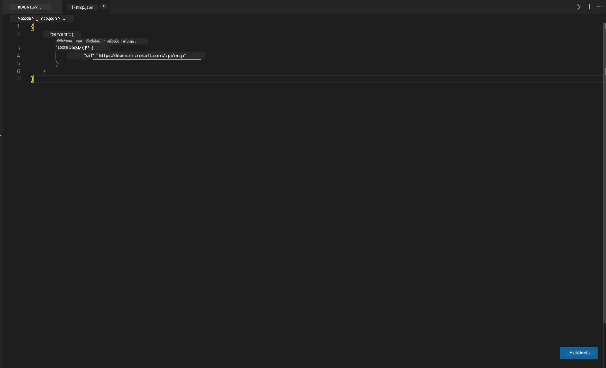
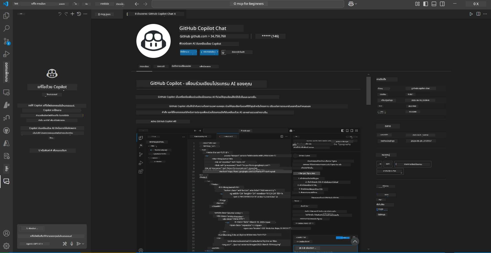
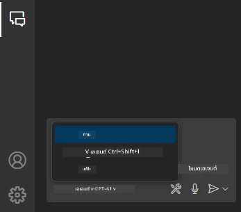
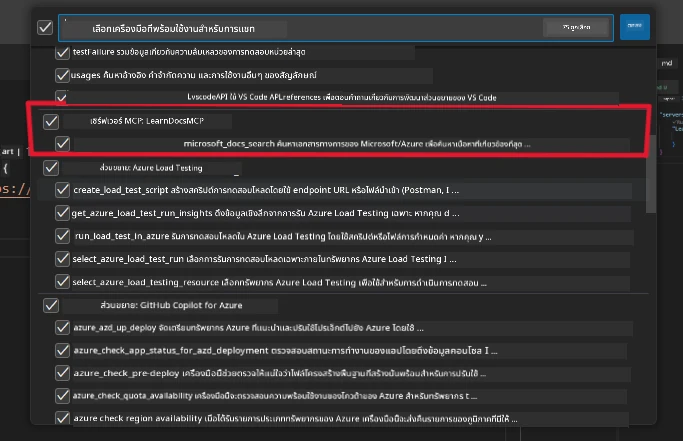
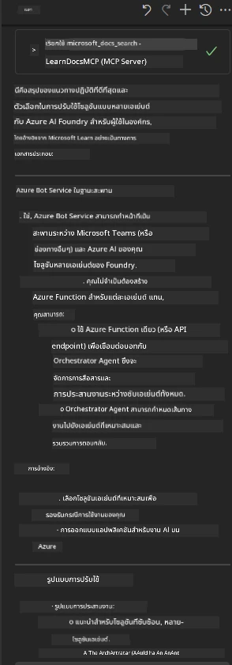

# Scenario 3: เอกสารในตัวแก้ไขพร้อม MCP Server ใน VS Code

## ภาพรวม

ในสถานการณ์นี้ คุณจะได้เรียนรู้วิธีนำ Microsoft Learn Docs เข้ามาใช้งานโดยตรงในสภาพแวดล้อม Visual Studio Code ของคุณผ่าน MCP server แทนที่จะต้องสลับแท็บเบราว์เซอร์ไปมาเพื่อค้นหาเอกสาร คุณสามารถเข้าถึง ค้นหา และอ้างอิงเอกสารอย่างเป็นทางการได้ภายในตัวแก้ไขเลย วิธีนี้ช่วยให้การทำงานของคุณราบรื่นขึ้น โฟกัสกับงานได้มากขึ้น และผสานรวมกับเครื่องมือต่างๆ เช่น GitHub Copilot ได้อย่างไร้รอยต่อ

- ค้นหาและอ่านเอกสารภายใน VS Code โดยไม่ต้องออกจากสภาพแวดล้อมการเขียนโค้ด
- อ้างอิงเอกสารและแทรกลิงก์โดยตรงใน README หรือไฟล์คอร์สของคุณ
- ใช้ GitHub Copilot และ MCP ร่วมกันเพื่อการทำงานกับเอกสารที่ขับเคลื่อนด้วย AI อย่างราบรื่น

## วัตถุประสงค์การเรียนรู้

เมื่อจบบทนี้ คุณจะเข้าใจวิธีตั้งค่าและใช้งาน MCP server ภายใน VS Code เพื่อเพิ่มประสิทธิภาพการทำงานกับเอกสารและการพัฒนา คุณจะสามารถ:

- กำหนดค่า workspace ให้ใช้ MCP server สำหรับการค้นหาเอกสาร
- ค้นหาและแทรกเอกสารได้โดยตรงจากภายใน VS Code
- ผสานพลังของ GitHub Copilot และ MCP เพื่อการทำงานที่มีประสิทธิภาพและเสริมด้วย AI

ทักษะเหล่านี้จะช่วยให้คุณโฟกัสกับงานได้ดีขึ้น ปรับปรุงคุณภาพเอกสาร และเพิ่มประสิทธิภาพการทำงานในฐานะนักพัฒนาหรือผู้เขียนเอกสารทางเทคนิค

## วิธีแก้ไข

เพื่อให้เข้าถึงเอกสารภายในตัวแก้ไขได้ คุณจะทำตามขั้นตอนที่ผสาน MCP server กับ VS Code และ GitHub Copilot วิธีนี้เหมาะสำหรับผู้เขียนคอร์ส ผู้เขียนเอกสาร และนักพัฒนาที่ต้องการโฟกัสกับตัวแก้ไขขณะทำงานกับเอกสารและ Copilot

- เพิ่มลิงก์อ้างอิงใน README ได้อย่างรวดเร็วขณะเขียนคอร์สหรือเอกสารโครงการ
- ใช้ Copilot สร้างโค้ด และ MCP ค้นหาและอ้างอิงเอกสารที่เกี่ยวข้องทันที
- โฟกัสกับตัวแก้ไขและเพิ่มประสิทธิภาพการทำงาน

### คู่มือทีละขั้นตอน

เริ่มต้นด้วยการทำตามขั้นตอนเหล่านี้ สำหรับแต่ละขั้นตอน คุณสามารถเพิ่มภาพหน้าจอจากโฟลเดอร์ assets เพื่อแสดงภาพประกอบกระบวนการ

1. **เพิ่มการตั้งค่า MCP:**
   ในโฟลเดอร์รากของโปรเจกต์ สร้างไฟล์ `.vscode/mcp.json` และเพิ่มการตั้งค่าดังนี้:
   ```json
   {
     "servers": {
       "LearnDocsMCP": {
         "url": "https://learn.microsoft.com/api/mcp"
       }
     }
   }
   ```
   การตั้งค่านี้บอก VS Code ว่าจะเชื่อมต่อกับ [`Microsoft Learn Docs MCP server`](https://github.com/MicrosoftDocs/mcp) อย่างไร
   
   
    
2. **เปิดแผง GitHub Copilot Chat:**
   หากยังไม่ได้ติดตั้งส่วนขยาย GitHub Copilot ให้ไปที่ Extensions ใน VS Code และติดตั้ง คุณสามารถดาวน์โหลดได้โดยตรงจาก [Visual Studio Code Marketplace](https://marketplace.visualstudio.com/items?itemName=GitHub.copilot-chat) จากนั้นเปิดแผง Copilot Chat จากแถบด้านข้าง

   

3. **เปิดใช้งานโหมด agent และตรวจสอบเครื่องมือ:**
   ในแผง Copilot Chat ให้เปิดใช้งานโหมด agent

   

   หลังจากเปิดใช้งานโหมด agent ให้ตรวจสอบว่า MCP server ปรากฏในรายการเครื่องมือที่ใช้ได้ ซึ่งจะช่วยให้ agent ของ Copilot เข้าถึงเซิร์ฟเวอร์เอกสารเพื่อดึงข้อมูลที่เกี่ยวข้องได้
   
   

4. **เริ่มแชทใหม่และส่งคำถามให้ agent:**
   เปิดแชทใหม่ในแผง Copilot Chat ตอนนี้คุณสามารถส่งคำถามเกี่ยวกับเอกสารให้ agent ได้ Agent จะใช้ MCP server เพื่อดึงและแสดงเอกสาร Microsoft Learn ที่เกี่ยวข้องโดยตรงในตัวแก้ไขของคุณ

   - *"ผมกำลังจะเขียนแผนการเรียนสำหรับหัวข้อ X ผมจะเรียนเป็นเวลา 8 สัปดาห์ ช่วยแนะนำเนื้อหาที่ควรเรียนในแต่ละสัปดาห์หน่อย"*

   

5. **การสอบถามสด:**

   > มาดูตัวอย่างการสอบถามสดจากส่วน [#get-help](https://discord.gg/D6cRhjHWSC) ใน Azure AI Foundry Discord ([ดูข้อความต้นฉบับ](https://discord.com/channels/1113626258182504448/1385498306720829572)):
   
   *"ผมกำลังหาคำตอบเกี่ยวกับการปรับใช้โซลูชัน multi-agent ที่มี AI agents พัฒนาบน Azure AI Foundry ผมเห็นว่าไม่มีวิธีการปรับใช้โดยตรง เช่น ช่องทาง Copilot Studio แล้วมีวิธีไหนบ้างที่ผู้ใช้ในองค์กรจะสามารถโต้ตอบและทำงานได้?
มีบทความและบล็อกมากมายที่บอกว่าสามารถใช้ Azure Bot service เป็นสะพานเชื่อมระหว่าง MS Teams กับ Azure AI Foundry Agents ได้ แบบนี้จะใช้ได้ไหมถ้าผมตั้งค่า Azure bot ที่เชื่อมต่อกับ Orchestrator Agent บน Azure AI Foundry ผ่าน Azure function เพื่อทำ orchestration หรือผมต้องสร้าง Azure function สำหรับแต่ละ AI agent ในโซลูชัน multi-agent เพื่อทำ orchestration บน Bot framework? มีคำแนะนำอื่นๆ ยินดีรับฟังครับ"*

   

   Agent จะตอบกลับด้วยลิงก์เอกสารและสรุปที่เกี่ยวข้อง ซึ่งคุณสามารถแทรกลงในไฟล์ markdown ของคุณหรือใช้เป็นข้อมูลอ้างอิงในโค้ดได้ทันที
   
### ตัวอย่างคำถาม

นี่คือตัวอย่างคำถามที่คุณสามารถลองใช้ คำถามเหล่านี้จะแสดงให้เห็นว่า MCP server และ Copilot สามารถทำงานร่วมกันเพื่อให้เอกสารและข้อมูลอ้างอิงที่เข้าใจบริบทได้ทันทีโดยไม่ต้องออกจาก VS Code:

- "แสดงวิธีใช้ Azure Functions triggers ให้ดูหน่อย"
- "แทรกลิงก์ไปยังเอกสารอย่างเป็นทางการของ Azure Key Vault"
- "แนวทางปฏิบัติที่ดีที่สุดสำหรับการรักษาความปลอดภัยของ Azure resources คืออะไร?"
- "หาคู่มือเริ่มต้นใช้งาน Azure AI services ให้หน่อย"

คำถามเหล่านี้จะแสดงให้เห็นว่า MCP server และ Copilot สามารถทำงานร่วมกันเพื่อให้เอกสารและข้อมูลอ้างอิงที่เข้าใจบริบทได้ทันทีโดยไม่ต้องออกจาก VS Code

---

**ข้อจำกัดความรับผิดชอบ**:  
เอกสารนี้ได้รับการแปลโดยใช้บริการแปลภาษาอัตโนมัติ [Co-op Translator](https://github.com/Azure/co-op-translator) แม้เราจะพยายามให้ความถูกต้องสูงสุด แต่โปรดทราบว่าการแปลอัตโนมัติอาจมีข้อผิดพลาดหรือความไม่ถูกต้อง เอกสารต้นฉบับในภาษาต้นทางถือเป็นแหล่งข้อมูลที่เชื่อถือได้ สำหรับข้อมูลที่สำคัญ ขอแนะนำให้ใช้บริการแปลโดยผู้เชี่ยวชาญมนุษย์ เราไม่รับผิดชอบต่อความเข้าใจผิดหรือการตีความผิดใด ๆ ที่เกิดจากการใช้การแปลนี้