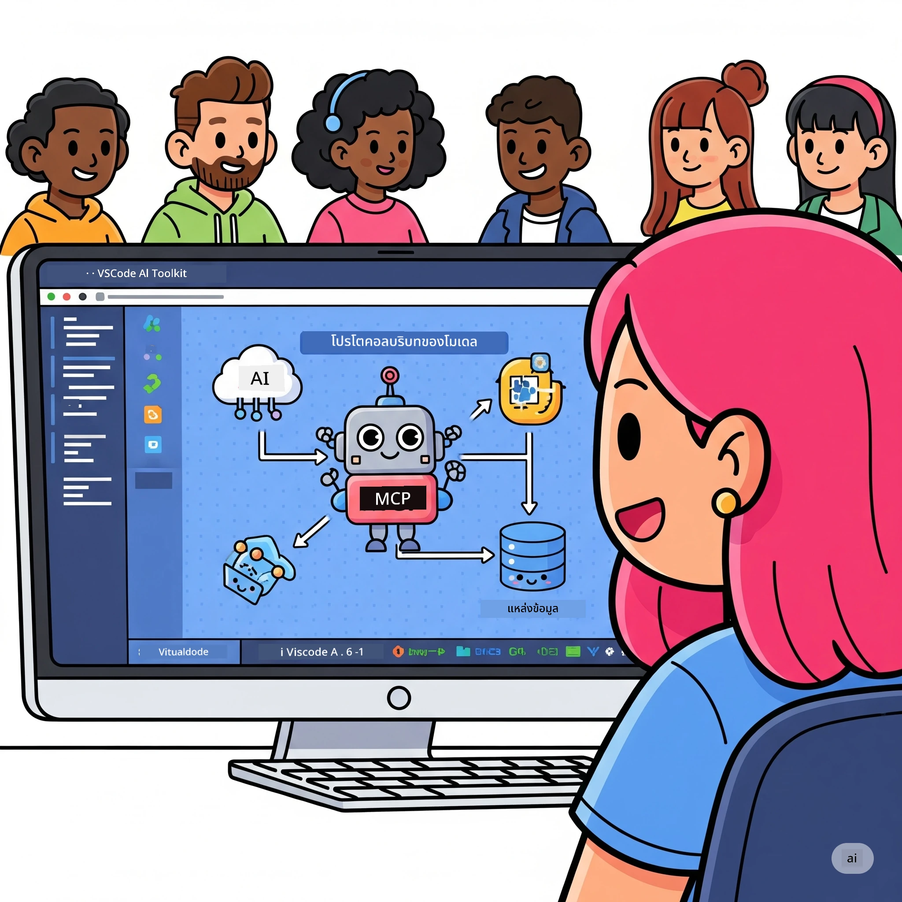
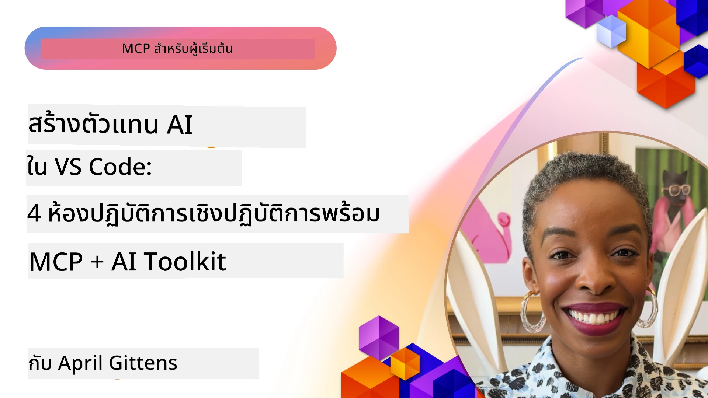

# การปรับปรุงกระบวนการทำงาน AI: การสร้างเซิร์ฟเวอร์ MCP ด้วย AI Toolkit

## 🎯 ภาพรวม

_(คลิกที่ภาพด้านบนเพื่อชมวิดีโอบทเรียนนี้)_

ยินดีต้อนรับสู่ **เวิร์กช็อป Model Context Protocol (MCP)**! เวิร์กช็อปฝึกปฏิบัติที่ครอบคลุมนี้ผสานสองเทคโนโลยีล้ำสมัยเพื่อปฏิวัติการพัฒนาแอปพลิเคชัน AI:

- **🔗 Model Context Protocol (MCP)**: มาตรฐานเปิดสำหรับการผสานเครื่องมือ AI อย่างไร้รอยต่อ
- **🛠️ AI Toolkit for Visual Studio Code (AITK)**: ส่วนขยายพัฒนา AI ทรงพลังจาก Microsoft

### 🎓 สิ่งที่คุณจะได้เรียนรู้

เมื่อสิ้นสุดเวิร์กช็อปนี้ คุณจะชำนาญการสร้างแอปพลิเคชันอัจฉริยะที่เชื่อมต่อโมเดล AI กับเครื่องมือและบริการในโลกจริง ตั้งแต่การทดสอบอัตโนมัติไปจนถึงการผสาน API แบบกำหนดเอง คุณจะได้รับทักษะเชิงปฏิบัติเพื่อแก้ปัญหาทางธุรกิจที่ซับซ้อน

## 🏗️ เทคโนโลยีที่ใช้

### 🔌 Model Context Protocol (MCP)

MCP คือ **"USB-C สำหรับ AI"** - มาตรฐานสากลที่เชื่อมต่อโมเดล AI กับเครื่องมือและแหล่งข้อมูลภายนอก

**✨ คุณสมบัติหลัก:**

- 🔄 **การผสานมาตรฐาน**: อินเทอร์เฟซสากลสำหรับการเชื่อมต่อเครื่องมือ AI
- 🏛️ **สถาปัตยกรรมยืดหยุ่น**: เซิร์ฟเวอร์ภายในเครื่องและระยะไกลผ่าน stdio/SSE transport
- 🧰 **ระบบนิเวศอุดมสมบูรณ์**: เครื่องมือ, คำสั่ง, และทรัพยากรในโปรโตคอลเดียว
- 🔒 **พร้อมใช้ในองค์กร**: ระบบความปลอดภัยและความเชื่อถือได้ในตัว

**🎯 ทำไม MCP ถึงสำคัญ:**
เหมือน USB-C ที่กำจัดความยุ่งยากของสายเคเบิล MCP ก็กำจัดความซับซ้อนของการผสาน AI โปรโตคอลเดียว โอกาสไม่จำกัด

### 🤖 AI Toolkit for Visual Studio Code (AITK)

ส่วนขยายพัฒนา AI ชั้นนำจาก Microsoft ที่เปลี่ยน VS Code ให้เป็นศูนย์กลาง AI ที่ทรงพลัง

**🚀 ความสามารถหลัก:**

- 📦 **แคตตาล็อกโมเดล**: เข้าถึงโมเดลจาก Azure AI, GitHub, Hugging Face, Ollama
- ⚡ **การรันแบบโลคัล**: การประมวลผล ONNX บน CPU/GPU/NPU
- 🏗️ **ผู้สร้างเอเย่นต์**: การพัฒนาเอเย่นต์ AI แบบมีภาพรวมที่ผสาน MCP
- 🎭 **หลายโหมด**: รองรับข้อความ, ภาพ, และผลลัพธ์แบบมีโครงสร้าง

**💡 ประโยชน์สำหรับการพัฒนา:**

- ปล่อยโมเดลแบบไม่ต้องตั้งค่า
- วิศวกรรมคำสั่งแบบมีภาพ
- สนามทดสอบแบบเรียลไทม์
- ผสานเซิร์ฟเวอร์ MCP อย่างไร้รอยต่อ

## 📚 เส้นทางการเรียนรู้

### [🚀 โมดูล 1: พื้นฐาน AI Toolkit](./lab1/README.md)

**ระยะเวลา**: 15 นาที

- 🛠️ ติดตั้งและกำหนดค่า AI Toolkit สำหรับ VS Code
- 🗂️ สำรวจแคตตาล็อกโมเดล (มากกว่า 100 โมเดลจาก GitHub, ONNX, OpenAI, Anthropic, Google)
- 🎮 เชี่ยวชาญสนามทดสอบแบบอินเทอร์แอคทีฟสำหรับทดสอบโมเดลแบบเรียลไทม์
- 🤖 สร้างเอเย่นต์ AI ตัวแรกด้วย Agent Builder
- 📊 ประเมินประสิทธิภาพโมเดลด้วยตัวชี้วัดในตัว (F1, ความสัมพันธ์, ความคล้ายคลึง, ความสอดคล้อง)
- ⚡ เรียนรู้การประมวลผลแบบแบตช์และความสามารถรองรับหลายโหมด

**🎯 ผลลัพธ์การเรียนรู้**: สร้างเอเย่นต์ AI ที่ใช้งานได้พร้อมความเข้าใจครบถ้วนในความสามารถของ AITK

### [🌐 โมดูล 2: MCP กับพื้นฐาน AI Toolkit](./lab2/README.md)

**ระยะเวลา**: 20 นาที

- 🧠 เชี่ยวชาญสถาปัตยกรรมและแนวคิดของ Model Context Protocol (MCP)
- 🌐 สำรวจระบบนิเวศเซิร์ฟเวอร์ MCP ของ Microsoft
- 🤖 สร้างเอเย่นต์อัตโนมัติผ่านเบราว์เซอร์โดยใช้ Playwright MCP Server
- 🔧 ผสานเซิร์ฟเวอร์ MCP กับ AI Toolkit Agent Builder
- 📊 กำหนดค่าและทดสอบเครื่องมือ MCP ภายในเอเย่นต์ของคุณ
- 🚀 ส่งออกและปล่อยเอเย่นต์ที่ทำงานด้วย MCP สู่การใช้งานจริง

**🎯 ผลลัพธ์การเรียนรู้**: ปล่อยเอเย่นต์ AI ที่มีพลังจากเครื่องมือภายนอกผ่าน MCP

### [🔧 โมดูล 3: การพัฒนา MCP ขั้นสูงด้วย AI Toolkit](./lab3/README.md)

**ระยะเวลา**: 20 นาที

- 💻 สร้างเซิร์ฟเวอร์ MCP แบบกำหนดเองโดยใช้ AI Toolkit
- 🐍 กำหนดค่าและใช้งาน MCP Python SDK รุ่นล่าสุด (v1.9.3)
- 🔍 ตั้งค่าและใช้งาน MCP Inspector สำหรับการดีบัก
- 🛠️ สร้าง Weather MCP Server พร้อมเวิร์กโฟลว์ดีบักขั้นสูง
- 🧪 ดีบักเซิร์ฟเวอร์ MCP ทั้งใน Agent Builder และสภาพแวดล้อม Inspector

**🎯 ผลลัพธ์การเรียนรู้**: พัฒนาและดีบักเซิร์ฟเวอร์ MCP แบบกำหนดเองด้วยเครื่องมือสมัยใหม่

### [🐙 โมดูล 4: การพัฒนา MCP แบบใช้งานจริง - เซิร์ฟเวอร์ GitHub Clone แบบกำหนดเอง](./lab4/README.md)

**ระยะเวลา**: 30 นาที

- 🏗️ สร้าง GitHub Clone MCP Server สำหรับเวิร์กโฟลว์การพัฒนาจริง
- 🔄 ใช้งานการโคลนรีโพซิทอรีแบบชาญฉลาดพร้อมการตรวจสอบและจัดการข้อผิดพลาด
- 📁 สร้างการจัดการไดเรกทอรีอัจฉริยะและผสานกับ VS Code
- 🤖 ใช้ GitHub Copilot Agent Mode กับเครื่องมือ MCP แบบกำหนดเอง
- 🛡️ ใช้มาตรฐานความน่าเชื่อถือพร้อมความเข้ากันได้ข้ามแพลตฟอร์มสำหรับการใช้งานจริง

**🎯 ผลลัพธ์การเรียนรู้**: ปล่อยเซิร์ฟเวอร์ MCP ที่พร้อมใช้งานจริงซึ่งช่วยปรับปรุงเวิร์กโฟลว์การพัฒนาจริง

## 💡 การใช้งานจริงและผลกระทบ

### 🏢 กรณีใช้งานสำหรับองค์กร

#### 🔄 อัตโนมัติ DevOps

เปลี่ยนเวิร์กโฟลว์การพัฒนาด้วยระบบอัตโนมัติอัจฉริยะ:

- **การจัดการรีโพซิทอรีอัจฉริยะ**: การตรวจสอบโค้ดและตัดสินใจรวมโค้ดด้วย AI
- **CI/CD อัจฉริยะ**: การปรับแต่งไพพลายน์โดยอัตโนมัติตามการเปลี่ยนแปลงโค้ด
- **การจัดการปัญหา**: การจำแนกและมอบหมายบั๊กอัตโนมัติ

#### 🧪 การปฏิวัติประกันคุณภาพ

ยกระดับการทดสอบด้วยระบบอัตโนมัติที่ขับเคลื่อนด้วย AI:

- **การสร้างเทสต์อัจฉริยะ**: สร้างชุดทดสอบครบถ้วนโดยอัตโนมัติ
- **การทดสอบรีเกรสชั่นเชิงภาพ**: ตรวจจับการเปลี่ยนแปลง UI ด้วย AI
- **การตรวจสอบประสิทธิภาพ**: การตรวจพบปัญหาเชิงรุกและแก้ไข

#### 📊 ความฉลาดของสายงานข้อมูล

สร้างเวิร์กโฟลว์การประมวลผลข้อมูลที่ชาญฉลาดกว่า:

- **กระบวนการ ETL ปรับตัวได้**: การแปลงข้อมูลที่ปรับปรุงตนเอง
- **การตรวจจับความผิดปกติ**: ตรวจสอบคุณภาพข้อมูลแบบเรียลไทม์
- **การจัดเส้นทางอัจฉริยะ**: การจัดการการไหลของข้อมูลที่ชาญฉลาด

#### 🎧 การยกระดับประสบการณ์ลูกค้า

สร้างปฏิสัมพันธ์กับลูกค้าอย่างยอดเยี่ยม:

- **การสนับสนุนที่รับรู้บริบท**: เอเย่นต์ AI ที่เข้าถึงประวัติลูกค้าได้
- **การแก้ปัญหาเชิงรุก**: บริการลูกค้าคาดการณ์ล่วงหน้า
- **การผสานหลายช่องทาง**: ประสบการณ์ AI เดียวกันบนทุกแพลตฟอร์ม

## 🛠️ ข้อกำหนดเบื้องต้นและการตั้งค่า

### 💻 ข้อกำหนดระบบ

| องค์ประกอบ | ความต้องการ | หมายเหตุ |
|-----------|-------------|-------|
| **ระบบปฏิบัติการ** | Windows 10+, macOS 10.15+, Linux | ระบบปฏิบัติการสมัยใหม่ใดก็ได้ |
| **Visual Studio Code** | เวอร์ชันเสถียรล่าสุด | จำเป็นสำหรับ AITK |
| **Node.js** | v18.0+ และ npm | สำหรับการพัฒนาเซิร์ฟเวอร์ MCP |
| **Python** | 3.10+ | ตัวเลือกสำหรับเซิร์ฟเวอร์ MCP แบบ Python |
| **หน่วยความจำ** | RAM 8GB ขั้นต่ำ | แนะนำ 16GB สำหรับโมเดลในเครื่อง |

### 🔧 สภาพแวดล้อมการพัฒนา

#### ส่วนขยาย VS Code ที่แนะนำ

- **AI Toolkit** (ms-windows-ai-studio.windows-ai-studio)
- **Python** (ms-python.python)
- **Python Debugger** (ms-python.debugpy)
- **GitHub Copilot** (GitHub.copilot) - ตัวเลือกแต่แนะนำ

#### เครื่องมือเสริม

- **uv**: ตัวจัดการแพ็กเกจ Python รุ่นใหม่
- **MCP Inspector**: เครื่องมือดีบักเชิงภาพสำหรับเซิร์ฟเวอร์ MCP
- **Playwright**: สำหรับตัวอย่างอัตโนมัติเว็บ

## 🎖️ ผลลัพธ์การเรียนรู้และเส้นทางการรับรอง

### 🏆 รายการตรวจสอบการเชี่ยวชาญทักษะ

เมื่อสำเร็จเวิร์กช็อปนี้ คุณจะมีความชำนาญใน:

#### 🎯 ความสามารถหลัก

- [ ] **ความเชี่ยวชาญใน MCP Protocol**: ความเข้าใจลึกซึ้งในสถาปัตยกรรมและรูปแบบการประยุกต์ใช้
- [ ] **ความชำนาญ AITK**: ใช้ AI Toolkit ระดับผู้เชี่ยวชาญเพื่อการพัฒนาอย่างรวดเร็ว
- [ ] **การพัฒนาเซิร์ฟเวอร์แบบกำหนดเอง**: สร้าง ปล่อย และดูแลรักษาเซิร์ฟเวอร์ MCP สำหรับใช้งานจริง
- [ ] **ความเป็นเลิศในการผสานเครื่องมือ**: เชื่อมต่อ AI กับเวิร์กโฟลว์การพัฒนาที่มีอยู่ได้อย่างสมูธ
- [ ] **การประยุกต์แก้ปัญหา**: ใช้ทักษะที่เรียนรู้แก้ไขปัญหาธุรกิจจริง

#### 🔧 ทักษะทางเทคนิค

- [ ] ตั้งค่าและกำหนดค่า AI Toolkit ใน VS Code
- [ ] ออกแบบและพัฒนาเซิร์ฟเวอร์ MCP แบบกำหนดเอง
- [ ] ผสานโมเดล GitHub กับสถาปัตยกรรม MCP
- [ ] สร้างเวิร์กโฟลว์การทดสอบอัตโนมัติด้วย Playwright
- [ ] ปล่อยเอเย่นต์ AI สำหรับใช้งานจริง
- [ ] ดีบักและเพิ่มประสิทธิภาพเซิร์ฟเวอร์ MCP

#### 🚀 ความสามารถขั้นสูง

- [ ] ออกแบบสถาปัตยกรรมการผสาน AI ขนาดองค์กร
- [ ] ใช้แนวทางปฏิบัติด้านความปลอดภัยสำหรับแอป AI
- [ ] ออกแบบสถาปัตยกรรมเซิร์ฟเวอร์ MCP ที่ปรับขยายได้
- [ ] สร้างโซลูชันเครื่องมือแบบกำหนดเฉพาะด้าน
- [ ] เป็นพี่เลี้ยงด้านการพัฒนา AI-เนทีฟ

## 📖 แหล่งข้อมูลเพิ่มเติม

- [ข้อกำหนด MCP (2025-11-25)](https://spec.modelcontextprotocol.io/specification/2025-11-25/)
- [ที่เก็บโค้ด AI Toolkit บน GitHub](https://github.com/microsoft/vscode-ai-toolkit)
- [ตัวอย่างเซิร์ฟเวอร์ MCP](https://github.com/modelcontextprotocol/servers)
- [คู่มือแนวปฏิบัติที่ดีที่สุด](https://modelcontextprotocol.io/docs/best-practices)
- [OWASP MCP Top 10](https://microsoft.github.io/mcp-azure-security-guide/mcp/) - แนวปฏิบัติด้านความปลอดภัย

---

**🚀 พร้อมปฏิวัติการพัฒนา AI ของคุณแล้วหรือยัง?**

มาร่วมกันสร้างอนาคตของแอปพลิเคชันอัจฉริยะกับ MCP และ AI Toolkit!

## ต่อไป

ดำเนินการต่อไปที่: [โมดูล 11: ห้องปฏิบัติการเซิร์ฟเวอร์ MCP](../11-MCPServerHandsOnLabs/README.md)

---

<!-- CO-OP TRANSLATOR DISCLAIMER START -->
**ข้อจำกัดความรับผิดชอบ**:  
เอกสารนี้ได้ถูกแปลโดยใช้บริการแปลภาษาด้วย AI [Co-op Translator](https://github.com/Azure/co-op-translator) แม้เราจะพยายามให้มีความถูกต้อง แต่โปรดทราบว่าการแปลอัตโนมัติอาจมีข้อผิดพลาดหรือความคลาดเคลื่อน เอกสารต้นฉบับในภาษาต้นทางควรถูกพิจารณาเป็นแหล่งข้อมูลที่เชื่อถือได้ สำหรับข้อมูลสำคัญ แนะนำให้ใช้บริการแปลโดยมนุษย์มืออาชีพ เราไม่รับผิดชอบต่อความเข้าใจผิดหรือการตีความที่ผิดพลาดที่เกิดจากการใช้การแปลนี้
<!-- CO-OP TRANSLATOR DISCLAIMER END -->