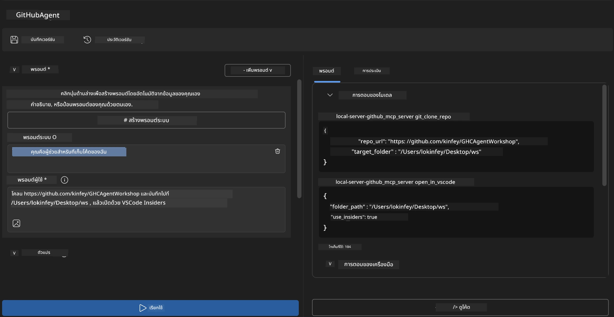

# 🐙 โมดูล 4: การพัฒนา MCP เชิงปฏิบัติ - เซิร์ฟเวอร์โคลน GitHub แบบกำหนดเอง


> **⚡ การเริ่มต้นอย่างรวดเร็ว:** สร้างเซิร์ฟเวอร์ MCP ที่พร้อมใช้งานในระบบจริงซึ่งทำงานอัตโนมัติโคลนรีโพสิทอรี GitHub และผสานรวมกับ VS Code ในเวลาเพียง 30 นาที!

## 🎯 วัตถุประสงค์การเรียนรู้

เมื่อจบแลปนี้ คุณจะสามารถ:

- ✅ สร้างเซิร์ฟเวอร์ MCP แบบกำหนดเองสำหรับเวิร์กโฟลว์การพัฒนาจริง
- ✅ ทำฟังก์ชันโคลนรีโพสิทอรี GitHub ผ่าน MCP
- ✅ ผสานรวมเซิร์ฟเวอร์ MCP แบบกำหนดเองกับ VS Code และ Agent Builder
- ✅ ใช้โหมด GitHub Copilot Agent กับเครื่องมือ MCP แบบกำหนดเอง
- ✅ ทดสอบและปรับใช้เซิร์ฟเวอร์ MCP แบบกำหนดเองในสภาพแวดล้อมการผลิต

## 📋 ข้อกำหนดเบื้องต้น

- ผ่านแลปที่ 1-3 (พื้นฐาน MCP และการพัฒนาขั้นสูง)
- สมัครสมาชิก GitHub Copilot ([สมัครฟรีได้ที่นี่](https://github.com/github-copilot/signup))
- VS Code พร้อมส่วนเสริม AI Toolkit และ GitHub Copilot
- ติดตั้งและตั้งค่า Git CLI แล้ว

## 🏗️ ภาพรวมโปรเจกต์

### **ความท้าทายการพัฒนาในโลกจริง**
ในฐานะนักพัฒนา เรามักใช้ GitHub เพื่อโคลนรีโพสิทอรีและเปิดใน VS Code หรือ VS Code Insiders ซึ่งกระบวนการนี้ต้องทำด้วยมือคือ:
1. เปิดเทอร์มินัล/พรอมต์คำสั่ง
2. ไปยังไดเรกทอรีที่ต้องการ
3. รันคำสั่ง `git clone`
4. เปิด VS Code ในไดเรกทอรีที่โคลนมา

**โซลูชัน MCP ของเราทำให้ขั้นตอนนี้เหลือเพียงคำสั่งอัจฉริยะเดียว!**

### **สิ่งที่คุณจะสร้าง**
**เซิร์ฟเวอร์ GitHub Clone MCP** (`git_mcp_server`) ที่ให้:

| คุณสมบัติ | คำอธิบาย | ประโยชน์ |
|---------|-------------|---------|
| 🔄 **โคลนรีโพสิทอรีอัจฉริยะ** | โคลนรีโพสิทอรี GitHub พร้อมตรวจสอบความถูกต้อง | ตรวจสอบข้อผิดพลาดอัตโนมัติ |
| 📁 **จัดการไดเรกทอรีอย่างชาญฉลาด** | ตรวจสอบและสร้างไดเรกทอรีอย่างปลอดภัย | ป้องกันการเขียนทับข้อมูล |
| 🚀 **ผสานรวม VS Code ข้ามแพลตฟอร์ม** | เปิดโปรเจกต์ใน VS Code/Insiders | เปลี่ยนเวิร์กโฟลว์อย่างไร้รอยต่อ |
| 🛡️ **จัดการข้อผิดพลาดอย่างเข้มแข็ง** | จัดการปัญหาเครือข่าย, สิทธิ์ และเส้นทาง | ความน่าเชื่อถือสำหรับการใช้งานจริง |

---

## 📖 การดำเนินการทีละขั้นตอน

### ขั้นตอนที่ 1: สร้าง GitHub Agent ใน Agent Builder

1. **เปิด Agent Builder** ผ่านส่วนเสริม AI Toolkit
2. **สร้างเอเจนต์ใหม่** ด้วยการตั้งค่าดังนี้:
   ```
   Agent Name: GitHubAgent
   ```

3. **เริ่มต้นเซิร์ฟเวอร์ MCP แบบกำหนดเอง:**
   - ไปที่ **เครื่องมือ (Tools)** → **เพิ่มเครื่องมือ (Add Tool)** → **MCP Server**
   - เลือก **"สร้าง MCP Server ใหม่"**
   - เลือก **เทมเพลต Python** เพื่อความยืดหยุ่นสูงสุด
   - **ชื่อเซิร์ฟเวอร์:** `git_mcp_server`

### ขั้นตอนที่ 2: ตั้งค่าโหมด GitHub Copilot Agent

1. **เปิด GitHub Copilot** ใน VS Code (กด Ctrl/Cmd + Shift + P → "GitHub Copilot: Open")
2. **เลือกโมเดล Agent** ในอินเทอร์เฟซ Copilot
3. **เลือกโมเดล Claude 3.7** เพื่อเพิ่มความสามารถในการวิเคราะห์
4. **เปิดใช้งานการผสาน MCP** เพื่อเข้าถึงเครื่องมือ

> **💡 เคล็ดลับมือโปร:** Claude 3.7 ให้ความเข้าใจลึกซึ้งเกี่ยวกับเวิร์กโฟลว์การพัฒนาและรูปแบบจัดการข้อผิดพลาด

### ขั้นตอนที่ 3: พัฒนาฟังก์ชันหลักของเซิร์ฟเวอร์ MCP

**ใช้พรอมต์รายละเอียดนี้กับโหมด GitHub Copilot Agent:**

```
Create two MCP tools with the following comprehensive requirements:

🔧 TOOL A: clone_repository
Requirements:
- Clone any GitHub repository to a specified local folder
- Return the absolute path of the successfully cloned project
- Implement comprehensive validation:
  ✓ Check if target directory already exists (return error if exists)
  ✓ Validate GitHub URL format (https://github.com/user/repo)
  ✓ Verify git command availability (prompt installation if missing)
  ✓ Handle network connectivity issues
  ✓ Provide clear error messages for all failure scenarios

🚀 TOOL B: open_in_vscode
Requirements:
- Open specified folder in VS Code or VS Code Insiders
- Cross-platform compatibility (Windows/Linux/macOS)
- Use direct application launch (not terminal commands)
- Auto-detect available VS Code installations
- Handle cases where VS Code is not installed
- Provide user-friendly error messages

Additional Requirements:
- Follow MCP 1.9.3 best practices
- Include proper type hints and documentation
- Implement logging for debugging purposes
- Add input validation for all parameters
- Include comprehensive error handling
```

### ขั้นตอนที่ 4: ทดสอบเซิร์ฟเวอร์ MCP ของคุณ

#### 4a. ทดสอบใน Agent Builder

1. **เริ่มต้นคอนฟิกดีบัก** สำหรับ Agent Builder
2. **ตั้งค่าเอเจนต์ของคุณด้วยพรอมต์ระบบนี้:**

```
SYSTEM_PROMPT:
You are my intelligent coding repository assistant. You help developers efficiently clone GitHub repositories and set up their development environment. Always provide clear feedback about operations and handle errors gracefully.
```

3. **ทดสอบด้วยสถานการณ์ผู้ใช้สมจริง:**

```
USER_PROMPT EXAMPLES:

Scenario : Basic Clone and Open
"Clone {Your GitHub Repo link such as https://github.com/kinfey/GHCAgentWorkshop
 } and save to {The global path you specify}, then open it with VS Code Insiders"
```



**ผลลัพธ์ที่คาดหวัง:**
- ✅ โคลนสำเร็จพร้อมยืนยันเส้นทาง
- ✅ เปิด VS Code อัตโนมัติ
- ✅ แสดงข้อความผิดพลาดชัดเจนสำหรับสถานการณ์ไม่ถูกต้อง
- ✅ จัดการกรณีขอบเขตอย่างเหมาะสม

#### 4b. ทดสอบใน MCP Inspector


---


**🎉 ยินดีด้วย!** คุณสร้างเซิร์ฟเวอร์ MCP ที่ใช้งานได้จริงและพร้อมใช้งานในระบบจริงซึ่งแก้ไขปัญหาเวิร์กโฟลว์การพัฒนาความเป็นจริง เซิร์ฟเวอร์โคลน GitHub แบบกำหนดเองของคุณแสดงพลังของ MCP ในการทำงานอัตโนมัติและเพิ่มประสิทธิภาพนักพัฒนา

### 🏆 ความสำเร็จที่ได้รับ:
- ✅ **MCP Developer** - สร้างเซิร์ฟเวอร์ MCP แบบกำหนดเอง
- ✅ **Workflow Automator** - ปรับปรุงกระบวนการพัฒนา 
- ✅ **Integration Expert** - เชื่อมต่อเครื่องมือพัฒนาหลายตัว
- ✅ **พร้อมใช้งานในระบบจริง** - สร้างโซลูชันสำหรับปรับใช้

---

## 🎓 การจบเวิร์กช็อป: การเดินทางของคุณกับ Model Context Protocol

**เรียน ผู้เข้าร่วมเวิร์กช็อป,**

ขอแสดงความยินดีที่คุณผ่านโมดูลทั้งสี่ของเวิร์กช็อป Model Context Protocol มาได้ไกลจากการเข้าใจพื้นฐาน AI Toolkit ไปจนถึงการสร้างเซิร์ฟเวอร์ MCP ที่ใช้งานได้จริงซึ่งแก้ไขปัญหาการพัฒนาจริง

### 🚀 สรุปเส้นทางการเรียนรู้ของคุณ:

**[โมดูล 1](../lab1/README.md)**: เริ่มต้นด้วยการสำรวจพื้นฐาน AI Toolkit, การทดสอบโมเดล และสร้างเอเจนต์ AI ตัวแรกของคุณ

**[โมดูล 2](../lab2/README.md)**: เรียนรู้สถาปัตยกรรม MCP, ผสาน Playwright MCP และสร้างเอเจนต์อัตโนมัติในเบราว์เซอร์ตัวแรก

**[โมดูล 3](../lab3/README.md)**: ก้าวไปสู่การพัฒนาเซิร์ฟเวอร์ MCP แบบกำหนดเองด้วย Weather MCP Server และฝึกใช้เครื่องมือดีบัก

**[โมดูล 4](../lab4/README.md)**: ใช้ความรู้ทั้งหมดสร้างเครื่องมืออัตโนมัติในเวิร์กโฟลว์รีโพสิทอรี GitHub ที่ใช้งานได้จริง

### 🌟 สิ่งที่คุณเชี่ยวชาญ:

- ✅ **ระบบนิเวศ AI Toolkit**: โมเดล เอเจนต์ และรูปแบบการผสาน
- ✅ **สถาปัตยกรรม MCP**: การออกแบบไคลเอนต์-เซิร์ฟเวอร์ โปรโตคอลการส่งข้อมูล และความปลอดภัย
- ✅ **เครื่องมือสำหรับนักพัฒนา**: จาก Playground ถึง Inspector ถึงการปรับใช้จริง
- ✅ **การพัฒนาแบบกำหนดเอง**: สร้าง ทดสอบ และปรับใช้เซิร์ฟเวอร์ MCP ของตัวเอง
- ✅ **การใช้งานเชิงปฏิบัติ**: แก้ไขปัญหาเวิร์กโฟลว์จริงด้วย AI

### 🔮 ขั้นตอนต่อไปของคุณ:

1. **สร้างเซิร์ฟเวอร์ MCP ของคุณเอง**: ใช้ทักษะนี้เพื่อทำเวิร์กโฟลว์เฉพาะตัวให้อัตโนมัติ
2. **เข้าร่วมชุมชน MCP**: แชร์ผลงานและเรียนรู้จากผู้อื่น
3. **สำรวจการผสานขั้นสูง**: เชื่อมต่อเซิร์ฟเวอร์ MCP กับระบบองค์กร
4. **ร่วมพัฒนาโอเพ่นซอร์ส**: ช่วยปรับปรุงเครื่องมือและเอกสาร MCP

โปรดจำไว้ว่าเวิร์กช็อปนี้เป็นเพียงจุดเริ่มต้น ระบบนิเวศ Model Context Protocol กำลังพัฒนาอย่างรวดเร็ว และตอนนี้คุณพร้อมที่จะนำหน้าด้านเครื่องมือพัฒนา AI

**ขอบคุณสำหรับการเข้าร่วมและความทุ่มเทในการเรียนรู้!**

เราหวังว่าเวิร์กช็อปนี้จะจุดประกายไอเดียที่เปลี่ยนแปลงวิธีการสร้างและโต้ตอบกับเครื่องมือ AI ในเส้นทางการพัฒนาของคุณ

**ขอให้สนุกกับการเขียนโค้ด!**

---

## ต่อไปคืออะไร

ขอแสดงความยินดีที่คุณผ่านแลปทั้งหมดในโมดูล 10!

- กลับไปที่: [ภาพรวมโมดูล 10](../README.md)
- ต่อไปที่: [โมดูล 11: แลป MCP Server ทำเอง](../../11-MCPServerHandsOnLabs/README.md)

---

<!-- CO-OP TRANSLATOR DISCLAIMER START -->
**ข้อจำกัดความรับผิดชอบ**:  
เอกสารฉบับนี้ได้รับการแปลโดยใช้บริการแปลภาษา AI [Co-op Translator](https://github.com/Azure/co-op-translator) แม้ว่าเราจะพยายามให้ความถูกต้องสูงสุด แต่โปรดทราบว่าการแปลอัตโนมัติอาจมีข้อผิดพลาดหรือความไม่ถูกต้อง เอกสารต้นฉบับในภาษาต้นทางถือเป็นแหล่งข้อมูลที่เชื่อถือได้ สำหรับข้อมูลที่สำคัญ แนะนำให้ใช้การแปลโดยผู้เชี่ยวชาญมนุษย์ เราไม่รับผิดชอบต่อความเข้าใจผิดหรือการตีความผิดที่เกิดขึ้นจากการใช้การแปลนี้
<!-- CO-OP TRANSLATOR DISCLAIMER END -->