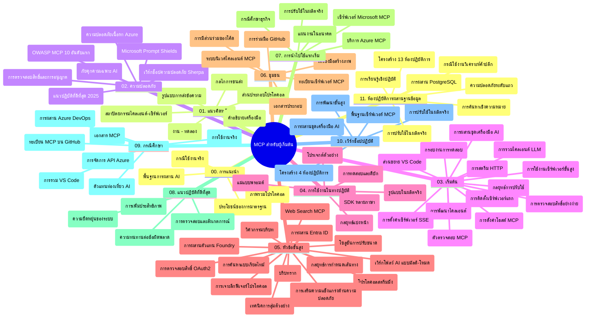

# Model Context Protocol (MCP) สำหรับผู้เริ่มต้น - คู่มือการศึกษา

คู่มือการศึกษานี้ให้ภาพรวมของโครงสร้างและเนื้อหาของที่เก็บข้อมูลสำหรับหลักสูตร "Model Context Protocol (MCP) สำหรับผู้เริ่มต้น" ใช้คู่มือนี้เพื่อดูแลที่เก็บข้อมูลอย่างมีประสิทธิภาพและใช้ประโยชน์สูงสุดจากทรัพยากรที่มีอยู่

## ภาพรวมของที่เก็บข้อมูล

Model Context Protocol (MCP) เป็นกรอบมาตรฐานสำหรับการโต้ตอบระหว่างโมเดล AI และแอปพลิเคชันลูกค้า ซึ่งสร้างขึ้นครั้งแรกโดย Anthropic และขณะนี้ได้รับการดูแลโดยชุมชน MCP ที่กว้างขึ้นผ่านองค์กร GitHub ทางการ ที่เก็บข้อมูลนี้ให้หลักสูตรครบถ้วนพร้อมตัวอย่างโค้ดปฏิบัติในภาษา C#, Java, JavaScript, Python และ TypeScript ที่ออกแบบมาสำหรับนักพัฒนา AI สถาปนิกระบบ และวิศวกรซอฟต์แวร์

## แผนที่หลักสูตรเชิงภาพ

## โครงสร้างของที่เก็บข้อมูล

ที่เก็บข้อมูลถูกจัดเป็นสิบเอ็ดส่วนหลัก ๆ แต่ละส่วนมุ่งเน้นที่แง่มุมต่าง ๆ ของ MCP:

1. **บทนำ (00-Introduction/)**
   - ภาพรวมของ Model Context Protocol
   - เหตุผลที่การมาตรฐานมีความสำคัญในกระบวนการ AI
   - กรณีใช้งานและประโยชน์ในทางปฏิบัติ

2. **แนวคิดหลัก (01-CoreConcepts/)**
   - สถาปัตยกรรมไคลเอนต์-เซิร์ฟเวอร์
   - ส่วนประกอบหลักของโปรโตคอล
   - รูปแบบการส่งข้อความใน MCP

3. **ความปลอดภัย (02-Security/)**
   - ภัยคุกคามด้านความปลอดภัยในระบบที่ใช้ MCP
   - แนวทางปฏิบัติที่ดีที่สุดในการรักษาความปลอดภัยการใช้งาน
   - กลยุทธ์การยืนยันตัวตนและการอนุญาต
   - **เอกสารความปลอดภัยแบบครอบคลุม**:
     - MCP Security Best Practices 2025
     - Azure Content Safety Implementation Guide
     - MCP Security Controls and Techniques
     - MCP Best Practices Quick Reference
   - **หัวข้อความปลอดภัยสำคัญ**:
     - การโจมตีแบบ prompt injection และ tool poisoning
     - การยึดเซสชันและปัญหา confused deputy
     - ช่องโหว่การส่งผ่านโทเค็น
     - การอนุญาตเกินพิกัดและการควบคุมการเข้าถึง
     - ความปลอดภัยในซัพพลายเชนสำหรับองค์ประกอบ AI
     - การผสาน Microsoft Prompt Shields

4. **เริ่มต้นใช้งาน (03-GettingStarted/)**
   - การตั้งค่าและกำหนดค่าสภาพแวดล้อม
   - การสร้างเซิร์ฟเวอร์และไคลเอนต์ MCP ขั้นพื้นฐาน
   - การผสานรวมกับแอปพลิเคชันที่มีอยู่
   - รวมถึงส่วนต่าง ๆ สำหรับ:
     - การสร้างเซิร์ฟเวอร์ครั้งแรก
     - การพัฒนาไคลเอนต์
     - การผสานไคลเอนต์ LLM
     - การผสานกับ VS Code
     - เซิร์ฟเวอร์ Server-Sent Events (SSE)
     - การใช้งานเซิร์ฟเวอร์ขั้นสูง
     - การสตรีม HTTP
     - การผสาน AI Toolkit
     - กลยุทธ์การทดสอบ
     - แนวทางการปรับใช้

5. **การใช้งานจริง (04-PracticalImplementation/)**
   - การใช้ SDK ในภาษาการเขียนโปรแกรมต่าง ๆ
   - เทคนิคการดีบัก ทดสอบ และตรวจสอบความถูกต้อง
   - การออกแบบเทมเพลต prompt และเวิร์กโฟลว์ที่ใช้ซ้ำได้
   - โครงการตัวอย่างพร้อมตัวอย่างการใช้งาน

6. **หัวข้อขั้นสูง (05-AdvancedTopics/)**
   - เทคนิควิศวกรรมบริบท
   - การผสาน agent ของ Foundry
   - เวิร์กโฟลว์ AI แบบมัลติโมดัล
   - ตัวอย่างการยืนยันตัวตน OAuth2
   - ความสามารถการค้นหาแบบเรียลไทม์
   - การสตรีมข้อมูลแบบเรียลไทม์
   - การใช้งาน context หลัก (root contexts)
   - กลยุทธ์การกำหนดเส้นทาง
   - เทคนิคการสุ่มตัวอย่าง
   - แนวทางการปรับขนาด
   - การพิจารณาด้านความปลอดภัย
   - การผสานความปลอดภัย Entra ID
   - การผสานการค้นหาเว็บ

7. **การมีส่วนร่วมของชุมชน (06-CommunityContributions/)**
   - วิธีการมีส่วนร่วมเขียนโค้ดและเอกสาร
   - การทำงานร่วมกันผ่าน GitHub
   - การปรับปรุงและข้อเสนอแนะโดยชุมชน
   - การใช้ไคลเอนต์ MCP ต่าง ๆ (Claude Desktop, Cline, VSCode)
   - การทำงานกับเซิร์ฟเวอร์ MCP ที่ได้รับความนิยมรวมถึงการสร้างภาพ

8. **บทเรียนจากการนำไปใช้ตั้งแต่เนิ่น ๆ (07-LessonsfromEarlyAdoption/)**
   - การนำไปใช้งานจริงและเรื่องราวความสำเร็จ
   - การสร้างและปรับใช้โซลูชันที่ใช้ MCP
   - แนวโน้มและแผนงานในอนาคต
   - **คู่มือเซิร์ฟเวอร์ MCP ของ Microsoft**: คู่มือครบเครื่องเกี่ยวกับเซิร์ฟเวอร์ MCP ของ Microsoft พร้อมใช้งาน 10 รายการ ได้แก่:
     - Microsoft Learn Docs MCP Server
     - Azure MCP Server (ตัวเชื่อมต่อเฉพาะ 15+ ตัว)
     - GitHub MCP Server
     - Azure DevOps MCP Server
     - MarkItDown MCP Server
     - SQL Server MCP Server
     - Playwright MCP Server
     - Dev Box MCP Server
     - Azure AI Foundry MCP Server
     - Microsoft 365 Agents Toolkit MCP Server

9. **แนวทางปฏิบัติที่ดีที่สุด (08-BestPractices/)**
   - การปรับแต่งและเพิ่มประสิทธิภาพการทำงาน
   - การออกแบบระบบ MCP ที่ทนทานต่อความผิดพลาด
   - กลยุทธ์การทดสอบและความสามารถในการฟื้นฟู

10. **กรณีศึกษา (09-CaseStudy/)**
    - **กรณีศึกษาเชิงลึกเจ็ดกรณี** ที่แสดงถึงความสามารถหลากหลายของ MCP ในสถานการณ์ต่าง ๆ:
    - **Azure AI Travel Agents**: การประสานงานหลายตัวแทนด้วย Azure OpenAI และ AI Search
    - **การรวม Azure DevOps**: การทำงานอัตโนมัติของเวิร์กโฟลว์ด้วยการอัปเดตข้อมูลจาก YouTube
    - **การดึงเอกสารแบบเรียลไทม์**: ไคลเอนต์คอนโซล Python พร้อมการสตรีม HTTP
    - **เครื่องมือสร้างแผนการศึกษาแบบโต้ตอบ**: เว็บแอป Chainlit พร้อม AI สื่อสาร
    - **เอกสารในตัวแก้ไข**: การผสาน VS Code กับเวิร์กโฟลว์ GitHub Copilot
    - **การจัดการ API ของ Azure**: การรวม API ระดับองค์กรพร้อมสร้างเซิร์ฟเวอร์ MCP
    - **ทะเบียน MCP ของ GitHub**: การพัฒนาระบบนิเวศและแพลตฟอร์มการผสาน agent
    - ตัวอย่างการใช้งานที่ครอบคลุมการรวมระดับองค์กร การเพิ่มประสิทธิภาพนักพัฒนา และการพัฒนาระบบนิเวศ

11. **เวิร์กช็อปปฏิบัติ (10-StreamliningAIWorkflowsBuildingAnMCPServerWithAIToolkit/)**
    - เวิร์กช็อปเชิงปฏิบัติแบบครบวงจรรวม MCP กับ AI Toolkit
    - การสร้างแอปพลิเคชันอัจฉริยะที่เชื่อมต่อโมเดล AI กับเครื่องมือในโลกจริง
    - โมดูลปฏิบัติครอบคลุมพื้นฐาน การพัฒนาเซิร์ฟเวอร์เฉพาะ และแนวทางการปรับใช้ในสภาพแวดล้อมจริง
    - **โครงสร้างห้องปฏิบัติการ**:
      - ห้องปฏิบัติการ 1: พื้นฐานเซิร์ฟเวอร์ MCP
      - ห้องปฏิบัติการ 2: การพัฒนาเซิร์ฟเวอร์ MCP ขั้นสูง
      - ห้องปฏิบัติการ 3: การผสาน AI Toolkit
      - ห้องปฏิบัติการ 4: การปรับใช้และการปรับขนาดในสภาพแวดล้อมจริง
    - วิธีเรียนรู้ผ่านห้องปฏิบัติการพร้อมคำแนะนำทีละขั้นตอน

12. **ห้องปฏิบัติการการผสานฐานข้อมูลเซิร์ฟเวอร์ MCP (11-MCPServerHandsOnLabs/)**
    - **เส้นทางการเรียนรู้ 13 ห้องปฏิบัติการครบถ้วน** สำหรับสร้างเซิร์ฟเวอร์ MCP พร้อมใช้งานจริงที่ผสาน PostgreSQL
    - **การใช้งานวิเคราะห์ค้าปลีกจริง** กับกรณีศึกษาการใช้ Zava Retail
    - **รูปแบบระดับองค์กร** รวม Row Level Security (RLS), การค้นหาความหมาย และการเข้าถึงข้อมูลหลายผู้เช่า
    - **โครงสร้างห้องปฏิบัติการครบถ้วน**:
      - **ห้องปฏิบัติการ 00-03: พื้นฐาน** - บทนำ, สถาปัตยกรรม, ความปลอดภัย, การตั้งค่าสภาพแวดล้อม
      - **ห้องปฏิบัติการ 04-06: การสร้างเซิร์ฟเวอร์ MCP** - การออกแบบฐานข้อมูล, การใช้งานเซิร์ฟเวอร์ MCP, การพัฒนาเครื่องมือ
      - **ห้องปฏิบัติการ 07-09: ฟีเจอร์ขั้นสูง** - การค้นหาความหมาย, การทดสอบและดีบัก, การผสานกับ VS Code
      - **ห้องปฏิบัติการ 10-12: การปรับใช้และแนวทางปฏิบัติที่ดีที่สุด** - การปรับใช้, การตรวจสอบ, การเพิ่มประสิทธิภาพ
    - **เทคโนโลยีที่ครอบคลุม**: FastMCP framework, PostgreSQL, Azure OpenAI, Azure Container Apps, Application Insights
    - **ผลลัพธ์การเรียนรู้**: เซิร์ฟเวอร์ MCP พร้อมใช้งานจริง, รูปแบบการผสานฐานข้อมูล, การวิเคราะห์ด้วย AI, ความปลอดภัยระดับองค์กร

## ทรัพยากรเพิ่มเติม

ที่เก็บข้อมูลรวมทรัพยากรสนับสนุน:

- **โฟลเดอร์รูปภาพ**: มีไดอะแกรมและภาพประกอบที่ใช้ตลอดหลักสูตร
- **การแปลภาษา**: รองรับหลายภาษาโดยใช้การแปลเอกสารอัตโนมัติ
- **ทรัพยากร MCP ทางการ**:
  - [MCP Documentation](https://modelcontextprotocol.io/)
  - [MCP Specification](https://spec.modelcontextprotocol.io/)
  - [MCP GitHub Repository](https://github.com/modelcontextprotocol)

## วิธีการใช้ที่เก็บข้อมูลนี้

1. **การเรียนรู้เป็นลำดับ**: ทำตามบทต่าง ๆ ตามลำดับ (00 ถึง 11) เพื่อประสบการณ์เรียนรู้ที่เป็นระบบ
2. **มุ่งเน้นภาษาที่ต้องการ**: หากสนใจภาษาการเขียนโปรแกรมใด ให้สำรวจไดเรกทอรีตัวอย่างสำหรับการใช้งานในภาษาที่คุณเลือก
3. **การใช้งานจริง**: เริ่มที่ส่วน "เริ่มต้นใช้งาน" เพื่อตั้งค่าสภาพแวดล้อมและสร้างเซิร์ฟเวอร์และไคลเอนต์ MCP ครั้งแรกของคุณ
4. **การสำรวจขั้นสูง**: เมื่อเข้าใจพื้นฐานแล้ว ให้ลงลึกในหัวข้อขั้นสูงเพื่อขยายความรู้
5. **การมีส่วนร่วมในชุมชน**: เข้าร่วมชุมชน MCP ผ่านการสนทนา GitHub และช่องทาง Discord เพื่อเชื่อมต่อกับผู้เชี่ยวชาญและนักพัฒนาร่วมกัน

## ไคลเอนต์และเครื่องมือ MCP

หลักสูตรครอบคลุมไคลเอนต์และเครื่องมือ MCP ต่าง ๆ:

1. **ไคลเอนต์ทางการ**:
   - Visual Studio Code
   - MCP ใน Visual Studio Code
   - Claude Desktop
   - Claude ใน VSCode
   - Claude API

2. **ไคลเอนต์ชุมชน**:
   - Cline (เชลล์เทอร์มินัล)
   - Cursor (ตัวแก้ไขโค้ด)
   - ChatMCP
   - Windsurf

3. **เครื่องมือจัดการ MCP**:
   - MCP CLI
   - MCP Manager
   - MCP Linker
   - MCP Router

## เซิร์ฟเวอร์ MCP ที่ได้รับความนิยม

ที่เก็บข้อมูลแนะนำเซิร์ฟเวอร์ MCP หลากหลาย รวมถึง:

1. **เซิร์ฟเวอร์ MCP ของ Microsoft ทางการ**:
   - Microsoft Learn Docs MCP Server
   - Azure MCP Server (ตัวเชื่อมต่อเฉพาะ 15+ ตัว)
   - GitHub MCP Server
   - Azure DevOps MCP Server
   - MarkItDown MCP Server
   - SQL Server MCP Server
   - Playwright MCP Server
   - Dev Box MCP Server
   - Azure AI Foundry MCP Server
   - Microsoft 365 Agents Toolkit MCP Server

2. **เซิร์ฟเวอร์อ้างอิงทางการ**:
   - Filesystem
   - Fetch
   - Memory
   - Sequential Thinking

3. **การสร้างภาพ**:
   - Azure OpenAI DALL-E 3
   - Stable Diffusion WebUI
   - Replicate

4. **เครื่องมือพัฒนา**:
   - Git MCP
   - Terminal Control
   - Code Assistant

5. **เซิร์ฟเวอร์เฉพาะทาง**:
   - Salesforce
   - Microsoft Teams
   - Jira & Confluence

## การมีส่วนร่วม

ที่เก็บข้อมูลนี้เปิดรับการมีส่วนร่วมจากชุมชน ดูส่วนการมีส่วนร่วมของชุมชนเพื่อคำแนะนำในการมีส่วนร่วมอย่างมีประสิทธิภาพกับระบบนิเวศ MCP

----

*คู่มือการศึกษานี้ได้รับการอัปเดตครั้งล่าสุดเมื่อวันที่ 5 กุมภาพันธ์ 2026 ซึ่งสะท้อน MCP Specification ล่าสุด (2025-11-25) และให้ภาพรวมของที่เก็บข้อมูล ณ วันที่นั้น เนื้อหาในที่เก็บอาจมีการอัปเดตหลังจากวันที่นี้*

---

<!-- CO-OP TRANSLATOR DISCLAIMER START -->
**ข้อจำกัดความรับผิดชอบ**:
เอกสารนี้ได้รับการแปลโดยใช้บริการแปลภาษาอัตโนมัติ [Co-op Translator](https://github.com/Azure/co-op-translator) แม้ว่าเราจะพยายามให้ความถูกต้อง โปรดทราบว่าการแปลด้วยระบบอัตโนมัติอาจมีข้อผิดพลาดหรือความไม่ถูกต้อง เอกสารต้นฉบับในภาษาต้นฉบับถือเป็นแหล่งข้อมูลที่เชื่อถือได้ สำหรับข้อมูลสำคัญ แนะนำให้ใช้การแปลโดยผู้เชี่ยวชาญมนุษย์เท่านั้น เราจะไม่รับผิดชอบต่อความเข้าใจผิดหรือการตีความที่ผิดพลาดใด ๆ ที่เกิดขึ้นจากการใช้การแปลนี้
<!-- CO-OP TRANSLATOR DISCLAIMER END -->