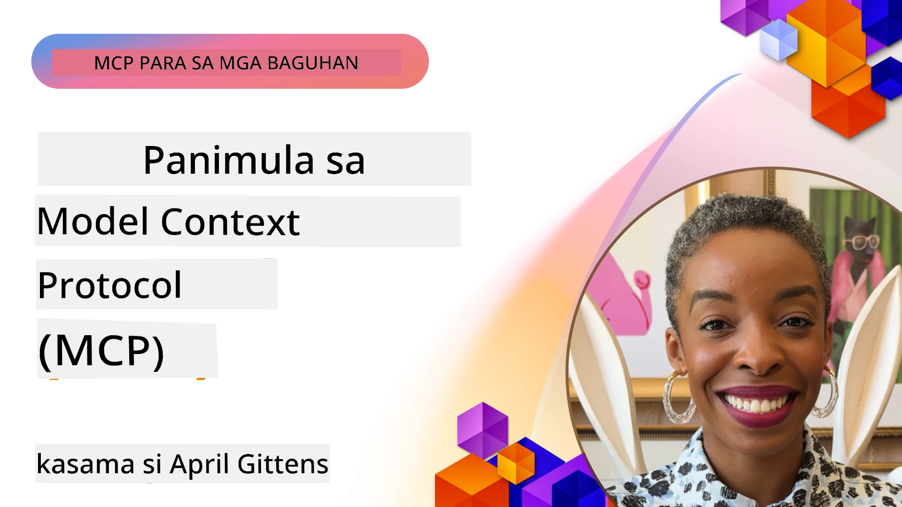

# Panimula sa Model Context Protocol (MCP): Bakit Mahalaga ito para sa Mga Scalable na Aplikasyon ng AI

[](https://youtu.be/agBbdiOPLQA)

_(I-click ang larawan sa itaas upang mapanood ang video ng araling ito)_

Ang mga generative AI na aplikasyon ay isang malaking hakbang pasulong dahil madalas nilang pahintulutan ang gumagamit na makipag-ugnayan sa app gamit ang natural na mga prompt ng wika. Gayunpaman, habang mas maraming oras at resources ang inilalagay sa mga ganitong apps, gusto mong matiyak na madali mong maipapasok ang mga functionality at resources sa paraang madaling mapalawak, na kaya ng iyong app na maglingkod sa higit sa isang modelo, at mapangasiwaan ang iba't ibang kalikasan ng modelo. Sa madaling salita, madali lamang magsimula ng Gen AI apps, ngunit habang lumalaki at nagiging mas kumplikado, kailangan mong magsimula ng pagde-define ng arkitektura at malamang mangailangan kang gumamit ng standard upang matiyak na ang iyong mga app ay itinayo nang pare-pareho. Dito pumapasok ang MCP upang ayusin ang mga bagay at magbigay ng standard.

---

## **🔍 Ano ang Model Context Protocol (MCP)?**

Ang **Model Context Protocol (MCP)** ay isang **open, standardized na interface** na nagpapahintulot sa Large Language Models (LLMs) na makipag-ugnayan nang maayos sa mga panlabas na tools, APIs, at mga pinagmumulan ng data. Nagbibigay ito ng consistent architecture upang mapahusay ang functionality ng AI model lampas sa kanilang training data, na nagpapagana ng mas matalino, scalable, at mas mabilis na AI systems.

---

## **🎯 Bakit Mahalaga ang Standardization sa AI**

Habang nagiging mas kumplikado ang mga generative AI application, mahalaga na magpatibay ng mga standard na nagsisiguro ng **scalability, extensibility, maintainability,** at **pag-iwas sa vendor lock-in**. Nilalapatan ng MCP ang mga pangangailangang ito sa pamamagitan ng:

- Pag-iisa ng mga integrasyon ng model-tool
- Pagbawas ng pagiging malutong at one-off na custom solutions
- Pagpapahintulot sa maraming modelo mula sa iba't ibang vendor na magsama sa isang ecosystem

**Paalala:** Bagaman itinuturing ng MCP ang sarili bilang isang open standard, wala pang plano na i-standardize ang MCP sa pamamagitan ng mga umiiral na standards bodies gaya ng IEEE, IETF, W3C, ISO, o iba pang standards bodies.

---

## **📚 Mga Layunin sa Pagkatuto**

Sa katapusan ng artikulong ito, magagawa mong:

- I-define ang **Model Context Protocol (MCP)** at ang mga gamit nito
- Unawain kung paano standardize ng MCP ang komunikasyon ng model-to-tool
- Matukoy ang mga pangunahing bahagi ng MCP architecture
- Tuklasin ang mga totoong aplikasyon ng MCP sa mga konteksto ng negosyo at development

---

## **💡 Bakit Ang Model Context Protocol (MCP) ay Rebolusyonaryo**

### **🔗 Nilulutas ng MCP ang Fragmentation sa Interaksyon ng AI**

Bago ang MCP, ang integrasyon ng mga modelo sa tools ay nangangailangan ng:

- Custom na code para sa bawat tool-model pair
- Hindi standardized na APIs para sa bawat vendor
- Madalas na pagkaantala dahil sa mga update
- Mahirap i-scale habang dumarami ang mga tool

### **✅ Mga Benepisyo ng MCP Standardization**

| **Benepisyo**            | **Paglalarawan**                                                               |
|--------------------------|--------------------------------------------------------------------------------|
| Interoperability         | Nagtutulungan nang maayos ang LLMs sa mga tools mula sa iba't ibang vendor     |
| Consistency              | Pantay-pantay na pag-uugali sa iba't ibang platform at tools                   |
| Reusability              | Ang mga tool na ginawa minsan ay magagamit muli sa iba't ibang proyekto at sistema |
| Pinabilis na Pag-develop | Pinapababa ang oras ng development gamit ang standardized, plug-and-play na mga interface |

---

## **🧱 Pangkalahatang Pagsusuri sa MCP Architecture**

Sinasunod ng MCP ang **client-server model**, kung saan:

- **MCP Hosts** ang nagpapatakbo ng mga AI models
- **MCP Clients** ang nag-iinitiate ng mga request
- **MCP Servers** ang nagseserbisyo ng context, tools, at capabilities

### **Pangunahing Bahagi:**

- **Resources** – Static o dynamic na data para sa mga modelo  
- **Prompts** – Mga predefined na workflow para sa guided generation  
- **Tools** – Mga executable na functions tulad ng search, calculations  
- **Sampling** – Agentic na pag-uugali sa pamamagitan ng recursive na interaksyon
- **Elicitation** – Mga request mula sa server para sa input ng user
- **Roots** – Mga hangganan ng filesystem para sa kontrol sa access ng server

### **Protocol Architecture:**

Gumagamit ang MCP ng dalawang-layer na arkitektura:  
- **Data Layer**: Komunikasyon na batay sa JSON-RPC 2.0 na may lifecycle management at mga primitives  
- **Transport Layer**: STDIO (lokal) at Streamable HTTP gamit ang SSE (remote) na komunikasyon

---

## Paano Gumagana ang MCP Servers

Ang MCP servers ay gumagana sa sumusunod na paraan:

- **Daloy ng Request**:
    1. Isang request ang inilulunsad ng end user o software na kumakatawan sa kanila.
    2. Ang **MCP Client** ang nagpapadala ng request sa isang **MCP Host**, na nagma-manage ng AI Model runtime.
    3. Tinatanggap ng **AI Model** ang prompt ng user at maaaring humiling ng access sa panlabas na mga tool o data sa pamamagitan ng isa o higit pang tool calls.
    4. Ang **MCP Host**, hindi ang modelo mismo, ang nakikipag-ugnayan sa tamang **MCP Server(s)** gamit ang standardized na protocol.
- **Functionality ng MCP Host**:
    - **Tool Registry**: Nangangalaga ng katalogo ng available na mga tool at kanilang kakayahan.
    - **Authentication**: Tinitiyak ang pahintulot para sa paggamit ng mga tool.
    - **Request Handler**: Nagpoproseso ng mga papasok na request mula sa modelo.
    - **Response Formatter**: Inaayos ang outputs ng tool sa format na maiintindihan ng modelo.
- **Pagpapatakbo ng MCP Server**:
    - Ipinapasa ng **MCP Host** ang mga tool calls sa isa o higit pang **MCP Servers**, na naglalabas ng espesyal na mga function (tulad ng search, calculations, database queries).
    - Isinasagawa ng **MCP Servers** ang kani-kanilang mga operasyon at ibinabalik ang resulta sa **MCP Host** sa consistent na format.
    - Inaayos at ipinapasa ng **MCP Host** ang mga resulta sa **AI Model**.
- **Pagkumpleto ng Tugon**:
    - Isasama ng **AI Model** ang mga output mula sa tools sa huling sagot.
    - Ipinapadala ng **MCP Host** ang sagot pabalik sa **MCP Client**, na nagde-deliver nito sa end user o software na tumawag.

```mermaid
---
title: Arkitektura ng MCP at Interaksyon ng mga Komponent
description: Isang diagram na nagpapakita ng mga daloy ng mga komponent sa MCP.
---
graph TD
    Client[MCP Kliyente/Aplikasyon] -->|Nagsusumite ng Kahilingan| H[MCP Host]
    H -->|Nagpapatawag| A[Modelo ng AI]
    A -->|Kahilingan para sa Tool Call| H
    H -->|Protokol ng MCP| T1[MCP Server Tool 01: Paghahanap sa Web]
    H -->|Protokol ng MCP| T2[MCP Server Tool 02: Kalkulador na tool]
    H -->|Protokol ng MCP| T3[MCP Server Tool 03: Tool para sa Pag-access ng Database]
    H -->|Protokol ng MCP| T4[MCP Server Tool 04: Tool ng File System]
    H -->|Nagpapadala ng Tugon| Client

    subgraph "Mga Komponent ng MCP Host"
        H
        G[Registry ng Tool]
        I[Pagpapatunay]
        J[Tagapamahala ng Kahilingan]
        K[Tagapagsaayos ng Tugon]
    end

    H <--> G
    H <--> I
    H <--> J
    H <--> K

    style A fill:#f9d5e5,stroke:#333,stroke-width:2px
    style H fill:#eeeeee,stroke:#333,stroke-width:2px
    style Client fill:#d5e8f9,stroke:#333,stroke-width:2px
    style G fill:#fffbe6,stroke:#333,stroke-width:1px
    style I fill:#fffbe6,stroke:#333,stroke-width:1px
    style J fill:#fffbe6,stroke:#333,stroke-width:1px
    style K fill:#fffbe6,stroke:#333,stroke-width:1px
    style T1 fill:#c2f0c2,stroke:#333,stroke-width:1px
    style T2 fill:#c2f0c2,stroke:#333,stroke-width:1px
    style T3 fill:#c2f0c2,stroke:#333,stroke-width:1px
    style T4 fill:#c2f0c2,stroke:#333,stroke-width:1px
```

    


## 👨‍💻 Paano Gumawa ng MCP Server (Kasama ang mga Halimbawa)

Pinapahintulutan ka ng MCP servers na palawakin ang kakayahan ng LLMs sa pamamagitan ng pagbibigay ng data at functionality. 

Handa ka na bang subukan? Narito ang mga SDK para sa iba't ibang wika at/o stack kasama ang mga halimbawa ng paggawa ng simpleng MCP servers sa iba't ibang wika/stack:

- **Python SDK**: https://github.com/modelcontextprotocol/python-sdk

- **TypeScript SDK**: https://github.com/modelcontextprotocol/typescript-sdk

- **Java SDK**: https://github.com/modelcontextprotocol/java-sdk

- **C#/.NET SDK**: https://github.com/modelcontextprotocol/csharp-sdk


## 🌍 Mga Totoong Halimbawa ng Paggamit ng MCP

Pinapagana ng MCP ang malawak na saklaw ng mga aplikasyon sa pamamagitan ng pagpapalawak ng kakayahan ng AI:

| **Aplikasyon**               | **Paglalarawan**                                                             |
|-----------------------------|------------------------------------------------------------------------------|
| Enterprise Data Integration  | Kinokonekta ang LLMs sa mga database, CRM, o internal tools                  |
| Agentic AI Systems           | Pinapahintulutan ang mga autonomous agents gamit ang access sa tool at mga proseso ng pagdedesisyon  |
| Multi-modal Applications     | Pinagsasama ang text, image, at audio tools sa iisang unified na AI app      |
| Real-time Data Integration   | Nagdadala ng live data sa interaksyon ng AI para sa mas tumpak at napapanahong mga output |


### 🧠 MCP = Pandaigdigang Standard para sa AI Interaksyon

Ang Model Context Protocol (MCP) ay kumikilos bilang isang pandaigdigang standard para sa AI interaksyon, tulad ng paano na-standardize ng USB-C ang mga pisikal na koneksyon ng mga device. Sa mundo ng AI, nagbibigay ang MCP ng consistent na interface, na nagpapahintulot sa mga modelo (clients) na mag-integrate nang maayos sa mga panlabas na tools at data providers (servers). Nililimitahan nito ang pangangailangan para sa iba't ibang, custom na mga protocol para sa bawat API o pinagmumulan ng data.

Sa ilalim ng MCP, ang isang tool na compatible sa MCP (tinatawag na MCP server) ay sumusunod sa isang pinag-isang standard. Maaari nilang ilista ang mga tool o aksyon na kanilang inaalok at isagawa ang mga ito kapag hiniling ng AI agent. Ang mga platform ng AI agent na sumusuporta sa MCP ay kayang tuklasin ang mga available na tool mula sa mga server at tawagan ang mga ito gamit ang standard protocol na ito.

### 💡 Nagpapadali ng access sa kaalaman

Lampas sa pagbibigay ng mga tool, pinapadali rin ng MCP ang access sa kaalaman. Pinapahintulutan nito ang mga aplikasyon na magbigay ng context sa large language models (LLMs) sa pamamagitan ng pag-link sa kanila sa iba’t ibang pinagmumulan ng data. Halimbawa, ang isang MCP server ay maaaring kumatawan sa dokumento ng isang kumpanya, na nagpapahintulot sa mga agent na kumuha ng mahalagang impormasyon kapag kinakailangan. Ang isa pang server ay maaaring humawak ng tukoy na mga aksyon tulad ng pagpapadala ng email o pag-update ng mga rekord. Mula sa pananaw ng agent, mga tool lang ang mga iyon na magagamit nito—may ilang tool na nagbabalik ng data (context ng kaalaman), habang ang iba naman ay nagsasagawa ng mga aksyon. Mabisang pinamamahalaan ng MCP ang parehong.

Ang isang agent na kumonekta sa isang MCP server ay awtomatikong natututo ng mga kakayahan ng server at accessible na data sa isang standardized na format. Ang standardisasyon ay nagpapahintulot sa dynamic na pagkakaroon ng mga tool. Halimbawa, ang pagdagdag ng bagong MCP server sa sistema ng isang agent ay ginagawa agad na magagamit ang mga function nito nang hindi na kailangan pa ng karagdagang pag-customize ng mga instruction ng agent.

Sang-ayon sa daloy na ipinapakita sa sumusunod na diagram, nagpo-provide ang mga server ng parehong tools at kaalaman, na nagsisiguro ng seamless na pagtutulungan sa pagitan ng mga sistema.

### 👉 Halimbawa: Scalable Agent Solution

```mermaid
---
title: Nasusukat na Solusyon ng Ahente gamit ang MCP
description: Isang diagram na nagpapakita kung paano nakikipag-ugnayan ang isang gumagamit sa isang LLM na konektado sa maraming MCP server, kung saan bawat server ay nagbibigay ng kaalaman at mga kasangkapan, na lumilikha ng nasusukat na arkitektura ng sistemang AI
---
graph TD
    User -->|Paanyaya| LLM
    LLM -->|Tugon| User
    LLM -->|MCP| ServerA
    LLM -->|MCP| ServerB
    ServerA -->|Universal connector| ServerB
    ServerA --> KnowledgeA
    ServerA --> ToolsA
    ServerB --> KnowledgeB
    ServerB --> ToolsB

    subgraph Server A
        KnowledgeA[Kaalaman]
        ToolsA[Kasangkapan]
    end

    subgraph Server B
        KnowledgeB[Kaalaman]
        ToolsB[Kasangkapan]
    end
```Pinahihintulutan ng Universal Connector ang mga MCP server na makipag-ugnayan at magbahagi ng kakayahan sa isa't isa, na nagpapahintulot sa ServerA na ipasa ang mga gawain sa ServerB o gamitin ang mga tool at kaalaman nito. Ito ay nagfe-federate ng mga tool at data sa buong mga server, na sumusuporta sa scalable at modular na mga arkitektura ng agent. Dahil pinapantay-pantay ng MCP ang exposure ng mga tool, kayang tuklasin at i-route ng mga agent nang dinamiko ang mga request sa pagitan ng mga server nang hindi na kailangang gumamit ng hardcoded na integrasyon.

Federasyon ng tool at kaalaman: Maaaring ma-access ang mga tool at data sa iba't ibang mga server, na nagpapahintulot sa mas scalable at modular na agentic architectures.

### 🔄 Mga Advanced na Senaryo ng MCP na may Client-Side LLM Integration

Bukod pa sa basic na MCP architecture, may mga advanced na senaryo kung saan may LLMs sa parehong client at server, na nagpapahintulot ng mas sopistikadong interaksyon. Sa sumusunod na diagram, ang **Client App** ay maaaring isang IDE na may ilang MCP tools na magagamit ng LLM:

```mermaid
---
title: Mga Advanced na Senaryo ng MCP na may Integrasyon ng Client-Server LLM
description: Isang sequence diagram na nagpapakita ng detalyadong daloy ng interaksyon sa pagitan ng user, client application, client LLM, maraming MCP server, at server LLM, na naglalarawan ng pagtuklas ng tool, interaksyon ng user, direktang pag-tawag ng tool, at mga yugto ng negosasyon ng tampok
---
sequenceDiagram
    autonumber
    actor User as 👤 User
    participant ClientApp as 🖥️ Client App
    participant ClientLLM as 🧠 Client LLM
    participant Server1 as 🔧 MCP Server 1
    participant Server2 as 📚 MCP Server 2
    participant ServerLLM as 🤖 Server LLM
    
    %% Discovery Phase
    rect rgb(220, 240, 255)
        Note over ClientApp, Server2: YUGTO NG PAGTUKLAS NG TOOL
        ClientApp->>+Server1: Humiling ng magagamit na mga tool/resources
        Server1-->>-ClientApp: Ibalik ang listahan ng tool (JSON)
        ClientApp->>+Server2: Humiling ng magagamit na mga tool/resources
        Server2-->>-ClientApp: Ibalik ang listahan ng tool (JSON)
        Note right of ClientApp: Itago ang pinagsamang katalogo ng tool<br/>lokal
    end
    
    %% User Interaction
    rect rgb(255, 240, 220)
        Note over User, ClientLLM: YUGTO NG INTERAKSYON NG USER
        User->>+ClientApp: Maglagay ng natural na wika na prompt
        ClientApp->>+ClientLLM: Ipadala ang prompt + katalogo ng tool
        ClientLLM->>-ClientLLM: Suriin ang prompt at pumili ng mga tool
    end
    
    %% Scenario A: Direct Tool Calling
    alt Direktang Pag-tawag ng Tool
        rect rgb(220, 255, 220)
            Note over ClientApp, Server1: SENARYO A: DIREKTANG PAG-TATAWAG NG TOOL
            ClientLLM->>+ClientApp: Humiling ng pagpatupad ng tool
            ClientApp->>+Server1: Patakbuhin ang espesipikong tool
            Server1-->>-ClientApp: Ibalik ang mga resulta
            ClientApp->>+ClientLLM: Proseso ang mga resulta
            ClientLLM-->>-ClientApp: Bumuo ng tugon
            ClientApp-->>-User: Ipakita ang pangwakas na sagot
        end
    
    %% Scenario B: Feature Negotiation (VS Code style)
    else Negosasyon ng Tampok (Estilo ng VS Code)
        rect rgb(255, 220, 220)
            Note over ClientApp, ServerLLM: SENARYO B: NEGOSASYON NG TAMPOK
            ClientLLM->>+ClientApp: Tukuyin ang mga kinakailangang kakayahan
            ClientApp->>+Server2: Makipag-negosasyon ng mga tampok/kakayahan
            Server2->>+ServerLLM: Humiling ng dagdag na konteksto
            ServerLLM-->>-Server2: Magbigay ng konteksto
            Server2-->>-ClientApp: Ibalik ang mga magagamit na tampok
            ClientApp->>+Server2: Tawagan ang mga napagkasunduang tool
            Server2-->>-ClientApp: Ibalik ang mga resulta
            ClientApp->>+ClientLLM: Proseso ang mga resulta
            ClientLLM-->>-ClientApp: Bumuo ng tugon
            ClientApp-->>-User: Ipakita ang pangwakas na sagot
        end
    end
```
## 🔐 Mga Praktikal na Benepisyo ng MCP

Narito ang mga praktikal na benepisyo ng paggamit ng MCP:

- **Kapanahonan**: Kayang ma-access ng mga modelo ang napapanahong impormasyon lampas sa kanilang training data
- **Pagpapalawak ng Kakayahan**: Kayang gamitin ng mga modelo ang mga specialized na tool para sa mga gawaing hindi nila natutunan
- **Pagbawas ng Hallucinations**: Nagbibigay ng factual grounding ang mga panlabas na pinagmumulan ng data
- **Pribasya**: Ang sensitibong data ay maaaring manatili sa mga secured na environment imbes na ilagay sa mga prompt

## 📌 Mga Pangunahing Punto

Narito ang mga pangunahing takeaway para sa paggamit ng MCP:

- **MCP** ang standard kung paano nakikipag-ugnayan ang mga AI model sa mga tool at data
- Nagpapaunlad ng **extensibility, consistency, at interoperability**
- Tinutulungan ng MCP na **pabilis ang development, pagbutihin ang pagiging maaasahan, at palawakin ang kakayahan ng model**
- Ang client-server architecture ay **nagbibigay ng flexible, extensible na mga AI application**

## 🧠 Ehersisyo

Isipin ang isang AI application na gusto mong gawin.

- Anong **panlabas na tools o data** ang makakapagpaunlad ng kakayahan nito?
- Paano makatutulong ang MCP na gawing **mas simple at mas maaasahan** ang integrasyon?

## Karagdagang Resources

- [MCP GitHub Repository](https://github.com/modelcontextprotocol)


## Ano ang susunod

Susunod: [Chapter 1: Core Concepts](../01-CoreConcepts/README.md)

---

<!-- CO-OP TRANSLATOR DISCLAIMER START -->
**Paalala**:
Ang dokumentong ito ay isinalin gamit ang AI translation service na [Co-op Translator](https://github.com/Azure/co-op-translator). Bagamat aming pinagsisikapang maging tumpak ang pagsasalin, pakitandaan na maaaring may mga pagkakamali o di-tumpak na bahagi ang awtomatikong pagsasalin. Ang orihinal na dokumento sa wikang pinagmulan nito ang dapat ituring na ganap na mapagkakatiwalaang sanggunian. Para sa mahahalagang impormasyon, inirerekomenda ang propesyonal na pagsasaling pangtao. Hindi kami mananagot sa anumang hindi pagkakaunawaan o maling interpretasyon na maaaring magmula sa paggamit ng pagsasaling ito.
<!-- CO-OP TRANSLATOR DISCLAIMER END -->