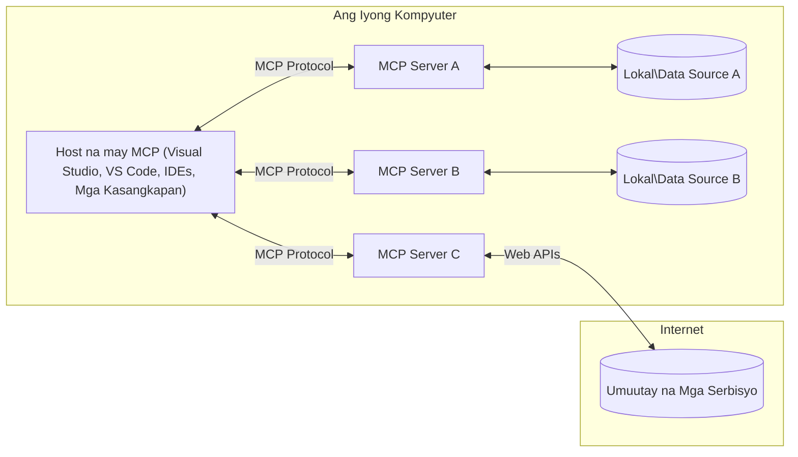

# MCP Core Concepts: Mastering the Model Context Protocol for AI Integration

[](https://youtu.be/earDzWGtE84)

_(I-click ang larawan sa itaas upang panoorin ang video ng araling ito)_

Ang [Model Context Protocol (MCP)](https://github.com/modelcontextprotocol) ay isang makapangyarihan, standardisadong balangkas na nag-o-optimize ng komunikasyon sa pagitan ng Mga Malalaking Modelo ng Wika (LLMs) at mga panlabas na kasangkapan, aplikasyon, at mga pinagkukunan ng data.  
Ang gabay na ito ay dadalhin ka sa mga pangunahing konsepto ng MCP. Matututuhan mo ang tungkol sa client-server architecture nito, mahahalagang bahagi, mekanismo ng komunikasyon, at pinakamahusay na kasanayan sa pagpapatupad.

- **Tahasang Pahintulot ng Gumagamit**: Lahat ng pag-access sa data at operasyon ay nangangailangan ng tahasang pag-apruba ng gumagamit bago isagawa. Kailangan malinaw na maunawaan ng mga gumagamit kung anong data ang maa-access at anong mga aksyon ang gagawin, na may detalyadong kontrol sa mga pahintulot at awtorisasyon.

- **Proteksyon ng Pagkapribado ng Data**: Ang data ng gumagamit ay ipinapakita lamang sa tahasang pahintulot at dapat maprotektahan ng matibay na mga kontrol sa pag-access sa buong lifecycle ng interaksyon. Dapat pigilan ng mga pagpapatupad ang hindi awtorisadong paglipat ng data at panatilihin ang mahigpit na mga hangganan ng privacy.

- **Kaligtasan sa Pagpapatupad ng Kasangkapan**: Bawat pag-gamit ng kasangkapan ay nangangailangan ng tahasang pahintulot ng gumagamit na may malinaw na pagkaunawa sa pag-andar ng kasangkapan, mga parameter, at posibleng epekto. Dapat pigilan ng matibay na mga hangganan ng seguridad ang hindi sinasadyang, hindi ligtas, o malisyosong pagpapatupad ng kasangkapan.

- **Seguridad sa Layer ng Transportasyon**: Lahat ng mga kanal ng komunikasyon ay dapat gumamit ng angkop na encryption at mga mekanismo ng pagpapatunay. Dapat ipatupad ng mga remote na koneksyon ang mga secure na protocol sa transportasyon at wastong pamamahala ng kredensyal.

#### Mga Panuntunan sa Pagpapatupad:

- **Pamamahala ng Pahintulot**: Magpatupad ng mga sistemang may pinong-grained na pahintulot na nagpapahintulot sa mga gumagamit na kontrolin kung aling mga server, kasangkapan, at mga pinagkukunan ang maa-access  
- **Pagpapatunay at Awtorisasyon**: Gumamit ng mga secure na paraan ng pagpapatunay (OAuth, API keys) na may wastong pamamahala ng token at expiration  
- **Pag-validate ng Input**: Suriin ang lahat ng mga parameter at input ng data ayon sa mga tinukoy na schema upang maiwasan ang injection attacks  
- **Audit Logging**: Panatilihin ang komprehensibong mga log ng lahat ng operasyon para sa seguridad na pagmamanman at pagsunod  

## Pangkalahatang-ideya

Sinusuri ng araling ito ang pangunahing arkitektura at mga bahagi na bumubuo sa ekosistema ng Model Context Protocol (MCP). Matututuhan mo ang tungkol sa client-server architecture, mahahalagang bahagi, at mga mekanismo ng komunikasyon na nagpapagana sa pakikipag-ugnayan ng MCP.

## Mga Pangunahing Layunin ng Pagkatuto

Sa pagtatapos ng araling ito, malalaman mo:

- Mauunawaan ang MCP client-server architecture.  
- Matutukoy ang mga papel at responsibilidad ng Hosts, Clients, at Servers.  
- Masusuri ang mga pangunahing tampok na ginagawang flexible ang MCP bilang integration layer.  
- Matutuhan kung paano dumadaloy ang impormasyon sa loob ng ekosistema ng MCP.  
- Makuha ang praktikal na kaalaman sa pamamagitan ng mga halimbawang code sa .NET, Java, Python, at JavaScript.  

## MCP Architecture: Mas Malalim na Pagsilip

Ang ekosistema ng MCP ay nakabatay sa client-server na modelo. Ang modular na istrukturang ito ay nagpapahintulot sa mga AI na aplikasyon na makipag-ugnayan sa mga kasangkapan, database, API, at mga kontekstwal na pinagkukunan nang mahusay. Hatiin natin ang arkitekturang ito sa mga pangunahing bahagi nito.

Sa kanyang pinakapuso, sinusunod ng MCP ang client-server architecture kung saan ang host application ay maaaring kumonekta sa maraming mga server:


- **MCP Hosts**: Mga programa tulad ng VSCode, Claude Desktop, IDEs, o AI tools na nais mag-access ng data sa pamamagitan ng MCP  
- **MCP Clients**: Mga kliyenteng protocol na nagpapanatili ng 1:1 na koneksyon sa mga server  
- **MCP Servers**: Mga magagaan na programa na nagpapakita ng partikular na mga kakayahan sa pamamagitan ng standardisadong Model Context Protocol  
- **Local Data Sources**: Mga file, database, at serbisyo sa iyong kompyuter na maaaring ma-access nang ligtas ng MCP servers  
- **Remote Services**: Mga panlabas na sistema na available sa internet na maaaring konektahan ng MCP servers sa pamamagitan ng mga API.

Ang MCP Protocol ay isang nagbabagong standard gamit ang date-based versioning (format na YYYY-MM-DD). Ang kasalukuyang bersyon ng protocol ay **2025-11-25**. Maaari mong makita ang pinakabagong mga update sa [protocol specification](https://modelcontextprotocol.io/specification/2025-11-25/).

### 1. Hosts

Sa Model Context Protocol (MCP), ang **Hosts** ay mga AI application na nagsisilbing pangunahing interface kung saan nakikipag-ugnayan ang mga gumagamit sa protocol. Pinamumunuan ng mga Host ang koordinasyon at pamamahala ng mga koneksyon sa maraming MCP server sa pamamagitan ng paglikha ng dedikadong mga MCP client para sa bawat koneksyon sa server. Ilan sa mga halimbawa ng Hosts ay:

- **AI Applications**: Claude Desktop, Visual Studio Code, Claude Code  
- **Development Environments**: Mga IDE at code editor na may integrasyon ng MCP  
- **Mga Custom na Aplikasyon**: Mga purpose-built na AI agent at kasangkapan  

Ang **Hosts** ay mga aplikasyon na nagko-coordinate ng mga interaksyon ng AI modelo. Sila ay:

- **Naka-orchestrate ng AI Models**: Isinasagawa o nakikipag-ugnayan sa LLM upang makagawa ng mga tugon at mag-coordinate ng mga workflow ng AI  
- **Nagpapanatili ng Client Connections**: Lumilikha at nagpapanatili ng isang MCP client bawat MCP server connection  
- **Nagkokontrol ng User Interface**: Pinangangasiwaan ang daloy ng usapan, interaksyon ng gumagamit, at presentasyon ng mga tugon  
- **Nagpapatupad ng Seguridad**: Kinokontrol ang mga pahintulot, mga limitasyon sa seguridad, at pagpapatunay  
- **Pinangangasiwaan ang Pahintulot ng Gumagamit**: Namamahala sa pag-apruba ng gumagamit para sa pagbabahagi ng data at pagpapatupad ng kasangkapan  

### 2. Clients

Ang **Clients** ay mga mahalagang bahagi na nagpapanatili ng dedikadong one-to-one na koneksyon sa pagitan ng Hosts at MCP servers. Bawat MCP client ay binubuo ng Host para kumonekta sa partikular na MCP server, na nagsisiguro ng organisado at ligtas na mga kanal ng komunikasyon. Ang maraming client ay nagpapahintulot sa mga Host na kumonekta sa maraming server nang sabay-sabay.

Ang **Clients** ay mga konektor na bahagi sa loob ng host application. Sila ay:

- **Nagpapaandar ng Protocol Communication**: Nagpapadala ng JSON-RPC 2.0 requests sa mga server na may mga prompt at instruksyon  
- **Nag-negotiate ng Kakayahan**: Nakikipag-negosasyon sa mga server tungkol sa sinusuportahang mga tampok at bersyon ng protocol sa panahon ng inisyal na koneksyon  
- **Namamahala ng Pagpapatupad ng Kasangkapan**: Pinamamahalaan ang mga request sa pagpapatupad ng kasangkapan mula sa mga modelo at pinoproseso ang mga tugon  
- **Nag-aasikaso ng Real-time Updates**: Pinangangasiwaan ang mga notification at real-time na update mula sa mga server  
- **Nagpoproseso ng Tugon**: Pinoproseso at ini-format ang mga tugon ng server para ipakita sa mga gumagamit

### 3. Servers

Ang **Servers** ay mga programa na nagbibigay ng konteksto, mga kasangkapan, at mga kakayahan sa mga MCP client. Maaari silang tumakbo nang lokal (sa parehong makina ng Host) o remote (sa mga panlabas na platform), at responsable sa paghawak ng mga request ng client at pagbibigay ng naka-istraktura na mga tugon. Ipinapakita ng mga server ang partikular na pag-andar sa pamamagitan ng standardisadong Model Context Protocol.

Ang **Servers** ay mga serbisyo na nagbibigay ng konteksto at mga kakayahan. Sila ay:

- **Nagpaparehistro ng Tampok**: Nagrerehistro at nagpapakita ng mga available na primitive (mga resource, prompt, kasangkapan) sa mga client  
- **Nagpoproseso ng Request**: Tumanggap at nagpapatupad ng mga tool call, resource request, at prompt request mula sa mga client  
- **Nagbibigay ng Konteksto**: Nagbibigay ng kontekstwal na impormasyon at data upang pagandahin ang mga tugon ng modelo  
- **Nagpapanatili ng Estado**: Pinapanatili ang estado ng session at humahawak ng mga stateful na interaksyon kapag kinakailangan  
- **Nagpapadala ng Real-time Notifications**: Nagpapadala ng mga notification tungkol sa pagbabago ng kakayahan at mga update sa mga nakakonektang client

Maaaring paunlarin ng sinuman ang mga server upang palawakin ang kakayahan ng modelo gamit ang espesyalisadong functionality, at sinusuportahan ang parehong lokal at remote na deployment na mga senaryo.

### 4. Server Primitives

Ang mga server sa Model Context Protocol (MCP) ay nagbibigay ng tatlong pangunahing **primitive** na nagtatakda ng mga pundamental na bloke para sa mayamang interaksyon sa pagitan ng client, host, at mga language model. Itong mga primitive ay nagsasaad ng mga uri ng kontekstwal na impormasyon at mga aksyon na available sa pamamagitan ng protocol.

Maaaring ipakita ng mga MCP server ang anumang kombinasyon ng sumusunod na tatlong pangunahing primitive:

#### Resources 

Ang **Resources** ay mga pinagkukunan ng data na nagbibigay ng kontekstwal na impormasyon sa mga AI application. Kinakatawan nila ang static o dynamic na nilalaman na maaaring pagandahin ang pagkaunawa at paggawa ng desisyon ng modelo:

- **Kontekstwal na Data**: Naka-istrakturang impormasyon at konteksto para sa konsumo ng AI model  
- **Knowledge Bases**: Repositori ng mga dokumento, artikulo, manual, at mga pananaliksik  
- **Local Data Sources**: Mga file, database, at impormasyon ng lokal na sistema  
- **External Data**: Mga tugon mula sa API, web services, at mga data mula sa malalayong sistema  
- **Dynamic Content**: Real-time na data na nag-a-update batay sa panlabas na mga kondisyon

Ang mga resource ay kinikilala gamit ang mga URI at sinusuportahan ang discovery sa pamamagitan ng `resources/list` at retrieval gamit ang `resources/read` na mga method:

```text
file://documents/project-spec.md
database://production/users/schema
api://weather/current
```

#### Prompts

Ang **Prompts** ay mga reusable template na tumutulong mag-istraktura ng interaksyon sa mga language model. Nagbibigay sila ng standardisadong pattern ng interaksyon at templated na mga workflow:

- **Template-based Interactions**: Pre-structured na mga mensahe at panimulang usapan  
- **Workflow Templates**: Standardisadong mga pagkakasunod-sunod para sa mga karaniwang gawain at interaksyon  
- **Few-shot Examples**: Mga halimbawang batay sa template para sa instruksiyon ng modelo  
- **System Prompts**: Pangunahing prompts na nagtatakda ng pag-uugali ng modelo at konteksto  
- **Dynamic Templates**: Parameterized prompts na umaangkop sa partikular na mga konteksto

Sinusuportahan ng mga prompt ang variable substitution at maaaring madiskubre gamit ang `prompts/list` at ma-retrieve sa pamamagitan ng `prompts/get`:

```markdown
Generate a {{task_type}} for {{product}} targeting {{audience}} with the following requirements: {{requirements}}
```

#### Tools

Ang **Tools** ay mga executable na function na maaaring tawagin ng mga AI model upang isagawa ang partikular na mga aksyon. Kinakatawan nila ang mga "pandiwa" ng ekosistema ng MCP, na nagbibigay-daan sa mga modelo na makipag-ugnayan sa mga panlabas na sistema:

- **Executable Functions**: Mga hiwalay na operasyon na maaaring tawagin ng mga modelo na may tiyak na mga parameter  
- **External System Integration**: Tawag sa API, query sa database, mga operasyon sa file, mga kalkulasyon  
- **Natanging Identidad**: Bawat kasangkapan ay may natatanging pangalan, paglalarawan, at schema ng mga parameter  
- **Structured I/O**: Tumanggap ng nasuring mga parameter ang mga kasangkapan at nagbabalik ng naka-istrukturang, typed na mga tugon  
- **Mga Kapasidad ng Aksyon**: Pinapahintulutan ang mga modelo na magsagawa ng mga totoong aksyon at kumuha ng live na data

Ang mga tool ay nade-define gamit ang JSON Schema para sa pag-validate ng parameter at madiskubre sa pamamagitan ng `tools/list` at ginagamit sa `tools/call`. Maaari ring maglaman ang mga tool ng **icons** bilang karagdagang metadata para sa mas magandang presentasyon sa UI.

**Mga Anotasyon ng Tool**: Sinusuportahan ng mga tool ang mga behavioral annotation (e.g., `readOnlyHint`, `destructiveHint`) na naglalarawan kung ang kasangkapan ay read-only o mapanira, na tumutulong sa mga client na gumawa ng matalinong desisyon tungkol sa pagpapatupad ng tool.

Halimbawa ng depinisyon ng tool:

```typescript
server.tool(
  "search_products", 
  {
    query: z.string().describe("Search query for products"),
    category: z.string().optional().describe("Product category filter"),
    max_results: z.number().default(10).describe("Maximum results to return")
  }, 
  async (params) => {
    // Isagawa ang paghahanap at ibalik ang nakaayos na mga resulta
    return await productService.search(params);
  }
);
```

## Client Primitives

Sa Model Context Protocol (MCP), ang **clients** ay maaaring magpakita ng mga primitive na nagbibigay-daan sa mga server na humiling ng karagdagang kakayahan mula sa host application. Pinapayagan ng mga client-side primitive na ito ang mas mayamang, mas interactive na mga implementasyon ng server na maaaring ma-access ang mga kakayahan ng AI modelo at mga interaksyon ng gumagamit.

### Sampling

Pinapahintulutan ng **Sampling** ang mga server na humiling ng mga kompletong sagot mula sa language model sa AI application ng client. Pinapahintulutan ng primitive na ito ang mga server na ma-access ang kakayahan ng LLM nang hindi kinakailangang isama ang sariling mga model dependencies:

- **Model-Independent Access**: Maaaring humiling ang server ng mga kompleton nang hindi kinakailangang isama ang mga LLM SDK o pamahalaan ang pag-access sa modelo  
- **Server-Initiated AI**: Pinapahintulutan ang mga server na autonomously na makagawa ng nilalaman gamit ang AI model ng client  
- **Recursive LLM Interactions**: Sinusuportahan ang mga komplikadong senaryo kung saan kailangan ng mga server ang tulong ng AI para sa pagproseso  
- **Dynamic Content Generation**: Pinahihintulutan ang mga server na lumikha ng mga kontekstwal na tugon gamit ang modelo ng host  
- **Tool Calling Support**: Maaaring isama ng mga server ang `tools` at `toolChoice` na mga parameter upang payagan ang modelo ng client na tumawag ng mga kasangkapan habang nagsasagawa ng sampling

Sinisimulan ang sampling gamit ang `sampling/complete` na pamamaraan, kung saan nagpapadala ng mga kahilingan para sa kompletong sagot ang mga server sa mga client.

### Roots

Ang **Roots** ay nagbibigay ng standardisadong paraan para ipakita ng mga client ang mga hangganan ng filesystem sa mga server, na tumutulong sa mga server na maunawaan kung aling mga direktoryo at file ang may access:

- **Filesystem Boundaries**: Itinakda ang hangganan kung saan maaaring mag-operate ang mga server sa filesystem  
- **Access Control**: Tinutulungan ang mga server na maunawaan kung anong mga direktoryo at file ang may pahintulot silang i-access  
- **Dynamic Updates**: Maaaring ipaalam ng client sa mga server kapag nagbago ang listahan ng mga roots  
- **URI-Based Identification**: Ginagamit ng roots ang `file://` URI upang kilalanin ang mga accessible na direktoryo at mga file

Nadidiskubre ang mga roots sa pamamagitan ng `roots/list` na pamamaraan, at nagpapadala ang client ng `notifications/roots/list_changed` kapag may pagbabagong nangyari sa roots.

### Elicitation  

Pinapahintulutan ng **Elicitation** ang mga server na humiling ng karagdagang impormasyon o kumpirmasyon mula sa mga gumagamit sa pamamagitan ng interface ng client:

- **User Input Requests**: Maaaring humiling ang mga server ng karagdagang impormasyon kapag kailangan para sa pagpapatupad ng kasangkapan  
- **Confirmation Dialogs**: Humihiling ng pag-apruba ng gumagamit para sa mga sensitibo o may malaking epekto na operasyon  
- **Interactive Workflows**: Pinapayagan ang mga server na lumikha ng hakbang-hakbang na mga interaksyon ng gumagamit  
- **Dynamic Parameter Collection**: Nangongolekta ng nawawala o opsyonal na mga parameter habang pinapatakbo ang tool

Ginagawa ang mga elicitation request gamit ang `elicitation/request` na paraan upang mangolekta ng input ng gumagamit sa pamamagitan ng interface ng client.

**URL Mode Elicitation**: Maaari ring humiling ang mga server ng user interaction gamit ang URL, na nagpapahintulot sa mga server na idirekta ang mga gumagamit sa mga panlabas na web page para sa pagpapatunay, kumpirmasyon, o pagpasok ng data.

### Logging

Pinapayagan ng **Logging** ang mga server na magpadala ng mga naka-istrukturang log message sa mga client para sa debugging, pagmamanman, at operational visibility:

- **Debugging Support**: Pinapayagan ang mga server na magbigay ng detalyadong mga log ng pagpapatupad para sa troubleshooting  
- **Operational Monitoring**: Nagpapadala ng mga update sa status at mga sukatan ng performans sa mga client  
- **Error Reporting**: Nagbibigay ng detalyadong konteksto ng error at diagnostic na impormasyon  
- **Audit Trails**: Lumilikha ng komprehensibong mga log ng mga operasyon at desisyon ng server

Ipinapadala ang mga logging message sa mga client upang magbigay ng transparency sa mga operasyon ng server at mapadali ang debugging.

## Pagdaloy ng Impormasyon sa MCP

Ang Model Context Protocol (MCP) ay nagtatakda ng naka-istrakturang daloy ng impormasyon sa pagitan ng mga host, client, server, at modelo. Ang pag-unawa sa daloy na ito ay tumutulong na linawin kung paano pinoproseso ang mga kahilingan ng gumagamit at kung paano pinagsasama ang mga panlabas na kasangkapan at data sa mga tugon ng modelo.

- **Nagsisimula ang Host ng Koneksyon**  
  Ang host application (tulad ng IDE o chat interface) ay nagtatatag ng koneksyon sa isang MCP server, karaniwang sa pamamagitan ng STDIO, WebSocket, o iba pang suportadong transportasyon.

- **Negosasyon ng Kakayahan**  
  Nagpapalitan ng impormasyon ang client (na naka-embed sa host) at ang server tungkol sa kanilang mga sinusuportahang tampok, kasangkapan, resource, at mga bersyon ng protocol. Tinitiyak nito na naiintindihan ng dalawang panig kung anong mga kakayahan ang available para sa sesyon.

- **Kahilingan ng Gumagamit**  
  Nakikipag-ugnayan ang gumagamit sa host (hal., nagpapasok ng prompt o utos). Kinokolekta ng host ang input na ito at ipinapasa ito sa client para iproseso.

- **Paggamit ng Resource o Kasangkapan**  
  - Maaaring humiling ang client ng karagdagang konteksto o resource mula sa server (tulad ng mga file, database entry, o knowledge base article) upang pagandahin ang pagkaunawa ng modelo.  
  - Kung ipinalagay ng modelo na kailangan ang isang kasangkapan (hal., upang kumuha ng data, magsagawa ng kalkulasyon, o tumawag ng API), nagpapadala ang client ng kahilingan na gamitin ang tool sa server, na tinutukoy ang pangalan ng tool at mga parametro.

- **Pagpapatupad ng Server**  
  Tumatanggap ang server ng request para sa resource o tool, isinasagawa ang mga kinakailangang operasyon (tulad ng pagpapatakbo ng isang function, pag-query sa database, o pagkuha ng file), at ibinabalik ang mga resulta sa client sa isang nakaayos na format.

- **Pagbuo ng Tugon**  
  Isinasama ng client ang mga tugon ng server (data ng resource, output ng tool, atbp.) sa kasalukuyang pakikipag-ugnayan sa modelo. Ginagamit ng modelo ang impormasyong ito upang makabuo ng isang komprehensibo at may kaugnayang tugon ayon sa konteksto.

- **Pagpapakita ng Resulta**  
  Tumatanggap ang host ng panghuling output mula sa client at ipinapakita ito sa user, kadalasan ay isinasama ang text na nilikha ng modelo at anumang resulta mula sa mga pagpapatupad ng tool o paghahanap ng resource.

Pinahihintulutan ng daloy na ito ang MCP na suportahan ang advanced, interactive, at context-aware na mga aplikasyon ng AI sa pamamagitan ng tuloy-tuloy na pagkonekta ng mga modelo sa mga panlabas na tool at pinagmumulan ng data.

## Arkitektura ng Protocol at mga Layer

Binubuo ang MCP ng dalawang magkakaibang arkitekturang layer na nagtutulungan upang maghatid ng kumpletong balangkas ng komunikasyon:

### Data Layer

Ang **Data Layer** ang nagpatupad ng pangunahing MCP protocol gamit ang **JSON-RPC 2.0** bilang pundasyon nito. Dito tinutukoy ang istruktura ng mensahe, semantika, at mga pattern ng interaksyon:

#### Pangunahing Bahagi:

- **JSON-RPC 2.0 Protocol**: Lahat ng komunikasyon ay gumagamit ng standard na JSON-RPC 2.0 na format ng mensahe para sa pagtawag ng method, mga tugon, at mga notipikasyon
- **Lifecycle Management**: Pinangangasiwaan ang pagsisimula ng koneksyon, negosasyon ng mga kakayahan, at pagtatapos ng session sa pagitan ng mga client at server
- **Server Primitives**: Pinapayagan ang mga server na magbigay ng pangunahing functionality gamit ang mga tool, resource, at prompt
- **Client Primitives**: Pinapayagan ang mga server na humiling ng sampling mula sa LLMs, mangalap ng input mula sa user, at magpadala ng mga log message
- **Real-time Notifications**: Sumusuporta sa asynchronous na mga notipikasyon para sa mga dynamic na update nang hindi nangangailangan ng polling

#### Pangunahing Katangian:

- **Protocol Version Negotiation**: Gumagamit ng date-based na pag-version (YYYY-MM-DD) upang matiyak ang pagiging compatible
- **Capability Discovery**: Nagpapalitan ng impormasyon ang mga client at server tungkol sa mga suportadong katangian habang nagsisimula
- **Stateful Sessions**: Pinapanatili ang estado ng koneksyon sa maraming interaksyon para sa tuloy-tuloy na konteksto

### Transport Layer

Pinamamahalaan ng **Transport Layer** ang mga channel ng komunikasyon, framing ng mensahe, at authentication sa pagitan ng mga kalahok sa MCP:

#### Sinusuportahang Transport Mechanisms:

1. **STDIO Transport**:
   - Gumagamit ng standard input/output streams para sa direktang komunikasyon ng proseso
   - Pinakamainam para sa mga lokal na proseso sa parehong makina nang walang overhead ng network
   - Karaniwang ginagamit para sa mga lokal na implementasyon ng MCP server

2. **Streamable HTTP Transport**:
   - Gumagamit ng HTTP POST para sa mga mensahe mula client patungong server  
   - Opsyonal na Server-Sent Events (SSE) para sa streaming mula sa server patungo sa client
   - Pinapahintulutan ang komunikasyon sa mga remote server sa buong network
   - Sinusuportahan ang standard HTTP authentication (bearer tokens, API keys, custom headers)
   - Rekomendado ng MCP ang OAuth para sa secure na token-based authentication

#### Abstraction ng Transport:

Iniaalis ng transport layer ang mga detalye ng komunikasyon mula sa data layer, na nagpapahintulot sa parehong JSON-RPC 2.0 na format ng mensahe sa lahat ng mekanismo ng transport. Pinapayagan ng abstraction na ito ang mga aplikasyon na malayang magpalit-palit sa pagitan ng lokal at remote na mga server.

### Mga Pagsasaalang-alang sa Seguridad

Dapat sumunod ang mga implementasyon ng MCP sa ilang mahahalagang prinsipyo ng seguridad upang matiyak ang ligtas, mapagkakatiwalaan, at seguradong mga interaksyon sa lahat ng operasyon ng protocol:

- **Pahintulot at Kontrol ng User**: Dapat magbigay ang mga user ng malinaw at tahasang pahintulot bago ma-access ang anumang data o maisagawa ang mga operasyon. Dapat mayroon silang malinaw na kontrol sa kung anong data ang ibabahagi at kung anong mga aksyon ang pinapayagan, na suportado ng madaling gamitin na mga interface para sa pagsusuri at pag-apruba ng mga gawain.

- **Pribadong Data**: Ang data ng user ay dapat mailantad lamang sa tahasang pahintulot at dapat protektahan gamit ang angkop na kontrol sa pag-access. Dapat tiyakin ng mga implementasyon ng MCP na walang hindi awtorisadong pagpapadala ng data at nananatiling pribado ang data sa lahat ng interaksyon.

- **Kaligtasan ng Tool**: Bago gamitin ang anumang tool, kinakailangan ang tahasang pahintulot ng user. Dapat maintindihan ng mga user nang mabuti ang functionality ng bawat tool, at kailangang ipatupad ang matitibay na hangganan sa seguridad upang maiwasan ang hindi inaasahan o delikadong pagpapatakbo ng tool.

Sa pamamagitan ng pagsunod sa mga prinsipyong ito sa seguridad, tinitiyak ng MCP ang tiwala ng user, privacy, at kaligtasan sa lahat ng interaksyon ng protocol habang pinapagana ang makapangyarihang AI integrations.

## Mga Halimbawa ng Code: Pangunahing Bahagi

Narito ang mga halimbawa ng code sa ilang popular na programming languages na naglalarawan kung paano ipatupad ang mga pangunahing bahagi ng MCP server at mga tool.

### Halimbawa sa .NET: Paggawa ng Simpleng MCP Server na may mga Tool

Narito ang praktikal na halimbawa ng code sa .NET na nagpapakita kung paano gumawa ng simpleng MCP server na may custom na mga tool. Tinatalakay dito kung paano ideklara at irehistro ang mga tool, hawakan ang mga request, at ikonekta ang server gamit ang Model Context Protocol.

```csharp
using System;
using System.Threading.Tasks;
using ModelContextProtocol.Server;
using ModelContextProtocol.Server.Transport;
using ModelContextProtocol.Server.Tools;

public class WeatherServer
{
    public static async Task Main(string[] args)
    {
        // Create an MCP server
        var server = new McpServer(
            name: "Weather MCP Server",
            version: "1.0.0"
        );
        
        // Register our custom weather tool
        server.AddTool<string, WeatherData>("weatherTool", 
            description: "Gets current weather for a location",
            execute: async (location) => {
                // Call weather API (simplified)
                var weatherData = await GetWeatherDataAsync(location);
                return weatherData;
            });
        
        // Connect the server using stdio transport
        var transport = new StdioServerTransport();
        await server.ConnectAsync(transport);
        
        Console.WriteLine("Weather MCP Server started");
        
        // Keep the server running until process is terminated
        await Task.Delay(-1);
    }
    
    private static async Task<WeatherData> GetWeatherDataAsync(string location)
    {
        // This would normally call a weather API
        // Simplified for demonstration
        await Task.Delay(100); // Simulate API call
        return new WeatherData { 
            Temperature = 72.5,
            Conditions = "Sunny",
            Location = location
        };
    }
}

public class WeatherData
{
    public double Temperature { get; set; }
    public string Conditions { get; set; }
    public string Location { get; set; }
}
```

### Halimbawa sa Java: MCP Server Components

Ipinapakita ng halimbawa na ito ang parehong MCP server at pagpaparehistro ng tool katulad ng sa .NET na halimbawa sa itaas, ngunit ipinatupad sa Java.

```java
import io.modelcontextprotocol.server.McpServer;
import io.modelcontextprotocol.server.McpToolDefinition;
import io.modelcontextprotocol.server.transport.StdioServerTransport;
import io.modelcontextprotocol.server.tool.ToolExecutionContext;
import io.modelcontextprotocol.server.tool.ToolResponse;

public class WeatherMcpServer {
    public static void main(String[] args) throws Exception {
        // Gumawa ng MCP server
        McpServer server = McpServer.builder()
            .name("Weather MCP Server")
            .version("1.0.0")
            .build();
            
        // Magrehistro ng tool para sa panahon
        server.registerTool(McpToolDefinition.builder("weatherTool")
            .description("Gets current weather for a location")
            .parameter("location", String.class)
            .execute((ToolExecutionContext ctx) -> {
                String location = ctx.getParameter("location", String.class);
                
                // Kumuha ng datos ng panahon (pinasimple)
                WeatherData data = getWeatherData(location);
                
                // Ibalik ang naka-format na sagot
                return ToolResponse.content(
                    String.format("Temperature: %.1f°F, Conditions: %s, Location: %s", 
                    data.getTemperature(), 
                    data.getConditions(), 
                    data.getLocation())
                );
            })
            .build());
        
        // Ikonekta ang server gamit ang stdio transport
        try (StdioServerTransport transport = new StdioServerTransport()) {
            server.connect(transport);
            System.out.println("Weather MCP Server started");
            // Panatilihing tumatakbo ang server hanggang matapos ang proseso
            Thread.currentThread().join();
        }
    }
    
    private static WeatherData getWeatherData(String location) {
        // Ang implementasyon ay tatawag ng isang weather API
        // Pinasimple para sa mga layunin ng halimbawa
        return new WeatherData(72.5, "Sunny", location);
    }
}

class WeatherData {
    private double temperature;
    private String conditions;
    private String location;
    
    public WeatherData(double temperature, String conditions, String location) {
        this.temperature = temperature;
        this.conditions = conditions;
        this.location = location;
    }
    
    public double getTemperature() {
        return temperature;
    }
    
    public String getConditions() {
        return conditions;
    }
    
    public String getLocation() {
        return location;
    }
}
```

### Halimbawa sa Python: Paggawa ng MCP Server

Gumagamit ang halimbawa na ito ng fastmcp, kaya siguraduhing naka-install ito:

```python
pip install fastmcp
```
Code Sample:

```python
#!/usr/bin/env python3
import asyncio
from fastmcp import FastMCP
from fastmcp.transports.stdio import serve_stdio

# Gumawa ng isang FastMCP server
mcp = FastMCP(
    name="Weather MCP Server",
    version="1.0.0"
)

@mcp.tool()
def get_weather(location: str) -> dict:
    """Gets current weather for a location."""
    return {
        "temperature": 72.5,
        "conditions": "Sunny",
        "location": location
    }

# Alternatibong pamamaraan gamit ang isang klase
class WeatherTools:
    @mcp.tool()
    def forecast(self, location: str, days: int = 1) -> dict:
        """Gets weather forecast for a location for the specified number of days."""
        return {
            "location": location,
            "forecast": [
                {"day": i+1, "temperature": 70 + i, "conditions": "Partly Cloudy"}
                for i in range(days)
            ]
        }

# Irehistro ang mga tool ng klase
weather_tools = WeatherTools()

# Simulan ang server
if __name__ == "__main__":
    asyncio.run(serve_stdio(mcp))
```

### Halimbawa sa JavaScript: Paggawa ng MCP Server

Ipinapakita ng halimbawang ito kung paano gumawa ng MCP server sa JavaScript at kung paano irehistro ang dalawang tool na may kinalaman sa panahon.

```javascript
// Paggamit ng opisyal na Model Context Protocol SDK
import { McpServer } from "@modelcontextprotocol/sdk/server/mcp.js";
import { StdioServerTransport } from "@modelcontextprotocol/sdk/server/stdio.js";
import { z } from "zod"; // Para sa pagpapatunay ng parameter

// Gumawa ng MCP server
const server = new McpServer({
  name: "Weather MCP Server",
  version: "1.0.0"
});

// Tukuyin ang isang tool ng panahon
server.tool(
  "weatherTool",
  {
    location: z.string().describe("The location to get weather for")
  },
  async ({ location }) => {
    // Karaniwang tatawag ito ng isang weather API
    // Pinasimple para sa demonstrasyon
    const weatherData = await getWeatherData(location);
    
    return {
      content: [
        { 
          type: "text", 
          text: `Temperature: ${weatherData.temperature}°F, Conditions: ${weatherData.conditions}, Location: ${weatherData.location}` 
        }
      ]
    };
  }
);

// Tukuyin ang isang forecast tool
server.tool(
  "forecastTool",
  {
    location: z.string(),
    days: z.number().default(3).describe("Number of days for forecast")
  },
  async ({ location, days }) => {
    // Karaniwang tatawag ito ng isang weather API
    // Pinasimple para sa demonstrasyon
    const forecast = await getForecastData(location, days);
    
    return {
      content: [
        { 
          type: "text", 
          text: `${days}-day forecast for ${location}: ${JSON.stringify(forecast)}` 
        }
      ]
    };
  }
);

// Mga helper function
async function getWeatherData(location) {
  // I-simulate ang tawag sa API
  return {
    temperature: 72.5,
    conditions: "Sunny",
    location: location
  };
}

async function getForecastData(location, days) {
  // I-simulate ang tawag sa API
  return Array.from({ length: days }, (_, i) => ({
    day: i + 1,
    temperature: 70 + Math.floor(Math.random() * 10),
    conditions: i % 2 === 0 ? "Sunny" : "Partly Cloudy"
  }));
}

// Ikonekta ang server gamit ang stdio transport
const transport = new StdioServerTransport();
server.connect(transport).catch(console.error);

console.log("Weather MCP Server started");
```

Ipinapakita ng halimbawang ito sa JavaScript kung paano gumawa ng MCP client na kumokonekta sa server, nagpapadala ng prompt, at pinoproseso ang tugon kabilang ang anumang tool calls na nagawa.

## Seguridad at Awtorisasyon

Kasama sa MCP ang ilang built-in na konsepto at mekanismo para sa pamamahala ng seguridad at awtorisasyon sa buong protocol:

1. **Kontrol sa Pahintulot ng Tool**:  
  Maaaring tukuyin ng mga client kung aling mga tool ang pinapayagan gamitin ng modelo sa panahon ng session. Tinitiyak nito na ang mga tool na naa-access ay tanging yaong tahasang pinahihintulutan lamang, na nagpapababa ng panganib ng di-sinasadyang o mapanganib na operasyon. Maaaring i-configure ang mga pahintulot nang dinamiko batay sa kagustuhan ng user, polisiya ng organisasyon, o konteksto ng interaksyon.

2. **Authentication**:  
  Maaaring mangailangan ang mga server ng authentication bago payagan ang access sa mga tool, resource, o sensitibong operasyon. Maaari itong gumamit ng API keys, OAuth tokens, o iba pang paraan ng authentication. Tinitiyak ng wastong authentication na tanging pinagkakatiwalaang client at user lamang ang makakapagpatakbo ng mga kakayahan ng server.

3. **Validation**:  
  Pinatutupad ang validation ng mga parameter sa lahat ng pagtawag sa tool. Itinatakda ng bawat tool ang inaasahang uri, format, at limitasyon para sa mga parameter nito, at sinisiyasat ng server ang mga papasok na request nang naaayon. Pinipigilan nito ang malisyoso o maling input mula sa pag-abot sa mga tool at tumutulong sa pagpapanatili ng integridad ng mga operasyon.

4. **Rate Limiting**:  
  Upang maiwasan ang pang-aabuso at matiyak ang patas na paggamit ng mga resource ng server, maaaring magpatupad ng rate limiting ang mga MCP server para sa mga pagtawag sa tool at access sa resource. Maaaring ipatupad ang rate limits kada user, kada session, o global, at tumutulong ito upang protektahan laban sa denial-of-service attacks o labis na paggamit ng resource.

Sa pamamagitan ng kombinasyon ng mga mekanismong ito, nagbibigay ang MCP ng ligtas na pundasyon para sa pagsasama ng mga language model sa mga panlabas na tool at pinagmumulan ng data, habang nagbibigay ng detalyadong kontrol sa mga user at developer tungkol sa access at paggamit.

## Mga Mensahe ng Protocol at Daloy ng Komunikasyon

Gumagamit ang komunikasyon ng MCP ng nakaayos na **JSON-RPC 2.0** na mga mensahe upang mapadali ang malinaw at maaasahang interaksyon sa pagitan ng mga host, client, at server. Itinatakda ng protocol ang mga espesipikong pattern ng mensahe para sa iba't ibang uri ng operasyon:

### Pangunahing Uri ng Mensahe:

#### **Mga Mensahe ng Initialization**
- **`initialize` Request**: Nagtatayo ng koneksyon at pinapagusapan ang bersyon ng protocol at mga kakayahan
- **`initialize` Response**: Nagkukumpirma ng mga suportadong katangian at impormasyon ng server  
- **`notifications/initialized`**: Nagbibigay-signal na kumpleto na ang initialization at handa na ang session

#### **Mga Mensahe ng Discovery**
- **`tools/list` Request**: Naghahanap ng mga tool na maaaring magamit mula sa server
- **`resources/list` Request**: Nagsasaad ng mga available na resource (pinagmumulan ng data)
- **`prompts/list` Request**: Kinukuha ang mga magagamit na prompt templates

#### **Mga Mensahe ng Execution**  
- **`tools/call` Request**: Pinapatakbo ang espesipikong tool gamit ang mga ibinigay na parameter
- **`resources/read` Request**: Kinukuha ang nilalaman mula sa espesipikong resource
- **`prompts/get` Request**: Kumukuha ng prompt template na may opsyonal na mga parameter

#### **Mga Mensahe sa Client-side**
- **`sampling/complete` Request**: Humihiling ang server ng LLM completion mula sa client
- **`elicitation/request`**: Humihiling ang server ng input ng user sa pamamagitan ng client interface
- **Logging Messages**: Nagpapadala ang server ng mga nakaayos na log message sa client

#### **Mga Mensahe ng Notipikasyon**
- **`notifications/tools/list_changed`**: Pinapaalam ng server sa client ang mga pagbabago sa listahan ng tool
- **`notifications/resources/list_changed`**: Pinapaalam ng server sa client ang mga pagbabago sa listahan ng resource  
- **`notifications/prompts/list_changed`**: Pinapaalam ng server sa client ang mga pagbabago sa listahan ng prompt

### Istruktura ng Mensahe:

Lahat ng mensahe ng MCP ay sumusunod sa JSON-RPC 2.0 format na may:
- **Request Messages**: Kinabibilangan ng `id`, `method`, at opsyonal na `params`
- **Response Messages**: Kinabibilangan ng `id` at alinman sa `result` o `error`  
- **Notification Messages**: Kinabibilangan ng `method` at opsyonal na `params` (walang `id` at walang inaasahang tugon)

Tinitiyak ng nakaayos na komunikasyon na ito ang maaasahan, masusubaybayan, at makapagpapalawak na mga interaksyon na sumusuporta sa mga advanced na senaryo tulad ng real-time na mga update, chaining ng mga tool, at matibay na paghawak ng error.

### Mga Task (Eksperimental)

Ang **Mga Task** ay isang eksperimental na tampok na nagbibigay ng matibay na execution wrappers na nagpapahintulot sa deferred na pagkuha ng resulta at pagsubaybay sa status para sa mga MCP request:

- **Mga Pangmatagalang Operasyon**: Sinusubaybayan ang mamahaling komputasyon, automation ng workflow, at batch processing
- **Deferred Results**: Nagpapahintulot sa pagsilip sa status ng task at pagkuha ng mga resulta kapag natapos na ang operasyon
- **Pagsubaybay sa Status**: Minomonitor ang progreso ng task sa pamamagitan ng mga tinukoy na yugto ng lifecycle
- **Multi-Step Operations**: Sinusuportahan ang mga kumplikadong workflow na sumasaklaw sa maraming interaksyon

Ina-wrap ng mga task ang karaniwang mga MCP request upang payagan ang asynchronous na mga pattern ng pagpapatupad para sa mga operasyong hindi agad natatapos.

## Mga Pangunahing Punto

- **Arkitektura**: Gumagamit ang MCP ng client-server architecture kung saan ang mga host ay namamahala ng maraming koneksyon ng client papunta sa mga server
- **Mga Kalahok**: Kasama sa ekosistema ang mga host (AI applications), mga client (protocol connectors), at mga server (mga provider ng kakayahan)
- **Mga Mekanismo ng Transport**: Sinusuportahan ng komunikasyon ang STDIO (lokal) at Streamable HTTP na may opsyonal na SSE (remote)
- **Core Primitives**: Nagbibigay ang mga server ng mga tool (mga executable na function), mga resource (pinagmumulan ng data), at mga prompt (mga template)
- **Client Primitives**: Maaaring humiling ang mga server ng sampling (LLM completions na may suporta sa pagtawag sa tool), elicitation (input ng user kasama ang URL mode), roots (mga hangganan ng filesystem), at pag-log mula sa mga client
- **Mga Eksperimental na Tampok**: Nagbibigay ang mga task ng matibay na execution wrappers para sa mga pangmatagalang operasyon
- **Pundasyon ng Protocol**: Nakabatay sa JSON-RPC 2.0 na may date-based na pag-version (kasalukuyan: 2025-11-25)
- **Real-time na Kakayahan**: Sinusuportahan ang mga notipikasyon para sa mga dynamic na update at real-time na pagsasabay
- **Seguridad na Unang Prayoridad**: Tahasang pahintulot ng user, proteksyon sa privacy ng data, at secure na transport ang mga pangunahing kinakailangan

## Ehersisyo

Magdisenyo ng isang simpleng MCP tool na magiging kapaki-pakinabang sa iyong domain. Tukuyin:
1. Ano ang magiging pangalan ng tool
2. Ano ang mga tatanggapin nitong parameter
3. Ano ang ibabalik nitong output
4. Paano maaaring gamitin ng isang modelo ang tool na ito upang lutasin ang mga problema ng user


---

## Ano ang susunod

Susunod: [Chapter 2: Security](../02-Security/README.md)

---

<!-- CO-OP TRANSLATOR DISCLAIMER START -->
**Paunawa**:  
Ang dokumentong ito ay naisalin gamit ang serbisyong AI na pagsasalin na [Co-op Translator](https://github.com/Azure/co-op-translator). Bagamat nagsusumikap kami ng katumpakan, pakatandaan na ang mga awtomatikong pagsasalin ay maaaring magkaroon ng mga pagkakamali o hindi pagkakatugma. Ang orihinal na dokumento sa kanyang katutubong wika ang dapat ituring na pangunahing sanggunian. Para sa mahahalagang impormasyon, ipinapayo ang propesyonal na pagsasalin ng tao. Hindi kami mananagot sa anumang hindi pagkakaunawaan o maling interpretasyon na maaaring magmula sa paggamit ng pagsasaling ito.
<!-- CO-OP TRANSLATOR DISCLAIMER END -->