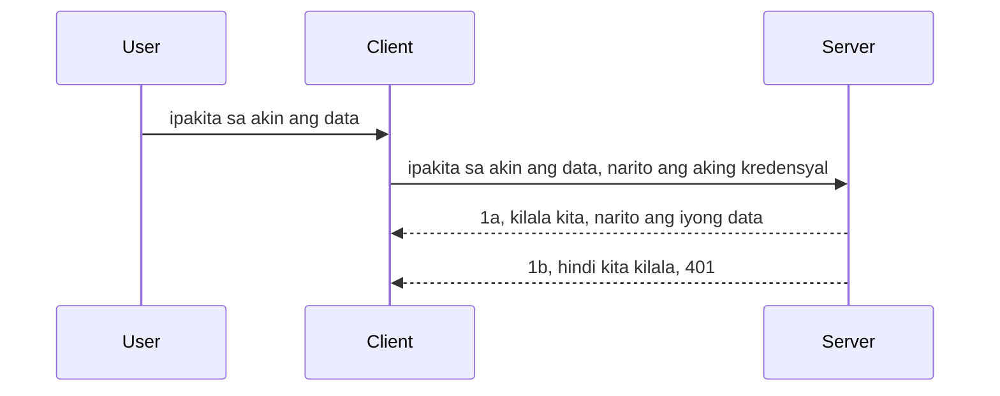

# Simple auth

Sinusuportahan ng MCP SDKs ang paggamit ng OAuth 2.1 na para maging patas isang medyo kumplikadong proseso na kinabibilangan ng mga konsepto tulad ng auth server, resource server, pagpopost ng mga kredensyal, pagkuha ng code, pagpapalit ng code para sa bearer token hanggang sa sa wakas ay makuha mo ang data ng iyong resource. Kung hindi ka sanay sa OAuth na isang mahusay na bagay na ipatupad, magandang ideya na magsimula sa ilang basic na antas ng auth at palaguin ito patungo sa mas mahusay at matibay na seguridad. Kaya narito ang kabanatang ito, para itayo ka papunta sa mas advanced na auth.

## Auth, ano ang ibig sabihin natin?

Ang Auth ay pinaikling salita para sa authentication at authorization. Ang ideya ay kailangan nating gawin ang dalawang bagay:

- **Authentication**, na proseso ng pagtukoy kung papayagan nating pumasok ang isang tao sa ating bahay, na sila ay may karapatang "nandito" o may access sa ating resource server kung saan nakatira ang mga katangian ng MCP Server.
- **Authorization**, ay ang proseso ng pagtukoy kung dapat bang magkaroon ng access ang isang user sa mga tiyak na resources na hinihiling nila, halimbawa ang mga orders o mga produkto o kung pinapayagan silang basahin ang nilalaman ngunit hindi burahin bilang isa pang halimbawa.

## Mga Kredensyal: paano natin sasabihin sa sistema kung sino tayo

Karamihan sa mga web developer ay nagsisimulang mag-isip sa pagbibigay ng kredensyal sa server, karaniwang isang sikreto na nagsasabi kung pinapayagan silang narito "Authentication". Ang kredensyal na ito ay karaniwang naka-base64 encode na bersyon ng username at password o isang API key na natatangi upang kilalanin ang isang tiyak na user.

Kabilang dito ang pagpapadala nito sa pamamagitan ng header na tinatawag na "Authorization" ganito:

```json
{ "Authorization": "secret123" }
```

Karaniwan itong tinutukoy bilang basic authentication. Paano gumagana ang kabuuang flow ay sa sumusunod na paraan:


Ngayong naiintindihan natin kung paano ito gumagana mula sa flow standpoint, paano natin ito ipatutupad? Karamihan sa mga web server ay may konseptong tinatawag na middleware, isang piraso ng code na tumatakbo bilang bahagi ng request na maaaring mag-verify ng mga kredensyal, at kung ang mga kredensyal ay wasto ay papayagan ang request na makalusot. Kung ang request ay walang balidong kredensyal, makakakuha ka ng auth error. Tingnan natin kung paano ito maisasakatuparan:

**Python**

```python
class AuthMiddleware(BaseHTTPMiddleware):
    async def dispatch(self, request, call_next):

        has_header = request.headers.get("Authorization")
        if not has_header:
            print("-> Missing Authorization header!")
            return Response(status_code=401, content="Unauthorized")

        if not valid_token(has_header):
            print("-> Invalid token!")
            return Response(status_code=403, content="Forbidden")

        print("Valid token, proceeding...")
       
        response = await call_next(request)
        # magdagdag ng mga header ng customer o baguhin ang tugon sa ilang paraan
        return response


starlette_app.add_middleware(CustomHeaderMiddleware)
```

Dito ay mayroon tayo:

- Lumikhang middleware na tinatawag na `AuthMiddleware` kung saan ang `dispatch` method nito ay tinatawag ng web server.
- Idinagdag ang middleware sa web server:

    ```python
    starlette_app.add_middleware(AuthMiddleware)
    ```

- Nakasulat ang validation logic na tinitingnan kung naroroon ang Authorization header at kung ang sikreto na ipinapadala ay wasto:

    ```python
    has_header = request.headers.get("Authorization")
    if not has_header:
        print("-> Missing Authorization header!")
        return Response(status_code=401, content="Unauthorized")

    if not valid_token(has_header):
        print("-> Invalid token!")
        return Response(status_code=403, content="Forbidden")
    ```

    kung ang sikreto ay naroroon at wasto, papayagan natin ang request na makalusot sa pamamagitan ng pagtawag sa `call_next` at ibabalik ang tugon.

    ```python
    response = await call_next(request)
    # magdagdag ng anumang customer headers o baguhin ang tugon sa ilang paraan
    return response
    ```

Gumagana ito sa paraang kapag may web request papunta sa server, tatawagin ang middleware at dahil sa implementasyon nito, papayagan nito ang request na makalusot o magbabalik ng error na nagsasabing hindi pinapayagan ang client na magpatuloy.

**TypeScript**

Dito tayo gumawa ng middleware gamit ang sikat na framework na Express at i-intercept ang request bago pa ito makarating sa MCP Server. Heto ang code para diyan:

```typescript
function isValid(secret) {
    return secret === "secret123";
}

app.use((req, res, next) => {
    // 1. Naroroon ba ang Authorization header?
    if(!req.headers["Authorization"]) {
        res.status(401).send('Unauthorized');
    }
    
    let token = req.headers["Authorization"];

    // 2. Suriin ang bisa.
    if(!isValid(token)) {
        res.status(403).send('Forbidden');
    }

   
    console.log('Middleware executed');
    // 3. Ipaubaya ang paghiling sa susunod na hakbang sa request pipeline.
    next();
});
```

Sa code na ito ay:

1. Tinitingnan kung ang Authorization header ay naroroon, kung wala, nagpapadala tayo ng 401 error.
2. Sinisiguro kung ang credential/token ay wasto, kung hindi, nagpapadala tayo ng 403 error.
3. Sa wakas, pinapasa ang request sa request pipeline at ibinabalik ang hiniling na resource.

## Ehersisyo: Ipatupad ang authentication

Gamitin natin ang ating kaalaman at subukang ipatupad ito. Heto ang plano:

Server

- Gumawa ng web server at MCP instance.
- Ipatupad ang middleware para sa server.

Client

- Magpadala ng web request, gamit ang kredensyal, sa pamamagitan ng header.

### -1- Gumawa ng web server at MCP instance

Sa unang hakbang natin, kailangan nating gumawa ng web server instance at MCP Server.

**Python**

Dito tayo gumagawa ng MCP server instance, gumawa ng starlette web app at i-host ito gamit ang uvicorn.

```python
# lumilikha ng MCP Server

app = FastMCP(
    name="MCP Resource Server",
    instructions="Resource Server that validates tokens via Authorization Server introspection",
    host=settings["host"],
    port=settings["port"],
    debug=True
)

# lumilikha ng starlette web app
starlette_app = app.streamable_http_app()

# nagseserbisyo ng app gamit ang uvicorn
async def run(starlette_app):
    import uvicorn
    config = uvicorn.Config(
            starlette_app,
            host=app.settings.host,
            port=app.settings.port,
            log_level=app.settings.log_level.lower(),
        )
    server = uvicorn.Server(config)
    await server.serve()

run(starlette_app)
```

Sa code na ito:

- Gumawa ng MCP Server.
- Ginawa ang starlette web app mula sa MCP Server, `app.streamable_http_app()`.
- In-host at pinagsilbihan ang web app gamit ang uvicorn `server.serve()`.

**TypeScript**

Dito tayo gumagawa ng MCP Server instance.

```typescript
const server = new McpServer({
      name: "example-server",
      version: "1.0.0"
    });

    // ... ayusin ang mga resources ng server, mga kagamitan, at mga paalala ...
```

Ang paggawa ng MCP Server ay kailangang gawin sa loob ng POST /mcp na route definition, kaya't kunin natin ang code sa itaas at ilipat ito ganito:

```typescript
import express from "express";
import { randomUUID } from "node:crypto";
import { McpServer } from "@modelcontextprotocol/sdk/server/mcp.js";
import { StreamableHTTPServerTransport } from "@modelcontextprotocol/sdk/server/streamableHttp.js";
import { isInitializeRequest } from "@modelcontextprotocol/sdk/types.js"

const app = express();
app.use(express.json());

// Mapa para mag-imbak ng mga transport ayon sa session ID
const transports: { [sessionId: string]: StreamableHTTPServerTransport } = {};

// Hawakan ang mga POST request para sa komunikasyon mula kliyente papuntang server
app.post('/mcp', async (req, res) => {
  // Suriin kung may umiiral na session ID
  const sessionId = req.headers['mcp-session-id'] as string | undefined;
  let transport: StreamableHTTPServerTransport;

  if (sessionId && transports[sessionId]) {
    // Gamitin muli ang umiiral na transport
    transport = transports[sessionId];
  } else if (!sessionId && isInitializeRequest(req.body)) {
    // Bagong kahilingan para sa inisyal na setup
    transport = new StreamableHTTPServerTransport({
      sessionIdGenerator: () => randomUUID(),
      onsessioninitialized: (sessionId) => {
        // I-imbak ang transport ayon sa session ID
        transports[sessionId] = transport;
      },
      // Ang proteksyon laban sa DNS rebinding ay naka-disable bilang default para sa pabalik na pagiging compatible. Kung pinapatakbo mo ang server na ito
      // nang lokal, siguraduhing itakda ang:
      // enableDnsRebindingProtection: true,
      // allowedHosts: ['127.0.0.1'],
    });

    // Linisin ang transport kapag isinarado
    transport.onclose = () => {
      if (transport.sessionId) {
        delete transports[transport.sessionId];
      }
    };
    const server = new McpServer({
      name: "example-server",
      version: "1.0.0"
    });

    // ... ihanda ang mga resources ng server, mga kagamitan, at mga prompt ...

    // Kumonekta sa MCP server
    await server.connect(transport);
  } else {
    // Hindi wastong kahilingan
    res.status(400).json({
      jsonrpc: '2.0',
      error: {
        code: -32000,
        message: 'Bad Request: No valid session ID provided',
      },
      id: null,
    });
    return;
  }

  // Hawakan ang kahilingan
  await transport.handleRequest(req, res, req.body);
});

// Maaaring gamitin muli na handler para sa mga GET at DELETE na request
const handleSessionRequest = async (req: express.Request, res: express.Response) => {
  const sessionId = req.headers['mcp-session-id'] as string | undefined;
  if (!sessionId || !transports[sessionId]) {
    res.status(400).send('Invalid or missing session ID');
    return;
  }
  
  const transport = transports[sessionId];
  await transport.handleRequest(req, res);
};

// Hawakan ang mga GET request para sa mga notipikasyon mula server papuntang kliyente gamit ang SSE
app.get('/mcp', handleSessionRequest);

// Hawakan ang mga DELETE request para sa pagtatapos ng session
app.delete('/mcp', handleSessionRequest);

app.listen(3000);
```

Ngayon makikita mo kung paano inilipat ang paggawa ng MCP Server sa loob ng `app.post("/mcp")`.

Tuloy tayo sa susunod na hakbang ng paggawa ng middleware para ma-validate natin ang papasok na kredensyal.

### -2- Ipatupad ang middleware para sa server

Pumunta tayo sa bahagi ng middleware. Dito tayo gagawa ng middleware na naghahanap ng kredensyal sa `Authorization` header at ivavalida ito. Kung ito ay tinatanggap, magpapatuloy ang request na gawin ang kailangan nito (halimbawa maglista ng tools, basahin ang isang resource o kahit anong MCP functionality na hinihingi ng client).

**Python**

Para gumawa ng middleware, kailangan nating gumawa ng klase na nagmana mula sa `BaseHTTPMiddleware`. May dalawang interesting na bahagi:

- Ang request `request`, kung saan binabasa natin ang header info.
- `call_next` na callback na tatawagin natin kung may dalang kredensyal ang client na tinatanggap natin.

Una, kailangan nating ayusin ang kaso kung nawawala ang `Authorization` header:

```python
has_header = request.headers.get("Authorization")

# walang header na naroroon, mabigo gamit ang 401, kung hindi ay magpatuloy.
if not has_header:
    print("-> Missing Authorization header!")
    return Response(status_code=401, content="Unauthorized")
```

Dito tayo nagpapadala ng 401 unauthorized message dahil pumapalya ang client sa authentication.

Sunod, kung may ipinasa na kredensyal, kailangan nating tingnan kung wasto ito ganito:

```python
 if not valid_token(has_header):
    print("-> Invalid token!")
    return Response(status_code=403, content="Forbidden")
```

Pansinin na nagpapadala tayo ng 403 forbidden message sa itaas. Tingnan ang buong middleware sa ibaba na ipinatupad ang lahat ng nabanggit natin:

```python
class AuthMiddleware(BaseHTTPMiddleware):
    async def dispatch(self, request, call_next):

        has_header = request.headers.get("Authorization")
        if not has_header:
            print("-> Missing Authorization header!")
            return Response(status_code=401, content="Unauthorized")

        if not valid_token(has_header):
            print("-> Invalid token!")
            return Response(status_code=403, content="Forbidden")

        print("Valid token, proceeding...")
        print(f"-> Received {request.method} {request.url}")
        response = await call_next(request)
        response.headers['Custom'] = 'Example'
        return response

```

Maganda, pero paano naman ang `valid_token` function? Narito ito sa ibaba:

```python
# HUWAG gamitin para sa produksyon - pagbutihin ito !!
def valid_token(token: str) -> bool:
    # alisin ang "Bearer " na panimula
    if token.startswith("Bearer "):
        token = token[7:]
        return token == "secret-token"
    return False
```

Dapat ito ay mapaunlad pa.

MAHALAGA: Huwag kailanman magkaroon ng mga sikreto tulad nito sa code. Dapat ideyal na kuhanin ang halagang ipapantay mula sa isang data source o mula sa IDP (identity service provider) o mas maganda, hayaang ang IDP ang magsagawa ng validation.

**TypeScript**

Para ipatupad ito gamit ang Express, kailangan nating tawagin ang `use` method na tumatanggap ng middleware functions.

Kailangan nating:

- Makipag-ugnayan sa request variable para tingnan ang ipinasa na kredensyal sa `Authorization` property.
- I-validate ang kredensyal, at kung wasto, papayagan ang request na magpatuloy at gawin ang kinakailangan ng client MCP request (halimbawa maglista ng tools, basahin ang resource o anumang kaugnay sa MCP).

Dito, tinitingnan natin kung naroroon ang `Authorization` header at kung wala, pinipigilan natin ang request na makalusot:

```typescript
if(!req.headers["authorization"]) {
    res.status(401).send('Unauthorized');
    return;
}
```

Kung hindi ipinadala ang header sa umpisa, makakatanggap ka ng 401.

Susunod, tinitingnan natin kung wasto ang kredensyal, kung hindi, muli naming pinipigilan ang request pero may bahagyang ibang mensahe:

```typescript
if(!isValid(token)) {
    res.status(403).send('Forbidden');
    return;
} 
```

Pansinin na ngayon ay makakakuha ka ng 403 error.

Narito ang buong code:

```typescript
app.use((req, res, next) => {
    console.log('Request received:', req.method, req.url, req.headers);
    console.log('Headers:', req.headers["authorization"]);
    if(!req.headers["authorization"]) {
        res.status(401).send('Unauthorized');
        return;
    }
    
    let token = req.headers["authorization"];

    if(!isValid(token)) {
        res.status(403).send('Forbidden');
        return;
    }  

    console.log('Middleware executed');
    next();
});
```

Naitakda natin ang web server upang tumanggap ng middleware para i-check ang kredensyal na sana ay ipinapadala ng client. Paano naman ang client mismo?

### -3- Magpadala ng web request gamit ang kredensyal sa pamamagitan ng header

Kailangan nating siguraduhin na ipinapasa ng client ang kredensyal sa header. Dahil gagamit tayo ng MCP client para dito, kailangan nating alamin kung paano ito ginagawa.

**Python**

Para sa client, kailangan nating magpasa ng header kasama ang ating kredensyal ganito:

```python
# HUWAG i-hardcode ang halaga, ilagay ito kahit man lang sa isang environment variable o sa mas secure na imbakan
token = "secret-token"

async with streamablehttp_client(
        url = f"http://localhost:{port}/mcp",
        headers = {"Authorization": f"Bearer {token}"}
    ) as (
        read_stream,
        write_stream,
        session_callback,
    ):
        async with ClientSession(
            read_stream,
            write_stream
        ) as session:
            await session.initialize()
      
            # GAWIN PA, kung ano ang gusto mong gawin sa kliyente, hal. ilista ang mga tools, tawagin ang mga tools atbp.
```

Pansinin kung paano natin pinupuno ang `headers` property ganito ` headers = {"Authorization": f"Bearer {token}"}`.

**TypeScript**

Maaari natin itong lutasin sa dalawang hakbang:

1. Punan ang isang configuration object kasama ang ating kredensyal.
2. I-pasa ang configuration object sa transport.

```typescript

// HUWAG i-hardcode ang halaga tulad ng ipinakita dito. Sa pinakamababa, gawin itong isang env variable at gumamit ng isang bagay tulad ng dotenv (sa dev mode).
let token = "secret123"

// tukuyin ang isang client transport option object
let options: StreamableHTTPClientTransportOptions = {
  sessionId: sessionId,
  requestInit: {
    headers: {
      "Authorization": "secret123"
    }
  }
};

// ipasa ang options object sa transport
async function main() {
   const transport = new StreamableHTTPClientTransport(
      new URL(serverUrl),
      options
   );
```

Dito makikita mo kung paano tayo gumawa ng `options` object at inilagay ang ating mga headers sa ilalim ng `requestInit` property.

MAHALAGA: Paano natin ito mapapabuti mula rito? Well, may ilang isyu ang kasalukuyang implementasyon. Una, ang pagpasa ng kredensyal ganito ay medyo mapanganib maliban na lang kung mayroon kang HTTPS. Kahit na ganoon, maaaring manakaw ang kredensyal kaya kailangan mo ng sistema kung saan madaling ma-revoke ang token at magdagdag ng mga karagdagang pagsisiyasat tulad ng kung saan ito nanggagaling sa mundo, kung sobrang laki ng request na ginagawa (bot-like behavior), sa madaling salita, maraming mga isyu. 

Pero dapat ding sabihin, para sa napakasimpleng API kung saan ayaw mong may tumawag sa iyong API nang hindi authenticated, itong nalalaman natin ay magandang panimula.

Sa sinabi iyon, subukan nating palakasin ang seguridad ng kaunti gamit ang standardized na format tulad ng JSON Web Token, na kilala rin bilang JWT o "JOT" tokens.

## JSON Web Tokens, JWT

Kaya sinusubukan nating pagandahin pa mula sa pagpapadala ng napakasimpleng kredensyal. Ano ang mga agarang pagpapabuti na makukuha natin gamit ang paggamit ng JWT?

- **Mga pagbuti sa seguridad**. Sa basic auth, ipinapadala mo ang username at password bilang base64 encoded token (o nagpapadala ka ng API key) nang paulit-ulit na nagdaragdag ng panganib. Sa JWT, ipinapadala mo ang iyong username at password at makakakuha ng token bilang kapalit at ito rin ay may takdang oras ibig sabihin mag-eexpire ito. Pinapayagan ka ng JWT na madaling magamit ang fine-grained access control gamit ang mga role, scopes, at permissions.
- **Statelessness at scalability**. Ang mga JWT ay self-contained, dala-dala nila ang lahat ng info ng user at inaalis ang pangangailangan sa server-side session storage. Ang token ay maaaring i-validate nang lokal.
- **Interoperability at federation**. Ang mga JWT ay sentral sa Open ID Connect at ginagamit sa mga kilalang identity providers tulad ng Entra ID, Google Identity at Auth0. Ginagawa rin nitong posible ang single sign on at marami pang iba na ginagawang enterprise-grade.
- **Modularity at flexibility**. Maaari ring magamit ang JWT sa API Gateways tulad ng Azure API Management, NGINX at iba pa. Sinusuportahan din nito ang mga senaryo ng paggamit ng authentication at server-to-service communication kabilang ang impersonation at delegation.
- **Performance at caching**. Maaaring i-cache ang JWT pagkatapos i-decode na nagpapababa sa kailangan para sa parsing. Nakakatulong ito lalo na sa high-traffic apps dahil pinapabuti ang throughput at binabawasan ang load sa iyong piniling imprastruktura.
- **Mga advanced na tampok**. Sinusuportahan din nito ang introspection (pagsusuri ng validity sa server) at revocation (pagiging invalid ng token).

Sa lahat ng mga benepisyo na ito, tingnan natin kung paano natin maaangat ang ating implementasyon sa susunod na antas.

## Pagsasalin ng basic auth patungo sa JWT

Kaya, ang mga pagbabago na kailangan nating gawin sa mataas na antas ay:

- **Matutong gumawa ng JWT token** at ihanda ito upang maipadala mula client papunta server.
- **I-validate ang JWT token**, at kung wasto, papayagan ang client na magkaroon ng mga resources natin.
- **Ligtas na pag-iimbak ng token**. Paano natin iniimbak ang token na ito.
- **Protektahan ang mga ruta**. Kailangan nating protektahan ang mga ruta, sa ating kaso, kailangan nating protektahan ang mga ruta at mga tiyak na MCP features.
- **Magdagdag ng refresh tokens**. Siguraduhin tayo na gumagawa tayo ng mga token na panandalian ngunit may mga refresh token na pangmatagalan na maaaring gamitin para makakuha ng bagong mga token kung mag-expire. Siguraduhing may refresh endpoint at rotation strategy.

### -1- Gumawa ng JWT token

Una, ang JWT token ay may mga sumusunod na bahagi:

- **header**, algorithm na ginamit at uri ng token.
- **payload**, mga claims, tulad ng sub (ang user o entity na kinakatawan ng token. Sa sitwasyon ng auth karaniwan ito ang userid), exp (kung kailan ito mag-eexpire), role (ang role).
- **signature**, nilagdaan gamit ang isang secret o private key.

Para dito, kailangan nating gumawa ng header, payload at ang encoded token.

**Python**

```python

import jwt
import jwt
from jwt.exceptions import ExpiredSignatureError, InvalidTokenError
import datetime

# Lihim na susi na ginagamit upang pirmahan ang JWT
secret_key = 'your-secret-key'

header = {
    "alg": "HS256",
    "typ": "JWT"
}

# ang impormasyon ng user at ang mga claim at oras ng pag-expire nito
payload = {
    "sub": "1234567890",               # Paksa (ID ng user)
    "name": "User Userson",                # Pasadyang claim
    "admin": True,                     # Pasadyang claim
    "iat": datetime.datetime.utcnow(),# Inilabas noong
    "exp": datetime.datetime.utcnow() + datetime.timedelta(hours=1)  # Oras ng pag-expire
}

# i-encode ito
encoded_jwt = jwt.encode(payload, secret_key, algorithm="HS256", headers=header)
```

Sa itaas na code ay:

- Nagdefine ng header gamit ang HS256 bilang algorithm at JWT bilang type.
- Gumawa ng payload na naglalaman ng subject o user id, username, role, kung kailan ito inisyu at kung kailan ito mag-eexpire kaya naipatupad ang time bound aspect na nabanggit natin kanina.

**TypeScript**

Dito kailangan natin ng ilang dependencies na tutulong sa paggawa ng JWT token.

Dependencies

```sh

npm install jsonwebtoken
npm install --save-dev @types/jsonwebtoken
```

Ngayong meron na tayong iyon, gumawa tayo ng header, payload at mula rito gumawa ng encoded token.

```typescript
import jwt from 'jsonwebtoken';

const secretKey = 'your-secret-key'; // Gamitin ang mga env vars sa produksyon

// Tukuyin ang payload
const payload = {
  sub: '1234567890',
  name: 'User usersson',
  admin: true,
  iat: Math.floor(Date.now() / 1000), // Inilabas noong
  exp: Math.floor(Date.now() / 1000) + 60 * 60 // Mag-e-expire sa loob ng 1 oras
};

// Tukuyin ang header (opsyonal, ang jsonwebtoken ay nagse-set ng mga default)
const header = {
  alg: 'HS256',
  typ: 'JWT'
};

// Gumawa ng token
const token = jwt.sign(payload, secretKey, {
  algorithm: 'HS256',
  header: header
});

console.log('JWT:', token);
```

Ang token na ito ay:

Nilagdaan gamit ang HS256  
Balido ng 1 oras  
Naglalaman ng mga claims na tulad ng sub, name, admin, iat, at exp.

### -2- I-validate ang token

Kailangan din nating i-validate ang token, ito ay dapat gawin sa server upang matiyak na ang ipinapadala ng client ay wasto. Maraming checks ang dapat gawin dito mula sa pag-validate ng istruktura nito hanggang sa pagiging wasto nito. Hinihikayat ka ring magdagdag ng iba pang pagsusuri upang matiyak na ang user ay nasa iyong sistema at marami pa.

Para i-validate ang token, kailangan muna itong i-decode upang mabasa ito at saka simulan ang pag-check ng validity:

**Python**

```python

# I-decode at i-verify ang JWT
try:
    decoded = jwt.decode(token, secret_key, algorithms=["HS256"])
    print("✅ Token is valid.")
    print("Decoded claims:")
    for key, value in decoded.items():
        print(f"  {key}: {value}")
except ExpiredSignatureError:
    print("❌ Token has expired.")
except InvalidTokenError as e:
    print(f"❌ Invalid token: {e}")

```

Sa code na ito, tinatawag ang `jwt.decode` gamit ang token, secret key at ang napiling algorithm bilang input. Pansinin na gumagamit tayo ng try-catch na construct dahil ang failed validation ay nagreresulta sa error.

**TypeScript**

Dito kailangan nating tawagin ang `jwt.verify` upang makakuha ng decoded na bersyon ng token na maaari nating suriin pa. Kung mabigo ang tawag na ito, ibig sabihin mali ang istruktura ng token o hindi na ito valid.

```typescript

try {
  const decoded = jwt.verify(token, secretKey);
  console.log('Decoded Payload:', decoded);
} catch (err) {
  console.error('Token verification failed:', err);
}
```

TANDAAN: gaya ng nabanggit noon, dapat tayong magsagawa ng mga dagdag na tsek para matiyak na ang token na ito ay tumutukoy sa user sa ating sistema at siguraduhin na ang user ay may mga karapatang sinasabi nitong taglay.
Susunod, tingnan natin ang role based access control, na kilala rin bilang RBAC.

## Pagdaragdag ng role based access control

Ang ideya ay nais nating ipahayag na ang iba't ibang mga role ay may iba't ibang mga permiso. Halimbawa, ipinapalagay natin na ang isang admin ay maaaring gawin ang lahat at ang isang normal na user ay maaaring magbasa/sulat at ang isang guest ay maaari lang magbasa. Kaya, narito ang ilang posibleng antas ng permiso:

- Admin.Write 
- User.Read
- Guest.Read

Tingnan natin kung paano natin maipapatupad ang ganitong kontrol gamit ang middleware. Ang mga middleware ay maaaring idagdag per ruta pati na rin para sa lahat ng mga ruta.

**Python**

```python
from starlette.middleware.base import BaseHTTPMiddleware
from starlette.responses import JSONResponse
import jwt

# HUWAG ilagay ang lihim sa code tulad nito, ito ay para lamang sa layunin ng demonstrasyon. Basahin ito mula sa isang ligtas na lugar.
SECRET_KEY = "your-secret-key" # ilagay ito sa env variable
REQUIRED_PERMISSION = "User.Read"

class JWTPermissionMiddleware(BaseHTTPMiddleware):
    async def dispatch(self, request, call_next):
        auth_header = request.headers.get("Authorization")
        if not auth_header or not auth_header.startswith("Bearer "):
            return JSONResponse({"error": "Missing or invalid Authorization header"}, status_code=401)

        token = auth_header.split(" ")[1]
        try:
            decoded = jwt.decode(token, SECRET_KEY, algorithms=["HS256"])
        except jwt.ExpiredSignatureError:
            return JSONResponse({"error": "Token expired"}, status_code=401)
        except jwt.InvalidTokenError:
            return JSONResponse({"error": "Invalid token"}, status_code=401)

        permissions = decoded.get("permissions", [])
        if REQUIRED_PERMISSION not in permissions:
            return JSONResponse({"error": "Permission denied"}, status_code=403)

        request.state.user = decoded
        return await call_next(request)


```

May ilang iba't ibang paraan upang idagdag ang middleware tulad ng nasa ibaba:

```python

# Alt 1: magdagdag ng middleware habang binubuo ang starlette app
middleware = [
    Middleware(JWTPermissionMiddleware)
]

app = Starlette(routes=routes, middleware=middleware)

# Alt 2: magdagdag ng middleware pagkatapos mabuo ang starlette app
starlette_app.add_middleware(JWTPermissionMiddleware)

# Alt 3: magdagdag ng middleware sa bawat ruta
routes = [
    Route(
        "/mcp",
        endpoint=..., # tagapamahala
        middleware=[Middleware(JWTPermissionMiddleware)]
    )
]
```

**TypeScript**

Maaari nating gamitin ang `app.use` at isang middleware na tatakbo para sa lahat ng mga request.

```typescript
app.use((req, res, next) => {
    console.log('Request received:', req.method, req.url, req.headers);
    console.log('Headers:', req.headers["authorization"]);

    // 1. Suriin kung naipadala ang authorization header

    if(!req.headers["authorization"]) {
        res.status(401).send('Unauthorized');
        return;
    }
    
    let token = req.headers["authorization"];

    // 2. Suriin kung valid ang token
    if(!isValid(token)) {
        res.status(403).send('Forbidden');
        return;
    }  

    // 3. Suriin kung umiiral ang user ng token sa aming sistema
    if(!isExistingUser(token)) {
        res.status(403).send('Forbidden');
        console.log("User does not exist");
        return;
    }
    console.log("User exists");

    // 4. Tiyakin na ang token ay may tamang mga permiso
    if(!hasScopes(token, ["User.Read"])){
        res.status(403).send('Forbidden - insufficient scopes');
    }

    console.log("User has required scopes");

    console.log('Middleware executed');
    next();
});

```

Maraming mga bagay na maaari nating ipagawa sa middleware at DAPAT gawin ng middleware, katulad ng:

1. Suriin kung nandiyan ang authorization header
2. Suriin kung valid ang token, tinatawag natin ang `isValid` na isang method na isinulat natin para suriin ang integridad at bisa ng JWT token.
3. Patunayan na umiiral ang user sa ating sistema, dapat natin itong suriin.

   ```typescript
    // mga gumagamit sa DB
   const users = [
     "user1",
     "User usersson",
   ]

   function isExistingUser(token) {
     let decodedToken = verifyToken(token);

     // TODO, suriin kung umiiral ang gumagamit sa DB
     return users.includes(decodedToken?.name || "");
   }
   ```

   Sa itaas, gumawa tayo ng napakasimpleng listahan na `users`, na dapat ay nasa isang database naman talaga.

4. Bukod pa rito, dapat din nating suriin kung ang token ay may tamang mga permiso.

   ```typescript
   if(!hasScopes(token, ["User.Read"])){
        res.status(403).send('Forbidden - insufficient scopes');
   }
   ```

   Sa code sa itaas mula sa middleware, sinisiguro natin na ang token ay naglalaman ng User.Read na permiso, kung hindi ay nagpapadala tayo ng 403 error. Nasa ibaba ang `hasScopes` na helper method.

   ```typescript
   function hasScopes(scope: string, requiredScopes: string[]) {
     let decodedToken = verifyToken(scope);
    return requiredScopes.every(scope => decodedToken?.scopes.includes(scope));
  }
   ```

Have a think which additional checks you should be doing, but these are the absolute minimum of checks you should be doing.

Using Express as a web framework is a common choice. There are helpers library when you use JWT so you can write less code.

- `express-jwt`, helper library that provides a middleware that helps decode your token.
- `express-jwt-permissions`, this provides a middleware `guard` that helps check if a certain permission is on the token.

Here's what these libraries can look like when used:

```typescript
const express = require('express');
const jwt = require('express-jwt');
const guard = require('express-jwt-permissions')();

const app = express();
const secretKey = 'your-secret-key'; // put this in env variable

// Decode JWT and attach to req.user
app.use(jwt({ secret: secretKey, algorithms: ['HS256'] }));

// Check for User.Read permission
app.use(guard.check('User.Read'));

// multiple permissions
// app.use(guard.check(['User.Read', 'Admin.Access']));

app.get('/protected', (req, res) => {
  res.json({ message: `Welcome ${req.user.name}` });
});

// Error handler
app.use((err, req, res, next) => {
  if (err.code === 'permission_denied') {
    return res.status(403).send('Forbidden');
  }
  next(err);
});

```

Ngayon nakita mo na kung paano ginagamit ang middleware para sa parehong authentication at authorization, paano naman ang MCP? Binabago ba nito kung paano tayo gumagawa ng auth? Alamin natin sa susunod na seksyon.

### -3- Magdagdag ng RBAC sa MCP

Nakikita mo na kung paano magdagdag ng RBAC gamit ang middleware, ngunit para sa MCP, walang madaling paraan para magdagdag ng RBAC na per MCP feature, kaya ano ang gagawin natin? Kailangan lang tayong magdagdag ng code tulad nito na nagsusuri kung ang client ay may karapatang tumawag ng isang partikular na tool:

May ilang mga pagpipilian kung paano maisasagawa ang per feature RBAC, narito ang ilan:

- Magdagdag ng pagsuri para sa bawat tool, resource, prompt kung saan kailangan mong suriin ang antas ng permiso.

   **python**

   ```python
   @tool()
   def delete_product(id: int):
      try:
          check_permissions(role="Admin.Write", request)
      catch:
        pass # nabigo ang pag-apruba ng kliyente, itaas ang error sa pag-apruba
   ```

   **typescript**

   ```typescript
   server.registerTool(
    "delete-product",
    {
      title: Delete a product",
      description: "Deletes a product",
      inputSchema: { id: z.number() }
    },
    async ({ id }) => {
      
      try {
        checkPermissions("Admin.Write", request);
        // todo, ipadala ang id sa productService at remote entry
      } catch(Exception e) {
        console.log("Authorization error, you're not allowed");  
      }

      return {
        content: [{ type: "text", text: `Deletected product with id ${id}` }]
      };
    }
   );
   ```


- Gamitin ang advanced server na pamamaraan at ang request handlers upang mabawasan kung ilang lugar ang kailangang mag-suri.

   **Python**

   ```python
   
   tool_permission = {
      "create_product": ["User.Write", "Admin.Write"],
      "delete_product": ["Admin.Write"]
   }

   def has_permission(user_permissions, required_permissions) -> bool:
      # user_permissions: listahan ng mga pahintulot na mayroon ang user
      # required_permissions: listahan ng mga kinakailangang pahintulot para sa tool
      return any(perm in user_permissions for perm in required_permissions)

   @server.call_tool()
   async def handle_call_tool(
     name: str, arguments: dict[str, str] | None
   ) -> list[types.TextContent]:
    # Ipagpalagay na ang request.user.permissions ay isang listahan ng mga pahintulot para sa user
     user_permissions = request.user.permissions
     required_permissions = tool_permission.get(name, [])
     if not has_permission(user_permissions, required_permissions):
        # Itaas ang error na "Wala kang pahintulot na gamitin ang tool na {name}"
        raise Exception(f"You don't have permission to call tool {name}")
     # ipagpatuloy at tawagin ang tool
     # ...
   ```   
   

   **TypeScript**

   ```typescript
   function hasPermission(userPermissions: string[], requiredPermissions: string[]): boolean {
       if (!Array.isArray(userPermissions) || !Array.isArray(requiredPermissions)) return false;
       // Magbalik ng true kung ang gumagamit ay may kahit isang kinakailangang pahintulot
       
       return requiredPermissions.some(perm => userPermissions.includes(perm));
   }
  
   server.setRequestHandler(CallToolRequestSchema, async (request) => {
      const { params: { name } } = request;
  
      let permissions = request.user.permissions;
  
      if (!hasPermission(permissions, toolPermissions[name])) {
         return new Error(`You don't have permission to call ${name}`);
      }
  
      // magpatuloy..
   });
   ```

   Tandaan, kailangan mong siguraduhin na ang iyong middleware ay nag-a-assign ng decoded token sa user property ng request para maging simple ang code sa itaas.

### Buod

Ngayong napag-usapan natin kung paano magdagdag ng suporta para sa RBAC sa pangkalahatan at para sa MCP partikular, oras na para subukang ipatupad ang seguridad nang sarili mo upang matiyak na naintindihan mo ang mga konseptong ipinakita sa iyo.

## Assignment 1: Gumawa ng mcp server at mcp client gamit ang basic authentication

Dito gagamitin mo ang mga natutunan mo tungkol sa pagpapadala ng credentials sa pamamagitan ng headers.

## Solution 1

[Solution 1](./code/basic/README.md)

## Assignment 2: I-upgrade ang solusyon mula sa Assignment 1 upang gumamit ng JWT

Kunin ang unang solusyon pero sa pagkakataong ito, pagbutihin natin ito.

Sa halip na Basic Auth, gamitin natin ang JWT.

## Solution 2

[Solution 2](./solution/jwt-solution/README.md)

## Hamon

Magdagdag ng RBAC per tool na inilarawan natin sa seksyong "Magdagdag ng RBAC sa MCP".

## Buod

Sana ay marami kang natutunan sa kabanatang ito, mula sa walang seguridad, sa basic security, sa JWT at kung paano ito maidagdag sa MCP.

Nakapagtayo tayo ng matibay na pundasyon gamit ang custom JWTs, ngunit habang lumalawak tayo, papunta tayo sa modelong identity na batay sa mga pamantayan. Ang paggamit ng isang IdP tulad ng Entra o Keycloak ay nagpapahintulot sa atin na i-offload ang token issuance, validation, at lifecycle management sa isang pinagkakatiwalaang platform — upang makapag-focus tayo sa app logic at karanasan ng user.

Para doon, mayroon tayong mas [advanced na kabanata tungkol sa Entra](../../05-AdvancedTopics/mcp-security-entra/README.md)

## Ano ang Susunod

- Susunod: [Pagse-setup ng MCP Hosts](../12-mcp-hosts/README.md)

---

<!-- CO-OP TRANSLATOR DISCLAIMER START -->
**Paunawa**:  
Ang dokumentong ito ay isinalin gamit ang AI translation service na [Co-op Translator](https://github.com/Azure/co-op-translator). Bagama't nagsusumikap kami para sa katumpakan, pakatandaan na ang mga awtomatikong pagsasalin ay maaaring maglaman ng mga error o di-tumpak na impormasyon. Ang orihinal na dokumento sa orihinal nitong wika ang itinuturing na pangunahing sanggunian. Para sa mahahalagang impormasyon, inirerekomenda ang propesyonal na pagsasaling-tao. Hindi kami mananagot sa anumang hindi pagkakaintindihan o maling interpretasyon na dulot ng paggamit ng pagsasaling ito.
<!-- CO-OP TRANSLATOR DISCLAIMER END -->