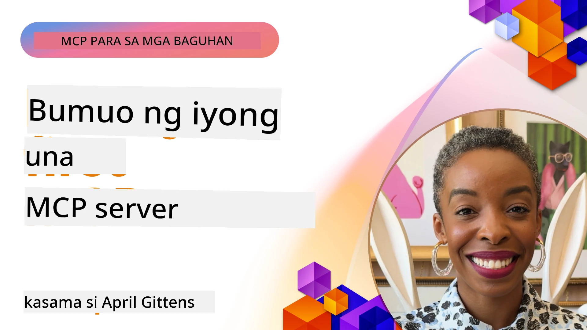

## Pagsisimula  

_(I-click ang imahe sa itaas upang mapanood ang video ng araling ito)_

Ang seksyong ito ay binubuo ng ilang mga aralin:

- **1 Ang iyong unang server**, sa unang araling ito, matututuhan mo kung paano gumawa ng iyong unang server at siyasatin ito gamit ang inspector tool, isang mahalagang paraan para subukan at i-debug ang iyong server, [sa aralin](01-first-server/README.md)

- **2 Kliyente**, sa araling ito, matututuhan mo kung paano sumulat ng kliyente na maaaring kumonekta sa iyong server, [sa aralin](02-client/README.md)

- **3 Kliyente na may LLM**, isang mas mahusay na paraan ng pagsusulat ng kliyente ay sa pamamagitan ng pagdaragdag ng LLM dito upang makapag-"negotiate" ito sa iyong server kung ano ang gagawin, [sa aralin](03-llm-client/README.md)

- **4 Paggamit ng server GitHub Copilot Agent mode sa Visual Studio Code**. Dito, tinitingnan natin ang pagpapatakbo ng ating MCP Server mula sa loob ng Visual Studio Code, [sa aralin](04-vscode/README.md)

- **5 stdio Transport Server** ang stdio transport ang inirerekomendang pamantayan para sa lokal na komunikasyon ng MCP server-to-client, na nagbibigay ng secure na subprocess-based na komunikasyon na may naka-built-in na process isolation [sa aralin](05-stdio-server/README.md)

- **6 HTTP Streaming gamit ang MCP (Streamable HTTP)**. Matututuhan ang tungkol sa modernong HTTP streaming transport (ang inirerekomendang paraan para sa remote MCP servers ayon sa [MCP Specification 2025-11-25](https://spec.modelcontextprotocol.io/specification/2025-11-25/basic/transports/#streamable-http)), mga notification ng progreso, at kung paano ipatupad ang scalable, real-time MCP servers at kliyente gamit ang Streamable HTTP. [sa aralin](06-http-streaming/README.md)

- **7 Paggamit ng AI Toolkit para sa VSCode** upang gamitin at subukan ang iyong MCP Clients at Servers [sa aralin](07-aitk/README.md)

- **8 Pagsusuri**. Dito ay tututok tayo kung paano natin masusubukan ang ating server at kliyente sa iba't ibang paraan, [sa aralin](08-testing/README.md)

- **9 Deployment**. Tatalakayin dito ang iba't ibang paraan ng pag-deploy ng iyong MCP solutions, [sa aralin](09-deployment/README.md)

- **10 Advanced na paggamit ng server**. Saklaw ng kabanatang ito ang advanced na paggamit ng server, [sa aralin](./10-advanced/README.md)

- **11 Auth**. Tinatalakay ng kabanatang ito kung paano idagdag ang simpleng auth, mula Basic Auth hanggang paggamit ng JWT at RBAC. Pinapayuhan kang magsimula dito at pagkatapos ay tingnan ang Mga Advanced na Paksa sa Kabanata 5 at magsagawa ng karagdagang security hardening ayon sa mga rekomendasyon sa Kabanata 2, [sa aralin](./11-simple-auth/README.md)

- **12 MCP Hosts**. I-configure at gamitin ang kilalang MCP host clients kabilang ang Claude Desktop, Cursor, Cline, at Windsurf. Matututuhan ang mga uri ng transport at troubleshooting, [sa aralin](./12-mcp-hosts/README.md)

- **13 MCP Inspector**. I-debug at subukan ang iyong MCP servers nang interaktibo gamit ang MCP Inspector tool. Matututuhan ang troubleshooting ng mga tools, resources, at protocol messages, [sa aralin](./13-mcp-inspector/README.md)

Ang Model Context Protocol (MCP) ay isang bukas na protocol na nag-standardize kung paano nagbibigay ang mga aplikasyon ng konteksto sa mga LLM. Isipin ang MCP tulad ng isang USB-C port para sa mga AI application - nagbibigay ito ng standardized na paraan para ikonekta ang mga AI model sa iba't ibang pinagmumulan ng data at mga kasangkapan.

## Mga Layunin ng Pag-aaral

Sa pagtatapos ng araling ito, magagawa mong:

- Mag-set up ng mga development environment para sa MCP gamit ang C#, Java, Python, TypeScript, at JavaScript
- Bumuo at mag-deploy ng mga basic na MCP server na may custom na mga tampok (resources, prompts, at tools)
- Gumawa ng mga host application na kumokonekta sa mga MCP server
- Subukan at i-debug ang mga implementasyon ng MCP
- Maunawaan ang mga karaniwang problema sa setup at ang kanilang mga solusyon
- Ikonekta ang iyong mga implementasyon ng MCP sa mga kilalang serbisyo ng LLM

## Pagsasaayos ng Iyong MCP Environment

Bago ka magsimulang magtrabaho sa MCP, mahalagang ihanda ang iyong development environment at maunawaan ang pangunahing workflow. Gagabayan ka ng seksyong ito sa mga paunang hakbang sa pag-setup upang matiyak ang maayos na pagsisimula sa MCP.

### Mga Kinakailangan

Bago pasukin ang pag-develop sa MCP, tiyakin na mayroon kang:

- **Development Environment**: Para sa napili mong wika (C#, Java, Python, TypeScript, o JavaScript)
- **IDE/Editor**: Visual Studio, Visual Studio Code, IntelliJ, Eclipse, PyCharm, o anumang modernong code editor
- **Package Managers**: NuGet, Maven/Gradle, pip, o npm/yarn
- **API Keys**: Para sa anumang AI service na balak mong gamitin sa iyong mga host application

### Opisyal na mga SDK

Sa mga susunod na kabanata makakakita ka ng mga solusyon na ginawa gamit ang Python, TypeScript, Java, at .NET. Narito ang lahat ng opisyal na suportadong SDK.

Nagbibigay ang MCP ng opisyal na mga SDK para sa iba't ibang wika (ayon sa [MCP Specification 2025-11-25](https://spec.modelcontextprotocol.io/specification/2025-11-25/)):

- [C# SDK](https://github.com/modelcontextprotocol/csharp-sdk) - Pinapanatili sa pakikipagtulungan sa Microsoft
- [Java SDK](https://github.com/modelcontextprotocol/java-sdk) - Pinapanatili sa pakikipagtulungan sa Spring AI
- [TypeScript SDK](https://github.com/modelcontextprotocol/typescript-sdk) - Opisyal na implementasyon sa TypeScript
- [Python SDK](https://github.com/modelcontextprotocol/python-sdk) - Opisyal na implementasyon sa Python (FastMCP)
- [Kotlin SDK](https://github.com/modelcontextprotocol/kotlin-sdk) - Opisyal na implementasyon sa Kotlin
- [Swift SDK](https://github.com/modelcontextprotocol/swift-sdk) - Pinapanatili sa pakikipagtulungan sa Loopwork AI
- [Rust SDK](https://github.com/modelcontextprotocol/rust-sdk) - Opisyal na implementasyon sa Rust
- [Go SDK](https://github.com/modelcontextprotocol/go-sdk) - Opisyal na implementasyon sa Go

## Mahahalagang Punto

- Madaling mag-set up ng MCP development environment gamit ang mga SDK na nakaakma sa bawat wika
- Ang paggawa ng MCP servers ay kinapapalooban ng paglikha at pagrerehistro ng mga tool na may malinaw na mga schema
- Ang mga MCP client ay kumokonekta sa mga server at modelo upang magamit ang extended na mga kakayahan
- Mahalaga ang pagsusuri at pag-debug para sa maaasahang mga implementasyon ng MCP
- Ang mga pagpipilian sa deployment ay nagsisimula mula sa lokal na development hanggang sa mga cloud-based na solusyon

## Pagsasanay

Mayroon kaming hanay ng mga sample na sumusuporta sa mga ehersisyo na makikita mo sa lahat ng kabanata sa seksyong ito. Bukod pa rito, bawat kabanata ay may sariling mga ehersisyo at takdang-aralin

- [Java Calculator](./samples/java/calculator/README.md)
- [.Net Calculator](../../../03-GettingStarted/samples/csharp)
- [JavaScript Calculator](./samples/javascript/README.md)
- [TypeScript Calculator](./samples/typescript/README.md)
- [Python Calculator](../../../03-GettingStarted/samples/python)

## Karagdagang Mga Mapagkukunan

- [Bumuo ng Mga Ahente gamit ang Model Context Protocol sa Azure](https://learn.microsoft.com/azure/developer/ai/intro-agents-mcp)
- [Remote MCP gamit ang Azure Container Apps (Node.js/TypeScript/JavaScript)](https://learn.microsoft.com/samples/azure-samples/mcp-container-ts/mcp-container-ts/)
- [.NET OpenAI MCP Agent](https://learn.microsoft.com/samples/azure-samples/openai-mcp-agent-dotnet/openai-mcp-agent-dotnet/)

## Ano ang susunod

Magsimula sa unang aralin: [Paglikha ng iyong unang MCP Server](01-first-server/README.md)

Kapag natapos mo na ang module na ito, magpatuloy sa: [Module 4: Praktikal na Implementasyon](../04-PracticalImplementation/README.md)

---

<!-- CO-OP TRANSLATOR DISCLAIMER START -->
**Paalala**:
Ang dokumentong ito ay isinalin gamit ang serbisyong AI na pagsasalin, [Co-op Translator](https://github.com/Azure/co-op-translator). Bagaman nagsusumikap kaming maging tumpak, mangyaring tandaan na ang mga awtomatikong pagsasalin ay maaaring maglaman ng mga pagkakamali o hindi pagkakatugma. Ang orihinal na dokumento sa kaniyang sariling wika ang dapat ituring na pangunahing sanggunian. Para sa mahahalagang impormasyon, inirerekomenda ang propesyonal na pagsasalin ng tao. Hindi kami mananagutan sa anumang hindi pagkakaunawaan o maling interpretasyon na maaaring mabuo mula sa paggamit ng pagsasaling ito.
<!-- CO-OP TRANSLATOR DISCLAIMER END -->