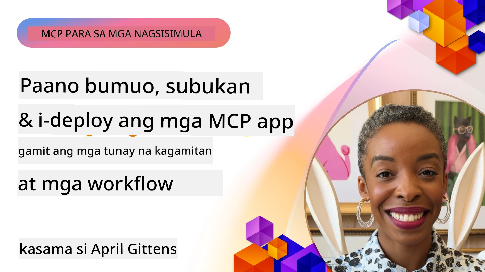
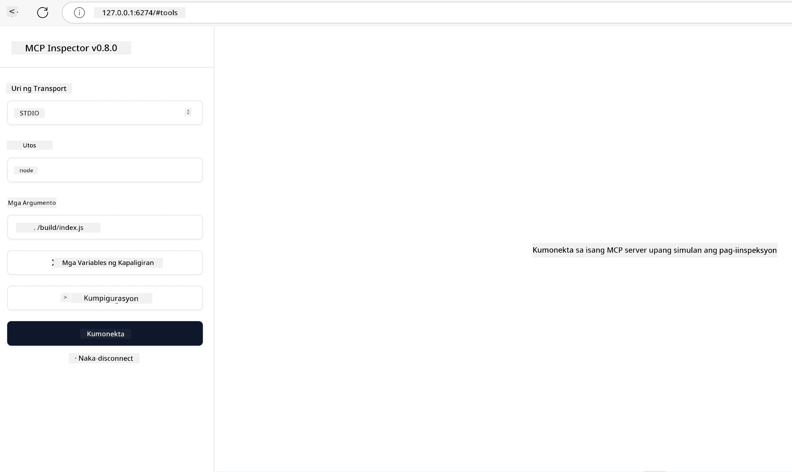

# Praktikal na Implementasyon

[](https://youtu.be/vCN9-mKBDfQ)

_(I-click ang larawan sa itaas para panoorin ang video ng araling ito)_

Ang praktikal na implementasyon ay kung saan nagiging konkreto ang kapangyarihan ng Model Context Protocol (MCP). Habang mahalaga ang pag-unawa sa teorya at arkitektura sa likod ng MCP, tunay na halaga ay lumalabas kapag inilapat mo ang mga konseptong ito upang bumuo, magsubok, at mag-deploy ng mga solusyong lumulutas sa mga totoong problema sa mundo. Ang kabanatang ito ay pinagdurugtong ang agwat sa pagitan ng kaalaman sa konsepto at praktikal na pag-develop, na ginagabayan ka sa proseso ng paglikha ng mga aplikasyon batay sa MCP.

Kung ikaw man ay nagde-develop ng matatalinong mga katulong, nag-iintegrate ng AI sa mga business workflows, o gumagawa ng mga custom na tools para sa pagproseso ng datos, nagbibigay ang MCP ng isang flexible na pundasyon. Ang language-agnostic na disenyo nito at mga opisyal na SDK para sa mga popular na programming languages ay ginagawang accessible ito sa malawak na hanay ng mga developer. Sa pamamagitan ng paggamit ng mga SDK na ito, mabilis kang makakagawa ng prototype, makakapag-iterate, at makakapag-scale ng iyong mga solusyon sa iba't ibang platform at environment.

Sa mga sumusunod na seksyon, makikita mo ang mga praktikal na halimbawa, sample na code, at mga deployment strategy na nagpapakita kung paano mag-implement ng MCP sa C#, Java gamit ang Spring, TypeScript, JavaScript, at Python. Matututuhan mo rin kung paano mag-debug at magsubok ng iyong MCP servers, pamahalaan ang mga API, at mag-deploy ng mga solusyon sa cloud gamit ang Azure. Ang mga hands-on na resources na ito ay dinisenyo upang pabilisin ang iyong pagkatuto at tulungan kang may kumpiyansang bumuo ng matibay, production-ready na mga MCP application.

## Pangkalahatang Ideya

Nakatuon ang araling ito sa praktikal na aspeto ng implementasyon ng MCP sa iba't ibang programming languages. Tatalakayin natin kung paano gamitin ang mga MCP SDK sa C#, Java gamit ang Spring, TypeScript, JavaScript, at Python para bumuo ng matitibay na aplikasyon, mag-debug at magsubok ng MCP servers, at lumikha ng mga reusable na resources, prompts, at tools.

## Mga Layunin sa Pagkatuto

Sa pagtatapos ng araling ito, magagawa mong:

- I-implement ang mga solusyon ng MCP gamit ang opisyal na mga SDK sa iba't ibang programming languages
- Mag-debug at magsubok ng MCP servers nang sistematiko
- Lumikha at gumamit ng mga server feature (Resources, Prompts, at Tools)
- Magdisenyo ng epektibong mga MCP workflow para sa mga komplikadong gawain
- I-optimize ang mga implementasyon ng MCP para sa performance at pagiging maaasahan

## Mga Opisyal na SDK na Resource

Nag-aalok ang Model Context Protocol ng mga opisyal na SDK para sa maraming mga wika (ayon sa [MCP Specification 2025-11-25](https://spec.modelcontextprotocol.io/specification/2025-11-25/)):

- [C# SDK](https://github.com/modelcontextprotocol/csharp-sdk)
- [Java gamit ang Spring SDK](https://github.com/modelcontextprotocol/java-sdk) **Tandaan:** kailangan nito ng dependency sa [Project Reactor](https://projectreactor.io). (Tingnan ang [discussion issue 246](https://github.com/orgs/modelcontextprotocol/discussions/246).)
- [TypeScript SDK](https://github.com/modelcontextprotocol/typescript-sdk)
- [Python SDK](https://github.com/modelcontextprotocol/python-sdk)
- [Kotlin SDK](https://github.com/modelcontextprotocol/kotlin-sdk)
- [Go SDK](https://github.com/modelcontextprotocol/go-sdk)

## Paggamit ng MCP SDKs

Nagbibigay ang seksyong ito ng mga praktikal na halimbawa ng implementasyon ng MCP sa iba't ibang programming languages. Makikita mo ang sample na code sa direktoryo na `samples` na nakaayos ayon sa wika.

### Mga Available na Sample

Kasama sa repository ang [mga sample na implementasyon](../../../04-PracticalImplementation/samples) sa mga sumusunod na wika:

- [C#](./samples/csharp/README.md)
- [Java gamit ang Spring](./samples/java/containerapp/README.md)
- [TypeScript](./samples/typescript/README.md)
- [JavaScript](./samples/javascript/README.md)
- [Python](./samples/python/README.md)

Bawat sample ay nagpapakita ng mga pangunahing konsepto at pattern ng implementasyon ng MCP para sa partikular na wika at ecosystem.

### Praktikal na Gabay

Karagdagang mga gabay para sa praktikal na implementasyon ng MCP:

- [Pagination at Malalaking Resulta](./pagination/README.md) - Pamahalaan ang cursor-based na pagination para sa mga tool, resource, at malalaking dataset

## Pangunahing Mga Feature ng Server

Maaaring mag-implementa ang mga MCP server ng kahit anong kumbinasyon ng mga sumusunod na feature:

### Mga Resources

Nagbibigay ang mga resources ng konteksto at datos para gamitin ng user o AI model:

- Mga repositoryo ng dokumento
- Mga knowledge base
- Mga structured data source
- Mga file system

### Mga Prompts

Ang mga prompts ay mga templated na mensahe at workflows para sa mga user:

- Mga paunang-deklaradong template ng pag-uusap
- Mga gabay na pattern ng interaksyon
- Espesyal na istruktura ng diyalogo

### Mga Tools

Ang mga tools ay mga function na isinasagawa ng AI model:

- Mga utility para sa pagproseso ng datos
- Mga integrasyon ng external API
- Mga computational na kakayahan
- Functionality para sa paghahanap

## Mga Sample na Implementasyon: C# Implementation

Ang opisyal na C# SDK repository ay naglalaman ng ilang sample na implementasyon na nagpapakita ng iba't ibang aspeto ng MCP:

- **Basic MCP Client**: Simpleng halimbawa kung paano gumawa ng MCP client at tumawag ng mga tool
- **Basic MCP Server**: Minimal na implementasyon ng server na may basic tool registration
- **Advanced MCP Server**: Kompletong server na may tool registration, authentication, at error handling
- **ASP.NET Integration**: Mga halimbawa ng integrasyon sa ASP.NET Core
- **Mga Pattern ng Implementasyon ng Tool**: Iba't ibang pattern para mag-implementa ng mga tool na may iba't ibang antas ng komplikasyon

Ang MCP C# SDK ay nasa preview pa at maaaring magbago ang mga API. Patuloy naming ia-update ang blog na ito habang umuunlad ang SDK.

### Pangunahing Mga Feature

- [C# MCP Nuget ModelContextProtocol](https://www.nuget.org/packages/ModelContextProtocol)
- Paggawa ng iyong [unang MCP Server](https://devblogs.microsoft.com/dotnet/build-a-model-context-protocol-mcp-server-in-csharp/).

Para sa kumpletong mga sample ng implementasyon sa C#, bisitahin ang [opisyal na C# SDK samples repository](https://github.com/modelcontextprotocol/csharp-sdk)

## Sample na Implementasyon: Java gamit ang Spring

Nag-aalok ang Java gamit ang Spring SDK ng matatag na mga opsyon para sa implementasyon ng MCP na may mga enterprise-grade na feature.

### Pangunahing Mga Feature

- Integrasyon sa Spring Framework
- Malakas na type safety
- Suporta sa reactive programming
- Kompletong error handling

Para sa kumpletong sample ng implementasyon ng Java gamit ang Spring, tingnan ang [Java gamit ang Spring sample](samples/java/containerapp/README.md) sa samples directory.

## Sample na Implementasyon: JavaScript

Nagbibigay ang JavaScript SDK ng magaan at flexible na paraan para sa implementasyon ng MCP.

### Pangunahing Mga Feature

- Suporta sa Node.js at browser
- Promise-based na API
- Madaling integrasyon sa Express at iba pang framework
- Suporta sa WebSocket para sa streaming

Para sa kumpletong sample ng implementasyon sa JavaScript, tingnan ang [JavaScript sample](samples/javascript/README.md) sa samples directory.

## Sample na Implementasyon: Python

Nag-aalok ang Python SDK ng Pythonic na paraan sa implementasyon ng MCP na may mahusay na integrasyon sa ML framework.

### Pangunahing Mga Feature

- Async/await na suporta gamit ang asyncio
- Integrasyon sa FastAPI
- Simpleng tool registration
- Native na integrasyon sa mga popular na ML library

Para sa kumpletong sample ng implementasyon sa Python, tingnan ang [Python sample](samples/python/README.md) sa samples directory.

## Pamamahala ng API

Ang Azure API Management ay isang mahusay na sagot kung paano natin maisesecure ang mga MCP Server. Ang ideya ay ilagay ang isang Azure API Management instance sa harap ng iyong MCP Server at hayaan itong hawakan ang mga feature na malamang gusto mo tulad ng:

- rate limiting
- token management
- monitoring
- load balancing
- security

### Azure Sample

Narito ang isang Azure Sample na ginagawa ang eksaktong iyon, ibig sabihin [paglikha ng MCP Server at pag-secure nito gamit ang Azure API Management](https://github.com/Azure-Samples/remote-mcp-apim-functions-python).

Tingnan kung paano nangyayari ang authorization flow sa imahe sa ibaba:


Sa nakaraang imahe, nangyayari ang mga sumusunod:

- Ang Authentication/Authorization ay isinasagawa gamit ang Microsoft Entra.
- Gumaganap ang Azure API Management bilang gateway at gumagamit ng mga patakaran para idirekta at pamahalaan ang trapiko.
- Nilo-log ng Azure Monitor ang lahat ng request para sa karagdagang pagsusuri.

#### Authorization flow

Tingnan natin nang mas detalyado ang authorization flow:


#### MCP authorization specification

Alamin ang higit pa tungkol sa [MCP Authorization specification](https://spec.modelcontextprotocol.io/specification/2025-11-25/basic/authorization/)

## Mag-deploy ng Remote MCP Server sa Azure

Tingnan natin kung maaari nating i-deploy ang sample na binanggit natin kanina:

1. I-clone ang repo

    ```bash
    git clone https://github.com/Azure-Samples/remote-mcp-apim-functions-python.git
    cd remote-mcp-apim-functions-python
    ```

1. I-register ang `Microsoft.App` resource provider.

   - Kung gumagamit ka ng Azure CLI, patakbuhin ang `az provider register --namespace Microsoft.App --wait`.
   - Kung gumagamit ka ng Azure PowerShell, patakbuhin ang `Register-AzResourceProvider -ProviderNamespace Microsoft.App`. Pagkatapos ay patakbuhin ang `(Get-AzResourceProvider -ProviderNamespace Microsoft.App).RegistrationState` pagkatapos ng ilang sandali upang suriin kung kumpleto na ang pagrerehistro.

1. Patakbuhin ang utos na ito mula sa [azd](https://aka.ms/azd) para mag-provision ng api management service, function app(kasama ang code), at lahat ng iba pang kinakailangang Azure resources

    ```shell
    azd up
    ```

    Dapat nitong ideploy lahat ng cloud resources sa Azure

### Pagsusuri ng iyong server gamit ang MCP Inspector

1. Sa isang **bagong terminal window**, i-install at patakbuhin ang MCP Inspector

    ```shell
    npx @modelcontextprotocol/inspector
    ```

    Dapat mong makita ang isang interface na katulad nito:

    

1. CTRL click para i-load ang MCP Inspector web app mula sa URL na ipinapakita ng app (e.g. [http://127.0.0.1:6274/#resources](http://127.0.0.1:6274/#resources))
1. Itakda ang uri ng transport sa `SSE`
1. Itakda ang URL sa iyong tumatakbong API Management SSE endpoint na ipinapakita pagkatapos ng `azd up` at **Connect**:

    ```shell
    https://<apim-servicename-from-azd-output>.azure-api.net/mcp/sse
    ```

1. **List Tools**. I-click ang isang tool at **Run Tool**.

Kung gumana ang lahat ng mga hakbang, nakakonekta ka na ngayon sa MCP server at nagawa mong tawagan ang isang tool.

## MCP server para sa Azure

[Remote-mcp-functions](https://github.com/Azure-Samples/remote-mcp-functions-dotnet): Ang set ng mga repository na ito ay quickstart template para sa paggawa at pag-deploy ng custom remote MCP (Model Context Protocol) servers gamit ang Azure Functions gamit ang Python, C# .NET, o Node/TypeScript.

Nagbibigay ang mga Sample ng isang kompletong solusyon na nagpapahintulot sa mga developer na:

- Magtayo at magpatakbo nang lokal: Mag-develop at mag-debug ng MCP server sa isang lokal na makina
- Mag-deploy sa Azure: Madaling mag-deploy sa cloud gamit ang simpleng utos na azd up
- Kumonekta mula sa mga client: Kumonekta sa MCP server mula sa iba't ibang client kabilang ang VS Code's Copilot agent mode at ang MCP Inspector tool

### Pangunahing Mga Feature

- Seguridad mula sa disenyo: Ang MCP server ay secure gamit ang mga key at HTTPS
- Mga opsyon sa authentication: Sinusuportahan ang OAuth gamit ang built-in na auth at/o API Management
- Network isolation: Pinapayagan ang network isolation gamit ang Azure Virtual Networks (VNET)
- Serverless na arkitektura: Ginagamit ang Azure Functions para sa scalable, event-driven execution
- Lokal na pag-develop: Komprehensibong suporta sa lokal na pag-develop at debugging
- Simpleng deployment: Streamlined na proseso ng deployment sa Azure

Kasama sa repository ang lahat ng kinakailangang configuration files, source code, at mga depinisyon ng infrastructure para mabilis makapagsimula sa isang production-ready na MCP server implementation.

- [Azure Remote MCP Functions Python](https://github.com/Azure-Samples/remote-mcp-functions-python) - Sample na implementasyon ng MCP gamit ang Azure Functions sa Python

- [Azure Remote MCP Functions .NET](https://github.com/Azure-Samples/remote-mcp-functions-dotnet) - Sample na implementasyon ng MCP gamit ang Azure Functions sa C# .NET

- [Azure Remote MCP Functions Node/Typescript](https://github.com/Azure-Samples/remote-mcp-functions-typescript) - Sample na implementasyon ng MCP gamit ang Azure Functions sa Node/TypeScript.

## Mga Mahahalagang Natutunan

- Nagbibigay ang MCP SDKs ng mga language-specific na tools para sa pag-implementa ng matibay na MCP solution
- Kritikal ang proseso ng pag-debug at pagsubok para sa maaasahang MCP application
- Pinapayagan ng reusable na prompt templates ang konsistent na mga AI interaction
- Ang mahusay na pagkadesenyo ng workflow ay maaaring mag-orchestrate ng mga komplikadong gawain gamit ang maraming tools
- Nangangailangan ang pag-implementa ng mga MCP solution ng pagsasaalang-alang sa seguridad, performance, at pamamahala ng error

## Ehersisyo

Disenyo ng isang praktikal na MCP workflow na tumutugon sa isang totoong problema sa iyong domain:

1. Tukuyin ang 3-4 na tools na magiging kapaki-pakinabang sa paglutas ng problemang ito
2. Gumuhit ng isang workflow diagram na nagpapakita kung paano nag-iinteract ang mga tool na ito
3. I-implementa ang isang basic na bersyon ng isa sa mga tool gamit ang iyong preferred na wika
4. Gumawa ng prompt template na tutulong sa model na epektibong gamitin ang iyong tool

## Karagdagang Resource

---

## Ano ang Susunod

Susunod: [Mga Advanced na Paksa](../05-AdvancedTopics/README.md)

---

<!-- CO-OP TRANSLATOR DISCLAIMER START -->
**Paunawa**:  
Ang dokumentong ito ay isinalin gamit ang AI translation service na [Co-op Translator](https://github.com/Azure/co-op-translator). Bagamat nagsusumikap kami para sa katumpakan, pakatandaan na ang mga awtomatikong pagsasalin ay maaaring maglaman ng mga pagkakamali o hindi wastong impormasyon. Ang orihinal na dokumento sa wikang kinapanganakan nito ang dapat ituring na pangunahing pinagkukunan. Para sa mahahalagang impormasyon, inirerekomenda ang propesyonal na pagsasalin ng tao. Hindi kami mananagot sa anumang hindi pagkakaunawaan o maling interpretasyon na nagmula sa paggamit ng pagsasaling ito.
<!-- CO-OP TRANSLATOR DISCLAIMER END -->