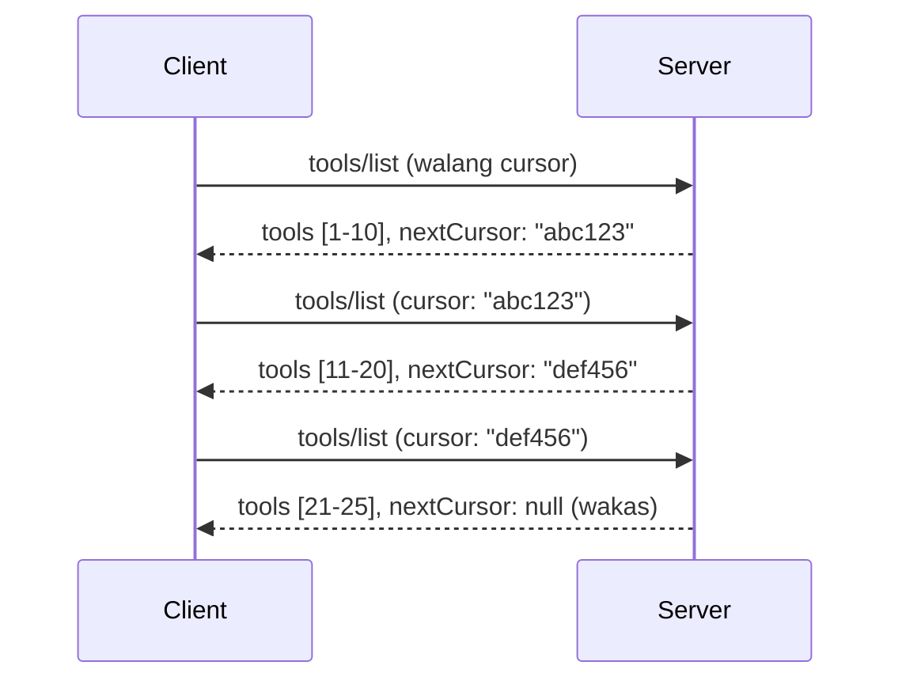

# Pagination at Malalaking Resulta sa MCP

Kapag ang iyong MCP server ay humahandle ng malalaking datasets - maging ito man ay paglista ng libu-libong mga file, tala sa database, o mga resulta ng paghahanap - kailangan mo ng pagination para pamahalaan nang maayos ang memorya at magbigay ng mabilis na karanasan sa mga user. Tinatalakay ng gabay na ito kung paano mag-implement at gumamit ng pagination sa MCP.

## Bakit Mahalaga ang Pagination

Kung walang pagination, ang malalaking tugon ay maaaring magdulot ng:

- **Pagkapagod ng memorya** - Paglo-load ng milyong tala nang sabay-sabay
- **Mabagal na oras ng tugon** - Naghihintay ang mga user habang niloload ang lahat ng data
- **Mga error sa timeout** - Lumalampas sa limitasyon ng oras ng request
- **Mahinang pagganap ng AI** - Nahihirapan ang LLMs sa napakalaking konteksto

Ginagamit ng MCP ang **cursor-based pagination** para sa maaasahan at pantay-pantay na paging sa mga resulta.

---

## Paano Gumagana ang Pagination sa MCP

### Ang Konsepto ng Cursor

Ang **cursor** ay isang opaque na string na nagmamarka ng iyong posisyon sa isang resulta. Isipin ito bilang bookmark sa isang mahabang libro.


### Pagination sa Mga Paraan ng MCP

Ang mga paraang MCP na ito ay sumusuporta sa pagination:

| Paraan | Ibinabalik | Suporta sa Cursor |
|--------|------------|-------------------|
| `tools/list` | Mga depinisyon ng tool | ✅ |
| `resources/list` | Mga depinisyon ng resource | ✅ |
| `prompts/list` | Mga depinisyon ng prompt | ✅ |
| `resources/templates/list` | Mga template ng resource | ✅ |

---

## Implementasyon sa Server

### Python (FastMCP)

```python
from mcp.server import Server
from mcp.types import Tool, ListToolsResult
import math

app = Server("paginated-server")

# Ginaya na malaking dataset
ALL_TOOLS = [
    Tool(name=f"tool_{i}", description=f"Tool number {i}", inputSchema={})
    for i in range(100)
]

PAGE_SIZE = 10

@app.list_tools()
async def list_tools(cursor: str | None = None) -> ListToolsResult:
    """List tools with pagination support."""
    
    # I-decode ang cursor para makuha ang panimulang index
    start_index = 0
    if cursor:
        try:
            start_index = int(cursor)
        except ValueError:
            start_index = 0
    
    # Kunin ang pahina ng mga resulta
    end_index = min(start_index + PAGE_SIZE, len(ALL_TOOLS))
    page_tools = ALL_TOOLS[start_index:end_index]
    
    # Kalkulahin ang susunod na cursor
    next_cursor = None
    if end_index < len(ALL_TOOLS):
        next_cursor = str(end_index)
    
    return ListToolsResult(
        tools=page_tools,
        nextCursor=next_cursor
    )
```

### TypeScript

```typescript
import { Server } from "@modelcontextprotocol/sdk/server/index.js";
import { ListToolsResultSchema } from "@modelcontextprotocol/sdk/types.js";

const server = new Server({
  name: "paginated-server",
  version: "1.0.0"
});

// Sinimulang malaking dataset
const ALL_TOOLS = Array.from({ length: 100 }, (_, i) => ({
  name: `tool_${i}`,
  description: `Tool number ${i}`,
  inputSchema: { type: "object", properties: {} }
}));

const PAGE_SIZE = 10;

server.setRequestHandler(ListToolsResultSchema, async (request) => {
  // I-decode ang cursor
  let startIndex = 0;
  if (request.params?.cursor) {
    startIndex = parseInt(request.params.cursor, 10) || 0;
  }
  
  // Kunin ang pahina ng mga resulta
  const endIndex = Math.min(startIndex + PAGE_SIZE, ALL_TOOLS.length);
  const pageTools = ALL_TOOLS.slice(startIndex, endIndex);
  
  // Kalkulahin ang susunod na cursor
  const nextCursor = endIndex < ALL_TOOLS.length ? String(endIndex) : undefined;
  
  return {
    tools: pageTools,
    nextCursor
  };
});
```

### Java (Spring MCP)

```java
@Service
public class PaginatedToolService {
    
    private static final int PAGE_SIZE = 10;
    private final List<Tool> allTools;
    
    public PaginatedToolService() {
        // I-initialize ang malaking dataset
        this.allTools = IntStream.range(0, 100)
            .mapToObj(i -> new Tool("tool_" + i, "Tool number " + i, Map.of()))
            .collect(Collectors.toList());
    }
    
    @McpMethod("tools/list")
    public ListToolsResult listTools(@Param("cursor") String cursor) {
        // I-decode ang cursor
        int startIndex = 0;
        if (cursor != null && !cursor.isEmpty()) {
            try {
                startIndex = Integer.parseInt(cursor);
            } catch (NumberFormatException e) {
                startIndex = 0;
            }
        }
        
        // Kunin ang pahina ng mga resulta
        int endIndex = Math.min(startIndex + PAGE_SIZE, allTools.size());
        List<Tool> pageTools = allTools.subList(startIndex, endIndex);
        
        // Kalkulahin ang susunod na cursor
        String nextCursor = endIndex < allTools.size() ? String.valueOf(endIndex) : null;
        
        return new ListToolsResult(pageTools, nextCursor);
    }
}
```

---

## Implementasyon sa Client

### Python Client

```python
from mcp import ClientSession

async def get_all_tools(session: ClientSession) -> list:
    """Fetch all tools using pagination."""
    all_tools = []
    cursor = None
    
    while True:
        result = await session.list_tools(cursor=cursor)
        all_tools.extend(result.tools)
        
        if result.nextCursor is None:
            break
        cursor = result.nextCursor
    
    return all_tools

# Paggamit
async with client_session as session:
    tools = await get_all_tools(session)
    print(f"Found {len(tools)} tools")
```

### TypeScript Client

```typescript
import { Client } from "@modelcontextprotocol/sdk/client/index.js";

async function getAllTools(client: Client): Promise<Tool[]> {
  const allTools: Tool[] = [];
  let cursor: string | undefined = undefined;
  
  do {
    const result = await client.listTools({ cursor });
    allTools.push(...result.tools);
    cursor = result.nextCursor;
  } while (cursor);
  
  return allTools;
}

// Paggamit
const tools = await getAllTools(client);
console.log(`Found ${tools.length} tools`);
```

### Pattern ng Lazy Loading

Para sa sobrang malalaking datasets, mag-load ng mga pahina kapag hiniling:

```python
class PaginatedToolIterator:
    """Lazily iterate through paginated tools."""
    
    def __init__(self, session: ClientSession):
        self.session = session
        self.cursor = None
        self.buffer = []
        self.exhausted = False
    
    async def __anext__(self):
        # Ibalik mula sa buffer kung available
        if self.buffer:
            return self.buffer.pop(0)
        
        # Suriin kung naubos na ba ang lahat ng pahina
        if self.exhausted:
            raise StopAsyncIteration
        
        # Kunin ang susunod na pahina
        result = await self.session.list_tools(cursor=self.cursor)
        self.buffer = list(result.tools)
        self.cursor = result.nextCursor
        
        if self.cursor is None:
            self.exhausted = True
        
        if not self.buffer:
            raise StopAsyncIteration
        
        return self.buffer.pop(0)
    
    def __aiter__(self):
        return self

# Paggamit - memory efficient para sa malalaking dataset
async for tool in PaginatedToolIterator(session):
    process_tool(tool)
```

---

## Pagination para sa mga Resource

Kadalasang kailangan ng pagination ang mga resource para sa mga direktoryo o malalaking dataset:

```python
from mcp.server import Server
from mcp.types import Resource, ListResourcesResult
import os

app = Server("file-server")

@app.list_resources()
async def list_resources(cursor: str | None = None) -> ListResourcesResult:
    """List files in directory with pagination."""
    
    directory = "/data/files"
    all_files = sorted(os.listdir(directory))
    
    # I-decode ang cursor (index ng file)
    start_index = int(cursor) if cursor else 0
    page_size = 20
    end_index = min(start_index + page_size, len(all_files))
    
    # Gumawa ng listahan ng mga resource para sa pahinang ito
    resources = []
    for filename in all_files[start_index:end_index]:
        filepath = os.path.join(directory, filename)
        resources.append(Resource(
            uri=f"file://{filepath}",
            name=filename,
            mimeType="application/octet-stream"
        ))
    
    # Kalkulahin ang susunod na cursor
    next_cursor = str(end_index) if end_index < len(all_files) else None
    
    return ListResourcesResult(
        resources=resources,
        nextCursor=next_cursor
    )
```

---

## Mga Disenyo ng Cursor na Estratehiya

### Estratehiya 1: Index-Based (Simple)

```python
# Ang cursor ay ang index lamang
cursor = "50"  # Magsimula sa item 50
```

**Mga Bentahe:** Simple, walang estado
**Mga Kahinaan:** Maaaring magiba ang resulta kung may idagdag/bawasan

### Estratehiya 2: ID-Based (Stable)

```python
# Ang cursor ay ang huling nakitang ID
cursor = "item_abc123"  # Magsimula pagkatapos ng item na ito
```

**Mga Bentahe:** Matatag kahit magbago ang mga item
**Mga Kahinaan:** Nangangailangan ng nakaayos na mga ID

### Estratehiya 3: Encoded State (Complex)

```python
import base64
import json

def encode_cursor(state: dict) -> str:
    return base64.b64encode(json.dumps(state).encode()).decode()

def decode_cursor(cursor: str) -> dict:
    return json.loads(base64.b64decode(cursor).decode())

# Naglalaman ang cursor ng maraming mga patlang ng estado
cursor = encode_cursor({
    "offset": 50,
    "filter": "active",
    "sort": "name"
})
```

**Mga Bentahe:** Kayang i-encode ang komplikadong estado
**Mga Kahinaan:** Mas kumplikado, mas mahahabang cursor string

---

## Pinakamahuhusay na Kasanayan

### 1. Pumili ng Angkop na Sukat ng Pahina

```python
# Isaalang-alang ang laki ng datos
PAGE_SIZE_SMALL_ITEMS = 100   # Simpleng metadata
PAGE_SIZE_MEDIUM_ITEMS = 20   # Mas mayamang mga bagay
PAGE_SIZE_LARGE_ITEMS = 5     # Masalimuot na nilalaman
```

### 2. Maingat na Pamahalaan ang Invalid na Cursor

```python
@app.list_tools()
async def list_tools(cursor: str | None = None) -> ListToolsResult:
    try:
        start_index = int(cursor) if cursor else 0
        if start_index < 0 or start_index >= len(ALL_TOOLS):
            start_index = 0  # I-reset sa simula
    except (ValueError, TypeError):
        start_index = 0  # Hindi wastong cursor, magsimula muli
    # ...
```

### 3. Isama ang Kabuuang Bilang (Opsyonal)

```python
return ListToolsResult(
    tools=page_tools,
    nextCursor=next_cursor,
    # Ang ilang mga pagpapatupad ay nagsasama ng kabuuan para sa UI progreso
    _meta={"total": len(ALL_TOOLS)}
)
```

### 4. Subukin ang mga Edge Case

```python
async def test_pagination():
    # Walang laman na resulta
    result = await session.list_tools()
    assert result.tools == []
    assert result.nextCursor is None
    
    # Isang pahina
    result = await session.list_tools()
    assert len(result.tools) <= PAGE_SIZE
    
    # Hindi wastong cursor
    result = await session.list_tools(cursor="invalid")
    assert result.tools  # Dapat ibalik ang unang pahina
```

---

## Karaniwang Mga Banta

### ❌ Ibinabalik Lahat ng Resulta Tapos Ginagawa ang Pagination sa Client-Side

```python
# MASAMA: Iloload lahat sa memorya
@app.list_tools()
async def list_tools() -> ListToolsResult:
    all_tools = load_all_tools()  # 1 milyong mga kasangkapan!
    return ListToolsResult(tools=all_tools)
```

### ✅ Gumawa ng Pagination sa Pinagmulan ng Data

```python
# MABUTI: Naglo-load lamang ng kung ano ang kailangan
@app.list_tools()
async def list_tools(cursor: str | None = None) -> ListToolsResult:
    offset = int(cursor) if cursor else 0
    tools = await db.query_tools(offset=offset, limit=PAGE_SIZE)
    return ListToolsResult(tools=tools, nextCursor=...)
```

---

## Ano ang Susunod

- [Module 5.14 - Context Engineering](../../05-AdvancedTopics/mcp-contextengineering/README.md)
- [Module 8 - Best Practices](../../08-BestPractices/README.md)
- [3.8 - Testing Your MCP Server](../../03-GettingStarted/08-testing/README.md)

---

## Karagdagang Mga Sanggunian

- [MCP Specification - Pagination](https://spec.modelcontextprotocol.io/specification/2025-11-25/)
- [Cursor-Based Pagination Explained](https://slack.engineering/evolving-api-pagination-at-slack/)
- [Python SDK pagination tests](https://github.com/modelcontextprotocol/python-sdk/blob/main/tests/client/test_list_methods_cursor.py)

---

<!-- CO-OP TRANSLATOR DISCLAIMER START -->
**Patalastas**:  
Ang dokumentong ito ay isinalin gamit ang AI translation service na [Co-op Translator](https://github.com/Azure/co-op-translator). Bagaman sinisikap naming maging tumpak, pakatandaan na maaaring may mga pagkakamali o pagka-mali sa awtomatikong salin. Ang orihinal na dokumento sa kanyang sariling wika ang dapat ituring na pangunahin at opisyal na sanggunian. Para sa mahahalagang impormasyon, inirerekomenda ang propesyonal na pagsasalin ng isang tao. Hindi kami mananagot sa anumang hindi pagkakaunawaan o maling interpretasyon na nagmumula sa paggamit ng salin na ito.
<!-- CO-OP TRANSLATOR DISCLAIMER END -->