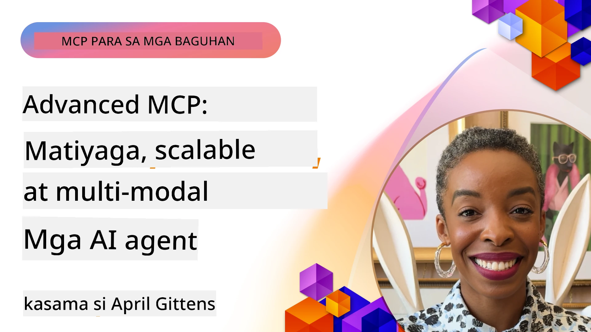

# Mga Advanced na Paksa sa MCP

_(I-click ang larawan sa itaas upang panoorin ang video ng leksyon na ito)_

Tinutukoy ng kabanatang ito ang serye ng mga advanced na paksa sa pagpapatupad ng Model Context Protocol (MCP), kabilang ang multi-modal integration, scalability, mga pinakamahuhusay na kasanayan sa seguridad, at enterprise integration. Mahalaga ang mga paksang ito para sa pagbuo ng matibay at handa para sa produksyon na mga aplikasyon ng MCP na makakatugon sa mga pangangailangan ng mga modernong sistema ng AI.

## Pangkalahatang Ideya

Tinutuklas ng leksyon na ito ang mga advanced na konsepto sa pagpapatupad ng Model Context Protocol, na nakatuon sa multi-modal integration, scalability, mga pinakamahuhusay na kasanayan sa seguridad, at enterprise integration. Mahalaga ang mga paksang ito para sa pagbuo ng mga production-grade na aplikasyon ng MCP na kayang hawakan ang mga kumplikadong pangangailangan sa mga kapaligiran ng enterprise.

## Mga Layunin sa Pagkatuto

Sa pagtatapos ng leksyon na ito, magagawa mo na:

- Ipatupad ang multi-modal na mga kakayahan sa loob ng mga MCP framework
- Magdisenyo ng scalable na mga arkitektura ng MCP para sa mga senaryong mataas ang pangangailangan
- Ilapat ang mga pinakamahusay na kasanayan sa seguridad na alinsunod sa mga prinsipyo ng seguridad ng MCP
- Isama ang MCP sa mga enterprise AI system at mga framework
- I-optimize ang pagganap at pagiging maaasahan sa mga production na kapaligiran

## Mga Leksiyon at Halimbawang Proyekto

| Link | Pamagat | Paglalarawan |
|------|-------|-------------|
| [5.1 Integration with Azure](./mcp-integration/README.md) | Isama sa Azure | Alamin kung paano isama ang iyong MCP Server sa Azure |
| [5.2 Multi modal sample](./mcp-multi-modality/README.md) | Mga Halimbawa ng MCP Multi modal | Mga halimbawa para sa audio, imahe, at multi modal na tugon |
| [5.3 MCP OAuth2 sample](../../../05-AdvancedTopics/mcp-oauth2-demo) | MCP OAuth2 Demo | Minimal na Spring Boot app na nagpapakita ng OAuth2 kasama ang MCP, bilang Authorization at Resource Server. Ipinapakita ang ligtas na pag-isyu ng token, protektadong mga endpoint, deployment sa Azure Container Apps, at integrasyon ng API Management. |
| [5.4 Root Contexts](./mcp-root-contexts/README.md) | Mga Root context | Alamin nang higit pa tungkol sa root context at kung paano ito ipinatutupad |
| [5.5 Routing](./mcp-routing/README.md) | Routing | Alamin ang iba't ibang uri ng routing |
| [5.6 Sampling](./mcp-sampling/README.md) | Sampling | Alamin kung paano gumana gamit ang sampling |
| [5.7 Scaling](./mcp-scaling/README.md) | Scaling | Alamin tungkol sa scaling |
| [5.8 Security](./mcp-security/README.md) | Seguridad | Siguraduhin ang iyong MCP Server |
| [5.9 Web Search sample](./web-search-mcp/README.md) | Web Search MCP | Python MCP server at client na nagsasama ng SerpAPI para sa real-time na web, balita, paghahanap ng produkto, at Q&A. Ipinapakita ang multi-tool orchestration, integrasyon ng external na API, at matatag na paghawak ng mga error. |
| [5.10 Realtime Streaming](./mcp-realtimestreaming/README.md) | Streaming | Ang real-time na pag-stream ng data ay naging mahalaga sa makabagong mundo na pinapatakbo ng data, kung saan kailangan ng mga negosyo at aplikasyon ang agarang pag-access sa impormasyon upang makagawa ng napapanahong mga desisyon. |
| [5.11 Realtime Web Search](./mcp-realtimesearch/README.md) | Web Search | Real-time na web search kung paano binabago ng MCP ang real-time na paghahanap sa web sa pamamagitan ng pagbibigay ng isang standardized na pamamaraan sa pamamahala ng konteksto sa pagitan ng mga AI modelo, mga search engine, at mga aplikasyon. | 
| [5.12  Entra ID Authentication for Model Context Protocol Servers](./mcp-security-entra/README.md) | Entra ID Authentication | Nagbibigay ang Microsoft Entra ID ng matibay na cloud-based na solusyon para sa pamamahala ng pagkakakilanlan at access, na tumutulong tiyakin na tanging mga awtorisadong user at aplikasyon lamang ang maaaring makipag-ugnayan sa iyong MCP server. |
| [5.13 Azure AI Foundry Agent Integration](./mcp-foundry-agent-integration/README.md) | Azure AI Foundry Integration | Alamin kung paano isama ang Model Context Protocol servers sa Azure AI Foundry agents, na nagbibigay-daan sa malakas na tool orchestration at kakayahan ng enterprise AI gamit ang standardized na koneksyon sa mga panlabas na pinagkukunan ng data. |
| [5.14 Context Engineering](./mcp-contextengineering/README.md) | Context Engineering | Ang panghinaharap na oportunidad ng mga teknik sa context engineering para sa mga MCP server, kabilang ang context optimization, dynamic context management, at mga estratehiya para sa epektibong prompt engineering sa loob ng mga MCP framework. |
| [5.15 MCP Custom Transport](./mcp-transport/README.md) | Custom Transport | Alamin kung paano ipatupad ang mga custom na mekanismo ng transport para sa mga espesyal na senaryo ng komunikasyon ng MCP. |
| [5.16 Protocol Features Deep Dive](./mcp-protocol-features/README.md) | Protocol Features | Masterin ang mga advanced na tampok ng protocol kabilang ang mga notipikasyon sa progreso, pagkansela ng kahilingan, mga template ng resource, at mga pattern sa paghawak ng error. |

> **Bago sa MCP Specification 2025-11-25**: Kasama na ngayon sa espesipikasyon ang eksperimentong suporta para sa **Tasks** (mga pangmatagalang operasyon na may pagsubaybay ng progreso), **Tool Annotations** (metadata tungkol sa pag-uugali ng tool para sa kaligtasan), **URL Mode Elicitation** (paghiling ng partikular na nilalaman ng URL mula sa mga kliyente), at pinahusay na **Roots** (para sa pamamahala ng konteksto ng workspace). Tingnan ang [MCP Specification changelog](https://spec.modelcontextprotocol.io/) para sa buong detalye.

## Karagdagang Sanggunian

Para sa pinakabagong impormasyon tungkol sa mga advanced na paksa ng MCP, sumangguni sa:
- [MCP Documentation](https://modelcontextprotocol.io/)
- [MCP Specification (2025-11-25)](https://spec.modelcontextprotocol.io/specification/2025-11-25/)
- [GitHub Repository](https://github.com/modelcontextprotocol)
- [OWASP MCP Top 10](https://microsoft.github.io/mcp-azure-security-guide/mcp/) - Mga panganib sa seguridad at mga mitigasyon
- [MCP Security Summit Workshop (Sherpa)](https://azure-samples.github.io/sherpa/) - Hands-on na pagsasanay sa seguridad

## Mga Pangunahing Punto

- Pinalalawak ng mga multi-modal na pagpapatupad ng MCP ang mga kakayahan ng AI lampas sa pagproseso ng teksto
- Mahalagang aspeto ang scalability para sa mga deployment sa enterprise at maaaring tugunan sa pamamagitan ng horizontal at vertical scaling
- Pinoprotektahan ng komprehensibong mga hakbang sa seguridad ang data at tinitiyak ang tamang kontrol sa access
- Pinapalakas ng enterprise integration sa mga plataporma gaya ng Azure OpenAI at Microsoft AI Foundry ang mga kakayahan ng MCP
- Nakikinabang ang mga advanced na pagpapatupad ng MCP mula sa mga na-optimize na arkitektura at maingat na pamamahala ng mga pinagkukunan

## Ehersisyo

Magdisenyo ng isang enterprise-grade na pagpapatupad ng MCP para sa isang partikular na kaso ng paggamit:

1. Tukuyin ang mga pangangailangan sa multi-modal para sa iyong kaso ng paggamit
2. Ilarawan ang mga kontrol sa seguridad na kailangan upang protektahan ang sensitibong data
3. Magdisenyo ng scalable na arkitektura na kayang humawak ng nagbabagong load
4. Planuhin ang mga punto ng integrasyon sa mga enterprise AI system
5. Dokumentuhin ang posibleng bottlenecks sa pagganap at mga estratehiya sa mitigasyon

## Karagdagang Mga Mapagkukunan

- [Azure OpenAI Documentation](https://learn.microsoft.com/en-us/azure/ai-services/openai/)
- [Microsoft AI Foundry Documentation](https://learn.microsoft.com/en-us/ai-services/)

---

## Ano ang susunod

Suriin ang mga leksyon sa module na ito simula sa: [5.1 MCP Integration](./mcp-integration/README.md)

Kapag natapos mo na ang module na ito, magpatuloy sa: [Module 6: Community Contributions](../06-CommunityContributions/README.md)

---

<!-- CO-OP TRANSLATOR DISCLAIMER START -->
**Patalastas**:
Ang dokumentong ito ay isinalin gamit ang AI na serbisyo sa pagsasalin na [Co-op Translator](https://github.com/Azure/co-op-translator). Bagamat nagsusumikap kami para sa katumpakan, pakatandaan na ang awtomatikong pagsasalin ay maaaring maglaman ng mga pagkakamali o di-tiyak na impormasyon. Ang orihinal na dokumento sa orihinal nitong wika ang dapat ituring na pangunahing sanggunian. Para sa mahahalagang impormasyon, inirerekomenda ang propesyonal na pagsasalin ng tao. Hindi kami mananagot sa anumang hindi pagkakaunawaan o maling interpretasyon na nagmula sa paggamit ng pagsasaling ito.
<!-- CO-OP TRANSLATOR DISCLAIMER END -->