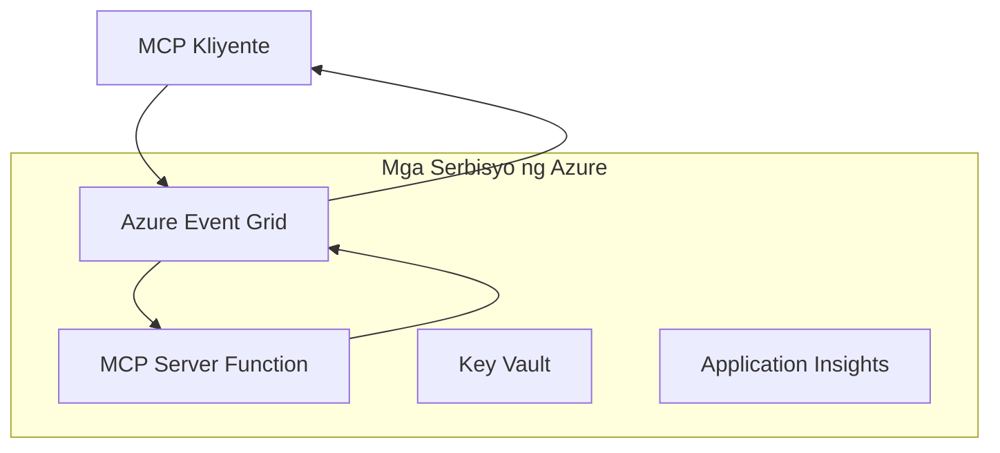
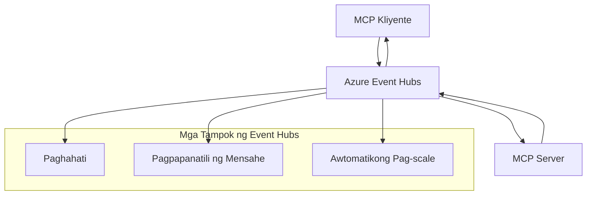

# MCP Custom Transports - Gabay sa Advanced na Implementasyon

Ang Model Context Protocol (MCP) ay nagbibigay ng kakayahang magamit ang iba't ibang mekanismo ng transport, na nagpapahintulot ng mga custom na implementasyon para sa mga espesyal na kapaligiran ng enterprise. Ang advanced na gabay na ito ay sumusuri sa mga custom na implementasyon ng transport gamit ang Azure Event Grid at Azure Event Hubs bilang mga praktikal na halimbawa para sa pagbuo ng scalable, cloud-native na mga solusyon ng MCP.

## Panimula

Habang ang mga standard na transport ng MCP (stdio at HTTP streaming) ay nagsisilbi sa karamihan ng mga kaso, madalas na nangangailangan ang mga kapaligiran ng enterprise ng mga espesyal na mekanismo ng transport para sa pinahusay na scalability, pagiging maaasahan, at integrasyon sa umiiral na cloud infrastructure. Pinapayagan ng mga custom na transport ang MCP na gamitin ang mga cloud-native na serbisyo ng messaging para sa asynchronous na komunikasyon, event-driven na mga arkitektura, at distributed na pagproseso.

Tinutuklas ng araling ito ang mga advanced na implementasyon ng transport batay sa pinakabagong espesipikasyon ng MCP (2025-11-25), mga serbisyo ng Azure messaging, at mga itinatag na pattern ng enterprise integration.

### **Arkitektura ng MCP Transport**

**Mula sa MCP Specification (2025-11-25):**

- **Standard na Transport**: stdio (inirerekomenda), HTTP streaming (para sa mga remote na senaryo)
- **Custom na Transport**: Anumang transport na nagpapatupad ng MCP message exchange protocol
- **Format ng Mensahe**: JSON-RPC 2.0 na may mga MCP-specific na extension
- **Bidirectional na Komunikasyon**: Kinakailangan ang full duplex na komunikasyon para sa mga notification at tugon

## Mga Layunin sa Pagkatuto

Sa pagtatapos ng advanced na araling ito, magagawa mong:

- **Maunawaan ang Mga Kinakailangan sa Custom Transport**: Ipatupad ang MCP protocol sa anumang transport layer habang pinananatili ang pagsunod
- **Bumuo ng Azure Event Grid Transport**: Lumikha ng event-driven na mga MCP server gamit ang Azure Event Grid para sa serverless na scalability
- **Ipatupad ang Azure Event Hubs Transport**: Disenyuhin ang high-throughput na mga solusyon ng MCP gamit ang Azure Event Hubs para sa real-time streaming
- **I-apply ang Mga Pattern ng Enterprise**: Isama ang mga custom na transport sa umiiral na Azure infrastructure at mga modelo ng seguridad
- **Pangasiwaan ang Pagiging Maaasahan ng Transport**: Ipatupad ang durability ng mensahe, pag-order, at paghawak ng error para sa mga senaryong enterprise
- **I-optimize ang Performance**: Disenyuhin ang mga solusyon ng transport para sa mga pangangailangan sa scale, latency, at throughput

## **Mga Kinakailangan sa Transport**

### **Pangunahing Kinakailangan mula sa MCP Specification (2025-11-25):**

```yaml
Message Protocol:
  format: "JSON-RPC 2.0 with MCP extensions"
  bidirectional: "Full duplex communication required"
  ordering: "Message ordering must be preserved per session"
  
Transport Layer:
  reliability: "Transport MUST handle connection failures gracefully"
  security: "Transport MUST support secure communication"
  identification: "Each session MUST have unique identifier"
  
Custom Transport:
  compliance: "MUST implement complete MCP message exchange"
  extensibility: "MAY add transport-specific features"
  interoperability: "MUST maintain protocol compatibility"
```

## **Implementasyon ng Azure Event Grid Transport**

Nagbibigay ang Azure Event Grid ng serverless na serbisyo sa pag-route ng mga event na angkop para sa event-driven na mga arkitektura ng MCP. Ipinapakita ng implementasyong ito kung paano bumuo ng scalable, loosely-coupled na mga sistema ng MCP.

### **Pangkalahatang Arkitektura**


### **Implementasyon sa C# - Event Grid Transport**

```csharp
using Azure.Messaging.EventGrid;
using Microsoft.Extensions.Azure;
using System.Text.Json;

public class EventGridMcpTransport : IMcpTransport
{
    private readonly EventGridPublisherClient _publisher;
    private readonly string _topicEndpoint;
    private readonly string _clientId;
    
    public EventGridMcpTransport(string topicEndpoint, string accessKey, string clientId)
    {
        _publisher = new EventGridPublisherClient(
            new Uri(topicEndpoint), 
            new AzureKeyCredential(accessKey));
        _topicEndpoint = topicEndpoint;
        _clientId = clientId;
    }
    
    public async Task SendMessageAsync(McpMessage message)
    {
        var eventGridEvent = new EventGridEvent(
            subject: $"mcp/{_clientId}",
            eventType: "MCP.MessageReceived",
            dataVersion: "1.0",
            data: JsonSerializer.Serialize(message))
        {
            Id = Guid.NewGuid().ToString(),
            EventTime = DateTimeOffset.UtcNow
        };
        
        await _publisher.SendEventAsync(eventGridEvent);
    }
    
    public async Task<McpMessage> ReceiveMessageAsync(CancellationToken cancellationToken)
    {
        // Event Grid is push-based, so implement webhook receiver
        // This would typically be handled by Azure Functions trigger
        throw new NotImplementedException("Use EventGridTrigger in Azure Functions");
    }
}

// Azure Function for receiving Event Grid events
[FunctionName("McpEventGridReceiver")]
public async Task<IActionResult> HandleEventGridMessage(
    [EventGridTrigger] EventGridEvent eventGridEvent,
    ILogger log)
{
    try
    {
        var mcpMessage = JsonSerializer.Deserialize<McpMessage>(
            eventGridEvent.Data.ToString());
        
        // Process MCP message
        var response = await _mcpServer.ProcessMessageAsync(mcpMessage);
        
        // Send response back via Event Grid
        await _transport.SendMessageAsync(response);
        
        return new OkResult();
    }
    catch (Exception ex)
    {
        log.LogError(ex, "Error processing Event Grid MCP message");
        return new BadRequestResult();
    }
}
```

### **Implementasyon sa TypeScript - Event Grid Transport**

```typescript
import { EventGridPublisherClient, AzureKeyCredential } from "@azure/eventgrid";
import { McpTransport, McpMessage } from "./mcp-types";

export class EventGridMcpTransport implements McpTransport {
    private publisher: EventGridPublisherClient;
    private clientId: string;
    
    constructor(
        private topicEndpoint: string,
        private accessKey: string,
        clientId: string
    ) {
        this.publisher = new EventGridPublisherClient(
            topicEndpoint,
            new AzureKeyCredential(accessKey)
        );
        this.clientId = clientId;
    }
    
    async sendMessage(message: McpMessage): Promise<void> {
        const event = {
            id: crypto.randomUUID(),
            source: `mcp-client-${this.clientId}`,
            type: "MCP.MessageReceived",
            time: new Date(),
            data: message
        };
        
        await this.publisher.sendEvents([event]);
    }
    
    // Pagtanggap na pinapagana ng kaganapan sa pamamagitan ng Azure Functions
    onMessage(handler: (message: McpMessage) => Promise<void>): void {
        // Ang implementasyon ay gagamit ng Azure Functions Event Grid trigger
        // Ito ay isang konseptwal na interface para sa tagatanggap ng webhook
    }
}

// Implementasyon ng Azure Functions
import { app, InvocationContext, EventGridEvent } from "@azure/functions";

app.eventGrid("mcpEventGridHandler", {
    handler: async (event: EventGridEvent, context: InvocationContext) => {
        try {
            const mcpMessage = event.data as McpMessage;
            
            // Proseso ng mensahe ng MCP
            const response = await mcpServer.processMessage(mcpMessage);
            
            // Magpadala ng tugon sa pamamagitan ng Event Grid
            await transport.sendMessage(response);
            
        } catch (error) {
            context.error("Error processing MCP message:", error);
            throw error;
        }
    }
});
```

### **Implementasyon sa Python - Event Grid Transport**

```python
from azure.eventgrid import EventGridPublisherClient, EventGridEvent
from azure.core.credentials import AzureKeyCredential
import asyncio
import json
from typing import Callable, Optional
import uuid
from datetime import datetime

class EventGridMcpTransport:
    def __init__(self, topic_endpoint: str, access_key: str, client_id: str):
        self.client = EventGridPublisherClient(
            topic_endpoint, 
            AzureKeyCredential(access_key)
        )
        self.client_id = client_id
        self.message_handler: Optional[Callable] = None
    
    async def send_message(self, message: dict) -> None:
        """Send MCP message via Event Grid"""
        event = EventGridEvent(
            data=message,
            subject=f"mcp/{self.client_id}",
            event_type="MCP.MessageReceived",
            data_version="1.0"
        )
        
        await self.client.send(event)
    
    def on_message(self, handler: Callable[[dict], None]) -> None:
        """Register message handler for incoming events"""
        self.message_handler = handler

# Implementasyon ng Azure Functions
import azure.functions as func
import logging

def main(event: func.EventGridEvent) -> None:
    """Azure Functions Event Grid trigger for MCP messages"""
    try:
        # I-parse ang MCP na mensahe mula sa Event Grid na pangyayari
        mcp_message = json.loads(event.get_body().decode('utf-8'))
        
        # Iproseso ang MCP na mensahe
        response = process_mcp_message(mcp_message)
        
        # Ipadala ang tugon pabalik sa pamamagitan ng Event Grid
        # (Ang implementasyon ay lilikha ng bagong Event Grid client)
        
    except Exception as e:
        logging.error(f"Error processing MCP Event Grid message: {e}")
        raise
```

## **Implementasyon ng Azure Event Hubs Transport**

Nagbibigay ang Azure Event Hubs ng high-throughput, real-time streaming na mga kakayahan para sa mga senaryong MCP na nangangailangan ng mababang latency at mataas na volume ng mensahe.

### **Pangkalahatang Arkitektura**


### **Implementasyon sa C# - Event Hubs Transport**

```csharp
using Azure.Messaging.EventHubs;
using Azure.Messaging.EventHubs.Producer;
using Azure.Messaging.EventHubs.Consumer;
using System.Text;

public class EventHubsMcpTransport : IMcpTransport, IDisposable
{
    private readonly EventHubProducerClient _producer;
    private readonly EventHubConsumerClient _consumer;
    private readonly string _consumerGroup;
    private readonly CancellationTokenSource _cancellationTokenSource;
    
    public EventHubsMcpTransport(
        string connectionString, 
        string eventHubName,
        string consumerGroup = "$Default")
    {
        _producer = new EventHubProducerClient(connectionString, eventHubName);
        _consumer = new EventHubConsumerClient(
            consumerGroup, 
            connectionString, 
            eventHubName);
        _consumerGroup = consumerGroup;
        _cancellationTokenSource = new CancellationTokenSource();
    }
    
    public async Task SendMessageAsync(McpMessage message)
    {
        var messageBody = JsonSerializer.Serialize(message);
        var eventData = new EventData(Encoding.UTF8.GetBytes(messageBody));
        
        // Add MCP-specific properties
        eventData.Properties.Add("MessageType", message.Method ?? "response");
        eventData.Properties.Add("MessageId", message.Id);
        eventData.Properties.Add("Timestamp", DateTimeOffset.UtcNow);
        
        await _producer.SendAsync(new[] { eventData });
    }
    
    public async Task StartReceivingAsync(
        Func<McpMessage, Task> messageHandler)
    {
        await foreach (PartitionEvent partitionEvent in _consumer.ReadEventsAsync(
            _cancellationTokenSource.Token))
        {
            try
            {
                var messageBody = Encoding.UTF8.GetString(
                    partitionEvent.Data.EventBody.ToArray());
                var mcpMessage = JsonSerializer.Deserialize<McpMessage>(messageBody);
                
                await messageHandler(mcpMessage);
            }
            catch (Exception ex)
            {
                // Handle deserialization or processing errors
                Console.WriteLine($"Error processing message: {ex.Message}");
            }
        }
    }
    
    public void Dispose()
    {
        _cancellationTokenSource?.Cancel();
        _producer?.DisposeAsync().AsTask().Wait();
        _consumer?.DisposeAsync().AsTask().Wait();
        _cancellationTokenSource?.Dispose();
    }
}
```

### **Implementasyon sa TypeScript - Event Hubs Transport**

```typescript
import { 
    EventHubProducerClient, 
    EventHubConsumerClient, 
    EventData 
} from "@azure/event-hubs";

export class EventHubsMcpTransport implements McpTransport {
    private producer: EventHubProducerClient;
    private consumer: EventHubConsumerClient;
    private isReceiving = false;
    
    constructor(
        private connectionString: string,
        private eventHubName: string,
        private consumerGroup: string = "$Default"
    ) {
        this.producer = new EventHubProducerClient(
            connectionString, 
            eventHubName
        );
        this.consumer = new EventHubConsumerClient(
            consumerGroup,
            connectionString,
            eventHubName
        );
    }
    
    async sendMessage(message: McpMessage): Promise<void> {
        const eventData: EventData = {
            body: JSON.stringify(message),
            properties: {
                messageType: message.method || "response",
                messageId: message.id,
                timestamp: new Date().toISOString()
            }
        };
        
        await this.producer.sendBatch([eventData]);
    }
    
    async startReceiving(
        messageHandler: (message: McpMessage) => Promise<void>
    ): Promise<void> {
        if (this.isReceiving) return;
        
        this.isReceiving = true;
        
        const subscription = this.consumer.subscribe({
            processEvents: async (events, context) => {
                for (const event of events) {
                    try {
                        const messageBody = event.body as string;
                        const mcpMessage: McpMessage = JSON.parse(messageBody);
                        
                        await messageHandler(mcpMessage);
                        
                        // I-update ang checkpoint para sa hindi bababa sa isang beses na paghahatid
                        await context.updateCheckpoint(event);
                    } catch (error) {
                        console.error("Error processing Event Hubs message:", error);
                    }
                }
            },
            processError: async (err, context) => {
                console.error("Event Hubs error:", err);
            }
        });
    }
    
    async close(): Promise<void> {
        this.isReceiving = false;
        await this.producer.close();
        await this.consumer.close();
    }
}
```

### **Implementasyon sa Python - Event Hubs Transport**

```python
from azure.eventhub import EventHubProducerClient, EventHubConsumerClient
from azure.eventhub import EventData
import json
import asyncio
from typing import Callable, Dict, Any
import logging

class EventHubsMcpTransport:
    def __init__(
        self, 
        connection_string: str, 
        eventhub_name: str,
        consumer_group: str = "$Default"
    ):
        self.producer = EventHubProducerClient.from_connection_string(
            connection_string, 
            eventhub_name=eventhub_name
        )
        self.consumer = EventHubConsumerClient.from_connection_string(
            connection_string,
            consumer_group=consumer_group,
            eventhub_name=eventhub_name
        )
        self.is_receiving = False
    
    async def send_message(self, message: Dict[str, Any]) -> None:
        """Send MCP message via Event Hubs"""
        event_data = EventData(json.dumps(message))
        
        # Magdagdag ng mga katangiang partikular sa MCP
        event_data.properties = {
            "messageType": message.get("method", "response"),
            "messageId": message.get("id"),
            "timestamp": "2025-01-14T10:30:00Z"  # Gamitin ang aktwal na timestamp
        }
        
        async with self.producer:
            event_data_batch = await self.producer.create_batch()
            event_data_batch.add(event_data)
            await self.producer.send_batch(event_data_batch)
    
    async def start_receiving(
        self, 
        message_handler: Callable[[Dict[str, Any]], None]
    ) -> None:
        """Start receiving MCP messages from Event Hubs"""
        if self.is_receiving:
            return
        
        self.is_receiving = True
        
        async with self.consumer:
            await self.consumer.receive(
                on_event=self._on_event_received(message_handler),
                starting_position="-1"  # Magsimula mula sa simula
            )
    
    def _on_event_received(self, handler: Callable):
        """Internal event handler wrapper"""
        async def handle_event(partition_context, event):
            try:
                # I-parse ang mensahe ng MCP mula sa event ng Event Hubs
                message_body = event.body_as_str(encoding='UTF-8')
                mcp_message = json.loads(message_body)
                
                # Iproseso ang mensahe ng MCP
                await handler(mcp_message)
                
                # I-update ang checkpoint para sa at-least-once na paghahatid
                await partition_context.update_checkpoint(event)
                
            except Exception as e:
                logging.error(f"Error processing Event Hubs message: {e}")
        
        return handle_event
    
    async def close(self) -> None:
        """Clean up transport resources"""
        self.is_receiving = False
        await self.producer.close()
        await self.consumer.close()
```

## **Mga Advanced na Pattern ng Transport**

### **Durability at Pagiging Maaasahan ng Mensahe**

```csharp
// Implementing message durability with retry logic
public class ReliableTransportWrapper : IMcpTransport
{
    private readonly IMcpTransport _innerTransport;
    private readonly RetryPolicy _retryPolicy;
    
    public async Task SendMessageAsync(McpMessage message)
    {
        await _retryPolicy.ExecuteAsync(async () =>
        {
            try
            {
                await _innerTransport.SendMessageAsync(message);
            }
            catch (TransportException ex) when (ex.IsRetryable)
            {
                // Log and retry
                throw;
            }
        });
    }
}
```

### **Integrasyon ng Seguridad sa Transport**

```csharp
// Integrating Azure Key Vault for transport security
public class SecureTransportFactory
{
    private readonly SecretClient _keyVaultClient;
    
    public async Task<IMcpTransport> CreateEventGridTransportAsync()
    {
        var accessKey = await _keyVaultClient.GetSecretAsync("EventGridAccessKey");
        var topicEndpoint = await _keyVaultClient.GetSecretAsync("EventGridTopic");
        
        return new EventGridMcpTransport(
            topicEndpoint.Value.Value,
            accessKey.Value.Value,
            Environment.MachineName
        );
    }
}
```

### **Pagmamanman at Observability ng Transport**

```csharp
// Adding telemetry to custom transports
public class ObservableTransport : IMcpTransport
{
    private readonly IMcpTransport _transport;
    private readonly ILogger _logger;
    private readonly TelemetryClient _telemetryClient;
    
    public async Task SendMessageAsync(McpMessage message)
    {
        using var activity = Activity.StartActivity("MCP.Transport.Send");
        activity?.SetTag("transport.type", "EventGrid");
        activity?.SetTag("message.method", message.Method);
        
        var stopwatch = Stopwatch.StartNew();
        
        try
        {
            await _transport.SendMessageAsync(message);
            
            _telemetryClient.TrackDependency(
                "EventGrid",
                "SendMessage",
                DateTime.UtcNow.Subtract(stopwatch.Elapsed),
                stopwatch.Elapsed,
                true
            );
        }
        catch (Exception ex)
        {
            _telemetryClient.TrackException(ex);
            throw;
        }
    }
}
```

## **Mga Senaryo ng Enterprise Integration**

### **Senaryo 1: Distributed MCP Processing**

Paggamit ng Azure Event Grid para sa pamamahagi ng mga kahilingan ng MCP sa maraming processing node:

```yaml
Architecture:
  - MCP Client sends requests to Event Grid topic
  - Multiple Azure Functions subscribe to process different tool types
  - Results aggregated and returned via separate response topic
  
Benefits:
  - Horizontal scaling based on message volume
  - Fault tolerance through redundant processors
  - Cost optimization with serverless compute
```

### **Senaryo 2: Real-time MCP Streaming**

Paggamit ng Azure Event Hubs para sa mataas na dalas ng mga interaksyon ng MCP:

```yaml
Architecture:
  - MCP Client streams continuous requests via Event Hubs
  - Stream Analytics processes and routes messages
  - Multiple consumers handle different aspect of processing
  
Benefits:
  - Low latency for real-time scenarios
  - High throughput for batch processing
  - Built-in partitioning for parallel processing
```

### **Senaryo 3: Hybrid na Arkitektura ng Transport**

Pagsasama ng maraming transport para sa iba't ibang gamit:

```csharp
public class HybridMcpTransport : IMcpTransport
{
    private readonly IMcpTransport _realtimeTransport; // Event Hubs
    private readonly IMcpTransport _batchTransport;    // Event Grid
    private readonly IMcpTransport _fallbackTransport; // HTTP Streaming
    
    public async Task SendMessageAsync(McpMessage message)
    {
        // Route based on message characteristics
        var transport = message.Method switch
        {
            "tools/call" when IsRealtime(message) => _realtimeTransport,
            "resources/read" when IsBatch(message) => _batchTransport,
            _ => _fallbackTransport
        };
        
        await transport.SendMessageAsync(message);
    }
}
```

## **Pag-optimize ng Performance**

### **Batching ng Mensahe para sa Event Grid**

```csharp
public class BatchingEventGridTransport : IMcpTransport
{
    private readonly List<McpMessage> _messageBuffer = new();
    private readonly Timer _flushTimer;
    private const int MaxBatchSize = 100;
    
    public async Task SendMessageAsync(McpMessage message)
    {
        lock (_messageBuffer)
        {
            _messageBuffer.Add(message);
            
            if (_messageBuffer.Count >= MaxBatchSize)
            {
                _ = Task.Run(FlushMessages);
            }
        }
    }
    
    private async Task FlushMessages()
    {
        List<McpMessage> toSend;
        lock (_messageBuffer)
        {
            toSend = new List<McpMessage>(_messageBuffer);
            _messageBuffer.Clear();
        }
        
        if (toSend.Any())
        {
            var events = toSend.Select(CreateEventGridEvent);
            await _publisher.SendEventsAsync(events);
        }
    }
}
```

### **Estratehiya sa Partitioning para sa Event Hubs**

```csharp
public class PartitionedEventHubsTransport : IMcpTransport
{
    public async Task SendMessageAsync(McpMessage message)
    {
        // Partition by client ID for session affinity
        var partitionKey = ExtractClientId(message);
        
        var eventData = new EventData(JsonSerializer.SerializeToUtf8Bytes(message))
        {
            PartitionKey = partitionKey
        };
        
        await _producer.SendAsync(new[] { eventData });
    }
}
```

## **Pagsusuri ng Custom na Transport**

### **Unit Testing gamit ang Test Doubles**

```csharp
[Test]
public async Task EventGridTransport_SendMessage_PublishesCorrectEvent()
{
    // Arrange
    var mockPublisher = new Mock<EventGridPublisherClient>();
    var transport = new EventGridMcpTransport(mockPublisher.Object);
    var message = new McpMessage { Method = "tools/list", Id = "test-123" };
    
    // Act
    await transport.SendMessageAsync(message);
    
    // Assert
    mockPublisher.Verify(
        x => x.SendEventAsync(
            It.Is<EventGridEvent>(e => 
                e.EventType == "MCP.MessageReceived" &&
                e.Subject == "mcp/test-client"
            )
        ),
        Times.Once
    );
}
```

### **Integration Testing gamit ang Azure Test Containers**

```csharp
[Test]
public async Task EventHubsTransport_IntegrationTest()
{
    // Using Testcontainers for integration testing
    var eventHubsContainer = new EventHubsContainer()
        .WithEventHub("test-hub");
    
    await eventHubsContainer.StartAsync();
    
    var transport = new EventHubsMcpTransport(
        eventHubsContainer.GetConnectionString(),
        "test-hub"
    );
    
    // Test message round-trip
    var sentMessage = new McpMessage { Method = "test", Id = "123" };
    McpMessage receivedMessage = null;
    
    await transport.StartReceivingAsync(msg => {
        receivedMessage = msg;
        return Task.CompletedTask;
    });
    
    await transport.SendMessageAsync(sentMessage);
    await Task.Delay(1000); // Allow for message processing
    
    Assert.That(receivedMessage?.Id, Is.EqualTo("123"));
}
```

## **Pinakamahusay na Mga Praktis at Gabay**

### **Mga Prinsipyo sa Disenyo ng Transport**

1. **Idempotency**: Tiyaking idempotent ang pagproseso ng mensahe upang hawakan ang mga duplicate
2. **Paghawak ng Error**: Ipatupad ang komprehensibong paghawak ng error at dead letter queues
3. **Pagmamanman**: Magdagdag ng detalyadong telemetry at health checks
4. **Seguridad**: Gumamit ng managed identities at least privilege access
5. **Performance**: Disenyuhin ayon sa iyong partikular na mga pangangailangan sa latency at throughput

### **Mga Rekomendasyon na Espesipiko sa Azure**

1. **Gumamit ng Managed Identity**: Iwasan ang connection strings sa produksyon
2. **Ipatupad ang Circuit Breakers**: Protektahan laban sa mga outage ng Azure service
3. **Subaybayan ang Mga Gastos**: Bantayan ang volume ng mensahe at mga gastos sa pagproseso
4. **Magplano para sa Scale**: Disenyuhin nang maaga ang mga estratehiya sa partitioning at scaling
5. **Magsagawa ng Masusing Pagsusuri**: Gamitin ang Azure DevTest Labs para sa komprehensibong pagsusuri

## **Konklusyon**

Pinapayagan ng mga custom na MCP transport ang makapangyarihang mga senaryo ng enterprise gamit ang mga serbisyo ng messaging ng Azure. Sa pamamagitan ng pagpapatupad ng Event Grid o Event Hubs na mga transport, makakabuo ka ng scalable, maaasahang mga solusyon ng MCP na seamless na nakikipag-integrate sa umiiral na Azure infrastructure.

Ipinapakita ng mga halimbawa ang mga pattern na handa na para sa produksyon sa pagpapatupad ng mga custom na transport habang pinananatili ang pagsunod sa MCP protocol at mga pinakamahusay na praktis ng Azure.

## **Karagdagang Mga Mapagkukunan**

- [MCP Specification 2025-06-18](https://spec.modelcontextprotocol.io/specification/2025-06-18/)
- [Azure Event Grid Documentation](https://docs.microsoft.com/azure/event-grid/)
- [Azure Event Hubs Documentation](https://docs.microsoft.com/azure/event-hubs/)
- [Azure Functions Event Grid Trigger](https://docs.microsoft.com/azure/azure-functions/functions-bindings-event-grid)
- [Azure SDK for .NET](https://github.com/Azure/azure-sdk-for-net)
- [Azure SDK for TypeScript](https://github.com/Azure/azure-sdk-for-js)
- [Azure SDK for Python](https://github.com/Azure/azure-sdk-for-python)

---

> *Nakatuon ang gabay na ito sa mga praktikal na pattern ng implementasyon para sa mga production MCP system. Laging i-validate ang mga implementasyon ng transport laban sa iyong partikular na mga kinakailangan at mga limitasyon ng Azure service.*
> **Kasalukuyang Standard**: Ipinapakita ng gabay na ito ang [MCP Specification 2025-06-18](https://spec.modelcontextprotocol.io/specification/2025-06-18/) na mga kinakailangan sa transport at mga advanced na pattern ng transport para sa mga kapaligiran ng enterprise.


## Ano ang Susunod
- [6. Community Contributions](../../06-CommunityContributions/README.md)

---

<!-- CO-OP TRANSLATOR DISCLAIMER START -->
**Paalala**:
Ang dokumentong ito ay isinalin gamit ang AI translation service na [Co-op Translator](https://github.com/Azure/co-op-translator). Bagamat nagsusumikap kami para sa katumpakan, pakatandaan na ang mga awtomatikong pagsasalin ay maaaring maglaman ng mga pagkakamali o di-tumpak na impormasyon. Ang orihinal na dokumento sa orihinal nitong wika ang dapat ituring na pangunahing sanggunian. Para sa mahahalagang impormasyon, inirerekomenda ang propesyonal na pagsasalin ng tao. Hindi kami mananagot sa anumang hindi pagkakaunawaan o maling interpretasyon na maaaring magmula sa paggamit ng pagsasaling ito.
<!-- CO-OP TRANSLATOR DISCLAIMER END -->