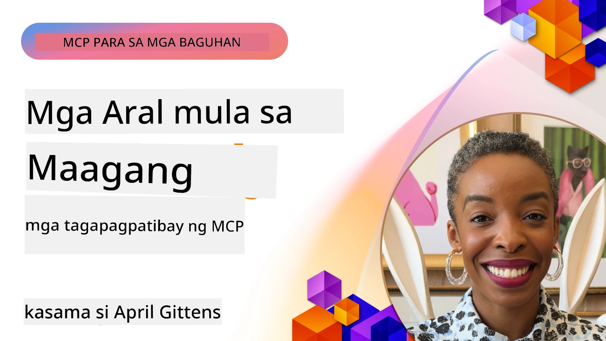

# 🌟 Mga Aral mula sa Maagang Mga Gumagamit

[](https://youtu.be/jds7dSmNptE)

_(I-click ang larawan sa itaas upang mapanood ang video ng araling ito)_

## 🎯 Ano ang Saklaw ng Modyul na Ito

Tinutuklas ng modyul na ito kung paano ginagamit ng mga totoong organisasyon at mga developer ang Model Context Protocol (MCP) upang lutasin ang mga tunay na hamon at itulak ang inobasyon. Sa pamamagitan ng detalyadong mga pag-aaral ng kaso, praktikal na mga proyekto, at mga halimbawa, matutuklasan mo kung paano pinapagana ng MCP ang ligtas, scalable na pagsama ng AI na nag-uugnay sa mga language model, mga tool, at data ng enterprise.

### 📚 Tingnan ang MCP sa Aksyon

Nais mo bang makita ang mga prinsipyong ito na ginagamit sa mga produktibong handang mga tool? Tingnan ang aming [**10 Microsoft MCP Servers That Are Transforming Developer Productivity**](microsoft-mcp-servers.md), na nagpapakita ng mga totoong Microsoft MCP server na maaari mong gamitin ngayon.

## Pangkalahatang-ideya

Tinutuklas ng araling ito kung paano nagamit ng mga maagang gumagamit ang Model Context Protocol (MCP) upang lutasin ang mga totoong hamon sa mundo at isulong ang inobasyon sa iba't ibang industriya. Sa pamamagitan ng detalyadong mga pag-aaral ng kaso at mga praktikal na proyekto, makikita mo kung paano pinapagana ng MCP ang standardisado, ligtas, at scalable na pagsasama ng AI—na nag-uugnay sa malalaking language model, mga tool, at data ng enterprise sa isang pinag-isang balangkas. Makakakuha ka ng praktikal na karanasan sa pagdidisenyo at pagbuo ng mga solusyong batay sa MCP, matututo mula sa mga napatunayang pattern ng implementasyon, at matutuklasan ang pinakamahusay na mga kasanayan para sa pag-deploy ng MCP sa mga produktibong kapaligiran. Ipinapakita rin ng aralin ang mga umuusbong na uso, mga direksyon sa hinaharap, at mga open-source na mapagkukunan upang matulungan kang manatiling nangunguna sa teknolohiyang MCP at ang umuusbong nitong ecosystem.

## Mga Layunin sa Pagkatuto

- Suriin ang mga totoong implementasyon ng MCP sa iba't ibang industriya  
- Magdisenyo at bumuo ng kumpletong aplikasyon batay sa MCP  
- Tuklasin ang mga umuusbong na uso at mga direksyon sa hinaharap sa teknolohiyang MCP  
- Ilapat ang pinakamahusay na mga kasanayan sa aktwal na mga senaryo sa pag-develop  

## Mga Totoong Implementasyon ng MCP

### Pag-aaral ng Kaso 1: Enterprise Customer Support Automation

Isang multinasyunal na korporasyon ang nagpatupad ng MCP-based na solusyon upang i-standardize ang mga pag-uusap ng AI sa kanilang mga sistema ng customer support. Pinayagan sila nitong:

- Lumikha ng pinag-isang interface para sa maraming LLM provider  
- Panatilihin ang konsistent na pamamahala ng prompt sa iba't ibang departamento  
- Ipatupad ang matibay na seguridad at mga kontrol ng pagsunod  
- Madaling magpalit-palit sa pagitan ng iba't ibang AI model batay sa partikular na pangangailangan  

**Teknikal na Implementasyon:**

```python
# Pagpapatupad ng Python MCP server para sa suporta sa customer
import logging
import asyncio
from modelcontextprotocol import create_server, ServerConfig
from modelcontextprotocol.server import MCPServer
from modelcontextprotocol.transports import create_http_transport
from modelcontextprotocol.resources import ResourceDefinition
from modelcontextprotocol.prompts import PromptDefinition
from modelcontextprotocol.tool import ToolDefinition

# I-configure ang pag-log
logging.basicConfig(level=logging.INFO)

async def main():
    # Gumawa ng konfigurasyon ng server
    config = ServerConfig(
        name="Enterprise Customer Support Server",
        version="1.0.0",
        description="MCP server for handling customer support inquiries"
    )
    
    # I-inisyalisa ang MCP server
    server = create_server(config)
    
    # Irehistro ang mga resource ng knowledge base
    server.resources.register(
        ResourceDefinition(
            name="customer_kb",
            description="Customer knowledge base documentation"
        ),
        lambda params: get_customer_documentation(params)
    )
    
    # Irehistro ang mga prompt template
    server.prompts.register(
        PromptDefinition(
            name="support_template",
            description="Templates for customer support responses"
        ),
        lambda params: get_support_templates(params)
    )
    
    # Irehistro ang mga suporta na kagamitan
    server.tools.register(
        ToolDefinition(
            name="ticketing",
            description="Create and update support tickets"
        ),
        handle_ticketing_operations
    )
    
    # Simulan ang server gamit ang HTTP transport
    transport = create_http_transport(port=8080)
    await server.run(transport)

if __name__ == "__main__":
    asyncio.run(main())
```
  
**Resulta:** 30% pagbawas sa gastos ng model, 45% pagbuti sa konsistensi ng tugon, at pinahusay na pagsunod sa mga global na operasyon.

### Pag-aaral ng Kaso 2: Healthcare Diagnostic Assistant

Isang healthcare provider ang bumuo ng MCP infrastructure upang pagsamahin ang maraming espesyalistang medikal na AI model habang tinitiyak na protektado ang sensitibong data ng pasyente:

- Tuluy-tuloy na pagpapalit-palit sa pagitan ng generalist at specialist na medikal na mga modelo  
- Mahigpit na kontrol sa privacy at audit trails  
- Pagsasama sa mga kasalukuyang Electronic Health Record (EHR) system  
- Konsistenteng pamamahala ng prompt para sa medikal na terminolohiya  

**Teknikal na Implementasyon:**

```csharp
// C# MCP host application implementation in healthcare application
using Microsoft.Extensions.DependencyInjection;
using ModelContextProtocol.SDK.Client;
using ModelContextProtocol.SDK.Security;
using ModelContextProtocol.SDK.Resources;

public class DiagnosticAssistant
{
    private readonly MCPHostClient _mcpClient;
    private readonly PatientContext _patientContext;
    
    public DiagnosticAssistant(PatientContext patientContext)
    {
        _patientContext = patientContext;
        
        // Configure MCP client with healthcare-specific settings
        var clientOptions = new ClientOptions
        {
            Name = "Healthcare Diagnostic Assistant",
            Version = "1.0.0",
            Security = new SecurityOptions
            {
                Encryption = EncryptionLevel.Medical,
                AuditEnabled = true
            }
        };
        
        _mcpClient = new MCPHostClientBuilder()
            .WithOptions(clientOptions)
            .WithTransport(new HttpTransport("https://healthcare-mcp.example.org"))
            .WithAuthentication(new HIPAACompliantAuthProvider())
            .Build();
    }
    
    public async Task<DiagnosticSuggestion> GetDiagnosticAssistance(
        string symptoms, string patientHistory)
    {
        // Create request with appropriate resources and tool access
        var resourceRequest = new ResourceRequest
        {
            Name = "patient_records",
            Parameters = new Dictionary<string, object>
            {
                ["patientId"] = _patientContext.PatientId,
                ["requestingProvider"] = _patientContext.ProviderId
            }
        };
        
        // Request diagnostic assistance using appropriate prompt
        var response = await _mcpClient.SendPromptRequestAsync(
            promptName: "diagnostic_assistance",
            parameters: new Dictionary<string, object>
            {
                ["symptoms"] = symptoms,
                patientHistory = patientHistory,
                relevantGuidelines = _patientContext.GetRelevantGuidelines()
            });
            
        return DiagnosticSuggestion.FromMCPResponse(response);
    }
}
```
  
**Resulta:** Pinahusay na mga mungkahing diagnostic para sa mga doktor habang pinananatili ang buong pagsunod sa HIPAA at malaking pagbawas sa context-switching sa pagitan ng mga sistema.

### Pag-aaral ng Kaso 3: Financial Services Risk Analysis

Isang institusyong pinansyal ang nagpatupad ng MCP upang i-standardize ang kanilang mga proseso ng risk analysis sa iba't ibang departamento:

- Lumikha ng pinag-isang interface para sa credit risk, fraud detection, at mga investment risk na modelo  
- Nagpatupad ng mahigpit na kontrol sa access at model versioning  
- Tiniyak ang auditability ng lahat ng rekomendasyon ng AI  
- Pinanatili ang konsistenteng data formatting sa magkakaibang sistema  

**Teknikal na Implementasyon:**

```java
// Java MCP server para sa pagtatasa ng panganib sa pananalapi
import org.mcp.server.*;
import org.mcp.security.*;

public class FinancialRiskMCPServer {
    public static void main(String[] args) {
        // Gumawa ng MCP server na may mga tampok sa pagsunod sa pananalapi
        MCPServer server = new MCPServerBuilder()
            .withModelProviders(
                new ModelProvider("risk-assessment-primary", new AzureOpenAIProvider()),
                new ModelProvider("risk-assessment-audit", new LocalLlamaProvider())
            )
            .withPromptTemplateDirectory("./compliance/templates")
            .withAccessControls(new SOCCompliantAccessControl())
            .withDataEncryption(EncryptionStandard.FINANCIAL_GRADE)
            .withVersionControl(true)
            .withAuditLogging(new DatabaseAuditLogger())
            .build();
            
        server.addRequestValidator(new FinancialDataValidator());
        server.addResponseFilter(new PII_RedactionFilter());
        
        server.start(9000);
        
        System.out.println("Financial Risk MCP Server running on port 9000");
    }
}
```
  
**Resulta:** Pinahusay na regulatory compliance, 40% mas mabilis na cycle ng pag-deploy ng model, at pinabuting konsistensi ng risk assessment sa mga departamento.

### Pag-aaral ng Kaso 4: Microsoft Playwright MCP Server para sa Browser Automation

Bumuo ang Microsoft ng [Playwright MCP server](https://github.com/microsoft/playwright-mcp) upang paganahin ang ligtas, standardisadong browser automation sa pamamagitan ng Model Context Protocol. Pinapahintulutan ng produktibong handang server na ito ang mga AI agent at LLM na makipag-ugnayan sa mga web browser sa isang kontrolado, auditable, at extensible na paraan—na nagbibigay-daan sa mga use case tulad ng automated web testing, data extraction, at end-to-end workflows.

> **🎯 Production Ready Tool**  
> 
> Ipinapakita ng pag-aaral ng kasong ito ang isang totoong MCP server na maaari mong gamitin ngayon! Alamin pa ang tungkol sa Playwright MCP Server at iba pang 9 na production-ready Microsoft MCP server sa aming [**Microsoft MCP Servers Guide**](microsoft-mcp-servers.md#8--playwright-mcp-server).

**Pangunahing Mga Tampok:**  
- Inilalantad ang mga kakayahan sa browser automation (navigasyon, pag-fill ng form, pagkuha ng screenshot, atbp.) bilang mga MCP tool  
- Nagpapatupad ng mahigpit na kontrol sa access at sandboxing upang pigilan ang hindi awtorisadong aksyon  
- Nagbibigay ng detalyadong audit log para sa lahat ng pakikipag-ugnayan sa browser  
- Sumusuporta sa pagsasama sa Azure OpenAI at iba pang LLM provider para sa agent-driven automation  
- Pinapagana ang GitHub Copilot Coding Agent na may kakayahang mag-browse sa web  

**Teknikal na Implementasyon:**

```typescript
// TypeScript: Nagpaparehistro ng Playwright browser automation tools sa isang MCP server
import { createServer, ToolDefinition } from 'modelcontextprotocol';
import { launch } from 'playwright';

const server = createServer({
  name: 'Playwright MCP Server',
  version: '1.0.0',
  description: 'MCP server for browser automation using Playwright'
});

// Magrehistro ng tool para mag-navigate sa isang URL at kumuha ng screenshot
server.tools.register(
  new ToolDefinition({
    name: 'navigate_and_screenshot',
    description: 'Navigate to a URL and capture a screenshot',
    parameters: {
      url: { type: 'string', description: 'The URL to visit' }
    }
  }),
  async ({ url }) => {
    const browser = await launch();
    const page = await browser.newPage();
    await page.goto(url);
    const screenshot = await page.screenshot();
    await browser.close();
    return { screenshot };
  }
);

// Simulan ang MCP server
server.listen(8080);
```
  
**Mga Resulta:**

- Pinagana ang ligtas, programmatic browser automation para sa AI agent at LLM  
- Nabawasan ang manual na pagsubok at napabuti ang coverage ng pagsusuri para sa mga web application  
- Nagbigay ng reusable, extensible framework para sa pagsasama ng mga browser-based tool sa mga enterprise environment  
- Pinapagana ang mga kakayahan ng web browsing ng GitHub Copilot

**Mga Sanggunian:**  

- [Playwright MCP Server GitHub Repository](https://github.com/microsoft/playwright-mcp)  
- [Microsoft AI and Automation Solutions](https://azure.microsoft.com/en-us/products/ai-services/)

### Pag-aaral ng Kaso 5: Azure MCP – Enterprise-Grade Model Context Protocol bilang Serbisyo

Ang Azure MCP Server ([https://aka.ms/azmcp](https://aka.ms/azmcp)) ay enterprise-grade na managed implementasyon ng Model Context Protocol ng Microsoft, na idinisenyo upang magbigay ng scalable, secure, at compliant na kakayahan ng MCP server bilang isang cloud service. Pinapagana ng Azure MCP ang mga organisasyon upang mabilis na mag-deploy, mag-manage, at magsama ng MCP server sa Azure AI, data, at security services, na nagpapababa ng operational overhead at nagpapabilis ng AI adoption.

> **🎯 Production Ready Tool**  
> 
> Ito ay isang totoong MCP server na maaari mong gamitin ngayon! Alamin ang higit pa tungkol sa Azure AI Foundry MCP Server sa aming [**Microsoft MCP Servers Guide**](microsoft-mcp-servers.md).

- Ganap na managed MCP server hosting na may built-in scaling, monitoring, at seguridad  
- Native na pagsasama sa Azure OpenAI, Azure AI Search, at iba pang Azure services  
- Enterprise authentication at authorization sa pamamagitan ng Microsoft Entra ID  
- Suporta sa custom tools, prompt templates, at resource connectors  
- Pagsunod sa mga pangangailangan sa seguridad at regulasyon ng enterprise  

**Teknikal na Implementasyon:**

```yaml
# Example: Azure MCP server deployment configuration (YAML)
apiVersion: mcp.microsoft.com/v1
kind: McpServer
metadata:
  name: enterprise-mcp-server
spec:
  modelProviders:
    - name: azure-openai
      type: AzureOpenAI
      endpoint: https://<your-openai-resource>.openai.azure.com/
      apiKeySecret: <your-azure-keyvault-secret>
  tools:
    - name: document_search
      type: AzureAISearch
      endpoint: https://<your-search-resource>.search.windows.net/
      apiKeySecret: <your-azure-keyvault-secret>
  authentication:
    type: EntraID
    tenantId: <your-tenant-id>
  monitoring:
    enabled: true
    logAnalyticsWorkspace: <your-log-analytics-id>
```
  
**Resulta:**  
- Nabawasan ang time-to-value para sa mga enterprise AI project sa pamamagitan ng paghahatid ng ready-to-use, compliant MCP server platform  
- Pinadali ang pagsasama ng LLM, mga tool, at mga pinagmumulan ng data ng enterprise  
- Pinahusay ang seguridad, observability, at operational efficiency para sa mga MCP workload  
- Pinahusay na kalidad ng code gamit ang Azure SDK best practices at kasalukuyang mga pattern ng authentication  

**Mga Sanggunian:**  
- [Azure MCP Documentation](https://aka.ms/azmcp)  
- [Azure MCP Server GitHub Repository](https://github.com/Azure/azure-mcp)  
- [Azure AI Services](https://azure.microsoft.com/en-us/products/ai-services/)  
- [Microsoft MCP Center](https://mcp.azure.com)

## Pag-aaral ng Kaso 6: NLWeb  
Ang MCP (Model Context Protocol) ay isang umuusbong na protocol para sa mga Chatbot at AI assistant upang makipag-ugnayan sa mga tool. Bawat instance ng NLWeb ay MCP server din, na sumusuporta sa isang core na pamamaraan, ang ask, na ginagamit para magtanong sa isang website gamit ang natural na wika. Ang ibinabalik na tugon ay gumagamit ng schema.org, isang malawakang ginagamit na bokabularyo para ilarawan ang web data. Sa madaling salita, ang MCP ay parang NLWeb tulad ng Http ay sa HTML. Pinagsasama ng NLWeb ang mga protocol, format ng schema.org, at sample code upang makatulong sa mga site na mabilis na makalikha ng mga endpoint na ito, na nakikinabang sa parehong tao sa pamamagitan ng conversational interface at mga makina sa natural na interaksiyon mula agent-to-agent.

May dalawang natatanging bahagi ang NLWeb.  
- Isang protocol, napakasimple simulan, upang makipag-ugnayan sa isang site gamit ang natural na wika at isang format, gamit ang json at schema.org para sa ibinabalik na sagot. Tingnan ang dokumentasyon tungkol sa REST API para sa karagdagang detalye.  
- Isang simpleng implementasyon ng (1) na gumagamit ng umiiral na markup, para sa mga site na maaaring ilarawan bilang mga listahan ng item (produkto, recipe, atraksyon, review, atbp.). Kasama ang isang set ng user interface widgets, madaling magbigay ng mga conversational interface ang mga site sa kanilang nilalaman. Tingnan ang dokumentasyon sa Life of a chat query para sa higit pang detalye kung paano ito gumagana.

**Mga Sanggunian:**  
- [Azure MCP Documentation](https://aka.ms/azmcp)  
- [NLWeb](https://github.com/microsoft/NlWeb)

### Pag-aaral ng Kaso 7: Azure AI Foundry MCP Server – Enterprise AI Agent Integration

Ipinapakita ng Azure AI Foundry MCP server kung paano magagamit ang MCP upang ma-orchestrate at mapamahalaan ang mga AI agent at workflow sa mga enterprise environment. Sa pamamagitan ng pagsasama ng MCP sa Azure AI Foundry, maaaring i-standardize ng mga organisasyon ang interaksyon ng mga agent, gamitin ang workflow management ng Foundry, at masiguro ang ligtas at scalable na pagde-deploy.

> **🎯 Production Ready Tool**  
> 
> Ito ay isang totoong MCP server na maaari mong gamitin ngayon! Alamin pa ang tungkol sa Azure AI Foundry MCP Server sa aming [**Microsoft MCP Servers Guide**](microsoft-mcp-servers.md#9--azure-ai-foundry-mcp-server).

**Pangunahing Mga Tampok:**  
- Komprehensibong access sa ecosystem ng Azure AI, kabilang ang mga catalog ng modelo at pamamahala ng pag-deploy  
- Pagsusuri ng kaalaman gamit ang Azure AI Search para sa mga RAG application  
- Mga kasangkapang pang-evaluate para sa performance ng AI model at quality assurance  
- Pagsasama sa Azure AI Foundry Catalog at Labs para sa mga makabagong research model  
- Pamamahala ng agent at kakayahan sa ebalwasyon para sa mga produksiyong senaryo

**Mga Resulta:**  
- Mabilisang prototyping at matibay na monitoring ng mga AI agent workflow  
- Tuluy-tuloy na pagsasama sa Azure AI services para sa mga advanced na senaryo  
- Pinag-isang interface para sa pagbuo, pag-deploy, at pagmamanman ng mga pipeline ng agent  
- Pinahusay na seguridad, pagsunod, at operational efficiency para sa mga enterprise  
- Pinabilis ang pagtanggap ng AI habang pinananatili ang kontrol sa mga komplikadong proseso na pinamumunuan ng mga agent  

**Mga Sanggunian:**  
- [Azure AI Foundry MCP Server GitHub Repository](https://github.com/azure-ai-foundry/mcp-foundry)  
- [Integrating Azure AI Agents with MCP (Microsoft Foundry Blog)](https://devblogs.microsoft.com/foundry/integrating-azure-ai-agents-mcp/)

### Pag-aaral ng Kaso 8: Foundry MCP Playground – Pagsubok at Prototyping

Nag-aalok ang Foundry MCP Playground ng handa nang gamitin na kapaligiran para sa pagsubok sa mga MCP server at Azure AI Foundry integrations. Maaaring mabilis na mag-prototype, mag-test, at mag-evaluate ng mga AI model at workflow ng agent ang mga developer gamit ang mga mapagkukunan mula sa Azure AI Foundry Catalog at Labs. Pinapadali ng playground ang setup, nagbibigay ng mga sample na proyekto, at sumusuporta sa kolaboratibong pag-develop, kaya madali itong gamitin para tuklasin ang pinakamahusay na mga kasanayan at bagong senaryo nang may kaunting overhead. Lalo itong kapaki-pakinabang para sa mga koponang nais i-validate ang mga ideya, magbahagi ng mga eksperimento, at pabilisin ang pag-aaral nang hindi nangangailangan ng kumplikadong imprastruktura. Sa pamamagitan ng pagbababa ng hadlang sa pagsisimula, tinutulungan ng playground na paunlarin ang inobasyon at kontribusyon ng komunidad sa MCP at Azure AI Foundry ecosystem.

**Mga Sanggunian:**

- [Foundry MCP Playground GitHub Repository](https://github.com/azure-ai-foundry/foundry-mcp-playground)

### Pag-aaral ng Kaso 9: Microsoft Learn Docs MCP Server – AI-Powered na Access sa Dokumentasyon

Ang Microsoft Learn Docs MCP Server ay isang cloud-hosted na serbisyo na nagbibigay sa mga AI assistant ng real-time na access sa opisyal na dokumentasyon ng Microsoft sa pamamagitan ng Model Context Protocol. Pinag-uugnay ng produktibong handang server na ito ang komprehensibong Microsoft Learn ecosystem at pinapagana ang semantic search sa lahat ng opisyal na pinagmumulan ng Microsoft.

> **🎯 Production Ready Tool**  
> 
> Ito ay isang totoong MCP server na maaari mong gamitin ngayon! Alamin pa ang tungkol sa Microsoft Learn Docs MCP Server sa aming [**Microsoft MCP Servers Guide**](microsoft-mcp-servers.md#1--microsoft-learn-docs-mcp-server).

**Pangunahing Mga Tampok:**  
- Real-time na access sa opisyal na dokumentasyon ng Microsoft, Azure docs, at Microsoft 365 documentation  
- Advanced na kakayahan sa semantic search na nakakaunawa ng konteksto at layunin  
- Palaging napapanahon ang impormasyon dahil patuloy ang pag-publish ng Microsoft Learn content  
- Komprehensibong coverage sa Microsoft Learn, Azure documentation, at Microsoft 365 sources  
- Nagbabalik ng hanggang 10 na mataas na kalidad na content chunk na may mga pamagat ng artikulo at mga URL  

**Bakit Mahalaga Ito:**  
- Nilulutas ang problema sa "lipas na kaalaman ng AI" para sa mga teknolohiya ng Microsoft  
- Tinitiyak na may access ang AI assistant sa mga pinakabagong feature ng .NET, C#, Azure, at Microsoft 365  
- Nagbibigay ng awtoritatibong impormasyon mula sa orihinal na source para sa tumpak na pagbuo ng code  
- Mahalaga para sa mga developer na nagtatrabaho sa mabilis na nagbabagong teknolohiya ng Microsoft  

**Resulta:**  
- Malaking pagbuti sa katumpakan ng AI-generated code para sa mga teknolohiyang Microsoft  
- Nabawasan ang oras na ginugugol sa paghahanap ng kasalukuyang dokumentasyon at pinakamahusay na mga kasanayan  
- Pinalakas ang produktibidad ng developer sa pamamagitan ng konteksto-nakaalam na pagkuha ng dokumentasyon  
- Tuluy-tuloy na pagsasama sa mga workflow sa pag-develop nang hindi kinakailangang umalis sa IDE  

**Mga Sanggunian:**  
- [Microsoft Learn Docs MCP Server GitHub Repository](https://github.com/MicrosoftDocs/mcp)  
- [Microsoft Learn Documentation](https://learn.microsoft.com/)

## Mga Praktikal na Proyekto

### Proyekto 1: Bumuo ng Multi-Provider MCP Server

**Layunin:** Lumikha ng MCP server na maaaring mag-route ng mga request sa iba't ibang AI model provider base sa partikular na mga pamantayan.

**Mga Kinakailangan:**

- Suportahan ang hindi bababa sa tatlong magkakaibang provider ng modelo (hal., OpenAI, Anthropic, lokal na mga modelo)  
- Magpatupad ng mekanismo ng routing base sa metadata ng request  
- Lumikha ng sistema ng configuration para sa pamamahala ng mga kredensyal ng provider  
- Magdagdag ng caching upang mapahusay ang performance at mabawasan ang gastos  
- Bumuo ng isang simpleng dashboard para sa pag-monitor ng paggamit  

**Mga Hakbang sa Implementasyon:**

1. I-setup ang pangunahing imprastruktura ng MCP server  
2. Ipatupad ang mga provider adapter para sa bawat AI model service  
3. Lumikha ng routing logic base sa mga attribute ng request  
4. Magdagdag ng caching mechanism para sa madalas na mga request  
5. Bumuo ng monitoring dashboard  
6. Subukan sa iba't ibang pattern ng request  

**Mga Teknolohiya:** Pumili mula sa Python (.NET/Java/Python depende sa iyong kagustuhan), Redis para sa caching, at isang simpleng web framework para sa dashboard.

### Proyekto 2: Enterprise Prompt Management System
**Objective:** Bumuo ng isang MCP-based na sistema para sa pamamahala, pagse-version, at pag-deploy ng mga prompt template sa buong organisasyon.

**Requirements:**

- Gumawa ng sentralisadong repositoryo para sa mga prompt template
- Magpatupad ng versioning at approval workflows
- Magtayo ng mga kakayahan sa pagsusuri ng template gamit ang mga sample input
- Bumuo ng role-based access controls
- Gumawa ng API para sa retrieval at deployment ng template

**Implementation Steps:**

1. Disenyo ang database schema para sa imbakan ng template
2. Gumawa ng core API para sa mga template CRUD operations
3. Ipatupad ang sistema ng versioning
4. Itayo ang approval workflow
5. Bumuo ng testing framework
6. Lumikha ng simpleng web interface para sa pamamahala
7. Isama sa isang MCP server

**Technologies:** Piliin ang iyong backend framework, SQL o NoSQL database, at frontend framework para sa interface ng pamamahala.

### Project 3: MCP-Based Content Generation Platform

**Objective:** Bumuo ng content generation platform na gumagamit ng MCP upang magbigay ng pare-parehong resulta sa iba't ibang uri ng nilalaman.

**Requirements:**

- Suportahan ang maraming content format (blog posts, social media, marketing copy)
- Magpatupad ng template-based generation na may mga opsyon para sa customization
- Gumawa ng content review at feedback system
- Subaybayan ang mga performance metrics ng nilalaman
- Suportahan ang content versioning at iteration

**Implementation Steps:**

1. I-set up ang MCP client infrastructure
2. Gumawa ng mga template para sa iba't ibang uri ng nilalaman
3. Bumuo ng content generation pipeline
4. Ipatupad ang review system
5. Bumuo ng metrics tracking system
6. Gumawa ng user interface para sa pamamahala ng template at content generation

**Technologies:** Iyong paboritong programming language, web framework, at database system.

## Future Directions for MCP Technology

### Emerging Trends

1. **Multi-Modal MCP**
   - Pagpapalawak ng MCP para i-standardize ang mga interaksyon sa mga image, audio, at video models
   - Pag-develop ng cross-modal reasoning capabilities
   - Standardized prompt formats para sa iba't ibang modalities

2. **Federated MCP Infrastructure**
   - Distributed MCP networks na maaaring magbahagi ng mga resources sa pagitan ng mga organisasyon
   - Standardized protocols para sa secure model sharing
   - Mga teknik sa privacy-preserving computation

3. **MCP Marketplaces**
   - Ecosystems para sa pagbabahagi at monetization ng MCP templates at plugins
   - Quality assurance at certification processes
   - Integrasyon sa mga model marketplaces

4. **MCP for Edge Computing**
   - Pag-aangkop ng MCP standards para sa mga resource-constrained na edge devices
   - Optimizadong mga protocol para sa low-bandwidth na mga kapaligiran
   - Espesyal na MCP implementations para sa IoT ecosystems

5. **Regulatory Frameworks**
   - Pag-develop ng MCP extensions para sa regulatory compliance
   - Standardized audit trails at explainability interfaces
   - Integrasyon sa mga umuusbong na AI governance frameworks

### MCP Solutions from Microsoft

Ang Microsoft at Azure ay nakapag-develop ng ilang open-source repositories upang makatulong sa mga developer na magpatupad ng MCP sa iba't ibang senaryo:

#### Microsoft Organization

1. [playwright-mcp](https://github.com/microsoft/playwright-mcp) - Isang Playwright MCP server para sa browser automation at testing
2. [files-mcp-server](https://github.com/microsoft/files-mcp-server) - OneDrive MCP server implementation para sa lokal na testing at community contribution
3. [NLWeb](https://github.com/microsoft/NlWeb) - Koleksyon ng mga open protocol at kalakip na open source tools. Pangunahing layunin nito ang pagtatatag ng foundational layer para sa AI Web

#### Azure-Samples Organization

1. [mcp](https://github.com/Azure-Samples/mcp) - Mga link sa samples, tools, at resources para sa pagbuo at integrasyon ng MCP servers sa Azure gamit ang iba't ibang wika
2. [mcp-auth-servers](https://github.com/Azure-Samples/mcp-auth-servers) - Mga reference MCP servers na nagpapakita ng authentication gamit ang kasalukuyang Model Context Protocol specification
3. [remote-mcp-functions](https://github.com/Azure-Samples/remote-mcp-functions) - Landing page para sa Remote MCP Server implementations sa Azure Functions na may mga link sa language-specific repos
4. [remote-mcp-functions-python](https://github.com/Azure-Samples/remote-mcp-functions-python) - Quickstart template para sa pagbuo at pag-deploy ng custom remote MCP servers gamit ang Azure Functions na may Python
5. [remote-mcp-functions-dotnet](https://github.com/Azure-Samples/remote-mcp-functions-dotnet) - Quickstart template para sa pagbuo at pag-deploy ng custom remote MCP servers gamit ang Azure Functions na may .NET/C#
6. [remote-mcp-functions-typescript](https://github.com/Azure-Samples/remote-mcp-functions-typescript) - Quickstart template para sa pagbuo at pag-deploy ng custom remote MCP servers gamit ang Azure Functions na may TypeScript
7. [remote-mcp-apim-functions-python](https://github.com/Azure-Samples/remote-mcp-apim-functions-python) - Azure API Management bilang AI Gateway papuntang Remote MCP servers gamit ang Python
8. [AI-Gateway](https://github.com/Azure-Samples/AI-Gateway) - APIM ❤️ AI experiments kasama ang MCP capabilities, integrasyon sa Azure OpenAI at AI Foundry

Ang mga repositoryong ito ay nagbibigay ng iba't ibang implementasyon, template, at resources para sa pagtatrabaho gamit ang Model Context Protocol sa iba't ibang programming languages at Azure services. Saklaw nila ang iba't ibang use cases mula sa mga basic na server implementations hanggang sa authentication, cloud deployment, at enterprise integration scenarios.

#### MCP Resources Directory

Ang [MCP Resources directory](https://github.com/microsoft/mcp/tree/main/Resources) sa opisyal na Microsoft MCP repository ay nagbibigay ng isang piniling koleksyon ng mga sample resources, prompt templates, at tool definitions para gamitin kasama ang Model Context Protocol servers. Dinisenyo ang direktoryong ito upang matulungan ang mga developer na mabilis na makapagsimula sa MCP sa pamamagitan ng pagbibigay ng reusable building blocks at best-practice examples para sa:

- **Prompt Templates:** Handa nang gamitin na mga prompt template para sa mga karaniwang AI tasks at senaryo, na maaaring i-adapt para sa iyong sariling MCP server implementations.
- **Tool Definitions:** Mga halimbawa ng tool schemas at metadata upang i-standardize ang integrasyon ng mga tool at invokasyon sa iba't ibang MCP servers.
- **Resource Samples:** Mga halimbawa ng resource definitions para sa pagkonekta sa mga data source, API, at mga external service sa loob ng MCP framework.
- **Reference Implementations:** Praktikal na mga sample na nagpapakita kung paano istraktura at ayusin ang mga resources, prompts, at tools sa mga totoong MCP projects.

Pinapabilis ng mga resources na ito ang development, pinapalaganap ang standardization, at tumutulong para matiyak ang best practices sa pagbuo at pag-deploy ng mga solusyong batay sa MCP.

#### MCP Resources Directory

- [MCP Resources (Sample Prompts, Tools, and Resource Definitions)](https://github.com/microsoft/mcp/tree/main/Resources)

### Research Opportunities

- Mabisang mga teknik sa pag-optimize ng prompt sa loob ng mga MCP framework
- Mga modelo ng seguridad para sa multi-tenant MCP deployments
- Pagsusukat ng performance sa pagitan ng iba't ibang MCP implementations
- Pormal na mga pamamaraan ng pag-verify para sa mga MCP server

## Conclusion

Ang Model Context Protocol (MCP) ay mabilis na hinuhubog ang kinabukasan ng standardized, secure, at interoperable na AI integration sa iba't ibang industriya. Sa pamamagitan ng mga case study at hands-on na proyekto sa araling ito, nakita mo kung paano ginagamit ng mga unang gumagamit—kabilang ang Microsoft at Azure—ang MCP upang lutasin ang mga totoong hamon, pabilisin ang adoption ng AI, at tiyakin ang pagsunod, seguridad, at scalability. Ang modular na pamamaraan ng MCP ay nagbibigay-daan sa mga organisasyon na ikonekta ang malalaking language model, mga tool, at enterprise data sa isang pinag-isang, auditable na framework. Habang patuloy na umuunlad ang MCP, ang pananatiling konektado sa komunidad, paggalugad ng open-source na resources, at paglalapat ng best practices ay magiging susi sa pagbuo ng matibay at handa sa hinaharap na mga solusyon sa AI.

## Additional Resources

- [MCP Foundry GitHub Repository](https://github.com/azure-ai-foundry/mcp-foundry)
- [Foundry MCP Playground](https://github.com/azure-ai-foundry/foundry-mcp-playground)
- [Integrating Azure AI Agents with MCP (Microsoft Foundry Blog)](https://devblogs.microsoft.com/foundry/integrating-azure-ai-agents-mcp/)
- [MCP GitHub Repository (Microsoft)](https://github.com/microsoft/mcp)
- [MCP Resources Directory (Sample Prompts, Tools, and Resource Definitions)](https://github.com/microsoft/mcp/tree/main/Resources)
- [MCP Community & Documentation](https://modelcontextprotocol.io/introduction)
- [MCP Specification (2025-11-25)](https://spec.modelcontextprotocol.io/specification/2025-11-25/)
- [Azure MCP Documentation](https://aka.ms/azmcp)
- [OWASP MCP Top 10](https://microsoft.github.io/mcp-azure-security-guide/mcp/) - Mga pinakamahusay na praktik sa seguridad
- [Playwright MCP Server GitHub Repository](https://github.com/microsoft/playwright-mcp)
- [Files MCP Server (OneDrive)](https://github.com/microsoft/files-mcp-server)
- [Azure-Samples MCP](https://github.com/Azure-Samples/mcp)
- [MCP Auth Servers (Azure-Samples)](https://github.com/Azure-Samples/mcp-auth-servers)
- [Remote MCP Functions (Azure-Samples)](https://github.com/Azure-Samples/remote-mcp-functions)
- [Remote MCP Functions Python (Azure-Samples)](https://github.com/Azure-Samples/remote-mcp-functions-python)
- [Remote MCP Functions .NET (Azure-Samples)](https://github.com/Azure-Samples/remote-mcp-functions-dotnet)
- [Remote MCP Functions TypeScript (Azure-Samples)](https://github.com/Azure-Samples/remote-mcp-functions-typescript)
- [Remote MCP APIM Functions Python (Azure-Samples)](https://github.com/Azure-Samples/remote-mcp-apim-functions-python)
- [AI-Gateway (Azure-Samples)](https://github.com/Azure-Samples/AI-Gateway)
- [Microsoft AI and Automation Solutions](https://azure.microsoft.com/en-us/products/ai-services/)

## Exercises

1. Suriin ang isa sa mga case study at magmungkahi ng alternatibong paraan ng implementasyon.
2. Pumili ng isa sa mga proyekto at gumawa ng detalyadong teknikal na espesipikasyon.
3. Mag-research ng isang industriya na hindi napag-usapan sa mga case study at ilarawan kung paano matutugunan ng MCP ang mga partikular na hamon nito.
4. Galugarin ang isa sa mga future directions at gumawa ng konsepto para sa isang bagong MCP extension upang suportahan ito.

## What's Next

Explore more: [Microsoft MCP Servers](./microsoft-mcp-servers.md)

Continue to: [Module 8: Best Practices](../08-BestPractices/README.md)

---

<!-- CO-OP TRANSLATOR DISCLAIMER START -->
**Paunawa**:
Ang dokumentong ito ay isinalin gamit ang serbisyong AI translation na [Co-op Translator](https://github.com/Azure/co-op-translator). Bagaman nagsusumikap kami ng katumpakan, pakatandaan na ang mga awtomatikong pagsasalin ay maaaring magkaroon ng mga pagkakamali o hindi pagkakatumpak. Ang orihinal na dokumento sa kanyang likas na wika ang dapat ituring na pangunahing sanggunian. Para sa mahahalagang impormasyon, inirerekomenda ang propesyonal na pagsasalin ng tao. Hindi kami mananagot sa anumang hindi pagkakaunawaan o maling interpretasyon na maaaring magmula sa paggamit ng pagsasaling ito.
<!-- CO-OP TRANSLATOR DISCLAIMER END -->