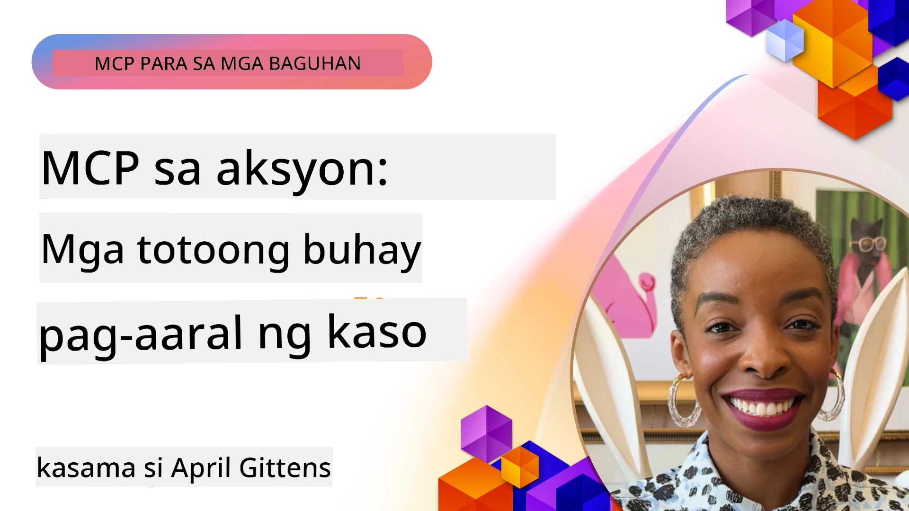

# MCP in Action: Mga Tunay na Kaso ng Pag-aaral

_(I-click ang larawan sa itaas upang mapanood ang video ng leksyon na ito)_

Ang Model Context Protocol (MCP) ay nagbabago sa paraan ng pakikipag-ugnayan ng mga AI application sa data, mga tool, at serbisyo. Ipinapakita ng seksyong ito ang mga tunay na kaso ng pag-aaral na nagpapakita ng praktikal na aplikasyon ng MCP sa iba't ibang mga senaryo ng enterprise.

## Pangkalahatang-ideya

Ipinapakita sa seksyong ito ang mga kongkretong halimbawa ng mga implementasyon ng MCP, na nagha-highlight kung paano ginagamit ng mga organisasyon ang protocol na ito upang malutas ang mga kumplikadong hamon sa negosyo. Sa pagsusuri ng mga kasong ito, magkakaroon ka ng mga pananaw sa pagiging flexible, scalability, at mga praktikal na benepisyo ng MCP sa mga totoong senaryo.

## Pangunahing Layunin sa Pagkatuto

Sa pag-explore ng mga kasong ito ng pag-aaral, matututuhan mo:

- Kung paano maaaring gamitin ang MCP upang malutas ang mga tiyak na problema sa negosyo
- Ang iba't ibang mga pattern ng integrasyon at mga arkitekturang pamamaraan
- Kilalanin ang pinakamahusay na mga praktis para sa pagpapatupad ng MCP sa mga kapaligiran ng enterprise
- Makakuha ng mga pananaw sa mga hamon at mga solusyong naranasan sa mga tunay na implementasyon
- Tukuyin ang mga oportunidad na gamitin ang mga katulad na pattern sa iyong sariling mga proyekto

## Mga Tampok na Kaso ng Pag-aaral

### 1. [Azure AI Travel Agents – Reference Implementation](./travelagentsample.md)

Tinitingnan ng kasong ito ang komprehensibong reference solution ng Microsoft na nagpapakita kung paano bumuo ng isang multi-agent, AI-powered na travel planning application gamit ang MCP, Azure OpenAI, at Azure AI Search. Ipinapakita ng proyekto ang:

- Multi-agent orchestration gamit ang MCP
- Integrasyon ng enterprise data sa Azure AI Search
- Ligtas at scalable na arkitektura gamit ang mga serbisyo ng Azure
- Extensible na mga tool gamit ang reusable MCP components
- Conversational na karanasan ng gumagamit na pinapagana ng Azure OpenAI

Ang arkitektura at mga detalye ng implementasyon ay nagbibigay ng mahahalagang pananaw sa paggawa ng kumplikadong mga multi-agent na sistema na may MCP bilang layer ng koordinasyon.

### 2. [Pag-update ng Azure DevOps Items mula sa YouTube Data](./UpdateADOItemsFromYT.md)

Ipinapakita ng kasong ito ang praktikal na aplikasyon ng MCP para sa pag-automate ng mga workflow proseso. Ipinapakita nito kung paano maaaring gamitin ang mga tool ng MCP upang:

- Kunin ang data mula sa online na mga platform (YouTube)
- I-update ang mga work item sa mga sistema ng Azure DevOps
- Lumikha ng mga repeatable automation workflow
- Mag-integrate ng data sa pagitan ng mga magkakaibang sistema

Ipinapakita ng halimbawa na ito kung paano kahit ang mga simpleng implementasyon ng MCP ay maaaring magbigay ng malaking pagtaas sa kahusayan sa pamamagitan ng pag-automate ng mga paulit-ulit na gawain at pagpapahusay ng konsistensi ng data sa mga sistema.

### 3. [Real-Time Documentation Retrieval gamit ang MCP](./docs-mcp/README.md)

Ginagabayan ka ng kasong ito sa pagkonekta ng isang Python console client sa isang Model Context Protocol (MCP) server upang kunin at i-log ang real-time, context-aware na dokumentasyon ng Microsoft. Matututuhan mo kung paano:

- Kumonekta sa isang MCP server gamit ang isang Python client at ang opisyal na MCP SDK
- Gumamit ng streaming HTTP clients para sa mahusay, real-time na pagkuha ng data
- Tumawag sa mga tool ng dokumentasyon sa server at direktang i-log ang mga tugon sa console
- Isama ang up-to-date na dokumentasyon ng Microsoft sa iyong workflow nang hindi lumalabas sa terminal

Kasama sa kabanata ang isang hands-on na gawain, isang minimal working code sample, at mga link sa karagdagang mga mapagkukunan para sa mas malalim na pag-aaral. Tingnan ang buong walkthrough at code sa naka-link na kabanata upang maunawaan kung paano mababago ng MCP ang access sa dokumentasyon at produktibidad ng developer sa mga console-based na kapaligiran.

### 4. [Interactive Study Plan Generator Web App gamit ang MCP](./docs-mcp/README.md)

Ipinapakita ng kasong ito kung paano bumuo ng isang interactive na web application gamit ang Chainlit at ang Model Context Protocol (MCP) upang gumawa ng personalized na mga plano sa pag-aaral para sa anumang paksa. Maaaring tukuyin ng mga user ang isang subject (tulad ng "AI-900 certification") at isang tagal ng pag-aaral (hal., 8 linggo), at ang app ay magbibigay ng linggo-sa-linggo na breakdown ng mga inirerekomendang nilalaman. Pinapagana ng Chainlit ang conversational chat interface, na ginagawang mas nakaka-engganyo at adaptive ang karanasan.

- Conversational na web app na pinapagana ng Chainlit
- Mga prompt mula sa user para sa paksa at tagal
- Linggo-sa-linggo na mga rekomendasyon ng nilalaman gamit ang MCP
- Real-time, adaptive na mga tugon sa chat interface

Ipinapakita ng proyekto kung paano maaaring pagsamahin ang conversational AI at MCP upang lumikha ng masigla, user-driven na mga tool pang-edukasyon sa modernong web na kapaligiran.

### 5. [Mga Dokumento sa Editor gamit ang MCP Server sa VS Code](./docs-mcp/README.md)

Ipinapakita ng kasong ito kung paano maipapasok ang Microsoft Learn Docs direkta sa iyong VS Code environment gamit ang MCP server—hindi na kailangang magpalipat-lipat sa browser tabs! Makikita mo kung paano:

- Agad na maghanap at magbasa ng docs sa loob ng VS Code gamit ang MCP panel o command palette
- Mag-referensya ng dokumentasyon at magpasok ng mga link direkta sa iyong README o course markdown files
- Gamitin ang GitHub Copilot at MCP nang sabay para sa seamless, AI-powered na dokumentasyon at code workflows
- I-validate at pagandahin ang iyong dokumentasyon gamit ang real-time feedback at katumpakan mula sa Microsoft
- Isama ang MCP sa mga workflow ng GitHub para sa tuloy-tuloy na pag-validate ng dokumentasyon

Kasama sa implementasyon ang:

- Halimbawa ng `.vscode/mcp.json` configuration para sa madaling setup
- Mga screenshot-based walkthrough ng karanasan sa loob ng editor
- Mga tip para pagsamahin ang Copilot at MCP para sa maximum na produktibidad

Perpekto ang senaryo na ito para sa mga author ng kurso, manunulat ng dokumentasyon, at mga developer na nais manatiling nakatuon sa kanilang editor habang nagtatrabaho sa mga docs, Copilot, at mga validation tool—lahat ng ito ay pinapagana ng MCP.

### 6. [Paglikha ng APIM MCP Server](./apimsample.md)

Nagbibigay ang kasong ito ng step-by-step na gabay kung paano gumawa ng MCP server gamit ang Azure API Management (APIM). Tinututukan nito ang:

- Pagsisimula ng MCP server sa Azure API Management
- Pagpapakita ng API operations bilang MCP tools
- Pag-configure ng mga polisiya para sa rate limiting at seguridad
- Pagsubok ng MCP server gamit ang Visual Studio Code at GitHub Copilot

Ipinapakita ng halimbawa na ito kung paano gamitin ang kakayahan ng Azure upang makalikha ng matatag na MCP server na maaaring magamit sa iba't ibang aplikasyon, pinapalakas ang integrasyon ng mga AI system sa mga enterprise API.

### 7. [GitHub MCP Registry — Pagsusulong ng Agentic Integration](https://github.com/mcp)

Tinitingnan ng kasong ito kung paano tinugunan ng GitHub MCP Registry, na inilunsad noong Setyembre 2025, ang isang kritikal na hamon sa AI ecosystem: ang pagkakawatak-watak ng pagtuklas at deployment ng Model Context Protocol (MCP) servers.

#### Pangkalahatang-ideya
Nilulutas ng **MCP Registry** ang lumalaking problema ng pagkakahati-hati ng mga MCP server sa iba't ibang repositoryo at registry, na dati ay nagpapabagal at nagiging sanhi ng mga error sa integrasyon. Pinapagana ng mga server na ito ang mga AI agent na makipag-ugnayan sa mga external system tulad ng APIs, databases, at mga pinagkukunan ng dokumentasyon.

#### Paglalahad ng Problema
Nakaranas ang mga developer na bumubuo ng agentic workflows ng ilang mga hamon:
- **Mahinang discoverability** ng mga MCP server sa iba't ibang platform
- **Paulit-ulit na mga tanong sa setup** sa mga forum at dokumentasyon
- **Mga panganib sa seguridad** mula sa hindi naverify at hindi pinagkakatiwalaang mga pinagmulan
- **Kakulangan sa standardisasyon** sa kalidad at compatibility ng server

#### Arkitektura ng Solusyon
Pinagsasama ng GitHub MCP Registry ang mga pinagkakatiwalaang MCP server na may mga pangunahing tampok:
- **One-click install** integration sa pamamagitan ng VS Code para sa madaling setup
- **Pag-sort batay sa signal-over-noise** gamit ang mga bituin, aktibidad, at pagpapatunay ng komunidad
- **Direktang integrasyon** sa GitHub Copilot at iba pang MCP-compatible na mga tool
- **Open contribution model** na nagpapahintulot sa komunidad at mga enterprise partner na mag-ambag

#### Epekto sa Negosyo
Naghatid ang registry ng nasusukat na mga pagpapabuti:
- **Mas mabilis na onboarding** para sa mga developer na gumagamit ng mga tool tulad ng Microsoft Learn MCP Server, na nag-stream ng opisyal na dokumentasyon direkta sa mga agent
- **Pinahusay na produktibidad** sa pamamagitan ng mga specialized na server tulad ng `github-mcp-server`, na nagpapagana ng natural language GitHub automation (paglikha ng PR, mga muling pagtakbo ng CI, pag-scan ng code)
- **Mas malakas na tiwala sa ecosystem** sa pamamagitan ng curated listings at transparent na mga pamantayan sa configuration

#### Pangunahing Halaga
Para sa mga practitioner na dalubhasa sa lifecycle management ng agent at reproducible workflows, ang MCP Registry ay nagbibigay ng:
- **Modular na deployment ng agent** gamit ang standardized components
- **Registry-backed evaluation pipelines** para sa consistent na testing at validation
- **Cross-tool interoperability** na nagpapahintulot ng seamless na integrasyon sa iba't ibang AI platform

Ipinapakita ng kasong ito na ang MCP Registry ay hindi lamang isang directory—ito ay isang pundamental na platform para sa scalable, real-world na integrasyon ng model at deployment ng mga agentic system.

## Konklusyon

Ipinapakita ng pitong komprehensibong kasong ito ng pag-aaral ang kamangha-manghang versatility at praktikal na aplikasyon ng Model Context Protocol sa iba't ibang tunay na senaryo. Mula sa mga kumplikadong multi-agent na sistema sa pagpaplano ng paglalakbay at enterprise API management hanggang sa mga streamlined na workflow ng dokumentasyon at ang rebolusyonaryong GitHub MCP Registry, ipinapakita ng mga halimbawa kung paano nagbibigay ang MCP ng isang standardisadong, scalable na paraan upang ikonekta ang mga AI system sa mga tool, data, at serbisyo na kailangan nila upang maghatid ng natatanging halaga.

Sinasaklaw ng mga kaso ng pag-aaral ang maraming dimensyon ng implementasyon ng MCP:
- **Enterprise Integration**: Azure API Management at Azure DevOps automation
- **Multi-Agent Orchestration**: Pagpaplano ng paglalakbay gamit ang mga koordinadong AI agent
- **Produktibidad ng Developer**: Integrasyon sa VS Code at real-time na access sa dokumentasyon
- **Pag-develop ng Ecosystem**: GitHub MCP Registry bilang pundamental na platform
- **Mga Aplikasyong Pang-edukasyon**: Interactive study plan generators at conversational interfaces

Sa pag-aaral ng mga implementasyong ito, makakakuha ka ng mahahalagang pananaw sa:
- **Mga pattern ng arkitektura** para sa iba't ibang sukat at gamit
- **Mga estratehiya sa implementasyon** na nagbabalanse ng functionality at maintainability
- **Mga konsiderasyon sa seguridad at scalability** para sa produksyon na deployment
- **Pinakamahusay na praktis** para sa pagpapaunlad ng MCP server at client integration
- **Ecosystem thinking** para sa paggawa ng magkakaugnay na solusyong pinapagana ng AI

Pinapakita ng mga halimbawang ito na ang MCP ay hindi lamang teoretikal na balangkas kundi isang matured, production-ready protocol na nagpapahintulot ng praktikal na solusyon sa mga kumplikadong hamon sa negosyo. Kung ikaw ay bumubuo ng simple automation tools o sopistikadong multi-agent systems, nagbibigay ang mga pattern at pamamaraan na nakalarawan dito ng matibay na pundasyon para sa iyong sariling MCP na mga proyekto.

## Karagdagang Mga Mapagkukunan

- [Azure AI Travel Agents GitHub Repository](https://github.com/Azure-Samples/azure-ai-travel-agents)
- [Azure DevOps MCP Tool](https://github.com/microsoft/azure-devops-mcp)
- [Playwright MCP Tool](https://github.com/microsoft/playwright-mcp)
- [Microsoft Docs MCP Server](https://github.com/MicrosoftDocs/mcp)
- [GitHub MCP Registry — Accelerating Agentic Integration](https://github.com/mcp)
- [MCP Community Examples](https://github.com/microsoft/mcp)

## Ano ang Susunod

- Nakaraan: [Module 8: Best Practices](../08-BestPractices/README.md)
- Susunod: [Module 10: Streamlining AI Workflows: Building an MCP Server with AI Toolkit](../10-StreamliningAIWorkflowsBuildingAnMCPServerWithAIToolkit/README.md)

---

<!-- CO-OP TRANSLATOR DISCLAIMER START -->
**Pagsasabi ng Paunawa**:  
Ang dokumentong ito ay isinalin gamit ang serbisyong AI na pagsasalin [Co-op Translator](https://github.com/Azure/co-op-translator). Bagamat kami ay nagsusumikap para sa kawastuhan, pakatandaan na ang mga awtomatikong salin ay maaaring maglaman ng mga pagkakamali o hindi pagkakatugma. Ang orihinal na dokumento sa orihinal nitong wika ang dapat ituring na pangunahing sanggunian. Para sa mahahalagang impormasyon, inirerekomenda ang propesyonal na pagsasalin ng tao. Hindi kami mananagot sa anumang hindi pagkakaunawaan o maling interpretasyon na nagmula sa paggamit ng pagsasaling ito.
<!-- CO-OP TRANSLATOR DISCLAIMER END -->