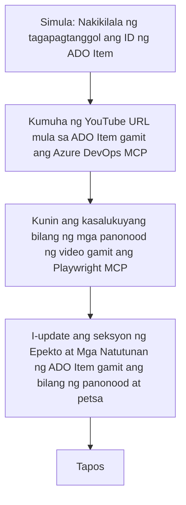

# Case Study: Pag-update ng Azure DevOps Items mula sa YouTube Data gamit ang MCP

> **Disclaimer:** May mga umiiral nang mga online tool at ulat na maaaring i-automate ang proseso ng pag-update ng Azure DevOps items gamit ang data mula sa mga platform tulad ng YouTube. Ang sumusunod na sitwasyon ay ibinibigay bilang isang halimbawa ng paggamit upang ipakita kung paano maaaring gamitin ang MCP tools para sa automation at integration tasks.

## Overview

Ipinapakita ng case study na ito ang isang halimbawa kung paano maaaring gamitin ang Model Context Protocol (MCP) at mga kasangkapang kaugnay nito upang i-automate ang proseso ng pag-update ng Azure DevOps (ADO) work items gamit ang impormasyon mula sa online platforms, gaya ng YouTube. Ang inilalarawang sitwasyon ay isa lamang ilustrasyon ng mas malawak na kakayahan ng mga tools na ito, na maaaring baguhin para sa marami pang katulad na pangangailangan ng automation.

Sa halimbawang ito, sinusubaybayan ng isang Advocate ang mga online session gamit ang mga ADO item, kung saan bawat item ay may URL ng YouTube video. Sa pamamagitan ng paggamit ng MCP tools, maaaring panatilihin ng Advocate na napapanahon ang mga ADO item gamit ang pinakabagong video metrics, gaya ng bilang ng views, sa isang paulit-ulit at automated na paraan. Ang pamamaraan na ito ay maaaring ilapat sa iba pang mga kaso kung saan kailangang pagsamahin ang impormasyon mula sa online sources papunta sa ADO o iba pang mga sistema.

## Scenario

Isang Advocate ang may responsibilidad na subaybayan ang epekto ng mga online session at community engagements. Bawat session ay nakalista bilang isang ADO work item sa proyektong 'DevRel', at ang work item ay may field para sa YouTube video URL. Upang tama ang pag-uulat ng abot ng session, kailangang i-update ng Advocate ang ADO item gamit ang kasalukuyang bilang ng video views at ang petsa kung kailan nakuha ang impormasyong ito.

## Tools Used

- [Azure DevOps MCP](https://github.com/microsoft/azure-devops-mcp): Nagbibigay ng programmatic access at update sa mga ADO work items gamit ang MCP.
- [Playwright MCP](https://github.com/microsoft/playwright-mcp): Nag-a-automate ng mga gawaing browser para kunin ang live na data mula sa mga web page, tulad ng mga istatistika ng YouTube video.

## Step-by-Step Workflow

1. **Tukuyin ang ADO Item**: Simulan gamit ang ADO work item ID (halimbawa, 1234) sa proyektong 'DevRel'.
2. **Kunin ang YouTube URL**: Gamitin ang Azure DevOps MCP tool upang kunin ang YouTube URL mula sa work item.
3. **Kunin ang Video Views**: Gamitin ang Playwright MCP tool upang pumunta sa YouTube URL at kunin ang kasalukuyang bilang ng views.
4. **I-update ang ADO Item**: Isulat ang pinakabagong bilang ng views at ang petsa ng pagkuha nito sa seksyong 'Impact and Learnings' ng ADO work item gamit ang Azure DevOps MCP tool.

## Example Prompt

```bash
- Work with the ADO Item ID: 1234
- The project is '2025-Awesome'
- Get the YouTube URL for the ADO item
- Use Playwright to get the current views from the YouTube video
- Update the ADO item with the current video views and the updated date of the information
```

## Mermaid Flowchart


## Technical Implementation

- **MCP Orchestration**: Ang workflow ay pinamamahalaan ng isang MCP server, na nag-uugnay sa paggamit ng parehong Azure DevOps MCP at Playwright MCP tools.
- **Automation**: Maaaring paganahin ang proseso nang mano-mano o i-schedule upang tumakbo nang regular para mapanatiling napapanahon ang mga ADO item.
- **Extensibility**: Ang parehong pattern ay maaaring palawakin upang i-update ang mga ADO item gamit ang iba pang online metrics (hal. likes, comments) o mula sa ibang platform.

## Results and Impact

- **Efficiency**: Nakababawas ng manual na trabaho para sa mga Advocate sa pamamagitan ng pag-automate ng pagkuha at pag-update ng video metrics.
- **Accuracy**: Tinitiyak na ang mga ADO item ay sumasalamin sa pinakabagong data na magagamit mula sa mga online source.
- **Repeatability**: Nagbibigay ng reusable na workflow para sa mga katulad na sitwasyon na may kinalaman sa ibang mga source ng data o metrics.

## References

- [Azure DevOps MCP](https://github.com/microsoft/azure-devops-mcp)
- [Playwright MCP](https://github.com/microsoft/playwright-mcp)
- [Model Context Protocol (MCP)](https://modelcontextprotocol.io/)

## What's Next

- Back to: [Case Studies Overview](./README.md)
- Next: [Real-Time Documentation Retrieval with MCP](./docs-mcp/README.md)

---

<!-- CO-OP TRANSLATOR DISCLAIMER START -->
**Pagsisitang**:  
Ang dokumentong ito ay isinalin gamit ang AI translation service na [Co-op Translator](https://github.com/Azure/co-op-translator). Bagamat nagsusumikap kami para sa katumpakan, mangyaring unawain na ang mga awtomatikong pagsasalin ay maaaring maglaman ng mga pagkakamali o kamalian. Ang orihinal na dokumento sa kanyang likas na wika ang dapat ituring na opisyal na sanggunian. Para sa mahahalagang impormasyon, inirerekomenda ang propesyonal na pagsasalin ng tao. Hindi kami mananagutan sa anumang hindi pagkakaunawaan o maling interpretasyon na nagmula sa paggamit ng pagsasaling ito.
<!-- CO-OP TRANSLATOR DISCLAIMER END -->