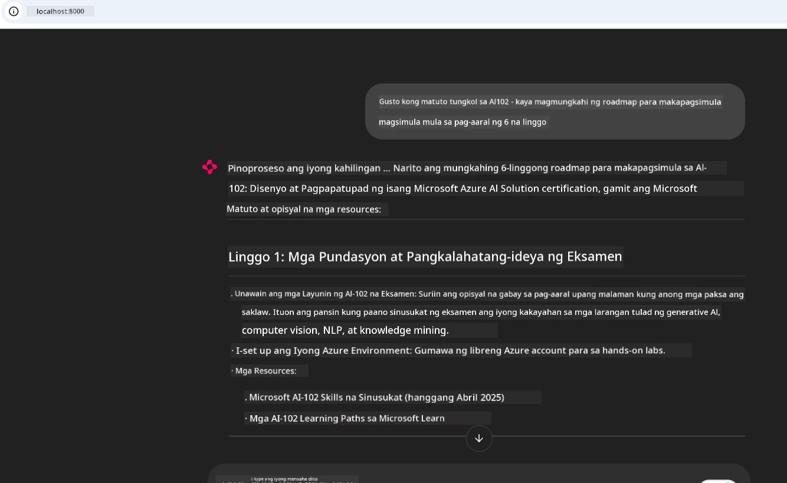
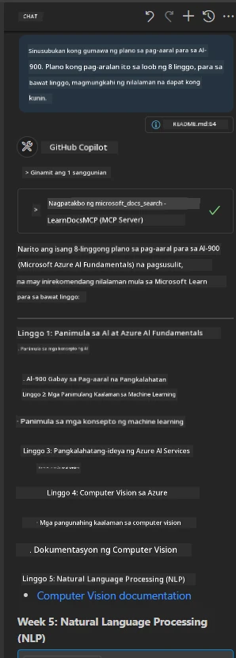

# Case Study: Pagkonekta sa Microsoft Learn Docs MCP Server mula sa isang Kliyente

Naranasan mo na bang magpalipat-lipat sa pagitan ng mga documentation site, Stack Overflow, at walang katapusang mga tab ng search engine, habang sinusubukan lutasin ang isang problema sa iyong code? Marahil may pangalawang monitor ka lang para sa mga docs, o palagi kang nag-a-alt-tab sa pagitan ng iyong IDE at browser. Hindi ba mas maganda kung maidaragdag mo ang dokumentasyon mismo sa iyong workflow—na naka-integrate sa iyong mga app, IDE, o kahit sa iyong sariling mga custom tool? Sa case study na ito, tatalakayin natin kung paano gawin ito sa pamamagitan ng direktang pagkonekta sa Microsoft Learn Docs MCP server mula sa iyong sariling client application.

## Overview

Ang modernong pag-develop ay hindi lang basta pagsusulat ng code—ito ay tungkol sa paghahanap ng tamang impormasyon sa tamang oras. Ang dokumentasyon ay nasa lahat ng dako, ngunit bihira itong nasa lugar na pinaka-kailangan mo: sa loob ng iyong mga tool at workflow. Sa pamamagitan ng pag-integrate ng dokumentasyon nang direkta sa iyong mga aplikasyon, makakatipid ka ng oras, mababawasan ang paglipat-lipat ng konteksto, at mapapalakas ang produktibidad. Sa seksyong ito, ipapakita namin kung paano mag-connect ng client sa Microsoft Learn Docs MCP server, upang ma-access mo ang real-time, context-aware na dokumentasyon nang hindi umaalis sa iyong app.

Dadalahan ka namin ng mga hakbang sa pag-establish ng koneksyon, pagpapadala ng request, at mahusay na paghawak ng streaming response. Ang pamamaraang ito ay hindi lang nagpapaikli ng iyong workflow kundi nagbubukas din ng daan para makabuo ng mas matatalinong mga tool para sa developer.

## Learning Objectives

Bakit natin ito ginagawa? Dahil ang pinakamahusay na karanasan ng developer ay ang mga nag-aalis ng sagabal. Isipin mo ang isang mundo kung saan ang iyong code editor, chatbot, o web app ay kayang sagutin ang iyong mga tanong tungkol sa dokumentasyon kaagad, gamit ang pinakabagong nilalaman mula sa Microsoft Learn. Sa pagtatapos ng kabanatang ito, malalaman mo kung paano:

- Unawain ang mga batayan ng komunikasyon ng MCP server-client para sa dokumentasyon
- Mag-implementa ng console o web application na nakakonekta sa Microsoft Learn Docs MCP server
- Gumamit ng streaming HTTP clients para sa real-time na pagkuha ng dokumentasyon
- I-log at unawain ang mga tugon sa dokumentasyon sa iyong aplikasyon

Makikita mo kung paanong makakatulong ang mga kasanayang ito upang makabuo ka ng mga tool na hindi lang reaktibo, kundi tunay na interactive at context-aware.

## Scenario 1 - Real-Time na Pagkuha ng Dokumentasyon gamit ang MCP

Sa scenario na ito, ipapakita namin kung paano mag-connect ng client sa Microsoft Learn Docs MCP server, upang ma-access mo ang real-time, context-aware na dokumentasyon nang hindi umaalis sa iyong app.

Isabuhay natin ito. Ang iyong gawain ay gumawa ng isang app na kumokonekta sa Microsoft Learn Docs MCP server, tumatawag sa tool na `microsoft_docs_search`, at nilolod ang streaming response sa console.

### Bakit ganito ang lakad?
Dahil ito ang pundasyon para sa pagbuo ng mas advanced na integrasyon—kung gusto mong paandarin ang isang chatbot, isang extension sa IDE, o isang web dashboard.

Makikita mo ang code at mga tagubilin para sa scenario na ito sa folder na [`solution`](./solution/README.md) sa loob ng case study na ito. Gabay ka ng mga hakbang sa pagsasaayos ng koneksyon:
- Gumamit ng opisyal na MCP SDK at streamable HTTP client para sa koneksyon
- Tawagin ang tool na `microsoft_docs_search` gamit ang query parameter upang makuha ang dokumentasyon
- I-implementa ang tamang pag-log at paghawak ng error
- Gumawa ng interactive console interface para payagan ang mga user na maglagay ng maraming paghahanap

Ipinapakita ng scenario na ito kung paano:
- Kumonekta sa Docs MCP server
- Magpadala ng query
- I-parse at i-print ang mga resulta

Ganito ang maaaring hitsura ng pagpapatakbo ng solusyon:

```
Prompt> What is Azure Key Vault?
Answer> Azure Key Vault is a cloud service for securely storing and accessing secrets. ...
```

Narito ang isang minimal sample solution. Ang buong code at detalye ay makikita sa solution folder.

<details>
<summary>Python</summary>

```python
import asyncio
from mcp.client.streamable_http import streamablehttp_client
from mcp import ClientSession

async def main():
    async with streamablehttp_client("https://learn.microsoft.com/api/mcp") as (read_stream, write_stream, _):
        async with ClientSession(read_stream, write_stream) as session:
            await session.initialize()
            result = await session.call_tool("microsoft_docs_search", {"query": "Azure Functions best practices"})
            print(result.content)

if __name__ == "__main__":
    asyncio.run(main())
```

- Para sa kumpletong implementasyon at logging, tingnan ang [`scenario1.py`](../../../../09-CaseStudy/docs-mcp/solution/python/scenario1.py).
- Para sa mga tagubilin sa pag-install at paggamit, tingnan ang file na [`README.md`](./solution/python/README.md) sa parehong folder.
</details>


## Scenario 2 - Interactive Study Plan Generator Web App gamit ang MCP

Sa scenario na ito, matututuhan mo kung paano i-integrate ang Docs MCP sa isang web development project. Layunin nito na payagan ang mga user na maghanap ng Microsoft Learn documentation direkta mula sa isang web interface, na ginagawang agad accessible ang dokumentasyon sa loob ng iyong app o site.

Makikita mo kung paano:
- Mag-set up ng web app
- Kumonekta sa Docs MCP server
- Hawakan ang input ng user at ipakita ang mga resulta

Ganito ang maaaring hitsura ng pagpapatakbo ng solusyon:

```
User> I want to learn about AI102 - so suggest the roadmap to get it started from learn for 6 weeks

Assistant> Here’s a detailed 6-week roadmap to start your preparation for the AI-102: Designing and Implementing a Microsoft Azure AI Solution certification, using official Microsoft resources and focusing on exam skills areas:

---
## Week 1: Introduction & Fundamentals
- **Understand the Exam**: Review the [AI-102 exam skills outline](https://learn.microsoft.com/en-us/credentials/certifications/exams/ai-102/).
- **Set up Azure**: Sign up for a free Azure account if you don't have one.
- **Learning Path**: [Introduction to Azure AI services](https://learn.microsoft.com/en-us/training/modules/intro-to-azure-ai/)
- **Focus**: Get familiar with Azure portal, AI capabilities, and necessary tools.

....more weeks of the roadmap...

Let me know if you want module-specific recommendations or need more customized weekly tasks!
```

Narito ang isang minimal sample solution. Ang buong code at detalye ay makikita sa solution folder.



<details>
<summary>Python (Chainlit)</summary>

Ang Chainlit ay isang framework para sa paggawa ng conversational AI web apps. Pinadadali nito ang paglikha ng interactive chatbots at assistants na kayang tumawag ng mga MCP tools at magpakita ng mga resulta nang real time. Ideal ito para sa mabilisang prototyping at user-friendly na interface.

```python
import chainlit as cl
import requests

MCP_URL = "https://learn.microsoft.com/api/mcp"

@cl.on_message
def handle_message(message):
    query = {"question": message}
    response = requests.post(MCP_URL, json=query)
    if response.ok:
        result = response.json()
        cl.Message(content=result.get("answer", "No answer found.")).send()
    else:
        cl.Message(content="Error: " + response.text).send()
```

- Para sa kompletong implementasyon, tingnan ang [`scenario2.py`](../../../../09-CaseStudy/docs-mcp/solution/python/scenario2.py).
- Para sa mga tagubilin sa setup at pagpapatakbo, tingnan ang [`README.md`](./solution/python/README.md).
</details>


## Scenario 3: In-Editor Docs gamit ang MCP Server sa VS Code

Kung gusto mong makuha ang Microsoft Learn Docs direkta sa loob ng iyong VS Code (sa halip na magpalipat-lipat sa mga tab ng browser), maaari mong gamitin ang MCP server sa iyong editor. Pinapayagan ka nitong:
- Maghanap at magbasa ng docs sa VS Code nang hindi umaalis sa iyong coding environment.
- Mag-refer ng dokumentasyon at mag-insert ng mga link direkta sa iyong README o course files.
- Pagsamahin ang GitHub Copilot at MCP para sa isang seamless, AI-powered na workflow ng dokumentasyon.

**Makikita mo kung paano:**
- Magdagdag ng valid na `.vscode/mcp.json` file sa root ng iyong workspace (tingnan ang halimbawa sa ibaba).
- Buksan ang MCP panel o gamitin ang command palette sa VS Code para maghanap at mag-insert ng docs.
- Mag-refer ng dokumentasyon direkta sa iyong markdown files habang nagta-trabaho.
- Pagsamahin ang workflow na ito sa GitHub Copilot para sa mas mataas na produktibidad.

Narito ang isang halimbawa kung paano i-set up ang MCP server sa VS Code:

```json
{
  "servers": {
    "LearnDocsMCP": {
      "url": "https://learn.microsoft.com/api/mcp"
    }
  }
}
```

</details>

> Para sa detalyadong walkthrough kasama ang mga screenshot at step-by-step guide, tingnan ang [`README.md`](./solution/scenario3/README.md).



Ang pamamaraang ito ay angkop para sa sinumang gumagawa ng teknikal na kurso, sumusulat ng dokumentasyon, o nagde-develop ng code na madalas nangangailangan ng sanggunian.

## Key Takeaways

Ang pag-integrate ng dokumentasyon nang direkta sa iyong mga tool ay hindi lang kaginhawaan—ito ay isang game changer para sa produktibidad. Sa pamamagitan ng pagkonekta sa Microsoft Learn Docs MCP server mula sa iyong client, magagawa mong:

- Alisin ang paglipat-lipat ng konteksto sa pagitan ng code at dokumentasyon
- Kunin ang pinaka-updated, context-aware na dokumentasyon nang real time
- Bumuo ng mas matalino, mas interactive na developer tools

Makakatulong ang mga kasanayang ito upang makalikha ka ng mga solusyon na hindi lang epektibo, kundi masaya ring gamitin.

## Additional Resources

Para palalimin pa ang iyong pag-unawa, silipin ang mga opisyal na resources na ito:

- [Microsoft Learn Docs MCP Server (GitHub)](https://github.com/MicrosoftDocs/mcp)
- [Magsimula gamit ang Azure MCP Server (mcp-python)](https://learn.microsoft.com/en-us/azure/developer/azure-mcp-server/get-started#create-the-python-app)
- [Ano ang Azure MCP Server?](https://learn.microsoft.com/en-us/azure/developer/azure-mcp-server/)
- [Panimula sa Model Context Protocol (MCP)](https://modelcontextprotocol.io/introduction)
- [Magdagdag ng plugins mula sa MCP Server (Python)](https://learn.microsoft.com/en-us/semantic-kernel/concepts/plugins/adding-mcp-plugins)

## What's Next

- Bumalik sa: [Case Studies Overview](../README.md)
- Magpatuloy sa: [Module 10: Streamlining AI Workflows with AI Toolkit](../../10-StreamliningAIWorkflowsBuildingAnMCPServerWithAIToolkit/README.md)

---

<!-- CO-OP TRANSLATOR DISCLAIMER START -->
**Paunawa**:  
Ang dokumentong ito ay isinalin gamit ang serbisyong AI na pagsasalin, [Co-op Translator](https://github.com/Azure/co-op-translator). Bagamat nagsusumikap kami na maging tumpak ang pagsasalin, pakatandaan na maaaring may mga error o kamalian ang awtomatikong pagsasalin. Ang orihinal na dokumento sa orihinal nitong wika ang dapat ituring na pinagmulan ng katotohanan. Para sa mahahalagang impormasyon, inirerekomenda ang propesyonal na pagsasalin ng tao. Hindi kami mananagot sa anumang hindi pagkakaunawaan o maling interpretasyon na maaaring magmula sa paggamit ng pagsasaling ito.
<!-- CO-OP TRANSLATOR DISCLAIMER END -->