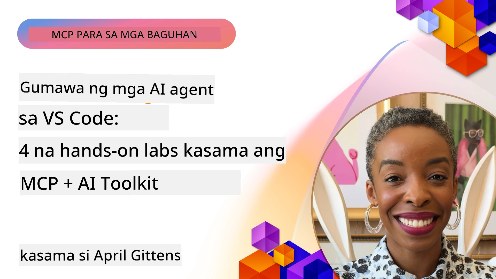

# Pagpapadali ng AI Workflows: Pagtatayo ng MCP Server gamit ang AI Toolkit

## 🎯  Pangkalahatang Ideya

_(I-click ang larawan sa itaas upang panoorin ang video ng leksyong ito)_

Maligayang pagdating sa **Model Context Protocol (MCP) Workshop**! Ang komprehensibong hands-on na workshop na ito ay pinagsasama ang dalawang makabagong teknolohiya upang baguhin ang pagbuo ng mga AI application:

- **🔗 Model Context Protocol (MCP)**: Isang bukas na pamantayan para sa tuluy-tuloy na integrasyon ng AI-tool
- **🛠️ AI Toolkit para sa Visual Studio Code (AITK)**: Makapangyarihang AI development extension ng Microsoft

### 🎓 Ano ang Iyong Matututunan

Sa pagtatapos ng workshop na ito, iyong mamamayani ang sining ng pagbuo ng matatalinong aplikasyon na nag-uugnay ng mga AI model sa mga totoong mundo na tool at serbisyo. Mula sa awtomatikong pagsusuri hanggang sa custom na API integrations, makakamit mo ang mga praktikal na kakayahan upang malutas ang mga komplikadong hamon sa negosyo.

## 🏗️ Teknolohiyang Ginagamit

### 🔌 Model Context Protocol (MCP)

Ang MCP ang **"USB-C para sa AI"** - isang unibersal na pamantayan na nag-uugnay ng mga AI model sa mga panlabas na tool at pinagkukunan ng datos.

**✨ Pangunahing Katangian:**

- 🔄 **Standardized Integration**: Unibersal na interface para sa koneksyon ng AI-tool
- 🏛️ **Flexible Architecture**: Lokal at remote na mga server sa pamamagitan ng stdio/SSE transport
- 🧰 **Rich Ecosystem**: Mga tool, prompt, at mapagkukunan sa isang protocol lang
- 🔒 **Enterprise-Ready**: May kasamang seguridad at pagiging maasahan

**🎯 Bakit Mahalaga ang MCP:**
Katulad ng pag-aalis ng USB-C sa gulo ng mga kable, inaalis ng MCP ang kumplikado ng AI integrations. Isang protocol, walang katapusang mga posibilidad.

### 🤖 AI Toolkit para sa Visual Studio Code (AITK)

Flagship AI development extension ng Microsoft na ginagawang AI powerhouse ang VS Code.

**🚀 Pangunahing Kakayahan:**

- 📦 **Model Catalog**: Access sa mga modelo mula sa Azure AI, GitHub, Hugging Face, Ollama
- ⚡ **Local Inference**: ONNX-optimized para sa CPU/GPU/NPU execution
- 🏗️ **Agent Builder**: Visual AI agent development na may integrasyon sa MCP
- 🎭 **Multi-Modal**: Suporta sa teksto, bisyon, at struktura na output

**💡 Benepisyo sa Pagde-develop:**

- Zero-config na pag-deploy ng modelo
- Visual na prompt engineering
- Playground para sa real-time testing
- Seamless na integrasyon ng MCP server

## 📚 Landas ng Pag-aaral

### [🚀 Module 1: AI Toolkit Fundamentals](./lab1/README.md)

**Tagal**: 15 minuto

- 🛠️ I-install at i-configure ang AI Toolkit para sa VS Code
- 🗂️ Tuklasin ang Model Catalog (100+ modelo mula sa GitHub, ONNX, OpenAI, Anthropic, Google)
- 🎮 Matuwa sa Interactive Playground para sa real-time na pagsusuri ng modelo
- 🤖 Gumawa ng iyong unang AI agent gamit ang Agent Builder
- 📊 Siyasatin ang performance ng modelo gamit ang built-in na metrics (F1, relevance, similarity, coherence)
- ⚡ Matutunan ang batch processing at multi-modal support na mga kakayahan

**🎯 Resulta ng Pag-aaral**: Makagawa ng gumaganang AI agent na may malawak na pang-unawa sa mga kakayahan ng AITK

### [🌐 Module 2: MCP with AI Toolkit Fundamentals](./lab2/README.md)

**Tagal**: 20 minuto

- 🧠 Alamin ang Model Context Protocol (MCP) na arkitektura at mga konsepto
- 🌐 Galugarin ang ecosystem ng MCP server ng Microsoft
- 🤖 Bumuo ng browser automation agent gamit ang Playwright MCP server
- 🔧 Isama ang MCP servers sa AI Toolkit Agent Builder
- 📊 I-configure at subukan ang MCP tools sa loob ng iyong mga agent
- 🚀 I-export at ideploy ang mga MCP-powered na agent para sa production use

**🎯 Resulta ng Pag-aaral**: I-deploy ang AI agent na may matinding suporta ng panlabas na mga tool sa pamamagitan ng MCP

### [🔧 Module 3: Advanced MCP Development with AI Toolkit](./lab3/README.md)

**Tagal**: 20 minuto

- 💻 Gumawa ng mga custom MCP server gamit ang AI Toolkit
- 🐍 I-configure at gamitin ang pinakabagong MCP Python SDK (v1.9.3)
- 🔍 I-set up at gamitin ang MCP Inspector para sa debugging
- 🛠️ Bumuo ng Weather MCP Server na may propesyonal na workflow sa debugging
- 🧪 I-debug ang MCP servers sa parehong Agent Builder at Inspector na mga environment

**🎯 Resulta ng Pag-aaral**: Makagawa at makapag-debug ng mga custom MCP server gamit ang makabagong mga tool

### [🐙 Module 4: Practical MCP Development - Custom GitHub Clone Server](./lab4/README.md)

**Tagal**: 30 minuto

- 🏗️ Bumuo ng tunay na GitHub Clone MCP Server para sa development workflows
- 🔄 Magpatupad ng matalinong pag-clone ng repositoryo na may validation at error handling
- 📁 Lumikha ng intelligent na pamamahala ng direktoryo at integrasyon sa VS Code
- 🤖 Gamitin ang GitHub Copilot Agent Mode na may custom MCP tools
- 🛡️ Ipatupad ang production-ready na pagkakatiwalaan at cross-platform compatibility

**🎯 Resulta ng Pag-aaral**: Mag-deploy ng production-ready MCP server na nagpapadali ng totoong development workflows

## 💡 Mga Aplikasyong Pang-Totoo at Epekto

### 🏢 Mga Gamit sa Enterprise

#### 🔄 DevOps Automation

Baguhin ang iyong development workflow gamit ang matalinong automation:

- **Matalinong Pamamahala ng Repositoryo**: AI-driven na pagsusuri ng code at mga desisyon sa merge
- **Intelligent CI/CD**: Awtomatikong pag-optimize ng pipeline base sa mga pagbabago sa code
- **Issue Triage**: Awtomatikong klasipikasyon at pagtatalaga ng bug

#### 🧪 Rebolusyon sa Quality Assurance

Pahusayin ang pagsusuri gamit ang AI-powered automation:

- **Matalinong Pagbuo ng Pagsusuri**: Gumawa ng komprehensibong mga test suite nang awtomatiko
- **Visual Regression Testing**: AI-powered na pagtuklas ng pagbabago sa UI
- **Performance Monitoring**: Proaktibong pagtukoy at paglutas ng mga isyu

#### 📊 Data Pipeline Intelligence

Bumuo ng mas matatalinong workflow sa pagproseso ng datos:

- **Adaptive ETL Processes**: Mga transformation na nag-o-optimize ng sarili
- **Anomaly Detection**: Real-time na pagmamanman ng kalidad ng datos
- **Intelligent Routing**: Matalinong pamamahala ng daloy ng datos

#### 🎧 Pagpapabuti ng Karanasan ng Customer

Lumikha ng kakaibang interaksyon sa mga customer:

- **Context-Aware Support**: Mga AI agent na may access sa kasaysayan ng customer
- **Proactive Issue Resolution**: Predictive customer service
- **Multi-Channel Integration**: Pinagsanib na karanasan ng AI sa iba't ibang plataporma

## 🛠️ Mga Kinakailangan at Setup

### 💻 Mga Kailangang Sistema

| Bahagi | Kinakailangan | Mga Tala |
|-----------|-------------|-------|
| **Operating System** | Windows 10+, macOS 10.15+, Linux | Anumang modernong OS |
| **Visual Studio Code** | Pinakabagong stable na bersyon | Kailangang-kailangan para sa AITK |
| **Node.js** | v18.0+ at npm | Para sa pag-develop ng MCP server |
| **Python** | 3.10+ | Opsyonal para sa Python MCP servers |
| **Memory** | Minimum na 8GB RAM | Inirerekomenda ang 16GB para sa mga lokal na modelo |

### 🔧 Development Environment

#### Mga Inirerekomendang VS Code Extensions

- **AI Toolkit** (ms-windows-ai-studio.windows-ai-studio)
- **Python** (ms-python.python)
- **Python Debugger** (ms-python.debugpy)
- **GitHub Copilot** (GitHub.copilot) - Opsyonal ngunit kapaki-pakinabang

#### Opsyonal na Mga Tool

- **uv**: Modernong Python package manager
- **MCP Inspector**: Visual debugging tool para sa MCP servers
- **Playwright**: Para sa mga halimbawa ng web automation

## 🎖️ Mga Resulta ng Pagkatuto at Landas sa Sertipikasyon

### 🏆 Checklist ng Kasanayan

Sa pagtapos ng workshop na ito, makakamit mo ang kadalubhasaan sa:

#### 🎯 Pangunahing Kakayahan

- [ ] **MCP Protocol Mastery**: Malalim na pang-unawa sa arkitektura at mga pattern ng implementasyon
- [ ] **AITK Proficiency**: Ekspertong paggamit ng AI Toolkit para sa mabilis na pag-develop
- [ ] **Custom Server Development**: Gumawa, mag-deploy, at mag-maintain ng production MCP servers
- [ ] **Tool Integration Excellence**: Walang putol na ikonekta ang AI sa kasalukuyang mga workflow sa pag-develop
- [ ] **Problem-Solving Application**: I-apply ang mga natutunang kakayahan sa totoong hamon ng negosyo

#### 🔧 Mga Teknikal na Kasanayan

- [ ] I-setup at i-configure ang AI Toolkit sa VS Code
- [ ] Magdisenyo at magpatupad ng mga custom MCP server
- [ ] Isama ang GitHub Models sa MCP architecture
- [ ] Bumuo ng automated testing workflows gamit ang Playwright
- [ ] Mag-deploy ng AI agents para sa production use
- [ ] Mag-debug at i-optimize ang performance ng MCP server

#### 🚀 Advanced na Kakayahan

- [ ] Magdisenyo ng enterprise-scale AI integrations
- [ ] Magpatupad ng mga best practice sa seguridad para sa AI applications
- [ ] Magdisenyo ng scalable MCP server architectures
- [ ] Lumikha ng custom tool chains para sa mga partikular na domain
- [ ] Magmentor ng iba sa AI-native development

## 📖 Karagdagang Mga Mapagkukunan

- [MCP Specification (2025-11-25)](https://spec.modelcontextprotocol.io/specification/2025-11-25/)
- [AI Toolkit GitHub Repository](https://github.com/microsoft/vscode-ai-toolkit)
- [Sample MCP Servers Collection](https://github.com/modelcontextprotocol/servers)
- [Best Practices Guide](https://modelcontextprotocol.io/docs/best-practices)
- [OWASP MCP Top 10](https://microsoft.github.io/mcp-azure-security-guide/mcp/) - Mga best practice sa seguridad

---

**🚀 Handa ka na bang baguhin ang iyong AI development workflow?**

Tayo na at buuin ang kinabukasan ng matatalinong aplikasyon kasama ang MCP at AI Toolkit!

## Ano ang Susunod

Magpatuloy sa: [Module 11: MCP Server Hands-On Labs](../11-MCPServerHandsOnLabs/README.md)

---

<!-- CO-OP TRANSLATOR DISCLAIMER START -->
**Paunawa**:
Ang dokumentong ito ay isinalin gamit ang serbisyo ng AI na pagsasalin na [Co-op Translator](https://github.com/Azure/co-op-translator). Bagamat nagsusumikap kaming maging tumpak, pakatandaan na ang awtomatikong pagsasalin ay maaaring maglaman ng mga pagkakamali o di-tumpak na impormasyon. Ang orihinal na dokumento sa kanyang sariling wika ang dapat ituring na opisyal na sanggunian. Para sa mahahalagang impormasyon, inirerekomenda ang propesyonal na pagsasalin ng tao. Hindi kami mananagot sa anumang hindi pagkakaunawaan o maling interpretasyon na nagmula sa paggamit ng pagsasaling ito.
<!-- CO-OP TRANSLATOR DISCLAIMER END -->