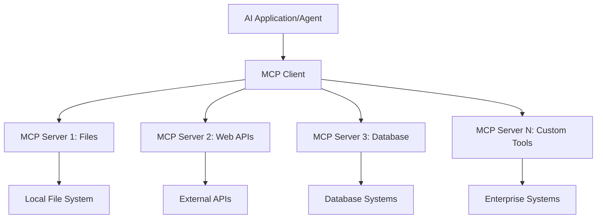

# 🌐 Module 2: MCP with AI Toolkit Fundamentals

[]()
[]()
[]()

## 📋 Mga Layunin sa Pagkatuto

Sa pagtatapos ng module na ito, magagawa mong:
- ✅ Maunawaan ang arkitektura at benepisyo ng Model Context Protocol (MCP)
- ✅ Tuklasin ang ecosystem ng MCP server ng Microsoft
- ✅ Isama ang mga MCP server gamit ang AI Toolkit Agent Builder
- ✅ Gumawa ng gumaganang browser automation agent gamit ang Playwright MCP
- ✅ I-configure at subukan ang mga MCP tool sa loob ng iyong mga agent
- ✅ I-export at i-deploy ang mga MCP-powered agent para sa production use

## 🎯 Pagtutuloy mula sa Module 1

Sa Module 1, natutunan natin ang mga pangunahing kaalaman sa AI Toolkit at nakagawa ng unang Python Agent. Ngayon, **palalakasin** natin ang iyong mga agent sa pamamagitan ng pagkonekta sa mga panlabas na tool at serbisyo gamit ang makabagong **Model Context Protocol (MCP)**.

Isipin ito bilang pag-upgrade mula sa simpleng calculator patungo sa isang buong computer — magkakaroon ang iyong AI agents ng kakayahang:
- 🌐 Mag-browse at makipag-ugnayan sa mga website
- 📁 Mag-access at mag-manipula ng mga file
- 🔧 Makipag-integrate sa mga enterprise system
- 📊 Magproseso ng real-time na data mula sa mga API

## 🧠 Pag-unawa sa Model Context Protocol (MCP)

### 🔍 Ano ang MCP?

Ang Model Context Protocol (MCP) ay ang **"USB-C para sa mga AI application"** — isang makabagong open standard na nag-uugnay sa mga Large Language Models (LLMs) sa mga panlabas na tool, pinagkukunan ng data, at serbisyo. Tulad ng USB-C na nag-alis ng kalituhan sa mga kable sa pamamagitan ng isang unibersal na konektor, nilulutas ng MCP ang komplikasyon sa AI integration gamit ang isang standardized na protocol.

### 🎯 Ang Problema na Nilulutas ng MCP

**Bago ang MCP:**
- 🔧 Custom integrations para sa bawat tool
- 🔄 Vendor lock-in gamit ang proprietary na solusyon  
- 🔒 Mga kahinaan sa seguridad mula sa mga ad-hoc na koneksyon
- ⏱️ Buwan ng development para sa mga simpleng integration

**Sa MCP:**
- ⚡ Plug-and-play na integrasyon ng mga tool
- 🔄 Vendor-agnostic na arkitektura
- 🛡️ Built-in na mga best practice sa seguridad
- 🚀 Ilang minuto lang para magdagdag ng bagong kakayahan

### 🏗️ Malalim na Pagsusuri sa Arkitektura ng MCP

Ang MCP ay sumusunod sa **client-server architecture** na lumilikha ng isang secure at scalable na ecosystem:



**🔧 Pangunahing Bahagi:**

| Bahagi | Papel | Mga Halimbawa |
|--------|-------|---------------|
| **MCP Hosts** | Mga aplikasyon na gumagamit ng MCP services | Claude Desktop, VS Code, AI Toolkit |
| **MCP Clients** | Protocol handlers (1:1 sa mga server) | Built-in sa host applications |
| **MCP Servers** | Nagbibigay ng kakayahan gamit ang standard protocol | Playwright, Files, Azure, GitHub |
| **Transport Layer** | Mga paraan ng komunikasyon | stdio, HTTP, WebSockets |

## 🏢 Ecosystem ng MCP Server ng Microsoft

Pinangungunahan ng Microsoft ang MCP ecosystem gamit ang komprehensibong suite ng mga enterprise-grade server na tumutugon sa mga totoong pangangailangan ng negosyo.

### 🌟 Tampok na Microsoft MCP Servers

#### 1. ☁️ Azure MCP Server
**🔗 Repository**: [azure/azure-mcp](https://github.com/azure/azure-mcp)  
**🎯 Layunin**: Komprehensibong pamamahala ng Azure resources na may AI integration

**✨ Pangunahing Tampok:**
- Declarative infrastructure provisioning
- Real-time na pagmamanman ng resources
- Mga rekomendasyon para sa cost optimization
- Pagsusuri ng pagsunod sa seguridad

**🚀 Mga Gamit:**
- Infrastructure-as-Code na may AI assistance
- Automated resource scaling
- Cloud cost optimization
- Automation ng DevOps workflow

#### 2. 📊 Microsoft Dataverse MCP
**📚 Dokumentasyon**: [Microsoft Dataverse Integration](https://go.microsoft.com/fwlink/?linkid=2320176)  
**🎯 Layunin**: Natural language interface para sa business data

**✨ Pangunahing Tampok:**
- Natural language na mga query sa database
- Pag-unawa sa business context
- Custom prompt templates
- Enterprise data governance

**🚀 Mga Gamit:**
- Business intelligence reporting
- Pagsusuri ng customer data
- Insights sa sales pipeline
- Mga query para sa compliance data

#### 3. 🌐 Playwright MCP Server
**🔗 Repository**: [microsoft/playwright-mcp](https://github.com/microsoft/playwright-mcp)  
**🎯 Layunin**: Browser automation at web interaction capabilities

**✨ Pangunahing Tampok:**
- Cross-browser automation (Chrome, Firefox, Safari)
- Intelligent na pagtukoy ng mga elemento
- Pagkuha ng screenshot at PDF generation
- Pagmamanman ng network traffic

**🚀 Mga Gamit:**
- Automated testing workflows
- Web scraping at data extraction
- UI/UX monitoring
- Automation ng competitive analysis

#### 4. 📁 Files MCP Server
**🔗 Repository**: [microsoft/files-mcp-server](https://github.com/microsoft/files-mcp-server)  
**🎯 Layunin**: Intelligent na operasyon sa file system

**✨ Pangunahing Tampok:**
- Declarative file management
- Content synchronization
- Version control integration
- Metadata extraction

**🚀 Mga Gamit:**
- Pamamahala ng dokumentasyon
- Organisasyon ng code repository
- Content publishing workflows
- Pag-handle ng data pipeline files

#### 5. 📝 MarkItDown MCP Server
**🔗 Repository**: [microsoft/markitdown](https://github.com/microsoft/markitdown)  
**🎯 Layunin**: Advanced na pagproseso at manipulasyon ng Markdown

**✨ Pangunahing Tampok:**
- Rich Markdown parsing
- Format conversion (MD ↔ HTML ↔ PDF)
- Pagsusuri ng istruktura ng nilalaman
- Template processing

**🚀 Mga Gamit:**
- Technical documentation workflows
- Content management systems
- Report generation
- Automation ng knowledge base

#### 6. 📈 Clarity MCP Server
**📦 Package**: [@microsoft/clarity-mcp-server](https://www.npmjs.com/package/@microsoft/clarity-mcp-server)  
**🎯 Layunin**: Web analytics at insights sa user behavior

**✨ Pangunahing Tampok:**
- Heatmap data analysis
- User session recordings
- Performance metrics
- Conversion funnel analysis

**🚀 Mga Gamit:**
- Website optimization
- Pananaliksik sa user experience
- A/B testing analysis
- Business intelligence dashboards

### 🌍 Community Ecosystem

Bukod sa mga server ng Microsoft, kabilang sa MCP ecosystem ang:
- **🐙 GitHub MCP**: Pamamahala ng repository at pagsusuri ng code
- **🗄️ Database MCPs**: Integrasyon sa PostgreSQL, MySQL, MongoDB
- **☁️ Cloud Provider MCPs**: Mga tool mula sa AWS, GCP, Digital Ocean
- **📧 Communication MCPs**: Integrasyon sa Slack, Teams, Email

## 🛠️ Hands-On Lab: Paggawa ng Browser Automation Agent

**🎯 Layunin ng Proyekto**: Gumawa ng intelligent browser automation agent gamit ang Playwright MCP server na kayang mag-navigate sa mga website, kumuha ng impormasyon, at magsagawa ng komplikadong web interactions.

### 🚀 Phase 1: Pagsisimula ng Agent

#### Hakbang 1: I-initialize ang Iyong Agent
1. **Buksan ang AI Toolkit Agent Builder**
2. **Gumawa ng Bagong Agent** gamit ang sumusunod na configuration:
   - **Pangalan**: `BrowserAgent`
   - **Model**: Piliin ang GPT-4o


### 🔧 Phase 2: MCP Integration Workflow

#### Hakbang 3: Magdagdag ng MCP Server Integration
1. **Pumunta sa Tools Section** sa Agent Builder
2. **I-click ang "Add Tool"** para buksan ang integration menu
3. **Piliin ang "MCP Server"** mula sa mga available na opsyon


**🔍 Pag-unawa sa Mga Uri ng Tool:**
- **Built-in Tools**: Pre-configured na mga function ng AI Toolkit
- **MCP Servers**: Mga panlabas na serbisyo na naka-integrate
- **Custom APIs**: Sariling mga service endpoint
- **Function Calling**: Direktang pag-access sa mga function ng model

#### Hakbang 4: Pagpili ng MCP Server
1. **Piliin ang opsyon na "MCP Server"** para magpatuloy  


2. **I-browse ang MCP Catalog** para tuklasin ang mga available na integrasyon  


### 🎮 Phase 3: Pag-configure ng Playwright MCP

#### Hakbang 5: Piliin at I-configure ang Playwright
1. **I-click ang "Use Featured MCP Servers"** para ma-access ang mga verified na server ng Microsoft
2. **Piliin ang "Playwright"** mula sa listahan ng mga tampok
3. **Tanggapin ang Default MCP ID** o i-customize para sa iyong environment


#### Hakbang 6: I-enable ang Mga Kakayahan ng Playwright
**🔑 Mahalagang Hakbang**: Piliin ang **LAHAT** ng mga available na Playwright methods para sa pinakamalawak na functionality


**🛠️ Mahahalagang Playwright Tools:**
- **Navigation**: `goto`, `goBack`, `goForward`, `reload`
- **Interaction**: `click`, `fill`, `press`, `hover`, `drag`
- **Extraction**: `textContent`, `innerHTML`, `getAttribute`
- **Validation**: `isVisible`, `isEnabled`, `waitForSelector`
- **Capture**: `screenshot`, `pdf`, `video`
- **Network**: `setExtraHTTPHeaders`, `route`, `waitForResponse`

#### Hakbang 7: Suriin ang Tagumpay ng Integrasyon
**✅ Mga Palatandaan ng Tagumpay:**
- Lahat ng tool ay lumalabas sa interface ng Agent Builder
- Walang error messages sa integration panel
- Status ng Playwright server ay "Connected"


**🔧 Pagsasaayos ng Karaniwang Problema:**
- **Connection Failed**: Suriin ang internet connection at firewall settings
- **Missing Tools**: Siguraduhing napili lahat ng kakayahan sa setup
- **Permission Errors**: Tiyaking may tamang system permissions ang VS Code

### 🎯 Phase 4: Advanced Prompt Engineering

#### Hakbang 8: Gumawa ng Matalinong System Prompts
Lumikha ng mga sopistikadong prompt na ginagamit ang buong kakayahan ng Playwright:

```markdown
# Web Automation Expert System Prompt

## Core Identity
You are an advanced web automation specialist with deep expertise in browser automation, web scraping, and user experience analysis. You have access to Playwright tools for comprehensive browser control.

## Capabilities & Approach
### Navigation Strategy
- Always start with screenshots to understand page layout
- Use semantic selectors (text content, labels) when possible
- Implement wait strategies for dynamic content
- Handle single-page applications (SPAs) effectively

### Error Handling
- Retry failed operations with exponential backoff
- Provide clear error descriptions and solutions
- Suggest alternative approaches when primary methods fail
- Always capture diagnostic screenshots on errors

### Data Extraction
- Extract structured data in JSON format when possible
- Provide confidence scores for extracted information
- Validate data completeness and accuracy
- Handle pagination and infinite scroll scenarios

### Reporting
- Include step-by-step execution logs
- Provide before/after screenshots for verification
- Suggest optimizations and alternative approaches
- Document any limitations or edge cases encountered

## Ethical Guidelines
- Respect robots.txt and rate limiting
- Avoid overloading target servers
- Only extract publicly available information
- Follow website terms of service
```

#### Hakbang 9: Gumawa ng Dynamic User Prompts
Disenyuhin ang mga prompt na nagpapakita ng iba't ibang kakayahan:

**🌐 Halimbawa ng Web Analysis:**
```markdown
Navigate to github.com/kinfey and provide a comprehensive analysis including:
1. Repository structure and organization
2. Recent activity and contribution patterns  
3. Documentation quality assessment
4. Technology stack identification
5. Community engagement metrics
6. Notable projects and their purposes

Include screenshots at key steps and provide actionable insights.
```


### 🚀 Phase 5: Pagpapatupad at Pagsubok

#### Hakbang 10: Patakbuhin ang Iyong Unang Automation
1. **I-click ang "Run"** para simulan ang automation sequence
2. **Subaybayan ang Real-time Execution**:
   - Awtomatikong magbubukas ang Chrome browser
   - Magna-navigate ang agent sa target na website
   - Kinukuha ang mga screenshot sa bawat mahalagang hakbang
   - Real-time na dumadaloy ang mga resulta ng pagsusuri


#### Hakbang 11: Suriin ang Mga Resulta at Insight
Balikan ang komprehensibong pagsusuri sa interface ng Agent Builder:


### 🌟 Phase 6: Advanced na Kakayahan at Deployment

#### Hakbang 12: I-export at I-deploy sa Production
Sinusuportahan ng Agent Builder ang iba't ibang deployment options:


## 🎓 Buod ng Module 2 at Mga Susunod na Hakbang

### 🏆 Nakamit: MCP Integration Master

**✅ Mga Natutunang Kasanayan:**
- [ ] Pag-unawa sa arkitektura at benepisyo ng MCP
- [ ] Pag-navigate sa MCP server ecosystem ng Microsoft
- [ ] Pagsasama ng Playwright MCP gamit ang AI Toolkit
- [ ] Paggawa ng sopistikadong browser automation agents
- [ ] Advanced prompt engineering para sa web automation

### 📚 Karagdagang Mga Mapagkukunan

- **🔗 MCP Specification**: [Official Protocol Documentation](https://modelcontextprotocol.io/)
- **🛠️ Playwright API**: [Complete Method Reference](https://playwright.dev/docs/api/class-playwright)
- **🏢 Microsoft MCP Servers**: [Enterprise Integration Guide](https://github.com/microsoft/mcp-servers)
- **🌍 Community Examples**: [MCP Server Gallery](https://github.com/modelcontextprotocol/servers)

**🎉 Congratulations!** Matagumpay mong na-master ang MCP integration at handa ka nang gumawa ng production-ready AI agents na may kakayahang gumamit ng mga panlabas na tool!

### 🔜 Magpatuloy sa Susunod na Module

Handa ka na bang i-level up ang iyong MCP skills? Magpatuloy sa **[Module 3: Advanced MCP Development with AI Toolkit](../lab3/README.md)** kung saan matututuhan mo kung paano:
- Gumawa ng sarili mong custom MCP servers
- I-configure at gamitin ang pinakabagong MCP Python SDK
- I-setup ang MCP Inspector para sa debugging
- Masterin ang advanced MCP server development workflows
- Gumawa ng Weather MCP Server mula sa simula

**Paalala**:  
Ang dokumentong ito ay isinalin gamit ang AI translation service na [Co-op Translator](https://github.com/Azure/co-op-translator). Bagamat nagsusumikap kami para sa katumpakan, pakatandaan na ang mga awtomatikong pagsasalin ay maaaring maglaman ng mga pagkakamali o di-tumpak na impormasyon. Ang orihinal na dokumento sa orihinal nitong wika ang dapat ituring na pangunahing sanggunian. Para sa mahahalagang impormasyon, inirerekomenda ang propesyonal na pagsasalin ng tao. Hindi kami mananagot sa anumang hindi pagkakaunawaan o maling interpretasyon na maaaring magmula sa paggamit ng pagsasaling ito.