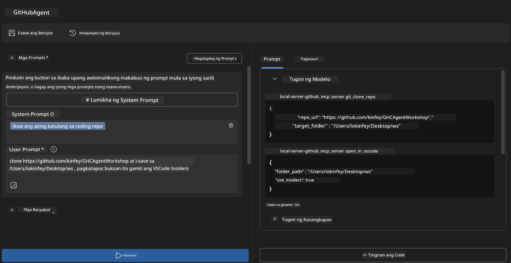
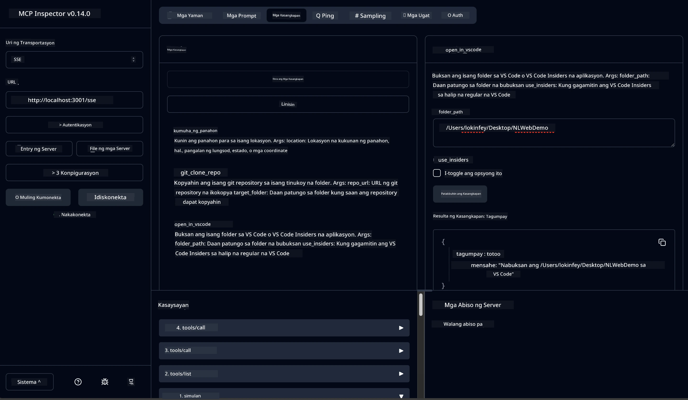

# 🐙 Module 4: Praktikal na Pag-develop ng MCP - Custom GitHub Clone Server


> **⚡ Mabilisang Simula:** Bumuo ng isang production-ready MCP server na nag-aautomat ng pag-clone ng GitHub repository at integrasyon ng VS Code sa loob lamang ng 30 minuto!

## 🎯 Mga Layunin sa Pagkatuto

Sa pagtatapos ng lab na ito, magagawa mong:

- ✅ Gumawa ng custom MCP server para sa mga totoong workflow sa pag-develop
- ✅ Ipatupad ang functionality ng pag-clone ng GitHub repository gamit ang MCP
- ✅ I-integrate ang mga custom MCP server sa VS Code at Agent Builder
- ✅ Gamitin ang GitHub Copilot Agent Mode kasama ang mga custom MCP tools
- ✅ Subukan at i-deploy ang mga custom MCP server sa mga production environment

## 📋 Mga Kinakailangan

- Nakumpleto ang Labs 1-3 (mga pundasyon ng MCP at advanced na pag-develop)
- Subscription sa GitHub Copilot ([may libreng signup](https://github.com/github-copilot/signup))
- VS Code na may AI Toolkit at GitHub Copilot extensions
- Nakainstall at naka-configure ang Git CLI

## 🏗️ Pangkalahatang-ideya ng Proyekto

### **Tunay na Hamon sa Pag-develop**
Bilang mga developer, madalas nating ginagamit ang GitHub para mag-clone ng repositories at buksan ito sa VS Code o VS Code Insiders. Ang prosesong manu-mano ay kinabibilangan ng:
1. Pagbukas ng terminal/command prompt
2. Pagpunta sa nais na direktoryo
3. Pagpapatakbo ng `git clone` na utos
4. Pagbukas ng VS Code sa cloned na direktoryo

**Ang solusyon ng aming MCP ay pinadadali itong maging isang matalinong utos lang!**

### **Ano ang Iyong Bubuuin**
Isang **GitHub Clone MCP Server** (`git_mcp_server`) na nagbibigay ng:

| Tampok | Deskripsyon | Benepisyo |
|---------|-------------|---------|
| 🔄 **Smart Repository Cloning** | Mag-clone ng GitHub repos na may validation | Awtomatikong error checking |
| 📁 **Matalinong Pamamahala ng Direktoryo** | Suriin at lumikha ng mga direktoryo nang ligtas | Naiiwasan ang pag-overwrite |
| 🚀 **Cross-Platform VS Code Integration** | Buksan ang mga proyekto sa VS Code/Insiders | Tuloy-tuloy na workflow |
| 🛡️ **Matibay na Paghawak ng Error** | Asikasuhin ang mga network, permiso, at path na isyu | Production-ready na pagiging maaasahan |

---

## 📖 Hakbang-hakbang na Pagpapatupad

### Hakbang 1: Gumawa ng GitHub Agent sa Agent Builder

1. **Buksan ang Agent Builder** sa pamamagitan ng AI Toolkit extension
2. **Gumawa ng bagong agent** gamit ang sumusunod na configuration:
   ```
   Agent Name: GitHubAgent
   ```

3. **I-initialize ang custom MCP server:**
   - Pumunta sa **Tools** → **Add Tool** → **MCP Server**
   - Piliin ang **"Create A new MCP Server"**
   - Pumili ng **Python template** para sa pinakamataas na flexible na paggamit
   - **Pangalan ng Server:** `git_mcp_server`

### Hakbang 2: I-configure ang GitHub Copilot Agent Mode

1. **Buksan ang GitHub Copilot** sa VS Code (Ctrl/Cmd + Shift + P → "GitHub Copilot: Open")
2. **Piliin ang Agent Model** sa Copilot interface
3. **Piliin ang Claude 3.7 model** para sa mas mahusay na reasoning capabilities
4. **I-enable ang MCP integration** para sa access ng tool

> **💡 Tip ng Propesyonal:** Nagbibigay ang Claude 3.7 ng mas mataas na pag-unawa sa mga development workflow at mga pattern ng error handling.

### Hakbang 3: Ipatupad ang Pangunahing Functionality ng MCP Server

**Gamitin ang sumusunod na detalyadong prompt kasama ang GitHub Copilot Agent Mode:**

```
Create two MCP tools with the following comprehensive requirements:

🔧 TOOL A: clone_repository
Requirements:
- Clone any GitHub repository to a specified local folder
- Return the absolute path of the successfully cloned project
- Implement comprehensive validation:
  ✓ Check if target directory already exists (return error if exists)
  ✓ Validate GitHub URL format (https://github.com/user/repo)
  ✓ Verify git command availability (prompt installation if missing)
  ✓ Handle network connectivity issues
  ✓ Provide clear error messages for all failure scenarios

🚀 TOOL B: open_in_vscode
Requirements:
- Open specified folder in VS Code or VS Code Insiders
- Cross-platform compatibility (Windows/Linux/macOS)
- Use direct application launch (not terminal commands)
- Auto-detect available VS Code installations
- Handle cases where VS Code is not installed
- Provide user-friendly error messages

Additional Requirements:
- Follow MCP 1.9.3 best practices
- Include proper type hints and documentation
- Implement logging for debugging purposes
- Add input validation for all parameters
- Include comprehensive error handling
```

### Hakbang 4: Subukan ang Iyong MCP Server

#### 4a. Subukan sa Agent Builder

1. **Ilunsad ang debug configuration** para sa Agent Builder
2. **I-configure ang iyong agent gamit ang system prompt na ito:**

```
SYSTEM_PROMPT:
You are my intelligent coding repository assistant. You help developers efficiently clone GitHub repositories and set up their development environment. Always provide clear feedback about operations and handle errors gracefully.
```

3. **Subukan gamit ang makatotohanang scenarios ng user:**

```
USER_PROMPT EXAMPLES:

Scenario : Basic Clone and Open
"Clone {Your GitHub Repo link such as https://github.com/kinfey/GHCAgentWorkshop
 } and save to {The global path you specify}, then open it with VS Code Insiders"
```



**Inaasahang Resulta:**
- ✅ Matagumpay na pag-clone kasama ang kumpirmasyon ng path
- ✅ Awtomatikong paglulunsad ng VS Code
- ✅ Malinaw na mga mensahe ng error para sa mga invalid na scenarios
- ✅ Maayos na paghawak sa mga edge cases

#### 4b. Subukan sa MCP Inspector




---


**🎉 Maligayang Pagbati!** Matagumpay mong nagawa ang isang praktikal at production-ready na MCP server na lumulutas sa mga tunay na hamon sa workflow ng pag-develop. Ipinapakita ng iyong custom GitHub clone server ang kapangyarihan ng MCP sa pag-aautomat at pagpapahusay ng produktibidad ng mga developer.

### 🏆 Mga Nakamit:
- ✅ **MCP Developer** - Nakagawa ng custom MCP server
- ✅ **Workflow Automator** - Pinadali ang mga proseso ng pag-develop  
- ✅ **Integration Expert** - Naka-konekta ng maraming development tools
- ✅ **Production Ready** - Nakabuo ng mga deployable na solusyon

---

## 🎓 Pagtatapos ng Workshop: Ang Iyong Paglalakbay sa Model Context Protocol

**Mahal na Kalahok sa Workshop,**

Maligayang pagdating sa pagtatapos ng apat na module ng Model Context Protocol workshop! Malayo na ang narating mo mula sa pag-unawa ng mga pangunahing konsepto ng AI Toolkit hanggang sa pagbuo ng production-ready MCP servers na lumulutas sa mga totoong hamon sa pag-develop.

### 🚀 Buod ng Iyong Daan sa Pagkatuto:

**[Module 1](../lab1/README.md)**: Nagsimula ka sa paggalugad ng pundasyon ng AI Toolkit, pagsubok ng mga modelo, at paggawa ng iyong unang AI agent.

**[Module 2](../lab2/README.md)**: Natutunan mo ang arkitektura ng MCP, nag-integrate ng Playwright MCP, at bumuo ng iyong unang browser automation agent.

**[Module 3](../lab3/README.md)**: Umangat ka sa pag-develop ng custom MCP servers gamit ang Weather MCP server at pinahusay ang paggamit ng mga debugging tools.

**[Module 4](../lab4/README.md)**: Inilapat mo na ngayon ang lahat upang bumuo ng isang praktikal na tool para sa pag-automate ng workflow ng GitHub repository.

### 🌟 Mga Na-master Mo:

- ✅ **AI Toolkit Ecosystem**: Mga modelo, agent, at mga pattern ng integrasyon
- ✅ **MCP Architecture**: Disenyo ng client-server, mga protocol sa transport, at seguridad
- ✅ **Mga Developer Tool**: Mula Playground hanggang Inspector hanggang sa production deployment
- ✅ **Custom Development**: Paggawa, pagsubok, at pag-deploy ng sarili mong MCP servers
- ✅ **Praktikal na Aplikasyon**: Paglutas sa mga totoong workflow challenges gamit ang AI

### 🔮 Ang Iyong Mga Susunod na Hakbang:

1. **Bumuo ng Sariling MCP Server**: I-apply ang mga kasanayang ito para i-automate ang iyong mga natatanging workflow  
2. **Sumali sa MCP Community**: Ibahagi ang iyong mga likha at matuto mula sa iba  
3. **Pag-aralan ang Advanced Integration**: Ikonekta ang MCP servers sa mga enterprise system  
4. **Mag-ambag sa Open Source**: Tumulong upang paunlarin ang MCP tooling at dokumentasyon

Tandaan, ang workshop na ito ay simula pa lamang. Ang ecosystem ng Model Context Protocol ay mabilis na umuunlad, at ngayon ay handa ka nang maging nangunguna sa mga AI-powered na development tools.

**Salamat sa iyong partisipasyon at dedikasyon sa pagkatuto!**

Umaasa kami na ang workshop na ito ay nagbigay inspirasyon ng mga ideya na magbabago sa paraan ng iyong pagbuo at pakikipag-ugnayan sa mga AI tool sa iyong paglalakbay sa pag-develop.

**Maligayang pag-coding!**

---

## Ano ang Susunod

Maligayang pagbati sa pagtatapos ng lahat ng labs sa Module 10!

- Balik sa: [Module 10 Overview](../README.md)
- Magpatuloy sa: [Module 11: MCP Server Hands-On Labs](../../11-MCPServerHandsOnLabs/README.md)

---

<!-- CO-OP TRANSLATOR DISCLAIMER START -->
**Pagsisiwalat**:  
Ang dokumentong ito ay isinalin gamit ang AI translation service na [Co-op Translator](https://github.com/Azure/co-op-translator). Bagamat nagsusumikap kami para sa katumpakan, pakitandaan na ang awtomatikong pagsasalin ay maaaring may mga pagkakamali o hindi pagkakatugma. Ang orihinal na dokumento sa kanyang orihinal na wika ang dapat ituring na pinagmulan ng katotohanan. Para sa mahahalagang impormasyon, inirerekomenda ang propesyonal na pagsasalin ng tao. Hindi kami mananagot sa anumang hindi pagkakaunawaan o maling interpretasyon na nagmula sa paggamit ng pagsasaling ito.
<!-- CO-OP TRANSLATOR DISCLAIMER END -->