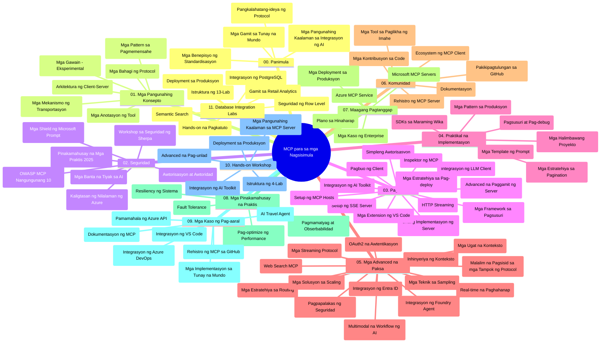

# Model Context Protocol (MCP) para sa mga Nagsisimula - Gabay sa Pag-aaral

Ang gabay na ito sa pag-aaral ay nagbibigay ng pangkalahatang-ideya ng estruktura at nilalaman ng repository para sa kurikulum na "Model Context Protocol (MCP) para sa mga Nagsisimula". Gamitin ang gabay na ito upang mas epektibong mag-navigate sa repository at lubos na mapakinabangan ang mga magagamit na resources.

## Pangkalahatang-ideya ng Repository

Ang Model Context Protocol (MCP) ay isang standardized na balangkas para sa mga interaksyon sa pagitan ng mga AI model at mga client application. Orihinal na nilikha ng Anthropic, ang MCP ay ngayon pinamamahalaan ng mas malawak na MCP community sa pamamagitan ng opisyal na GitHub organization. Ang repository na ito ay naglalaan ng isang komprehensibong kurikulum na may mga praktikal na halimbawa ng code sa C#, Java, JavaScript, Python, at TypeScript, na disenyo para sa mga AI developer, system architect, at software engineer.

## Visual Curriculum Map

## Estruktura ng Repository

Ang repository ay nakaayos sa labing-isang pangunahing seksyon, bawat isa ay nakatuon sa iba’t ibang aspeto ng MCP:

1. **Introduksyon (00-Introduction/)**
   - Pangkalahatang-ideya ng Model Context Protocol
   - Bakit mahalaga ang standardisasyon sa AI pipelines
   - Praktikal na mga kaso ng paggamit at mga benepisyo

2. **Pangunahing Konsepto (01-CoreConcepts/)**
   - Arkitektura ng client-server
   - Mga pangunahing sangkap ng protocol
   - Mga pattern ng pagmemensahe sa MCP

3. **Seguridad (02-Security/)**
   - Mga banta sa seguridad sa mga MCP-based na sistema
   - Pinakamahuhusay na kasanayan para sa pag-secure ng mga implementasyon
   - Mga estratehiya sa authentication at authorization
   - **Komprehensibong Dokumentasyon sa Seguridad**:
     - MCP Security Best Practices 2025
     - Azure Content Safety Implementation Guide
     - MCP Security Controls and Techniques
     - MCP Best Practices Quick Reference
   - **Mahahalagang Paksa sa Seguridad**:
     - Prompt injection at tool poisoning attacks
     - Session hijacking at confused deputy problems
     - Token passthrough vulnerabilities
     - Labis na permiso at access control
     - Supply chain security para sa mga AI components
     - Microsoft Prompt Shields integration

4. **Pagsisimula (03-GettingStarted/)**
   - Pagsasaayos at konfigurasyon ng kapaligiran
   - Paglikha ng mga pangunahing MCP server at client
   - Integrasyon sa mga umiiral na application
   - Kasama ang mga seksyon para sa:
     - Unang implementasyon ng server
     - Pagbuo ng client
     - Integrasyon ng LLM client
     - Integrasyon ng VS Code
     - Server-Sent Events (SSE) server
     - Advanced na paggamit ng server
     - HTTP streaming
     - AI Toolkit integration
     - Mga estratehiya sa pagsubok
     - Mga gabay sa deployment

5. **Praktikal na Implementasyon (04-PracticalImplementation/)**
   - Paggamit ng SDK sa iba’t ibang programming languages
   - Teknik sa debugging, testing, at validation
   - Paglikha ng reusable prompt templates at workflows
   - Mga sample na proyekto na may mga halimbawa ng implementasyon

6. **Mga Advanced na Paksa (05-AdvancedTopics/)**
   - Mga teknik sa context engineering
   - Foundry agent integration
   - Multi-modal AI workflows 
   - Mga demo ng OAuth2 authentication
   - Kakayahan sa real-time search
   - Real-time streaming
   - Implementasyon ng root contexts
   - Mga estratehiya sa routing
   - Sampling techniques
   - Mga paraan ng scaling
   - Mga konsiderasyon sa seguridad
   - Entra ID security integration
   - Web search integration

7. **Kontribusyon ng Komunidad (06-CommunityContributions/)**
   - Paano mag-ambag ng code at dokumentasyon
   - Pakikipagtulungan sa pamamagitan ng GitHub
   - Mga pagpapahusay at feedback na pinamumunuan ng komunidad
   - Paggamit ng iba’t ibang MCP clients (Claude Desktop, Cline, VSCode)
   - Pagtatrabaho sa mga popular na MCP server kabilang ang image generation

8. **Mga Aral mula sa Maagang Pagtanggap (07-LessonsfromEarlyAdoption/)**
   - Mga totoong implementasyon at kwento ng tagumpay
   - Pagbuo at pag-deploy ng mga solusyon batay sa MCP
   - Mga uso at roadmap sa hinaharap
   - **Microsoft MCP Servers Guide**: Komprehensibong gabay sa 10 production-ready Microsoft MCP server kabilang ang:
     - Microsoft Learn Docs MCP Server
     - Azure MCP Server (15+ specialized connectors)
     - GitHub MCP Server
     - Azure DevOps MCP Server
     - MarkItDown MCP Server
     - SQL Server MCP Server
     - Playwright MCP Server
     - Dev Box MCP Server
     - Azure AI Foundry MCP Server
     - Microsoft 365 Agents Toolkit MCP Server

9. **Pinakamahuhusay na Kasanayan (08-BestPractices/)**
   - Pag-tune ng performance at optimization
   - Disenyo ng fault-tolerant na MCP systems
   - Mga estratehiya sa pagsubok at resilience

10. **Mga Kaso ng Pag-aaral (09-CaseStudy/)**
    - **Pitong komprehensibong kaso ng pag-aaral** na nagpapakita ng kakayahan ng MCP sa iba’t ibang senaryo:
    - **Azure AI Travel Agents**: Multi-agent orchestration gamit ang Azure OpenAI at AI Search
    - **Integrasyon ng Azure DevOps**: Automasyon ng workflow gamit ang mga updates mula sa YouTube data
    - **Real-Time Documentation Retrieval**: Python console client na may streaming HTTP
    - **Interactive Study Plan Generator**: Chainlit web app na may conversational AI
    - **In-Editor Documentation**: Integrasyon ng VS Code at GitHub Copilot workflows
    - **Azure API Management**: Enterprise API integration at paggawa ng MCP server
    - **GitHub MCP Registry**: Ecosystem development at platform para sa agentic integration
    - Mga halimbawa ng implementasyon mula enterprise integration, produktibidad ng developer, at ecosystem development

11. **Hands-on Workshop (10-StreamliningAIWorkflowsBuildingAnMCPServerWithAIToolkit/)**
    - Komprehensibong hands-on workshop na pinagsasama ang MCP at AI Toolkit
    - Pagbuo ng matatalinong aplikasyon na nag-uugnay sa AI models at mga totoong tools
    - Praktikal na mga module na sumasaklaw sa mga pundasyon, custom server development, at mga estratehiya sa production deployment
    - **Estruktura ng Lab**:
      - Lab 1: MCP Server Fundamentals
      - Lab 2: Advanced MCP Server Development
      - Lab 3: AI Toolkit Integration
      - Lab 4: Production Deployment and Scaling
    - Paraan ng pagkatuto na batay sa lab na may hakbang-hakbang na mga tagubilin

12. **MCP Server Database Integration Labs (11-MCPServerHandsOnLabs/)**
    - **Komprehensibong 13-lab na landas ng pagkatuto** para sa pagbuo ng production-ready MCP server na may PostgreSQL integration
    - **Real-world retail analytics implementation** gamit ang Zava Retail use case
    - **Pattern na pang-enterprise** kasama ang Row Level Security (RLS), semantic search, at multi-tenant data access
    - **Kumpletong Estruktura ng Lab**:
      - **Labs 00-03: Mga Pundasyon** - Introduksyon, Arkitektura, Seguridad, Pagsasaayos ng Kapaligiran
      - **Labs 04-06: Pagbuo ng MCP Server** - Database Design, MCP Server Implementation, Tool Development
      - **Labs 07-09: Mga Advanced na Tampok** - Semantic Search, Testing & Debugging, VS Code Integration
      - **Labs 10-12: Production at Pinakamahuhusay na Kasanayan** - Deployment, Monitoring, Optimization
    - **Mga Teknolohiya na Saklaw**: FastMCP framework, PostgreSQL, Azure OpenAI, Azure Container Apps, Application Insights
    - **Mga Kinalabasan ng Pagkatuto**: Production-ready MCP server, mga pattern ng database integration, AI-powered analytics, seguridad sa enterprise

## Karagdagang Mga Resources

Kasama sa repository ang mga sumusuportang resources:

- **Folder ng mga Larawan**: Naglalaman ng mga diagram at ilustrasyon na ginamit sa buong kurikulum
- **Mga Salin**: Suporta sa iba't ibang wika na may automated na pagsasalin ng dokumentasyon
- **Opisyal na Mga MCP Resources**:
  - [MCP Documentation](https://modelcontextprotocol.io/)
  - [MCP Specification](https://spec.modelcontextprotocol.io/)
  - [MCP GitHub Repository](https://github.com/modelcontextprotocol)

## Paano Gamitin ang Repository na Ito

1. **Sunod-sunod na Pag-aaral**: Sundan ang mga kabanata nang magkakasunod (00 hanggang 11) para sa isang estrukturadong karanasan sa pagkatuto.
2. **Tumutok sa Isang Wika**: Kung interesado ka sa isang partikular na programming language, eksplorahin ang mga samples directories para sa mga implementasyon sa napili mong wika.
3. **Praktikal na Implementasyon**: Magsimula sa seksyong "Getting Started" upang i-set up ang iyong kapaligiran at gumawa ng unang MCP server at client.
4. **Mas Malalim na Eksplorasyon**: Kapag komportable ka na sa mga batayan, sumisid sa mga advanced na paksa upang palawakin ang iyong kaalaman.
5. **Pakikipag-ugnayan sa Komunidad**: Sumali sa MCP community sa pamamagitan ng mga diskusyon sa GitHub at mga Discord channel para makipag-ugnayan sa mga eksperto at kapwa developer.

## Mga MCP Client at Tools

Tinatalakay ng kurikulum ang iba't ibang MCP client at tools:

1. **Opisyal na Client**:
   - Visual Studio Code 
   - MCP sa Visual Studio Code
   - Claude Desktop
   - Claude sa VSCode 
   - Claude API

2. **Client mula sa Komunidad**:
   - Cline (base sa terminal)
   - Cursor (code editor)
   - ChatMCP
   - Windsurf

3. **Mga MCP Management Tools**:
   - MCP CLI
   - MCP Manager
   - MCP Linker
   - MCP Router

## Mga Popular na MCP Server

Ipinapakilala ng repository ang iba't ibang MCP server, kabilang ang:

1. **Opisyal na Microsoft MCP Server**:
   - Microsoft Learn Docs MCP Server
   - Azure MCP Server (15+ specialized connectors)
   - GitHub MCP Server
   - Azure DevOps MCP Server
   - MarkItDown MCP Server
   - SQL Server MCP Server
   - Playwright MCP Server
   - Dev Box MCP Server
   - Azure AI Foundry MCP Server
   - Microsoft 365 Agents Toolkit MCP Server

2. **Opisyal na Reference Servers**:
   - Filesystem
   - Fetch
   - Memory
   - Sequential Thinking

3. **Image Generation**:
   - Azure OpenAI DALL-E 3
   - Stable Diffusion WebUI
   - Replicate

4. **Mga Development Tools**:
   - Git MCP
   - Terminal Control
   - Code Assistant

5. **Mga Specialized Server**:
   - Salesforce
   - Microsoft Teams
   - Jira & Confluence

## Pag-aambag

Tinanggap ng repository na ito ang mga kontribusyon mula sa komunidad. Tingnan ang seksyong Community Contributions para sa gabay kung paano epektibong makapag-ambag sa MCP ecosystem.

----

*Ang gabay na ito sa pag-aaral ay huling na-update noong Pebrero 5, 2026, na sumasalamin sa pinakabagong MCP Specification 2025-11-25 at nagbibigay ng pangkalahatang-ideya ng repository hanggang sa petsang iyon. Maaring mag-update ang nilalaman ng repository pagkatapos ng petsang ito.*

---

<!-- CO-OP TRANSLATOR DISCLAIMER START -->
**Paunawa**:  
Ang dokumentong ito ay isinalin gamit ang AI na serbisyo sa pagsasalin na [Co-op Translator](https://github.com/Azure/co-op-translator). Bagamat nagsusumikap kami na maging tumpak, pakatandaan na ang awtomatikong pagsasalin ay maaaring maglaman ng mga pagkakamali o hindi pagkakatugma. Ang orihinal na dokumento sa orihinal nitong wika ang dapat ituring na pangunahing sanggunian. Para sa mahahalagang impormasyon, ipinapayo ang propesyonal na pagsasalin ng tao. Hindi kami mananagot sa anumang maling pagkaunawa o maling interpretasyon na maaaring magmula sa paggamit ng pagsasaling ito.
<!-- CO-OP TRANSLATOR DISCLAIMER END -->