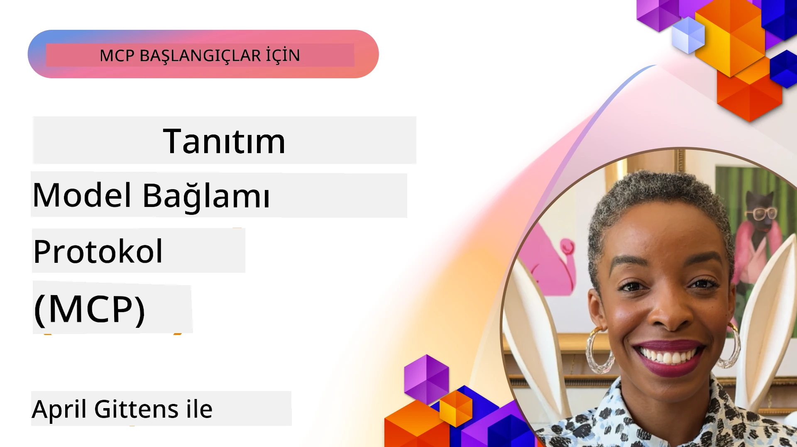
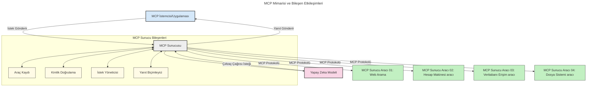

# Model Context Protocol (MCP) Tanıtımı: Ölçeklenebilir Yapay Zeka Uygulamaları İçin Neden Önemlidir?

[](https://youtu.be/agBbdiOPLQA)

_(Bu dersin videosunu izlemek için yukarıdaki resme tıklayın)_

Üretken yapay zeka uygulamaları, kullanıcının doğal dil komutları ile uygulama ile etkileşime girmesine genellikle izin verdikleri için büyük bir ilerleme sağlar. Ancak, bu tür uygulamalara daha fazla zaman ve kaynak yatırıldıkça, işlevsellikleri ve kaynakları kolayca entegre edebildiğinizden emin olmak istersiniz; böylece uygulamanızın genişletilmesi kolay olur, birden fazla modelin kullanılmasını destekleyebilir ve çeşitli model inceliklerini yönetebilir. Özetle, Gen AI uygulamaları oluşturmak başlangıçta kolaydır, ancak büyüdükçe ve daha karmaşık hale geldikçe bir mimari tanımlamaya başlamanız gerekir ve muhtemelen uygulamalarınızın tutarlı bir şekilde inşa edilmesini sağlamak için bir standa dayanmanız gerekir. MCP, işleri düzenlemek ve bir standart sağlamak için burada devreye girer.

---

## **🔍 Model Context Protocol (MCP) Nedir?**

**Model Context Protocol (MCP)**, Büyük Dil Modellerinin (LLM'ler) dış araçlar, API'lar ve veri kaynaklarıyla sorunsuz etkileşim kurmasını sağlayan **açık, standartlaştırılmış bir arayüzdür**. AI model fonksiyonelliğini eğitim verilerinin ötesine genişleten tutarlı bir mimari sunar ve daha akıllı, ölçeklenebilir ve daha duyarlı AI sistemlerine olanak tanır.

---

## **🎯 AI'da Standartlaşmanın Önemi**

Üretken yapay zeka uygulamaları karmaşıklaştıkça, **ölçeklenebilirlik, genişletilebilirlik, sürdürülebilirlik** ve **tedarikçi bağlamadan kaçınma** gibi özellikleri garanti eden standartları benimsemek önemlidir. MCP bu ihtiyaçları şu şekilde karşılar:

- Model ve araç entegrasyonlarını birleştirme
- Kırılgan, tek seferlik özel çözümleri azaltma
- Farklı tedarikçilerden birçok modelin aynı ekosistemde bir arada bulunmasına izin verme

**Not:** MCP kendini açık bir standart olarak tanımlasa da, IEEE, IETF, W3C, ISO veya başka herhangi bir standart kurumu tarafından standartlaştırılması yönünde bir plan yoktur.

---

## **📚 Öğrenme Hedefleri**

Bu makalenin sonunda şunları yapabileceksiniz:

- **Model Context Protocol (MCP)**'yi ve kullanım durumlarını tanımlamak
- MCP’nin model-aracı iletişimini nasıl standartlaştırdığını anlamak
- MCP mimarisinin temel bileşenlerini tanımlamak
- MCP’nin kurumsal ve geliştirme bağlamlarındaki gerçek dünya uygulamalarını keşfetmek

---

## **💡 Model Context Protocol (MCP) Neden Devrim Niteliğindedir?**

### **🔗 MCP, AI Etkileşimlerindeki Parçalanmayı Çözüyor**

MCP öncesi, modelleri araçlarla entegre etmek için:

- Her araç-model çifti için özel kod yazılması gerekiyordu
- Her tedarikçi için standart dışı API’lar kullanılıyordu
- Güncellemeler nedeniyle sık sık kopmalar yaşanıyordu
- Daha fazla araçla ölçeklenebilirlik zayıftı

### **✅ MCP Standartlaştırmasının Faydaları**

| **Fayda**               | **Açıklama**                                                                 |
|-------------------------|-------------------------------------------------------------------------------|
| Birlikte Çalışabilirlik | LLM’ler farklı tedarikçilerin araçları ile sorunsuz çalışır                  |
| Tutarlılık              | Platformlar ve araçlar arasında bir tür davranış birliği sağlanır             |
| Yeniden Kullanılabilirlik | Bir kez oluşturulan araçlar projeler ve sistemler arasında kullanılabilir   |
| Hızlandırılmış Geliştirme | Standart, tak-çalıştır arayüzler kullanılarak geliştirme süresi kısaltılır    |

---

## **🧱 MCP Mimarisine Yüksek Seviyeden Bakış**

MCP, **istemci-sunucu modeli** takip eder ve:

- **MCP Host’lar** AI modellerini çalıştırır
- **MCP İstemcileri** istek başlatır
- **MCP Sunucuları** bağlam, araçlar ve kabiliyetler sağlar

### **Temel Bileşenler:**

- **Kaynaklar** – Modeller için statik veya dinamik veriler  
- **İstemdedveleri** – Yönlendirilmiş üretim için önceden tanımlı iş akışları  
- **Araçlar** – Arama, hesaplama gibi çalıştırılabilir fonksiyonlar  
- **Örnekleme** – Yinelemeli etkileşimlerle ajan davranışı
- **Talep Etme** – Sunucu tarafından başlatılan kullanıcı girdisi istekleri
- **Kökler** – Sunucu erişim kontrolü için dosya sistemi sınırları

### **Protokol Mimarisi:**

MCP, iki katmanlı bir mimari kullanır:
- **Veri Katmanı**: JSON-RPC 2.0 tabanlı iletişim, yaşam döngüsü yönetimi ve temel yapılar
- **Taşıma Katmanı**: STDIO (yerel) ve SSE destekli Streamable HTTP (uzak) iletişim kanalları

---

## MCP Sunucuları Nasıl Çalışır

MCP sunucuları şu şekilde çalışır:

- **İstek Akışı**:
    1. Bir istek son kullanıcı veya onun adına hareket eden yazılım tarafından başlatılır.
    2. **MCP İstemcisi**, yapay zeka modeli runtime’ını yöneten **MCP Host**'a isteği gönderir.
    3. **AI Modeli**, kullanıcı komutunu alır ve dış araçlara veya verilere erişim için bir veya daha fazla araç çağrısı yapabilir.
    4. **MCP Host**, modelin kendisi değil, uygun **MCP Sunucuları** ile standart protokolü kullanarak iletişim kurar.
- **MCP Host İşlevselliği**:
    - **Araç Kaydı**: Mevcut araçların ve özelliklerinin kataloğunu tutar.
    - **Kimlik Doğrulama**: Araç erişim izinlerini doğrular.
    - **İstek İşleyici**: Modelden gelen araç isteklerini işler.
    - **Yanıt Biçimlendirici**: Araç çıktısını modelin anlayabileceği formata dönüştürür.
- **MCP Sunucu Yürütmesi**:
    - **MCP Host**, araç çağrılarını bir veya daha fazla **MCP Sunucusuna** yönlendirir ve bunlar özel fonksiyonları (örneğin arama, hesaplama, veri tabanı sorguları) sunar.
    - **MCP Sunucuları** işlemlerini yapar ve sonuçları **MCP Host**’a tutarlı bir formatta geri döner.
    - **MCP Host**, bu sonuçları biçimlendirir ve **AI Modeli**’ne iletir.
- **Yanıt Tamamlanması**:
    - **AI Modeli**, araç çıktısını nihai yanıta dahil eder.
    - **MCP Host**, bu yanıtı **MCP İstemcisi**’ne gönderir ve bu da son kullanıcıya veya çağıran yazılıma iletir.

    


## 👨‍💻 MCP Sunucusu Nasıl Kurulur (Örneklerle)

MCP sunucuları, LLM yeteneklerini veri ve fonksiyonellik sağlayarak genişletmenizi sağlar.

Denemeye hazır mısınız? İşte farklı dillerde/stacklerde basit MCP sunucuları oluşturmak için dil ve/veya platform spesifik SDK’lar ve örnekler:

- **Python SDK**: https://github.com/modelcontextprotocol/python-sdk

- **TypeScript SDK**: https://github.com/modelcontextprotocol/typescript-sdk

- **Java SDK**: https://github.com/modelcontextprotocol/java-sdk

- **C#/.NET SDK**: https://github.com/modelcontextprotocol/csharp-sdk


## 🌍 MCP’nin Gerçek Dünya Kullanım Senaryoları

MCP, yapay zeka kapasitelerini genişleterek birçok uygulamaya olanak tanır:

| **Uygulama**                 | **Açıklama**                                                                 |
|-----------------------------|-------------------------------------------------------------------------------|
| Kurumsal Veri Entegrasyonu  | LLM’leri veri tabanlarına, CRM’lere veya dahili araçlara bağlama             |
| Ajanik AI Sistemleri         | Özerk ajanlara araç erişimi ve karar alma iş akışları sağlama                  |
| Çok Modlu Uygulamalar        | Metin, görüntü ve ses araçlarını tek bir birleşik AI uygulamasında birleştirme|
| Gerçek Zamanlı Veri Entegrasyonu | Canlı veriyi AI etkileşimlerine getirme, daha doğru ve güncel çıktılar sağlar |

### 🧠 MCP = AI Etkileşimleri İçin Evrensel Standart

Model Context Protocol (MCP), USB-C’nin cihazlar için fiziksel bağlantıları standartlaştırması gibi AI etkileşimleri için evrensel bir standart işlevi görür. AI dünyasında MCP, modellerin (istemciler) dış araçlar ve veri sağlayıcıları (sunucular) ile sorunsuz entegrasyonunu sağlayan tutarlı bir arayüz sunar. Bu, her API veya veri kaynağı için çeşitli, özel protokollere ihtiyaç duyulmasını ortadan kaldırır.

MCP altında, MCP uyumlu bir araç (MCP sunucusu olarak adlandırılır) birleşik bir standardı izler. Bu sunucular sundukları araçları veya eylemleri listeleyebilir ve AI ajanı tarafından istendiğinde bu eylemleri gerçekleştirebilir. MCP’yi destekleyen AI ajan platformları, sunuculardaki mevcut araçları keşfedebilir ve bu standart protokol aracılığıyla çağırabilir.

### 💡 Bilgiye Erişimi Kolaylaştırır

Araçlar sunmanın ötesinde, MCP bilgiye erişimi de kolaylaştırır. Uygulamaların büyük dil modellerine (LLM) bağlam sağlamasına olanak tanır ve onları çeşitli veri kaynaklarına bağlar. Örneğin, bir MCP sunucusu bir şirketin belge deposunu temsil edebilir; böylece ajanlar ihtiyaç duyduklarında ilgili bilgileri alabilir. Başka bir sunucu, e-posta göndermek veya kayıtları güncellemek gibi belirli eylemleri gerçekleştirir. Ajan açısından bunlar sadece kullanılabilecek araçlardır — bazı araçlar veri (bilgi bağlamı) dönerken, diğerleri işlem yapar. MCP her ikisini de etkin bir şekilde yönetir.

Bir ajan MCP sunucusuna bağlandığında, sunucunun mevcut yeteneklerini ve erişilebilir verilerini standart bir formatla otomatik olarak öğrenir. Bu standartlaştırma dinamik araç kullanılabilirliği sağlar. Örneğin, ajan sistemine yeni bir MCP sunucusu eklemek, fonksiyonlarının hemen kullanılabilir hale gelmesini sağlar; bu, ajan talimatlarında ek özelleştirme gerektirmez.

Bu sadeleştirilmiş entegrasyon, aşağıdaki diyagramda gösterilen iş akışına uygun olup, sunucuların hem araçları hem de bilgiyi sağlayarak sistemler arasında sorunsuz işbirliğini garanti eder.

### 👉 Örnek: Ölçeklenebilir Ajan Çözümü

```mermaid
---
title: MCP ile Ölçeklenebilir Ajan Çözümü
description: Bir kullanıcının birden çok MCP sunucusuna bağlanan bir LLM ile nasıl etkileşime geçtiğini, her sunucunun hem bilgi hem de araç sağladığını gösteren, ölçeklenebilir bir yapay zeka sistem mimarisini açıklayan bir diagram
---
graph TD
    User -->|İstek| LLM
    LLM -->|Yanıt| User
    LLM -->|MCP| ServerA
    LLM -->|MCP| ServerB
    ServerA -->|Evrensel bağlayıcı| ServerB
    ServerA --> KnowledgeA
    ServerA --> ToolsA
    ServerB --> KnowledgeB
    ServerB --> ToolsB

    subgraph Server A
        KnowledgeA[Bilgi]
        ToolsA[Araçlar]
    end

    subgraph Server B
        KnowledgeB[Bilgi]
        ToolsB[Araçlar]
    end
```Evrensel Bağlayıcı, MCP sunucularının birbirleriyle iletişim kurmasını ve kabiliyetlerini paylaşmasını sağlar; böylece ServerA görevi ServerB’ye devredebilir veya onun araçlarına ve bilgisine erişebilir. Bu, araçların ve verilerin sunucular arasında federasyonunu sağlar ve ölçeklenebilir, modüler ajan mimarilerini destekler. MCP araç açıklamasını standartlaştırdığı için, ajanlar sert kodlanmış entegrasyonlar olmadan sunucular arasında dinamik olarak araç keşfedebilir ve istekleri yönlendirebilir.

Araç ve bilgi federasyonu: Araçlar ve verilere sunucular arasında erişim sağlanabilir, böylece daha ölçeklenebilir ve modüler ajanik mimariler mümkün olur.

### 🔄 MCP'nin Gelişmiş Senaryoları: İstemci Tarafı LLM Entegrasyonu

Temel MCP mimarisinin ötesinde, hem istemci hem sunucunun LLM içerdiği daha gelişmiş senaryolar bulunmaktadır; bu da daha sofistike etkileşimlere olanak tanır. Aşağıdaki diyagramda, **İstemci Uygulaması**, LLM tarafından kullanılabilen bir dizi MCP aracına sahip bir IDE olabilir:

```mermaid
---
title: Gelişmiş MCP Senaryoları ile İstemci-Sunucu LLM Entegrasyonu
description: Kullanıcı, istemci uygulama, istemci LLM, çoklu MCP sunucuları ve sunucu LLM arasında ayrıntılı etkileşim akışını gösteren bir sıra diyagramı, araç keşfi, kullanıcı etkileşimi, doğrudan araç çağrısı ve özellik müzakeresi aşamalarını tasvir ediyor
---
sequenceDiagram
    autonumber
    actor User as 👤 Kullanıcı
    participant ClientApp as 🖥️ İstemci Uygulama
    participant ClientLLM as 🧠 İstemci LLM
    participant Server1 as 🔧 MCP Sunucu 1
    participant Server2 as 📚 MCP Sunucu 2
    participant ServerLLM as 🤖 Sunucu LLM
    
    %% Keşif Aşaması
    rect rgb(220, 240, 255)
        Note over ClientApp, Server2: ARAÇ KEŞİF AŞAMASI
        ClientApp->>+Server1: Mevcut araçlar/kaynaklar iste
        Server1-->>-ClientApp: Araç listesini döndür (JSON)
        ClientApp->>+Server2: Mevcut araçlar/kaynaklar iste
        Server2-->>-ClientApp: Araç listesini döndür (JSON)
        Note right of ClientApp: Kombine araç<br/>kataloğunu yerelde sakla
    end
    
    %% Kullanıcı Etkileşimi
    rect rgb(255, 240, 220)
        Note over User, ClientLLM: KULLANICI ETKİLEŞİM AŞAMASI
        User->>+ClientApp: Doğal dil istemi gir
        ClientApp->>+ClientLLM: İstemi + araç kataloğunu ilet
        ClientLLM->>-ClientLLM: İstemi analiz et ve araçları seç
    end
    
    %% Senaryo A: Doğrudan Araç Çağrısı
    alt Doğrudan Araç Çağrısı
        rect rgb(220, 255, 220)
            Note over ClientApp, Server1: SENARYO A: DOĞRUDAN ARAÇ ÇAĞRISI
            ClientLLM->>+ClientApp: Araç yürütme isteği
            ClientApp->>+Server1: Belirli aracı çalıştır
            Server1-->>-ClientApp: Sonuçları döndür
            ClientApp->>+ClientLLM: Sonuçları işle
            ClientLLM-->>-ClientApp: Yanıt oluştur
            ClientApp-->>-User: Nihai cevabı göster
        end
    
    %% Senaryo B: Özellik Müzakeresi (VS Code tarzı)
    else Özellik Müzakeresi (VS Code tarzı)
        rect rgb(255, 220, 220)
            Note over ClientApp, ServerLLM: SENARYO B: ÖZELLİK MÜZAKERESİ
            ClientLLM->>+ClientApp: Gereken yetenekleri belirle
            ClientApp->>+Server2: Özellikler/yetenekler üzerinde müzakere et
            Server2->>+ServerLLM: Ek bağlam iste
            ServerLLM-->>-Server2: Bağlam sun
            Server2-->>-ClientApp: Mevcut özellikleri döndür
            ClientApp->>+Server2: Müzakere edilen araçları çağır
            Server2-->>-ClientApp: Sonuçları döndür
            ClientApp->>+ClientLLM: Sonuçları işle
            ClientLLM-->>-ClientApp: Yanıt oluştur
            ClientApp-->>-User: Nihai cevabı göster
        end
    end
```
## 🔐 MCP’nin Pratik Faydaları

MCP kullanımının pratik faydaları şunlardır:

- **Güncellik**: Modeller eğitim verilerinin ötesinde güncel bilgilere erişebilir
- **Kapasite Genişletme**: Modeller, eğitim almadıkları görevler için uzmanlaşmış araçlardan faydalanabilir
- **Halüsinasyonların Azalması**: Dış veri kaynakları gerçek bilgi temeli sağlar
- **Gizlilik**: Hassas veriler istemlerde gömülü olmak yerine güvenli ortamlarda kalabilir

## 📌 Temel Sonuçlar

MCP kullanımı için temel çıkarımlar:

- **MCP**, yapay zeka modellerinin araçlar ve verilerle nasıl etkileştiğini standartlaştırır
- **Genişletilebilirlik, tutarlılık ve birlikte çalışabilirliği** teşvik eder
- MCP, geliştirme süresini kısaltmaya, güvenilirliği artırmaya ve model yeteneklerini genişletmeye yardımcı olur
- İstemci-sunucu mimarisi, esnek ve genişletilebilir yapay zeka uygulamalarını mümkün kılar

## 🧠 Alıştırma

Kendi oluşturmak istediğiniz bir yapay zeka uygulamasını düşünün.

- Hangi **dış araçlar veya veriler** onun yeteneklerini artırabilir?
- MCP entegrasyonu nasıl **daha basit ve güvenilir** hale getirebilir?

## Ek Kaynaklar

- [MCP GitHub Deposu](https://github.com/modelcontextprotocol)


## Sonraki Bölüm

Sonraki: [Bölüm 1: Temel Kavramlar](../01-CoreConcepts/README.md)

---

<!-- CO-OP TRANSLATOR DISCLAIMER START -->
**Feragatname**:  
Bu belge, AI çeviri servisi [Co-op Translator](https://github.com/Azure/co-op-translator) kullanılarak çevrilmiştir. Doğruluk için çaba gösterilse de, otomatik çevirilerin hatalar veya yanlışlıklar içerebileceğini lütfen unutmayın. Orijinal belge, orijinal dilinde yetkili kaynak olarak kabul edilmelidir. Kritik bilgiler için profesyonel insan çevirisi önerilir. Bu çevirinin kullanımı sonucunda ortaya çıkabilecek yanlış anlaşılmalardan veya yorum hatalarından sorumlu değiliz.
<!-- CO-OP TRANSLATOR DISCLAIMER END -->