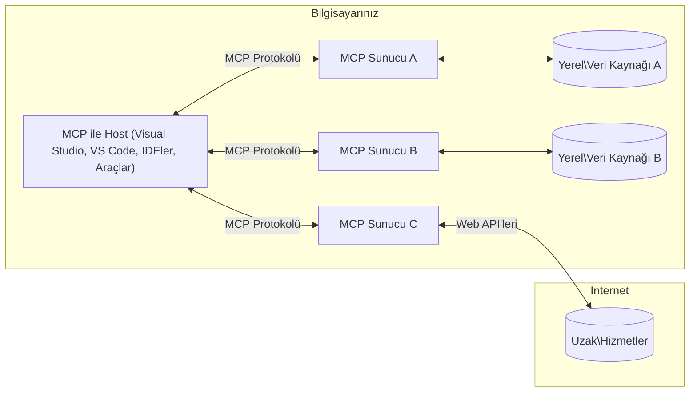

# MCP Temel Kavramları: AI Entegrasyonu İçin Model Bağlam Protokolü'nü Ustaca Kullanmak

[](https://youtu.be/earDzWGtE84)

_(Bu dersin videosunu izlemek için yukarıdaki resme tıklayın)_

[Model Bağlam Protokolü (MCP)](https://github.com/modelcontextprotocol), Büyük Dil Modelleri (LLM'ler) ile harici araçlar, uygulamalar ve veri kaynakları arasındaki iletişimi optimize eden güçlü, standartlaştırılmış bir çerçevedir.  
Bu rehberde MCP'nin temel kavramlarını öğreneceksiniz. İstemci-sunucu mimarisi, temel bileşenleri, iletişim mekanizmaları ve uygulama en iyi uygulamaları hakkında bilgi edineceksiniz.

- **Açık Kullanıcı Onayı**: Tüm veri erişimleri ve işlemler yürütmeden önce açık kullanıcı onayı gerektirir. Kullanıcılar hangi verilere erişileceğini ve hangi işlemlerin yapılacağını açıkça anlamalıdır, izin ve yetkilendirmeler üzerinde ayrıntılı kontrol sağlanmalıdır.

- **Veri Gizliliği Koruması**: Kullanıcı verileri ancak açık rıza ile paylaşılarak sağlam erişim kontrolleriyle tüm etkileşim süresince korunmalıdır. Yetkisiz veri iletimi engellenmeli ve katı gizlilik sınırları korunmalıdır.

- **Araç Çalıştırma Güvenliği**: Her araç çağrısı, aracın işlevselliği, parametreleri ve potansiyel etkisi hakkında net bilgi ile açık kullanıcı onayı gerektirir. Güçlü güvenlik sınırları, istenmeyen, güvensiz veya kötü niyetli araç kullanımını engellemelidir.

- **İletim Katmanı Güvenliği**: Tüm iletişim kanalları uygun şifreleme ve kimlik doğrulama mekanizmalarıyla korunmalıdır. Uzaktan bağlantılar güvenli taşıma protokolleri ve doğru kimlik bilgisi yönetimi ile sağlanmalıdır.

#### Uygulama Rehberi:

- **İzin Yönetimi**: Kullanıcıların hangi sunuculara, araçlara ve kaynaklara erişebileceğini kontrol etmelerini sağlayan ayrıntılı izin sistemleri uygulayın  
- **Kimlik Doğrulama ve Yetkilendirme**: Güvenli kimlik doğrulama yöntemleri (OAuth, API anahtarları) ile uygun token yönetimi ve sonlandırma kullanın  
- **Girdi Doğrulama**: Enjeksiyon saldırılarını önlemek için tüm parametreler ve veri girdilerini tanımlı şemalara göre doğrulayın  
- **Denetim Kaydı Tutma**: Güvenlik izleme ve uyumluluk için tüm işlemlerin kapsamlı kayıtlarını tutun  

## Genel Bakış

Bu ders, Model Bağlam Protokolü (MCP) ekosistemini oluşturan temel mimariyi ve bileşenleri keşfeder. MCP etkileşimlerini güçlendiren istemci-sunucu mimarisi, önemli bileşenler ve iletişim mekanizmaları hakkında bilgi sahibi olacaksınız.

## Ana Öğrenme Hedefleri

Bu dersi tamamladıktan sonra:

- MCP istemci-sunucu mimarisini anlayabileceksiniz.  
- Host, İstemci ve Sunucu rollerini ve sorumluluklarını tanımlayabileceksiniz.  
- MCP'yi esnek bir entegrasyon katmanı yapan temel özellikleri analiz edebileceksiniz.  
- MCP ekosistemi içindeki bilgi akışını öğrenebileceksiniz.  
- .NET, Java, Python ve JavaScript kod örnekleriyle pratik bilgiler edinebileceksiniz.

## MCP Mimarisi: Daha Derin Bir Bakış

MCP ekosistemi istemci-sunucu modeli üzerine kuruludur. Bu modüler yapı, AI uygulamalarının araçlar, veritabanları, API'ler ve bağlamsal kaynaklarla verimli etkileşimine olanak sağlar. Bu mimariyi temel bileşenlerine ayıralım.

MCP temelinde, bir host uygulamasının birden fazla sunucuya bağlanabildiği istemci-sunucu mimarisi vardır:


- **MCP Hostları**: VSCode, Claude Desktop, IDE'ler veya MCP aracılığıyla verilere erişmek isteyen AI araçları gibi programlar  
- **MCP İstemcileri**: Sunucularla bire bir bağlantı kuran protokol istemcileri  
- **MCP Sunucuları**: Her biri standart Model Bağlam Protokolü aracılığıyla belirli yetenekler sunan hafif programlar  
- **Yerel Veri Kaynakları**: MCP sunucularının güvenli şekilde erişebildiği bilgisayarınızdaki dosyalar, veritabanları ve servisler  
- **Uzaktan Servisler**: MCP sunucularının API'ler aracılığıyla bağlanabildiği internet üzerindeki harici sistemler  

MCP Protokolü, tarih bazlı sürümleme (YYYY-AA-GG formatında) kullanan gelişmekte olan bir standarttır. Mevcut protokol sürümü **2025-11-25**'tir. En son güncellemeleri [protokol spesifikasyonunda](https://modelcontextprotocol.io/specification/2025-11-25/) görebilirsiniz.

### 1. Hostlar

Model Bağlam Protokolü'nde (MCP), **Hostlar** kullanıcıların protokolle etkileşim kurduğu temel arayüzü sağlayan AI uygulamalarıdır. Hostlar, her sunucu bağlantısı için özel MCP istemcileri oluşturarak birden çok MCP sunucusuna bağlantıları koordine ve yönetir. Host örnekleri şunlardır:

- **AI Uygulamaları**: Claude Desktop, Visual Studio Code, Claude Code  
- **Geliştirme Ortamları**: MCP entegrasyonlu IDE'ler ve kod editörleri  
- **Özel Uygulamalar**: Amaca yönelik AI ajanları ve araçlar  

**Hostlar** AI model etkileşimlerini koordine eden uygulamalardır. Şunları yaparlar:

- **AI Modellerini Düzenleme**: Yanıtlar üretmek ve AI iş akışlarını koordine etmek için LLM'leri çalıştırma veya etkileşim kurma  
- **İstemci Bağlantılarını Yönetme**: Her MCP sunucu bağlantısı için bir MCP istemcisi oluşturma ve sürdürme  
- **Kullanıcı Arayüzünü Kontrol Etme**: Konuşma akışını, kullanıcı etkileşimlerini ve yanıt sunumunu yönetme  
- **Güvenliği Sağlama**: İzinleri, güvenlik kısıtlamalarını ve kimlik doğrulamayı kontrol etme  
- **Kullanıcı Onayını Yönetme**: Veri paylaşımı ve araç çalıştırma için kullanıcı onayını sağlama  


### 2. İstemciler

**İstemciler**, Hostlar ile MCP sunucuları arasında özel bire bir bağlantılar sürdüren önemli bileşenlerdir. Her MCP istemcisi, Host tarafından belirli bir MCP sunucusuna bağlanmak için oluşturulur ve organize ve güvenli iletişim kanalları sağlar. Çoklu istemciler, Hostların aynı anda birçok sunucuya bağlanmasını mümkün kılar.

**İstemciler**, host uygulaması içindeki bağlantı bileşenleridir. Şunları yaparlar:

- **Protokol İletişimi**: Sunuculara JSON-RPC 2.0 istekleri gönderir, istemleri ve talimatları iletir  
- **Yetenek Müzakeresi**: Başlangıçta sunucularla desteklenen özellikler ve protokol sürümlerini belirler  
- **Araç Çalıştırma**: Modellerden gelen araç çalıştırma isteklerini yönetir ve yanıtları işler  
- **Gerçek Zamanlı Güncellemeler**: Sunuculardan gelen bildirimleri ve gerçek zamanlı güncellemeleri ele alır  
- **Yanıt İşleme**: Sunucu yanıtlarını işleyip kullanıcıya gösterilecek biçime dönüştürür  

### 3. Sunucular

**Sunucular**, MCP istemcilerine bağlam, araçlar ve yetenekler sağlayan programlardır. Yerel (Host ile aynı makinede) veya uzaktan (harici platformlarda) çalışabilirler ve istemci taleplerini işleyip yapılandırılmış yanıtlar verirler. Sunucular, standart Model Bağlam Protokolü aracılığıyla belirli işlevleri açığa çıkarır.

**Sunucular**, bağlam ve yetenekler sağlayan servislerdir. Şunları yaparlar:

- **Özellik Kaydı**: Kullanılabilir temel kaynakları (kaynaklar, istemler, araçlar) istemcilere kaydeder ve açığa çıkarır  
- **İstek İşleme**: İstemcilerden gelen araç çağrıları, kaynak istekleri ve istem taleplerini alır ve yürütür  
- **Bağlam Sağlama**: Model yanıtlarını geliştirmek için bağlamsal bilgi ve veri sunar  
- **Durum Yönetimi**: Oturum durumunu korur ve gerektiğinde durumlu etkileşimleri yönetir  
- **Gerçek Zamanlı Bildirimler**: Yetenek değişiklikleri ve güncellemeler hakkında bağlı istemcilere bildirim gönderir  

Sunucular, uzman işlevsellik ile model yeteneklerini genişletmek üzere herkes tarafından geliştirilebilir ve hem yerel hem de uzaktan dağıtım senaryolarını destekler.

### 4. Sunucu Temelleri

Model Bağlam Protokolü (MCP) sunucuları, istemciler, hostlar ve dil modelleri arasında zengin etkileşimler için temel yapı taşlarını tanımlayan üç çekirdek **temel** sunar. Bu temeller, protokol aracılığıyla kullanılabilen bağlamsal bilgi türlerini ve eylemleri belirtir.

MCP sunucuları aşağıdaki üç çekirdek temel bileşimin herhangi bir kombinasyonunu açığa çıkarabilir:

#### Kaynaklar  

**Kaynaklar**, AI uygulamalarına bağlamsal bilgi sağlayan veri kaynaklarıdır. Model anlayışını ve karar verme süreçlerini zenginleştirebilecek statik veya dinamik içerikleri temsil eder:

- **Bağlamsal Veri**: AI model tüketimi için yapılandırılmış bilgi ve bağlam  
- **Bilgi Tabanları**: Doküman depoları, makaleler, kullanım kılavuzları ve araştırma raporları  
- **Yerel Veri Kaynakları**: Dosyalar, veritabanları ve yerel sistem bilgileri  
- **Harici Veriler**: API yanıtları, web servisleri ve uzak sistem verileri  
- **Dinamik İçerik**: Dış koşullara bağlı olarak güncellenen gerçek zamanlı veriler  

Kaynaklar URI'lerle tanımlanır ve `resources/list` yöntemi ile keşfedilip `resources/read` yöntemiyle erişilir:

```text
file://documents/project-spec.md
database://production/users/schema
api://weather/current
```

#### İstemler

**İstemler**, dil modelleriyle etkileşimleri yapılandırmaya yardım eden yeniden kullanılabilir şablonlardır. Standartlaştırılmış etkileşim desenleri ve şablonlu iş akışları sunar:

- **Şablon Tabanlı Etkileşimler**: Önceden yapılandırılmış mesajlar ve konuşma başlatıcıları  
- **İş Akışı Şablonları**: Yaygın görevler ve etkileşimler için standart dizilimler  
- **Örnek Bazlı İstemler**: Model talimatı için örneğe dayalı şablonlar  
- **Sistem İstemleri**: Model davranışı ve bağlamını tanımlayan temel istemler  
- **Dinamik Şablonlar**: Belirli bağlama uyarlanabilen parametreli istemler  

İstemler değişken yer değiştirmeyi destekler, `prompts/list` ile keşfedilir ve `prompts/get` ile erişilir:

```markdown
Generate a {{task_type}} for {{product}} targeting {{audience}} with the following requirements: {{requirements}}
```

#### Araçlar

**Araçlar**, AI modellerinin belirli eylemleri gerçekleştirmek için çağırabileceği çalıştırılabilir işlevlerdir. MCP ekosisteminin "fiilleri"ni temsil eder ve modellerin harici sistemlerle etkileşime girmesini sağlar:

- **Çalıştırılabilir Fonksiyonlar**: Modellerin belirli parametrelerle çağırdığı ayrık işlemler  
- **Harici Sistem Entegrasyonu**: API çağrıları, veritabanı sorguları, dosya işlemleri, hesaplamalar  
- **Benzersiz Kimlik**: Her aracın kendine özgü adı, açıklaması ve parametre şeması vardır  
- **Yapılandırılmış Girdi/Çıktı**: Araçlar doğrulanmış parametreler alır ve yapılandırılmış, tipli yanıtlar döner  
- **Eylem Kapasiteleri**: Modellerin gerçek dünya işlemleri yapmasını ve canlı veri getirmesini sağlar  

Araçlar parametre doğrulaması için JSON Şeması ile tanımlanır, `tools/list` yöntemiyle keşfedilir ve `tools/call` ile çalıştırılır. Araçlar, daha iyi kullanıcı arayüzü sunumu için ek meta veri olarak **ikonlar** içerebilir.

**Araç Açıklamaları**: Araçlar, okuma-kontrolü (`readOnlyHint`), yıkıcı işlem (`destructiveHint`) gibi davranış açıklamalarını destekleyerek, istemcilerin araç çalıştırma kararlarını bilinçli vermesine yardımcı olur.

Örnek araç tanımı:

```typescript
server.tool(
  "search_products", 
  {
    query: z.string().describe("Search query for products"),
    category: z.string().optional().describe("Product category filter"),
    max_results: z.number().default(10).describe("Maximum results to return")
  }, 
  async (params) => {
    // Arama yap ve yapılandırılmış sonuçları döndür
    return await productService.search(params);
  }
);
```

## İstemci Temelleri

Model Bağlam Protokolü (MCP) içinde, **istemciler**, sunucuların host uygulamadan ek yetenekler talep etmesine olanak veren temelleri açığa çıkarabilir. Bu istemci tarafı temeller, daha zengin ve etkileşimli sunucu uygulamalarına izin verir; AI model yetenekleri ve kullanıcı etkileşimlerine erişim sağlar.

### Örnekleme

**Örnekleme**, sunucuların istemci AI uygulamasından dil modeli tamamlama istekleri göndermesine olanak tanır. Bu temel, sunucuların kendi model bağımlılıklarını kendilerinde barındırmadan LLM yeteneklerine erişmesini sağlar:

- **Model Bağımsız Erişim**: Sunucular LLM SDK'ları dahil etmeden veya model erişimini yönetmeden tamamlama isteyebilir  
- **Sunucu Başlatmalı AI**: Sunucular, istemci AI modeli kullanarak bağımsız içerik oluşturabilir  
- **Özyinelemeli LLM Etkileşimleri**: Sunucuların AI yardımı gerektiren karmaşık senaryoları destekler  
- **Dinamik İçerik Üretimi**: Sunucular, host modelini kullanarak bağlamsal yanıtlar yaratabilir  
- **Araç Çağırma Desteği**: Sunucular, istemci modelinin örnekleme sırasında araçları çağırmasını etkinleştirmek için `tools` ve `toolChoice` parametrelerini dahil edebilir  

Örnekleme `sampling/complete` yöntemiyle başlatılır; sunucular tamamlayıcı taleplerini istemcilere gönderir.

### Kökler

**Kökler**, istemcilerin dosya sistemi sınırlarını sunuculara standart bir şekilde açmasına izin verir ve sunuculara hangi dizin ve dosyalara erişimleri olduğunu anlamalarında yardımcı olur:

- **Dosya Sistemi Sınırları**: Sunucuların dosya sistemi üzerindeki işleyeceği alan sınırlarının tanımı  
- **Erişim Kontrolü**: Sunucuların hangi dizin ve dosyalara izinli olduklarını anlamasına yardım  
- **Dinamik Güncellemeler**: Kökler değiştiğinde istemciler sunucuları bilgilendirir  
- **URI Tabanlı Tanımlama**: Kökler `file://` URI'leri ile erişilebilir dizin ve dosyaları tanımlar  

Kökler `roots/list` yöntemiyle keşfedilir, istemciler kök değişikliği durumunda `notifications/roots/list_changed` ile bildirim yollar.

### Bilgi Toplama  

**Bilgi toplama**, sunucuların istemci arayüzü üzerinden kullanıcıdan ek bilgi veya onay istemesine olanak sağlar:

- **Kullanıcı Girdi Talepleri**: Sunucular, araç çalıştırmak için gerekirse ek bilgi isteyebilir  
- **Onay Diyalogları**: Hassas veya etkili işlemler için kullanıcı onayı talep eder  
- **Etkileşimli İş Akışları**: Sunucuların adım adım kullanıcı etkileşimleri oluşturmasını sağlar  
- **Dinamik Parametre Toplama**: Araç çalıştırmada eksik veya isteğe bağlı parametreleri toplar  

Bilgi toplama istekleri `elicitation/request` yöntemiyle yapılır ve istemci arayüzüyle kullanıcı girdisi alınır.

**URL Modu Bilgi Toplama**: Sunucular ayrıca URL tabanlı kullanıcı etkileşimleri isteyerek kullanıcıları kimlik doğrulama, onay veya veri girişine yönlendirebilir.

### Kayıt Tutma

**Kayıt tutma**, sunucuların hata ayıklama, izleme ve operasyonel görünürlük için istemcilere yapılandırılmış günlük mesajları göndermesine olanak tanır:

- **Hata Ayıklama Desteği**: Sunucu yürütme günlüklerini detaylı şekilde sağlar  
- **Operasyonel İzleme**: İstemcilere durum güncellemeleri ve performans metrikleri gönderir  
- **Hata Raporlaması**: Detaylı hata bağlamı ve tanı bilgisi sağlar  
- **Denetim İzleri**: Sunucu işlemleri ve kararlarının kapsamlı kayıtlarını oluşturur  

Kayıt mesajları, sunucu işlemlerinde şeffaflık sağlar ve hata ayıklamayı kolaylaştırır.

## MCP İçinde Bilgi Akışı

Model Bağlam Protokolü (MCP), hostlar, istemciler, sunucular ve modeller arasında yapılandırılmış bir bilgi akışı tanımlar. Bu akışı anlamak, kullanıcı taleplerinin nasıl işlendiğini ve harici araçlar ile verilerin model yanıtlarına nasıl entegre edildiğini açıklığa kavuşturur.

- **Host Bağlantıyı Başlatır**  
  Host uygulaması (örneğin bir IDE veya sohbet arayüzü) genellikle STDIO, WebSocket veya desteklenen başka bir taşıma ile bir MCP sunucusuna bağlantı kurar.

- **Yetenek Müzakeresi**  
  Host içindeki istemci ve sunucu, desteklenen özellikler, araçlar, kaynaklar ve protokol sürümleri hakkında bilgi alışverişi yapar. Bu, her iki tarafın oturum için hangi yeteneklerin mevcut olduğunu anlamasını sağlar.

- **Kullanıcı Talebi**  
  Kullanıcı, host ile etkileşime geçer (örneğin bir istem veya komut girer). Host bu girdiyi toplar ve işlem için istemciye iletir.

- **Kaynak veya Araç Kullanımı**  
  - İstemci, model anlayışını zenginleştirmek için sunucudan ek bağlam veya kaynaklar (dosyalar, veritabanı girdileri veya bilgi tabanı makaleleri gibi) talep edebilir.  
  - Modelin bir araca ihtiyaç duyduğu belirlenirse (örneğin veri çekmek, hesaplama yapmak veya API çağırmak için), istemci araç adını ve parametrelerini belirterek sunucuya bir araç çağrısı isteği gönderir.

- **Sunucu Çalıştırması**  

Sunucu, kaynak veya araç isteğini alır, gerekli işlemleri yapar (örneğin bir fonksiyon çalıştırmak, veritabanı sorgulamak veya dosya almak) ve sonuçları yapılandırılmış bir formatta istemciye geri gönderir.

- **Yanıt Oluşturma**  
  İstemci, sunucunun yanıtlarını (kaynak verileri, araç çıktıları vb.) devam eden model etkileşimine entegre eder. Model, bu bilgileri kapsamlı ve bağlama uygun bir yanıt oluşturmak için kullanır.

- **Sonuç Sunumu**  
  Ana bilgisayar, istemciden gelen nihai çıktıyı alır ve kullanıcıya sunar; genellikle hem model tarafından oluşturulan metni hem de araç yürütmelerinden veya kaynak sorgularından elde edilen sonuçları içerir.

Bu akış, MCP’nin modelleri dış araçlar ve veri kaynaklarıyla sorunsuz bir şekilde bağlayarak gelişmiş, etkileşimli ve bağlama duyarlı yapay zeka uygulamalarını desteklemesini sağlar.

## Protokol Mimarisi ve Katmanları

MCP, eksiksiz bir iletişim çerçevesi sağlamak için birlikte çalışan iki farklı mimari katmandan oluşur:

### Veri Katmanı

**Veri Katmanı**, temel MCP protokolünü **JSON-RPC 2.0** kullanarak uygular. Bu katman mesaj yapısını, anlamını ve etkileşim desenlerini tanımlar:

#### Temel Bileşenler:

- **JSON-RPC 2.0 Protokolü**: Tüm iletişim, metod çağrıları, yanıtlar ve bildirimler için standart JSON-RPC 2.0 mesaj formatını kullanır
- **Yaşam Döngüsü Yönetimi**: İstemci ve sunucular arasında bağlantı başlatma, yetenek müzakeresi ve oturum sonlandırmayı yönetir
- **Sunucu Primitifleri**: Sunucuların, araçlar, kaynaklar ve istemler yoluyla temel işlevsellik sağlamasını mümkün kılar
- **İstemci Primitifleri**: Sunucuların, LLM’lerden örnekleme istemesini, kullanıcı girdisi almasını ve günlük mesajları göndermesini sağlar
- **Gerçek Zamanlı Bildirimler**: Dinamik güncellemeler için asenkron bildirimlere, sürekli sorgulamaya gerek kalmadan destek verir

#### Ana Özellikler:

- **Protokol Versiyon Müzakeresi**: Uyumluluğu sağlamak için tarih tabanlı sürümleme (YYYY-AA-GG) kullanır
- **Yetenek Keşfi**: İstemci ve sunucular, başlatma sırasında desteklenen özellik bilgilerini değiş tokuş eder
- **Durumlu Oturumlar**: Bağlantı durumunu birden fazla etkileşim arasında bağlam sürekliliği için korur

### Taşıma Katmanı

**Taşıma Katmanı**, MCP katılımcıları arasında iletişim kanallarını, mesaj çerçevelemeyi ve kimlik doğrulamasını yönetir:

#### Desteklenen Taşıma Mekanizmaları:

1. **STDIO Taşıma**:
   - Doğrudan süreç iletişimi için standart giriş/çıkış akışlarını kullanır
   - Aynı makinedeki yerel süreçler için ağ yükü olmadan optimumdur
   - Genellikle yerel MCP sunucu uygulamaları için kullanılır

2. **Streamable HTTP Taşıma**:
   - İstemciden sunucuya mesajlar için HTTP POST kullanır  
   - Sunucudan istemciye akış için isteğe bağlı Server-Sent Events (SSE) desteği vardır
   - Ağlar üzerinden uzak sunucu iletişimini sağlar
   - Standart HTTP kimlik doğrulaması (bearer tokenlar, API anahtarları, özel başlıklar) destekler
   - MCP, güvenli token tabanlı kimlik doğrulama için OAuth kullanmayı önerir

#### Taşıma Soyutlaması:

Taşıma katmanı iletişim detaylarını veri katmanından soyutlar ve tüm taşıma mekanizmalarında aynı JSON-RPC 2.0 mesaj formatının kullanılmasını sağlar. Bu soyutlama, uygulamaların yerel ve uzak sunucular arasında sorunsuz geçiş yapmasına olanak tanır.

### Güvenlik Hususları

MCP uygulamaları, protokol işlemleri boyunca güvenli, güvenilir ve emniyetli etkileşimler sağlamak için birkaç kritik güvenlik ilkesi ile uyum sağlamalıdır:

- **Kullanıcı Onayı ve Kontrolü**: Herhangi bir veri erişimi veya işlem gerçekleştirilmeden önce kullanıcıdan açık onay alınmalıdır. Kullanıcılar, hangi verilerin paylaşıldığı ve hangi işlemlerin yetkilendirildiği üzerinde net kontrole sahip olmalı, bu faaliyetleri incelemek ve onaylamak için sezgisel kullanıcı arayüzleri desteklenmelidir.

- **Veri Gizliliği**: Kullanıcı verileri sadece açık rıza ile açığa çıkarılmalı ve uygun erişim kontrolleri ile korunmalıdır. MCP uygulamaları, yetkisiz veri iletimine karşı koruma sağlamalı ve tüm etkileşimlerde gizliliğin korunmasını temin etmelidir.

- **Araç Güvenliği**: Herhangi bir araç çalıştırılmadan önce açık kullanıcı onayı gereklidir. Kullanıcılar her aracın işlevselliğini net şekilde anlamalı ve beklenmeyen ya da tehlikeli araç yürütmelerini önlemek için sağlam güvenlik sınırları uygulanmalıdır.

Bu güvenlik ilkeleri izlenerek, MCP tüm protokol etkileşimleri boyunca kullanıcı güveni, gizliliği ve güvenliği sağlarken güçlü AI entegrasyonlarını mümkün kılar.

## Kod Örnekleri: Ana Bileşenler

Aşağıda, ana MCP sunucu bileşenleri ve araçları nasıl uygulanır gösteren birkaç popüler programlama dili örneği bulunmaktadır.

### .NET Örneği: Araçlarla Basit MCP Sunucusu Oluşturma

İşte özel araçlarla basit bir MCP sunucusunun nasıl uygulanacağını gösteren pratik bir .NET kod örneği. Bu örnek, araçların tanımlanması, kaydedilmesi, isteklerin işlenmesi ve Model Context Protocol kullanarak sunucu bağlantısı kurmayı gösterir.

```csharp
using System;
using System.Threading.Tasks;
using ModelContextProtocol.Server;
using ModelContextProtocol.Server.Transport;
using ModelContextProtocol.Server.Tools;

public class WeatherServer
{
    public static async Task Main(string[] args)
    {
        // Create an MCP server
        var server = new McpServer(
            name: "Weather MCP Server",
            version: "1.0.0"
        );
        
        // Register our custom weather tool
        server.AddTool<string, WeatherData>("weatherTool", 
            description: "Gets current weather for a location",
            execute: async (location) => {
                // Call weather API (simplified)
                var weatherData = await GetWeatherDataAsync(location);
                return weatherData;
            });
        
        // Connect the server using stdio transport
        var transport = new StdioServerTransport();
        await server.ConnectAsync(transport);
        
        Console.WriteLine("Weather MCP Server started");
        
        // Keep the server running until process is terminated
        await Task.Delay(-1);
    }
    
    private static async Task<WeatherData> GetWeatherDataAsync(string location)
    {
        // This would normally call a weather API
        // Simplified for demonstration
        await Task.Delay(100); // Simulate API call
        return new WeatherData { 
            Temperature = 72.5,
            Conditions = "Sunny",
            Location = location
        };
    }
}

public class WeatherData
{
    public double Temperature { get; set; }
    public string Conditions { get; set; }
    public string Location { get; set; }
}
```

### Java Örneği: MCP Sunucu Bileşenleri

Bu örnek, yukarıdaki .NET örneğiyle aynı MCP sunucu ve araç kayıt işlemini Java’da göstermektedir.

```java
import io.modelcontextprotocol.server.McpServer;
import io.modelcontextprotocol.server.McpToolDefinition;
import io.modelcontextprotocol.server.transport.StdioServerTransport;
import io.modelcontextprotocol.server.tool.ToolExecutionContext;
import io.modelcontextprotocol.server.tool.ToolResponse;

public class WeatherMcpServer {
    public static void main(String[] args) throws Exception {
        // Bir MCP sunucusu oluştur
        McpServer server = McpServer.builder()
            .name("Weather MCP Server")
            .version("1.0.0")
            .build();
            
        // Bir hava durumu aracı kaydet
        server.registerTool(McpToolDefinition.builder("weatherTool")
            .description("Gets current weather for a location")
            .parameter("location", String.class)
            .execute((ToolExecutionContext ctx) -> {
                String location = ctx.getParameter("location", String.class);
                
                // Hava durumu verilerini al (basitleştirilmiş)
                WeatherData data = getWeatherData(location);
                
                // Biçimlendirilmiş yanıtı döndür
                return ToolResponse.content(
                    String.format("Temperature: %.1f°F, Conditions: %s, Location: %s", 
                    data.getTemperature(), 
                    data.getConditions(), 
                    data.getLocation())
                );
            })
            .build());
        
        // Sunucuyu stdio taşıma ile bağla
        try (StdioServerTransport transport = new StdioServerTransport()) {
            server.connect(transport);
            System.out.println("Weather MCP Server started");
            // Süreç sonlandırılana kadar sunucuyu çalışır durumda tut
            Thread.currentThread().join();
        }
    }
    
    private static WeatherData getWeatherData(String location) {
        // Uygulama bir hava durumu API'sini çağırırdı
        // Örnek amaçlı basitleştirilmiştir
        return new WeatherData(72.5, "Sunny", location);
    }
}

class WeatherData {
    private double temperature;
    private String conditions;
    private String location;
    
    public WeatherData(double temperature, String conditions, String location) {
        this.temperature = temperature;
        this.conditions = conditions;
        this.location = location;
    }
    
    public double getTemperature() {
        return temperature;
    }
    
    public String getConditions() {
        return conditions;
    }
    
    public String getLocation() {
        return location;
    }
}
```

### Python Örneği: MCP Sunucusu Oluşturma

Bu örnek fastmcp kullanır, lütfen önce onu kurduğunuzdan emin olun:

```python
pip install fastmcp
```
Kod Örneği:

```python
#!/usr/bin/env python3
import asyncio
from fastmcp import FastMCP
from fastmcp.transports.stdio import serve_stdio

# Bir FastMCP sunucusu oluştur
mcp = FastMCP(
    name="Weather MCP Server",
    version="1.0.0"
)

@mcp.tool()
def get_weather(location: str) -> dict:
    """Gets current weather for a location."""
    return {
        "temperature": 72.5,
        "conditions": "Sunny",
        "location": location
    }

# Bir sınıf kullanarak alternatif yaklaşım
class WeatherTools:
    @mcp.tool()
    def forecast(self, location: str, days: int = 1) -> dict:
        """Gets weather forecast for a location for the specified number of days."""
        return {
            "location": location,
            "forecast": [
                {"day": i+1, "temperature": 70 + i, "conditions": "Partly Cloudy"}
                for i in range(days)
            ]
        }

# Sınıf araçlarını kaydet
weather_tools = WeatherTools()

# Sunucuyu başlat
if __name__ == "__main__":
    asyncio.run(serve_stdio(mcp))
```

### JavaScript Örneği: MCP Sunucusu Oluşturma

Bu örnek, JavaScript’te MCP sunucusu oluşturmayı ve iki hava durumu ile ilgili aracı nasıl kaydedeceğinizi gösterir.

```javascript
// Resmi Model Context Protocol SDK'sı kullanılarak
import { McpServer } from "@modelcontextprotocol/sdk/server/mcp.js";
import { StdioServerTransport } from "@modelcontextprotocol/sdk/server/stdio.js";
import { z } from "zod"; // Parametre doğrulama için

// Bir MCP sunucusu oluştur
const server = new McpServer({
  name: "Weather MCP Server",
  version: "1.0.0"
});

// Bir hava durumu aracı tanımla
server.tool(
  "weatherTool",
  {
    location: z.string().describe("The location to get weather for")
  },
  async ({ location }) => {
    // Normalde bir hava durumu API'sını çağırırdı
    // Gösterim için basitleştirildi
    const weatherData = await getWeatherData(location);
    
    return {
      content: [
        { 
          type: "text", 
          text: `Temperature: ${weatherData.temperature}°F, Conditions: ${weatherData.conditions}, Location: ${weatherData.location}` 
        }
      ]
    };
  }
);

// Bir tahmin aracı tanımla
server.tool(
  "forecastTool",
  {
    location: z.string(),
    days: z.number().default(3).describe("Number of days for forecast")
  },
  async ({ location, days }) => {
    // Normalde bir hava durumu API'sını çağırırdı
    // Gösterim için basitleştirildi
    const forecast = await getForecastData(location, days);
    
    return {
      content: [
        { 
          type: "text", 
          text: `${days}-day forecast for ${location}: ${JSON.stringify(forecast)}` 
        }
      ]
    };
  }
);

// Yardımcı fonksiyonlar
async function getWeatherData(location) {
  // API çağrısını simüle et
  return {
    temperature: 72.5,
    conditions: "Sunny",
    location: location
  };
}

async function getForecastData(location, days) {
  // API çağrısını simüle et
  return Array.from({ length: days }, (_, i) => ({
    day: i + 1,
    temperature: 70 + Math.floor(Math.random() * 10),
    conditions: i % 2 === 0 ? "Sunny" : "Partly Cloudy"
  }));
}

// Sunucuyu stdio taşımacılığı ile bağla
const transport = new StdioServerTransport();
server.connect(transport).catch(console.error);

console.log("Weather MCP Server started");
```

Bu JavaScript örneği, bir sunucuya bağlanan, bir istem gönderen ve yapılan araç çağrılarını da içeren yanıtı işleyen bir MCP istemcisinin nasıl oluşturulacağını gösterir.

## Güvenlik ve Yetkilendirme

MCP, protokol boyunca güvenlik ve yetkilendirme yönetimi için birkaç yerleşik kavram ve mekanizma içerir:

1. **Araç İzin Kontrolü**:  
   İstemciler, bir modelin bir oturum sırasında hangi araçları kullanabileceğini belirtebilir. Bu, yalnızca açıkça yetkilendirilmiş araçların erişilebilir olmasını sağlar ve istenmeyen veya güvensiz işlemler riskini azaltır. İzinler, kullanıcı tercihleri, kuruluş politikaları veya etkileşim bağlamına göre dinamik olarak yapılandırılabilir.

2. **Kimlik Doğrulama**:  
   Sunucular, araçlara, kaynaklara veya hassas işlemlere erişmeden önce kimlik doğrulaması talep edebilir. Bu API anahtarları, OAuth tokenları veya başka kimlik doğrulama yöntemleri olabilir. Doğru kimlik doğrulama, yalnızca güvenilir istemci ve kullanıcıların sunucu işlevlerini çağırmasını sağlar.

3. **Doğrulama**:  
   Tüm araç çağrıları için parametre doğrulaması zorunludur. Her araç parametreleri için beklenen türleri, formatları ve kısıtlamaları tanımlar ve sunucu gelen istekleri buna göre doğrular. Bu, hatalı veya zararlı girdilerin araç uygulamalarına ulaşmasını engeller ve işlemlerin bütünlüğünü korur.

4. **Hız Sınırlandırma**:  
   Kötüye kullanımı önlemek ve sunucu kaynaklarının adil kullanımını sağlamak için MCP sunucuları araç çağrıları ve kaynak erişimi için hız sınırlandırma uygulayabilir. Hız sınırları kullanıcı başına, oturum bazında veya genel olarak uygulanabilir; hizmet reddi saldırılarına ve aşırı kaynak tüketimine karşı koruma sağlar.

Bu mekanizmalar birleşerek, MCP’nin dil modellerini dış araçlar ve veri kaynaklarıyla güvenli şekilde entegre etmesini, kullanıcılar ve geliştiriciler için erişim ve kullanım kontrolünü ince ayarlarla sağlamasını garantiler.

## Protokol Mesajları ve İletişim Akışı

MCP iletişimi, sunucular, istemciler ve ana bilgisayarlar arasında açık ve güvenilir etkileşimler sağlamak için yapılandırılmış **JSON-RPC 2.0** mesajlarını kullanır. Protokol, farklı işlem türleri için belirli mesaj desenleri tanımlar:

### Temel Mesaj Türleri:

#### **Başlatma Mesajları**
- **`initialize` İsteği**: Bağlantıyı kurar, protokol sürümü ve yetenekleri müzakere eder
- **`initialize` Yanıtı**: Desteklenen özellikler ve sunucu bilgilerini onaylar  
- **`notifications/initialized`**: Başlatmanın tamamlandığını ve oturumun hazır olduğunu bildirir

#### **Keşif Mesajları**
- **`tools/list` İsteği**: Sunucudan mevcut araçları keşfeder
- **`resources/list` İsteği**: Mevcut kaynakları (veri kaynaklarını) listeler
- **`prompts/list` İsteği**: Mevcut istem şablonlarını alır

#### **Çalıştırma Mesajları**  
- **`tools/call` İsteği**: Sağlanan parametrelerle belirli bir aracı çalıştırır
- **`resources/read` İsteği**: Belirli bir kaynaktan içerik alır
- **`prompts/get` İsteği**: İsteğe bağlı parametrelerle bir istem şablonu getirir

#### **İstemci Tarafı Mesajları**
- **`sampling/complete` İsteği**: Sunucu, istemciden LLM tamamlama talep eder
- **`elicitation/request`**: Sunucu, istemci arayüzü üzerinden kullanıcı girdisi ister
- **Günlükleme Mesajları**: Sunucu, yapılandırılmış günlük mesajları istemciye gönderir

#### **Bildirim Mesajları**
- **`notifications/tools/list_changed`**: Sunucu, araç listesindeki değişiklikleri istemciye bildirir
- **`notifications/resources/list_changed`**: Sunucu, kaynak listesindeki değişiklikleri istemciye bildirir  
- **`notifications/prompts/list_changed`**: Sunucu, istem listesinde değişiklik bildirir

### Mesaj Yapısı:

Tüm MCP mesajları JSON-RPC 2.0 formatını takip eder:
- **İstek Mesajları**: `id`, `method` ve isteğe bağlı `params` içerir
- **Yanıt Mesajları**: `id` ve ya `result` ya da `error` içerir  
- **Bildirim Mesajları**: `method` ve isteğe bağlı `params` içerir (id veya yanıt beklenmez)

Bu yapılandırılmış iletişim, gerçek zamanlı güncellemeler, araç zincirleme ve sağlam hata yönetimi gibi gelişmiş senaryoları destekleyen güvenilir, izlenebilir ve genişletilebilir etkileşimler sağlar.

### Görevler (Deneysel)

**Görevler**, MCP istekleri için ertelenmiş sonuç almayı ve durum takibini sağlayan dayanıklı yürütme sarmalayıcıları sunan deneysel bir özelliktir:

- **Uzun Süren Operasyonlar**: Yüksek maliyetli hesaplamalar, iş akışı otomasyonu ve toplu işlem takibi
- **Ertelenmiş Sonuçlar**: Görev durumu için sorgulama yapma ve işlemler tamamlandığında sonuçları alma
- **Durum Takibi**: Tanımlı yaşam döngüsü durumlarıyla görev ilerlemesini izleme
- **Çok Adımlı Operasyonlar**: Birden fazla etkileşimi kapsayan karmaşık iş akışlarını destekler

Görevler, hemen tamamlanamayan işlemler için asenkron yürütme desenleri sağlayacak şekilde standart MCP isteklerini sarar.

## Ana Noktalar

- **Mimari**: MCP, ana bilgisayarların çoklu istemci bağlantılarını sunuculara yönettiği bir istemci-sunucu mimarisi kullanır
- **Katılımcılar**: Ekosistem; ana bilgisayarlar (AI uygulamaları), istemciler (protokol bağlayıcıları) ve sunucular (yetenek sağlayıcılar) içerir
- **Taşıma Mekanizmaları**: İletişim yerel için STDIO ve uzak için isteğe bağlı SSE destekli Streamable HTTP’yi destekler
- **Temel Primitifler**: Sunucular, araçlar (çalıştırılabilir fonksiyonlar), kaynaklar (veri kaynakları) ve istemleri (şablonlar) açığa çıkarır
- **İstemci Primitifleri**: Sunucular, istemciden örnekleme (araç çağrılı LLM tamamlama), girdi alma (URL modu dahil), kökler (dosya sistemi sınırları) ve günlükleme talep edebilir
- **Deneysel Özellikler**: Görevler, uzun süreli işlemler için dayanıklı yürütme sarmalayıcıları sağlar
- **Protokol Temeli**: Tarih tabanlı sürümlemeli (mevcut: 2025-11-25) JSON-RPC 2.0 üzerine kuruludur
- **Gerçek Zamanlı Özellikler**: Dinamik güncellemeler ve gerçek zamanlı senkronizasyon için bildirimleri destekler
- **Güvenlik Önceliği**: Açık kullanıcı onayı, veri gizliliği koruması ve güvenli taşıma temel gereksinimlerdir

## Alıştırma

Alanınızda faydalı olacak basit bir MCP aracı tasarlayın. Tanımlayın:
1. Araç ne adla anılacak?
2. Hangi parametreleri kabul edecek?
3. Hangi çıktıyı döndürecek?
4. Bir model bu aracı kullanıcı sorunlarını çözmek için nasıl kullanabilir?

---

## Sonraki Bölüm

Sonraki: [Bölüm 2: Güvenlik](../02-Security/README.md)

---

<!-- CO-OP TRANSLATOR DISCLAIMER START -->
**Feragatname**:  
Bu belge, AI çeviri servisi [Co-op Translator](https://github.com/Azure/co-op-translator) kullanılarak çevrilmiştir. Doğruluk için çaba göstermemize rağmen, otomatik çevirilerin hatalar veya yanlışlıklar içerebileceğini lütfen unutmayınız. Orijinal belge, kendi dilindeki haliyle yetkili ve kesin kaynak olarak dikkate alınmalıdır. Kritik bilgiler için profesyonel insan çevirisi önerilmektedir. Bu çevirinin kullanımı sonucunda oluşabilecek her türlü yanlış anlama veya yanlış yorumlama için sorumluluk kabul edilmemektedir.
<!-- CO-OP TRANSLATOR DISCLAIMER END -->