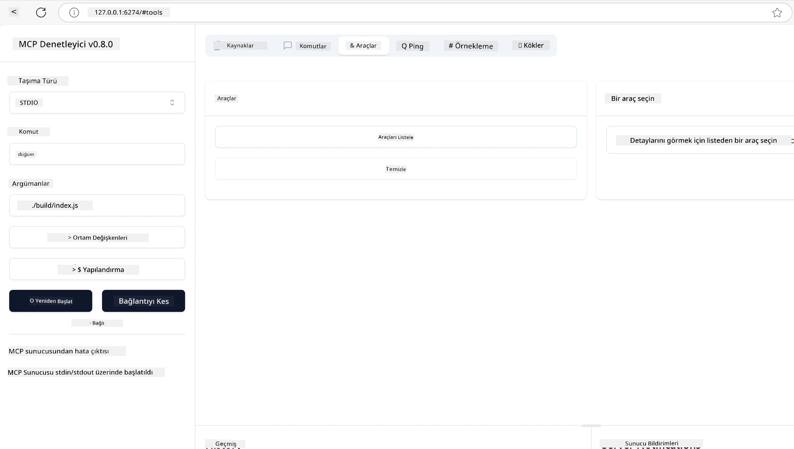
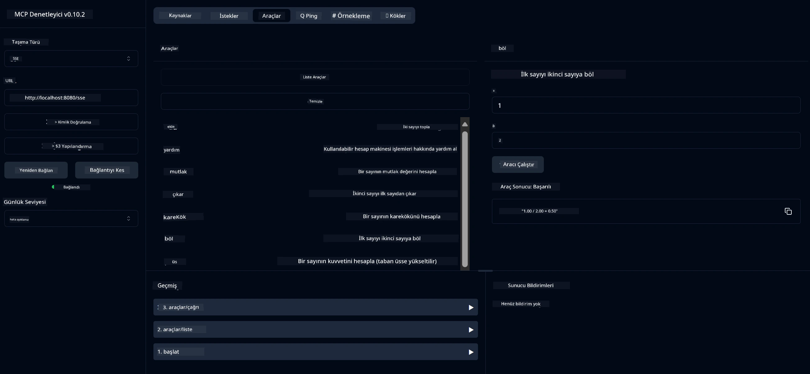
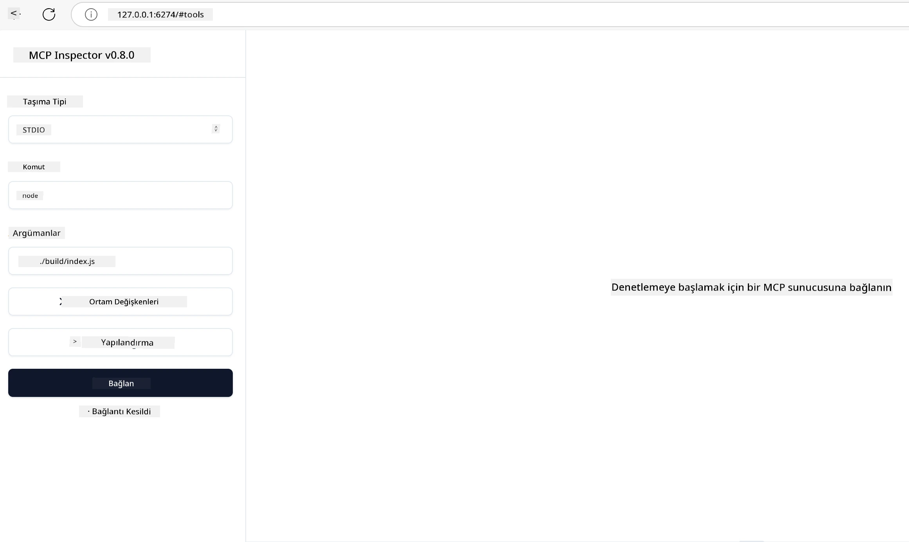
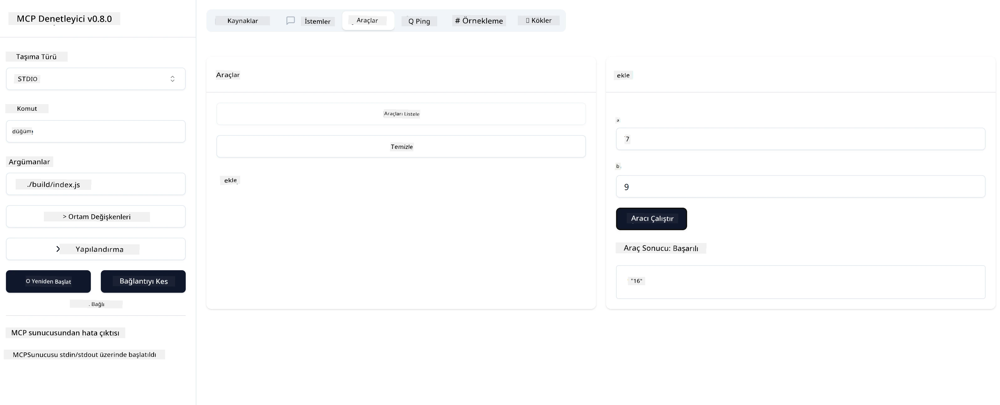

# MCP ile Başlarken

Model Context Protocol (MCP) ile ilk adımlarınıza hoş geldiniz! MCP'ye yeniyseniz veya bilginizi derinleştirmek istiyorsanız, bu rehber sizi temel kurulum ve geliştirme süreci boyunca yönlendirecek. MCP'nin AI modelleri ile uygulamalar arasında nasıl sorunsuz entegrasyon sağladığını keşfedecek ve MCP destekli çözümler oluşturup test etmek için ortamınızı nasıl hızlıca hazırlayacağınızı öğreneceksiniz.

> Özet; AI uygulamaları geliştiriyorsanız, LLM'nizi (büyük dil modeli) daha bilgili hale getirmek için araçlar ve diğer kaynaklar ekleyebileceğinizi bilirsiniz. Ancak bu araçları ve kaynakları bir sunucuya yerleştirirseniz, uygulama ve sunucu yetenekleri LLM ile/LLM olmadan herhangi bir istemci tarafından kullanılabilir.

## Genel Bakış

Bu ders, MCP ortamlarının kurulumu ve ilk MCP uygulamalarınızın oluşturulması konusunda pratik rehberlik sağlar. Gerekli araçları ve çerçeveleri nasıl kuracağınızı, temel MCP sunucuları nasıl oluşturacağınızı, ana uygulamalar yaratmayı ve uygulamalarınızı nasıl test edeceğinizi öğreneceksiniz.

Model Context Protocol (MCP), uygulamaların LLM'lere bağlam sağlamasını standartlaştıran açık bir protokoldür. MCP'yi AI uygulamaları için bir USB-C portu gibi düşünebilirsiniz - AI modellerini farklı veri kaynakları ve araçlara bağlamak için standart bir yol sağlar.

## Öğrenme Hedefleri

Bu dersin sonunda şunları yapabileceksiniz:

- C#, Java, Python, TypeScript ve Rust için MCP geliştirme ortamlarını kurmak
- Özel özelliklere (kaynaklar, istemler ve araçlar) sahip temel MCP sunucuları oluşturmak ve dağıtmak
- MCP sunucularına bağlanan ana uygulamalar oluşturmak
- MCP uygulamalarını test etmek ve hata ayıklamak

## MCP Ortamınızı Kurma

MCP ile çalışmaya başlamadan önce, geliştirme ortamınızı hazırlamak ve temel iş akışını anlamak önemlidir. Bu bölüm, MCP ile sorunsuz bir başlangıç yapmanız için ilk kurulum adımlarında size rehberlik edecektir.

### Ön Koşullar

MCP geliştirmeye başlamadan önce, aşağıdakilere sahip olduğunuzdan emin olun:

- **Geliştirme Ortamı**: Seçtiğiniz dil için (C#, Java, Python, TypeScript veya Rust)
- **IDE/Düzenleyici**: Visual Studio, Visual Studio Code, IntelliJ, Eclipse, PyCharm veya herhangi modern bir kod düzenleyici
- **Paket Yöneticileri**: NuGet, Maven/Gradle, pip, npm/yarn veya Cargo
- **API Anahtarları**: Ana uygulamalarınızda kullanmayı planladığınız herhangi bir AI servisi için

## Temel MCP Sunucu Yapısı

Bir MCP sunucusu tipik olarak şunları içerir:

- **Sunucu Yapılandırması**: Port, kimlik doğrulama ve diğer ayarların kurulumu
- **Kaynaklar**: LLM'lere sunulan veri ve bağlam
- **Araçlar**: Modellerin çağırabileceği işlevsellik
- **İstemler**: Metin oluşturmak veya yapılandırmak için şablonlar

İşte TypeScript'te basitleştirilmiş bir örnek:

```typescript
import { McpServer, ResourceTemplate } from "@modelcontextprotocol/sdk/server/mcp.js";
import { StdioServerTransport } from "@modelcontextprotocol/sdk/server/stdio.js";
import { z } from "zod";

// Bir MCP sunucusu oluştur
const server = new McpServer({
  name: "Demo",
  version: "1.0.0"
});

// Bir toplama aracı ekle
server.tool("add",
  { a: z.number(), b: z.number() },
  async ({ a, b }) => ({
    content: [{ type: "text", text: String(a + b) }]
  })
);

// Dinamik bir karşılama kaynağı ekle
server.resource(
  "file",
  // 'list' parametresi, kaynağın mevcut dosyaları nasıl listeleyeceğini kontrol eder. Bunu undefined olarak ayarlamak, bu kaynak için listelemeyi devre dışı bırakır.
  new ResourceTemplate("file://{path}", { list: undefined }),
  async (uri, { path }) => ({
    contents: [{
      uri: uri.href,
      text: `File, ${path}!`
    }]
  })
);

// Dosya içeriğini okuyan bir dosya kaynağı ekle
server.resource(
  "file",
  new ResourceTemplate("file://{path}", { list: undefined }),
  async (uri, { path }) => {
    let text;
    try {
      text = await fs.readFile(path, "utf8");
    } catch (err) {
      text = `Error reading file: ${err.message}`;
    }
    return {
      contents: [{
        uri: uri.href,
        text
      }]
    };
  }
);

server.prompt(
  "review-code",
  { code: z.string() },
  ({ code }) => ({
    messages: [{
      role: "user",
      content: {
        type: "text",
        text: `Please review this code:\n\n${code}`
      }
    }]
  })
);

// stdin'den mesaj almaya ve stdout'a mesaj göndermeye başla
const transport = new StdioServerTransport();
await server.connect(transport);
```

Yukarıdaki kodda:

- MCP TypeScript SDK'dan gerekli sınıfları içe aktardık.
- Yeni bir MCP sunucu örneği oluşturup yapılandırdık.
- Özel bir araç (`calculator`) ve bir işleyici fonksiyon kaydettik.
- Gelen MCP isteklerini dinlemek için sunucuyu başlattık.

## Test ve Hata Ayıklama

MCP sunucunuzu test etmeye başlamadan önce, mevcut araçları ve hata ayıklama için en iyi uygulamaları anlamak önemlidir. Etkili test, sunucunuzun beklendiği gibi çalışmasını sağlar ve sorunları hızlıca tespit edip çözmenize yardımcı olur. Aşağıdaki bölüm, MCP uygulamanızı doğrulamak için önerilen yaklaşımları özetler.

MCP, sunucularınızı test etmenize ve hata ayıklamanıza yardımcı olacak araçlar sağlar:

- **Inspector aracı**, bu grafiksel arayüz sunucunuza bağlanmanızı ve araçlarınızı, istemlerinizi ve kaynaklarınızı test etmenizi sağlar.
- **curl**, ayrıca curl gibi komut satırı araçları veya HTTP komutları oluşturup çalıştırabilen diğer istemcilerle sunucunuza bağlanabilirsiniz.

### MCP Inspector Kullanımı

[MCP Inspector](https://github.com/modelcontextprotocol/inspector), size şunları yapmada yardımcı olan görsel bir test aracıdır:

1. **Sunucu Yetkinliklerini Keşfetme**: Mevcut kaynakları, araçları ve istemleri otomatik olarak algılar
2. **Araç Çalıştırmayı Test Etme**: Farklı parametreleri deneyip yanıtları gerçek zamanlı görme
3. **Sunucu Meta Verilerini Görüntüleme**: Sunucu bilgilerini, şemaları ve yapılandırmaları inceleme

```bash
# Örnek TypeScript, MCP Inspector'ı kurma ve çalıştırma
npx @modelcontextprotocol/inspector node build/index.js
```

Yukarıdaki komutları çalıştırdığınızda, MCP Inspector tarayıcınızda yerel bir web arayüzü başlatacaktır. Kayıtlı MCP sunucularınızı, mevcut araçlarını, kaynaklarını ve istemlerini gösteren bir kontrol paneli göreceksiniz. Arayüz, araç çalıştırmayı etkileşimli olarak test etmenize, sunucu meta verilerini incelemenize ve gerçek zamanlı yanıtları görüntülemenize olanak tanır; böylece MCP sunucu uygulamalarınızı doğrulamak ve hata ayıklamak kolaylaşır.

İşte nasıl görünebileceğine dair bir ekran görüntüsü:



## Yaygın Kurulum Sorunları ve Çözümleri

| Sorun | Olası Çözüm |
|-------|-------------|
| Bağlantı reddedildi | Sunucunun çalıştığını ve portun doğru olduğunu kontrol edin |
| Araç çalıştırma hataları | Parametre doğrulamasını ve hata yönetimini gözden geçirin |
| Kimlik doğrulama hataları | API anahtarlarını ve izinleri doğrulayın |
| Şema doğrulama hataları | Parametrelerin tanımlı şemayla uyumlu olduğundan emin olun |
| Sunucu başlamıyor | Port çakışmalarını veya eksik bağımlılıkları kontrol edin |
| CORS hataları | Çapraz kaynak istekleri için uygun CORS başlıklarını yapılandırın |
| Kimlik doğrulama sorunları | Token geçerliliğini ve izinleri doğrulayın |

## Yerel Geliştirme

Yerel geliştirme ve test için MCP sunucularını doğrudan kendi makinenizde çalıştırabilirsiniz:

1. **Sunucu sürecini başlatın**: MCP sunucu uygulamanızı çalıştırın
2. **Ağ yapılandırması yapın**: Sunucunun beklenen portta erişilebilir olduğundan emin olun
3. **İstemcileri bağlayın**: `http://localhost:3000` gibi yerel bağlantı URL'lerini kullanın

```bash
# Örnek: Yerel olarak bir TypeScript MCP sunucusu çalıştırma
npm run start
# Sunucu http://localhost:3000 adresinde çalışıyor
```

## İlk MCP Sunucunuzu Oluşturma

Önceki derste [Temel kavramları](/01-CoreConcepts/README.md) ele aldık, şimdi bu bilgiyi uygulamaya koyma zamanı.

### Bir sunucu neler yapabilir?

Kod yazmaya başlamadan önce, bir sunucunun neler yapabileceğini hatırlayalım:

Bir MCP sunucusu örneğin:

- Yerel dosyalara ve veri tabanlarına erişebilir
- Uzak API'lere bağlanabilir
- Hesaplamalar yapabilir
- Diğer araçlar ve servislerle entegre olabilir
- Etkileşim için kullanıcı arayüzü sağlayabilir

Harika, şimdi ne yapabileceğimizi bildiğimize göre, kodlamaya başlayalım.

## Alıştırma: Sunucu Oluşturma

Bir sunucu oluşturmak için şu adımları izlemelisiniz:

- MCP SDK'yı yükleyin.
- Bir proje oluşturun ve proje yapısını kurun.
- Sunucu kodunu yazın.
- Sunucuyu test edin.

### -1- Proje oluşturma

#### TypeScript

```sh
# Proje dizini oluşturun ve npm projesini başlatın
mkdir calculator-server
cd calculator-server
npm init -y
```

#### Python

```sh
# Proje dizini oluştur
mkdir calculator-server
cd calculator-server
# Klasörü Visual Studio Code'da aç - Farklı bir IDE kullanıyorsanız bunu atlayın
code .
```

#### .NET

```sh
dotnet new console -n McpCalculatorServer
cd McpCalculatorServer
```

#### Java

Java için bir Spring Boot projesi oluşturun:

```bash
curl https://start.spring.io/starter.zip \
  -d dependencies=web \
  -d javaVersion=21 \
  -d type=maven-project \
  -d groupId=com.example \
  -d artifactId=calculator-server \
  -d name=McpServer \
  -d packageName=com.microsoft.mcp.sample.server \
  -o calculator-server.zip
```

Zip dosyasını açın:

```bash
unzip calculator-server.zip -d calculator-server
cd calculator-server
# isteğe bağlı kullanılmayan testi kaldır
rm -rf src/test/java
```

*pom.xml* dosyanıza aşağıdaki tam yapılandırmayı ekleyin:

```xml
<?xml version="1.0" encoding="UTF-8"?>
<project xmlns="http://maven.apache.org/POM/4.0.0"
    xmlns:xsi="http://www.w3.org/2001/XMLSchema-instance"
    xsi:schemaLocation="http://maven.apache.org/POM/4.0.0 http://maven.apache.org/xsd/maven-4.0.0.xsd">
    <modelVersion>4.0.0</modelVersion>
    
    <!-- Spring Boot parent for dependency management -->
    <parent>
        <groupId>org.springframework.boot</groupId>
        <artifactId>spring-boot-starter-parent</artifactId>
        <version>3.5.0</version>
        <relativePath />
    </parent>

    <!-- Project coordinates -->
    <groupId>com.example</groupId>
    <artifactId>calculator-server</artifactId>
    <version>0.0.1-SNAPSHOT</version>
    <name>Calculator Server</name>
    <description>Basic calculator MCP service for beginners</description>

    <!-- Properties -->
    <properties>
        <java.version>21</java.version>
        <maven.compiler.source>21</maven.compiler.source>
        <maven.compiler.target>21</maven.compiler.target>
    </properties>

    <!-- Spring AI BOM for version management -->
    <dependencyManagement>
        <dependencies>
            <dependency>
                <groupId>org.springframework.ai</groupId>
                <artifactId>spring-ai-bom</artifactId>
                <version>1.0.0-SNAPSHOT</version>
                <type>pom</type>
                <scope>import</scope>
            </dependency>
        </dependencies>
    </dependencyManagement>

    <!-- Dependencies -->
    <dependencies>
        <dependency>
            <groupId>org.springframework.ai</groupId>
            <artifactId>spring-ai-starter-mcp-server-webflux</artifactId>
        </dependency>
        <dependency>
            <groupId>org.springframework.boot</groupId>
            <artifactId>spring-boot-starter-actuator</artifactId>
        </dependency>
        <dependency>
         <groupId>org.springframework.boot</groupId>
         <artifactId>spring-boot-starter-test</artifactId>
         <scope>test</scope>
      </dependency>
    </dependencies>

    <!-- Build configuration -->
    <build>
        <plugins>
            <plugin>
                <groupId>org.springframework.boot</groupId>
                <artifactId>spring-boot-maven-plugin</artifactId>
            </plugin>
            <plugin>
                <groupId>org.apache.maven.plugins</groupId>
                <artifactId>maven-compiler-plugin</artifactId>
                <configuration>
                    <release>21</release>
                </configuration>
            </plugin>
        </plugins>
    </build>

    <!-- Repositories for Spring AI snapshots -->
    <repositories>
        <repository>
            <id>spring-milestones</id>
            <name>Spring Milestones</name>
            <url>https://repo.spring.io/milestone</url>
            <snapshots>
                <enabled>false</enabled>
            </snapshots>
        </repository>
        <repository>
            <id>spring-snapshots</id>
            <name>Spring Snapshots</name>
            <url>https://repo.spring.io/snapshot</url>
            <releases>
                <enabled>false</enabled>
            </releases>
        </repository>
    </repositories>
</project>
```

#### Rust

```sh
mkdir calculator-server
cd calculator-server
cargo init
```

### -2- Bağımlılıkları ekleme

Projenizi oluşturduğunuza göre, şimdi bağımlılıkları ekleyelim:

#### TypeScript

```sh
# Henüz kurulmadıysa, TypeScript'i global olarak kurun
npm install typescript -g

# Şema doğrulama için MCP SDK ve Zod'u kurun
npm install @modelcontextprotocol/sdk zod
npm install -D @types/node typescript
```

#### Python

```sh
# Sanal bir ortam oluşturun ve bağımlılıkları yükleyin
python -m venv venv
venv\Scripts\activate
pip install "mcp[cli]"
```

#### Java

```bash
cd calculator-server
./mvnw clean install -DskipTests
```

#### Rust

```sh
cargo add rmcp --features server,transport-io
cargo add serde
cargo add tokio --features rt-multi-thread
```

### -3- Proje dosyalarını oluşturma

#### TypeScript

*package.json* dosyasını açın ve sunucuyu derleyip çalıştırabilmeniz için içeriği aşağıdakiyle değiştirin:

```json
{
  "name": "calculator-server",
  "version": "1.0.0",
  "main": "index.js",
  "type": "module",
  "scripts": {
    "build": "tsc",
    "start": "npm run build && node ./build/index.js",
  },
  "keywords": [],
  "author": "",
  "license": "ISC",
  "description": "A simple calculator server using Model Context Protocol",
  "dependencies": {
    "@modelcontextprotocol/sdk": "^1.16.0",
    "zod": "^3.25.76"
  },
  "devDependencies": {
    "@types/node": "^24.0.14",
    "typescript": "^5.8.3"
  }
}
```

Aşağıdaki içeriğe sahip bir *tsconfig.json* oluşturun:

```json
{
  "compilerOptions": {
    "target": "ES2022",
    "module": "Node16",
    "moduleResolution": "Node16",
    "outDir": "./build",
    "rootDir": "./src",
    "strict": true,
    "esModuleInterop": true,
    "skipLibCheck": true,
    "forceConsistentCasingInFileNames": true
  },
  "include": ["src/**/*"],
  "exclude": ["node_modules"]
}
```

Kaynak kodunuz için bir dizin oluşturun:

```sh
mkdir src
touch src/index.ts
```

#### Python

*server.py* dosyası oluşturun

```sh
touch server.py
```

#### .NET

Gerekli NuGet paketlerini yükleyin:

```sh
dotnet add package ModelContextProtocol --prerelease
dotnet add package Microsoft.Extensions.Hosting
```

#### Java

Java Spring Boot projelerinde proje yapısı otomatik olarak oluşturulur.

#### Rust

Rust için, `cargo init` komutunu çalıştırdığınızda varsayılan olarak *src/main.rs* dosyası oluşturulur. Dosyayı açın ve varsayılan kodu silin.

### -4- Sunucu kodunu oluşturma

#### TypeScript

*index.ts* dosyası oluşturun ve aşağıdaki kodu ekleyin:

```typescript
import { McpServer, ResourceTemplate } from "@modelcontextprotocol/sdk/server/mcp.js";
import { StdioServerTransport } from "@modelcontextprotocol/sdk/server/stdio.js";
import { z } from "zod";
 
// Bir MCP sunucusu oluşturun
const server = new McpServer({
  name: "Calculator MCP Server",
  version: "1.0.0"
});
```

Artık bir sunucunuz var, ancak çok fazla iş yapmıyor, bunu düzeltelim.

#### Python

```python
# server.py
from mcp.server.fastmcp import FastMCP

# Bir MCP sunucusu oluşturun
mcp = FastMCP("Demo")
```

#### .NET

```csharp
using Microsoft.Extensions.DependencyInjection;
using Microsoft.Extensions.Hosting;
using Microsoft.Extensions.Logging;
using ModelContextProtocol.Server;
using System.ComponentModel;

var builder = Host.CreateApplicationBuilder(args);
builder.Logging.AddConsole(consoleLogOptions =>
{
    // Configure all logs to go to stderr
    consoleLogOptions.LogToStandardErrorThreshold = LogLevel.Trace;
});

builder.Services
    .AddMcpServer()
    .WithStdioServerTransport()
    .WithToolsFromAssembly();
await builder.Build().RunAsync();

// add features
```

#### Java

Java için temel sunucu bileşenlerini oluşturun. Öncelikle ana uygulama sınıfını değiştirin:

*src/main/java/com/microsoft/mcp/sample/server/McpServerApplication.java*:

```java
package com.microsoft.mcp.sample.server;

import org.springframework.ai.tool.ToolCallbackProvider;
import org.springframework.ai.tool.method.MethodToolCallbackProvider;
import org.springframework.boot.SpringApplication;
import org.springframework.boot.autoconfigure.SpringBootApplication;
import org.springframework.context.annotation.Bean;
import com.microsoft.mcp.sample.server.service.CalculatorService;

@SpringBootApplication
public class McpServerApplication {

    public static void main(String[] args) {
        SpringApplication.run(McpServerApplication.class, args);
    }
    
    @Bean
    public ToolCallbackProvider calculatorTools(CalculatorService calculator) {
        return MethodToolCallbackProvider.builder().toolObjects(calculator).build();
    }
}
```

Hesap makinesi servisini oluşturun *src/main/java/com/microsoft/mcp/sample/server/service/CalculatorService.java*:

```java
package com.microsoft.mcp.sample.server.service;

import org.springframework.ai.tool.annotation.Tool;
import org.springframework.stereotype.Service;

/**
 * Service for basic calculator operations.
 * This service provides simple calculator functionality through MCP.
 */
@Service
public class CalculatorService {

    /**
     * Add two numbers
     * @param a The first number
     * @param b The second number
     * @return The sum of the two numbers
     */
    @Tool(description = "Add two numbers together")
    public String add(double a, double b) {
        double result = a + b;
        return formatResult(a, "+", b, result);
    }

    /**
     * Subtract one number from another
     * @param a The number to subtract from
     * @param b The number to subtract
     * @return The result of the subtraction
     */
    @Tool(description = "Subtract the second number from the first number")
    public String subtract(double a, double b) {
        double result = a - b;
        return formatResult(a, "-", b, result);
    }

    /**
     * Multiply two numbers
     * @param a The first number
     * @param b The second number
     * @return The product of the two numbers
     */
    @Tool(description = "Multiply two numbers together")
    public String multiply(double a, double b) {
        double result = a * b;
        return formatResult(a, "*", b, result);
    }

    /**
     * Divide one number by another
     * @param a The numerator
     * @param b The denominator
     * @return The result of the division
     */
    @Tool(description = "Divide the first number by the second number")
    public String divide(double a, double b) {
        if (b == 0) {
            return "Error: Cannot divide by zero";
        }
        double result = a / b;
        return formatResult(a, "/", b, result);
    }

    /**
     * Calculate the power of a number
     * @param base The base number
     * @param exponent The exponent
     * @return The result of raising the base to the exponent
     */
    @Tool(description = "Calculate the power of a number (base raised to an exponent)")
    public String power(double base, double exponent) {
        double result = Math.pow(base, exponent);
        return formatResult(base, "^", exponent, result);
    }

    /**
     * Calculate the square root of a number
     * @param number The number to find the square root of
     * @return The square root of the number
     */
    @Tool(description = "Calculate the square root of a number")
    public String squareRoot(double number) {
        if (number < 0) {
            return "Error: Cannot calculate square root of a negative number";
        }
        double result = Math.sqrt(number);
        return String.format("√%.2f = %.2f", number, result);
    }

    /**
     * Calculate the modulus (remainder) of division
     * @param a The dividend
     * @param b The divisor
     * @return The remainder of the division
     */
    @Tool(description = "Calculate the remainder when one number is divided by another")
    public String modulus(double a, double b) {
        if (b == 0) {
            return "Error: Cannot divide by zero";
        }
        double result = a % b;
        return formatResult(a, "%", b, result);
    }

    /**
     * Calculate the absolute value of a number
     * @param number The number to find the absolute value of
     * @return The absolute value of the number
     */
    @Tool(description = "Calculate the absolute value of a number")
    public String absolute(double number) {
        double result = Math.abs(number);
        return String.format("|%.2f| = %.2f", number, result);
    }

    /**
     * Get help about available calculator operations
     * @return Information about available operations
     */
    @Tool(description = "Get help about available calculator operations")
    public String help() {
        return "Basic Calculator MCP Service\n\n" +
               "Available operations:\n" +
               "1. add(a, b) - Adds two numbers\n" +
               "2. subtract(a, b) - Subtracts the second number from the first\n" +
               "3. multiply(a, b) - Multiplies two numbers\n" +
               "4. divide(a, b) - Divides the first number by the second\n" +
               "5. power(base, exponent) - Raises a number to a power\n" +
               "6. squareRoot(number) - Calculates the square root\n" + 
               "7. modulus(a, b) - Calculates the remainder of division\n" +
               "8. absolute(number) - Calculates the absolute value\n\n" +
               "Example usage: add(5, 3) will return 5 + 3 = 8";
    }

    /**
     * Format the result of a calculation
     */
    private String formatResult(double a, String operator, double b, double result) {
        return String.format("%.2f %s %.2f = %.2f", a, operator, b, result);
    }
}
```

**Üretime hazır bir servis için isteğe bağlı bileşenler:**

Başlangıç yapılandırması oluşturun *src/main/java/com/microsoft/mcp/sample/server/config/StartupConfig.java*:

```java
package com.microsoft.mcp.sample.server.config;

import org.springframework.boot.CommandLineRunner;
import org.springframework.context.annotation.Bean;
import org.springframework.context.annotation.Configuration;

@Configuration
public class StartupConfig {
    
    @Bean
    public CommandLineRunner startupInfo() {
        return args -> {
            System.out.println("\n" + "=".repeat(60));
            System.out.println("Calculator MCP Server is starting...");
            System.out.println("SSE endpoint: http://localhost:8080/sse");
            System.out.println("Health check: http://localhost:8080/actuator/health");
            System.out.println("=".repeat(60) + "\n");
        };
    }
}
```

Bir sağlık denetleyicisi oluşturun *src/main/java/com/microsoft/mcp/sample/server/controller/HealthController.java*:

```java
package com.microsoft.mcp.sample.server.controller;

import org.springframework.http.ResponseEntity;
import org.springframework.web.bind.annotation.GetMapping;
import org.springframework.web.bind.annotation.RestController;
import java.time.LocalDateTime;
import java.util.HashMap;
import java.util.Map;

@RestController
public class HealthController {
    
    @GetMapping("/health")
    public ResponseEntity<Map<String, Object>> healthCheck() {
        Map<String, Object> response = new HashMap<>();
        response.put("status", "UP");
        response.put("timestamp", LocalDateTime.now().toString());
        response.put("service", "Calculator MCP Server");
        return ResponseEntity.ok(response);
    }
}
```

Bir istisna işleyici oluşturun *src/main/java/com/microsoft/mcp/sample/server/exception/GlobalExceptionHandler.java*:

```java
package com.microsoft.mcp.sample.server.exception;

import org.springframework.http.HttpStatus;
import org.springframework.http.ResponseEntity;
import org.springframework.web.bind.annotation.ExceptionHandler;
import org.springframework.web.bind.annotation.RestControllerAdvice;

@RestControllerAdvice
public class GlobalExceptionHandler {

    @ExceptionHandler(IllegalArgumentException.class)
    public ResponseEntity<ErrorResponse> handleIllegalArgumentException(IllegalArgumentException ex) {
        ErrorResponse error = new ErrorResponse(
            "Invalid_Input", 
            "Invalid input parameter: " + ex.getMessage());
        return new ResponseEntity<>(error, HttpStatus.BAD_REQUEST);
    }

    public static class ErrorResponse {
        private String code;
        private String message;

        public ErrorResponse(String code, String message) {
            this.code = code;
            this.message = message;
        }

        // Alıcılar
        public String getCode() { return code; }
        public String getMessage() { return message; }
    }
}
```

Özel bir banner oluşturun *src/main/resources/banner.txt*:

```text
_____      _            _       _             
 / ____|    | |          | |     | |            
| |     __ _| | ___ _   _| | __ _| |_ ___  _ __ 
| |    / _` | |/ __| | | | |/ _` | __/ _ \| '__|
| |___| (_| | | (__| |_| | | (_| | || (_) | |   
 \_____\__,_|_|\___|\__,_|_|\__,_|\__\___/|_|   
                                                
Calculator MCP Server v1.0
Spring Boot MCP Application
```

</details>

#### Rust

Aşağıdaki kodu *src/main.rs* dosyasının en üstüne ekleyin. Bu, MCP sunucunuz için gerekli kütüphaneleri ve modülleri içe aktarır.

```rust
use rmcp::{
    handler::server::{router::tool::ToolRouter, tool::Parameters},
    model::{ServerCapabilities, ServerInfo},
    schemars, tool, tool_handler, tool_router,
    transport::stdio,
    ServerHandler, ServiceExt,
};
use std::error::Error;
```

Hesap makinesi sunucusu, iki sayıyı toplayabilen basit bir sunucu olacak. Hesap makinesi isteğini temsil eden bir struct oluşturalım.

```rust
#[derive(Debug, serde::Deserialize, schemars::JsonSchema)]
pub struct CalculatorRequest {
    pub a: f64,
    pub b: f64,
}
```

Sonra, araç yönlendiricisini tutacak olan hesap makinesi sunucusunu temsil eden bir struct oluşturun.

```rust
#[derive(Debug, Clone)]
pub struct Calculator {
    tool_router: ToolRouter<Self>,
}
```

Şimdi, `Calculator` struct'ını yeni bir sunucu örneği oluşturmak ve sunucu bilgisi sağlamak için sunucu işleyicisini uygulamak üzere uygulayabiliriz.

```rust
#[tool_router]
impl Calculator {
    pub fn new() -> Self {
        Self {
            tool_router: Self::tool_router(),
        }
    }
}

#[tool_handler]
impl ServerHandler for Calculator {
    fn get_info(&self) -> ServerInfo {
        ServerInfo {
            instructions: Some("A simple calculator tool".into()),
            capabilities: ServerCapabilities::builder().enable_tools().build(),
            ..Default::default()
        }
    }
}
```

Son olarak, sunucuyu başlatmak için ana fonksiyonu uygulamamız gerekiyor. Bu fonksiyon `Calculator` struct'ının bir örneğini oluşturacak ve standart giriş/çıkış üzerinden hizmet verecek.

```rust
#[tokio::main]
async fn main() -> Result<(), Box<dyn Error>> {
    let service = Calculator::new().serve(stdio()).await?;
    service.waiting().await?;
    Ok(())
}
```

Sunucu artık kendisi hakkında temel bilgileri sağlamaya hazır. Sonraki adımda toplama işlemi yapacak bir araç ekleyeceğiz.

### -5- Bir araç ve kaynak ekleme

Aşağıdaki kodu ekleyerek bir araç ve kaynak ekleyin:

#### TypeScript

```typescript
server.tool(
  "add",
  { a: z.number(), b: z.number() },
  async ({ a, b }) => ({
    content: [{ type: "text", text: String(a + b) }]
  })
);

server.resource(
  "greeting",
  new ResourceTemplate("greeting://{name}", { list: undefined }),
  async (uri, { name }) => ({
    contents: [{
      uri: uri.href,
      text: `Hello, ${name}!`
    }]
  })
);
```

Aracınız `a` ve `b` parametrelerini alır ve şu formda bir yanıt üretir:

```typescript
{
  contents: [{
    type: "text", content: "some content"
  }]
}
```

Kaynağınıza "greeting" adlı bir string üzerinden erişilir, `name` parametresi alır ve araçla benzer bir yanıt üretir:

```typescript
{
  uri: "<href>",
  text: "a text"
}
```

#### Python

```python
# Bir toplama aracı ekle
@mcp.tool()
def add(a: int, b: int) -> int:
    """Add two numbers"""
    return a + b


# Dinamik bir karşılama kaynağı ekle
@mcp.resource("greeting://{name}")
def get_greeting(name: str) -> str:
    """Get a personalized greeting"""
    return f"Hello, {name}!"
```

Yukarıdaki kodda:

- `a` ve `b` parametrelerini alan `add` adlı bir araç tanımladık, her ikisi de tam sayı.
- `name` parametresi alan `greeting` adlı bir kaynak oluşturduk.

#### .NET

Bunu Program.cs dosyanıza ekleyin:

```csharp
[McpServerToolType]
public static class CalculatorTool
{
    [McpServerTool, Description("Adds two numbers")]
    public static string Add(int a, int b) => $"Sum {a + b}";
}
```

#### Java

Araçlar önceki adımda zaten oluşturuldu.

#### Rust

`impl Calculator` bloğu içine yeni bir araç ekleyin:

```rust
#[tool(description = "Adds a and b")]
async fn add(
    &self,
    Parameters(CalculatorRequest { a, b }): Parameters<CalculatorRequest>,
) -> String {
    (a + b).to_string()
}
```

### -6- Son kod

Sunucunun başlayabilmesi için gereken son kodu ekleyelim:

#### TypeScript

```typescript
// stdin'den mesaj almaya ve stdout'a mesaj göndermeye başla
const transport = new StdioServerTransport();
await server.connect(transport);
```

Tam kod şöyle:

```typescript
// index.ts
import { McpServer, ResourceTemplate } from "@modelcontextprotocol/sdk/server/mcp.js";
import { StdioServerTransport } from "@modelcontextprotocol/sdk/server/stdio.js";
import { z } from "zod";

// Bir MCP sunucusu oluştur
const server = new McpServer({
  name: "Calculator MCP Server",
  version: "1.0.0"
});

// Bir toplama aracı ekle
server.tool(
  "add",
  { a: z.number(), b: z.number() },
  async ({ a, b }) => ({
    content: [{ type: "text", text: String(a + b) }]
  })
);

// Dinamik bir karşılama kaynağı ekle
server.resource(
  "greeting",
  new ResourceTemplate("greeting://{name}", { list: undefined }),
  async (uri, { name }) => ({
    contents: [{
      uri: uri.href,
      text: `Hello, ${name}!`
    }]
  })
);

// stdin'den mesaj almaya ve stdout'a mesaj göndermeye başla
const transport = new StdioServerTransport();
server.connect(transport);
```

#### Python

```python
# server.py
from mcp.server.fastmcp import FastMCP

# Bir MCP sunucusu oluştur
mcp = FastMCP("Demo")


# Bir toplama aracı ekle
@mcp.tool()
def add(a: int, b: int) -> int:
    """Add two numbers"""
    return a + b


# Dinamik bir karşılama kaynağı ekle
@mcp.resource("greeting://{name}")
def get_greeting(name: str) -> str:
    """Get a personalized greeting"""
    return f"Hello, {name}!"

# Ana yürütme bloğu - sunucuyu çalıştırmak için gereklidir
if __name__ == "__main__":
    mcp.run()
```

#### .NET

Aşağıdaki içeriğe sahip bir Program.cs dosyası oluşturun:

```csharp
using Microsoft.Extensions.DependencyInjection;
using Microsoft.Extensions.Hosting;
using Microsoft.Extensions.Logging;
using ModelContextProtocol.Server;
using System.ComponentModel;

var builder = Host.CreateApplicationBuilder(args);
builder.Logging.AddConsole(consoleLogOptions =>
{
    // Configure all logs to go to stderr
    consoleLogOptions.LogToStandardErrorThreshold = LogLevel.Trace;
});

builder.Services
    .AddMcpServer()
    .WithStdioServerTransport()
    .WithToolsFromAssembly();
await builder.Build().RunAsync();

[McpServerToolType]
public static class CalculatorTool
{
    [McpServerTool, Description("Adds two numbers")]
    public static string Add(int a, int b) => $"Sum {a + b}";
}
```

#### Java

Tam ana uygulama sınıfınız şöyle olmalıdır:

```java
// McpServerApplication.java
package com.microsoft.mcp.sample.server;

import org.springframework.ai.tool.ToolCallbackProvider;
import org.springframework.ai.tool.method.MethodToolCallbackProvider;
import org.springframework.boot.SpringApplication;
import org.springframework.boot.autoconfigure.SpringBootApplication;
import org.springframework.context.annotation.Bean;
import com.microsoft.mcp.sample.server.service.CalculatorService;

@SpringBootApplication
public class McpServerApplication {

    public static void main(String[] args) {
        SpringApplication.run(McpServerApplication.class, args);
    }
    
    @Bean
    public ToolCallbackProvider calculatorTools(CalculatorService calculator) {
        return MethodToolCallbackProvider.builder().toolObjects(calculator).build();
    }
}
```

#### Rust

Rust sunucusu için son kod şöyle olmalıdır:

```rust
use rmcp::{
    ServerHandler, ServiceExt,
    handler::server::{router::tool::ToolRouter, tool::Parameters},
    model::{ServerCapabilities, ServerInfo},
    schemars, tool, tool_handler, tool_router,
    transport::stdio,
};
use std::error::Error;

#[derive(Debug, serde::Deserialize, schemars::JsonSchema)]
pub struct CalculatorRequest {
    pub a: f64,
    pub b: f64,
}

#[derive(Debug, Clone)]
pub struct Calculator {
    tool_router: ToolRouter<Self>,
}

#[tool_router]
impl Calculator {
    pub fn new() -> Self {
        Self {
            tool_router: Self::tool_router(),
        }
    }
    
    #[tool(description = "Adds a and b")]
    async fn add(
        &self,
        Parameters(CalculatorRequest { a, b }): Parameters<CalculatorRequest>,
    ) -> String {
        (a + b).to_string()
    }
}

#[tool_handler]
impl ServerHandler for Calculator {
    fn get_info(&self) -> ServerInfo {
        ServerInfo {
            instructions: Some("A simple calculator tool".into()),
            capabilities: ServerCapabilities::builder().enable_tools().build(),
            ..Default::default()
        }
    }
}

#[tokio::main]
async fn main() -> Result<(), Box<dyn Error>> {
    let service = Calculator::new().serve(stdio()).await?;
    service.waiting().await?;
    Ok(())
}
```

### -7- Sunucuyu test etme

Sunucuyu aşağıdaki komutla başlatın:

#### TypeScript

```sh
npm run build
```

#### Python

```sh
mcp run server.py
```

> MCP Inspector kullanmak için `mcp dev server.py` komutunu kullanın; bu komut Inspector'ı otomatik başlatır ve gerekli proxy oturum tokenını sağlar. `mcp run server.py` kullanıyorsanız, Inspector'ı manuel başlatmanız ve bağlantıyı yapılandırmanız gerekir.

#### .NET

Proje dizininizde olduğunuzdan emin olun:

```sh
cd McpCalculatorServer
dotnet run
```

#### Java

```bash
./mvnw clean install -DskipTests
java -jar target/calculator-server-0.0.1-SNAPSHOT.jar
```

#### Rust

Sunucuyu biçimlendirmek ve çalıştırmak için aşağıdaki komutları çalıştırın:

```sh
cargo fmt
cargo run
```

### -8- Inspector kullanarak çalıştırma

Inspector, sunucunuzu başlatabilen ve onunla etkileşim kurmanızı sağlayan harika bir araçtır, böylece çalıştığını test edebilirsiniz. Başlatalım:

> [!NOTE]
> "komut" alanında, sunucunuzu belirli çalışma zamanınızla çalıştırmak için gereken komut yer alacağından farklı görünebilir.

#### TypeScript

```sh
npx @modelcontextprotocol/inspector node build/index.js
```

veya *package.json* dosyanıza şöyle ekleyin: `"inspector": "npx @modelcontextprotocol/inspector node build/index.js"` ve sonra `npm run inspector` komutunu çalıştırın

#### Python

Python, Node.js tabanlı bir araç olan inspector'ı sarar. Bu aracı şöyle çağırmak mümkündür:

```sh
mcp dev server.py
```

Ancak, araçta mevcut tüm yöntemleri uygulamadığından, Node.js aracını doğrudan aşağıdaki gibi çalıştırmanız önerilir:

```sh
npx @modelcontextprotocol/inspector mcp run server.py
```

Eğer komutları ve argümanları yapılandırmanıza izin veren bir araç veya IDE kullanıyorsanız,
`Command` alanına `python` ve `Arguments` alanına `server.py` yazdığınızdan emin olun. Bu, betiğin doğru şekilde çalışmasını sağlar.

#### .NET

Proje dizininizde olduğunuzdan emin olun:

```sh
cd McpCalculatorServer
npx @modelcontextprotocol/inspector dotnet run
```

#### Java

Hesap makinesi sunucunuzun çalıştığından emin olun
Ardından denetleyiciyi çalıştırın:

```cmd
npx @modelcontextprotocol/inspector
```

Denetleyici web arayüzünde:

1. Taşıma türü olarak "SSE"yi seçin
2. URL'yi şu şekilde ayarlayın: `http://localhost:8080/sse`
3. "Connect"e tıklayın



**Artık sunucuya bağlısınız**
**Java sunucu testi bölümü tamamlandı**

Sonraki bölüm sunucu ile etkileşimle ilgilidir.

Aşağıdaki kullanıcı arayüzünü görmelisiniz:



1. Bağlan düğmesini seçerek sunucuya bağlanın
  Sunucuya bağlandıktan sonra aşağıdakileri görmelisiniz:

  

1. "Tools" ve "listTools"u seçin, "Add" görünmelidir, "Add"i seçin ve parametre değerlerini doldurun.

  Aşağıdaki yanıtı görmelisiniz, yani "add" aracından bir sonuç:

  

Tebrikler, ilk sunucunuzu oluşturup çalıştırmayı başardınız!

#### Rust

Rust sunucusunu MCP Inspector CLI ile çalıştırmak için şu komutu kullanın:

```sh
npx @modelcontextprotocol/inspector cargo run --cli --method tools/call --tool-name add --tool-arg a=1 b=2
```

### Resmi SDK'lar

MCP, birden çok dil için resmi SDK'lar sağlar:

- [C# SDK](https://github.com/modelcontextprotocol/csharp-sdk) - Microsoft ile iş birliği içinde sürdürülmektedir
- [Java SDK](https://github.com/modelcontextprotocol/java-sdk) - Spring AI ile iş birliği içinde sürdürülmektedir
- [TypeScript SDK](https://github.com/modelcontextprotocol/typescript-sdk) - Resmi TypeScript uygulaması
- [Python SDK](https://github.com/modelcontextprotocol/python-sdk) - Resmi Python uygulaması
- [Kotlin SDK](https://github.com/modelcontextprotocol/kotlin-sdk) - Resmi Kotlin uygulaması
- [Swift SDK](https://github.com/modelcontextprotocol/swift-sdk) - Loopwork AI ile iş birliği içinde sürdürülmektedir
- [Rust SDK](https://github.com/modelcontextprotocol/rust-sdk) - Resmi Rust uygulaması

## Temel Noktalar

- MCP geliştirme ortamı, dil özel SDK'ları ile kurulumu kolaydır
- MCP sunucuları, açık şemalara sahip araçlar oluşturup kaydetmeyi içerir
- Test ve hata ayıklama, güvenilir MCP uygulamaları için gereklidir

## Örnekler

- [Java Calculator](../samples/java/calculator/README.md)
- [.Net Calculator](../../../../03-GettingStarted/samples/csharp)
- [JavaScript Calculator](../samples/javascript/README.md)
- [TypeScript Calculator](../samples/typescript/README.md)
- [Python Calculator](../../../../03-GettingStarted/samples/python)
- [Rust Calculator](../../../../03-GettingStarted/samples/rust)

## Ödev

Seçtiğiniz bir araçla basit bir MCP sunucusu oluşturun:

1. Aracı tercih ettiğiniz dilde (.NET, Java, Python, TypeScript veya Rust) uygulayın.
2. Girdi parametrelerini ve dönüş değerlerini tanımlayın.
3. Sunucunun beklendiği gibi çalıştığını doğrulamak için denetleyici aracını çalıştırın.
4. Uygulamayı çeşitli girdilerle test edin.

## Çözüm

[Çözüm](./solution/README.md)

## Ek Kaynaklar

- [Azure'da Model Context Protocol kullanarak Ajanlar Oluşturma](https://learn.microsoft.com/azure/developer/ai/intro-agents-mcp)
- [Azure Container Apps ile Uzaktan MCP (Node.js/TypeScript/JavaScript)](https://learn.microsoft.com/samples/azure-samples/mcp-container-ts/mcp-container-ts/)
- [.NET OpenAI MCP Ajanı](https://learn.microsoft.com/samples/azure-samples/openai-mcp-agent-dotnet/openai-mcp-agent-dotnet/)

## Sonraki

Sonraki: [MCP İstemcileri ile Başlarken](../02-client/README.md)

---

<!-- CO-OP TRANSLATOR DISCLAIMER START -->
**Feragatname**:  
Bu belge, AI çeviri servisi [Co-op Translator](https://github.com/Azure/co-op-translator) kullanılarak çevrilmiştir. Doğruluk için çaba gösterilse de, otomatik çevirilerin hatalar veya yanlışlıklar içerebileceğini lütfen unutmayınız. Orijinal belge, kendi dilinde yetkili kaynak olarak kabul edilmelidir. Kritik bilgiler için profesyonel insan çevirisi önerilir. Bu çevirinin kullanımı sonucu oluşabilecek yanlış anlamalar veya yorum hatalarından sorumlu değiliz.
<!-- CO-OP TRANSLATOR DISCLAIMER END -->