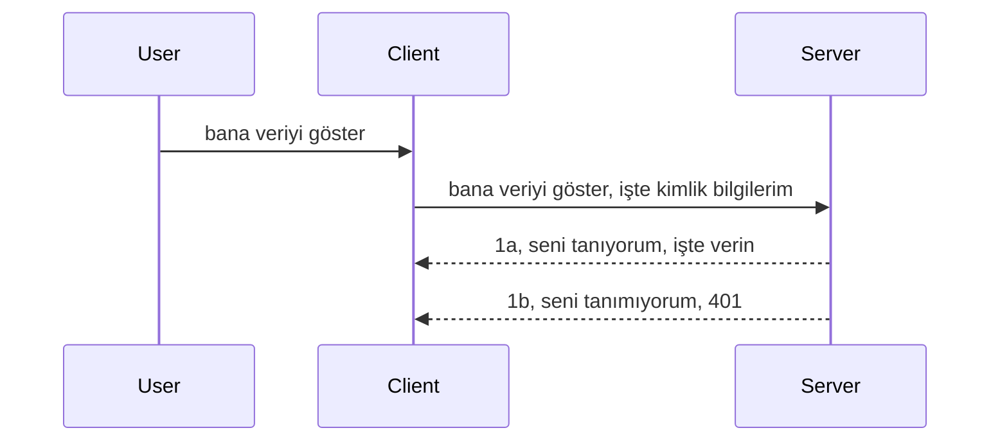

# Basit kimlik doğrulama

MCP SDK'ları, OAuth 2.1 kullanımını destekler; doğrusu, bu oldukça karmaşık bir süreçtir ve kimlik doğrulama sunucusu, kaynak sunucusu, kimlik bilgilerini gönderme, bir kod alma, bu kodu taşınabilir bir jetonla değiştirme ve nihayetinde kaynak verilerinize erişme gibi kavramları içerir. OAuth'a alışkın değilseniz — ki bu uygulanması harika bir şeydir — temel bir kimlik doğrulama seviyesiyle başlamak ve giderek daha iyi güvenlik seviyelerine ulaşmak iyi bir fikirdir. Bu yüzden bu bölüm var; sizi daha gelişmiş kimlik doğrulamaya hazırlamak için.

## Kimlik doğrulama, ne demek istiyoruz?

Kimlik doğrulama terimi, authentication (kimlik doğrulama) ve authorization (yetkilendirme) kelimelerinin kısaltmasıdır. Temelde iki şey yapmamız gerekir:

- **Authentication (Kimlik doğrulama)**: Bir kişinin evimize girmesine izin verip vermeyeceğimizi anlamak için yapılan süreçtir. Yani, kişinin "burada" olma hakkı var mı, diğer bir deyişle MCP Sunucumuzun özelliklerinin bulunduğu kaynak sunucumuza erişimi var mı.
- **Authorization (Yetkilendirme)**: Kullanıcının talep ettiği belirli kaynaklara erişimi olup olmadığını kontrol etme sürecidir; örneğin bu siparişlere veya ürünlere erişimi var mı, içerikleri okuyabilir ama silemez gibi farklı izinler.

## Kimlik bilgileri: Sisteme kim olduğumuzu nasıl bildiririz

Çoğu web geliştiricisi, genellikle sunucuya bir kimlik bilgisi (genellikle bir gizli anahtar) sağlamayı düşünür; bu gizli anahtar "Authentication" kapsamında orada bulunma yetkisini belirtir. Bu kimlik bilgisi genellikle kullanıcı adı ve şifrenin base64 kodlanmış hali ya da belirli bir kullanıcıyı benzersiz olarak tanımlayan bir API anahtarıdır.

Bu, tipik olarak şöyle bir "Authorization" başlığı olarak gönderilir:

```json
{ "Authorization": "secret123" }
```

Bu genellikle temel kimlik doğrulama (basic authentication) olarak adlandırılır. Tüm iş akışı şu şekilde işler:


Şimdi iş akışından nasıl çalıştığını anladığımıza göre, bunu nasıl uygularız? Çoğu web sunucusunda "middleware" olarak adlandırılan bir kavram vardır; bu, kimlik bilgilerini doğrulayabilen ve geçerli ise isteğin devam etmesine izin veren bir kod parçasıdır. Geçerli kimlik bilgisi yoksa, kimlik doğrulama hatası alırsınız. Şimdi bunu nasıl uygulayabileceğimize bakalım:

**Python**

```python
class AuthMiddleware(BaseHTTPMiddleware):
    async def dispatch(self, request, call_next):

        has_header = request.headers.get("Authorization")
        if not has_header:
            print("-> Missing Authorization header!")
            return Response(status_code=401, content="Unauthorized")

        if not valid_token(has_header):
            print("-> Invalid token!")
            return Response(status_code=403, content="Forbidden")

        print("Valid token, proceeding...")
       
        response = await call_next(request)
        # yanıt içinde herhangi bir müşteri başlığı ekleyin veya bir şekilde değişiklik yapın
        return response


starlette_app.add_middleware(CustomHeaderMiddleware)
```

Burada:

- `AuthMiddleware` adında bir middleware (ara katman yazılım) oluşturduk ve `dispatch` yöntemi web sunucusu tarafından çağrılıyor.
- Middleware'i web sunucusuna ekledik:

    ```python
    starlette_app.add_middleware(AuthMiddleware)
    ```

- Yetkilendirme başlığının var olup olmadığını ve gönderilen gizlinin geçerliliğini kontrol eden doğrulama mantığını yazdık:

    ```python
    has_header = request.headers.get("Authorization")
    if not has_header:
        print("-> Missing Authorization header!")
        return Response(status_code=401, content="Unauthorized")

    if not valid_token(has_header):
        print("-> Invalid token!")
        return Response(status_code=403, content="Forbidden")
    ```

    Gizli anahtar mevcut ve geçerliyse, `call_next` fonksiyonunu çağırarak isteğin devam etmesine izin verir ve yanıtı döneriz.

    ```python
    response = await call_next(request)
    # herhangi bir müşteri başlığı ekleyin veya yanıtta bir şekilde değişiklik yapın
    return response
    ```

Çalışma şekli şu: bir web isteği sunucuya geldiğinde middleware çağrılır ve uygulamasına göre ya isteğin devamını sağlar ya da istemcinin devam etmesine izin verilmediğini belirten bir hata döner.

**TypeScript**

Popüler Express framework ile bir middleware oluşturup isteği MCP Sunucusuna ulaşmadan önce yakalıyoruz. İşte kod:

```typescript
function isValid(secret) {
    return secret === "secret123";
}

app.use((req, res, next) => {
    // 1. Yetkilendirme başlığı var mı?
    if(!req.headers["Authorization"]) {
        res.status(401).send('Unauthorized');
    }
    
    let token = req.headers["Authorization"];

    // 2. Geçerliliği kontrol et.
    if(!isValid(token)) {
        res.status(403).send('Forbidden');
    }

   
    console.log('Middleware executed');
    // 3. İsteği istek hattındaki bir sonraki adıma iletir.
    next();
});
```

Bu kodda:

1. Öncelikle Authorization başlığının varlığını kontrol ediyoruz, yoksa 401 hatası gönderiyoruz.
2. Kimlik bilgisi/token geçerli değilse 403 hatası gönderiyoruz.
3. Son olarak isteği işlem hattına geçirip talep edilen kaynağı döndürüyoruz.

## Alıştırma: Kimlik doğrulamayı uygulama

Bilgimizi kullanıp uygulamaya geçelim. Planımız şöyle:

Sunucu

- Bir web sunucusu ve MCP örneği oluştur.
- Sunucu için middleware uygula.

İstemci 

- Header aracılığıyla kimlik bilgisi içeren web isteği gönder.

### -1- Bir web sunucusu ve MCP örneği oluştur

İlk adımda, web sunucusu örneğini ve MCP Sunucusunu oluşturmalıyız.

**Python**

Burada bir MCP sunucu örneği oluşturur, starlette web uygulaması kurar ve uvicorn ile barındırırız.

```python
# MCP Sunucusu oluşturuluyor

app = FastMCP(
    name="MCP Resource Server",
    instructions="Resource Server that validates tokens via Authorization Server introspection",
    host=settings["host"],
    port=settings["port"],
    debug=True
)

# starlette web uygulaması oluşturuluyor
starlette_app = app.streamable_http_app()

# uvicorn ile uygulama sunuluyor
async def run(starlette_app):
    import uvicorn
    config = uvicorn.Config(
            starlette_app,
            host=app.settings.host,
            port=app.settings.port,
            log_level=app.settings.log_level.lower(),
        )
    server = uvicorn.Server(config)
    await server.serve()

run(starlette_app)
```

Bu kodda:

- MCP Sunucusunu oluşturduk.
- MCP Sunucusundan starlette web uygulaması oluşturdik, `app.streamable_http_app()`.
- web uygulamasını uvicorn ile barındırıp servis ettik `server.serve()`.

**TypeScript**

Burada bir MCP Sunucusu oluşturuyoruz.

```typescript
const server = new McpServer({
      name: "example-server",
      version: "1.0.0"
    });

    // ... sunucu kaynakları, araçlar ve komut istemleri ayarlayın ...
```

Bu MCP Sunucusu oluşturma işlemi POST /mcp route tanımının içinde olmalı, üstteki kodu alıp şu şekilde taşıyalım:

```typescript
import express from "express";
import { randomUUID } from "node:crypto";
import { McpServer } from "@modelcontextprotocol/sdk/server/mcp.js";
import { StreamableHTTPServerTransport } from "@modelcontextprotocol/sdk/server/streamableHttp.js";
import { isInitializeRequest } from "@modelcontextprotocol/sdk/types.js"

const app = express();
app.use(express.json());

// Oturum ID'sine göre taşıyıcıları saklamak için harita
const transports: { [sessionId: string]: StreamableHTTPServerTransport } = {};

// İstemciden sunucuya iletişim için POST isteklerini işleyin
app.post('/mcp', async (req, res) => {
  // Mevcut oturum kimliğini kontrol et
  const sessionId = req.headers['mcp-session-id'] as string | undefined;
  let transport: StreamableHTTPServerTransport;

  if (sessionId && transports[sessionId]) {
    // Mevcut taşıyıcıyı yeniden kullan
    transport = transports[sessionId];
  } else if (!sessionId && isInitializeRequest(req.body)) {
    // Yeni başlatma isteği
    transport = new StreamableHTTPServerTransport({
      sessionIdGenerator: () => randomUUID(),
      onsessioninitialized: (sessionId) => {
        // Taşıyıcıyı oturum ID'sine göre sakla
        transports[sessionId] = transport;
      },
      // DNS yeniden bağlama koruması, geriye dönük uyumluluk için varsayılan olarak devre dışıdır. Bu sunucuyu
      // yerel olarak çalıştırıyorsanız, şunu ayarladığınızdan emin olun:
      // enableDnsRebindingProtection: true,
      // allowedHosts: ['127.0.0.1'],
    });

    // Taşıyıcı kapandığında temizle
    transport.onclose = () => {
      if (transport.sessionId) {
        delete transports[transport.sessionId];
      }
    };
    const server = new McpServer({
      name: "example-server",
      version: "1.0.0"
    });

    // ... sunucu kaynaklarını, araçlarını ve istemleri kur ...

    // MCP sunucusuna bağlan
    await server.connect(transport);
  } else {
    // Geçersiz istek
    res.status(400).json({
      jsonrpc: '2.0',
      error: {
        code: -32000,
        message: 'Bad Request: No valid session ID provided',
      },
      id: null,
    });
    return;
  }

  // İsteği işleyin
  await transport.handleRequest(req, res, req.body);
});

// GET ve DELETE istekleri için yeniden kullanılabilir işleyici
const handleSessionRequest = async (req: express.Request, res: express.Response) => {
  const sessionId = req.headers['mcp-session-id'] as string | undefined;
  if (!sessionId || !transports[sessionId]) {
    res.status(400).send('Invalid or missing session ID');
    return;
  }
  
  const transport = transports[sessionId];
  await transport.handleRequest(req, res);
};

// Sunucudan istemciye bildirimler için SSE üzerinden GET isteklerini işleyin
app.get('/mcp', handleSessionRequest);

// Oturum sonlandırma için DELETE isteklerini işleyin
app.delete('/mcp', handleSessionRequest);

app.listen(3000);
```

Böylece MCP Sunucusunun `app.post("/mcp")` içine taşındığını görüyorsunuz.

Şimdi gelen kimlik bilgilerini doğrulayacağımız middleware oluşturma aşamasına geçelim.

### -2- Sunucu için middleware uygulama

Şimdi middleware kısmına bakalım. Burada `Authorization` başlığında bir kimlik bilgisi arayan ve bunu doğrulayan bir middleware oluşturacağız. Kabul edilebilir ise istek, yapılması gereken işleme (örneğin araç listesini almak, bir kaynağı okumak veya müşterinin istediği MCP fonksiyonunu yapmak) geçecek.

**Python**

Middleware oluşturmak için `BaseHTTPMiddleware`'den türeyen bir sınıf yazmalıyız. İki önemli nokta var:

- İstek nesnesi `request` , başlık bilgilerini buradan okuyoruz.
- `call_next` ise istemci kabul edilen bir kimlik bilgisi getirmiş ise çağrılması gereken callback.

Önce, `Authorization` başlığının eksik olduğu durumu yakalamalıyız:

```python
has_header = request.headers.get("Authorization")

# üst bilgi yok, 401 ile başarısız ol, aksi takdirde devam et.
if not has_header:
    print("-> Missing Authorization header!")
    return Response(status_code=401, content="Unauthorized")
```

Burada istemci kimlik doğrulamayı geçemediği için 401 yetkisiz mesajı gönderiyoruz.

Sonra, kimlik bilgisi gönderildiyse, geçerliliğini şöyle kontrol ederiz:

```python
 if not valid_token(has_header):
    print("-> Invalid token!")
    return Response(status_code=403, content="Forbidden")
```

Yukarıda 403 yasak mesajı gönderiyoruz. Aşağıda tüm middleware, yukarıda bahsettiklerimizi kapsıyor:

```python
class AuthMiddleware(BaseHTTPMiddleware):
    async def dispatch(self, request, call_next):

        has_header = request.headers.get("Authorization")
        if not has_header:
            print("-> Missing Authorization header!")
            return Response(status_code=401, content="Unauthorized")

        if not valid_token(has_header):
            print("-> Invalid token!")
            return Response(status_code=403, content="Forbidden")

        print("Valid token, proceeding...")
        print(f"-> Received {request.method} {request.url}")
        response = await call_next(request)
        response.headers['Custom'] = 'Example'
        return response

```

Güzel, peki `valid_token` fonksiyonu nerede? İşte aşağıda:

```python
# Üretim için kullanmayın - geliştirin !!
def valid_token(token: str) -> bool:
    # "Bearer " önekini kaldırın
    if token.startswith("Bearer "):
        token = token[7:]
        return token == "secret-token"
    return False
```

Burada elbette gelişmesi lazım.

ÖNEMLİ: Böyle gizli anahtarları kodun içinde asla tutmamalısınız. İdeal olarak karşılaştıracağınız değeri bir veri kaynağından ya da bir IDP'den (kimlik hizmet sağlayıcısı) almalısınız veya tercihen doğrulamayı IDP'ye bırakmalısınız.

**TypeScript**

Express ile bunu uygulamak için `use` metodunu çağırıp middleware fonksiyonlarını geçirmek gerekir.

Yapmamız gerekenler:

- İstek (`request`) değişkeni ile `Authorization` özelliğindeki kimlik bilgisini kontrol etmek.
- Kimlik bilgisini doğrulamak ve doğruysa isteği devam ettirip müşterinin MCP talebini yapmasını sağlamak (örneğin araçları listeleme, kaynak okuma veya MCP ile ilgili diğer işlemler).

Burada, `Authorization` başlığı yoksa isteğin geçmesini engelliyoruz:

```typescript
if(!req.headers["authorization"]) {
    res.status(401).send('Unauthorized');
    return;
}
```

Başlık gönderilmemişse 401 hatası alırsınız.

Sonra kimlik geçerli mi diye kontrol ediyoruz, değilse yine isteği engelliyoruz ama farklı bir mesajla:

```typescript
if(!isValid(token)) {
    res.status(403).send('Forbidden');
    return;
} 
```

403 hatası alırsınız şimdi.

Tüm kod şöyle:

```typescript
app.use((req, res, next) => {
    console.log('Request received:', req.method, req.url, req.headers);
    console.log('Headers:', req.headers["authorization"]);
    if(!req.headers["authorization"]) {
        res.status(401).send('Unauthorized');
        return;
    }
    
    let token = req.headers["authorization"];

    if(!isValid(token)) {
        res.status(403).send('Forbidden');
        return;
    }  

    console.log('Middleware executed');
    next();
});
```

Web sunucusunu, müşterinin gönderdiği kimlik bilgisini kontrol eden bir middleware kabul edecek şekilde ayarladık. Peki istemci tarafı?

### -3- Header aracılığıyla kimlik bilgisi ile web isteği gönder

İstemcinin kimlik bilgisini header üzerinden gönderdiğinden emin olmalıyız. Bir MCP istemcisi kullanacağımız için bunu nasıl yapacağımızı bulmalıyız.

**Python**

İstemci tarafında, kimlik bilgilerimizi şöyle başlıkta geçmeliyiz:

```python
# DEĞERİ sert kodlama, en azından bir ortam değişkeninde veya daha güvenli bir depolamada tutun
token = "secret-token"

async with streamablehttp_client(
        url = f"http://localhost:{port}/mcp",
        headers = {"Authorization": f"Bearer {token}"}
    ) as (
        read_stream,
        write_stream,
        session_callback,
    ):
        async with ClientSession(
            read_stream,
            write_stream
        ) as session:
            await session.initialize()
      
            # YAPILACAK, istemcide ne yapılmasını istediğiniz, örneğin araçları listele, araçları çağır vb.
```

Burada `headers` özelliğini ` headers = {"Authorization": f"Bearer {token}"}` şeklinde doldurduğumuza dikkat edin.

**TypeScript**

Bunu iki aşamada çözebiliriz:

1. Yapılandırma nesnesini kimlik bilgisi ile doldur.
2. Bu yapılandırmayı taşıyıcıya (transport) geçir.

```typescript

// DEĞERİ burada gösterildiği gibi sabit kodlamayın. En azından bir çevresel değişken olarak tutun ve geliştirme modunda dotenv gibi bir şey kullanın.
let token = "secret123"

// bir istemci taşıma seçenekler nesnesi tanımlayın
let options: StreamableHTTPClientTransportOptions = {
  sessionId: sessionId,
  requestInit: {
    headers: {
      "Authorization": "secret123"
    }
  }
};

// seçenekler nesnesini taşıma işlemine geçirin
async function main() {
   const transport = new StreamableHTTPClientTransport(
      new URL(serverUrl),
      options
   );
```

Yukarıda, headers'ları `requestInit` özelliği altında tutmak için `options` nesnesi oluşturduk.

ÖNEMLİ: Bunu nasıl iyileştirebiliriz? Şu haliyle güvenlik sorunları var. Öncelikle, kimlik bilgisini böyle göndermek en azından HTTPS olmadan çok risklidir. HTTPS olsa bile bu bilgi çalınabilir, dolayısıyla token iptali yapabilen ve isteklerin nereden geldiği, çok sık istekte bulunulup bulunmadığı (bot davranışı) gibi ek kontrolleri olan bir sistem gerek. 

Yine de, çok basit API'lar için ve kimlik doğrulaması yapılmadan kimsenin API'yi çağırmasını istemediğiniz durumlar için buradaki yaklaşım iyi bir başlangıçtır.

Bunu biraz daha sağlam hale getirmek için, JSON Web Token (JWT ya da "JOT") gibi standart bir biçim kullanmayı deneyelim.

## JSON Web Tokenler, JWT

Yani, çok basit kimlik bilgileri göndermekten daha iyi bir yöntem olarak JWT'yi benimsemeye çalışıyoruz. Peki JWT kabul ederek hemen ne gibi iyileştirmeler kazandırıyor?

- **Güvenlik geliştirmeleri**. Temel kimlik doğrulamada kullanıcı adı ve şifre base64 ile şifrelenmiş olarak (ya da bir API anahtarı) defalarca gönderilir, bu risklidir. JWT'de kullanıcı adı ve şifre verilir, karşılığında zamanla sınırlı (expire olan) bir token alınır. JWT, roller, kapsamlar ve izinler kullanarak ince taneli erişim kontrolüne imkan verir.
- **Durumsuzluk (stateless) ve ölçeklenebilirlik**. JWT'ler kendi içinde tüm kullanıcı bilgilerini taşır ve sunucu tarafında oturum depolamaya gerek kalmaz. Token yerel olarak da doğrulanabilir.
- **Uyumluluk ve federasyon**. JWT, OpenID Connect'in merkezindedir ve Entra ID, Google Identity ve Auth0 gibi tanınan kimlik sağlayıcıları ile kullanılır. Tek oturum açma (single sign-on) ve daha fazlası için imkan sağlar, kurumsal düzeydedir.
- **Modülerlik ve esneklik**. JWT, Azure API Management, NGINX gibi API Ağ Geçitleri ile de kullanılır. Kimlik doğrulama senaryolarını ve servisler arası iletişimi, kimlik taklidi (impersonation) ve delege senaryolarını destekler.
- **Performans ve önbellekleme**. JWT decode işleminden sonra önbelleğe alınabilir, bu da parse ihtiyacını azaltır. Yoğun trafikli uygulamalarda geçen süreyi azaltır ve altyapı yükünü hafifletir.
- **Gelişmiş özellikler**. Aynı zamanda introspeksiyon (sunucuda geçerlilik kontrolü) ve token iptal yeteneğini destekler.

Tüm bu avantajlarla birlikte, uygulamamızı bir üst seviyeye nasıl taşıyabileceğimize bakalım.

## Basit kimlik doğrulamayı JWT'ye dönüştürme

Yapmamız gereken değişiklikler yüksek seviyede şöyle:

- **JWT tokeni oluşturmayı öğrenmek** ve istemciden sunucuya gönderim için hazır hale getirmek.
- **JWT tokeni doğrulamak** ve doğruysa istemciye kaynakları erişim izni vermek.
- **Token saklamanın güvenli hale getirilmesi**.
- **Yolları (routes) korumak**. Yolları, yani bizim durumumuzda MCP özelliklerini ve yollarını korumak zorundayız.
- **Yenileme tokenleri (refresh tokens) eklemek**. Kısa ömürlü tokenlar oluşturmak, ancak süre bitince yenileme tokenleri ile yeni token almaya izin vermek. Ayrıca yenileme uç noktası ve rotasyon stratejisi oluşturmak.

### -1- JWT token oluşturma

Öncelikle, JWT token şu parçaları içerir:

- **header**: kullanılan algoritma ve token tipi.
- **payload**: iddialar (claims) örn. sub (tokenin temsil ettiği kullanıcı veya varlık, genelde user id), exp (sona erme zamanı), role (rol).
- **signature**: gizli anahtar veya özel anahtar ile imzalanmış.

Bunun için header, payload ve kodlanmış tokeni oluşturacağız.

**Python**

```python

import jwt
import jwt
from jwt.exceptions import ExpiredSignatureError, InvalidTokenError
import datetime

# JWT'yi imzalamak için kullanılan gizli anahtar
secret_key = 'your-secret-key'

header = {
    "alg": "HS256",
    "typ": "JWT"
}

# kullanıcı bilgisi ve iddiaları ile sona erme zamanı
payload = {
    "sub": "1234567890",               # Konu (kullanıcı ID'si)
    "name": "User Userson",                # Özel iddia
    "admin": True,                     # Özel iddia
    "iat": datetime.datetime.utcnow(),# Veriliş zamanı
    "exp": datetime.datetime.utcnow() + datetime.timedelta(hours=1)  # Bitiş zamanı
}

# şifrele
encoded_jwt = jwt.encode(payload, secret_key, algorithm="HS256", headers=header)
```

Yukarıdaki kodda:

- HS256 algoritması ve JWT tipi olan bir header tanımlandı.
- Konu veya kullanıcı kimliği, kullanıcı adı, rol, oluşturulma zamanı ve geçerlilik süresi (expire) içeren bir payload oluşturuldu. Böylece zaman sınırlaması (time bound) özelliği uygulandı.

**TypeScript**

Burada JWT token oluşturmayı kolaylaştıracak bazı paketlere ihtiyacımız var.

Bağımlılıklar

```sh

npm install jsonwebtoken
npm install --save-dev @types/jsonwebtoken
```

Bunları kurduktan sonra header, payload oluşturup tokeni encode edelim.

```typescript
import jwt from 'jsonwebtoken';

const secretKey = 'your-secret-key'; // Üretimde çevresel değişkenleri kullan

// Gönderiyi tanımla
const payload = {
  sub: '1234567890',
  name: 'User usersson',
  admin: true,
  iat: Math.floor(Date.now() / 1000), // Yayınlandığı zaman
  exp: Math.floor(Date.now() / 1000) + 60 * 60 // 1 saat içinde sona erer
};

// Başlığı tanımla (isteğe bağlı, jsonwebtoken varsayılanları ayarlar)
const header = {
  alg: 'HS256',
  typ: 'JWT'
};

// Token oluştur
const token = jwt.sign(payload, secretKey, {
  algorithm: 'HS256',
  header: header
});

console.log('JWT:', token);
```

Bu token:

HS256 ile imzalanır
1 saat geçerlidir
sub, name, admin, iat, exp gibi iddialar içerir.

### -2- Bir tokeni doğrulama

Sunucuda, istemciden gönderilen tokenin geçerli olduğunu doğrulamamız gerekir. Yapısal bütünlükten başlayarak geçerlilik kontrolleri yapılmalıdır. Kullanıcının sistemde kayıtlı olup olmadığı ve daha fazlası da kontrol edilmelidir.

Tokeni okumak ve doğruluk kontrolü yapmak için decode ederiz:

**Python**

```python

# JWT'yi çöz ve doğrula
try:
    decoded = jwt.decode(token, secret_key, algorithms=["HS256"])
    print("✅ Token is valid.")
    print("Decoded claims:")
    for key, value in decoded.items():
        print(f"  {key}: {value}")
except ExpiredSignatureError:
    print("❌ Token has expired.")
except InvalidTokenError as e:
    print(f"❌ Invalid token: {e}")

```

Burada `jwt.decode` çağrılır; token, gizli anahtar ve algoritma parametre olarak verilir. Hata durumlarını yakalamak için try-catch kullanılır.

**TypeScript**

Burada `jwt.verify` kullanılır. Başarısız olursa token yapısı hatalı ya da süresi dolmuştur.

```typescript

try {
  const decoded = jwt.verify(token, secretKey);
  console.log('Decoded Payload:', decoded);
} catch (err) {
  console.error('Token verification failed:', err);
}
```

NOT: Önceden belirtildiği gibi, bu tokenin sisteminizde kayıtlı bir kullanıcıya ait olduğunu ve kullanıcının iddia ettiği izinlere sahip olduğunu doğrulayan ek kontroller yapmalısınız.
Sonra, rol tabanlı erişim kontrolüne, diğer adıyla RBAC'a bakalım.

## Rol tabanlı erişim kontrolü eklemek

Fikir, farklı rollerin farklı izinlere sahip olduğunu ifade etmek istiyoruz. Örneğin, admin her şeyi yapabilir, normal kullanıcılar okuma/yazma yapabilir ve misafir sadece okuyabilir varsayıyoruz. Bu nedenle, işte bazı olası izin seviyeleri:

- Admin.Write  
- User.Read  
- Guest.Read  

Böyle bir kontrolün middleware ile nasıl uygulanabileceğine bakalım. Middleware'ler hem rota başına hem de tüm rotalar için eklenebilir.

**Python**

```python
from starlette.middleware.base import BaseHTTPMiddleware
from starlette.responses import JSONResponse
import jwt

# Şifreyi kodun içinde tutmayın, bu sadece gösterim amaçlıdır. Güvenli bir yerden okuyun.
SECRET_KEY = "your-secret-key" # bunu çevresel değişkene koyun
REQUIRED_PERMISSION = "User.Read"

class JWTPermissionMiddleware(BaseHTTPMiddleware):
    async def dispatch(self, request, call_next):
        auth_header = request.headers.get("Authorization")
        if not auth_header or not auth_header.startswith("Bearer "):
            return JSONResponse({"error": "Missing or invalid Authorization header"}, status_code=401)

        token = auth_header.split(" ")[1]
        try:
            decoded = jwt.decode(token, SECRET_KEY, algorithms=["HS256"])
        except jwt.ExpiredSignatureError:
            return JSONResponse({"error": "Token expired"}, status_code=401)
        except jwt.InvalidTokenError:
            return JSONResponse({"error": "Invalid token"}, status_code=401)

        permissions = decoded.get("permissions", [])
        if REQUIRED_PERMISSION not in permissions:
            return JSONResponse({"error": "Permission denied"}, status_code=403)

        request.state.user = decoded
        return await call_next(request)


```
  
Middleware'i aşağıdaki gibi eklemenin birkaç farklı yolu vardır:

```python

# Alt 1: starlette uygulaması oluşturulurken middleware ekle
middleware = [
    Middleware(JWTPermissionMiddleware)
]

app = Starlette(routes=routes, middleware=middleware)

# Alt 2: starlette uygulaması zaten oluşturulduktan sonra middleware ekle
starlette_app.add_middleware(JWTPermissionMiddleware)

# Alt 3: rota başına middleware ekle
routes = [
    Route(
        "/mcp",
        endpoint=..., # işleyici
        middleware=[Middleware(JWTPermissionMiddleware)]
    )
]
```
  
**TypeScript**

Tüm istekler için çalışacak bir middleware ve `app.use` kullanabiliriz.  

```typescript
app.use((req, res, next) => {
    console.log('Request received:', req.method, req.url, req.headers);
    console.log('Headers:', req.headers["authorization"]);

    // 1. Yetkilendirme başlığının gönderilip gönderilmediğini kontrol edin

    if(!req.headers["authorization"]) {
        res.status(401).send('Unauthorized');
        return;
    }
    
    let token = req.headers["authorization"];

    // 2. Token'ın geçerli olup olmadığını kontrol edin
    if(!isValid(token)) {
        res.status(403).send('Forbidden');
        return;
    }  

    // 3. Token kullanıcısının sistemimizde var olup olmadığını kontrol edin
    if(!isExistingUser(token)) {
        res.status(403).send('Forbidden');
        console.log("User does not exist");
        return;
    }
    console.log("User exists");

    // 4. Token'ın doğru izinlere sahip olduğunu doğrulayın
    if(!hasScopes(token, ["User.Read"])){
        res.status(403).send('Forbidden - insufficient scopes');
    }

    console.log("User has required scopes");

    console.log('Middleware executed');
    next();
});

```
  
Middleware'imizin yapabileceği ve YAPMASI GEREKEN birkaç şey var, yani:

1. Yetkilendirme başlığının olup olmadığını kontrol etmek  
2. Token'ın geçerli olup olmadığını kontrol etmek, `isValid` metodunu çağırıyoruz, bu metot JWT token'ın bütünlüğünü ve geçerliliğini denetler.  
3. Kullanıcının sistemimizde var olduğunu doğrulamak, bunu kontrol etmemiz gerekir.  

   ```typescript
    // veritabanındaki kullanıcılar
   const users = [
     "user1",
     "User usersson",
   ]

   function isExistingUser(token) {
     let decodedToken = verifyToken(token);

     // YAPILACAK, kullanıcının veritabanında var olup olmadığını kontrol et
     return users.includes(decodedToken?.name || "");
   }
   ```
  
Yukarıda, basit bir `users` listesi oluşturduk; aslında bu liste bir veritabanında olmalı.

4. Ayrıca, token'ın doğru izinlere sahip olup olmadığını da kontrol etmeliyiz.  

   ```typescript
   if(!hasScopes(token, ["User.Read"])){
        res.status(403).send('Forbidden - insufficient scopes');
   }
   ```
  
Yukarıdaki middleware kodunda, token'ın User.Read iznine sahip olup olmadığını kontrol ediyoruz; değilse 403 hatası gönderiyoruz. Aşağıda `hasScopes` yardımcı metodu var.

   ```typescript
   function hasScopes(scope: string, requiredScopes: string[]) {
     let decodedToken = verifyToken(scope);
    return requiredScopes.every(scope => decodedToken?.scopes.includes(scope));
  }  
   ```

Have a think which additional checks you should be doing, but these are the absolute minimum of checks you should be doing.

Using Express as a web framework is a common choice. There are helpers library when you use JWT so you can write less code.

- `express-jwt`, helper library that provides a middleware that helps decode your token.
- `express-jwt-permissions`, this provides a middleware `guard` that helps check if a certain permission is on the token.

Here's what these libraries can look like when used:

```typescript
const express = require('express');
const jwt = require('express-jwt');
const guard = require('express-jwt-permissions')();

const app = express();
const secretKey = 'your-secret-key'; // put this in env variable

// Decode JWT and attach to req.user
app.use(jwt({ secret: secretKey, algorithms: ['HS256'] }));

// Check for User.Read permission
app.use(guard.check('User.Read'));

// multiple permissions
// app.use(guard.check(['User.Read', 'Admin.Access']));

app.get('/protected', (req, res) => {
  res.json({ message: `Welcome ${req.user.name}` });
});

// Error handler
app.use((err, req, res, next) => {
  if (err.code === 'permission_denied') {
    return res.status(403).send('Forbidden');
  }
  next(err);
});

```
  
Artık middleware'in hem kimlik doğrulama hem de yetkilendirme için nasıl kullanılabileceğini gördünüz, peki ya MCP? Kimlik doğrulamayı nasıl yaparız, değişiyor mu? Bir sonraki bölümde öğrenelim.

### -3- MCP'ye RBAC eklemek

Şimdiye kadar middleware üzerinden RBAC nasıl eklenir gördünüz, ancak MCP için özellikle özellik bazında RBAC eklemenin kolay bir yolu yok, peki ne yapıyoruz? Şöyle bir kod ekliyoruz; bu durumda, istemcinin belirli bir aracı çağırmak için yetkisi olup olmadığını kontrol eden:

Özellik bazında RBAC'ı başarmak için birkaç seçeneğiniz var, işte bazıları:

- Her araç, kaynak, istem için izin seviyesini kontrol etmeniz gereken yerlerde bir kontrol ekleyin.  

   **python**

   ```python
   @tool()
   def delete_product(id: int):
      try:
          check_permissions(role="Admin.Write", request)
      catch:
        pass # istemci yetkilendirmede başarısız oldu, yetkilendirme hatası oluştur
   ```
  
   **typescript**

   ```typescript
   server.registerTool(
    "delete-product",
    {
      title: Delete a product",
      description: "Deletes a product",
      inputSchema: { id: z.number() }
    },
    async ({ id }) => {
      
      try {
        checkPermissions("Admin.Write", request);
        // yapılacak, kimliği productService ve uzak girişe gönder
      } catch(Exception e) {
        console.log("Authorization error, you're not allowed");  
      }

      return {
        content: [{ type: "text", text: `Deletected product with id ${id}` }]
      };
    }
   );
   ```


- Gelişmiş sunucu yaklaşımları ve istek işleyicileri kullanarak kontrol etmeniz gereken yer sayısını azaltın.  

   **Python**

   ```python
   
   tool_permission = {
      "create_product": ["User.Write", "Admin.Write"],
      "delete_product": ["Admin.Write"]
   }

   def has_permission(user_permissions, required_permissions) -> bool:
      # user_permissions: kullanıcının sahip olduğu izinler listesi
      # required_permissions: araç için gereken izinler listesi
      return any(perm in user_permissions for perm in required_permissions)

   @server.call_tool()
   async def handle_call_tool(
     name: str, arguments: dict[str, str] | None
   ) -> list[types.TextContent]:
    # Varsayalım ki request.user.permissions kullanıcı için izinler listesi
     user_permissions = request.user.permissions
     required_permissions = tool_permission.get(name, [])
     if not has_permission(user_permissions, required_permissions):
        # "Aracı çağırma izniniz yok {name}" hatası ver
        raise Exception(f"You don't have permission to call tool {name}")
     # devam et ve aracı çağır
     # ...
   ```   
   

   **TypeScript**

   ```typescript
   function hasPermission(userPermissions: string[], requiredPermissions: string[]): boolean {
       if (!Array.isArray(userPermissions) || !Array.isArray(requiredPermissions)) return false;
       // Kullanıcının en az bir gerekli izne sahip olması durumunda true döndür
       
       return requiredPermissions.some(perm => userPermissions.includes(perm));
   }
  
   server.setRequestHandler(CallToolRequestSchema, async (request) => {
      const { params: { name } } = request;
  
      let permissions = request.user.permissions;
  
      if (!hasPermission(permissions, toolPermissions[name])) {
         return new Error(`You don't have permission to call ${name}`);
      }
  
      // devam et..
   });
   ```
  
   Not: Middleware'inizin istek üzerindeki kullanıcı özelliğine çözümlenmiş bir token atadığından emin olmanız gerekecektir, böylece yukarıdaki kod basitleşir.

### Özet

Genel olarak ve özellikle MCP için RBAC desteği nasıl eklenir tartıştık. Şimdi kavramları anladığınızdan emin olmak için kendi güvenlik uygulamanızı deneme zamanı.

## Ödev 1: Temel kimlik doğrulama kullanan bir mcp sunucusu ve mcp istemcisi oluşturun

Burada, başlıklar üzerinden kimlik bilgilerinin nasıl gönderileceğini öğrendiklerinizden faydalanacaksınız.

## Çözüm 1

[Çözüm 1](./code/basic/README.md)

## Ödev 2: Ödev 1'den çözümü JWT kullanacak şekilde yükseltin

İlk çözümü alın ama bu sefer üzerinde geliştirme yapalım.  

Temel Kimlik Doğrulama yerine, JWT kullanalım.

## Çözüm 2

[Çözüm 2](./solution/jwt-solution/README.md)

## Challenge

"RBAC'yi MCP'ye Ekle" bölümünde açıkladığımız araç başına RBAC'yi ekleyin.

## Özet

Umarız bu bölümde, hiç güvenlik olmamasından, temel güvenlikten, JWT'ye ve bunun MCP'ye nasıl eklenebileceğine kadar çok şey öğrendiniz.

Özel JWT'lerle sağlam bir temel oluşturduk, ancak ölçeklendikçe, standartlara dayalı bir kimlik modeline doğru ilerliyoruz. Entra veya Keycloak gibi bir IdP benimsemek, token düzenleme, doğrulama ve yaşam döngüsü yönetimini güvenilir bir platforma devretmemizi sağlar — böylece uygulama mantığı ve kullanıcı deneyimine odaklanabiliriz.

Bunun için daha [ileri bir bölümümüz var: Entra](../../05-AdvancedTopics/mcp-security-entra/README.md)

## Sonraki Ne Var

- Sonraki: [MCP Hostlarını Ayarlamak](../12-mcp-hosts/README.md)

---

<!-- CO-OP TRANSLATOR DISCLAIMER START -->
**Feragatname**:
Bu belge, AI çeviri hizmeti [Co-op Translator](https://github.com/Azure/co-op-translator) kullanılarak çevrilmiştir. Doğruluk için çaba gösterilse de, otomatik çevirilerin hata veya yanlışlık içerebileceği unutulmamalıdır. Orijinal belge, ana dilinde yetkili kaynak olarak kabul edilmelidir. Kritik bilgiler için profesyonel insan çevirisi önerilir. Bu çevirinin kullanımı sonucunda oluşabilecek yanlış anlamalar veya yorum hatalarından sorumlu tutulamayız.
<!-- CO-OP TRANSLATOR DISCLAIMER END -->