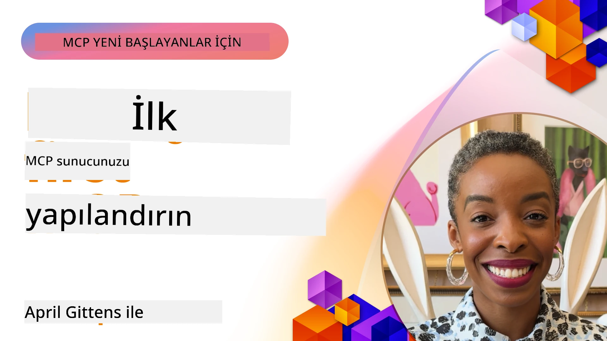

## Başlarken  

_(Bu dersin videosunu izlemek için yukarıdaki görsele tıklayın)_

Bu bölüm birkaç dersten oluşmaktadır:

- **1 İlk sunucunuz**, bu ilk derste, ilk sunucunuzu nasıl oluşturacağınızı ve sunucunuzu test etmek ve hata ayıklamak için değerli bir araç olan denetleyici aracı ile nasıl inceleyeceğinizi öğreneceksiniz, [derse git](01-first-server/README.md)

- **2 İstemci**, bu derste, sunucunuza bağlanabilen bir istemci nasıl yazılır öğreneceksiniz, [derse git](02-client/README.md)

- **3 LLM ile İstemci**, bir istemci yazmanın daha iyi bir yolu, sunucunuzla "müzakere" edebilmesi için ona bir LLM eklemektir, [derse git](03-llm-client/README.md)

- **4 Visual Studio Code'da GitHub Copilot Agent modunda bir sunucuyu tüketmek**. Burada, MCP Sunucumuzu Visual Studio Code içinde çalıştırmaya bakıyoruz, [derse git](04-vscode/README.md)

- **5 stdio Transport Server** stdio transport, yerel MCP sunucu-istemci iletişimi için önerilen standarttır, yerleşik süreç izolasyonu ile güvenli alt süreç tabanlı iletişim sağlar, [derse git](05-stdio-server/README.md)

- **6 MCP ile HTTP Streaming (Streamable HTTP)**. Modern HTTP streaming taşıma yöntemi hakkında bilgi edinin (uzaktaki MCP sunucular için önerilen yöntem [MCP Spesifikasyonu 2025-11-25](https://spec.modelcontextprotocol.io/specification/2025-11-25/basic/transports/#streamable-http) içinde), ilerleme bildirimlerini ve Streamable HTTP kullanarak ölçeklenebilir, gerçek zamanlı MCP sunucuları ve istemciler nasıl uygulanır, [derse git](06-http-streaming/README.md)

- **7 VSCode için AI Toolkit Kullanımı** MCP İstemcilerinizi ve Sunucularınızı tüketmek ve test etmek için, [derse git](07-aitk/README.md)

- **8 Test Etme**. Burada özellikle sunucumuzu ve istemcimizi farklı şekillerde nasıl test edebileceğimize odaklanacağız, [derse git](08-testing/README.md)

- **9 Dağıtım**. Bu bölüm MCP çözümlerinizi dağıtmanın farklı yollarını ele alacak, [derse git](09-deployment/README.md)

- **10 Gelişmiş sunucu kullanımı**. Bu bölüm gelişmiş sunucu kullanımını kapsar, [derse git](./10-advanced/README.md)

- **11 Kimlik Doğrulama**. Bu bölüm Basic Auth'tan JWT ve RBAC kullanmaya kadar basit kimlik doğrulama eklemeyi kapsar. Buradan başlamanız ve ardından Bölüm 5'teki Gelişmiş Konuları incelemeniz ve Bölüm 2'deki önerilerle ek güvenlik sertleştirmesi yapmanız önerilir, [derse git](./11-simple-auth/README.md)

- **12 MCP Hostları**. Claude Desktop, Cursor, Cline ve Windsurf gibi popüler MCP host istemcilerini yapılandırma ve kullanma. Taşıma türleri ve sorun giderme hakkında bilgi edinin, [derse git](./12-mcp-hosts/README.md)

- **13 MCP Denetleyici**. MCP denetleyici aracı kullanarak MCP sunucularınızı etkileşimli olarak hata ayıklayın ve test edin. Araçlar, kaynaklar ve protokol mesajları ile sorun giderme öğrenin, [derse git](./13-mcp-inspector/README.md)

Model Context Protocol (MCP), uygulamaların LLM'lere bağlam sunmasını standartlaştıran açık bir protokoldür. MCP'yi yapay zeka uygulamaları için bir USB-C portu gibi düşünebilirsiniz - AI modelleri farklı veri kaynakları ve araçlarla standart bir yolla bağlanmasını sağlar.

## Öğrenme Hedefleri

Bu dersin sonunda:

- C#, Java, Python, TypeScript ve JavaScript'te MCP geliştirme ortamlarını kurabileceksiniz
- Özel özelliklerle (kaynaklar, istemler ve araçlar) temel MCP sunucuları oluşturup dağıtabileceksiniz
- MCP sunucularına bağlanan host uygulamaları oluşturabileceksiniz
- MCP uygulamalarını test edip hata ayıklayabileceksiniz
- Yaygın kurulum zorluklarını ve çözümlerini anlayabileceksiniz
- MCP uygulamalarınızı popüler LLM servislerine bağlayabileceksiniz

## MCP Ortamınızı Kurma

MCP ile çalışmaya başlamadan önce geliştirme ortamınızı hazırlamak ve temel iş akışını anlamak önemlidir. Bu bölüm, MCP ile sorunsuz bir başlangıç yapmanız için ilk kurulum adımlarında size rehberlik edecektir.

### Önkoşullar

MCP geliştirmeye başlamadan önce şunlara sahip olduğunuzdan emin olun:

- **Geliştirme Ortamı**: Seçtiğiniz dil için (C#, Java, Python, TypeScript veya JavaScript)
- **IDE/Editör**: Visual Studio, Visual Studio Code, IntelliJ, Eclipse, PyCharm veya herhangi modern bir kod editörü
- **Paket Yöneticileri**: NuGet, Maven/Gradle, pip veya npm/yarn
- **API Anahtarları**: Host uygulamalarınızda kullanmayı planladığınız herhangi bir AI servisi için

### Resmi SDK'lar

Gelecek bölümlerde Python, TypeScript, Java ve .NET kullanılarak oluşturulan çözümleri göreceksiniz. İşte tamamen resmi olarak desteklenen SDK'lar.

MCP, çoklu diller için resmi SDK'lar sağlar ([MCP Spesifikasyonu 2025-11-25](https://spec.modelcontextprotocol.io/specification/2025-11-25/) ile uyumlu):
- [C# SDK](https://github.com/modelcontextprotocol/csharp-sdk) - Microsoft ile iş birliği içinde geliştirilmektedir
- [Java SDK](https://github.com/modelcontextprotocol/java-sdk) - Spring AI ile iş birliği içinde sürdürülmektedir
- [TypeScript SDK](https://github.com/modelcontextprotocol/typescript-sdk) - Resmi TypeScript uygulaması
- [Python SDK](https://github.com/modelcontextprotocol/python-sdk) - Resmi Python uygulaması (FastMCP)
- [Kotlin SDK](https://github.com/modelcontextprotocol/kotlin-sdk) - Resmi Kotlin uygulaması
- [Swift SDK](https://github.com/modelcontextprotocol/swift-sdk) - Loopwork AI ile iş birliği içinde sürdürülmektedir
- [Rust SDK](https://github.com/modelcontextprotocol/rust-sdk) - Resmi Rust uygulaması
- [Go SDK](https://github.com/modelcontextprotocol/go-sdk) - Resmi Go uygulaması

## Önemli Noktalar

- MCP geliştirme ortamının kurulumu, dil spesifik SDK'lar ile kolaydır
- MCP sunucusu oluşturmak, açık şemalara sahip araçlar yaratıp kaydetmeyi içerir
- MCP istemcileri, genişletilmiş yeteneklerden faydalanmak için sunuculara ve modellere bağlanır
- Test ve hata ayıklama, güvenilir MCP uygulamaları için gereklidir
- Dağıtım seçenekleri yerel geliştirmeden bulut tabanlı çözümlere kadar çeşitlidir

## Uygulama

Bu bölümde göreceğiniz tüm alıştırmaları destekleyen bir dizi örneğimiz var. Ayrıca her bölümde kendi alıştırmaları ve görevleri mevcuttur.

- [Java Hesap Makinesi](./samples/java/calculator/README.md)
- [.Net Hesap Makinesi](../../../03-GettingStarted/samples/csharp)
- [JavaScript Hesap Makinesi](./samples/javascript/README.md)
- [TypeScript Hesap Makinesi](./samples/typescript/README.md)
- [Python Hesap Makinesi](../../../03-GettingStarted/samples/python)

## Ek Kaynaklar

- [Azure'da Model Context Protocol kullanarak Ajanlar Oluşturma](https://learn.microsoft.com/azure/developer/ai/intro-agents-mcp)
- [Azure Container Apps ile Uzak MCP (Node.js/TypeScript/JavaScript)](https://learn.microsoft.com/samples/azure-samples/mcp-container-ts/mcp-container-ts/)
- [.NET OpenAI MCP Agent](https://learn.microsoft.com/samples/azure-samples/openai-mcp-agent-dotnet/openai-mcp-agent-dotnet/)

## Sonraki Ne Geliyor

İlk dersle başlayın: [İlk MCP Sunucunuzu Oluşturma](01-first-server/README.md)

Bu modülü tamamladıktan sonra devam edin: [Modül 4: Pratik Uygulama](../04-PracticalImplementation/README.md)

---

<!-- CO-OP TRANSLATOR DISCLAIMER START -->
**Feragatname**:  
Bu belge, AI çeviri hizmeti [Co-op Translator](https://github.com/Azure/co-op-translator) kullanılarak çevrilmiştir. Doğruluk için çaba göstersek de, otomatik çevirilerin hata veya yanlışlık içerebileceğini lütfen unutmayın. Orijinal belge, kendi dilinde yetkili kaynak olarak kabul edilmelidir. Kritik bilgiler için profesyonel insan çevirisi önerilir. Bu çevirinin kullanılmasıyla ortaya çıkabilecek herhangi bir yanlış anlama veya yorumdan sorumlu değiliz.
<!-- CO-OP TRANSLATOR DISCLAIMER END -->