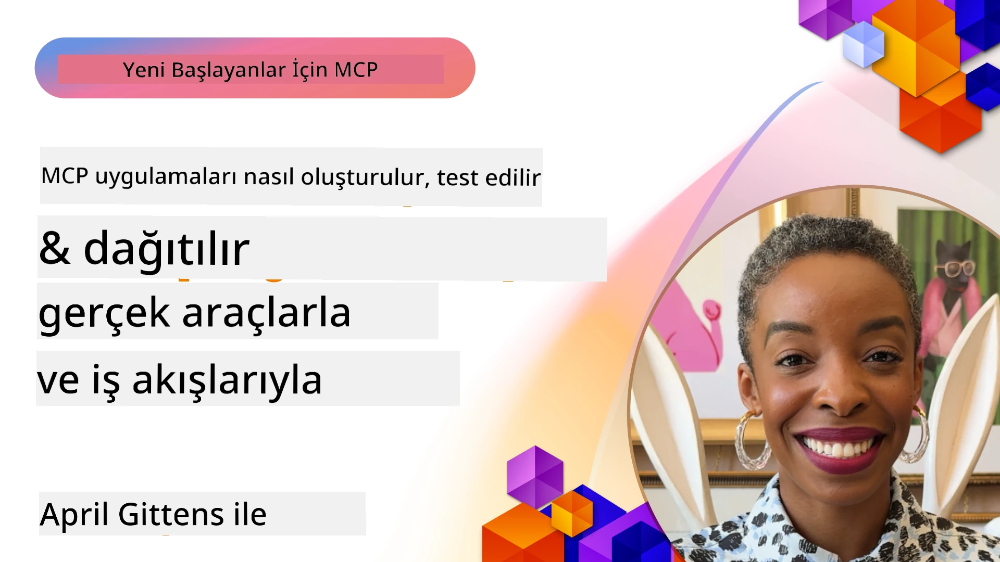

# Pratik Uygulama

[](https://youtu.be/vCN9-mKBDfQ)

_(Bu dersin videosunu izlemek için yukarıdaki resme tıklayın)_

Pratik uygulama, Model Context Protocol’ün (MCP) gücünün somut hale geldiği yerdir. MCP’nin teorisini ve mimarisini anlamak önemli olmakla birlikte, gerçek değer bu kavramları kullanarak gerçek dünya problemlerini çözen çözümler geliştirdiğinizde ortaya çıkar. Bu bölüm, kavramsal bilgi ile uygulamalı geliştirme arasındaki boşluğu kapatır ve MCP tabanlı uygulamaları hayata geçirme sürecinde size rehberlik eder.

İster akıllı asistanlar geliştiriyor olun, ister işletme iş akışlarına yapay zekayı entegre ediyor olun veya veri işleme için özel araçlar inşa ediyor olun, MCP esnek bir temel sağlar. Dil bağımsız tasarımı ve popüler programlama dilleri için resmi SDK’ları sayesinde geniş bir geliştirici kitlesine erişilebilir. Bu SDK’ları kullanarak çözümlerinizi hızlıca prototipleyebilir, deneyebilir ve farklı platformlar ile ortamlarda ölçeklendirebilirsiniz.

Aşağıdaki bölümlerde, C#, Java Spring ile, TypeScript, JavaScript ve Python’da MCP nasıl uygulanır, örnek kodlar, dağıtım stratejileri, MCP sunucularının nasıl hata ayıklanıp test edileceği, API yönetimi ve Azure kullanarak buluta çözümlerin nasıl dağıtılacağı gibi pratik örnekleri bulacaksınız. Bu uygulamalı kaynaklar, öğrenmenizi hızlandırmak ve güçlü, üretim hazır MCP uygulamaları geliştirirken size güven kazandırmak için tasarlanmıştır.

## Genel Bakış

Bu ders, MCP uygulamasının çoklu programlama dillerindeki pratik yönlerine odaklanmaktadır. C#, Java Spring, TypeScript, JavaScript ve Python’da MCP SDK’larının nasıl kullanılacağını, sağlam uygulamalar inşa etmeyi, MCP sunucularının hata ayıklanmasını ve test edilmesini ve yeniden kullanılabilir kaynaklar, istemler (prompts) ve araçlar oluşturmayı keşfedeceğiz.

## Öğrenme Hedefleri

Bu dersin sonunda şunları yapabileceksiniz:

- Resmi SDK’ları kullanarak çeşitli programlama dillerinde MCP çözümleri uygulamak
- MCP sunucularını sistematik olarak hata ayıklamak ve test etmek
- Sunucu özellikleri (Kaynaklar, İstemler ve Araçlar) oluşturmak ve kullanmak
- Karmaşık görevler için etkili MCP iş akışları tasarlamak
- MCP uygulamalarını performans ve güvenilirlik açısından optimize etmek

## Resmi SDK Kaynakları

Model Context Protocol, birden çok dil için resmi SDK’lar sunmaktadır ([MCP Spesifikasyonu 2025-11-25](https://spec.modelcontextprotocol.io/specification/2025-11-25/) ile uyumlu):

- [C# SDK](https://github.com/modelcontextprotocol/csharp-sdk)
- [Java Spring SDK](https://github.com/modelcontextprotocol/java-sdk) **Not:** [Project Reactor](https://projectreactor.io) bağımlılığı gerektirir. (Bkz. [tartışma konusu 246](https://github.com/orgs/modelcontextprotocol/discussions/246).)
- [TypeScript SDK](https://github.com/modelcontextprotocol/typescript-sdk)
- [Python SDK](https://github.com/modelcontextprotocol/python-sdk)
- [Kotlin SDK](https://github.com/modelcontextprotocol/kotlin-sdk)
- [Go SDK](https://github.com/modelcontextprotocol/go-sdk)

## MCP SDK’ları ile Çalışma

Bu bölüm, MCP’nin çoklu programlama dillerinde nasıl uygulanacağına dair pratik örnekler sunar. Dil bazında organize edilmiş örnek kodlar `samples` dizininde bulunabilir.

### Mevcut Örnekler

Depoda aşağıdaki dillerde [örnek uygulamalar](../../../04-PracticalImplementation/samples) mevcuttur:

- [C#](./samples/csharp/README.md)
- [Java Spring ile](./samples/java/containerapp/README.md)
- [TypeScript](./samples/typescript/README.md)
- [JavaScript](./samples/javascript/README.md)
- [Python](./samples/python/README.md)

Her örnek, o dil ve ekosistem için temel MCP kavramlarını ve uygulama kalıplarını göstermektedir.

### Pratik Rehberler

Pratik MCP uygulamaları için ek rehberler:

- [Sayfalandırma ve Büyük Sonuç Setleri](./pagination/README.md) - araçlar, kaynaklar ve büyük veri kümeleri için imleç tabanlı sayfalandırma yönetimi

## Temel Sunucu Özellikleri

MCP sunucuları aşağıdaki özellikleri herhangi bir kombinasyonda uygulayabilir:

### Kaynaklar

Kaynaklar, kullanıcı veya yapay zeka modelinin kullanacağı bağlam ve veriyi sağlar:

- Belge depoları
- Bilgi tabanları
- Yapılandırılmış veri kaynakları
- Dosya sistemleri

### İstemler (Prompts)

İstemler, kullanıcılar için şablonlanmış mesajlar ve iş akışlarıdır:

- Önceden tanımlanmış konuşma şablonları
- Yönlendirilmiş etkileşim desenleri
- Özelleşmiş diyalog yapıları

### Araçlar

Araçlar, yapay zeka modelinin çalıştıracağı fonksiyonlardır:

- Veri işleme araçları
- Harici API entegrasyonları
- Hesaplamalı yetenekler
- Arama fonksiyonları

## Örnek Uygulamalar: C# Uygulaması

Resmi C# SDK deposunda MCP’nin farklı yönlerini gösteren çeşitli örnek uygulamalar bulunur:

- **Temel MCP İstemcisi**: MCP istemcisi oluşturmayı ve araçları çağırmayı gösteren basit örnek
- **Temel MCP Sunucusu**: Basit araç kaydını içeren minimal sunucu uygulaması
- **Gelişmiş MCP Sunucusu**: Tam özellikli sunucu; araç kaydı, kimlik doğrulama ve hata yönetimi
- **ASP.NET Entegrasyonu**: ASP.NET Core ile entegrasyon örnekleri
- **Araç Uygulama Kalıpları**: Farklı karmaşıklık düzeylerinde araç uygulama kalıpları

MCP C# SDK önizlemededir ve API'lerde değişiklik olabilir. SDK geliştikçe bu bloğu sürekli güncelleyeceğiz.

### Ana Özellikler

- [C# MCP Nuget ModelContextProtocol](https://www.nuget.org/packages/ModelContextProtocol)
- [İlk MCP Sunucunuzu oluşturma](https://devblogs.microsoft.com/dotnet/build-a-model-context-protocol-mcp-server-in-csharp/).

Tam C# uygulama örnekleri için [resmi C# SDK örnek deposunu](https://github.com/modelcontextprotocol/csharp-sdk) ziyaret edin.

## Örnek Uygulama: Java Spring ile Uygulama

Java Spring SDK, kurumsal düzeyde özelliklerle güçlü MCP uygulama seçenekleri sunar.

### Ana Özellikler

- Spring Framework entegrasyonu
- Güçlü tip güvenliği
- Reaktif programlama desteği
- Kapsamlı hata yönetimi

Tam bir Java Spring uygulama örneği için örnekler dizinindeki [Java Spring örneğine](samples/java/containerapp/README.md) bakabilirsiniz.

## Örnek Uygulama: JavaScript Uygulaması

JavaScript SDK, MCP uygulaması için hafif ve esnek bir yaklaşım sunar.

### Ana Özellikler

- Node.js ve tarayıcı desteği
- Promise tabanlı API
- Express ve diğer frameworklerle kolay entegrasyon
- Akış için WebSocket desteği

Tam bir JavaScript uygulama örneği için örnekler dizinindeki [JavaScript örneğine](samples/javascript/README.md) bakınız.

## Örnek Uygulama: Python Uygulaması

Python SDK, ML frameworkleriyle mükemmel entegrasyon sağlayan Python dostu bir MCP uygulama yaklaşımı sunar.

### Ana Özellikler

- asyncio ile async/await desteği
- FastAPI entegrasyonu
- Basit araç kaydı
- Popüler ML kütüphaneleri ile yerel entegrasyon

Tam bir Python uygulama örneği için örnekler dizinindeki [Python örneğine](samples/python/README.md) bakabilirsiniz.

## API Yönetimi

Azure API Management, MCP Sunucularını nasıl güvenlik altına alabileceğimize dair harika bir çözümdür. Fikir, MCP Sunucunuzun önüne bir Azure API Management örneği koymak ve şöyle işlevleri yönetmesini sağlamaktır:

- kota sınırlandırma
- token yönetimi
- izleme
- yük dengeleme
- güvenlik

### Azure Örneği

İşte tam olarak bunu yapan bir Azure Örneği, yani [bir MCP Sunucu oluşturup Azure API Management ile güvenliğini sağlamak](https://github.com/Azure-Samples/remote-mcp-apim-functions-python).

Yetkilendirme akışının aşağıdaki görselde nasıl gerçekleştiğine bakınız:


Yukarıdaki görüntüde şunlar gerçekleşir:

- Kimlik doğrulama/Yetkilendirme Microsoft Entra kullanılarak yapılır.
- Azure API Management bir ağ geçidi görevi görür ve politikalar ile trafiği yönlendirip yönetir.
- Azure Monitor tüm istekleri analiz için kaydeder.

#### Yetkilendirme akışı

Yetkilendirme akışına daha detaylı bakalım:


#### MCP yetkilendirme spesifikasyonu

[MCP Yetkilendirme spesifikasyonunu](https://spec.modelcontextprotocol.io/specification/2025-11-25/basic/authorization/) daha detaylı öğrenin.

## Uzak MCP Sunucusunu Azure’a Dağıtma

Daha önce bahsettiğimiz örneği dağıtabilir miyiz görelim:

1. Depoyu klonlayın

    ```bash
    git clone https://github.com/Azure-Samples/remote-mcp-apim-functions-python.git
    cd remote-mcp-apim-functions-python
    ```

1. `Microsoft.App` kaynak sağlayıcısını kaydedin.

   - Azure CLI kullanıyorsanız, `az provider register --namespace Microsoft.App --wait` komutunu çalıştırın.
   - Azure PowerShell kullanıyorsanız, `Register-AzResourceProvider -ProviderNamespace Microsoft.App` komutunu çalıştırın. Ardından kaydın tamamlanıp tamamlanmadığını kontrol etmek için biraz bekleyip `(Get-AzResourceProvider -ProviderNamespace Microsoft.App).RegistrationState` komutunu çalıştırın.

1. Bu [azd](https://aka.ms/azd) komutunu çalıştırarak api yönetim servisini, fonksiyon uygulamasını (kod ile) ve diğer tüm gerekli Azure kaynaklarını oluşturun

    ```shell
    azd up
    ```

    Bu komutlar tüm bulut kaynaklarını Azure üzerinde dağıtmalıdır.

### MCP Inspector ile sunucunuzu test etme

1. **Yeni bir terminal penceresinde** MCP Inspector'ı yükleyin ve çalıştırın

    ```shell
    npx @modelcontextprotocol/inspector
    ```

    Aşağıdaki gibi bir arayüz görmelisiniz:

    

1. Uygulamanın gösterdiği URL’den (örn. [http://127.0.0.1:6274/#resources](http://127.0.0.1:6274/#resources)) MCP Inspector web uygulamasını CTRL tıklayarak açın
1. Taşıma türünü `SSE` olarak ayarlayın
1. `azd up` sonrası gösterilen çalışan API Yönetim SSE uç noktasını URL olarak girin ve **Bağlan**’a tıklayın:

    ```shell
    https://<apim-servicename-from-azd-output>.azure-api.net/mcp/sse
    ```

1. **Araçları Listele**. Bir araca tıklayın ve **Aracı Çalıştır**.

Tüm adımlar başarılı olduysa, MCP sunucusuna bağlandınız ve bir aracı çağırabilmiş olmalısınız.

## Azure için MCP sunucuları

[Remote-mcp-functions](https://github.com/Azure-Samples/remote-mcp-functions-dotnet): Bu depo setleri, Python, C# .NET veya Node/TypeScript kullanarak Azure Functions ile özel uzak MCP (Model Context Protocol) sunucuları oluşturma ve dağıtma için hızlı başlangıç şablonlarıdır.

Örnekler, geliştiricilerin şunları yapmasını sağlar:

- Yerel olarak oluşturma ve çalıştırma: MCP sunucusunu yerel makinede geliştirme ve hata ayıklama
- Azure’a dağıtım: Tek bir azd up komutuyla kolay bulut dağıtımı
- İstemcilerden bağlantı: VS Code’un Copilot agent modu ve MCP Inspector aracı dahil çeşitli istemcilerden MCP sunucusuna bağlantı

### Ana Özellikler

- Tasarım gereği güvenlik: MCP sunucusu anahtarlar ve HTTPS ile korunur
- Kimlik doğrulama seçenekleri: Yerleşik kimlik doğrulama ve/veya API Yönetimi ile OAuth desteği
- Ağ izolasyonu: Azure Sanal Ağlar (VNET) ile ağ izolasyonu imkanı
- Sunucusuz mimari: Ölçeklenebilir, olay tetikli yürütme için Azure Functions kullanımı
- Yerel geliştirme: Kapsamlı yerel geliştirme ve hata ayıklama desteği
- Basit dağıtım: Azure’a kolaylaştırılmış dağıtım süreci

Depoda, üretim hazır MCP sunucu uygulamasına hızlı başlamak için gerekli tüm yapılandırma dosyaları, kaynak kodu ve altyapı tanımları yer almaktadır.

- [Azure Remote MCP Functions Python](https://github.com/Azure-Samples/remote-mcp-functions-python) - Python ile Azure Functions kullanarak MCP örnek uygulaması

- [Azure Remote MCP Functions .NET](https://github.com/Azure-Samples/remote-mcp-functions-dotnet) - C# .NET ile Azure Functions kullanarak MCP örnek uygulaması

- [Azure Remote MCP Functions Node/Typescript](https://github.com/Azure-Samples/remote-mcp-functions-typescript) - Node/TypeScript ile Azure Functions kullanarak MCP örnek uygulaması

## Anahtar Çıkarımlar

- MCP SDK’ları, sağlam MCP çözümleri için dile özgü araçlar sağlar
- Hata ayıklama ve test süreci, güvenilir MCP uygulamaları için kritik önemdedir
- Tekrar kullanılabilir istem şablonları tutarlı AI etkileşimleri sağlar
- İyi tasarlanmış iş akışları birden çok araç kullanarak karmaşık görevleri koordine eder
- MCP çözümlerinin uygulanması güvenlik, performans ve hata yönetimi dikkate almalıdır

## Egzersiz

Sizin alanınızdaki gerçek bir problemi ele alan pratik bir MCP iş akışı tasarlayın:

1. Bu problemi çözmek için faydalı olabilecek 3-4 aracı belirleyin
2. Bu araçların nasıl etkileşime girdiğini gösteren bir iş akış diyagramı oluşturun
3. Tercih ettiğiniz dilde araçlardan birinin temel bir versiyonunu uygulayın
4. Modelin aracınızı etkili kullanmasına yardımcı olacak bir istem şablonu oluşturun

## Ek Kaynaklar

---

## Sıradaki Ne

Sonraki: [Gelişmiş Konular](../05-AdvancedTopics/README.md)

---

<!-- CO-OP TRANSLATOR DISCLAIMER START -->
**Feragatname**:  
Bu belge, AI çeviri servisi [Co-op Translator](https://github.com/Azure/co-op-translator) kullanılarak çevrilmiştir. Doğruluk için çaba sarf etsek de, otomatik çevirilerin hata veya yanlışlık içerebileceğini lütfen unutmayınız. Orijinal belge, kendi yerel dilinde yetkili kaynak olarak kabul edilmelidir. Kritik bilgiler için profesyonel insan çevirisi önerilir. Bu çevirinin kullanımı sonucu ortaya çıkabilecek herhangi bir yanlış anlama veya yanlış yorumlamadan sorumlu değiliz.
<!-- CO-OP TRANSLATOR DISCLAIMER END -->