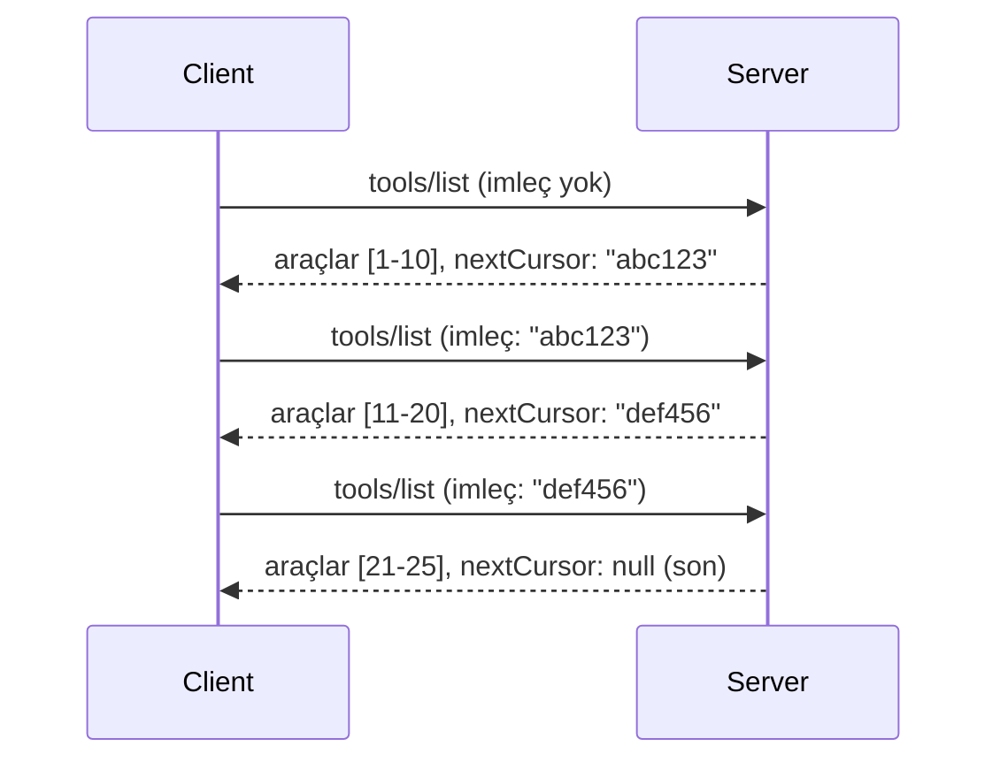

# MCP'de Sayfalandırma ve Büyük Sonuç Kümeleri

MCP sunucunuz büyük veri setlerini işlediğinde - binlerce dosya, veritabanı kaydı veya arama sonucu listelemek olsun - belleği verimli yönetmek ve duyarlı kullanıcı deneyimleri sağlamak için sayfalandırmaya ihtiyacınız vardır. Bu rehber, MCP'de sayfalandırmanın nasıl uygulanacağını ve kullanılacağını anlatır.

## Neden Sayfalandırma Önemlidir

Sayfalandırma olmazsa, büyük yanıtlar şunlara yol açabilir:

- **Bellek tükenmesi** - Aynı anda milyonlarca kaydın yüklenmesi
- **Yavaş yanıt süreleri** - Tüm veriler yüklenirken kullanıcıların beklemesi
- **Zaman aşımı hataları** - İsteklerin zaman aşımı sınırını aşması
- **Zayıf AI performansı** - Büyük bağlam ile LLM'lerin zorlanması

MCP, sonuç kümelerini güvenilir ve tutarlı şekilde sayfalamak için **imleç tabanlı (cursor-based) sayfalandırma** kullanır.

---

## MCP Sayfalandırması Nasıl Çalışır

### İmleç (Cursor) Kavramı

Bir **imleç**, sonuç kümenizdeki konumunuzu işaret eden opak bir dizgedir. Uzun bir kitaptaki ayraç gibi düşünün.


### MCP Yöntemlerinde Sayfalandırma

Aşağıdaki MCP yöntemleri sayfalandırmayı destekler:

| Yöntem | Döndürür | İmleç Desteği |
|--------|----------|---------------|
| `tools/list` | Araç tanımları | ✅ |
| `resources/list` | Kaynak tanımları | ✅ |
| `prompts/list` | İstek tanımları | ✅ |
| `resources/templates/list` | Kaynak şablonları | ✅ |

---

## Sunucu Uygulaması

### Python (FastMCP)

```python
from mcp.server import Server
from mcp.types import Tool, ListToolsResult
import math

app = Server("paginated-server")

# Simüle edilmiş büyük veri kümesi
ALL_TOOLS = [
    Tool(name=f"tool_{i}", description=f"Tool number {i}", inputSchema={})
    for i in range(100)
]

PAGE_SIZE = 10

@app.list_tools()
async def list_tools(cursor: str | None = None) -> ListToolsResult:
    """List tools with pagination support."""
    
    # Başlangıç indeksini almak için imleci çöz
    start_index = 0
    if cursor:
        try:
            start_index = int(cursor)
        except ValueError:
            start_index = 0
    
    # Sonuç sayfasını al
    end_index = min(start_index + PAGE_SIZE, len(ALL_TOOLS))
    page_tools = ALL_TOOLS[start_index:end_index]
    
    # Bir sonraki imleci hesapla
    next_cursor = None
    if end_index < len(ALL_TOOLS):
        next_cursor = str(end_index)
    
    return ListToolsResult(
        tools=page_tools,
        nextCursor=next_cursor
    )
```

### TypeScript

```typescript
import { Server } from "@modelcontextprotocol/sdk/server/index.js";
import { ListToolsResultSchema } from "@modelcontextprotocol/sdk/types.js";

const server = new Server({
  name: "paginated-server",
  version: "1.0.0"
});

// Simüle edilmiş büyük veri seti
const ALL_TOOLS = Array.from({ length: 100 }, (_, i) => ({
  name: `tool_${i}`,
  description: `Tool number ${i}`,
  inputSchema: { type: "object", properties: {} }
}));

const PAGE_SIZE = 10;

server.setRequestHandler(ListToolsResultSchema, async (request) => {
  // İmleci çöz
  let startIndex = 0;
  if (request.params?.cursor) {
    startIndex = parseInt(request.params.cursor, 10) || 0;
  }
  
  // Sonuç sayfasını al
  const endIndex = Math.min(startIndex + PAGE_SIZE, ALL_TOOLS.length);
  const pageTools = ALL_TOOLS.slice(startIndex, endIndex);
  
  // Sonraki imleci hesapla
  const nextCursor = endIndex < ALL_TOOLS.length ? String(endIndex) : undefined;
  
  return {
    tools: pageTools,
    nextCursor
  };
});
```

### Java (Spring MCP)

```java
@Service
public class PaginatedToolService {
    
    private static final int PAGE_SIZE = 10;
    private final List<Tool> allTools;
    
    public PaginatedToolService() {
        // Büyük veri kümesini başlat
        this.allTools = IntStream.range(0, 100)
            .mapToObj(i -> new Tool("tool_" + i, "Tool number " + i, Map.of()))
            .collect(Collectors.toList());
    }
    
    @McpMethod("tools/list")
    public ListToolsResult listTools(@Param("cursor") String cursor) {
        // İmleci çöz
        int startIndex = 0;
        if (cursor != null && !cursor.isEmpty()) {
            try {
                startIndex = Integer.parseInt(cursor);
            } catch (NumberFormatException e) {
                startIndex = 0;
            }
        }
        
        // Sonuç sayfasını al
        int endIndex = Math.min(startIndex + PAGE_SIZE, allTools.size());
        List<Tool> pageTools = allTools.subList(startIndex, endIndex);
        
        // Sonraki imleci hesapla
        String nextCursor = endIndex < allTools.size() ? String.valueOf(endIndex) : null;
        
        return new ListToolsResult(pageTools, nextCursor);
    }
}
```

---

## İstemci Uygulaması

### Python İstemcisi

```python
from mcp import ClientSession

async def get_all_tools(session: ClientSession) -> list:
    """Fetch all tools using pagination."""
    all_tools = []
    cursor = None
    
    while True:
        result = await session.list_tools(cursor=cursor)
        all_tools.extend(result.tools)
        
        if result.nextCursor is None:
            break
        cursor = result.nextCursor
    
    return all_tools

# Kullanım
async with client_session as session:
    tools = await get_all_tools(session)
    print(f"Found {len(tools)} tools")
```

### TypeScript İstemcisi

```typescript
import { Client } from "@modelcontextprotocol/sdk/client/index.js";

async function getAllTools(client: Client): Promise<Tool[]> {
  const allTools: Tool[] = [];
  let cursor: string | undefined = undefined;
  
  do {
    const result = await client.listTools({ cursor });
    allTools.push(...result.tools);
    cursor = result.nextCursor;
  } while (cursor);
  
  return allTools;
}

// Kullanım
const tools = await getAllTools(client);
console.log(`Found ${tools.length} tools`);
```

### Tembel Yükleme Deseni

Çok büyük veri setleri için, sayfaları talep üzerine yükleyin:

```python
class PaginatedToolIterator:
    """Lazily iterate through paginated tools."""
    
    def __init__(self, session: ClientSession):
        self.session = session
        self.cursor = None
        self.buffer = []
        self.exhausted = False
    
    async def __anext__(self):
        # Kullanılabilir ise buffer'dan dön
        if self.buffer:
            return self.buffer.pop(0)
        
        # Tüm sayfaların tükenip tükenmediğini kontrol et
        if self.exhausted:
            raise StopAsyncIteration
        
        # Sonraki sayfayı getir
        result = await self.session.list_tools(cursor=self.cursor)
        self.buffer = list(result.tools)
        self.cursor = result.nextCursor
        
        if self.cursor is None:
            self.exhausted = True
        
        if not self.buffer:
            raise StopAsyncIteration
        
        return self.buffer.pop(0)
    
    def __aiter__(self):
        return self

# Kullanım - büyük veri setleri için bellek açısından verimli
async for tool in PaginatedToolIterator(session):
    process_tool(tool)
```

---

## Kaynaklar için Sayfalandırma

Kaynaklar genellikle dizinler veya büyük veri setleri için sayfalandırma gerektirir:

```python
from mcp.server import Server
from mcp.types import Resource, ListResourcesResult
import os

app = Server("file-server")

@app.list_resources()
async def list_resources(cursor: str | None = None) -> ListResourcesResult:
    """List files in directory with pagination."""
    
    directory = "/data/files"
    all_files = sorted(os.listdir(directory))
    
    # İmleci çöz (dosya dizini)
    start_index = int(cursor) if cursor else 0
    page_size = 20
    end_index = min(start_index + page_size, len(all_files))
    
    # Bu sayfa için kaynak listesi oluştur
    resources = []
    for filename in all_files[start_index:end_index]:
        filepath = os.path.join(directory, filename)
        resources.append(Resource(
            uri=f"file://{filepath}",
            name=filename,
            mimeType="application/octet-stream"
        ))
    
    # Sonraki imleci hesapla
    next_cursor = str(end_index) if end_index < len(all_files) else None
    
    return ListResourcesResult(
        resources=resources,
        nextCursor=next_cursor
    )
```

---

## İmleç Tasarım Stratejileri

### Strateji 1: İndex Tabanlı (Basit)

```python
# İmleç sadece indekstir
cursor = "50"  # 50. öğeden başla
```

**Artıları:** Basit, durumsuz  
**Eksileri:** Eleman eklenip çıkarılırsa sonuçlar kayabilir

### Strateji 2: ID Tabanlı (Kararlı)

```python
# İmleç son görülen ID'dir
cursor = "item_abc123"  # Bu öğeden sonra başla
```

**Artıları:** Elemanlar değişse bile kararlı  
**Eksileri:** Sıralı ID'ler gerektirir

### Strateji 3: Kodlanmış Durum (Karmaşık)

```python
import base64
import json

def encode_cursor(state: dict) -> str:
    return base64.b64encode(json.dumps(state).encode()).decode()

def decode_cursor(cursor: str) -> dict:
    return json.loads(base64.b64decode(cursor).decode())

# İmleç birden fazla durum alanı içerir
cursor = encode_cursor({
    "offset": 50,
    "filter": "active",
    "sort": "name"
})
```

**Artıları:** Karmaşık durumu kodlayabilir  
**Eksileri:** Daha karmaşık, daha uzun imleç dizgeleri

---

## En İyi Uygulamalar

### 1. Uygun Sayfa Boyutları Seçin

```python
# Veri boyutunu göz önünde bulundurun
PAGE_SIZE_SMALL_ITEMS = 100   # Basit meta veriler
PAGE_SIZE_MEDIUM_ITEMS = 20   # Daha zengin nesneler
PAGE_SIZE_LARGE_ITEMS = 5     # Karmaşık içerik
```

### 2. Geçersiz İmleçleri Zarifçe Yönetin

```python
@app.list_tools()
async def list_tools(cursor: str | None = None) -> ListToolsResult:
    try:
        start_index = int(cursor) if cursor else 0
        if start_index < 0 or start_index >= len(ALL_TOOLS):
            start_index = 0  # Baştan sıfırlama
    except (ValueError, TypeError):
        start_index = 0  # Geçersiz imleç, yeniden başla
    # ...
```

### 3. Toplam Sayıyı Dahil Edin (İsteğe Bağlı)

```python
return ListToolsResult(
    tools=page_tools,
    nextCursor=next_cursor,
    # Bazı uygulamalarda kullanıcı arayüzü ilerlemesi için toplam dahil edilir
    _meta={"total": len(ALL_TOOLS)}
)
```

### 4. Kenar Durumları Test Edin

```python
async def test_pagination():
    # Boş sonuç kümesi
    result = await session.list_tools()
    assert result.tools == []
    assert result.nextCursor is None
    
    # Tek sayfa
    result = await session.list_tools()
    assert len(result.tools) <= PAGE_SIZE
    
    # Geçersiz imleç
    result = await session.list_tools(cursor="invalid")
    assert result.tools  # İlk sayfayı döndürmeli
```

---

## Yaygın Tuzaklar

### ❌ Tüm Sonuçları Döndürüp Sonra İstemci Tarafından Sayfalandırma

```python
# KÖTÜ: Her şeyi belleğe yüklüyor
@app.list_tools()
async def list_tools() -> ListToolsResult:
    all_tools = load_all_tools()  # 1 milyon araç!
    return ListToolsResult(tools=all_tools)
```

### ✅ Veri Kaynağında Sayfalandırma

```python
# İYİ: Sadece gerekenleri yükler
@app.list_tools()
async def list_tools(cursor: str | None = None) -> ListToolsResult:
    offset = int(cursor) if cursor else 0
    tools = await db.query_tools(offset=offset, limit=PAGE_SIZE)
    return ListToolsResult(tools=tools, nextCursor=...)
```

---

## Sırada Ne Var

- [Modül 5.14 - Bağlam Mühendisliği](../../05-AdvancedTopics/mcp-contextengineering/README.md)
- [Modül 8 - En İyi Uygulamalar](../../08-BestPractices/README.md)
- [3.8 - MCP Sunucunuzu Test Etme](../../03-GettingStarted/08-testing/README.md)

---

## Ek Kaynaklar

- [MCP Spesifikasyonu - Sayfalandırma](https://spec.modelcontextprotocol.io/specification/2025-11-25/)
- [İmleç Tabanlı Sayfalandırma Açıklaması](https://slack.engineering/evolving-api-pagination-at-slack/)
- [Python SDK sayfalandırma testleri](https://github.com/modelcontextprotocol/python-sdk/blob/main/tests/client/test_list_methods_cursor.py)

---

<!-- CO-OP TRANSLATOR DISCLAIMER START -->
**Feragatname**:  
Bu belge, AI çeviri servisi [Co-op Translator](https://github.com/Azure/co-op-translator) kullanılarak çevrilmiştir. Doğruluk için çaba gösterilmekle birlikte, otomatik çevirilerin hata veya yanlışlık içerebileceğini lütfen unutmayınız. Orijinal belge, kendi ana dilinde yetkili kaynak olarak kabul edilmelidir. Kritik bilgiler için profesyonel insan çevirisi önerilir. Bu çevirinin kullanımı sonucunda oluşabilecek herhangi bir yanlış anlama veya yanlış yorumlama nedeniyle sorumluluk kabul edilmez.
<!-- CO-OP TRANSLATOR DISCLAIMER END -->