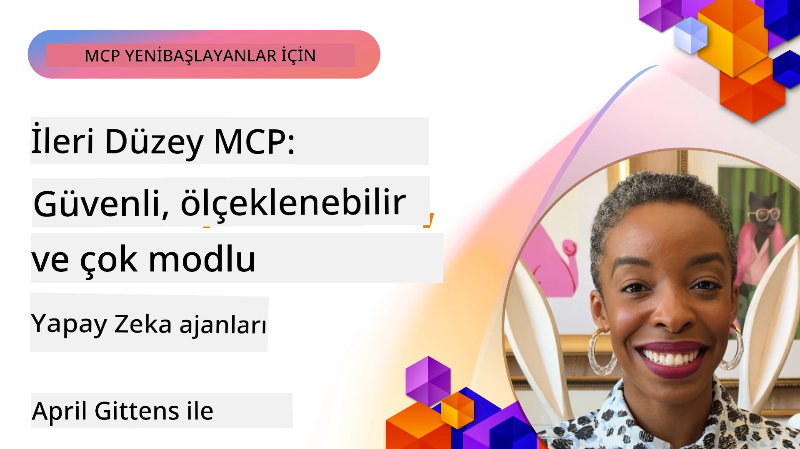

# MCP'de İleri Konular

_(Bu dersin videosunu izlemek için yukarıdaki resme tıklayın)_

Bu bölüm, Çok Modlu entegrasyon, ölçeklenebilirlik, güvenlik en iyi uygulamaları ve kurumsal entegrasyon da dahil olmak üzere Model Context Protocol (MCP) uygulamasındaki bir dizi ileri konuyu ele alır. Bu konular, modern AI sistemlerinin taleplerini karşılayabilecek sağlam ve üretime hazır MCP uygulamaları oluşturmak için hayati öneme sahiptir.

## Genel Bakış

Bu ders, Model Context Protocol uygulamasında çok modlu entegrasyon, ölçeklenebilirlik, güvenlik en iyi uygulamaları ve kurumsal entegrasyon üzerine gelişmiş kavramları keşfeder. Bu konular, kurumsal ortamlarda karmaşık gereksinimleri karşılayabilen üretim sınıfı MCP uygulamaları oluşturmak için gereklidir.

## Öğrenme Hedefleri

Bu dersin sonunda şunları yapabileceksiniz:

- MCP çerçeveleri içinde çok modlu yetenekler uygulamak
- Yüksek talep senaryoları için ölçeklenebilir MCP mimarileri tasarlamak
- MCP'nin güvenlik ilkelerine uygun güvenlik en iyi uygulamalarını uygulamak
- MCP'yi kurumsal AI sistemleri ve çerçeveleri ile entegre etmek
- Üretim ortamlarında performans ve güvenilirliği optimize etmek

## Dersler ve Örnek Projeler

| Bağlantı | Başlık | Açıklama |
|------|-------|-------------|
| [5.1 Azure ile Entegrasyon](./mcp-integration/README.md) | Azure ile Entegrasyon | MCP Server'ınızı Azure üzerinde nasıl entegre edeceğinizi öğrenin |
| [5.2 Çok modlu örnek](./mcp-multi-modality/README.md) | MCP Çok modlu örnekler | Ses, görsel ve çok modlu yanıtlar için örnekler |
| [5.3 MCP OAuth2 örneği](../../../05-AdvancedTopics/mcp-oauth2-demo) | MCP OAuth2 Demo | Authorization ve Resource Server olarak MCP ile OAuth2’yi gösteren minimal Spring Boot uygulaması. Güvenli token verme, korumalı uç noktalar, Azure Container Apps dağıtımı ve API Yönetimi entegrasyonu gösterilir. |
| [5.4 Kök Bağlamlar](./mcp-root-contexts/README.md) | Kök bağlamlar | Kök bağlam hakkında daha fazla bilgi edinin ve uygulama yöntemlerini öğrenin |
| [5.5 Yönlendirme](./mcp-routing/README.md) | Yönlendirme | Farklı yönlendirme türlerini öğrenin |
| [5.6 Örnekleme](./mcp-sampling/README.md) | Örnekleme | Örnekleme ile nasıl çalışılacağını öğrenin |
| [5.7 Ölçeklendirme](./mcp-scaling/README.md) | Ölçeklendirme | Ölçeklendirme hakkında bilgi edinin |
| [5.8 Güvenlik](./mcp-security/README.md) | Güvenlik | MCP Server’ınızı güvence altına alın |
| [5.9 Web Arama örneği](./web-search-mcp/README.md) | Web Arama MCP | Gerçek zamanlı web, haber, ürün araması ve Soru-Cevap için SerpAPI ile entegre Python MCP sunucu ve istemcisi. Çoklu araç orkestrasyonu, harici API entegrasyonu ve güçlü hata yönetimi gösterilir. |
| [5.10 Gerçek Zamanlı Akış](./mcp-realtimestreaming/README.md) | Akış | Günümüzün veri odaklı dünyasında, işletmelerin ve uygulamaların zamanında kararlar alabilmesi için gerçek zamanlı veri akışı hayati hale gelmiştir. |
| [5.11 Gerçek Zamanlı Web Arama](./mcp-realtimesearch/README.md) | Web Arama | MCP’nin AI modelleri, arama motorları ve uygulamalar arasında bağlam yönetimini standartlaştırarak gerçek zamanlı web aramasını nasıl dönüştürdüğünü öğrenin.| 
| [5.12 Model Context Protocol Sunucuları için Entra ID Kimlik Doğrulaması](./mcp-security-entra/README.md) | Entra ID Kimlik Doğrulaması | Microsoft Entra ID, yalnızca yetkili kullanıcılar ve uygulamaların MCP sunucunuzla etkileşimde bulunmasını sağlamak için güçlü bulut tabanlı kimlik ve erişim yönetimi sunar.|
| [5.13 Azure AI Foundry Ajan Entegrasyonu](./mcp-foundry-agent-integration/README.md) | Azure AI Foundry Entegrasyonu | Model Context Protocol sunucularını Azure AI Foundry ajanları ile entegre etmeyi öğrenin; standartlaştırılmış harici veri kaynağı bağlantıları ile güçlü araç orkestrasyonu ve kurumsal AI yetenekleri sağlar.|
| [5.14 Bağlam Mühendisliği](./mcp-contextengineering/README.md) | Bağlam Mühendisliği | MCP sunucuları için bağlam optimizasyonu, dinamik bağlam yönetimi ve etkili prompt mühendisliği stratejilerini içeren bağlam mühendisliği tekniklerinin gelecekteki fırsatları.|
| [5.15 MCP Özel Taşıma](./mcp-transport/README.md) | Özel Taşıma | Özelleşmiş MCP iletişim senaryoları için özel taşıma mekanizmalarını nasıl uygulayacağınızı öğrenin.|
| [5.16 Protokol Özellikleri Derinlemesine İnceleme](./mcp-protocol-features/README.md) | Protokol Özellikleri | İlerleme bildirimleri, istek iptali, kaynak şablonları ve hata yönetimi kalıpları dahil olmak üzere gelişmiş protokol özelliklerinde ustalaşın.|

> **MCP Spesifikasyonunda 2025-11-25'te Yeni**: Spesifikasyon artık **Görevler** (ilerleme takibiyle uzun süreli işlemler), **Araç Açıklamaları** (güvenlik için araç davranışı hakkında meta veriler), **URL Modu Talep Etme** (istemcilerden belirli URL içeriği isteme) ve gelişmiş **Kökler** (çalışma alanı bağlam yönetimi için) deneysel desteği içeriyor. Tam detaylar için [MCP Spesifikasyon değişiklik listesine](https://spec.modelcontextprotocol.io/) bakınız.

## Ek Referanslar

İleri MCP konuları hakkında en güncel bilgi için şunlara bakınız:
- [MCP Dokümantasyonu](https://modelcontextprotocol.io/)
- [MCP Spesifikasyonu (2025-11-25)](https://spec.modelcontextprotocol.io/specification/2025-11-25/)
- [GitHub Deposu](https://github.com/modelcontextprotocol)
- [OWASP MCP İlk 10](https://microsoft.github.io/mcp-azure-security-guide/mcp/) - Güvenlik riskleri ve önlemler
- [MCP Güvenlik Zirvesi Atölyesi (Sherpa)](https://azure-samples.github.io/sherpa/) - Uygulamalı güvenlik eğitimi

## Önemli Noktalar

- Çok modlu MCP uygulamaları AI yeteneklerini metin işlemeyle sınırlı kalmaktan çıkarır
- Ölçeklenebilirlik, kurumsal dağıtımlar için esastır ve yatay ile dikey ölçeklendirmeyle sağlanabilir
- Kapsamlı güvenlik önlemleri verileri korur ve doğru erişim kontrolü sağlar
- Azure OpenAI ve Microsoft AI Foundry gibi platformlarla kurumsal entegrasyon, MCP yeteneklerini artırır
- İleri MCP uygulamaları optimize edilmiş mimariler ve dikkatli kaynak yönetiminden faydalanır

## Alıştırma

Belirli bir kullanım durumu için kurumsal düzeyde MCP uygulaması tasarlayın:

1. Kullanım durumunuz için çok modlu gereksinimleri belirleyin
2. Hassas verileri korumak için gereken güvenlik kontrollerini tasarlayın
3. Değişen yükü yönetebilecek ölçeklenebilir bir mimari tasarlayın
4. Kurumsal AI sistemleri ile entegrasyon noktalarını planlayın
5. Olası performans darboğazlarını ve çözüm stratejilerini belgeleyin

## Ek Kaynaklar

- [Azure OpenAI Dokümantasyonu](https://learn.microsoft.com/en-us/azure/ai-services/openai/)
- [Microsoft AI Foundry Dokümantasyonu](https://learn.microsoft.com/en-us/ai-services/)

---

## Sonraki Adım

Bu modüldeki derslere şuradan başlayın: [5.1 MCP Entegrasyonu](./mcp-integration/README.md)

Bu modülü tamamladıktan sonra devam edin: [Modül 6: Topluluk Katkıları](../06-CommunityContributions/README.md)

---

<!-- CO-OP TRANSLATOR DISCLAIMER START -->
**Feragatname**:
Bu belge, yapay zeka çeviri servisi [Co-op Translator](https://github.com/Azure/co-op-translator) kullanılarak çevrilmiştir. Doğruluk için çaba göstersek de, otomatik çevirilerin hata veya yanlışlıklar içerebileceğini lütfen unutmayın. Orijinal belge, kendi dilinde yetkili kaynak olarak kabul edilmelidir. Önemli bilgiler için profesyonel insan çevirisi önerilir. Bu çevirinin kullanımı sonucunda ortaya çıkabilecek herhangi bir yanlış anlama veya yanlış yorumlamadan dolayı sorumluluk kabul edilmemektedir.
<!-- CO-OP TRANSLATOR DISCLAIMER END -->