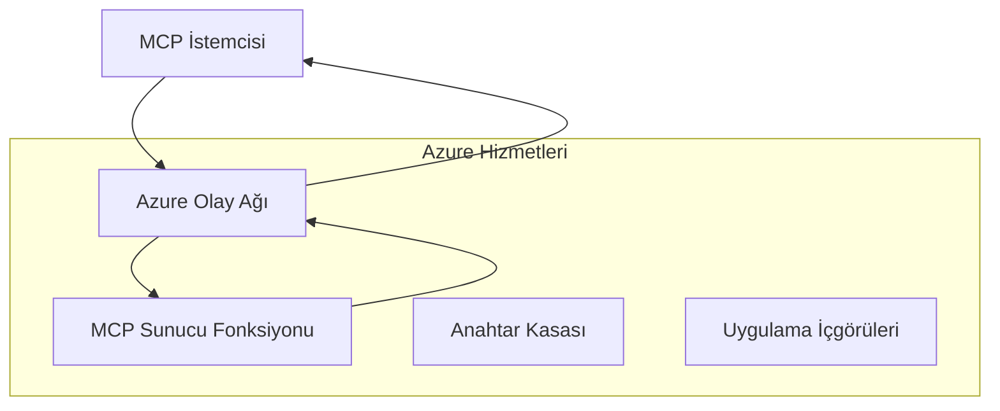
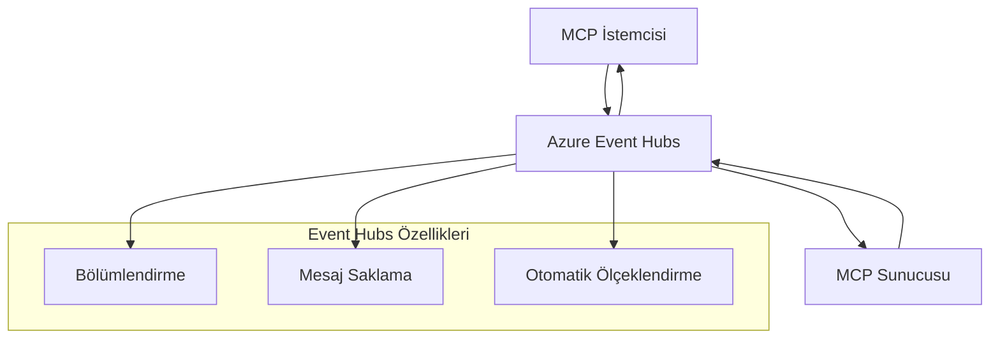

# MCP Özel Taşıyıcılar - İleri Düzey Uygulama Kılavuzu

Model Context Protocol (MCP), özel kurumsal ortamlar için özel uygulamalara izin vererek taşıma mekanizmalarında esneklik sağlar. Bu ileri düzey kılavuz, ölçeklenebilir, bulut yerel MCP çözümleri oluşturmak için pratik örnekler olarak Azure Event Grid ve Azure Event Hubs kullanarak özel taşıyıcı uygulamalarını inceler.

## Giriş

MCP'nin standart taşıyıcıları (stdio ve HTTP akışı) çoğu kullanım durumuna hizmet ederken, kurumsal ortamlar genellikle geliştirilmiş ölçeklenebilirlik, güvenilirlik ve mevcut bulut altyapısıyla entegrasyon için özel taşıma mekanizmaları gerektirir. Özel taşıyıcılar, MCP'nin asenkron iletişim, olay odaklı mimariler ve dağıtık işleme için bulut yerel mesajlaşma hizmetlerinden yararlanmasını sağlar.

Bu ders, en son MCP spesifikasyonu (2025-11-25), Azure mesajlaşma hizmetleri ve yerleşik kurumsal entegrasyon desenlerine dayalı ileri düzey taşıyıcı uygulamalarını keşfeder.

### **MCP Taşıyıcı Mimarisi**

**MCP Spesifikasyonundan (2025-11-25):**

- **Standart Taşıyıcılar**: stdio (önerilen), HTTP akışı (uzak senaryolar için)
- **Özel Taşıyıcılar**: MCP mesaj alışverişi protokolünü uygulayan herhangi bir taşıyıcı
- **Mesaj Formatı**: MCP'ye özgü uzantılarla JSON-RPC 2.0
- **Çift Yönlü İletişim**: Bildirimler ve yanıtlar için tam dubleks iletişim gereklidir

## Öğrenme Hedefleri

Bu ileri düzey dersin sonunda şunları yapabileceksiniz:

- **Özel Taşıyıcı Gereksinimlerini Anlamak**: MCP protokolünü herhangi bir taşıma katmanı üzerinde uyumluluğu koruyarak uygulamak
- **Azure Event Grid Taşıyıcısı Oluşturmak**: Sunucusuz ölçeklenebilirlik için Azure Event Grid kullanarak olay odaklı MCP sunucuları oluşturmak
- **Azure Event Hubs Taşıyıcısı Uygulamak**: Gerçek zamanlı akış için Azure Event Hubs kullanarak yüksek verimli MCP çözümleri tasarlamak
- **Kurumsal Desenleri Uygulamak**: Özel taşıyıcıları mevcut Azure altyapısı ve güvenlik modelleriyle entegre etmek
- **Taşıyıcı Güvenilirliğini Yönetmek**: Kurumsal senaryolar için mesaj dayanıklılığı, sıralama ve hata yönetimi uygulamak
- **Performansı Optimize Etmek**: Ölçek, gecikme ve verimlilik gereksinimleri için taşıyıcı çözümleri tasarlamak

## **Taşıyıcı Gereksinimleri**

### **MCP Spesifikasyonundan Temel Gereksinimler (2025-11-25):**

```yaml
Message Protocol:
  format: "JSON-RPC 2.0 with MCP extensions"
  bidirectional: "Full duplex communication required"
  ordering: "Message ordering must be preserved per session"
  
Transport Layer:
  reliability: "Transport MUST handle connection failures gracefully"
  security: "Transport MUST support secure communication"
  identification: "Each session MUST have unique identifier"
  
Custom Transport:
  compliance: "MUST implement complete MCP message exchange"
  extensibility: "MAY add transport-specific features"
  interoperability: "MUST maintain protocol compatibility"
```

## **Azure Event Grid Taşıyıcı Uygulaması**

Azure Event Grid, olay odaklı MCP mimarileri için ideal olan sunucusuz bir olay yönlendirme hizmeti sağlar. Bu uygulama, ölçeklenebilir, gevşek bağlı MCP sistemleri oluşturmayı gösterir.

### **Mimari Genel Bakış**


### **C# Uygulaması - Event Grid Taşıyıcısı**

```csharp
using Azure.Messaging.EventGrid;
using Microsoft.Extensions.Azure;
using System.Text.Json;

public class EventGridMcpTransport : IMcpTransport
{
    private readonly EventGridPublisherClient _publisher;
    private readonly string _topicEndpoint;
    private readonly string _clientId;
    
    public EventGridMcpTransport(string topicEndpoint, string accessKey, string clientId)
    {
        _publisher = new EventGridPublisherClient(
            new Uri(topicEndpoint), 
            new AzureKeyCredential(accessKey));
        _topicEndpoint = topicEndpoint;
        _clientId = clientId;
    }
    
    public async Task SendMessageAsync(McpMessage message)
    {
        var eventGridEvent = new EventGridEvent(
            subject: $"mcp/{_clientId}",
            eventType: "MCP.MessageReceived",
            dataVersion: "1.0",
            data: JsonSerializer.Serialize(message))
        {
            Id = Guid.NewGuid().ToString(),
            EventTime = DateTimeOffset.UtcNow
        };
        
        await _publisher.SendEventAsync(eventGridEvent);
    }
    
    public async Task<McpMessage> ReceiveMessageAsync(CancellationToken cancellationToken)
    {
        // Event Grid is push-based, so implement webhook receiver
        // This would typically be handled by Azure Functions trigger
        throw new NotImplementedException("Use EventGridTrigger in Azure Functions");
    }
}

// Azure Function for receiving Event Grid events
[FunctionName("McpEventGridReceiver")]
public async Task<IActionResult> HandleEventGridMessage(
    [EventGridTrigger] EventGridEvent eventGridEvent,
    ILogger log)
{
    try
    {
        var mcpMessage = JsonSerializer.Deserialize<McpMessage>(
            eventGridEvent.Data.ToString());
        
        // Process MCP message
        var response = await _mcpServer.ProcessMessageAsync(mcpMessage);
        
        // Send response back via Event Grid
        await _transport.SendMessageAsync(response);
        
        return new OkResult();
    }
    catch (Exception ex)
    {
        log.LogError(ex, "Error processing Event Grid MCP message");
        return new BadRequestResult();
    }
}
```

### **TypeScript Uygulaması - Event Grid Taşıyıcısı**

```typescript
import { EventGridPublisherClient, AzureKeyCredential } from "@azure/eventgrid";
import { McpTransport, McpMessage } from "./mcp-types";

export class EventGridMcpTransport implements McpTransport {
    private publisher: EventGridPublisherClient;
    private clientId: string;
    
    constructor(
        private topicEndpoint: string,
        private accessKey: string,
        clientId: string
    ) {
        this.publisher = new EventGridPublisherClient(
            topicEndpoint,
            new AzureKeyCredential(accessKey)
        );
        this.clientId = clientId;
    }
    
    async sendMessage(message: McpMessage): Promise<void> {
        const event = {
            id: crypto.randomUUID(),
            source: `mcp-client-${this.clientId}`,
            type: "MCP.MessageReceived",
            time: new Date(),
            data: message
        };
        
        await this.publisher.sendEvents([event]);
    }
    
    // Azure Functions aracılığıyla olay odaklı alma
    onMessage(handler: (message: McpMessage) => Promise<void>): void {
        // Uygulama Azure Functions Event Grid tetikleyicisi kullanacaktır
        // Bu, webhook alıcısı için kavramsal bir arayüzdür
    }
}

// Azure Functions uygulaması
import { app, InvocationContext, EventGridEvent } from "@azure/functions";

app.eventGrid("mcpEventGridHandler", {
    handler: async (event: EventGridEvent, context: InvocationContext) => {
        try {
            const mcpMessage = event.data as McpMessage;
            
            // MCP mesajını işleme
            const response = await mcpServer.processMessage(mcpMessage);
            
            // Yanıtı Event Grid üzerinden gönderme
            await transport.sendMessage(response);
            
        } catch (error) {
            context.error("Error processing MCP message:", error);
            throw error;
        }
    }
});
```

### **Python Uygulaması - Event Grid Taşıyıcısı**

```python
from azure.eventgrid import EventGridPublisherClient, EventGridEvent
from azure.core.credentials import AzureKeyCredential
import asyncio
import json
from typing import Callable, Optional
import uuid
from datetime import datetime

class EventGridMcpTransport:
    def __init__(self, topic_endpoint: str, access_key: str, client_id: str):
        self.client = EventGridPublisherClient(
            topic_endpoint, 
            AzureKeyCredential(access_key)
        )
        self.client_id = client_id
        self.message_handler: Optional[Callable] = None
    
    async def send_message(self, message: dict) -> None:
        """Send MCP message via Event Grid"""
        event = EventGridEvent(
            data=message,
            subject=f"mcp/{self.client_id}",
            event_type="MCP.MessageReceived",
            data_version="1.0"
        )
        
        await self.client.send(event)
    
    def on_message(self, handler: Callable[[dict], None]) -> None:
        """Register message handler for incoming events"""
        self.message_handler = handler

# Azure Functions uygulaması
import azure.functions as func
import logging

def main(event: func.EventGridEvent) -> None:
    """Azure Functions Event Grid trigger for MCP messages"""
    try:
        # Event Grid olayından MCP mesajını ayrıştır
        mcp_message = json.loads(event.get_body().decode('utf-8'))
        
        # MCP mesajını işle
        response = process_mcp_message(mcp_message)
        
        # Yanıtı Event Grid üzerinden geri gönder
        # (Uygulama yeni bir Event Grid istemcisi oluşturur)
        
    except Exception as e:
        logging.error(f"Error processing MCP Event Grid message: {e}")
        raise
```

## **Azure Event Hubs Taşıyıcı Uygulaması**

Azure Event Hubs, düşük gecikme ve yüksek mesaj hacmi gerektiren MCP senaryoları için yüksek verimli, gerçek zamanlı akış yetenekleri sağlar.

### **Mimari Genel Bakış**


### **C# Uygulaması - Event Hubs Taşıyıcısı**

```csharp
using Azure.Messaging.EventHubs;
using Azure.Messaging.EventHubs.Producer;
using Azure.Messaging.EventHubs.Consumer;
using System.Text;

public class EventHubsMcpTransport : IMcpTransport, IDisposable
{
    private readonly EventHubProducerClient _producer;
    private readonly EventHubConsumerClient _consumer;
    private readonly string _consumerGroup;
    private readonly CancellationTokenSource _cancellationTokenSource;
    
    public EventHubsMcpTransport(
        string connectionString, 
        string eventHubName,
        string consumerGroup = "$Default")
    {
        _producer = new EventHubProducerClient(connectionString, eventHubName);
        _consumer = new EventHubConsumerClient(
            consumerGroup, 
            connectionString, 
            eventHubName);
        _consumerGroup = consumerGroup;
        _cancellationTokenSource = new CancellationTokenSource();
    }
    
    public async Task SendMessageAsync(McpMessage message)
    {
        var messageBody = JsonSerializer.Serialize(message);
        var eventData = new EventData(Encoding.UTF8.GetBytes(messageBody));
        
        // Add MCP-specific properties
        eventData.Properties.Add("MessageType", message.Method ?? "response");
        eventData.Properties.Add("MessageId", message.Id);
        eventData.Properties.Add("Timestamp", DateTimeOffset.UtcNow);
        
        await _producer.SendAsync(new[] { eventData });
    }
    
    public async Task StartReceivingAsync(
        Func<McpMessage, Task> messageHandler)
    {
        await foreach (PartitionEvent partitionEvent in _consumer.ReadEventsAsync(
            _cancellationTokenSource.Token))
        {
            try
            {
                var messageBody = Encoding.UTF8.GetString(
                    partitionEvent.Data.EventBody.ToArray());
                var mcpMessage = JsonSerializer.Deserialize<McpMessage>(messageBody);
                
                await messageHandler(mcpMessage);
            }
            catch (Exception ex)
            {
                // Handle deserialization or processing errors
                Console.WriteLine($"Error processing message: {ex.Message}");
            }
        }
    }
    
    public void Dispose()
    {
        _cancellationTokenSource?.Cancel();
        _producer?.DisposeAsync().AsTask().Wait();
        _consumer?.DisposeAsync().AsTask().Wait();
        _cancellationTokenSource?.Dispose();
    }
}
```

### **TypeScript Uygulaması - Event Hubs Taşıyıcısı**

```typescript
import { 
    EventHubProducerClient, 
    EventHubConsumerClient, 
    EventData 
} from "@azure/event-hubs";

export class EventHubsMcpTransport implements McpTransport {
    private producer: EventHubProducerClient;
    private consumer: EventHubConsumerClient;
    private isReceiving = false;
    
    constructor(
        private connectionString: string,
        private eventHubName: string,
        private consumerGroup: string = "$Default"
    ) {
        this.producer = new EventHubProducerClient(
            connectionString, 
            eventHubName
        );
        this.consumer = new EventHubConsumerClient(
            consumerGroup,
            connectionString,
            eventHubName
        );
    }
    
    async sendMessage(message: McpMessage): Promise<void> {
        const eventData: EventData = {
            body: JSON.stringify(message),
            properties: {
                messageType: message.method || "response",
                messageId: message.id,
                timestamp: new Date().toISOString()
            }
        };
        
        await this.producer.sendBatch([eventData]);
    }
    
    async startReceiving(
        messageHandler: (message: McpMessage) => Promise<void>
    ): Promise<void> {
        if (this.isReceiving) return;
        
        this.isReceiving = true;
        
        const subscription = this.consumer.subscribe({
            processEvents: async (events, context) => {
                for (const event of events) {
                    try {
                        const messageBody = event.body as string;
                        const mcpMessage: McpMessage = JSON.parse(messageBody);
                        
                        await messageHandler(mcpMessage);
                        
                        // En az bir kez teslimat için kontrol noktası güncellemesi
                        await context.updateCheckpoint(event);
                    } catch (error) {
                        console.error("Error processing Event Hubs message:", error);
                    }
                }
            },
            processError: async (err, context) => {
                console.error("Event Hubs error:", err);
            }
        });
    }
    
    async close(): Promise<void> {
        this.isReceiving = false;
        await this.producer.close();
        await this.consumer.close();
    }
}
```

### **Python Uygulaması - Event Hubs Taşıyıcısı**

```python
from azure.eventhub import EventHubProducerClient, EventHubConsumerClient
from azure.eventhub import EventData
import json
import asyncio
from typing import Callable, Dict, Any
import logging

class EventHubsMcpTransport:
    def __init__(
        self, 
        connection_string: str, 
        eventhub_name: str,
        consumer_group: str = "$Default"
    ):
        self.producer = EventHubProducerClient.from_connection_string(
            connection_string, 
            eventhub_name=eventhub_name
        )
        self.consumer = EventHubConsumerClient.from_connection_string(
            connection_string,
            consumer_group=consumer_group,
            eventhub_name=eventhub_name
        )
        self.is_receiving = False
    
    async def send_message(self, message: Dict[str, Any]) -> None:
        """Send MCP message via Event Hubs"""
        event_data = EventData(json.dumps(message))
        
        # MCP'ye özgü özellikler ekle
        event_data.properties = {
            "messageType": message.get("method", "response"),
            "messageId": message.get("id"),
            "timestamp": "2025-01-14T10:30:00Z"  # Gerçek zaman damgasını kullan
        }
        
        async with self.producer:
            event_data_batch = await self.producer.create_batch()
            event_data_batch.add(event_data)
            await self.producer.send_batch(event_data_batch)
    
    async def start_receiving(
        self, 
        message_handler: Callable[[Dict[str, Any]], None]
    ) -> None:
        """Start receiving MCP messages from Event Hubs"""
        if self.is_receiving:
            return
        
        self.is_receiving = True
        
        async with self.consumer:
            await self.consumer.receive(
                on_event=self._on_event_received(message_handler),
                starting_position="-1"  # Baştan başla
            )
    
    def _on_event_received(self, handler: Callable):
        """Internal event handler wrapper"""
        async def handle_event(partition_context, event):
            try:
                # Event Hubs olayından MCP mesajını ayrıştır
                message_body = event.body_as_str(encoding='UTF-8')
                mcp_message = json.loads(message_body)
                
                # MCP mesajını işle
                await handler(mcp_message)
                
                # En az bir kez teslimat için kontrol noktasını güncelle
                await partition_context.update_checkpoint(event)
                
            except Exception as e:
                logging.error(f"Error processing Event Hubs message: {e}")
        
        return handle_event
    
    async def close(self) -> None:
        """Clean up transport resources"""
        self.is_receiving = False
        await self.producer.close()
        await self.consumer.close()
```

## **İleri Düzey Taşıyıcı Desenleri**

### **Mesaj Dayanıklılığı ve Güvenilirlik**

```csharp
// Implementing message durability with retry logic
public class ReliableTransportWrapper : IMcpTransport
{
    private readonly IMcpTransport _innerTransport;
    private readonly RetryPolicy _retryPolicy;
    
    public async Task SendMessageAsync(McpMessage message)
    {
        await _retryPolicy.ExecuteAsync(async () =>
        {
            try
            {
                await _innerTransport.SendMessageAsync(message);
            }
            catch (TransportException ex) when (ex.IsRetryable)
            {
                // Log and retry
                throw;
            }
        });
    }
}
```

### **Taşıyıcı Güvenlik Entegrasyonu**

```csharp
// Integrating Azure Key Vault for transport security
public class SecureTransportFactory
{
    private readonly SecretClient _keyVaultClient;
    
    public async Task<IMcpTransport> CreateEventGridTransportAsync()
    {
        var accessKey = await _keyVaultClient.GetSecretAsync("EventGridAccessKey");
        var topicEndpoint = await _keyVaultClient.GetSecretAsync("EventGridTopic");
        
        return new EventGridMcpTransport(
            topicEndpoint.Value.Value,
            accessKey.Value.Value,
            Environment.MachineName
        );
    }
}
```

### **Taşıyıcı İzleme ve Gözlemlenebilirlik**

```csharp
// Adding telemetry to custom transports
public class ObservableTransport : IMcpTransport
{
    private readonly IMcpTransport _transport;
    private readonly ILogger _logger;
    private readonly TelemetryClient _telemetryClient;
    
    public async Task SendMessageAsync(McpMessage message)
    {
        using var activity = Activity.StartActivity("MCP.Transport.Send");
        activity?.SetTag("transport.type", "EventGrid");
        activity?.SetTag("message.method", message.Method);
        
        var stopwatch = Stopwatch.StartNew();
        
        try
        {
            await _transport.SendMessageAsync(message);
            
            _telemetryClient.TrackDependency(
                "EventGrid",
                "SendMessage",
                DateTime.UtcNow.Subtract(stopwatch.Elapsed),
                stopwatch.Elapsed,
                true
            );
        }
        catch (Exception ex)
        {
            _telemetryClient.TrackException(ex);
            throw;
        }
    }
}
```

## **Kurumsal Entegrasyon Senaryoları**

### **Senaryo 1: Dağıtık MCP İşleme**

MCP isteklerini birden çok işleme düğümüne dağıtmak için Azure Event Grid kullanımı:

```yaml
Architecture:
  - MCP Client sends requests to Event Grid topic
  - Multiple Azure Functions subscribe to process different tool types
  - Results aggregated and returned via separate response topic
  
Benefits:
  - Horizontal scaling based on message volume
  - Fault tolerance through redundant processors
  - Cost optimization with serverless compute
```

### **Senaryo 2: Gerçek Zamanlı MCP Akışı**

Yüksek frekanslı MCP etkileşimleri için Azure Event Hubs kullanımı:

```yaml
Architecture:
  - MCP Client streams continuous requests via Event Hubs
  - Stream Analytics processes and routes messages
  - Multiple consumers handle different aspect of processing
  
Benefits:
  - Low latency for real-time scenarios
  - High throughput for batch processing
  - Built-in partitioning for parallel processing
```

### **Senaryo 3: Hibrit Taşıyıcı Mimarisi**

Farklı kullanım durumları için birden çok taşıyıcının birleştirilmesi:

```csharp
public class HybridMcpTransport : IMcpTransport
{
    private readonly IMcpTransport _realtimeTransport; // Event Hubs
    private readonly IMcpTransport _batchTransport;    // Event Grid
    private readonly IMcpTransport _fallbackTransport; // HTTP Streaming
    
    public async Task SendMessageAsync(McpMessage message)
    {
        // Route based on message characteristics
        var transport = message.Method switch
        {
            "tools/call" when IsRealtime(message) => _realtimeTransport,
            "resources/read" when IsBatch(message) => _batchTransport,
            _ => _fallbackTransport
        };
        
        await transport.SendMessageAsync(message);
    }
}
```

## **Performans Optimizasyonu**

### **Event Grid için Mesaj Toplama**

```csharp
public class BatchingEventGridTransport : IMcpTransport
{
    private readonly List<McpMessage> _messageBuffer = new();
    private readonly Timer _flushTimer;
    private const int MaxBatchSize = 100;
    
    public async Task SendMessageAsync(McpMessage message)
    {
        lock (_messageBuffer)
        {
            _messageBuffer.Add(message);
            
            if (_messageBuffer.Count >= MaxBatchSize)
            {
                _ = Task.Run(FlushMessages);
            }
        }
    }
    
    private async Task FlushMessages()
    {
        List<McpMessage> toSend;
        lock (_messageBuffer)
        {
            toSend = new List<McpMessage>(_messageBuffer);
            _messageBuffer.Clear();
        }
        
        if (toSend.Any())
        {
            var events = toSend.Select(CreateEventGridEvent);
            await _publisher.SendEventsAsync(events);
        }
    }
}
```

### **Event Hubs için Bölümlendirme Stratejisi**

```csharp
public class PartitionedEventHubsTransport : IMcpTransport
{
    public async Task SendMessageAsync(McpMessage message)
    {
        // Partition by client ID for session affinity
        var partitionKey = ExtractClientId(message);
        
        var eventData = new EventData(JsonSerializer.SerializeToUtf8Bytes(message))
        {
            PartitionKey = partitionKey
        };
        
        await _producer.SendAsync(new[] { eventData });
    }
}
```

## **Özel Taşıyıcıların Test Edilmesi**

### **Test Çiftleri ile Birim Testi**

```csharp
[Test]
public async Task EventGridTransport_SendMessage_PublishesCorrectEvent()
{
    // Arrange
    var mockPublisher = new Mock<EventGridPublisherClient>();
    var transport = new EventGridMcpTransport(mockPublisher.Object);
    var message = new McpMessage { Method = "tools/list", Id = "test-123" };
    
    // Act
    await transport.SendMessageAsync(message);
    
    // Assert
    mockPublisher.Verify(
        x => x.SendEventAsync(
            It.Is<EventGridEvent>(e => 
                e.EventType == "MCP.MessageReceived" &&
                e.Subject == "mcp/test-client"
            )
        ),
        Times.Once
    );
}
```

### **Azure Test Containers ile Entegrasyon Testi**

```csharp
[Test]
public async Task EventHubsTransport_IntegrationTest()
{
    // Using Testcontainers for integration testing
    var eventHubsContainer = new EventHubsContainer()
        .WithEventHub("test-hub");
    
    await eventHubsContainer.StartAsync();
    
    var transport = new EventHubsMcpTransport(
        eventHubsContainer.GetConnectionString(),
        "test-hub"
    );
    
    // Test message round-trip
    var sentMessage = new McpMessage { Method = "test", Id = "123" };
    McpMessage receivedMessage = null;
    
    await transport.StartReceivingAsync(msg => {
        receivedMessage = msg;
        return Task.CompletedTask;
    });
    
    await transport.SendMessageAsync(sentMessage);
    await Task.Delay(1000); // Allow for message processing
    
    Assert.That(receivedMessage?.Id, Is.EqualTo("123"));
}
```

## **En İyi Uygulamalar ve Kılavuzlar**

### **Taşıyıcı Tasarım İlkeleri**

1. **İdempotentlik**: Çoğaltmaları yönetmek için mesaj işleme idempotent olmalıdır
2. **Hata Yönetimi**: Kapsamlı hata yönetimi ve ölü mektup kuyrukları uygulayın
3. **İzleme**: Ayrıntılı telemetri ve sağlık kontrolleri ekleyin
4. **Güvenlik**: Yönetilen kimlikler ve en az ayrıcalık erişimi kullanın
5. **Performans**: Belirli gecikme ve verimlilik gereksinimlerinize göre tasarlayın

### **Azure'ye Özgü Öneriler**

1. **Yönetilen Kimlik Kullanın**: Üretimde bağlantı dizelerini kullanmaktan kaçının
2. **Devre Kesiciler Uygulayın**: Azure hizmet kesintilerine karşı koruma sağlayın
3. **Maliyetleri İzleyin**: Mesaj hacmi ve işleme maliyetlerini takip edin
4. **Ölçek Planlayın**: Bölümlendirme ve ölçeklendirme stratejilerini erken tasarlayın
5. **Kapsamlı Test Yapın**: Azure DevTest Labs ile kapsamlı testler gerçekleştirin

## **Sonuç**

Özel MCP taşıyıcıları, Azure'un mesajlaşma hizmetlerini kullanarak güçlü kurumsal senaryoları mümkün kılar. Event Grid veya Event Hubs taşıyıcılarını uygulayarak, mevcut Azure altyapısıyla sorunsuz entegre olan ölçeklenebilir, güvenilir MCP çözümleri oluşturabilirsiniz.

Verilen örnekler, MCP protokol uyumluluğunu ve Azure en iyi uygulamalarını korurken özel taşıyıcıları uygulamak için üretime hazır desenleri göstermektedir.

## **Ek Kaynaklar**

- [MCP Spesifikasyonu 2025-06-18](https://spec.modelcontextprotocol.io/specification/2025-06-18/)
- [Azure Event Grid Belgeleri](https://docs.microsoft.com/azure/event-grid/)
- [Azure Event Hubs Belgeleri](https://docs.microsoft.com/azure/event-hubs/)
- [Azure Functions Event Grid Tetikleyicisi](https://docs.microsoft.com/azure/azure-functions/functions-bindings-event-grid)
- [Azure SDK for .NET](https://github.com/Azure/azure-sdk-for-net)
- [Azure SDK for TypeScript](https://github.com/Azure/azure-sdk-for-js)
- [Azure SDK for Python](https://github.com/Azure/azure-sdk-for-python)

---

> *Bu kılavuz, üretim MCP sistemleri için pratik uygulama desenlerine odaklanır. Taşıyıcı uygulamalarını her zaman özel gereksinimleriniz ve Azure hizmet sınırları doğrultusunda doğrulayın.*
> **Mevcut Standart**: Bu kılavuz, [MCP Spesifikasyonu 2025-06-18](https://spec.modelcontextprotocol.io/specification/2025-06-18/) taşıyıcı gereksinimlerini ve kurumsal ortamlar için ileri düzey taşıyıcı desenlerini yansıtır.


## Sonraki Adım
- [6. Topluluk Katkıları](../../06-CommunityContributions/README.md)

---

<!-- CO-OP TRANSLATOR DISCLAIMER START -->
**Feragatname**:  
Bu belge, AI çeviri servisi [Co-op Translator](https://github.com/Azure/co-op-translator) kullanılarak çevrilmiştir. Doğruluk için çaba gösterilse de, otomatik çevirilerin hatalar veya yanlışlıklar içerebileceğini lütfen unutmayınız. Orijinal belge, kendi dilinde yetkili kaynak olarak kabul edilmelidir. Kritik bilgiler için profesyonel insan çevirisi önerilir. Bu çevirinin kullanımı sonucu oluşabilecek yanlış anlamalar veya yorum hatalarından sorumlu değiliz.
<!-- CO-OP TRANSLATOR DISCLAIMER END -->