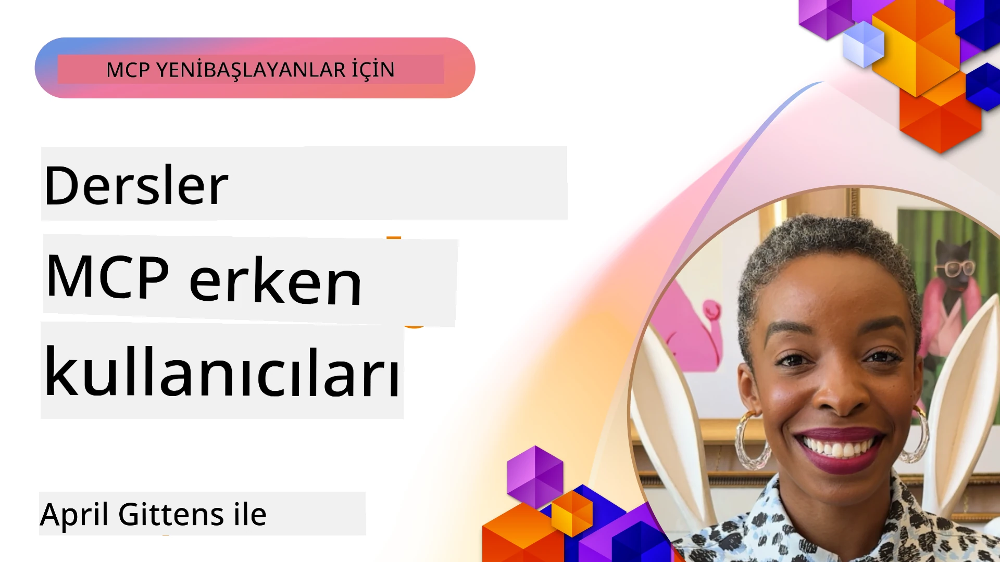

# 🌟 Erken Benimseyenlerden Dersler

[](https://youtu.be/jds7dSmNptE)

_(Bu dersin videosunu görüntülemek için yukarıdaki görsele tıklayın)_

## 🎯 Bu Modül Neleri Kapsar

Bu modül, gerçek organizasyonların ve geliştiricilerin Model Context Protocol (MCP)’ü nasıl gerçek zorlukları çözmek ve yenilikleri tetiklemek için kullandığını keşfeder. Ayrıntılı vaka çalışmaları, uygulamalı projeler ve pratik örnekler aracılığıyla, MCP’nin dil modelleri, araçlar ve kurumsal verileri bağlayan güvenli, ölçeklenebilir AI entegrasyonunu nasıl mümkün kıldığına tanık olacaksınız.

### 📚 MCP’yi Uygulamada Görün

Bu ilkeleri üretime hazır araçlarda görmek ister misiniz? Bugün kullanabileceğiniz gerçek Microsoft MCP sunucularını sergileyen [**10 Microsoft MCP Sunucusu – Geliştirici Verimliliğini Dönüştürenler**](microsoft-mcp-servers.md) rehberimize göz atın.

## Genel Bakış

Bu ders, erken benimseyenlerin Model Context Protocol (MCP)’ü gerçek dünya sorunlarını çözmek ve sektörler arası yeniliği teşvik etmek için nasıl kullandığını inceler. Ayrıntılı vaka çalışmaları ve uygulamalı projelerle MCP’nin standartlaştırılmış, güvenli ve ölçeklenebilir AI entegrasyonunu nasıl mümkün kıldığını göreceksiniz—büyük dil modelleri, araçlar ve kurumsal verileri birleşik bir çerçevede birbirine bağlayarak. MCP tabanlı çözümler tasarlama ve oluşturma konusunda pratik deneyim kazanacak, kanıtlanmış uygulama kalıplarından öğrenecek ve MCP’yi üretim ortamlarında devreye alma için en iyi uygulamaları keşfedeceksiniz. Ders ayrıca güncel trendleri, gelecekteki yönelimleri ve açık kaynak kaynaklarını vurgulayarak MCP teknolojisi ve gelişen ekosisteminin ön safhalarında kalmanıza yardımcı olur.

## Öğrenme Hedefleri

- Farklı sektörlerdeki gerçek MCP uygulamalarını analiz etmek
- Tamamen MCP tabanlı uygulamalar tasarlamak ve geliştirmek
- MCP teknolojisindeki yükselen trendleri ve gelecek yönelimleri keşfetmek
- Güncel geliştirme senaryolarında en iyi uygulamaları kullanmak

## Gerçek Dünya MCP Uygulamaları

### Vaka Çalışması 1: Kurumsal Müşteri Destek Otomasyonu

Çok uluslu bir şirket, müşteri destek sistemleri arasındaki AI etkileşimlerini standartlaştırmak için MCP tabanlı bir çözüm uyguladı. Bu sayede:

- Birden fazla LLM sağlayıcısı için birleşik bir arayüz oluşturuldu
- Bölümler arasında tutarlı prompt yönetimi sağlandı
- Güçlü güvenlik ve uyum kontrolleri uygulandı
- Spesifik ihtiyaçlara bağlı olarak farklı AI modelleri arasında kolayca geçiş yapıldı

**Teknik Uygulama:**

```python
# Müşteri desteği için Python MCP sunucu uygulaması
import logging
import asyncio
from modelcontextprotocol import create_server, ServerConfig
from modelcontextprotocol.server import MCPServer
from modelcontextprotocol.transports import create_http_transport
from modelcontextprotocol.resources import ResourceDefinition
from modelcontextprotocol.prompts import PromptDefinition
from modelcontextprotocol.tool import ToolDefinition

# Günlüğü yapılandır
logging.basicConfig(level=logging.INFO)

async def main():
    # Sunucu yapılandırması oluştur
    config = ServerConfig(
        name="Enterprise Customer Support Server",
        version="1.0.0",
        description="MCP server for handling customer support inquiries"
    )
    
    # MCP sunucusunu başlat
    server = create_server(config)
    
    # Bilgi tabanı kaynaklarını kaydet
    server.resources.register(
        ResourceDefinition(
            name="customer_kb",
            description="Customer knowledge base documentation"
        ),
        lambda params: get_customer_documentation(params)
    )
    
    # İstemi şablonlarını kaydet
    server.prompts.register(
        PromptDefinition(
            name="support_template",
            description="Templates for customer support responses"
        ),
        lambda params: get_support_templates(params)
    )
    
    # Destek araçlarını kaydet
    server.tools.register(
        ToolDefinition(
            name="ticketing",
            description="Create and update support tickets"
        ),
        handle_ticketing_operations
    )
    
    # HTTP taşıma ile sunucuyu başlat
    transport = create_http_transport(port=8080)
    await server.run(transport)

if __name__ == "__main__":
    asyncio.run(main())
```
  
**Sonuçlar:** Model maliyetlerinde %30 azalma, yanıt tutarlılığında %45 iyileşme ve küresel operasyonlarda artırılmış uyumluluk.

### Vaka Çalışması 2: Sağlık Hizmetleri Tanı Asistanı

Bir sağlık hizmeti sağlayıcısı, hassas hasta verilerinin korunmasını sağlarken birden fazla uzmanlaşmış tıbbi AI modelini entegre etmek için MCP altyapısı geliştirdi:

- Genel ve uzman tıbbi modeller arasında kesintisiz geçiş
- Katı gizlilik kontrolleri ve denetim kayıtları
- Mevcut Elektronik Sağlık Kayıtları (EHR) sistemleri ile entegrasyon
- Tıbbi terminoloji için tutarlı prompt mühendisliği

**Teknik Uygulama:**

```csharp
// C# MCP host application implementation in healthcare application
using Microsoft.Extensions.DependencyInjection;
using ModelContextProtocol.SDK.Client;
using ModelContextProtocol.SDK.Security;
using ModelContextProtocol.SDK.Resources;

public class DiagnosticAssistant
{
    private readonly MCPHostClient _mcpClient;
    private readonly PatientContext _patientContext;
    
    public DiagnosticAssistant(PatientContext patientContext)
    {
        _patientContext = patientContext;
        
        // Configure MCP client with healthcare-specific settings
        var clientOptions = new ClientOptions
        {
            Name = "Healthcare Diagnostic Assistant",
            Version = "1.0.0",
            Security = new SecurityOptions
            {
                Encryption = EncryptionLevel.Medical,
                AuditEnabled = true
            }
        };
        
        _mcpClient = new MCPHostClientBuilder()
            .WithOptions(clientOptions)
            .WithTransport(new HttpTransport("https://healthcare-mcp.example.org"))
            .WithAuthentication(new HIPAACompliantAuthProvider())
            .Build();
    }
    
    public async Task<DiagnosticSuggestion> GetDiagnosticAssistance(
        string symptoms, string patientHistory)
    {
        // Create request with appropriate resources and tool access
        var resourceRequest = new ResourceRequest
        {
            Name = "patient_records",
            Parameters = new Dictionary<string, object>
            {
                ["patientId"] = _patientContext.PatientId,
                ["requestingProvider"] = _patientContext.ProviderId
            }
        };
        
        // Request diagnostic assistance using appropriate prompt
        var response = await _mcpClient.SendPromptRequestAsync(
            promptName: "diagnostic_assistance",
            parameters: new Dictionary<string, object>
            {
                ["symptoms"] = symptoms,
                patientHistory = patientHistory,
                relevantGuidelines = _patientContext.GetRelevantGuidelines()
            });
            
        return DiagnosticSuggestion.FromMCPResponse(response);
    }
}
```
  
**Sonuçlar:** Doktorlar için iyileştirilmiş tanı önerileri, tam HIPAA uyumluluğu ve sistemler arasındaki bağlam değişimlerinde önemli azalma.

### Vaka Çalışması 3: Finansal Hizmetlerde Risk Analizi

Bir finans kurumu, risk analiz süreçlerini farklı departmanlar arasında standartlaştırmak amacıyla MCP uyguladı:

- Kredi riski, dolandırıcılık tespiti ve yatırım riski modelleri için birleşik bir arayüz oluşturuldu
- Katı erişim kontrolleri ve model versiyonlama uygulandı
- Tüm AI önerilerinin denetlenebilirliği sağlandı
- Farklı sistemler arasında tutarlı veri formatlama sağlandı

**Teknik Uygulama:**

```java
// Finansal risk değerlendirmesi için Java MCP sunucusu
import org.mcp.server.*;
import org.mcp.security.*;

public class FinancialRiskMCPServer {
    public static void main(String[] args) {
        // Finansal uyumluluk özellikleri ile MCP sunucusu oluştur
        MCPServer server = new MCPServerBuilder()
            .withModelProviders(
                new ModelProvider("risk-assessment-primary", new AzureOpenAIProvider()),
                new ModelProvider("risk-assessment-audit", new LocalLlamaProvider())
            )
            .withPromptTemplateDirectory("./compliance/templates")
            .withAccessControls(new SOCCompliantAccessControl())
            .withDataEncryption(EncryptionStandard.FINANCIAL_GRADE)
            .withVersionControl(true)
            .withAuditLogging(new DatabaseAuditLogger())
            .build();
            
        server.addRequestValidator(new FinancialDataValidator());
        server.addResponseFilter(new PII_RedactionFilter());
        
        server.start(9000);
        
        System.out.println("Financial Risk MCP Server running on port 9000");
    }
}
```
  
**Sonuçlar:** Artırılmış düzenleyici uyumluluk, %40 daha hızlı model dağıtım döngüleri ve departmanlar arasında geliştirilmiş risk değerlendirme tutarlılığı.

### Vaka Çalışması 4: Microsoft Playwright MCP Sunucusu ile Tarayıcı Otomasyonu

Microsoft, Model Context Protocol aracılığıyla güvenli, standartlaştırılmış tarayıcı otomasyonu sağlamak için [Playwright MCP sunucusunu](https://github.com/microsoft/playwright-mcp) geliştirdi. Bu üretime hazır sunucu, AI ajanları ve LLM’lerin web tarayıcılarıyla kontrollü, denetlenebilir ve genişletilebilir şekilde etkileşim kurmasını sağlar—otomatik web testleri, veri çıkarımı ve uçtan uca iş akışları gibi kullanımlara olanak tanır.

> **🎯 Üretime Hazır Araç**
> 
> Bu vaka çalışması, bugün kullanabileceğiniz gerçek bir MCP sunucusunu gösterir! Playwright MCP Sunucusu ve diğer 9 üretime hazır Microsoft MCP sunucusu hakkında daha fazla bilgi için [**Microsoft MCP Sunucuları Kılavuzu**](microsoft-mcp-servers.md#8--playwright-mcp-server) sayfasına bakın.

**Temel Özellikler:**
- Tarayıcı otomasyon yeteneklerini (navigasyon, form doldurma, ekran görüntüsü alma vb.) MCP araçları olarak sunar
- Yetkisiz eylemleri önlemek için sıkı erişim kontrolleri ve sandbox uygulaması
- Tüm tarayıcı etkileşimleri için ayrıntılı denetim kayıtları sağlar
- Azure OpenAI ve diğer LLM sağlayıcıları ile agent-tabanlı otomasyon entegrasyonu destekler
- GitHub Copilot’un Kodlama Ajanını web tarama yetenekleriyle güçlendirir

**Teknik Uygulama:**

```typescript
// TypeScript: Bir MCP sunucusunda Playwright tarayıcı otomasyon araçlarını kaydetme
import { createServer, ToolDefinition } from 'modelcontextprotocol';
import { launch } from 'playwright';

const server = createServer({
  name: 'Playwright MCP Server',
  version: '1.0.0',
  description: 'MCP server for browser automation using Playwright'
});

// Bir URL'ye gitmek ve ekran görüntüsü almak için bir araç kaydet
server.tools.register(
  new ToolDefinition({
    name: 'navigate_and_screenshot',
    description: 'Navigate to a URL and capture a screenshot',
    parameters: {
      url: { type: 'string', description: 'The URL to visit' }
    }
  }),
  async ({ url }) => {
    const browser = await launch();
    const page = await browser.newPage();
    await page.goto(url);
    const screenshot = await page.screenshot();
    await browser.close();
    return { screenshot };
  }
);

// MCP sunucusunu başlat
server.listen(8080);
```
  
**Sonuçlar:**

- AI ajanları ve LLM’ler için güvenli, programlanabilir tarayıcı otomasyonu sağlandı
- Manuel test çabaları azaldı ve web uygulamaları için test kapsamı arttı
- Kurumsal ortamlarda tarayıcı tabanlı araç entegrasyonu için yeniden kullanılabilir, genişletilebilir çerçeve sağlandı
- GitHub Copilot’un web tarama özellikleri desteklendi

**Referanslar:**

- [Playwright MCP Sunucusu GitHub Deposu](https://github.com/microsoft/playwright-mcp)
- [Microsoft AI ve Otomasyon Çözümleri](https://azure.microsoft.com/en-us/products/ai-services/)

### Vaka Çalışması 5: Azure MCP – Kurumsal Düzeyde Hizmet Olarak Model Context Protocol

Azure MCP Sunucusu ([https://aka.ms/azmcp](https://aka.ms/azmcp)), Model Context Protocol’ün Microsoft tarafından yönetilen, kurumsal düzeyde bir uygulamasıdır ve ölçeklenebilir, güvenli ve uyumlu MCP sunucu yeteneklerini bulut hizmeti olarak sağlar. Azure MCP, organizasyonların MCP sunucularını Azure AI, veri ve güvenlik hizmetleriyle hızlıca dağıtmasını, yönetmesini ve entegre etmesini kolaylaştırır; operasyonel yükü azaltır ve AI benimseme hızını artırır.

> **🎯 Üretime Hazır Araç**
> 
> Bu, bugün kullanabileceğiniz gerçek bir MCP sunucusudur! Azure AI Foundry MCP Sunucusu hakkında daha fazla bilgi için [**Microsoft MCP Sunucuları Kılavuzu**](microsoft-mcp-servers.md) sayfasına bakın.

- Yerleşik ölçeklendirme, izleme ve güvenlik özellikleri ile tam yönetilen MCP sunucu barındırma
- Azure OpenAI, Azure AI Search ve diğer Azure hizmetleri ile yerel entegrasyon
- Microsoft Entra ID ile kurumsal kimlik doğrulama ve yetkilendirme
- Özel araçlar, prompt şablonları ve kaynak bağlayıcılar desteği
- Kurumsal güvenlik ve düzenleyici gereksinimlere uyum

**Teknik Uygulama:**

```yaml
# Example: Azure MCP server deployment configuration (YAML)
apiVersion: mcp.microsoft.com/v1
kind: McpServer
metadata:
  name: enterprise-mcp-server
spec:
  modelProviders:
    - name: azure-openai
      type: AzureOpenAI
      endpoint: https://<your-openai-resource>.openai.azure.com/
      apiKeySecret: <your-azure-keyvault-secret>
  tools:
    - name: document_search
      type: AzureAISearch
      endpoint: https://<your-search-resource>.search.windows.net/
      apiKeySecret: <your-azure-keyvault-secret>
  authentication:
    type: EntraID
    tenantId: <your-tenant-id>
  monitoring:
    enabled: true
    logAnalyticsWorkspace: <your-log-analytics-id>
```
  
**Sonuçlar:**  
- Kullanıma hazır, uyumlu MCP sunucu platformu sunarak kurumsal AI projelerinde değer elde etme süresini kısalttı  
- LLM’ler, araçlar ve kurumsal veri kaynaklarının entegrasyonunu sadeleştirdi  
- MCP iş yüklerinde güvenlik, gözlemlenebilirlik ve operasyonel verimliliği artırdı  
- Azure SDK en iyi uygulamaları ve güncel kimlik doğrulama kalıpları ile kod kalitesini iyileştirdi

**Referanslar:**  
- [Azure MCP Dokümantasyonu](https://aka.ms/azmcp)  
- [Azure MCP Sunucusu GitHub Deposu](https://github.com/Azure/azure-mcp)  
- [Azure AI Hizmetleri](https://azure.microsoft.com/en-us/products/ai-services/)  
- [Microsoft MCP Merkezi](https://mcp.azure.com)

## Vaka Çalışması 6: NLWeb  
MCP (Model Context Protocol), Chatbotlar ve AI asistanlarının araçlarla etkileşimini sağlayan yükselen bir protokoldür. Her NLWeb örneği aynı zamanda bir MCP sunucusudur ve doğal dilde bir web sitesine soru sormak için kullanılan tek temel metodu destekler: ask. Dönen yanıt, web verilerini tanımlamak için yaygın kullanılan bir sözlük olan schema.org’u kullanır. Basitçe söylemek gerekirse, MCP, NLWeb’in HTTP’nin HTML’ye yaptığı şey gibidir. NLWeb, protokolleri, Schema.org formatlarını ve örnek kodları birleştirerek sitelerin bu uç noktaları hızlıca oluşturmasına yardımcı olur; böylece insanlar konuşma arayüzlerinden, makineler ise doğal ajanlar arası etkileşimden faydalanır.

NLWeb’in iki belirgin bileşeni vardır.  
- Doğal dilde siteyle arayüz sağlamak için çok basit başlayan bir protokol ve dönen yanıt için json ve schema.org kullanan bir format. REST API dokümantasyonuna bakınız.  
- Ürünler, tarifler, gezilecek yerler, yorumlar gibi öğe listeleri olarak soyutlanabilen siteler için mevcut işaretlemeyi kullanan basit bir uygulama. Kullanıcı arayüzü bileşenleriyle birlikte sitelerin içeriklerine kolayca konuşma arayüzleri sunmasını sağlar. Life of a chat query dokümantasyonunda daha fazla bilgi bulunabilir.

**Referanslar:**  
- [Azure MCP Dokümantasyonu](https://aka.ms/azmcp)  
- [NLWeb](https://github.com/microsoft/NlWeb)

### Vaka Çalışması 7: Azure AI Foundry MCP Sunucusu – Kurumsal AI Ajan Entegrasyonu

Azure AI Foundry MCP sunucuları, MCP’nin kurumsal ortamlarda AI ajanları ve iş akışlarını organize etmek ve yönetmek için nasıl kullanılabileceğini gösterir. MCP Azure AI Foundry ile entegre edilerek, organizasyonlar ajan etkileşimlerini standartlaştırabilir, Foundry’nin iş akışı yönetimini kullanabilir ve güvenli, ölçeklenebilir dağıtımlar sağlayabilir.

> **🎯 Üretime Hazır Araç**
> 
> Bu, bugün kullanabileceğiniz gerçek bir MCP sunucusudur! Azure AI Foundry MCP Sunucusu hakkında daha fazla bilgi için [**Microsoft MCP Sunucuları Kılavuzu**](microsoft-mcp-servers.md#9--azure-ai-foundry-mcp-server) sayfasına bakın.

**Temel Özellikler:**
- Model katalogları ve dağıtım yönetimi dahil olmak üzere Azure’un AI ekosistemine kapsamlı erişim  
- RAG uygulamaları için Azure AI Search ile bilgi indeksleme  
- AI model performansı ve kalite güvencesi için değerlendirme araçları  
- En son araştırma modelleri için Azure AI Foundry Catalog ve Labs entegrasyonu  
- Üretim senaryoları için ajan yönetimi ve değerlendirme yetenekleri

**Sonuçlar:**
- AI ajan iş akışlarının hızlı prototiplenmesi ve sağlam izlenmesi  
- Gelişmiş senaryolar için Azure AI hizmetleriyle kesintisiz entegrasyon  
- Ajan boru hatlarının oluşturulması, devreye alınması ve izlenmesi için birleşik arayüz  
- Kurumlar için iyileştirilmiş güvenlik, uyumluluk ve operasyonel verimlilik  
- Karmaşık ajan tabanlı süreçler üzerinde kontrol sağlarken AI benimseme hızının artırılması

**Referanslar:**
- [Azure AI Foundry MCP Sunucusu GitHub Deposu](https://github.com/azure-ai-foundry/mcp-foundry)  
- [Azure AI Ajanlarının MCP ile Entegrasyonu (Microsoft Foundry Blog)](https://devblogs.microsoft.com/foundry/integrating-azure-ai-agents-mcp/)

### Vaka Çalışması 8: Foundry MCP Playground – Deney ve Prototip Oluşturma

Foundry MCP Playground, MCP sunucuları ve Azure AI Foundry entegrasyonlarıyla deney yapmaya hazır bir ortam sunar. Geliştiriciler, Azure AI Foundry Catalog ve Labs kaynaklarını kullanarak AI modellerini ve ajan iş akışlarını hızla prototipleyip test edebilir ve değerlendirebilir. Playground, kurulumu kolaylaştırır, örnek projeler sunar ve ortak geliştirmeyi destekler; böylece minimal yükle en iyi uygulamalar ve yeni senaryolar keşfedilebilir. Özellikle karmaşık altyapı gerektirmeden fikir doğrulamak, deneyleri paylaşmak ve öğrenmeyi hızlandırmak isteyen ekipler için etkilidir. Bu ortam, MCP ve Azure AI Foundry ekosisteminde yenilik ve topluluk katkılarını teşvik eder.

**Referanslar:**

- [Foundry MCP Playground GitHub Deposu](https://github.com/azure-ai-foundry/foundry-mcp-playground)

### Vaka Çalışması 9: Microsoft Learn Docs MCP Sunucusu – AI Destekli Dokümantasyon Erişimi

Microsoft Learn Docs MCP Sunucusu, AI asistanlarının Model Context Protocol aracılığıyla resmi Microsoft dokümantasyonuna gerçek zamanlı erişim sağlamasını sunan bulut tabanlı bir hizmettir. Bu üretime hazır sunucu, kapsamlı Microsoft Learn ekosistemine bağlanır ve tüm resmi kaynaklarda anlamsal arama yapılmasını mümkün kılar.

> **🎯 Üretime Hazır Araç**
> 
> Bu, bugün kullanabileceğiniz gerçek bir MCP sunucusudur! Microsoft Learn Docs MCP Sunucusu hakkında daha fazla bilgi için [**Microsoft MCP Sunucuları Kılavuzu**](microsoft-mcp-servers.md#1--microsoft-learn-docs-mcp-server) sayfasına bakın.

**Temel Özellikler:**
- Resmi Microsoft dokümantasyonuna, Azure belgelerine ve Microsoft 365 dokümantasyonuna gerçek zamanlı erişim  
- Bağlamı ve amacı anlayan gelişmiş anlamsal arama yetenekleri  
- Microsoft Learn içeriği yayımlandıkça her zaman güncel bilgi  
- Microsoft Learn, Azure dokümantasyonu ve Microsoft 365 kaynaklarında kapsamlı erişim  
- Makale başlıkları ve URL’lerle 10 yüksek kaliteli içerik parçası döndürme

**Neden Kritik?**
- Microsoft teknolojilerindeki “güncellenmemiş AI bilgisi” sorununu çözer  
- AI asistanlarının en yeni .NET, C#, Azure ve Microsoft 365 özelliklerine erişmesini sağlar  
- Doğru kod üretimi için yetkili, birinci taraf bilgi sağlar  
- Hızla gelişen Microsoft teknolojileriyle çalışan geliştiriciler için vazgeçilmezdir

**Sonuçlar:**
- Microsoft teknolojileri için AI tarafından üretilen kodun doğruluğu önemli ölçüde arttı  
- Geçerli dokümantasyon ve en iyi uygulama arama zamanını azalttı  
- Bağlam farkındalıklı dokümantasyon erişimiyle geliştirici verimliliğini artırdı  
- IDE’den çıkmadan geliştirme iş akışlarına sorunsuz entegrasyon sağlar

**Referanslar:**
- [Microsoft Learn Docs MCP Sunucusu GitHub Deposu](https://github.com/MicrosoftDocs/mcp)  
- [Microsoft Learn Dokümantasyonu](https://learn.microsoft.com/)

## Uygulamalı Projeler

### Proje 1: Çok Sağlayıcılı Bir MCP Sunucusu Oluşturma

**Amaç:** Belirli kriterlere göre isteği birden çok AI model sağlayıcısına yönlendirebilen bir MCP sunucusu oluşturmak.

**Gereksinimler:**

- En az üç farklı model sağlayıcısını desteklemek (örn. OpenAI, Anthropic, yerel modeller)
- İstek meta verilerine dayalı bir yönlendirme mekanizması uygulamak
- Sağlayıcı kimlik bilgilerini yönetmek için bir yapılandırma sistemi oluşturmak
- Performans ve maliyetleri optimize etmek için önbellekleme eklemek
- Kullanımı izlemek için basit bir kontrol paneli geliştirmek

**Uygulama Adımları:**

1. Temel MCP sunucu altyapısını kurmak  
2. Her AI model servisi için sağlayıcı adaptörleri uygulamak  
3. İstek özelliklerine göre yönlendirme mantığını oluşturmak  
4. Sık yapılan istekler için önbellekleme mekanizmaları eklemek  
5. İzleme kontrol paneli geliştirmek  
6. Çeşitli istek desenleri ile test etmek

**Teknolojiler:** Tercihinize bağlı olarak Python (.NET/Java/Python), önbellekleme için Redis ve kontrol paneli için basit bir web çatısı seçin.

### Proje 2: Kurumsal Prompt Yönetim Sistemi
**Amaç:** Bir organizasyon genelinde istem şablonlarını yönetmek, versiyonlamak ve dağıtmak için MCP tabanlı bir sistem geliştirmek.

**Gereksinimler:**

- İstem şablonları için merkezi bir depo oluşturmak
- Versiyonlama ve onay iş akışlarını uygulamak
- Örnek girdilerle şablon testi yetenekleri geliştirmek
- Rol tabanlı erişim kontrolleri geliştirmek
- Şablon alma ve dağıtım için bir API oluşturmak

**Uygulama Adımları:**

1. Şablon depolama için veritabanı şemasını tasarlamak
2. Şablon CRUD işlemleri için çekirdek API'yi oluşturmak
3. Versiyonlama sistemini uygulamak
4. Onay iş akışını oluşturmak
5. Test çerçevesini geliştirmek
6. Yönetim için basit bir web arayüzü oluşturmak
7. Bir MCP sunucusuyla entegrasyon yapmak

**Teknolojiler:** Tercih ettiğiniz backend çerçevesi, SQL veya NoSQL veritabanı ve yönetim arayüzü için bir frontend çerçevesi.

### Proje 3: MCP Tabanlı İçerik Üretim Platformu

**Amaç:** MCP kullanarak farklı içerik türleri arasında tutarlı sonuçlar sağlayan bir içerik üretim platformu kurmak.

**Gereksinimler:**

- Çoklu içerik formatlarını desteklemek (blog yazıları, sosyal medya, pazarlama metni)
- Özelleştirme seçenekleri ile şablon tabanlı üretimi uygulamak
- İçerik inceleme ve geri bildirim sistemi oluşturmak
- İçerik performans metriklerini takip etmek
- İçerik versiyonlama ve iterasyon desteği sunmak

**Uygulama Adımları:**

1. MCP istemci altyapısını kurmak
2. Farklı içerik türleri için şablonlar oluşturmak
3. İçerik üretim hattını oluşturmak
4. İnceleme sistemini uygulamak
5. Metrik takip sistemini geliştirmek
6. Şablon yönetimi ve içerik üretimi için bir kullanıcı arayüzü oluşturmak

**Teknolojiler:** Tercih ettiğiniz programlama dili, web çerçevesi ve veritabanı sistemi.

## MCP Teknolojisi İçin Gelecek Yönelimler

### Ortaya Çıkan Trendler

1. **Çok Modlu MCP**
   - MCP'nin görüntü, ses ve video modelleriyle etkileşimleri standartlaştırmak üzere genişlemesi
   - Modlar arası akıl yürütme yeteneklerinin geliştirilmesi
   - Farklı modaliteler için standartlaştırılmış istem formatları

2. **Federated MCP Altyapısı**
   - Kuruluşlar arasında kaynak paylaşabilen dağıtık MCP ağları
   - Güvenli model paylaşımı için standartlaştırılmış protokoller
   - Gizliliği koruyan hesaplama teknikleri

3. **MCP Pazar Yerleri**
   - MCP şablonları ve eklentilerinin paylaşılması ve gelir elde edilmesi için ekosistemler
   - Kalite güvencesi ve sertifikasyon süreçleri
   - Model pazar yerleri ile entegrasyonlar

4. **Edge Computing için MCP**
   - Kaynak kısıtlı uç cihazlar için MCP standartlarının uyarlanması
   - Düşük bant genişliğine optimize edilmiş protokoller
   - IoT ekosistemleri için özel MCP uygulamaları

5. **Düzenleyici Çerçeveler**
   - Düzenleyici uyumluluk için MCP genişletmelerinin geliştirilmesi
   - Standardize denetim kayıtları ve açıklanabilirlik arayüzleri
   - Yeni gelişen Yapay Zeka yönetişim çerçeveleri ile entegrasyon

### Microsoft’tan MCP Çözümleri

Microsoft ve Azure, MCP'yi çeşitli senaryolarda uygulamaya yardımcı olmak için birkaç açık kaynak depo geliştirmiştir:

#### Microsoft Organizasyonu

1. [playwright-mcp](https://github.com/microsoft/playwright-mcp) - Tarayıcı otomasyonu ve testi için Playwright MCP sunucusu
2. [files-mcp-server](https://github.com/microsoft/files-mcp-server) - Yerel test ve topluluk katkısı için OneDrive MCP sunucu uygulaması
3. [NLWeb](https://github.com/microsoft/NlWeb) - NLWeb, açık protokollerin ve ilişkili açık kaynak araçlarının koleksiyonudur. Ana odağı AI Web için temel katman oluşturmak

#### Azure-Samples Organizasyonu

1. [mcp](https://github.com/Azure-Samples/mcp) - Azure'da MCP sunucuları kurmak ve entegre etmek için örnekler, araçlar ve kaynaklar
2. [mcp-auth-servers](https://github.com/Azure-Samples/mcp-auth-servers) - Mevcut Model Context Protocol spesifikasyonu ile kimlik doğrulamayı gösteren referans MCP sunucuları
3. [remote-mcp-functions](https://github.com/Azure-Samples/remote-mcp-functions) - Azure Functions'da Remote MCP Sunucu uygulamalarının açılış sayfası ve dil bazlı repolar için bağlantılar
4. [remote-mcp-functions-python](https://github.com/Azure-Samples/remote-mcp-functions-python) - Python ile Azure Functions kullanarak özel remote MCP sunucularını oluşturma ve dağıtma hızlı başlangıç şablonu
5. [remote-mcp-functions-dotnet](https://github.com/Azure-Samples/remote-mcp-functions-dotnet) - .NET/C# ile Azure Functions kullanarak özel remote MCP sunucularını oluşturma ve dağıtma hızlı başlangıç şablonu
6. [remote-mcp-functions-typescript](https://github.com/Azure-Samples/remote-mcp-functions-typescript) - TypeScript ile Azure Functions kullanarak özel remote MCP sunucularını oluşturma ve dağıtma hızlı başlangıç şablonu
7. [remote-mcp-apim-functions-python](https://github.com/Azure-Samples/remote-mcp-apim-functions-python) - Python kullanarak Azure API Yönetimi ile Uzak MCP sunucuları için AI Ağ Geçidi
8. [AI-Gateway](https://github.com/Azure-Samples/AI-Gateway) - Rica ederim APIM ❤️ AI deneyleri, MCP yeteneklerini içeren Azure OpenAI ve AI Foundry ile entegrasyon

Bu depolar, Model Context Protocol ile çalışmak için farklı programlama dilleri ve Azure servislerinde çeşitli uygulamalar, şablonlar ve kaynaklar sunar. Temel sunucu uygulamalarından kimlik doğrulama, bulut dağıtımı ve kurumsal entegrasyon senaryolarına kadar geniş kullanım alanlarını kapsar.

#### MCP Kaynak Dizini

Resmi Microsoft MCP deposundaki [MCP Resources dizini](https://github.com/microsoft/mcp/tree/main/Resources), Model Context Protocol sunucuları ile kullanılmak üzere örnek kaynaklar, istem şablonları ve araç tanımlamaları sunan seçilmiş bir koleksiyondur. Bu dizin, geliştiricilerin MCP ile hızla başlamasına yardımcı olmak için yeniden kullanılabilir yapı taşları ve en iyi uygulama örnekleri sağlar:

- **İstem Şablonları:** Yaygın AI görevleri ve senaryolar için hazır kullanıma uygun istem şablonları, kendi MCP sunucu uygulamalarınız için uyarlanabilir.
- **Araç Tanımları:** Farklı MCP sunucuları arasında araç entegrasyonu ve çağrısını standartlaştırmak için örnek araç şemaları ve meta veriler.
- **Kaynak Örnekleri:** MCP çerçevesinde veri kaynaklarına, API’lere ve dış hizmetlere bağlanmak için örnek kaynak tanımlamaları.
- **Referans Uygulamalar:** Gerçek dünya MCP projelerinde kaynaklar, istemler ve araçların nasıl yapılandırılıp düzenleneceğini gösteren pratik örnekler.

Bu kaynaklar geliştirmeyi hızlandırır, standartlaşmayı teşvik eder ve MCP tabanlı çözümler inşa ederken en iyi uygulamalar doğrultusunda rehberlik eder.

#### MCP Kaynak Dizini

- [MCP Resources (Örnek İstemler, Araçlar ve Kaynak Tanımları)](https://github.com/microsoft/mcp/tree/main/Resources)

### Araştırma Fırsatları

- MCP çerçeveleri içinde verimli istem optimizasyon teknikleri
- Çok kiracılı MCP dağıtımları için güvenlik modelleri
- Farklı MCP uygulamalarının performans karşılaştırmaları
- MCP sunucuları için formal doğrulama yöntemleri

## Sonuç

Model Context Protocol (MCP), endüstriler arasında standartlaşmış, güvenli ve birbirleriyle uyumlu Yapay Zeka entegrasyonlarının geleceğini şekillendiriyor. Bu dersteki vaka çalışmaları ve uygulamalı projeler aracılığıyla, Microsoft ve Azure gibi erken benimseyicilerin MCP’yi gerçek dünya zorluklarını çözmek, Yapay Zeka benimsemesini hızlandırmak ve uyumluluk, güvenlik ve ölçeklenebilirliği sağlamak için nasıl kullandığını gördünüz. MCP’nin modüler yaklaşımı, kuruluşların büyük dil modellerini, araçları ve kurumsal verileri birleşik, denetlenebilir bir çerçevede entegre etmesine imkan tanır. MCP geliştikçe, toplulukla etkileşimde kalmak, açık kaynak kaynakları keşfetmek ve en iyi uygulamaları uygulamak, sağlam ve geleceğe hazır Yapay Zeka çözümleri inşa etmenin anahtarı olacaktır.

## Ek Kaynaklar

- [MCP Foundry GitHub Deposu](https://github.com/azure-ai-foundry/mcp-foundry)
- [Foundry MCP Playground](https://github.com/azure-ai-foundry/foundry-mcp-playground)
- [Azure AI Ajanlarını MCP ile Entegre Etmek (Microsoft Foundry Blog)](https://devblogs.microsoft.com/foundry/integrating-azure-ai-agents-mcp/)
- [MCP GitHub Deposu (Microsoft)](https://github.com/microsoft/mcp)
- [MCP Kaynak Dizini (Örnek İstemler, Araçlar ve Kaynak Tanımları)](https://github.com/microsoft/mcp/tree/main/Resources)
- [MCP Topluluğu & Dokümantasyon](https://modelcontextprotocol.io/introduction)
- [MCP Spesifikasyonu (2025-11-25)](https://spec.modelcontextprotocol.io/specification/2025-11-25/)
- [Azure MCP Dokümantasyonu](https://aka.ms/azmcp)
- [OWASP MCP İlk 10](https://microsoft.github.io/mcp-azure-security-guide/mcp/) - Güvenlik en iyi uygulamaları
- [Playwright MCP Server GitHub Deposu](https://github.com/microsoft/playwright-mcp)
- [Files MCP Server (OneDrive)](https://github.com/microsoft/files-mcp-server)
- [Azure-Samples MCP](https://github.com/Azure-Samples/mcp)
- [MCP Auth Servers (Azure-Samples)](https://github.com/Azure-Samples/mcp-auth-servers)
- [Remote MCP Functions (Azure-Samples)](https://github.com/Azure-Samples/remote-mcp-functions)
- [Remote MCP Functions Python (Azure-Samples)](https://github.com/Azure-Samples/remote-mcp-functions-python)
- [Remote MCP Functions .NET (Azure-Samples)](https://github.com/Azure-Samples/remote-mcp-functions-dotnet)
- [Remote MCP Functions TypeScript (Azure-Samples)](https://github.com/Azure-Samples/remote-mcp-functions-typescript)
- [Remote MCP APIM Functions Python (Azure-Samples)](https://github.com/Azure-Samples/remote-mcp-apim-functions-python)
- [AI-Gateway (Azure-Samples)](https://github.com/Azure-Samples/AI-Gateway)
- [Microsoft Yapay Zeka ve Otomasyon Çözümleri](https://azure.microsoft.com/en-us/products/ai-services/)

## Egzersizler

1. Vaka çalışmalarından birini analiz edin ve alternatif bir uygulama yaklaşımı önerin.
2. Proje fikirlerinden birini seçip detaylı teknik bir spesifikasyon oluşturun.
3. Vaka çalışmalarında yer almayan bir sektörü araştırın ve MCP’nin özel zorluklarını nasıl çözeceğini özetleyin.
4. Gelecek yönelimlerden birini keşfedin ve desteklemek üzere yeni bir MCP uzantısı için bir konsept oluşturun.

## Sonraki Adımlar

Daha fazlasını keşfedin: [Microsoft MCP Sunucuları](./microsoft-mcp-servers.md)

Devam edin: [Modül 8: En İyi Uygulamalar](../08-BestPractices/README.md)

---

<!-- CO-OP TRANSLATOR DISCLAIMER START -->
**Feragatname**:
Bu belge, AI çeviri servisi [Co-op Translator](https://github.com/Azure/co-op-translator) kullanılarak çevrilmiştir. Doğruluk için çaba göstersek de, otomatik çevirilerin hatalar veya yanlışlıklar içerebileceğini lütfen unutmayın. Orijinal belge, kendi ana dilindeki haliyle yetkili kaynak olarak kabul edilmelidir. Kritik bilgiler için profesyonel insan çevirisi önerilir. Bu çevirinin kullanımıyla ortaya çıkabilecek herhangi bir yanlış anlama veya yanlış yorumlama nedeniyle sorumluluk kabul edilmez.
<!-- CO-OP TRANSLATOR DISCLAIMER END -->