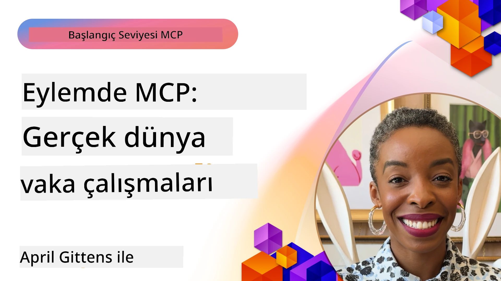

# MCP Eylemde: Gerçek Dünya Vaka Çalışmaları

_(Bu dersin videosunu görüntülemek için yukarıdaki görsele tıklayın)_

Model Context Protocol (MCP), AI uygulamalarının veri, araçlar ve hizmetlerle etkileşim kurma biçimini dönüştürüyor. Bu bölüm, MCP'nin çeşitli işletme senaryolarındaki pratik uygulamalarını gösteren gerçek dünya vaka çalışmalarını sunar.

## Genel Bakış

Bu bölüm, MCP uygulamalarına somut örnekler sunarak organizasyonların bu protokolü karmaşık iş zorluklarını çözmek için nasıl kullandığını vurgular. Bu vaka çalışmalarını inceleyerek, MCP'nin gerçek dünya senaryolarındaki çok yönlülüğü, ölçeklenebilirliği ve pratik faydaları hakkında bilgi edinirsiniz.

## Temel Öğrenme Hedefleri

Bu vaka çalışmalarını keşfederek şunları yapabileceksiniz:

- MCP'nin belirli iş problemlerini çözmek için nasıl uygulanabileceğini anlamak
- Farklı entegrasyon desenleri ve mimari yaklaşımlar hakkında bilgi edinmek
- MCP'yi kurumsal ortamlarda uygulamak için en iyi uygulamaları tanımak
- Gerçek dünya uygulamalarında karşılaşılan zorluklar ve çözümler hakkında bilgi sahibi olmak
- Kendi projelerinizde benzer desenleri uygulama fırsatlarını belirlemek

## Öne Çıkan Vaka Çalışmaları

### 1. [Azure AI Seyahat Acenteleri – Referans Uygulaması](./travelagentsample.md)

Bu vaka çalışması, Microsoft'un MCP, Azure OpenAI ve Azure AI Search kullanarak çoklu acenteli, yapay zekâ destekli bir seyahat planlama uygulaması geliştirmeyi gösteren kapsamlı referans çözümünü inceler. Projede şu özellikler vurgulanır:

- MCP aracılığıyla çoklu acente orkestrasyonu
- Azure AI Search ile kurumsal veri entegrasyonu
- Azure hizmetleri kullanılarak güvenli ve ölçeklendirilebilir mimari
- Yeniden kullanılabilir MCP bileşenleriyle genişletilebilir araçlar
- Azure OpenAI tarafından desteklenen konuşma tabanlı kullanıcı deneyimi

Mimari ve uygulama detayları, MCP'nin koordinasyon katmanı olarak kullanıldığı karmaşık çoklu acente sistemleri oluşturmak için değerli içgörüler sağlar.

### 2. [YouTube Verilerinden Azure DevOps Öğelerinin Güncellenmesi](./UpdateADOItemsFromYT.md)

Bu vaka çalışması, iş akışı süreçlerini otomatikleştirmek için MCP'nin pratik bir uygulamasını gösterir. MCP araçlarının nasıl kullanılabileceğini gösterir:

- Çevrimiçi platformlardan (YouTube) veri çıkarma
- Azure DevOps sistemlerindeki iş öğelerini güncelleme
- Tekrarlanabilir otomasyon iş akışları oluşturma
- Farklı sistemler arasında veri entegrasyonu

Bu örnek, nispeten basit MCP uygulamalarının bile rutin görevleri otomatikleştirerek ve sistemler arası veri tutarlılığını artırarak önemli verimlilik kazançları sağlayabileceğini gösterir.

### 3. [MCP ile Gerçek Zamanlı Dokümantasyon Erişimi](./docs-mcp/README.md)

Bu vaka çalışması, gerçek zamanlı ve bağlam duyarlı Microsoft dokümantasyonunu almak ve kaydetmek için bir Python konsol istemcisinin Model Context Protocol (MCP) sunucusuna nasıl bağlanacağını adım adım gösterir. Öğrenecekleriniz:

- Resmi MCP SDK’ı kullanarak Python istemcisi ile MCP sunucusuna bağlanma
- Verimli ve gerçek zamanlı veri almak için akışlı HTTP istemcileri kullanma
- Sunucudadokümantasyon araçlarını çağırma ve yanıtları doğrudan konsola kaydetme
- Güncel Microsoft dokümantasyonunu terminalden ayrı çıkmadan iş akışınıza entegre etme

Bölüm, uygulamalı bir görev, minimal çalışır durumda kod örneği ve daha derinlemesine öğrenme için ek kaynaklar içerir. MCP'nin konsol tabanlı ortamlarda dokümantasyon erişimini ve geliştirici üretkenliğini nasıl dönüştürebileceğini tam walkthrough ve kodlarla görebilirsiniz.

### 4. [MCP ile Etkileşimli Çalışma Planı Üretici Web Uygulaması](./docs-mcp/README.md)

Bu vaka çalışması, Chainlit ve Model Context Protocol (MCP) kullanarak herhangi bir konu için kişiselleştirilmiş çalışma planları oluşturmak üzere etkileşimli bir web uygulaması geliştirmeyi gösterir. Kullanıcılar bir konu (örneğin "AI-900 sertifikası") ve çalışma süresi (örneğin 8 hafta) belirtebilir ve uygulama haftalık önerilen içerik dökümü sunar. Chainlit, deneyimi sohbet tabanlı ve uyarlanabilir kılan bir arayüz sağlar.

- Chainlit destekli konuşma tabanlı web uygulaması
- Konu ve süre için kullanıcı tarafından yönlendirilen istemler
- MCP kullanılarak haftalık içerik önerileri
- Sohbet arayüzünde gerçek zamanlı, uyarlanabilir yanıtlar

Proje, konuşma tabanlı yapay zekâ ile MCP'nin modern web ortamlarında dinamik, kullanıcı odaklı eğitim araçları yaratmak için nasıl birleştirilebileceğini gösterir.

### 5. [VS Code'da MCP Sunucusu ile Editör İçi Dokümanlar](./docs-mcp/README.md)

Bu vaka çalışması, MCP sunucusunu kullanarak Microsoft Learn Dokümanlarını doğrudan VS Code ortamınıza getirmenin nasıl mümkün olduğunu gösterir—tarayıcı sekmeleri arasında geçiş yapmaya gerek kalmaz! Aşağıdakileri göreceksiniz:

- MCP paneli veya komut paleti aracılığıyla VS Code içinde anında doküman arama ve okuma
- Dokümantasyona başvurular yapma ve README veya kurs markdown dosyalarına doğrudan bağlantı ekleme
- GitHub Copilot ve MCP'yi bir arada kullanarak kesintisiz, yapay zekâ destekli dokümantasyon ve kod iş akışları
- Gerçek zamanlı geri bildirim ve Microsoft kaynaklı doğruluk ile dokümantasyonun doğrulanması ve geliştirilmesi
- Sürekli dokümantasyon doğrulaması için MCP’yi GitHub iş akışlarıyla entegre etme

Uygulamada yer alanlar:

- Kolay kurulum için örnek `.vscode/mcp.json` yapılandırması
- Editör içi deneyimin ekran görüntüleri ile anlatımı
- En yüksek verimlilik için Copilot ve MCP’nin birleşik kullanımı ipuçları

Bu senaryo, kurs yazarları, dokümantasyon yazarları ve dokümanlar, Copilot ve doğrulama araçları ile çalışırken editörde odaklanmak isteyen geliştiriciler için idealdir.

### 6. [APIM MCP Sunucusu Oluşturma](./apimsample.md)

Bu vaka çalışması, Azure API Yönetimi (APIM) kullanarak bir MCP sunucusunun nasıl oluşturulacağına dair adım adım rehber sunar. İçerikler:

- Azure API Yönetimi'nde MCP sunucusu kurulumu
- API işlemlerinin MCP araçları olarak dışa açılması
- Oran sınırlama ve güvenlik için politika yapılandırmaları
- Visual Studio Code ve GitHub Copilot kullanarak MCP sunucusunun test edilmesi

Bu örnek, Azure’un yeteneklerini kullanarak çeşitli uygulamalarda kullanılabilecek sağlam bir MCP sunucusunun nasıl oluşturulacağını göstermekte ve AI sistemlerinin kurumsal API’lerle entegrasyonunu güçlendirmektedir.

### 7. [GitHub MCP Kayıt Defteri — Ajan Entegrasyonunu Hızlandırma](https://github.com/mcp)

Bu vaka çalışması, Eylül 2025'te piyasaya sürülen GitHub'ın MCP Kayıt Defteri'nin Model Context Protocol (MCP) sunucularının dağınık keşfi ve dağıtımı gibi AI ekosistemindeki kritik bir sorunu nasıl çözdüğünü inceler.

#### Genel Bakış
**MCP Kayıt Defteri**, daha önce entegrasyonun yavaş ve hataya açık olmasına neden olan, depolar ve kayıt defterleri arasında dağılmış MCP sunucularının büyüyen sorununu çözer. Bu sunucular, AI ajanlarının API’ler, veri tabanları ve dokümantasyon kaynakları gibi harici sistemlerle etkileşim kurmasını sağlar.

#### Sorun Beyanı
Ajan temelli iş akışları geliştirenler çeşitli zorluklarla karşılaştı:
- MCP sunucularının farklı platformlarda **kötü keşfedilebilirliği**
- Forumlar ve dokümantasyonlarda tekrarlanan kurulum soruları
- Doğrulanmamış ve güvenilmez kaynaklardan kaynaklanan **güvenlik riskleri**
- Sunucu kalitesi ve uyumluluğunda **standart eksikliği**

#### Çözüm Mimarisi
GitHub'ın MCP Kayıt Defteri, şu temel özelliklerle güvenilir MCP sunucularını merkezi hale getirir:
- VS Code üzerinden **tek tıklamayla kurulum** entegrasyonu ile kolay kurulum
- Yıldızlar, etkinlik ve topluluk doğrulamasıyla **sinyal-akış ayırımı**
- GitHub Copilot ve diğer MCP uyumlu araçlarla **doğrudan entegrasyon**
- Topluluk ve kurumsal ortakların katkıda bulunmasını sağlayan **açık katkı modeli**

#### İş Etkisi
Kayıt defteri ölçülebilir gelişmeler sağladı:
- Microsoft Learn MCP Sunucusu gibi araçları kullanan geliştiriciler için **daha hızlı işe alım**
- `github-mcp-server` gibi uzmanlaşmış sunucularla doğal dilde GitHub otomasyonu (PR oluşturma, CI yeniden çalıştırma, kod tarama) sayesinde **artırılmış verimlilik**
- Derlenmiş listeler ve şeffaf yapılandırma standartlarıyla **güçlü ekosistem güveni**

#### Stratejik Değer
Ajan yaşam döngüsü yönetimi ve tekrarlanabilir iş akışlarında uzmanlaşanlar için MCP Kayıt Defteri:
- **Modüler ajan dağıtımı** yetenekleri için standart bileşenler
- **Kayıt defteri destekli değerlendirme hatları** ile tutarlı test ve doğrulama
- Farklı AI platformları arasında kesintisiz entegrasyona imkan veren **araçlar arası birlikte çalışabilirlik**

Bu vaka çalışması, MCP Kayıt Defteri'nin sadece bir dizin olmadığını, ölçeklenebilir, gerçek dünya model entegrasyonu ve ajan sistem dağıtımı için temel bir platform olduğunu gösterir.

## Sonuç

Bu yedi kapsamlı vaka çalışması, Model Context Protocol'ün farklı gerçek dünya senaryolarında gösterdiği şaşırtıcı çok yönlülüğü ve pratik uygulamaları ortaya koymaktadır. Karmaşık çoklu acente seyahat planlama sistemlerinden kurumsal API yönetimine, kolaylaştırılmış dokümantasyon iş akışlarından devrim niteliğindeki GitHub MCP Kayıt Defteri'ne kadar bu örnekler, MCP'nin AI sistemlerini ihtiyaç duydukları araçlar, veri ve hizmetlerle bağlamak için standartlaşmış ve ölçeklenebilir bir yol sunduğunu göstermektedir.

Vaka çalışmaları MCP uygulamasının çeşitli boyutlarını kapsar:
- **Kurumsal Entegrasyon**: Azure API Yönetimi ve Azure DevOps otomasyonu
- **Çoklu Acente Orkestrasyonu**: Koordine edilmiş AI ajanları ile seyahat planlama
- **Geliştirici Üretkenliği**: VS Code entegrasyonu ve gerçek zamanlı dokümantasyon erişimi
- **Ekosistem Gelişimi**: GitHub'ın MCP Kayıt Defteri temel platformu olarak
- **Eğitsel Uygulamalar**: Etkileşimli çalışma planı oluşturucular ve konuşma arayüzleri

Bu uygulamaları inceleyerek kritik içgörüler kazanırsınız:
- Farklı ölçekler ve kullanım durumları için **mimari desenler**
- İşlevselliği sürdürülebilirlikle dengeleyen **uygulama stratejileri**
- Üretim dağıtımları için **güvenlik ve ölçeklenebilirlik** konuları
- MCP sunucu geliştirme ve istemci entegrasyonu için **en iyi uygulamalar**
- Bağlantılı AI çözümleri oluşturmak için **ekosistem düşüncesi**

Bu örnekler topluca MCP'nin sadece teorik bir çerçeve olmadığını, karmaşık iş zorluklarına pratik çözümler sunan olgun, üretime hazır bir protokol olduğunu göstermektedir. Basit otomasyon araçlarından karmaşık çoklu acente sistemlerine kadar, burada gösterilen desenler ve yaklaşımlar kendi MCP projeleriniz için sağlam bir temel sunar.

## Ek Kaynaklar

- [Azure AI Seyahat Acenteleri GitHub Deposu](https://github.com/Azure-Samples/azure-ai-travel-agents)
- [Azure DevOps MCP Aracı](https://github.com/microsoft/azure-devops-mcp)
- [Playwright MCP Aracı](https://github.com/microsoft/playwright-mcp)
- [Microsoft Docs MCP Sunucusu](https://github.com/MicrosoftDocs/mcp)
- [GitHub MCP Kayıt Defteri — Ajan Entegrasyonunu Hızlandırma](https://github.com/mcp)
- [MCP Topluluk Örnekleri](https://github.com/microsoft/mcp)

## Sonraki Adım

- Önceki: [Modül 8: En İyi Uygulamalar](../08-BestPractices/README.md)
- Sonraki: [Modül 10: AI İş Akışlarını Kolaylaştırma: AI Araç Kiti ile MCP Sunucusu Oluşturma](../10-StreamliningAIWorkflowsBuildingAnMCPServerWithAIToolkit/README.md)

---

<!-- CO-OP TRANSLATOR DISCLAIMER START -->
**Feragatname**:  
Bu belge, AI çeviri hizmeti [Co-op Translator](https://github.com/Azure/co-op-translator) kullanılarak çevrilmiştir. Doğruluk için çaba sarf etsek de, otomatik çevirilerin hatalar veya yanlışlıklar içerebileceğini lütfen unutmayınız. Orijinal belge, kendi dilinde yetkili kaynak olarak kabul edilmelidir. Kritik bilgiler için profesyonel insan çevirisi önerilir. Bu çevirinin kullanımı sonucu ortaya çıkabilecek yanlış anlamalar veya yanlış yorumlamalar için sorumluluk kabul edilmez.
<!-- CO-OP TRANSLATOR DISCLAIMER END -->