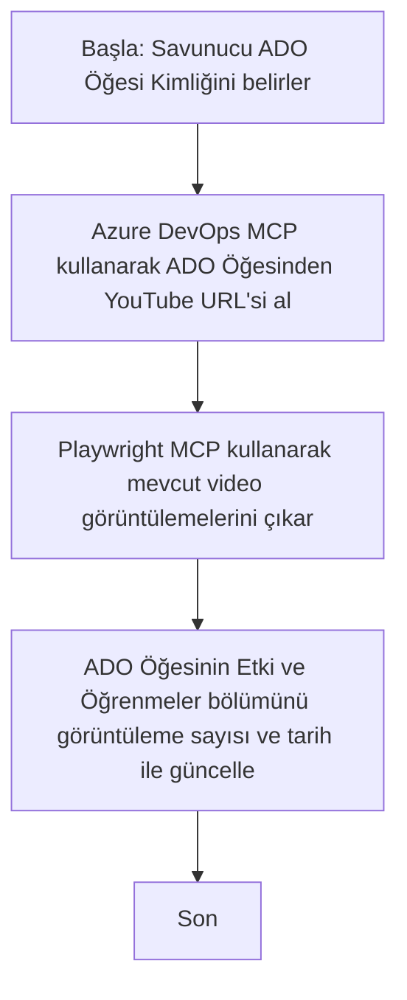

# Vaka Çalışması: MCP ile YouTube Verilerinden Azure DevOps Öğelerinin Güncellenmesi

> **Feragatname:** YouTube gibi platformlardan gelen verilerle Azure DevOps öğelerinin güncellenmesini otomatikleştirebilen mevcut çevrimiçi araçlar ve raporlar vardır. Aşağıdaki senaryo, MCP araçlarının otomasyon ve entegrasyon görevleri için nasıl uygulanabileceğini göstermek amacıyla sadece örnek bir kullanım durumu olarak sunulmuştur.

## Genel Bakış

Bu vaka çalışması, Model Context Protocol (MCP) ve araçlarının, YouTube gibi çevrimiçi platformlardan alınan bilgilerle Azure DevOps (ADO) çalışma öğelerinin güncellenmesini otomatikleştirmek için nasıl kullanılabileceğine dair bir örnek sunmaktadır. Açıklanan senaryo, bu araçların daha geniş yeteneklerinin sadece bir gösterimidir ve benzer birçok otomasyon ihtiyacına uyarlanabilir.

Bu örnekte, bir Savunucu (Advocate), her öğede bir YouTube video URL'si bulunan ADO öğelerini kullanarak çevrimiçi oturumları takip eder. MCP araçlarından yararlanarak, Savunucu ADO öğelerini en son video metrikleriyle, örneğin görüntüleme sayılarıyla, tekrarlanabilir ve otomatik bir şekilde güncel tutabilir. Bu yaklaşım, çevrimiçi kaynaklardan alınan bilgilerin ADO veya diğer sistemlere entegre edilmesi gereken diğer kullanım durumlarına genellenebilir.

## Senaryo

Bir Savunucu, çevrimiçi oturumların ve topluluk etkileşimlerinin etkisini izlemekten sorumludur. Her oturum, 'DevRel' projesinde bir ADO çalışma öğesi olarak kaydedilir ve çalışma öğesinde bir YouTube video URL alanı bulunur. Oturumun erişim kapsamını doğru bir şekilde raporlamak için Savunucu, ADO öğesini mevcut video görüntüleme sayısı ve bu bilginin alındığı tarihle güncellemelidir.

## Kullanılan Araçlar

- [Azure DevOps MCP](https://github.com/microsoft/azure-devops-mcp): MCP aracılığıyla ADO çalışma öğelerine programatik erişim ve güncelleme sağlar.
- [Playwright MCP](https://github.com/microsoft/playwright-mcp): YouTube video istatistikleri gibi web sayfalarından canlı veri çıkarmak için tarayıcı işlemlerini otomatikleştirir.

## Adım Adım İş Akışı

1. **ADO Öğesini Belirleme**: 'DevRel' projesindeki ADO çalışma öğesi kimliğiyle başlayın (örneğin, 1234).
2. **YouTube URL'sini Alma**: Azure DevOps MCP aracı kullanılarak çalışma öğesinden YouTube URL'si alınır.
3. **Video Görüntüleme Sayısını Çıkarma**: Playwright MCP aracı kullanılarak YouTube URL'sine gidilir ve mevcut görüntüleme sayısı çıkarılır.
4. **ADO Öğesini Güncelleme**: Azure DevOps MCP aracı kullanılarak en son görüntüleme sayısı ve alım tarihi ADO çalışma öğesinin 'Etki ve Öğrenmeler' bölümüne yazılır.

## Örnek İstek

```bash
- Work with the ADO Item ID: 1234
- The project is '2025-Awesome'
- Get the YouTube URL for the ADO item
- Use Playwright to get the current views from the YouTube video
- Update the ADO item with the current video views and the updated date of the information
```

## Mermaid Akış Diyagramı


## Teknik Uygulama

- **MCP Orkestrasyonu**: İş akışı, Azure DevOps MCP ve Playwright MCP araçlarının kullanımını koordine eden bir MCP sunucusu tarafından yönetilir.
- **Otomasyon**: Süreç manuel tetiklenebilir veya ADO öğelerini güncel tutmak için düzenli aralıklarla çalışacak şekilde zamanlanabilir.
- **Genişletilebilirlik**: Aynı model, ADO öğelerinin diğer çevrimiçi metriklerle (örneğin beğeniler, yorumlar) veya diğer platformlardan güncellenmesi için genişletilebilir.

## Sonuçlar ve Etki

- **Verimlilik**: Savunucuların video metriklerini alma ve güncelleme işini otomatikleştirerek manuel çabayı azaltır.
- **Doğruluk**: ADO öğelerinin çevrimiçi kaynaklardan alınabilen en güncel verileri yansıtmasını sağlar.
- **Tekrarlanabilirlik**: Diğer veri kaynakları veya metrikler için benzer senaryolarda yeniden kullanılabilir bir iş akışı sunar.

## Referanslar

- [Azure DevOps MCP](https://github.com/microsoft/azure-devops-mcp)
- [Playwright MCP](https://github.com/microsoft/playwright-mcp)
- [Model Context Protocol (MCP)](https://modelcontextprotocol.io/)

## Sonraki Adımlar

- Geriye dön: [Vaka Çalışmaları Genel Bakışı](./README.md)
- Sonraki: [MCP ile Gerçek Zamanlı Dokümantasyon Alımı](./docs-mcp/README.md)

---

<!-- CO-OP TRANSLATOR DISCLAIMER START -->
**Feragatname**:  
Bu belge, AI çeviri servisi [Co-op Translator](https://github.com/Azure/co-op-translator) kullanılarak çevrilmiştir. Doğruluk için çaba göstersek de, otomatik çevirilerin hatalar veya doğruluk eksiklikleri içerebileceğini lütfen unutmayınız. Orijinal belge, kendi özgün dilinde yetkili kaynak olarak kabul edilmelidir. Kritik bilgiler için profesyonel insan çevirisi önerilir. Bu çevirinin kullanımıyla ortaya çıkabilecek herhangi bir yanlış anlama veya hatalı yorumdan sorumlu değiliz.
<!-- CO-OP TRANSLATOR DISCLAIMER END -->