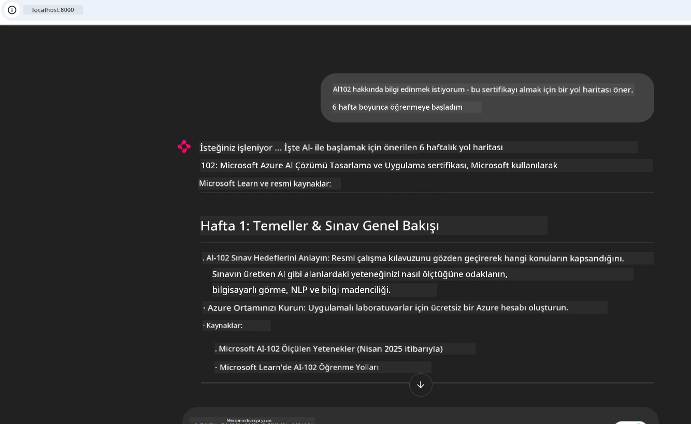
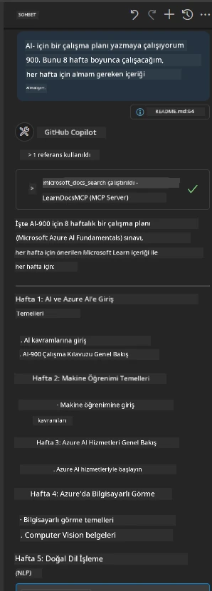

# Vaka İncelemesi: Bir İstemciden Microsoft Learn Docs MCP Sunucusuna Bağlanmak

Kodunuzdaki bir sorunu çözmeye çalışırken dokümantasyon siteleri, Stack Overflow ve sonsuz arama motoru sekmeleri arasında mı gidip geliyorsunuz? Belki sadece dokümanlar için ikinci bir monitörünüz var ya da sürekli IDE ile tarayıcı arasında alt-tab yapıyorsunuz. Dokümantasyonu doğrudan iş akışınıza—uygulamalarınıza, IDE’nize ya da kendi özel araçlarınıza entegre edebilseydiniz daha iyi olmaz mıydı? Bu vaka incelemesinde, kendi istemci uygulamanızdan Microsoft Learn Docs MCP sunucusuna doğrudan bağlanarak tam olarak bunu nasıl yapacağımızı keşfedeceğiz.

## Genel Bakış

Modern geliştirme yalnızca kod yazmaktan ibaret değildir—doğru bilgiyi doğru zamanda bulmaktır. Dokümantasyon her yerde fakat genellikle en çok ihtiyaç duyduğunuz yerde değildir: araçlarınızda ve iş akışlarınızın içinde. Dokümantasyon alanını uygulamalarınıza doğrudan entegre ederek zaman kazanabilir, bağlam değiştirmeyi azaltabilir ve üretkenliğinizi artırabilirsiniz. Bu bölümde, bir istemcinin Microsoft Learn Docs MCP sunucusuna nasıl bağlanacağını göstereceğiz, böylece uygulamanızdan hiç çıkmadan gerçek zamanlı, bağlam bilincine sahip dokümantasyona erişebileceksiniz.

Bağlantı kurma, istek gönderme ve akış yanıtlarını verimli şekilde işleme sürecini adım adım inceleyeceğiz. Bu yaklaşım iş akışınızı sadeleştirmekle kalmayıp daha akıllı, daha yardımcı geliştirici araçları oluşturmanın kapısını da açar.

## Öğrenme Hedefleri

Neden bunu yapıyoruz? Çünkü en iyi geliştirici deneyimleri sürtünmeyi ortadan kaldıranlardır. Kod editörünüzün, sohbet botunuzun veya web uygulamanızın, Microsoft Learn’den en güncel içerikle dokümantasyon sorularınızı anında yanıtladığını hayal edin. Bu bölümün sonunda şunları öğrenmiş olacaksınız:

- Dokümantasyon için MCP sunucu-istemci iletişiminin temellerini anlamak
- Microsoft Learn Docs MCP sunucusuna bağlanmak üzere konsol veya web uygulaması geliştirmek
- Gerçek zamanlı dokümantasyon almak için akış destekli HTTP istemcileri kullanmak
- Uygulamanızda dokümantasyon yanıtlarını kaydetmek ve yorumlamak

Bu yeteneklerin, sadece tepkisel değil, gerçekten etkileşimli ve bağlam bilincine sahip araçlar oluşturmanıza nasıl yardımcı olacağını göreceksiniz.

## Senaryo 1 - MCP ile Gerçek Zamanlı Dokümantasyon Alma

Bu senaryoda, bir istemciyi Microsoft Learn Docs MCP sunucusuna bağlayarak uygulamanızdan hiç çıkmadan gerçek zamanlı, bağlam bilincine sahip dokümantasyona nasıl erişeceğinizi gösteriyoruz.

Hadi bunu uygulamaya geçirelim. Göreviniz Microsoft Learn Docs MCP sunucusuna bağlanan, `microsoft_docs_search` aracını çağıran ve akış halinde gelen yanıtı konsola kaydeden bir uygulama yazmaktır.

### Neden bu yaklaşım?
Çünkü bu, ister bir sohbet botu, ister bir IDE eklentisi, ister web panosu olsun, daha gelişmiş entegrasyonlar inşa etmek için temeldir.

Bu senaryoya ait kod ve talimatları bu vaka incelemesinin [`solution`](./solution/README.md) klasöründe bulabilirsiniz. Adımlar size bağlantıyı nasıl kuracağınızı gösterecek:
- Resmi MCP SDK ve akış destekli HTTP istemcisini kullanarak bağlantı kurmak
- Dokümantasyonu almak için `microsoft_docs_search` aracını sorgu parametresiyle çağırmak
- Doğru kayıt tutma ve hata yönetimi uygulamak
- Kullanıcıların çoklu arama sorguları girmesine izin veren interaktif bir konsol arayüzü oluşturmak

Bu senaryo şunları gösterir:
- Docs MCP sunucusuna bağlanmak
- Bir sorgu göndermek
- Sonuçları ayrıştırmak ve yazdırmak

Çalışan çözüm şöyle görünebilir:

```
Prompt> What is Azure Key Vault?
Answer> Azure Key Vault is a cloud service for securely storing and accessing secrets. ...
```

Aşağıda minimal bir örnek çözüm bulunmaktadır. Tam kod ve detaylar solution klasöründe mevcuttur.

<details>
<summary>Python</summary>

```python
import asyncio
from mcp.client.streamable_http import streamablehttp_client
from mcp import ClientSession

async def main():
    async with streamablehttp_client("https://learn.microsoft.com/api/mcp") as (read_stream, write_stream, _):
        async with ClientSession(read_stream, write_stream) as session:
            await session.initialize()
            result = await session.call_tool("microsoft_docs_search", {"query": "Azure Functions best practices"})
            print(result.content)

if __name__ == "__main__":
    asyncio.run(main())
```

- Tam uygulama ve kayıt için [`scenario1.py`](../../../../09-CaseStudy/docs-mcp/solution/python/scenario1.py) dosyasına bakınız.
- Kurulum ve kullanım talimatları için aynı klasördeki [`README.md`](./solution/python/README.md) dosyasını inceleyiniz.
</details>


## Senaryo 2 - MCP ile Etkileşimli Çalışma Planı Oluşturucu Web Uygulaması

Bu senaryoda, Docs MCP’yi bir web geliştirme projesine nasıl entegre edeceğinizi öğreneceksiniz. Amaç, kullanıcıların Microsoft Learn dokümantasyonunu doğrudan bir web arayüzünden arayabilmelerini sağlamak ve dokümantasyona anında erişim sunmaktır.

Şunları göreceksiniz:
- Bir web uygulaması kurmak
- Docs MCP sunucusuna bağlanmak
- Kullanıcı girdisini işleyip sonuçları göstermek

Çalışan çözüm şöyle görünebilir:

```
User> I want to learn about AI102 - so suggest the roadmap to get it started from learn for 6 weeks

Assistant> Here’s a detailed 6-week roadmap to start your preparation for the AI-102: Designing and Implementing a Microsoft Azure AI Solution certification, using official Microsoft resources and focusing on exam skills areas:

---
## Week 1: Introduction & Fundamentals
- **Understand the Exam**: Review the [AI-102 exam skills outline](https://learn.microsoft.com/en-us/credentials/certifications/exams/ai-102/).
- **Set up Azure**: Sign up for a free Azure account if you don't have one.
- **Learning Path**: [Introduction to Azure AI services](https://learn.microsoft.com/en-us/training/modules/intro-to-azure-ai/)
- **Focus**: Get familiar with Azure portal, AI capabilities, and necessary tools.

....more weeks of the roadmap...

Let me know if you want module-specific recommendations or need more customized weekly tasks!
```

Aşağıda minimal bir örnek çözüm bulunmaktadır. Tam kod ve detaylar solution klasöründe mevcuttur.



<details>
<summary>Python (Chainlit)</summary>

Chainlit, konuşma tabanlı yapay zeka web uygulamaları oluşturmak için bir çerçevedir. MCP araçlarını çağırıp sonuçları gerçek zamanlı gösterebilen etkileşimli sohbet botları ve asistanlar yapmayı kolaylaştırır. Hızlı prototipleme ve kullanıcı dostu arayüzler için idealdir.

```python
import chainlit as cl
import requests

MCP_URL = "https://learn.microsoft.com/api/mcp"

@cl.on_message
def handle_message(message):
    query = {"question": message}
    response = requests.post(MCP_URL, json=query)
    if response.ok:
        result = response.json()
        cl.Message(content=result.get("answer", "No answer found.")).send()
    else:
        cl.Message(content="Error: " + response.text).send()
```

- Tam uygulama için [`scenario2.py`](../../../../09-CaseStudy/docs-mcp/solution/python/scenario2.py) dosyasına bakınız.
- Kurulum ve çalışma talimatları için [`README.md`](./solution/python/README.md) dosyasına göz atınız.
</details>


## Senaryo 3: VS Code’da MCP Sunucusu ile Editör İçinde Dokümanlar

Microsoft Learn Docs’u doğrudan VS Code içinde (tarayıcı sekmeleri arasında geçiş yapmak yerine) almak isterseniz, MCP sunucusunu editörünüzde kullanabilirsiniz. Bu size şunları sağlar:
- Kodlama ortamınızdan çıkmadan VS Code’da doküman arama ve okuma olanağı.
- README ya da kurs dosyalarınıza doğrudan doküman referansı verip bağlantılar eklemek.
- GitHub Copilot ile MCP’yi birleştirerek kesintisiz, yapay zekâ destekli dokümantasyon iş akışı.

**Şunları göreceksiniz:**
- Çalışma alanı köküne geçerli bir `.vscode/mcp.json` dosyası eklemek (aşağıdaki örneğe bakınız).
- MCP panelini açmak veya VS Code komut paletini kullanarak dokümanları aramak ve eklemek.
- Markdown dosyalarınız içinde çalışma sırasında doğrudan doküman referansı vermek.
- Bu iş akışını GitHub Copilot ile birleştirerek üretkenliği artırmak.

VS Code’da MCP sunucusunu kurmanın örneği şöyle:

```json
{
  "servers": {
    "LearnDocsMCP": {
      "url": "https://learn.microsoft.com/api/mcp"
    }
  }
}
```

</details>

> Ekran görüntüleri ve adım adım rehber için [`README.md`](./solution/scenario3/README.md) dosyasına bakınız.



Bu yaklaşım, teknik kurslar hazırlayanlar, dokümantasyon yazanlar veya sıkça referans gerektiren kod projeleri geliştiren herkes için idealdir.

## Anahtar Çıkarımlar

Dokümantasyonu doğrudan araçlarınıza entegre etmek sadece bir kolaylık değil, üretkenlik için bir devrimdir. İstemcinizden Microsoft Learn Docs MCP sunucusuna bağlanarak:

- Kodunuz ve dokümantasyon arasında bağlam değiştirmeyi ortadan kaldırabilirsiniz
- Güncel, bağlam farkındalıklı dokümanları gerçek zamanlı alabilirsiniz
- Daha akıllı, etkileşimli geliştirici araçları oluşturabilirsiniz

Bu beceriler, yalnızca verimli değil, aynı zamanda kullanması zevkli çözümler yaratmanızı sağlar.

## Ek Kaynaklar

Anlayışınızı derinleştirmek için şu resmi kaynakları keşfedin:

- [Microsoft Learn Docs MCP Server (GitHub)](https://github.com/MicrosoftDocs/mcp)
- [Azure MCP Server ile Başlama (mcp-python)](https://learn.microsoft.com/en-us/azure/developer/azure-mcp-server/get-started#create-the-python-app)
- [Azure MCP Server Nedir?](https://learn.microsoft.com/en-us/azure/developer/azure-mcp-server/)
- [Model Context Protocol (MCP) Tanıtımı](https://modelcontextprotocol.io/introduction)
- [MCP Sunucudan Eklenti Ekleme (Python)](https://learn.microsoft.com/en-us/semantic-kernel/concepts/plugins/adding-mcp-plugins)

## Sonraki Adımlar

- Geri dön: [Vaka İncelemeleri Genel Bakış](../README.md)
- Devam et: [Modül 10: AI Araç Takımı ile AI İş Akışlarını Kolaylaştırma](../../10-StreamliningAIWorkflowsBuildingAnMCPServerWithAIToolkit/README.md)

---

<!-- CO-OP TRANSLATOR DISCLAIMER START -->
**Feragatname**:
Bu belge, AI çeviri servisi [Co-op Translator](https://github.com/Azure/co-op-translator) kullanılarak çevrilmiştir. Doğruluk için çaba gösterilse de, otomatik çevirilerin hatalar veya yanlışlıklar içerebileceğini lütfen unutmayınız. Orijinal belge, kendi ana dilinde yetkili kaynak olarak kabul edilmelidir. Önemli bilgiler için profesyonel insan çevirisi önerilir. Bu çevirinin kullanımı sonucunda oluşabilecek yanlış anlamalar veya yorum hatalarından sorumlu değiliz.
<!-- CO-OP TRANSLATOR DISCLAIMER END -->