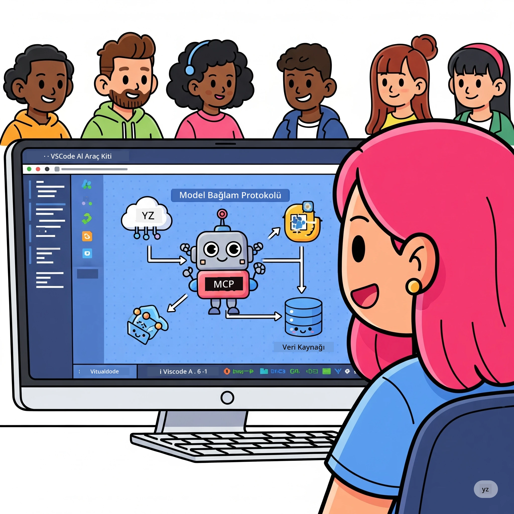
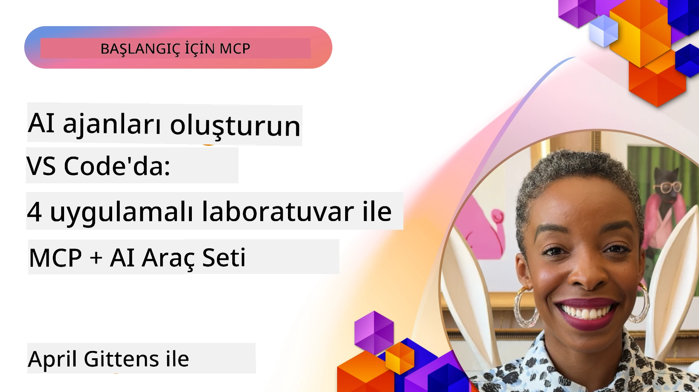

# Yapay Zeka İş Akışlarını Kolaylaştırma: AI Toolkit ile Bir MCP Sunucusu Oluşturma

## 🎯 Genel Bakış

_(Bu dersin videosunu izlemek için yukarıdaki görsele tıklayın)_

**Model Context Protocol (MCP) Atölyesi**ne hoş geldiniz! Bu kapsamlı uygulamalı atölye, yapay zeka uygulama geliştirmeyi devrim niteliğinde değiştiren iki ileri teknoloji teknolojiyi bir araya getiriyor:

- **🔗 Model Context Protocol (MCP)**: Sorunsuz Yapay Zeka araç entegrasyonu için açık standart
- **🛠️ Visual Studio Code için AI Toolkit (AITK)**: Microsoft’un güçlü Yapay Zeka geliştirme uzantısı

### 🎓 Neler Öğreneceksiniz

Bu atölyenin sonunda, Yapay Zeka modellerini gerçek dünya araçları ve hizmetlerle birleştiren zeki uygulamalar geliştirme sanatında ustalaşacaksınız. Otomatik testlerden özel API entegrasyonlarına kadar karmaşık iş zorluklarını çözmek için pratik beceriler kazanacaksınız.

## 🏗️ Teknoloji Yığını

### 🔌 Model Context Protocol (MCP)

MCP, yapay zeka modellerini dış araçlara ve veri kaynaklarına bağlayan **"Yapay Zeka için USB-C"** evrensel standarttır.

**✨ Temel Özellikler:**

- 🔄 **Standartlaştırılmış Entegrasyon**: Yapay Zeka-aracı bağlantıları için evrensel arayüz
- 🏛️ **Esnek Mimari**: stdio/SSE taşımacılığı ile yerel ve uzak sunucular
- 🧰 **Zengin Ekosistem**: Tek bir protokolde araçlar, istemler ve kaynaklar
- 🔒 **Kurumsal Hazır**: Yerleşik güvenlik ve güvenilirlik

**🎯 MCP’nin Önemi:**
USB-C’nin kablo karmaşasını ortadan kaldırması gibi MCP, yapay zeka entegrasyonlarının karmaşıklığını ortadan kaldırır. Tek protokol, sonsuz olasılık.

### 🤖 Visual Studio Code için AI Toolkit (AITK)

Microsoft’un öncü yapay zeka geliştirme uzantısı, VS Code’u bir yapay zeka gücüne dönüştürür.

**🚀 Temel Yetkinlikler:**

- 📦 **Model Kataloğu**: Azure AI, GitHub, Hugging Face, Ollama modellerine erişim
- ⚡ **Yerel Çıkarım**: ONNX optimize edilmiş CPU/GPU/NPU çalıştırma
- 🏗️ **Ajan Oluşturucu**: MCP entegrasyonlu görsel Yapay Zeka ajan geliştirme
- 🎭 **Çok Modlu**: Metin, görsel ve yapılandırılmış çıktı desteği

**💡 Geliştirme Avantajları:**

- Sıfır konfigürasyonlu model dağıtımı
- Görsel istem mühendisliği
- Gerçek zamanlı test alanı
- Kesintisiz MCP sunucu entegrasyonu

## 📚 Öğrenme Yolculuğu

### [🚀 Modül 1: AI Toolkit Temelleri](./lab1/README.md)

**Süre**: 15 dakika

- 🛠️ AI Toolkit for VS Code kurulumu ve yapılandırması
- 🗂️ Model Kataloğunu keşfetme (GitHub, ONNX, OpenAI, Anthropic, Google’dan 100+ model)
- 🎮 Gerçek zamanlı model testi için Etkileşimli Oyun Alanını öğrenme
- 🤖 Agent Builder ile ilk Yapay Zeka ajanınızı oluşturma
- 📊 Yerleşik ölçütlerle model performansını değerlendirme (F1, uygunluk, benzerlik, tutarlılık)
- ⚡ Toplu işleme ve çok modlu destek yeteneklerini öğrenme

**🎯 Öğrenme Çıktısı**: AITK yeteneklerini kapsayan fonksiyonel bir Yapay Zeka ajanı oluşturma

### [🌐 Modül 2: MCP ile AI Toolkit Temelleri](./lab2/README.md)

**Süre**: 20 dakika

- 🧠 Model Context Protocol (MCP) mimarisi ve kavramlarında ustalaşma
- 🌐 Microsoft’un MCP sunucu ekosistemini keşfetme
- 🤖 Playwright MCP sunucusunu kullanarak tarayıcı otomasyon ajanı oluşturma
- 🔧 MCP sunucularını AI Toolkit Agent Builder ile entegre etme
- 📊 Ajanlarınızda MCP araçlarını yapılandırma ve test etme
- 🚀 MCP destekli ajanları üretime aktarma ve dağıtma

**🎯 Öğrenme Çıktısı**: MCP aracılığıyla dış araçlarla güçlendirilmiş bir Yapay Zeka ajanı dağıtma

### [🔧 Modül 3: AI Toolkit ile İleri Düzey MCP Geliştirme](./lab3/README.md)

**Süre**: 20 dakika

- 💻 AI Toolkit kullanarak özel MCP sunucuları oluşturma
- 🐍 En son MCP Python SDK’sını (v1.9.3) yapılandırma ve kullanma
- 🔍 Hata ayıklama için MCP Inspector kurma ve kullanma
- 🛠️ Profesyonel hata ayıklama iş akışlarıyla Hava Durumu MCP Sunucusu oluşturma
- 🧪 Agent Builder ve Inspector ortamlarında MCP sunucularını hata ayıklama

**🎯 Öğrenme Çıktısı**: Modern araçlarla özel MCP sunucuları geliştirme ve hata ayıklama

### [🐙 Modül 4: Pratik MCP Geliştirme - Özel GitHub Clone Sunucusu](./lab4/README.md)

**Süre**: 30 dakika

- 🏗️ Gerçek dünya geliştirici iş akışları için GitHub Clone MCP Sunucusu oluşturma
- 🔄 Doğrulama ve hata yönetimiyle akıllı depo klonlama uygulama
- 📁 Akıllı dizin yönetimi ve VS Code entegrasyonu oluşturma
- 🤖 Özel MCP araçlarıyla GitHub Copilot Agent Modunu kullanma
- 🛡️ Üretim kalitesinde güvenilirlik ve çok platform uyumluluğu uygulama

**🎯 Öğrenme Çıktısı**: Gerçek geliştirme iş akışlarını kolaylaştıran üretime hazır MCP sunucusu dağıtma

## 💡 Gerçek Dünya Uygulamaları ve Etkileri

### 🏢 Kurumsal Kullanım Alanları

#### 🔄 DevOps Otomasyonu

Geliştirme iş akışınızı akıllı otomasyonla dönüştürün:

- **Akıllı Depo Yönetimi**: Yapay zekayla kod inceleme ve birleştirme kararları
- **Akıllı CI/CD**: Kod değişikliklerine göre otomatik boru hattı optimizasyonu
- **Sorun Sınıflandırma**: Otomatik hata sınıflandırma ve görev ataması

#### 🧪 Kalite Güvencesinde Devrim

Testleri yapay zeka destekli otomasyonla yükseltin:

- **Akıllı Test Oluşturma**: Kapsamlı test paketleri otomatik olarak oluşturma
- **Görsel Regresyon Testi**: Yapay zeka destekli kullanıcı arayüzü değişikliği algılama
- **Performans İzleme**: Proaktif sorun tespiti ve çözümü

#### 📊 Veri Boru Hattı Zekası

Daha akıllı veri işleme iş akışları oluşturun:

- **Uyarlanabilir ETL Süreçleri**: Kendi kendini optimize eden veri dönüşümleri
- **Anomali Tespiti**: Gerçek zamanlı veri kalitesi izleme
- **Akıllı Yönlendirme**: Akıllı veri akışı yönetimi

#### 🎧 Müşteri Deneyimi İyileştirme

Olağanüstü müşteri etkileşimleri yaratın:

- **Kontekst Farkındalıklı Destek**: Müşteri geçmişine erişimi olan yapay zeka ajanları
- **Proaktif Sorun Çözümü**: Öngörücü müşteri hizmetleri
- **Çok Kanallı Entegrasyon**: Platformlar arası birleşik yapay zeka deneyimi

## 🛠️ Ön Koşullar ve Kurulum

### 💻 Sistem Gereksinimleri

| Bileşen | Gereksinim | Notlar |
|---------|------------|--------|
| **İşletim Sistemi** | Windows 10+, macOS 10.15+, Linux | Herhangi modern OS |
| **Visual Studio Code** | En son stabil sürüm | AITK için gerekli |
| **Node.js** | v18.0+ ve npm | MCP sunucu geliştirme için |
| **Python** | 3.10+ | Python MCP sunucuları için opsiyonel |
| **Bellek** | En az 8GB RAM | Yerel modeller için 16GB önerilir |

### 🔧 Geliştirme Ortamı

#### Önerilen VS Code Uzantıları

- **AI Toolkit** (ms-windows-ai-studio.windows-ai-studio)
- **Python** (ms-python.python)
- **Python Debugger** (ms-python.debugpy)
- **GitHub Copilot** (GitHub.copilot) - Opsiyonel ancak faydalı

#### Opsiyonel Araçlar

- **uv**: Modern Python paket yöneticisi
- **MCP Inspector**: MCP sunucuları için görsel hata ayıklama aracı
- **Playwright**: Web otomasyonu örnekleri için

## 🎖️ Öğrenme Çıktıları ve Sertifikasyon Yolu

### 🏆 Beceri Ustalığı Kontrol Listesi

Bu atölyeyi tamamlayarak aşağıdaki alanlarda ustalık kazanacaksınız:

#### 🎯 Temel Yetkinlikler

- [ ] **MCP Protokol Ustalığı**: Mimari ve uygulama örüntülerinde derin bilgi
- [ ] **AITK Yeterliliği**: AI Toolkit ile hızlı geliştirme yetkinliği
- [ ] **Özel Sunucu Geliştirme**: Üretim MCP sunucuları oluşturma, dağıtma ve sürdürme
- [ ] **Araç Entegrasyonu Mükemmelliği**: Yapay zekayı mevcut geliştirme iş akışlarına sorunsuz bağlama
- [ ] **Problem Çözme Uygulaması**: Öğrenilen becerileri gerçek iş zorluklarına uygulama

#### 🔧 Teknik Beceriler

- [ ] VS Code'da AI Toolkit kurulumu ve yapılandırması
- [ ] Özel MCP sunucuları tasarlama ve uygulama
- [ ] GitHub Modellerini MCP mimarisi ile entegre etme
- [ ] Playwright ile otomatik test iş akışları oluşturma
- [ ] Üretim için yapay zeka ajanları dağıtma
- [ ] MCP sunucu performansını hata ayıklama ve optimize etme

#### 🚀 İleri Yetkinlikler

- [ ] Kurumsal ölçekli yapay zeka entegrasyonları mimarisi geliştirme
- [ ] Yapay zeka uygulamaları için güvenlik en iyi uygulamalarını uygulama
- [ ] Ölçeklenebilir MCP sunucu mimarileri tasarlama
- [ ] Belirli alanlar için özel araç zincirleri oluşturma
- [ ] Yapay zeka yerel geliştirmede başkalarına rehberlik etme

## 📖 Ek Kaynaklar

- [MCP Spesifikasyonu (2025-11-25)](https://spec.modelcontextprotocol.io/specification/2025-11-25/)
- [AI Toolkit GitHub Deposu](https://github.com/microsoft/vscode-ai-toolkit)
- [Örnek MCP Sunucu Koleksiyonu](https://github.com/modelcontextprotocol/servers)
- [En İyi Uygulamalar Rehberi](https://modelcontextprotocol.io/docs/best-practices)
- [OWASP MCP Top 10](https://microsoft.github.io/mcp-azure-security-guide/mcp/) - Güvenlik en iyi uygulamaları

---

**🚀 Yapay zeka geliştirme iş akışınızı devrim niteliğinde değiştirmeye hazır mısınız?**

MCP ve AI Toolkit ile birlikte zeki uygulamaların geleceğini birlikte inşa edelim!

## Sonraki Adım

Devam et: [Modül 11: MCP Sunucu Uygulamalı Laboratuvarlar](../11-MCPServerHandsOnLabs/README.md)

---

<!-- CO-OP TRANSLATOR DISCLAIMER START -->
**Feragatname**:
Bu belge, yapay zeka çeviri hizmeti [Co-op Translator](https://github.com/Azure/co-op-translator) kullanılarak çevrilmiştir. Doğruluk için çaba göstermekle birlikte, otomatik çevirilerin hatalar veya yanlışlıklar içerebileceğini lütfen unutmayınız. Orijinal belge, kendi ana dilinde yetkili kaynak olarak kabul edilmelidir. Kritik bilgiler için profesyonel insan çevirisi önerilir. Bu çevirinin kullanımı sonucu oluşabilecek yanlış anlamalar veya yanlış yorumlamalar için sorumluluk kabul edilmemektedir.
<!-- CO-OP TRANSLATOR DISCLAIMER END -->