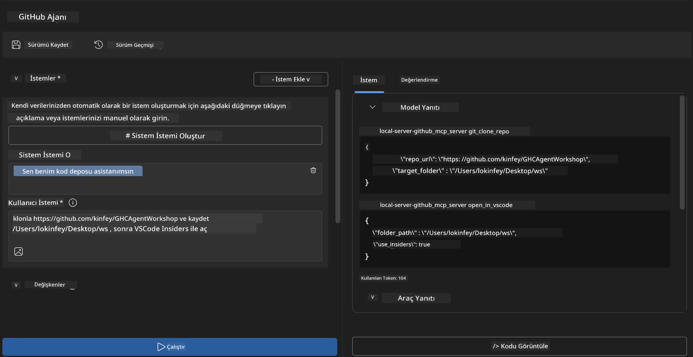
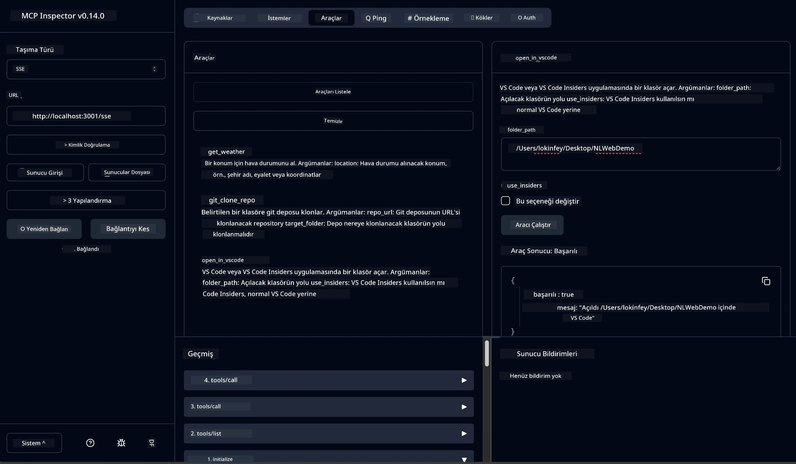

# 🐙 Modül 4: Pratik MCP Geliştirme - Özel GitHub Klon Sunucusu


> **⚡ Hızlı Başlangıç:** Sadece 30 dakikada GitHub depo klonlama ve VS Code entegrasyonunu otomatikleştiren, üretime hazır bir MCP sunucusu oluşturun!

## 🎯 Öğrenme Hedefleri

Bu laboratuvarın sonunda şunları yapabileceksiniz:

- ✅ Gerçek dünyaya yönelik geliştirme iş akışları için özel bir MCP sunucusu oluşturmak
- ✅ MCP üzerinden GitHub depo klonlama işlevselliği uygulamak
- ✅ Özel MCP sunucularını VS Code ve Agent Builder ile entegre etmek
- ✅ GitHub Copilot Agent Modu’nu özel MCP araçlarıyla kullanmak
- ✅ Üretim ortamlarında özel MCP sunucularını test edip dağıtmak

## 📋 Ön Koşullar

- Laboratuvar 1-3 tamamlanmış olmalı (MCP temelleri ve ileri geliştirme)
- GitHub Copilot aboneliği ([ücretsiz kayıt mevcut](https://github.com/github-copilot/signup))
- AI Toolkit ve GitHub Copilot eklentileri yüklü VS Code
- Git CLI kurulu ve yapılandırılmış

## 🏗️ Proje Genel Bakış

### **Gerçek Dünya Geliştirme Zorluğu**
Geliştiriciler olarak sık sık GitHub’dan depoları klonlayıp VS Code veya VS Code Insiders’da açıyoruz. Bu manuel işlem şunları içeriyor:
1. Terminal/komut istemcisini açmak
2. İstenen dizine gitmek
3. `git clone` komutunu çalıştırmak
4. Klonlanan dizinde VS Code açmak

**Bizim MCP çözümümüz bunu tek bir akıllı komuta indirger!**

### **Ne İnşa Edeceksiniz**
Bir **GitHub Clone MCP Sunucusu** (`git_mcp_server`) aşağıdaki özellikleri sağlar:

| Özellik | Açıklama | Fayda |
|---------|-------------|---------|
| 🔄 **Akıllı Depo Klonlama** | GitHub depolarını doğrulama ile klonlar | Otomatik hata kontrolü |
| 📁 **Akıllı Dizin Yönetimi** | Dizinleri güvenli şekilde kontrol edip oluşturur | Üzerine yazmayı engeller |
| 🚀 **Çapraz Platform VS Code Entegrasyonu** | Projeleri VS Code/Insiders’da açar | Kesintisiz iş akışı geçişi |
| 🛡️ **Sağlam Hata Yönetimi** | Ağ, izin ve yol sorunlarını yönetir | Üretime uygun güvenilirlik |

---

## 📖 Adım Adım Uygulama

### Adım 1: Agent Builder’da GitHub Agent Oluşturun

1. AI Toolkit uzantısı üzerinden **Agent Builder’ı başlatın**
2. Aşağıdaki yapılandırmayla **yeni bir agent oluşturun:**
   ```
   Agent Name: GitHubAgent
   ```

3. **Özel MCP sunucusunu başlatın:**
   - **Tools** → **Add Tool** → **MCP Server** menüsüne gidin
   - **"Create A new MCP Server"** seçeneğini seçin
   - En fazla esneklik için **Python şablonunu** seçin
   - **Sunucu Adı:** `git_mcp_server`

### Adım 2: GitHub Copilot Agent Modunu Yapılandırın

1. VS Code’da **GitHub Copilot’u açın** (Ctrl/Cmd + Shift + P → "GitHub Copilot: Open")
2. Copilot arayüzünde **Agent Model** seçeneğini seçin
3. Gelişmiş mantık için **Claude 3.7 modelini seçin**
4. Araç erişimi için **MCP entegrasyonunu etkinleştirin**

> **💡 Uzman İpuçları:** Claude 3.7, geliştirme iş akışları ve hata yönetimi kalıplarını üstün anlama sağlar.

### Adım 3: Temel MCP Sunucu İşlevselliğini Uygulayın

**GitHub Copilot Agent Modu ile aşağıdaki ayrıntılı istemi kullanın:**

```
Create two MCP tools with the following comprehensive requirements:

🔧 TOOL A: clone_repository
Requirements:
- Clone any GitHub repository to a specified local folder
- Return the absolute path of the successfully cloned project
- Implement comprehensive validation:
  ✓ Check if target directory already exists (return error if exists)
  ✓ Validate GitHub URL format (https://github.com/user/repo)
  ✓ Verify git command availability (prompt installation if missing)
  ✓ Handle network connectivity issues
  ✓ Provide clear error messages for all failure scenarios

🚀 TOOL B: open_in_vscode
Requirements:
- Open specified folder in VS Code or VS Code Insiders
- Cross-platform compatibility (Windows/Linux/macOS)
- Use direct application launch (not terminal commands)
- Auto-detect available VS Code installations
- Handle cases where VS Code is not installed
- Provide user-friendly error messages

Additional Requirements:
- Follow MCP 1.9.3 best practices
- Include proper type hints and documentation
- Implement logging for debugging purposes
- Add input validation for all parameters
- Include comprehensive error handling
```

### Adım 4: MCP Sunucunuzu Test Edin

#### 4a. Agent Builder’da Test

1. Agent Builder için **hata ayıklama yapılandırmasını başlatın**
2. Agent’ınızı bu sistem istemiyle yapılandırın:

```
SYSTEM_PROMPT:
You are my intelligent coding repository assistant. You help developers efficiently clone GitHub repositories and set up their development environment. Always provide clear feedback about operations and handle errors gracefully.
```

3. Gerçekçi kullanıcı senaryolarıyla test edin:

```
USER_PROMPT EXAMPLES:

Scenario : Basic Clone and Open
"Clone {Your GitHub Repo link such as https://github.com/kinfey/GHCAgentWorkshop
 } and save to {The global path you specify}, then open it with VS Code Insiders"
```



**Beklenen Sonuçlar:**
- ✅ Yol doğrulaması ile başarılı klonlama
- ✅ Otomatik VS Code başlatma
- ✅ Geçersiz durumlar için net hata mesajları
- ✅ Kenar durumların doğru yönetimi

#### 4b. MCP Inspector’da Test




---


**🎉 Tebrikler!** Gerçek geliştirme iş akışı sorunlarını çözen pratik, üretime hazır bir MCP sunucusu oluşturmayı başardınız. Özel GitHub klon sunucunuz, geliştirici verimliliğini otomatikleştirmek ve artırmak için MCP’nin gücünü gösteriyor.

### 🏆 Kazanılan Başarımlar:
- ✅ **MCP Geliştiricisi** - Özel MCP sunucusu oluşturuldu
- ✅ **İş Akışı Otomasyonu** - Geliştirme süreçleri kolaylaştırıldı  
- ✅ **Entegrasyon Uzmanı** - Çoklu geliştirme araçları bağlandı
- ✅ **Üretime Hazır** - Dağıtılabilir çözümler oluşturuldu

---

## 🎓 Atölye Tamamlandı: Model Context Protocol Yolculuğunuz

**Sayın Atölye Katılımcısı,**

Model Context Protocol atölyesinin tüm dört modülünü tamamladığınız için tebrikler! Temel AI Toolkit kavramlarını anlamaktan, gerçek dünya geliştirme sorunlarını çözen üretime hazır MCP sunucuları oluşturmaya kadar çok yol kat ettiniz.

### 🚀 Öğrenme Yolculuğunuzun Özeti:

**[Modül 1](../lab1/README.md)**: AI Toolkit temellerini, model testlerini ve ilk AI agentınızı oluşturmayı keşfettiniz.

**[Modül 2](../lab2/README.md)**: MCP mimarisini öğrendiniz, Playwright MCP’yi entegre ettiniz ve ilk tarayıcı otomasyon agentınızı inşa ettiniz.

**[Modül 3](../lab3/README.md)**: Weather MCP sunucusu ile özel MCP sunucu geliştirmeye ilerlediniz ve hata ayıklama araçlarını ustalıkla kullandınız.

**[Modül 4](../lab4/README.md)**: Şimdiye kadar öğrendiklerinizi kullanarak pratik bir GitHub depo iş akışı otomasyon aracını oluşturdunuz.

### 🌟 Ustalaştığınız Konular:

- ✅ **AI Toolkit Ekosistemi**: Modeller, ajanlar ve entegrasyon kalıpları
- ✅ **MCP Mimarisi**: İstemci-sunucu tasarımı, taşıma protokolleri ve güvenlik
- ✅ **Geliştirici Araçları**: Playground’dan Inspector’a ve üretime dağıtıma
- ✅ **Özel Geliştirme**: Kendi MCP sunucularınızı inşa edip test etmek ve dağıtmak
- ✅ **Pratik Uygulamalar**: AI ile gerçek geliştirme iş akışı sorunlarını çözmek

### 🔮 Sonraki Adımlarınız:

1. **Kendi MCP Sunucunuzu Kurun**: Bu becerileri kullanarak benzersiz iş akışlarınızı otomatikleştirin
2. **MCP Topluluğuna Katılın**: Yaratımlarınızı paylaşın ve diğerlerinden öğrenin
3. **Gelişmiş Entegrasyonları Keşfedin**: MCP sunucularını kurumsal sistemlere bağlayın
4. **Açık Kaynağa Katkıda Bulunun**: MCP araçları ve dokümantasyonunu geliştirin

Unutmayın, bu atölye daha başlangıç. Model Context Protocol ekosistemi hızla gelişiyor ve siz artık AI destekli geliştirme araçlarının ön saflarında yer almaya hazırsınız.

**Katılımınız ve öğrenmeye adanmışlığınız için teşekkür ederiz!**

Bu atölyenin, geliştirme yolculuğunuzda AI araçlarıyla nasıl etkileşim kuracağınız ve inşa edeceğiniz konusunda akıllarınızı açmasını umuyoruz.

**İyi kodlamalar!**

---

## Sonraki Ne Var

Modül 10’daki tüm laboratuvarları tamamladığınız için tebrikler!

- Geri dön: [Modül 10 Genel Bakış](../README.md)
- Devam et: [Modül 11: MCP Server Uygulamalı Laboratuvarlar](../../11-MCPServerHandsOnLabs/README.md)

---

<!-- CO-OP TRANSLATOR DISCLAIMER START -->
**Feragatname**:
Bu belge, AI çeviri servisi [Co-op Translator](https://github.com/Azure/co-op-translator) kullanılarak çevrilmiştir. Doğru çeviri yapmaya özen göstersek de, otomatik çevirilerin hatalar veya yanlışlıklar içerebileceğinin farkında olunuz. Orijinal belge, kendi dilinde yetkili kaynak olarak kabul edilmelidir. Kritik bilgiler için profesyonel insan çevirisi önerilir. Bu çevirinin kullanımı sonucunda oluşabilecek yanlış anlamalar veya yorum hatalarından sorumlu değiliz.
<!-- CO-OP TRANSLATOR DISCLAIMER END -->