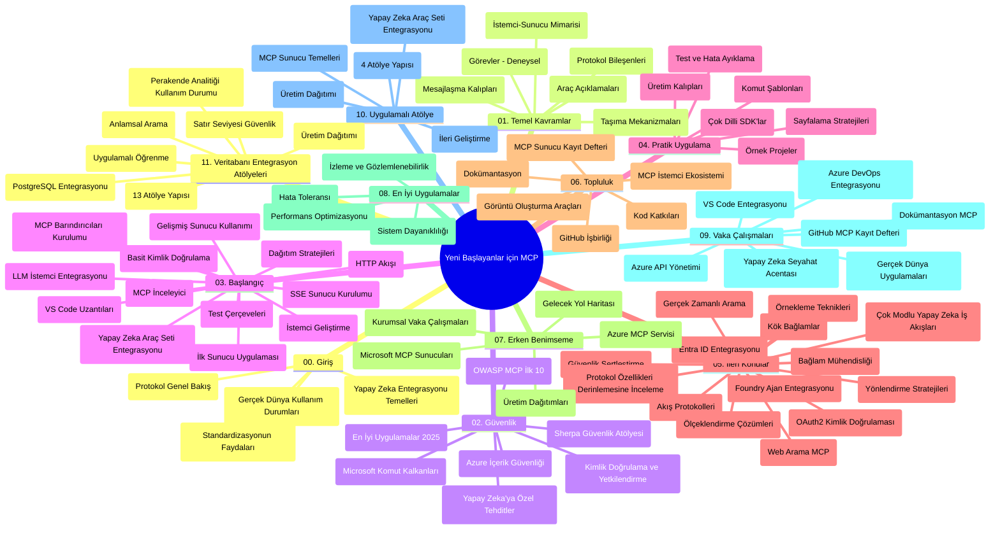

# Yeni Başlayanlar için Model Bağlam Protokolü (MCP) - Çalışma Rehberi

Bu çalışma rehberi, "Yeni Başlayanlar için Model Bağlam Protokolü (MCP)" müfredatının depo yapısı ve içeriğine genel bir bakış sunar. Depoyu verimli bir şekilde gezmek ve mevcut kaynaklardan en iyi şekilde yararlanmak için bu rehberi kullanın.

## Depo Genel Bakışı

Model Bağlam Protokolü (MCP), AI modelleri ile istemci uygulamalar arasındaki etkileşimler için standartlaştırılmış bir çerçevedir. Başlangıçta Anthropic tarafından oluşturulan MCP, artık resmi GitHub organizasyonu aracılığıyla daha geniş MCP topluluğu tarafından sürdürülebilmektedir. Bu depo, AI geliştiricileri, sistem mimarları ve yazılım mühendisleri için C#, Java, JavaScript, Python ve TypeScript dillerinde uygulamalı kod örnekleri içeren kapsamlı bir müfredat sunar.

## Görsel Müfredat Haritası

## Depo Yapısı

Depo, MCP'nin farklı yönlerine odaklanan on bir ana bölüm halinde düzenlenmiştir:

1. **Giriş (00-Introduction/)**
   - Model Bağlam Protokolü genel bakışı
   - AI boru hatlarında standardizasyon neden önemlidir
   - Pratik kullanım örnekleri ve faydalar

2. **Temel Kavramlar (01-CoreConcepts/)**
   - İstemci-sunucu mimarisi
   - Ana protokol bileşenleri
   - MCP'deki mesajlaşma kalıpları

3. **Güvenlik (02-Security/)**
   - MCP tabanlı sistemlerde güvenlik tehditleri
   - Uygulamaların güvence altına alınması için en iyi uygulamalar
   - Kimlik doğrulama ve yetkilendirme stratejileri
   - **Kapsamlı Güvenlik Belgeleri**:
     - MCP Güvenlik En İyi Uygulamaları 2025
     - Azure İçerik Güvenliği Uygulama Kılavuzu
     - MCP Güvenlik Kontrolleri ve Teknikleri
     - MCP En İyi Uygulamalar Hızlı Referans
   - **Önemli Güvenlik Konuları**:
     - İstek enjeksiyonu ve araç zehirleme saldırıları
     - Oturum kaçırma ve karışık vekil problemleri
     - Jeton geçişi güvenlik açıkları
     - Aşırı izinler ve erişim kontrolü
     - AI bileşenleri için tedarik zinciri güvenliği
     - Microsoft İstek Kalkanları entegrasyonu

4. **Başlangıç (03-GettingStarted/)**
   - Ortam kurulumu ve yapılandırma
   - Temel MCP sunucuları ve istemcileri oluşturma
   - Mevcut uygulamalarla entegrasyon
   - İçerdiği bölümler:
     - İlk sunucu uygulaması
     - İstemci geliştirme
     - LLM istemci entegrasyonu
     - VS Code entegrasyonu
     - Sunucudan Gönderilen Olaylar (SSE) sunucusu
     - Gelişmiş sunucu kullanımı
     - HTTP akışı
     - AI Araç Seti entegrasyonu
     - Test stratejileri
     - Dağıtım yönergeleri

5. **Pratik Uygulama (04-PracticalImplementation/)**
   - Farklı programlama dillerinde SDK kullanım
   - Hata ayıklama, test ve doğrulama teknikleri
   - Yeniden kullanılabilir istek şablonları ve iş akışları geliştirme
   - Uygulama örnekleri içeren projeler

6. **İleri Konular (05-AdvancedTopics/)**
   - Bağlam mühendisliği teknikleri
   - Foundry ajan entegrasyonu
   - Çok modlu AI iş akışları
   - OAuth2 kimlik doğrulama demoları
   - Gerçek zamanlı arama yetenekleri
   - Gerçek zamanlı akış
   - Kök bağlamların uygulanması
   - Yönlendirme stratejileri
   - Örnekleme teknikleri
   - Ölçeklendirme yaklaşımları
   - Güvenlik hususları
   - Entra ID güvenlik entegrasyonu
   - Web arama entegrasyonu

7. **Topluluk Katkıları (06-CommunityContributions/)**
   - Kod ve dokümantasyon katkısı yapma yolları
   - GitHub üzerinden iş birliği yapma
   - Topluluk tarafından yönlendirilen geliştirmeler ve geri bildirimler
   - Farklı MCP istemcilerinin kullanımı (Claude Desktop, Cline, VSCode)
   - Popüler MCP sunucularıyla çalışma dahil, görüntü oluşturma da dahil

8. **Erken Benimseme Dersleri (07-LessonsfromEarlyAdoption/)**
   - Gerçek dünya uygulamaları ve başarı hikayeleri
   - MCP tabanlı çözümler geliştirme ve dağıtma
   - Trendler ve geleceğe dair yol haritası
   - **Microsoft MCP Sunucular Kılavuzu**: 10 üretim hazır Microsoft MCP sunucusuna kapsamlı rehber:
     - Microsoft Learn Docs MCP Sunucusu
     - Azure MCP Sunucusu (15+ özel konektör)
     - GitHub MCP Sunucusu
     - Azure DevOps MCP Sunucusu
     - MarkItDown MCP Sunucusu
     - SQL Server MCP Sunucusu
     - Playwright MCP Sunucusu
     - Dev Box MCP Sunucusu
     - Azure AI Foundry MCP Sunucusu
     - Microsoft 365 Agents Toolkit MCP Sunucusu

9. **En İyi Uygulamalar (08-BestPractices/)**
   - Performans ayarlama ve optimizasyon
   - Hata toleranslı MCP sistemleri tasarlama
   - Test ve dayanıklılık stratejileri

10. **Vaka Analizleri (09-CaseStudy/)**
    - MCP'nin çok yönlülüğünü gösteren **yedi kapsamlı vaka analizi**:
    - **Azure AI Seyahat Ajanları**: Azure OpenAI ve AI Arama ile çok ajanlı orkestrasyon
    - **Azure DevOps Entegrasyonu**: YouTube veri güncellemeleriyle iş akışlarını otomatikleştirme
    - **Gerçek Zamanlı Dokümantasyon Getirimi**: Python konsol istemcisi ile HTTP akışı
    - **Etkileşimli Çalışma Planı Oluşturucu**: Chainlit web uygulaması ile sohbet bazlı AI
    - **Düzenleyicide Dokümantasyon**: VS Code entegrasyonu ve GitHub Copilot iş akışları
    - **Azure API Yönetimi**: Kurumsal API entegrasyonu ve MCP sunucu oluşturma
    - **GitHub MCP Kayıt Defteri**: Ekosistem geliştirme ve ajan entegrasyon platformu
    - Kurumsal entegrasyon, geliştirici üretkenliği ve ekosistem geliştirmeyi kapsayan örnek uygulamalar

11. **Uygulamalı Atölye (10-StreamliningAIWorkflowsBuildingAnMCPServerWithAIToolkit/)**
    - MCP ile AI Araç Seti’ni birleştiren kapsamlı uygulamalı atölye
    - AI modelleri ile gerçek dünya araçları arasında köprü kuran zeki uygulamalar geliştirme
    - Temeller, özel sunucu geliştirme ve üretim dağıtım stratejilerini kapsayan pratik modüller
    - **Laboratuvar Yapısı**:
      - Laboratuvar 1: MCP Sunucu Temelleri
      - Laboratuvar 2: Gelişmiş MCP Sunucu Geliştirme
      - Laboratuvar 3: AI Araç Seti Entegrasyonu
      - Laboratuvar 4: Üretim Dağıtımı ve Ölçeklendirme
    - Adım adım talimatlarla laboratuvar tabanlı öğrenme yaklaşımı

12. **MCP Sunucu Veritabanı Entegrasyon Laboratuvarları (11-MCPServerHandsOnLabs/)**
    - PostgreSQL entegrasyonlu üretim hazır MCP sunucuları için **kapsamlı 13-laboratuvar öğrenme yolu**
    - Zava Retail kullanım senaryosu ile gerçek dünya perakende analitiği uygulaması
    - Satır Seviyesi Güvenliği (RLS), anlamsal arama ve çok kiracılı veri erişimi dahil kurumsal sınıf kalıplar
    - **Tam Laboratuvar Yapısı**:
      - **Laboratuvar 00-03: Temeller** - Giriş, Mimari, Güvenlik, Ortam Kurulumu
      - **Laboratuvar 04-06: MCP Sunucusu İnşası** - Veritabanı Tasarımı, MCP Sunucusu Uygulaması, Araç Geliştirme
      - **Laboratuvar 07-09: Gelişmiş Özellikler** - Anlamsal Arama, Test & Hata Ayıklama, VS Code Entegrasyonu
      - **Laboratuvar 10-12: Üretim ve En İyi Uygulamalar** - Dağıtım, İzleme, Optimizasyon
    - **Kapsanan Teknolojiler**: FastMCP framework, PostgreSQL, Azure OpenAI, Azure Container Apps, Application Insights
    - **Öğrenim Çıktıları**: Üretim hazır MCP sunucuları, veritabanı entegrasyon kalıpları, AI destekli analiz, kurumsal güvenlik

## Ek Kaynaklar

Depo destekleyici kaynaklar içerir:

- **Images klasörü**: Müfredat boyunca kullanılan diyagramlar ve illüstrasyonlar içerir
- **Çeviriler**: Dokümantasyonun otomatik çevirileriyle çok dilli destek
- **Resmi MCP Kaynakları**:
  - [MCP Dokümantasyonu](https://modelcontextprotocol.io/)
  - [MCP Spesifikasyonu](https://spec.modelcontextprotocol.io/)
  - [MCP GitHub Deposu](https://github.com/modelcontextprotocol)

## Bu Depo Nasıl Kullanılır

1. **Sıralı Öğrenme**: Yapılandırılmış bir öğrenme deneyimi için bölümleri sırayla (00'dan 11'e) izleyin.
2. **Dil Bazlı Odaklanma**: Belirli bir programlama diliyle ilgileniyorsanız, örnekler dizininde tercih ettiğiniz dildeki uygulamaları keşfedin.
3. **Pratik Uygulama**: Ortamınızı kurmak ve ilk MCP sunucunuzu ve istemcinizi oluşturmak için "Başlangıç" bölümünden başlayın.
4. **İleri Seviye Keşif**: Temellerden rahat olduğunuzda, bilgilerinizi genişletmek için ileri konulara dalın.
5. **Topluluk Katılımı**: Deneyimli uzmanlar ve diğer geliştiricilerle bağlantı kurmak için GitHub tartışmaları ve Discord kanalları aracılığıyla MCP topluluğuna katılın.

## MCP İstemcileri ve Araçları

Müfredat çeşitli MCP istemcileri ve araçlarını kapsar:

1. **Resmi İstemciler**:
   - Visual Studio Code
   - MCP, Visual Studio Code içinde
   - Claude Desktop
   - Claude, VSCode içinde
   - Claude API

2. **Topluluk İstemcileri**:
   - Cline (terminal tabanlı)
   - Cursor (kod editörü)
   - ChatMCP
   - Windsurf

3. **MCP Yönetim Araçları**:
   - MCP CLI
   - MCP Manager
   - MCP Linker
   - MCP Router

## Popüler MCP Sunucuları

Depo çeşitli MCP sunucuları tanıtır, bunlar arasında:

1. **Resmi Microsoft MCP Sunucuları**:
   - Microsoft Learn Docs MCP Sunucusu
   - Azure MCP Sunucusu (15+ özel konektör)
   - GitHub MCP Sunucusu
   - Azure DevOps MCP Sunucusu
   - MarkItDown MCP Sunucusu
   - SQL Server MCP Sunucusu
   - Playwright MCP Sunucusu
   - Dev Box MCP Sunucusu
   - Azure AI Foundry MCP Sunucusu
   - Microsoft 365 Agents Toolkit MCP Sunucusu

2. **Resmi Referans Sunucuları**:
   - Filesystem
   - Fetch
   - Memory
   - Sequential Thinking

3. **Görüntü Oluşturma**:
   - Azure OpenAI DALL-E 3
   - Stable Diffusion WebUI
   - Replicate

4. **Geliştirme Araçları**:
   - Git MCP
   - Terminal Control
   - Code Assistant

5. **Özel Sunucular**:
   - Salesforce
   - Microsoft Teams
   - Jira & Confluence

## Katkıda Bulunma

Bu depo, topluluktan katkıları memnuniyetle karşılar. MCP ekosistemine nasıl etkili katkı yapabileceğine dair rehberlik için Topluluk Katkıları bölümüne bakın.

----

*Bu çalışma rehberi son olarak 5 Şubat 2026'da, en güncel MCP Spesifikasyonu 2025-11-25'i yansıtarak güncellenmiş olup, belirtilen tarihteki depo genel görünümünü sunmaktadır. Depo içeriği bu tarihten sonra güncellenebilir.*

---

<!-- CO-OP TRANSLATOR DISCLAIMER START -->
**Feragatname**:
Bu belge, AI çeviri servisi [Co-op Translator](https://github.com/Azure/co-op-translator) kullanılarak çevrilmiştir. Doğruluk için çaba göstersek de, otomatik çevirilerin hatalar veya yanlışlıklar içerebileceğini lütfen unutmayınız. Orijinal belge, kendi dilinde kesin ve yetkili kaynak olarak kabul edilmelidir. Kritik bilgiler için profesyonel insan çevirisi önerilmektedir. Bu çevirinin kullanılması sonucu oluşabilecek yanlış anlamalar veya yorumlardan sorumlu olmadığımızı belirtiriz.
<!-- CO-OP TRANSLATOR DISCLAIMER END -->