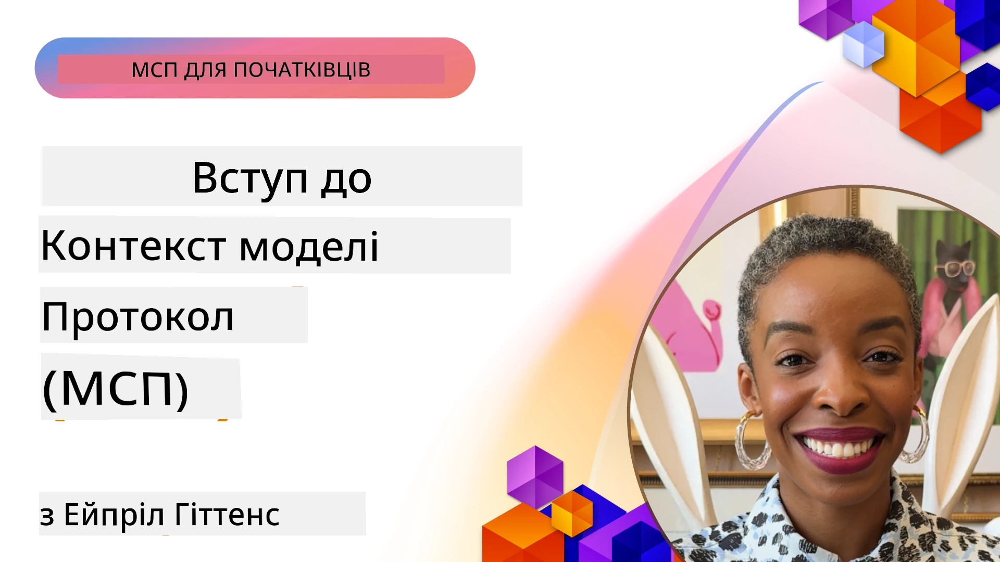
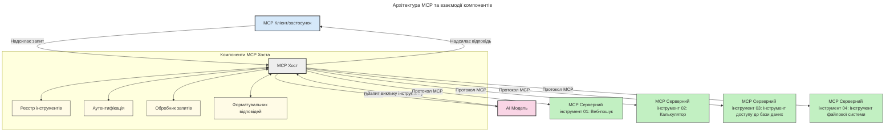

# Вступ до Протоколу Контексту Моделі (MCP): Чому це важливо для масштабованих AI-застосунків

[](https://youtu.be/agBbdiOPLQA)

_(Натисніть на зображення вище, щоб переглянути відео з цього уроку)_

Генеративні AI-застосунки — це великий крок уперед, оскільки вони часто дозволяють користувачеві взаємодіяти з додатком за допомогою природної мови. Однак, коли в такі додатки інвестується більше часу та ресурсів, хочеться впевнитися, що можна легко інтегрувати функціонал і ресурси так, щоб було зручно розширювати, щоб додаток міг обслуговувати використання більше ніж однієї моделі і враховувати різні особливості моделей. Коротко кажучи, будувати Gen AI додатки спочатку легко, але з ростом і ускладненням потрібно починати визначати архітектуру і, ймовірно, опиратися на стандарт, щоб збудувати додатки послідовно. Саме тут MCP допомагає організувати все та забезпечити стандарт.

---

## **🔍 Що таке Протокол Контексту Моделі (MCP)?**

**Протокол Контексту Моделі (MCP)** — це **відкритий, стандартизований інтерфейс**, який дозволяє великим мовним моделям (LLM) безшовно взаємодіяти з зовнішніми інструментами, API та джерелами даних. Він забезпечує послідовну архітектуру для розширення функціональності AI-моделей за межами їхніх навчальних даних, сприяючи розумнішим, масштабованим та більш чутливим AI-системам.

---

## **🎯 Чому стандартизація в AI має значення**

Зі зростанням складності генеративних AI-застосунків важливо прийняти стандарти, що гарантують **масштабованість, розширюваність, підтримуваність** та **уникнення прив’язки до постачальника**. MCP вирішує ці потреби через:

- Уніфікацію інтеграцій моделей з інструментами  
- Зменшення крихких, одноразових кастомних рішень  
- Дозвіл існування кількох моделей від різних постачальників в одній екосистемі  

**Примітка:** Хоч MCP рекламується як відкритий стандарт, немає планів стандартизувати MCP через існуючі органи стандартизації, такі як IEEE, IETF, W3C, ISO чи інші.

---

## **📚 Цілі навчання**

В кінці цієї статті ви зможете:

- Визначити **Протокол Контексту Моделі (MCP)** та його випадки використання  
- Зрозуміти, як MCP стандартизує комунікацію між моделями та інструментами  
- Ідентифікувати ключові компоненти архітектури MCP  
- Ознайомитися з реальними застосуваннями MCP у підприємстві та розробці  

---

## **💡 Чому Протокол Контексту Моделі (MCP) змінює правила гри**

### **🔗 MCP вирішує проблему фрагментації в AI-взаємодіях**

До появи MCP інтеграція моделей з інструментами вимагала:

- Кастомного коду для кожної пари моделі та інструменту  
- Не стандартизованих API для кожного постачальника  
- Частих поломок через оновлення  
- Поганої масштабованості при збільшенні кількості інструментів  

### **✅ Переваги стандартизації MCP**

| **Перевага**              | **Опис**                                                                        |
|---------------------------|---------------------------------------------------------------------------------|
| Взаємодія                 | LLM безшовно працюють з інструментами від різних постачальників                |
| Послідовність             | Однорідна поведінка на різних платформах і в інструментах                       |
| Повторне використання     | Інструменти створені один раз можна використовувати в різних проєктах та системах|
| Прискорена розробка       | Скорочення часу розробки завдяки стандартизованим інтерфейсам plug-and-play    |

---

## **🧱 Огляд високого рівня архітектури MCP**

MCP використовує **модель клієнт-сервер**, де:

- **MCP Hosts** запускають AI-моделі  
- **MCP Clients** ініціюють запити  
- **MCP Servers** забезпечують контекст, інструменти та можливості  

### **Ключові компоненти:**

- **Ресурси** – статичні або динамічні дані для моделей  
- **Підказки** – заздалегідь визначені робочі процеси для керованого генерування  
- **Інструменти** – виконувані функції, як пошук, обчислення  
- **Вибірка** – агентна поведінка через рекурсивні взаємодії  
- **Запити (Elicitation)** – запити на введення від сервера  
- **Корені (Roots)** – межі файлової системи для контролю доступу сервера  

### **Архітектура протоколу:**

MCP використовує двошарову архітектуру:  
- **Шар даних**: комунікація на основі JSON-RPC 2.0 з управлінням життєвим циклом та примітивами  
- **Транспортний шар**: STDIO (локальний) та стрімінговий HTTP зі SSE (віддалений) канали зв’язку  

---

## Як працюють MCP сервери

MCP сервери працюють таким чином:

- **Потік запитів**:  
    1. Запит ініціює кінцевий користувач або ПЗ від його імені.  
    2. **MCP Client** надсилає запит до **MCP Host**, який керує часом виконання AI-моделі.  
    3. **AI-модель** отримує підказку користувача і може запросити доступ до зовнішніх інструментів або даних через один або кілька викликів інструментів.  
    4. **MCP Host**, а не модель напряму, комунікує з відповідним(ими) **MCP Server(ами)** через стандартизований протокол.  
- **Функціональність MCP Host**:  
    - **Реєстр інструментів**: веде каталог доступних інструментів і їх можливостей.  
    - **Аутентифікація**: перевіряє права доступу до інструментів.  
    - **Обробник запитів**: обробляє вхідні запити інструментів від моделі.  
    - **Форматувач відповіді**: структурує вивід інструментів у формат, що модель може зрозуміти.  
- **Виконання MCP Server**:  
    - **MCP Host** перенаправляє виклики інструментів до одного або кількох **MCP Server**, кожен з яких надає спеціалізовані функції (наприклад, пошук, обчислення, запити до бази даних).  
    - **MCP Serverи** виконують свої операції і повертають результати **MCP Host** у єдиному форматі.  
    - **MCP Host** форматує і передає ці результати AI-моделі.  
- **Завершення відповіді**:  
    - **AI-модель** включає вивід інструментів у фінальну відповідь.  
    - **MCP Host** надсилає цю відповідь назад **MCP Client** для кінцевого користувача або викликаючого ПЗ.  
    


## 👨‍💻 Як створити MCP сервер (з прикладами)

MCP сервери дозволяють розширювати можливості LLM, надаючи дані та функціонал.

Готові спробувати? Ось SDK за мовами та стеком і приклади створення простих MCP серверів у різних мовах/стеках:

- **Python SDK**: https://github.com/modelcontextprotocol/python-sdk

- **TypeScript SDK**: https://github.com/modelcontextprotocol/typescript-sdk

- **Java SDK**: https://github.com/modelcontextprotocol/java-sdk

- **C#/.NET SDK**: https://github.com/modelcontextprotocol/csharp-sdk


## 🌍 Реальні кейси застосування MCP

MCP відкриває широкий спектр застосувань, розширюючи можливості AI:

| **Застосування**             | **Опис**                                                                       |
|------------------------------|--------------------------------------------------------------------------------|
| Інтеграція даних підприємства | Підключення LLM до баз даних, CRM або внутрішніх інструментів                 |
| Агентні AI-системи           | Дозволяє автономним агентам мати доступ до інструментів і робочих процесів прийняття рішень |
| Мультимодальні застосунки    | Комбінування текстових, зображень і аудіо інструментів в одному уніфікованому AI-додатку |
| Інтеграція актуальних даних  | Включення живих даних в AI-взаємодії для точнішого, актуального результату    |


### 🧠 MCP = Універсальний стандарт для AI-взаємодій

Протокол Контексту Моделі (MCP) діє як універсальний стандарт для AI-взаємодій, подібно до того, як USB-C стандартизував фізичні з’єднання пристроїв. У світі AI MCP надає послідовний інтерфейс, який дозволяє моделям (клієнтам) безшовно інтегруватися із зовнішніми інструментами та постачальниками даних (серверами). Це усуває потребу в різних, кастомних протоколах для кожного API чи джерела даних.

За MCP інструмент, сумісний із MCP (називається MCP сервером), слідує уніфікованому стандарту. Ці сервери можуть перелічувати інструменти або дії, які вони пропонують, і виконувати їх на запит AI-агента. Платформи AI-агентів, які підтримують MCP, можуть відкривати доступні інструменти від серверів і викликати їх через цей стандартний протокол.

### 💡 Полегшує доступ до знань

Окрім надання інструментів, MCP також полегшує доступ до знань. Він дозволяє застосункам надавати контекст великим мовним моделям (LLM), пов’язуючи їх з різними джерелами даних. Наприклад, MCP сервер може представляти репозиторій документів компанії, дозволяючи агентам отримувати релевантну інформацію за потреби. Інший сервер може опрацьовувати конкретні дії, як надсилання електронних листів або оновлення записів. З точки зору агента, це просто інструменти для використання — одні інструменти повертають дані (контекст знань), інші виконують дії. MCP ефективно керує і тим, і іншим.

Агент, що підключається до MCP сервера, автоматично «вивчає» доступні можливості сервера та доступні дані через стандартизований формат. Це дозволяє динамічно змінювати доступність інструментів. Наприклад, додавання нового MCP сервера до системи агента робить його функції відразу доступними без додаткової кастомізації інструкцій агента.

Ця спрощена інтеграція узгоджується з потоком, показаним на наступній діаграмі, де сервери надають як інструменти, так і знання, забезпечуючи безшовну співпрацю між системами.

### 👉 Приклад: Масштабоване агентське рішення

```mermaid
---
title: Масштабоване агентське рішення з MCP
description: Діаграма, що ілюструє, як користувач взаємодіє з LLM, який підключається до кількох серверів MCP, кожен з яких забезпечує як знання, так і інструменти, створюючи масштабовану архітектуру системи ШІ
---
graph TD
    User -->|Підказка| LLM
    LLM -->|Відповідь| User
    LLM -->|MCP| ServerA
    LLM -->|MCP| ServerB
    ServerA -->|Універсальний конектор| ServerB
    ServerA --> KnowledgeA
    ServerA --> ToolsA
    ServerB --> KnowledgeB
    ServerB --> ToolsB

    subgraph Server A
        KnowledgeA[Знання]
        ToolsA[Інструменти]
    end

    subgraph Server B
        KnowledgeB[Знання]
        ToolsB[Інструменти]
    end
```Універсальний конектор дозволяє MCP серверам спілкуватися і ділитися можливостями між собою, дозволяючи ServerA делегувати завдання ServerB або отримувати доступ до його інструментів і знань. Це федерація інструментів і даних між серверами, підтримуючи масштабовану і модульну архітектуру агентів. Оскільки MCP стандартизує експозицію інструментів, агенти можуть динамічно знаходити і маршрутизувати запити між серверами без жорсткодрукованих інтеграцій.

Федерація інструментів і знань: доступ до інструментів і даних можливий між серверами, що підтримує більш масштабовані та модульні агентські архітектури.

### 🔄 Розвинуті сценарії MCP з інтеграцією LLM на боці клієнта

Окрім базової архітектури MCP, існують розвинуті сценарії, де і клієнт, і сервер містять LLM, що дозволяє більш складні взаємодії. На наступній діаграмі **Клієнтський додаток** може бути IDE з набором MCP інструментів, доступних для використання LLM:

```mermaid
---
title: Розширені сценарії MCP з інтеграцією клієнт-сервер LLM
description: Послідовна діаграма, що показує детальний порядок взаємодії між користувачем, клієнтським застосунком, клієнтським LLM, кількома MCP серверами та серверним LLM, ілюструючи етапи відкриття інструментів, взаємодії з користувачем, прямого виклику інструментів та узгодження функцій
---
sequenceDiagram
    autonumber
    actor User as 👤 Користувач
    participant ClientApp as 🖥️ Клієнтський застосунок
    participant ClientLLM as 🧠 Клієнтський LLM
    participant Server1 as 🔧 MCP Сервер 1
    participant Server2 as 📚 MCP Сервер 2
    participant ServerLLM as 🤖 Серверний LLM
    
    %% Discovery Phase
    rect rgb(220, 240, 255)
        Note over ClientApp, Server2: ЕТАП ВІДКРИТТЯ ІНСТРУМЕНТІВ
        ClientApp->>+Server1: Запитати доступні інструменти/ресурси
        Server1-->>-ClientApp: Повернути список інструментів (JSON)
        ClientApp->>+Server2: Запитати доступні інструменти/ресурси
        Server2-->>-ClientApp: Повернути список інструментів (JSON)
        Note right of ClientApp: Зберегти спільний каталог<br/>інструментів локально
    end
    
    %% User Interaction
    rect rgb(255, 240, 220)
        Note over User, ClientLLM: ЕТАП ВЗАЄМОДІЇ З КОРИСТУВАЧЕМ
        User->>+ClientApp: Ввести натуральний мовний запит
        ClientApp->>+ClientLLM: Передати запит + каталог інструментів
        ClientLLM->>-ClientLLM: Проаналізувати запит та обрати інструменти
    end
    
    %% Scenario A: Direct Tool Calling
    alt Direct Tool Calling
        rect rgb(220, 255, 220)
            Note over ClientApp, Server1: СЦЕНАРІЙ А: ПРЯМИЙ ВИКЛИК ІНСТРУМЕНТУ
            ClientLLM->>+ClientApp: Запит на виконання інструмента
            ClientApp->>+Server1: Виконати конкретний інструмент
            Server1-->>-ClientApp: Повернути результати
            ClientApp->>+ClientLLM: Обробити результати
            ClientLLM-->>-ClientApp: Згенерувати відповідь
            ClientApp-->>-User: Показати остаточну відповідь
        end
    
    %% Scenario B: Feature Negotiation (VS Code style)
    else Feature Negotiation (VS Code style)
        rect rgb(255, 220, 220)
            Note over ClientApp, ServerLLM: СЦЕНАРІЙ Б: УЗГОДЖЕННЯ ФУНКЦІЙ
            ClientLLM->>+ClientApp: Визначити необхідні можливості
            ClientApp->>+Server2: Узгодити функції/можливості
            Server2->>+ServerLLM: Запитати додатковий контекст
            ServerLLM-->>-Server2: Надати контекст
            Server2-->>-ClientApp: Повернути доступні функції
            ClientApp->>+Server2: Викликати узгоджені інструменти
            Server2-->>-ClientApp: Повернути результати
            ClientApp->>+ClientLLM: Обробити результати
            ClientLLM-->>-ClientApp: Згенерувати відповідь
            ClientApp-->>-User: Показати остаточну відповідь
        end
    end
```
## 🔐 Практичні переваги MCP

Ось практичні переваги використання MCP:

- **Актуальність**: моделі можуть отримувати сучасну інформацію поза межами їх навчальних даних  
- **Розширення можливостей**: моделі можуть використовувати спеціалізовані інструменти для задач, яких вони не вчилися виконувати  
- **Зменшення галюцинацій**: зовнішні джерела даних забезпечують фактичне підґрунтя  
- **Конфіденційність**: чутливі дані можуть залишатися у захищеному середовищі замість того, щоб міститися у підказках  

## 📌 Основні підсумки

Нижче основні висновки по використанню MCP:

- **MCP** стандартизує спосіб взаємодії AI моделей з інструментами і даними  
- Сприяє **розширюваності, послідовності та взаємодії**  
- MCP допомагає **скоротити час розробки, покращити надійність і розширити можливості моделей**  
- Архітектура клієнт-сервер забезпечує **гнучкі, розширювані AI-застосунки**  

## 🧠 Вправа

Подумайте про AI-застосунок, який ви хочете створити.

- Які **зовнішні інструменти або дані** могли б покращити його можливості?  
- Як MCP міг би зробити інтеграцію **простішою і надійнішою**?  

## Додаткові ресурси

- [Репозиторій MCP на GitHub](https://github.com/modelcontextprotocol)


## Що далі

Далі: [Розділ 1: Основні концепції](../01-CoreConcepts/README.md)

---

<!-- CO-OP TRANSLATOR DISCLAIMER START -->
**Відмова від відповідальності**:  
Цей документ був перекладений за допомогою сервісу автоматичного перекладу [Co-op Translator](https://github.com/Azure/co-op-translator). Хоча ми прагнемо до точності, зверніть увагу, що автоматизовані переклади можуть містити помилки або неточності. Оригінальний документ рідною мовою слід вважати авторитетним джерелом. Для критичної інформації рекомендується професійний людський переклад. Ми не несемо відповідальності за будь-які непорозуміння або неправильні тлумачення, що виникли внаслідок використання цього перекладу.
<!-- CO-OP TRANSLATOR DISCLAIMER END -->