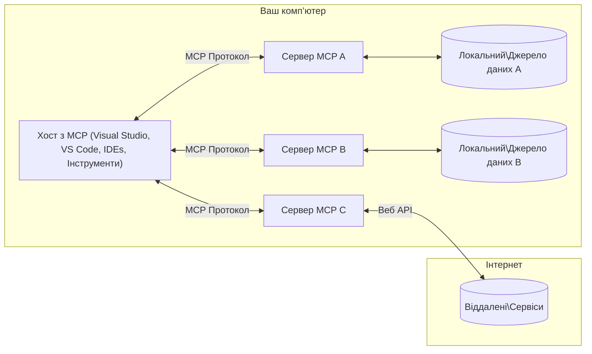

# Основні поняття MCP: Оволодіння протоколом модельного контексту для інтеграції ШІ

[](https://youtu.be/earDzWGtE84)

_(Натисніть на зображення вище, щоб переглянути відео цього уроку)_

[Протокол модельного контексту (MCP)](https://github.com/modelcontextprotocol) — потужна стандартизована система, що оптимізує взаємодію між великими мовними моделями (LLM) та зовнішніми інструментами, додатками й джерелами даних. 
Цей посібник проведе вас через основні поняття MCP. Ви дізнаєтесь про його клієнт-серверну архітектуру, основні компоненти, механіку комунікації та найкращі практики впровадження.

- **Явна згода користувача**: Весь доступ до даних і операції вимагають явного схвалення користувача перед виконанням. Користувачі повинні чітко розуміти, до яких даних буде доступ і які дії будуть виконані, з деталізованим контролем над дозволами та авторизацією.

- **Захист конфіденційності даних**: Дані користувачів відкриваються лише за явною згодою і мають бути захищені надійними механізмами контролю доступу протягом усього циклу взаємодії. Впровадження повинно запобігати несанкціонованій передачі даних та підтримувати жорсткі межі конфіденційності.

- **Безпека виконання інструментів**: Кожне викликання інструменту вимагає явної згоди користувача з чітким розумінням функціональності інструменту, параметрів і потенційного впливу. Надійні межі безпеки мають запобігати небажаному, небезпечному або шкідливому виконанню інструментів.

- **Безпека транспортного рівня**: Всі канали зв’язку повинні використовувати відповідні механізми шифрування та автентифікації. Віддалені з’єднання мають впроваджувати безпечні транспортні протоколи та належне управління обліковими даними.

#### Рекомендації з реалізації:

- **Управління дозволами**: Впроваджуйте деталізовані системи дозволів, що дозволяють користувачам контролювати, які сервери, інструменти та ресурси доступні
- **Аутентифікація та авторизація**: Використовуйте безпечні методи аутентифікації (OAuth, API ключі) із належним управлінням токенами та строком дії  
- **Перевірка вхідних даних**: Перевіряйте всі параметри та вхідні дані згідно з визначеними схемами, щоб запобігти атакам впровадження
- **Журналювання аудиту**: Підтримуйте всебічні журнали всіх операцій для моніторингу безпеки та відповідності

## Огляд

Цей урок досліджує фундаментальну архітектуру та компоненти, які складають екосистему протоколу модельного контексту (MCP). Ви дізнаєтесь про клієнт-серверну архітектуру, основні компоненти та механізми комунікації, що забезпечують взаємодії в MCP.

## Основні цілі навчання

Наприкінці цього уроку ви:

- Зрозумієте клієнт-серверну архітектуру MCP.
- Визначите ролі та обов’язки хостів, клієнтів та серверів.
- Проаналізуєте ключові характеристики, що роблять MCP гнучким шаром інтеграції.
- Дізнаєтесь, як інформація циркулює в екосистемі MCP.
- Отримаєте практичні знання через приклади коду на .NET, Java, Python і JavaScript.

## Архітектура MCP: докладніше

Екосистема MCP побудована на моделі клієнт-сервер. Ця модульна структура дозволяє застосункам ШІ ефективно взаємодіяти з інструментами, базами даних, API та контекстуальними ресурсами. Розглянемо цю архітектуру через її основні компоненти.

У своїй основі MCP слідує клієнт-серверній архітектурі, де хост-додаток може підключатися до кількох серверів:


- **MCP Hosts**: Програми, такі як VSCode, Claude Desktop, IDE або інструменти ШІ, які хочуть отримувати дані через MCP
- **MCP Clients**: Протокольні клієнти, які підтримують 1:1 з’єднання із серверами
- **MCP Servers**: Легкі програми, що надають конкретні можливості через стандартизований протокол модельного контексту
- **Локальні джерела даних**: Файли, бази даних і сервіси вашого комп’ютера, до яких MCP сервери можуть безпечно отримувати доступ
- **Віддалені сервіси**: Зовнішні системи, доступні через інтернет, до яких MCP сервери можуть підключатися через API.

Протокол MCP — це еволюційний стандарт із версіями за датою (формат YYYY-MM-DD). Поточна версія протоколу — **2025-11-25**. Ви можете переглянути останні оновлення [специфікації протоколу](https://modelcontextprotocol.io/specification/2025-11-25/)

### 1. Хости

У протоколі модельного контексту (MCP) **хости** — це додатки ШІ, які служать основним інтерфейсом для взаємодії користувачів з протоколом. Хости координують і керують з’єднаннями з кількома MCP серверами, створюючи виділені MCP клієнти для кожного серверного з’єднання. Приклад хостів:

- **Додатки ШІ**: Claude Desktop, Visual Studio Code, Claude Code
- **Середовища розробки**: IDE та редактори коду з інтеграцією MCP  
- **Користувацькі застосунки**: Спеціалізовані агенти і інструменти ШІ

**Хости** — це додатки, які координують взаємодію з мовними моделями. Вони:

- **Оркеструють моделі ШІ**: Виконують або взаємодіють з LLM для генерації відповідей та координації робочих процесів ШІ
- **Керують клієнтськими з’єднаннями**: Створюють та підтримують по одному MCP клієнту на кожне серверне з’єднання
- **Керують інтерфейсом користувача**: Обробляють потік розмов, взаємодії користувачів та відображення відповідей  
- **Забезпечують безпеку**: Контролюють дозволи, обмеження безпеки та аутентифікацію
- **Обробляють згоду користувача**: Управляють погодженням користувача на обмін даними та виконання інструментів


### 2. Клієнти

**Клієнти** — це ключові компоненти, які підтримують виділені однонапрямні з’єднання між хостами і MCP серверами. Кожен MCP клієнт створюється хостом для підключення до конкретного MCP сервера, що забезпечує організовані та безпечні канали зв’язку. Кілька клієнтів дозволяють хостам одночасно підключатися до кількох серверів.

**Клієнти** є з’єднувальними компонентами в хост-додатку. Вони:

- **Комунікація по протоколу**: Надсилають серверу запити JSON-RPC 2.0 із підказками та інструкціями
- **Переговори можливостей**: Домовляються про підтримувані функції та версії протоколу під час ініціалізації
- **Виконання інструментів**: Керують запитами на виконання інструментів від моделей і обробляють відповіді
- **Оновлення в реальному часі**: Обробляють повідомлення та оновлення від серверів
- **Обробка відповідей**: Форматують серверні відповіді для відображення користувачам

### 3. Сервери

**Сервери** — це програми, що надають контекст, інструменти й можливості для MCP клієнтів. Вони можуть виконуватися локально (на тій же машині, що й хост) або віддалено (на зовнішніх платформах), відповідають за обробку запитів клієнтів і надання структурованих відповідей. Сервери відкривають конкретний функціонал через стандартизований протокол модельного контексту.

**Сервери** — це сервіси, що надають контекст і функціонал. Вони:

- **Реєстрація функцій**: Реєструють і надають клієнтам доступ до доступних примітивів (ресурсів, підказок, інструментів)
- **Обробка запитів**: Отримують і виконують виклики інструментів, запити ресурсів і підказок від клієнтів
- **Надання контексту**: Забезпечують контекстну інформацію і дані для покращення відповідей моделей
- **Управління станом**: Підтримують стан сесії і обробляють станоспрямовані взаємодії за потреби
- **Оповіщення в реальному часі**: Надсилають повідомлення про зміни можливостей і оновлення підключеним клієнтам

Сервери можуть розроблятися будь-ким для розширення можливостей моделей спеціалізованим функціоналом і підтримують локальне й віддалене розгортання.

### 4. Примітиви сервера

Сервери в протоколі модельного контексту (MCP) надають три основні **примітиви**, які визначають базові складові для багатої взаємодії між клієнтами, хостами та мовними моделями. Ці примітиви визначають типи контекстної інформації та дій, доступні через протокол.

MCP сервери можуть надавати будь-яку комбінацію із трьох основних примітивів:

#### Ресурси

**Ресурси** — це джерела даних, що забезпечують контекстну інформацію для застосунків ШІ. Вони репрезентують статичний або динамічний контент, який може покращувати розуміння моделі і прийняття рішень:

- **Контекстні дані**: Структурована інформація і контекст для споживання моделлю ШІ
- **Бази знань**: Документальні сховища, статті, посібники та наукові праці
- **Локальні джерела даних**: Файли, бази даних і інформація локальної системи  
- **Зовнішні дані**: Відповіді API, веб-сервіси й дані віддалених систем
- **Динамічний контент**: Дані в режимі реального часу, що оновлюються залежно від зовнішніх умов

Ресурси ідентифікуються URI і підтримують пошук через методи `resources/list` та отримання через `resources/read`:

```text
file://documents/project-spec.md
database://production/users/schema
api://weather/current
```

#### Підказки

**Підказки** — це багаторазові шаблони, що допомагають структурувати взаємодії з мовними моделями. Вони забезпечують стандартизовані шаблони взаємодії та робочі процеси:

- **Інтеракції на основі шаблонів**: Попередньо структуровані повідомлення та початки розмови
- **Шаблони робочих процесів**: Стандартизовані послідовності для поширених завдань і сценаріїв
- **Приклади Few-shot**: Прикладові шаблони для інструктажу моделей
- **Системні підказки**: Основні підказки, що визначають поведінку моделі і контекст
- **Динамічні шаблони**: Параметризовані підказки, що адаптуються під конкретний контекст

Підказки підтримують підстановку змінних, можуть знаходитися через `prompts/list` і отримуватися через `prompts/get`:

```markdown
Generate a {{task_type}} for {{product}} targeting {{audience}} with the following requirements: {{requirements}}
```

#### Інструменти

**Інструменти** — це виконувані функції, які мовні моделі можуть викликати для виконання конкретних дій. Вони представляють "дієслова" екосистеми MCP, дозволяючи моделям взаємодіяти із зовнішніми системами:

- **Виконувані функції**: Окремі операції, які моделі можуть викликати з певними параметрами
- **Інтеграція із зовнішніми системами**: API виклики, запити до баз даних, операції з файлами, обчислення
- **Унікальна ідентичність**: Кожен інструмент має унікальне ім’я, опис і схему параметрів
- **Структурований ввід/вивід**: Інструменти приймають перевірені параметри і повертають структуровані, типізовані відповіді
- **Можливості діях**: Дозволяють моделям виконувати реальні дії і отримувати живі дані

Інструменти визначаються через JSON Schema для перевірки параметрів, їх знаходять через `tools/list` і виконують через `tools/call`. Інструменти можуть також містити **ікони** як додаткові метадані для кращого інтерфейсу.

**Анотації інструментів**: Інструменти підтримують поведінкові анотації (наприклад, `readOnlyHint`, `destructiveHint`), які описують, чи є інструмент лише для читання або руйнівний, допомагаючи клієнтам приймати обґрунтовані рішення щодо виконання.

Приклад визначення інструменту:

```typescript
server.tool(
  "search_products", 
  {
    query: z.string().describe("Search query for products"),
    category: z.string().optional().describe("Product category filter"),
    max_results: z.number().default(10).describe("Maximum results to return")
  }, 
  async (params) => {
    // Виконати пошук і повернути структуровані результати
    return await productService.search(params);
  }
);
```

## Примітиви клієнта

У протоколі модельного контексту (MCP) **клієнти** можуть відкривати примітиви, що дозволяють серверам запитувати додаткові можливості від хост-додатка. Ці клієнтські примітиви забезпечують багатші, інтерактивніші реалізації серверів, які можуть отримувати можливості ШІ моделей і взаємодію з користувачами.

### Вибірка

**Вибірка** дозволяє серверам запитувати завершення від мовної моделі від клієнтського додатку ШІ. Цей примітив дає можливість серверам доступ до можливостей LLM без потреби вбудовувати моделі:

- **Незалежний доступ до моделей**: Сервери можуть запитувати завершення без включення SDK LLM або управління доступом до моделей
- **ШІ ініційований сервером**: Дозволяє серверам автономно генерувати контент за допомогою моделі клієнта
- **Рекурсивні взаємодії LLM**: Підтримує складні сценарії, де сервери потребують допомоги ШІ для обробки
- **Динамічне створення контенту**: Дозволяє створювати контекстні відповіді за допомогою моделі хоста
- **Підтримка виклику інструментів**: Сервери можуть включати параметри `tools` та `toolChoice`, щоб дозволити моделі клієнта викликати інструменти під час вибірки

Вибірка ініціюється через метод `sampling/complete`, де сервери надсилають клієнтам запити на завершення.

### Корені (Roots)

**Корені** надають стандартизований спосіб для клієнтів відкривати серверу межі файлової системи, допомагаючи серверам зрозуміти, до яких директорій і файлів вони мають доступ:

- **Межі файлової системи**: Визначають межі, в яких сервери можуть працювати у файловій системі
- **Контроль доступу**: Допомагають серверам зрозуміти, які папки і файли їм дозволено використовувати
- **Динамічні оновлення**: Клієнти можуть повідомляти сервери про зміни у списку коренів
- **Ідентифікація через URI**: Корені використовують URI формату `file://` для позначення доступних директорій і файлів

Корені знаходяться через метод `roots/list`, клієнти ж надсилають `notifications/roots/list_changed` при зміні коренів.

### Збирання інформації (Elicitation)  

**Збирання інформації** дозволяє серверам запитувати додаткову інформацію або підтвердження від користувачів через інтерфейс клієнта:

- **Запити вводу від користувача**: Сервери можуть просити додаткові дані, якщо це потрібно для виконання інструмента
- **Діалоги підтвердження**: Запити згоди користувача для чутливих або важливих операцій
- **Інтерактивні робочі процеси**: Дозволяють серверам створювати покрокові взаємодії з користувачем
- **Динамічний збір параметрів**: Збирання відсутніх або додаткових параметрів під час виконання інструменту

Запити збирання здійснюються через метод `elicitation/request` для збору вводу користувача через інтерфейс клієнта.

**Еліцитація в режимі URL**: Сервери також можуть просити взаємодії користувачів, засновані на URL, дозволяючи направляти користувачів на зовнішні веб-сторінки для аутентифікації, підтвердження або введення даних.

### Логування

**Логування** дозволяє серверам надсилати структуровані повідомлення журналу клієнтам для налагодження, моніторингу та операційної прозорості:

- **Підтримка налагодження**: Дозволяє серверам надавати детальні журнали виконання для усунення неполадок
- **Оперативний моніторинг**: Надсилання статусних оновлень і метрик продуктивності клієнтам
- **Повідомлення про помилки**: Надання детального контексту помилок і діагностичної інформації
- **Аудитні сліди**: Створення комплексних журналів операцій і рішень серверу

Повідомлення журналу надсилаються клієнтам для забезпечення прозорості операцій серверів і сприяння налагодженню.

## Потік інформації в MCP

Протокол модельного контексту (MCP) визначає структурований потік інформації між хостами, клієнтами, серверами та моделями. Розуміння цього потоку допомагає пояснити, як обробляються запити користувача і як зовнішні інструменти та дані інтегруються у відповіді моделей.

- **Хост ініціює з’єднання**  
  Хост-додаток (наприклад, IDE або чат-інтерфейс) встановлює з’єднання з MCP сервером, зазвичай через STDIO, WebSocket або інший підтримуваний транспорт.

- **Переговори можливостей**  
  Клієнт (що вбудований у хост) і сервер обмінюються інформацією про підтримувані функції, інструменти, ресурси і версії протоколу. Це гарантує, що обидві сторони розуміють, які можливості доступні протягом сесії.

- **Запит користувача**  
  Користувач взаємодіє з хостом (наприклад, вводить підказку або команду). Хост отримує цей ввід і передає його клієнту на обробку.

- **Використання ресурсів або інструментів**  
  - Клієнт може запитувати додатковий контекст або ресурси у сервера (наприклад, файли, записи бази даних або статті бази знань) для збагачення розуміння моделі.
  - Якщо модель визнала, що потрібен інструмент (наприклад, для отримання даних, виконання обчислення або виклику API), клієнт надсилає серверу запит на виклик інструменту з вказаними ім’ям і параметрами.

- **Виконання сервером**  

Сервер отримує запит на ресурс або інструмент, виконує необхідні операції (таких як виклик функції, запит до бази даних або отримання файлу) і повертає результати клієнту у структурованому форматі.

- **Генерація відповіді**  
  Клієнт інтегрує відповіді сервера (дані ресурсу, виводи інструментів тощо) у поточну взаємодію з моделлю. Модель використовує цю інформацію для створення всебічної та контекстно релевантної відповіді.

- **Представлення результату**  
  Хост отримує кінцевий вивід від клієнта і представляє його користувачу, часто включаючи як текст, згенерований моделлю, так і будь-які результати виконання інструментів або запитів ресурсів.

Цей потік дозволяє MCP підтримувати передові, інтерактивні та контекстно-усвідомлені AI-додатки шляхом безперебійного з'єднання моделей з зовнішніми інструментами та джерелами даних.

## Архітектура протоколу та шари

MCP складається з двох окремих архітектурних шарів, які працюють разом, щоб забезпечити повний комунікаційний каркас:

### Даніевий шар

**Даніевий шар** реалізує основний протокол MCP, використовуючи як основу **JSON-RPC 2.0**. Цей шар визначає структуру повідомлень, семантику та патерни взаємодії:

#### Основні компоненти:

- **Протокол JSON-RPC 2.0**: Уся комунікація використовує стандартизований формат повідомлень JSON-RPC 2.0 для викликів методів, відповідей і сповіщень
- **Управління життєвим циклом**: Обробляє ініціалізацію з’єднання, узгодження можливостей і завершення сесії між клієнтами та серверами
- **Примітиви сервера**: Дозволяють серверам забезпечувати основний функціонал через інструменти, ресурси та підказки
- **Примітиви клієнта**: Дозволяють серверам запитувати вибірки від LLM, отримувати введення користувача і надсилати лог-повідомлення
- **Сповіщення в реальному часі**: Підтримує асинхронні сповіщення для динамічних оновлень без опитування

#### Ключові можливості:

- **Узгодження версії протоколу**: Використовує версіювання за датою (РРРР-ММ-ДД) для забезпечення сумісності
- **Виявлення можливостей**: Клієнти і сервери обмінюються інформацією про підтримувані функції під час ініціалізації
- **Сесії зберігання стану**: Підтримує стан з’єднання по кількох взаємодіях для збереження контексту

### Транспортний шар

**Транспортний шар** управляє каналами зв’язку, формуванням повідомлень і автентифікацією між учасниками MCP:

#### Підтримувані транспортні механізми:

1. **STDIO транспорт**:
   - Використовує стандартні потоки введення/виведення для прямої комунікації процесів
   - Оптимальний для локальних процесів на одній машині без мережевого навантаження
   - Часто використовується для локальних реалізацій MCP сервера

2. **Streamable HTTP транспорт**:
   - Використовує HTTP POST для повідомлень від клієнта до сервера  
   - Необов’язкові Server-Sent Events (SSE) для потокової передачі від сервера до клієнта
   - Дозволяє віддалену комунікацію сервера через мережі
   - Підтримує стандартну HTTP автентифікацію (токени доступу, API-ключі, кастомні заголовки)
   - MCP рекомендує OAuth для безпечної автентифікації на основі токенів

#### Абстракція транспорту:

Транспортний шар абстрагує деталі комунікації від данієвого шару, дозволяючи використовувати той самий формат повідомлень JSON-RPC 2.0 для всіх транспортних механізмів. Ця абстракція полегшує безперешкодне переключення між локальними та віддаленими серверами.

### Розгляди безпеки

Реалізації MCP повинні дотримуватися кількох критично важливих принципів безпеки для забезпечення безпечних, надійних і захищених взаємодій у межах усіх операцій протоколу:

- **Згода та контроль користувача**: Користувачі повинні надавати явну згоду перед будь-яким доступом до даних або виконанням операцій. Вони повинні мати чіткий контроль над тим, які дані поділяються і які дії дозволені, підтримуваний інтуїтивними інтерфейсами для перегляду та схвалення дій.

- **Конфіденційність даних**: Дані користувачів повинні бути доступні лише з явної згоди та захищені належними контролями доступу. Реалізації MCP повинні запобігати несанкціонованій передачі даних і забезпечувати збереження конфіденційності протягом усіх взаємодій.

- **Безпека інструментів**: Перед викликом будь-якого інструменту потрібна явна згода користувача. Користувачі мають чітко розуміти функціонал кожного інструменту, і повинні запроваджуватися надійні межі безпеки для запобігання небажаному або небезпечному виконанню інструментів.

Дотримуючись цих принципів безпеки, MCP забезпечує підтримку довіри користувачів, конфіденційності та безпеки у всіх взаємодіях протоколу, одночасно відкриваючи можливості потужної інтеграції AI.

## Приклади коду: ключові компоненти

Нижче наведено приклади коду на популярних мовах програмування, які ілюструють реалізацію ключових компонентів MCP сервера та інструментів.

### Приклад .NET: Створення простого MCP сервера з інструментами

Практичний приклад коду на .NET, що демонструє, як реалізувати простий MCP сервер із власними інструментами. Цей приклад показує, як визначати і реєструвати інструменти, обробляти запити та підключати сервер за допомогою Model Context Protocol.

```csharp
using System;
using System.Threading.Tasks;
using ModelContextProtocol.Server;
using ModelContextProtocol.Server.Transport;
using ModelContextProtocol.Server.Tools;

public class WeatherServer
{
    public static async Task Main(string[] args)
    {
        // Create an MCP server
        var server = new McpServer(
            name: "Weather MCP Server",
            version: "1.0.0"
        );
        
        // Register our custom weather tool
        server.AddTool<string, WeatherData>("weatherTool", 
            description: "Gets current weather for a location",
            execute: async (location) => {
                // Call weather API (simplified)
                var weatherData = await GetWeatherDataAsync(location);
                return weatherData;
            });
        
        // Connect the server using stdio transport
        var transport = new StdioServerTransport();
        await server.ConnectAsync(transport);
        
        Console.WriteLine("Weather MCP Server started");
        
        // Keep the server running until process is terminated
        await Task.Delay(-1);
    }
    
    private static async Task<WeatherData> GetWeatherDataAsync(string location)
    {
        // This would normally call a weather API
        // Simplified for demonstration
        await Task.Delay(100); // Simulate API call
        return new WeatherData { 
            Temperature = 72.5,
            Conditions = "Sunny",
            Location = location
        };
    }
}

public class WeatherData
{
    public double Temperature { get; set; }
    public string Conditions { get; set; }
    public string Location { get; set; }
}
```

### Приклад на Java: Компоненти MCP сервера

Цей приклад демонструє той самий MCP сервер і реєстрацію інструментів, що й приклад на .NET вище, але реалізований на Java.

```java
import io.modelcontextprotocol.server.McpServer;
import io.modelcontextprotocol.server.McpToolDefinition;
import io.modelcontextprotocol.server.transport.StdioServerTransport;
import io.modelcontextprotocol.server.tool.ToolExecutionContext;
import io.modelcontextprotocol.server.tool.ToolResponse;

public class WeatherMcpServer {
    public static void main(String[] args) throws Exception {
        // Створити MCP сервер
        McpServer server = McpServer.builder()
            .name("Weather MCP Server")
            .version("1.0.0")
            .build();
            
        // Зареєструвати погодний інструмент
        server.registerTool(McpToolDefinition.builder("weatherTool")
            .description("Gets current weather for a location")
            .parameter("location", String.class)
            .execute((ToolExecutionContext ctx) -> {
                String location = ctx.getParameter("location", String.class);
                
                // Отримати дані про погоду (спрощено)
                WeatherData data = getWeatherData(location);
                
                // Повернути відформатовану відповідь
                return ToolResponse.content(
                    String.format("Temperature: %.1f°F, Conditions: %s, Location: %s", 
                    data.getTemperature(), 
                    data.getConditions(), 
                    data.getLocation())
                );
            })
            .build());
        
        // Підключити сервер за допомогою stdio транспорту
        try (StdioServerTransport transport = new StdioServerTransport()) {
            server.connect(transport);
            System.out.println("Weather MCP Server started");
            // Підтримувати сервер у робочому стані до завершення процесу
            Thread.currentThread().join();
        }
    }
    
    private static WeatherData getWeatherData(String location) {
        // Реалізація викликала б погодний API
        // Спрощено для прикладних цілей
        return new WeatherData(72.5, "Sunny", location);
    }
}

class WeatherData {
    private double temperature;
    private String conditions;
    private String location;
    
    public WeatherData(double temperature, String conditions, String location) {
        this.temperature = temperature;
        this.conditions = conditions;
        this.location = location;
    }
    
    public double getTemperature() {
        return temperature;
    }
    
    public String getConditions() {
        return conditions;
    }
    
    public String getLocation() {
        return location;
    }
}
```

### Приклад на Python: Створення MCP сервера

Цей приклад використовує fastmcp, тому перед використанням переконайтеся, що він встановлений:

```python
pip install fastmcp
```
Приклад коду:

```python
#!/usr/bin/env python3
import asyncio
from fastmcp import FastMCP
from fastmcp.transports.stdio import serve_stdio

# Створити сервер FastMCP
mcp = FastMCP(
    name="Weather MCP Server",
    version="1.0.0"
)

@mcp.tool()
def get_weather(location: str) -> dict:
    """Gets current weather for a location."""
    return {
        "temperature": 72.5,
        "conditions": "Sunny",
        "location": location
    }

# Альтернативний підхід за допомогою класу
class WeatherTools:
    @mcp.tool()
    def forecast(self, location: str, days: int = 1) -> dict:
        """Gets weather forecast for a location for the specified number of days."""
        return {
            "location": location,
            "forecast": [
                {"day": i+1, "temperature": 70 + i, "conditions": "Partly Cloudy"}
                for i in range(days)
            ]
        }

# Зареєструвати інструменти класу
weather_tools = WeatherTools()

# Запустити сервер
if __name__ == "__main__":
    asyncio.run(serve_stdio(mcp))
```

### Приклад на JavaScript: Створення MCP сервера

Цей приклад демонструє створення MCP сервера на JavaScript і реєстрацію двох інструментів, пов’язаних із погодою.

```javascript
// Використання офіційного SDK протоколу Model Context
import { McpServer } from "@modelcontextprotocol/sdk/server/mcp.js";
import { StdioServerTransport } from "@modelcontextprotocol/sdk/server/stdio.js";
import { z } from "zod"; // Для перевірки параметрів

// Створити сервер MCP
const server = new McpServer({
  name: "Weather MCP Server",
  version: "1.0.0"
});

// Визначити інструмент погоди
server.tool(
  "weatherTool",
  {
    location: z.string().describe("The location to get weather for")
  },
  async ({ location }) => {
    // Зазвичай це б викликало погодний API
    // Спрощено для демонстрації
    const weatherData = await getWeatherData(location);
    
    return {
      content: [
        { 
          type: "text", 
          text: `Temperature: ${weatherData.temperature}°F, Conditions: ${weatherData.conditions}, Location: ${weatherData.location}` 
        }
      ]
    };
  }
);

// Визначити інструмент прогнозу
server.tool(
  "forecastTool",
  {
    location: z.string(),
    days: z.number().default(3).describe("Number of days for forecast")
  },
  async ({ location, days }) => {
    // Зазвичай це б викликало погодний API
    // Спрощено для демонстрації
    const forecast = await getForecastData(location, days);
    
    return {
      content: [
        { 
          type: "text", 
          text: `${days}-day forecast for ${location}: ${JSON.stringify(forecast)}` 
        }
      ]
    };
  }
);

// Допоміжні функції
async function getWeatherData(location) {
  // Імітація виклику API
  return {
    temperature: 72.5,
    conditions: "Sunny",
    location: location
  };
}

async function getForecastData(location, days) {
  // Імітація виклику API
  return Array.from({ length: days }, (_, i) => ({
    day: i + 1,
    temperature: 70 + Math.floor(Math.random() * 10),
    conditions: i % 2 === 0 ? "Sunny" : "Partly Cloudy"
  }));
}

// Підключити сервер за допомогою stdio транспорту
const transport = new StdioServerTransport();
server.connect(transport).catch(console.error);

console.log("Weather MCP Server started");
```

Цей приклад на JavaScript показує, як створити MCP клієнта, який підключається до сервера, відправляє підказку та обробляє відповідь, включно з будь-якими викликами інструментів, які були зроблені.

## Безпека і авторизація

MCP включає кілька вбудованих концепцій і механізмів для керування безпекою та авторизацією протягом протоколу:

1. **Контроль дозволів на інструменти**:  
  Клієнти можуть визначати, якими інструментами модель дозволена користуватися протягом сесії. Це забезпечує доступність лише явно авторизованих інструментів, зменшуючи ризик небажаних або небезпечних операцій. Дозволи можна налаштовувати динамічно залежно від уподобань користувачів, політик організації чи контексту взаємодії.

2. **Аутентифікація**:  
  Сервери можуть вимагати аутентифікацію перед наданням доступу до інструментів, ресурсів або конфіденційних операцій. Це може бути реалізовано за допомогою API-ключів, OAuth-токенів або інших схем аутентифікації. Правильна аутентифікація забезпечує виклик функцій на стороні сервера лише довіреними клієнтами та користувачами.

3. **Валідація**:  
  Перевірка параметрів застосовується для всіх викликів інструментів. Кожен інструмент визначає очікувані типи, формати і обмеження для своїх параметрів, а сервер відповідно перевіряє вхідні запити. Це запобігає передачі неправильної чи шкідливої інформації до реалізацій інструментів і підтримує цілісність операцій.

4. **Обмеження частоти викликів**:  
  Щоб запобігти зловживанням і забезпечити справедливе використання ресурсів сервера, MCP сервери можуть впроваджувати обмеження частоти викликів інструментів і доступу до ресурсів. Обмеження можуть застосовуватися на користувача, сесію або загально, що допомагає захиститися від атак типу відмови в обслуговуванні або надмірного використання ресурсів.

Поєднуючи ці механізми, MCP надає безпечну основу для інтеграції моделей мови з зовнішніми інструментами та джерелами даних, забезпечуючи користувачам і розробникам тонке керування доступом і використанням.

## Повідомлення протоколу і хід комунікації

Комунікація MCP використовує структуровані повідомлення **JSON-RPC 2.0** для забезпечення чітких і надійних взаємодій між хостами, клієнтами і серверами. Протокол визначає специфічні патерни повідомлень для різних типів операцій:

### Основні типи повідомлень:

#### **Ініціалізаційні повідомлення**
- Запит **`initialize`**: Встановлює з’єднання і узгоджує версію протоколу та можливості
- Відповідь **`initialize`**: Підтверджує підтримувані функції і інформацію про сервер  
- **`notifications/initialized`**: Сигналізує про завершення ініціалізації і готовність сесії

#### **Повідомлення виявлення**
- Запит **`tools/list`**: Виявлення доступних інструментів сервера
- Запит **`resources/list`**: Список наявних ресурсів (джерел даних)
- Запит **`prompts/list`**: Отримання доступних шаблонів підказок

#### **Виконавчі повідомлення**  
- Запит **`tools/call`**: Виконання конкретного інструменту з заданими параметрами
- Запит **`resources/read`**: Отримання вмісту конкретного ресурсу
- Запит **`prompts/get`**: Отримання шаблону підказки з необов’язковими параметрами

#### **Повідомлення від клієнта**
- Запит **`sampling/complete`**: Сервер запитує завершення LLM у клієнта
- **`elicitation/request`**: Сервер запитує введення користувача через клієнтський інтерфейс
- Логуючі повідомлення: Сервер надсилає структуровані лог-повідомлення клієнту

#### **Повідомлення-сповіщення**
- **`notifications/tools/list_changed`**: Сервер повідомляє клієнта про зміни у списку інструментів
- **`notifications/resources/list_changed`**: Сервер повідомляє про зміни ресурсів  
- **`notifications/prompts/list_changed`**: Сервер повідомляє про зміни шаблонів підказок

### Структура повідомлень:

Усі повідомлення MCP відповідають формату JSON-RPC 2.0 з:
- **Запити**: включають `id`, `method` та необов’язкові `params`
- **Відповіді**: включають `id` і або `result`, або `error`  
- **Сповіщення**: включають `method` та необов’язкові `params` (без `id` і відповіді не очікується)

Ця структурована комунікація забезпечує надійні, трасовані й розширювані взаємодії, підтримуючи передові сценарії, як-от оновлення в реальному часі, послідовність інструментів і надійне оброблення помилок.

### Завдання (експериментальні)

**Завдання** — це експериментальна функція, яка надає довготривалі обгортки для виконання, що дозволяють відкладене отримання результатів і відстеження статусу запитів MCP:

- **Довготривалі операції**: Відстежують дорогі обчислення, автоматизацію робочих процесів і пакетну обробку
- **Відкладені результати**: Опитування статусу завдання і отримання результатів після завершення операцій
- **Відстеження статусу**: Моніторинг прогресу завдання через визначені стани життєвого циклу
- **Багатокрокові операції**: Підтримка складних робочих процесів, що охоплюють кілька взаємодій

Завдання обгортають стандартні запити MCP для забезпечення асинхронних патернів виконання там, де операції не можуть завершитися негайно.

## Основні висновки

- **Архітектура**: MCP використовує клієнт-серверну архітектуру, де хости керують кількома клієнтськими підключеннями до серверів
- **Учасники**: Екосистема включає хости (AI-додатки), клієнтів (коннектори протоколу) і сервери (постачальники можливостей)
- **Транспортні механізми**: Комунікація підтримує STDIO (локальний) і Streamable HTTP з необов’язковими SSE (віддалений)
- **Основні примітиви**: Сервери надають інструменти (виконувані функції), ресурси (джерела даних) і підказки (шаблони)
- **Примітиви клієнта**: Сервери можуть запитувати вибірки (LLM-завершення з підтримкою виклику інструментів), отримувати введення (включно з режимом URL), корені (межі файлової системи) і логування від клієнтів
- **Експериментальні функції**: Завдання забезпечують довготривалі обгортки виконання
- **Основи протоколу**: Побудований на JSON-RPC 2.0 з версіюванням за датою (поточна: 2025-11-25)
- **Можливості в реальному часі**: Підтримка сповіщень для динамічних оновлень і синхронізації в реальному часі
- **Безпека в пріоритеті**: Явна згода користувача, захист приватності даних і безпечний транспорт — ключові вимоги

## Вправа

Спроєктуйте простий інструмент MCP, який був би корисним у вашій сфері. Визначте:
1. Як би називався цей інструмент
2. Які параметри він би приймав
3. Який вивід він би повертав
4. Як модель могла б використовувати цей інструмент для розв’язання проблем користувача

---

## Що далі

Далі: [Розділ 2: Безпека](../02-Security/README.md)

---

<!-- CO-OP TRANSLATOR DISCLAIMER START -->
**Відмова від відповідальності**:  
Цей документ був перекладений за допомогою сервісу автоматичного перекладу [Co-op Translator](https://github.com/Azure/co-op-translator). Хоча ми прагнемо до точності, просимо враховувати, що автоматичні переклади можуть містити помилки або неточності. Оригінальний документ рідною мовою слід вважати авторитетним джерелом. Для критично важливої інформації рекомендується звертатися до професійного людського перекладу. Ми не несемо відповідальності за будь-які непорозуміння чи неправильні тлумачення, що виникли внаслідок використання цього перекладу.
<!-- CO-OP TRANSLATOR DISCLAIMER END -->