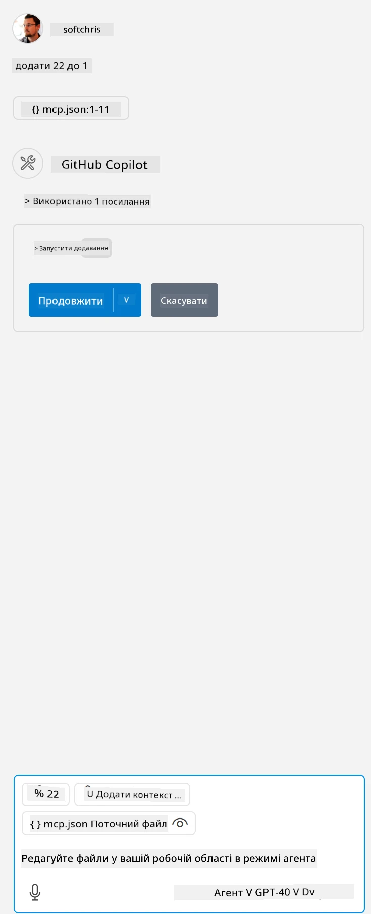

Це відповідає запуску команди на кшталт: `node build/index.js`.

- Змініть цей запис сервера так, щоб він вказував на абсолютний шлях до вашого серверного файлу або на те, що потрібно для запуску сервера, залежно від обраного середовища виконання та розташування сервера.

## Використання функцій на сервері

- Натисніть іконку `play`, після того як додасте *mcp.json* у папку *./vscode*,

    Зверніть увагу, що іконка інструментів зміниться, збільшуючи кількість доступних інструментів. Іконка інструментів розташована безпосередньо над полем чату в GitHub Copilot.

## Запуск інструменту

- Введіть запит у вікні чату, який відповідає опису вашого інструменту. Наприклад, щоб викликати інструмент `add`, введіть щось на кшталт "add 3 to 20".

    Ви побачите, що над текстовим полем чату з’явиться інструмент, який можна вибрати для запуску, як показано на цьому зображенні:

    

    Вибір інструменту має дати числовий результат "23", якщо ваш запит був подібним до наведеного вище.

**Відмова від відповідальності**:  
Цей документ було перекладено за допомогою сервісу автоматичного перекладу [Co-op Translator](https://github.com/Azure/co-op-translator). Хоча ми прагнемо до точності, будь ласка, майте на увазі, що автоматичні переклади можуть містити помилки або неточності. Оригінальний документ рідною мовою слід вважати авторитетним джерелом. Для критично важливої інформації рекомендується звертатися до професійного людського перекладу. Ми не несемо відповідальності за будь-які непорозуміння або неправильні тлумачення, що виникли внаслідок використання цього перекладу.