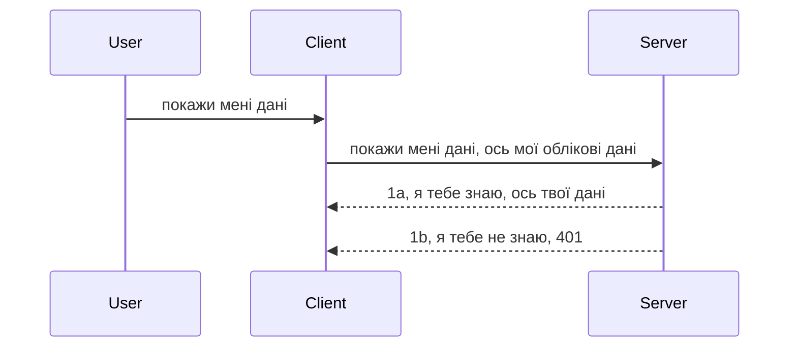

# Простий автентифікація

MCP SDK підтримують використання OAuth 2.1, який, чесно кажучи, є досить складним процесом, що включає такі поняття, як сервер автентифікації, сервер ресурсів, надсилання облікових даних, отримання коду, обмін цього коду на токен носія, поки ви нарешті не отримаєте доступ до своїх ресурсних даних. Якщо ви не звикли до OAuth, який є чудовим механізмом для реалізації, корисно почати з базового рівня автентифікації і поступово рухатися до все більш надійної безпеки. Саме тому існує ця глава — щоб побудувати вас до більш просунутої автентифікації.

## Автентифікація, що ми маємо на увазі?

Автентифікація – це скорочено від authentication та authorization. Ідея полягає у тому, що нам потрібно зробити дві речі:

- **Authentication (автентифікація)** — це процес визначення, чи дозволяємо ми людині увійти до нашого «будинку», тобто чи має вона право бути «тут», мати доступ до нашого сервера ресурсів, де живуть функції нашого MCP сервера.
- **Authorization (авторизація)** — це процес з'ясування, чи повинен користувач мати доступ до конкретних ресурсів, які він запитує, наприклад ці замовлення чи ці продукти, або чи дозволено йому читати контент, але не видаляти, як ще один приклад.

## Облікові дані: як ми розповідаємо системі, хто ми

Більшість веб-розробників думають про надання облікових даних серверу, зазвичай це секрет, який говорить, чи дозволено їм бути тут ("автентифікація"). Цей обліковий запис зазвичай є base64-кодованою версією імені користувача і пароля або API-ключем, який унікально ідентифікує конкретного користувача.

Це передається через заголовок "Authorization" таким чином:

```json
{ "Authorization": "secret123" }
```

Це зазвичай називають базовою автентифікацією. Загальний потік тоді виглядає так:


Тепер, коли ми розуміємо загальний хід, як це реалізувати? Більшість веб-серверів мають концепцію middleware — частину коду, що запускається під час обробки запиту і може перевірити облікові дані, і якщо вони дійсні, дозволити запиту пройти далі. Якщо ж облікові дані не валідні — ви отримаєте помилку автентифікації. Давайте подивимось, як це можна реалізувати:

**Python**

```python
class AuthMiddleware(BaseHTTPMiddleware):
    async def dispatch(self, request, call_next):

        has_header = request.headers.get("Authorization")
        if not has_header:
            print("-> Missing Authorization header!")
            return Response(status_code=401, content="Unauthorized")

        if not valid_token(has_header):
            print("-> Invalid token!")
            return Response(status_code=403, content="Forbidden")

        print("Valid token, proceeding...")
       
        response = await call_next(request)
        # додати будь-які користувацькі заголовки або змінити відповідь якимось чином
        return response


starlette_app.add_middleware(CustomHeaderMiddleware)
```

Тут ми:

- Створили middleware під назвою `AuthMiddleware`, де метод `dispatch` викликається веб-сервером.
- Додали middleware до веб-сервера:

    ```python
    starlette_app.add_middleware(AuthMiddleware)
    ```

- Написали логіку валідації, яка перевіряє, чи є заголовок Authorization, і чи валідний секрет:

    ```python
    has_header = request.headers.get("Authorization")
    if not has_header:
        print("-> Missing Authorization header!")
        return Response(status_code=401, content="Unauthorized")

    if not valid_token(has_header):
        print("-> Invalid token!")
        return Response(status_code=403, content="Forbidden")
    ```

Якщо секрет присутній і валідний, ми дозволяємо запиту пройти, викликаючи `call_next` і повертаючи відповідь.

    ```python
    response = await call_next(request)
    # додайте будь-які користувацькі заголовки або змініть відповідь якимось чином
    return response
    ```

Як це працює: коли веб-запит надходить до сервера, middleware викликається і на основі своєї реалізації або пропускає запит, або повертає помилку, що клієнту заборонено продовжувати.

**TypeScript**

Тут ми створюємо middleware з популярним фреймворком Express і перехоплюємо запит до того, як він досягне MCP сервера. Ось код для цього:

```typescript
function isValid(secret) {
    return secret === "secret123";
}

app.use((req, res, next) => {
    // 1. Чи присутній заголовок авторизації?
    if(!req.headers["Authorization"]) {
        res.status(401).send('Unauthorized');
    }
    
    let token = req.headers["Authorization"];

    // 2. Перевірте дійсність.
    if(!isValid(token)) {
        res.status(403).send('Forbidden');
    }

   
    console.log('Middleware executed');
    // 3. Передає запит до наступного кроку в конвеєрі запитів.
    next();
});
```

У цьому коді:

1. Перевіряємо, чи є заголовок Authorization, якщо ні — надсилаємо помилку 401.
2. Перевіряємо, чи є кредит/токен валідним, якщо ні — надсилаємо помилку 403.
3. Врешті-решт передаємо запит далі по конвеєру і повертаємо запитуваний ресурс.

## Вправа: Реалізуйте автентифікацію

Візьмемо наші знання і спробуємо реалізувати це. План такий:

Сервер

- Створити веб-сервер і інстанс MCP.
- Реалізувати middleware для сервера.

Клієнт

- Надіслати веб-запит із обліковими даними у заголовку.

### -1- Створити веб-сервер і інстанс MCP

На першому кроці потрібно створити інстанс веб-сервера і MCP сервер.

**Python**

Тут створюємо інстанс MCP сервера, створюємо starlette веб-додаток і розміщуємо його з uvicorn.

```python
# створення MCP сервера

app = FastMCP(
    name="MCP Resource Server",
    instructions="Resource Server that validates tokens via Authorization Server introspection",
    host=settings["host"],
    port=settings["port"],
    debug=True
)

# створення веб-додатку starlette
starlette_app = app.streamable_http_app()

# запущення додатку через uvicorn
async def run(starlette_app):
    import uvicorn
    config = uvicorn.Config(
            starlette_app,
            host=app.settings.host,
            port=app.settings.port,
            log_level=app.settings.log_level.lower(),
        )
    server = uvicorn.Server(config)
    await server.serve()

run(starlette_app)
```

У цьому коді:

- Створюємо MCP сервер.
- Створюємо starlette веб-додаток з MCP сервера, `app.streamable_http_app()`.
- Розміщуємо і запускаємо веб-додаток за допомогою uvicorn `server.serve()`.

**TypeScript**

Тут ми створюємо інстанс MCP сервера.

```typescript
const server = new McpServer({
      name: "example-server",
      version: "1.0.0"
    });

    // ... налаштувати ресурси сервера, інструменти та підказки ...
```

Це створення MCP сервера має відбуватися в межах визначення маршруту POST /mcp, тому перемістимо наведений код так:

```typescript
import express from "express";
import { randomUUID } from "node:crypto";
import { McpServer } from "@modelcontextprotocol/sdk/server/mcp.js";
import { StreamableHTTPServerTransport } from "@modelcontextprotocol/sdk/server/streamableHttp.js";
import { isInitializeRequest } from "@modelcontextprotocol/sdk/types.js"

const app = express();
app.use(express.json());

// Карта для зберігання транспортів за ID сесії
const transports: { [sessionId: string]: StreamableHTTPServerTransport } = {};

// Обробка POST-запитів для зв’язку клієнт-сервер
app.post('/mcp', async (req, res) => {
  // Перевірка наявності існуючого ID сесії
  const sessionId = req.headers['mcp-session-id'] as string | undefined;
  let transport: StreamableHTTPServerTransport;

  if (sessionId && transports[sessionId]) {
    // Повторне використання існуючого транспорту
    transport = transports[sessionId];
  } else if (!sessionId && isInitializeRequest(req.body)) {
    // Новий запит ініціалізації
    transport = new StreamableHTTPServerTransport({
      sessionIdGenerator: () => randomUUID(),
      onsessioninitialized: (sessionId) => {
        // Збереження транспорту за ID сесії
        transports[sessionId] = transport;
      },
      // Захист від DNS rebinding за замовчуванням вимкнено для зворотної сумісності. Якщо ви запускаєте цей сервер
      // локально, переконайтеся, що встановлено:
      // enableDnsRebindingProtection: true,
      // allowedHosts: ['127.0.0.1'],
    });

    // Очищення транспорту після закриття
    transport.onclose = () => {
      if (transport.sessionId) {
        delete transports[transport.sessionId];
      }
    };
    const server = new McpServer({
      name: "example-server",
      version: "1.0.0"
    });

    // ... налаштування серверних ресурсів, інструментів і запитів ...

    // Підключення до сервера MCP
    await server.connect(transport);
  } else {
    // Некоректний запит
    res.status(400).json({
      jsonrpc: '2.0',
      error: {
        code: -32000,
        message: 'Bad Request: No valid session ID provided',
      },
      id: null,
    });
    return;
  }

  // Обробка запиту
  await transport.handleRequest(req, res, req.body);
});

// Багаторазовий обробник для GET та DELETE запитів
const handleSessionRequest = async (req: express.Request, res: express.Response) => {
  const sessionId = req.headers['mcp-session-id'] as string | undefined;
  if (!sessionId || !transports[sessionId]) {
    res.status(400).send('Invalid or missing session ID');
    return;
  }
  
  const transport = transports[sessionId];
  await transport.handleRequest(req, res);
};

// Обробка GET-запитів для повідомлень сервера-клієнту через SSE
app.get('/mcp', handleSessionRequest);

// Обробка DELETE-запитів для завершення сесії
app.delete('/mcp', handleSessionRequest);

app.listen(3000);
```

Тепер ви бачите, як створення MCP сервера перемістили всередину `app.post("/mcp")`.

Продовжимо до наступного кроку — створення middleware для валідації вхідних облікових даних.

### -2- Реалізуйте middleware для сервера

Переходимо до middleware. Тут ми створимо middleware, що шукає облікові дані в заголовку `Authorization` і перевіряє їх. Якщо воно прийнятне, запит перейде далі — наприклад, перерахунок інструментів, читання ресурсу або будь-яка інша функціональність MCP, яку клієнт запросив.

**Python**

Щоб створити middleware, потрібно створити клас, що наслідується від `BaseHTTPMiddleware`. Є два важливі елементи:

- Запит `request`, з якого ми читаємо інформацію про заголовки.
- `call_next` — callback, який потрібно викликати, якщо клієнт подав валідні облікові дані.

Спочатку потрібно обробити випадок, коли заголовок `Authorization` відсутній:

```python
has_header = request.headers.get("Authorization")

# заголовок відсутній, повернути помилку 401, інакше продовжити.
if not has_header:
    print("-> Missing Authorization header!")
    return Response(status_code=401, content="Unauthorized")
```

Тут ми відправляємо повідомлення 401 unauthorized, оскільки автентифікація не виконана.

Далі, якщо облікові дані було надіслано, перевіряємо їх дійсність так:

```python
 if not valid_token(has_header):
    print("-> Invalid token!")
    return Response(status_code=403, content="Forbidden")
```

Зверніть увагу, що тут ми надаємо помилку 403 forbidden. Давайте подивимося повний middleware, який реалізує все це:

```python
class AuthMiddleware(BaseHTTPMiddleware):
    async def dispatch(self, request, call_next):

        has_header = request.headers.get("Authorization")
        if not has_header:
            print("-> Missing Authorization header!")
            return Response(status_code=401, content="Unauthorized")

        if not valid_token(has_header):
            print("-> Invalid token!")
            return Response(status_code=403, content="Forbidden")

        print("Valid token, proceeding...")
        print(f"-> Received {request.method} {request.url}")
        response = await call_next(request)
        response.headers['Custom'] = 'Example'
        return response

```

Чудово, а що ж таке функція `valid_token`? Ось вона нижче:
:

```python
# НЕ використовуйте для продуктивного використання - покращіть це !!
def valid_token(token: str) -> bool:
    # видаліть префікс "Bearer "
    if token.startswith("Bearer "):
        token = token[7:]
        return token == "secret-token"
    return False
```

Це слід покращити.

ВАЖЛИВО: Ви НІКОЛИ не повинні зберігати секрети у коді. Ідеально — отримувати значення для порівняння з джерела даних або від IDP (провайдера ідентифікації), або ще краще — дати IDP робити валідацію.

**TypeScript**

Щоб це імплементувати в Express, треба викликати метод `use`, який приймає middleware-функції.

Нам потрібно:

- Взаємодіяти з об'єктом запиту, щоб перевірити передані облікові дані у властивості `Authorization`.
- Перевірити валідність облікових даних і, якщо все гаразд, дати запиту пройти далі і виконати функціонал MCP, який запитував клієнт (наприклад, перелік інструментів, читання ресурсу тощо).

Тут ми перевіряємо, чи є заголовок `Authorization`, якщо ні, перериваємо запит:

```typescript
if(!req.headers["authorization"]) {
    res.status(401).send('Unauthorized');
    return;
}
```

Якщо заголовок не надано, отримуємо помилку 401.

Далі перевіряємо, чи валідний токен, якщо ні, зупиняємо запит з помилкою:

```typescript
if(!isValid(token)) {
    res.status(403).send('Forbidden');
    return;
} 
```

Зверніть увагу, що це помилка 403.

Ось повний код:

```typescript
app.use((req, res, next) => {
    console.log('Request received:', req.method, req.url, req.headers);
    console.log('Headers:', req.headers["authorization"]);
    if(!req.headers["authorization"]) {
        res.status(401).send('Unauthorized');
        return;
    }
    
    let token = req.headers["authorization"];

    if(!isValid(token)) {
        res.status(403).send('Forbidden');
        return;
    }  

    console.log('Middleware executed');
    next();
});
```

Ми налаштували веб-сервер для прийому middleware, який перевіряє облікові дані, які клієнт має надіслати. А що з самим клієнтом?

### -3- Надіслати веб-запит з обліковими даними через заголовок

Потрібно впевнитися, що клієнт передає облікові дані у заголовку. Оскільки ми будемо використовувати клієнт MCP, потрібно з'ясувати, як це зробити.

**Python**

Для клієнта потрібно передати заголовок з обліковими даними так:

```python
# НЕ фіксуйте значення в коді, мінімум зберігайте його у змінній середовища або в більш безпечному сховищі
token = "secret-token"

async with streamablehttp_client(
        url = f"http://localhost:{port}/mcp",
        headers = {"Authorization": f"Bearer {token}"}
    ) as (
        read_stream,
        write_stream,
        session_callback,
    ):
        async with ClientSession(
            read_stream,
            write_stream
        ) as session:
            await session.initialize()
      
            # TODO, що ви хочете зробити на стороні клієнта, наприклад список інструментів, виклик інструментів тощо.
```

Зверніть увагу, як ми заповнюємо властивість `headers` так: `headers = {"Authorization": f"Bearer {token}"}`.

**TypeScript**

Можемо це зробити у два кроки:

1. Заповнити об’єкт конфігурації нашими обліковими даними.
2. Передати цей об’єкт в транспорт.

```typescript

// НЕ жорстко кодуйте значення, як показано тут. Як мінімум, зробіть його змінною оточення і використовуйте щось подібне до dotenv (у режимі розробки).
let token = "secret123"

// визначте об'єкт параметрів клієнтського транспорту
let options: StreamableHTTPClientTransportOptions = {
  sessionId: sessionId,
  requestInit: {
    headers: {
      "Authorization": "secret123"
    }
  }
};

// передайте об'єкт параметрів транспорту
async function main() {
   const transport = new StreamableHTTPClientTransport(
      new URL(serverUrl),
      options
   );
```

Тут ви бачите, як створюємо `options` і кладемо заголовки під `requestInit`.

ВАЖЛИВО: Як покращити це далі? Поточна реалізація має недоліки. По-перше, передача облікових даних так ризикована, якщо тільки у вас немає HTTPS. Навіть тоді токен можна викрасти, тому потрібна система, де можна легко відкликати токен, додати додаткові перевірки — звідки він, чи надто часто надходять запити (поведінка бота) тощо. Є ціла низка питань.

Проте, для дуже простих API, де ви не хочете, щоб будь-хто звертався до вашого API без автентифікації, те, що ми маємо тут, є хорошим початком.

З огляду на це, давайте посилити безпеку, використовуючи стандартизований формат, як JSON Web Token, або JWT, також відомий як "JOT" токени.

## JSON Web Tokens, JWT

Отже, ми намагаємося поліпшити сценарій надсилання дуже простих облікових даних. Які негайні покращення ми отримуємо, якщо застосовуємо JWT?

- **Покращення безпеки**. У базовій автентифікації ви постійно посилаєте ім'я користувача і пароль у base64 (або API-ключ), що підвищує ризики. З JWT ви спочатку відправляєте ім'я і пароль, отримуєте токен у відповідь, і він має обмежений час дії (термін придатності). JWT дозволяє легко застосовувати деталізований контроль доступу з ролями, скоупами і дозволами.
- **Безстанність і масштабованість**. JWT автономні, несуть всю інформацію про користувача, що виключає потребу в зберіганні сесій на сервері. Токени можна перевіряти локально.
- **Інтероперабельність і федерація**. JWT є основою Open ID Connect і використовуються з відомими провайдерами ідентичності, як Entra ID, Google Identity, Auth0. Вони забезпечують єдиний вхід і багато іншого для корпоративних додатків.
- **Модульність і гнучкість**. JWT можна застосовувати з API Gateway, як Azure API Management, NGINX тощо. Підтримує автентифікацію користувача і взаємодію сервер до сервера, включаючи сценарії імітації і делегації.
- **Продуктивність і кешування**. JWT можна кешувати після розшифровки, що зменшує навантаження на парсинг. Це корисно при великих навантаженнях, підвищує пропускну здатність.
- **Додаткові функції**. Підтримує інспекцію (перевірка на сервері) і відкликання (зробити токен недійсним).

З усіма цими перевагами давайте подивимося, як підняти нашу реалізацію на новий рівень.

## Перетворення базової автентифікації на JWT

Отже, загальні зміни, які нам потрібні на високому рівні:

- **Навчитися конструювати JWT токен** і готувати його для відправки від клієнта до сервера.
- **Валідувати JWT токен**, і якщо валідація успішна, дозволити клієнту отримати наші ресурси.
- **Безпечне зберігання токенів**. Як зберігати цей токен.
- **Захист маршрутів**. Потрібно захистити маршрути, у нашому випадку конкретні функції MCP.
- **Додати токени оновлення (refresh tokens)**. Забезпечити токени з коротким терміном дії і refresh токени з довгим терміном, щоб можна було отримати нові токени при закінченні терміну дії. Також забезпечити endpoint оновлення і стратегію ротації.

### -1- Конструйований JWT токен

Перш за все, JWT токен має такі частини:

- **header (заголовок)** — алгоритм і тип токена.
- **payload (корисні дані)** — заяви (claims), наприклад sub (користувач або суб’єкт токена — зазвичай ідентифікатор користувача), exp (термін дії), role (роль).
- **signature (підпис)** — підписаний секретом чи приватним ключем.

Для цього треба створити заголовок, payload і потім закодувати токен.

**Python**

```python

import jwt
import jwt
from jwt.exceptions import ExpiredSignatureError, InvalidTokenError
import datetime

# Секретний ключ, який використовується для підпису JWT
secret_key = 'your-secret-key'

header = {
    "alg": "HS256",
    "typ": "JWT"
}

# інформація про користувача, його заяви та час завершення дії
payload = {
    "sub": "1234567890",               # Тема (ідентифікатор користувача)
    "name": "User Userson",                # Користувацький претензія
    "admin": True,                     # Користувацький претензія
    "iat": datetime.datetime.utcnow(),# Час випуску
    "exp": datetime.datetime.utcnow() + datetime.timedelta(hours=1)  # Час закінчення дії
}

# закодувати це
encoded_jwt = jwt.encode(payload, secret_key, algorithm="HS256", headers=header)
```

У цьому коді ми:

- Визначили заголовок з алгоритмом HS256 і типом JWT.
- Побудували payload, що містить subject (ідентифікатор користувача), ім’я користувача, роль, час випуску і час закінчення дії — реалізуючи аспект обмеженого часу роботи.

**TypeScript**

Тут нам потрібні деякі залежності, які допоможуть створити JWT токен.

Залежності

```sh

npm install jsonwebtoken
npm install --save-dev @types/jsonwebtoken
```

Тепер створимо заголовок, payload і закодуємо токен.

```typescript
import jwt from 'jsonwebtoken';

const secretKey = 'your-secret-key'; // Використовуйте змінні оточення у продуктивному середовищі

// Визначте навантаження
const payload = {
  sub: '1234567890',
  name: 'User usersson',
  admin: true,
  iat: Math.floor(Date.now() / 1000), // Час випуску
  exp: Math.floor(Date.now() / 1000) + 60 * 60 // Терміни дії - 1 година
};

// Визначте заголовок (необов’язково, jsonwebtoken встановлює значення за замовчуванням)
const header = {
  alg: 'HS256',
  typ: 'JWT'
};

// Створіть токен
const token = jwt.sign(payload, secretKey, {
  algorithm: 'HS256',
  header: header
});

console.log('JWT:', token);
```

Цей токен:

Підписаний HS256
Діє 1 годину
Містить заяви sub, name, admin, iat і exp.

### -2- Валідація токена

Нам також потрібно валідувати токен — це потрібно робити на сервері, щоб переконатися, що те, що надсилає клієнт, справді валідне. Треба виконати багато перевірок — структуру токена, дійсність тощо. Варто також додати перевірки на наявність користувача в системі, чи має він права тощо.

Щоб валідувати токен, треба його декодувати, щоб читати і перевіряти.

**Python**

```python

# Розкодувати та перевірити JWT
try:
    decoded = jwt.decode(token, secret_key, algorithms=["HS256"])
    print("✅ Token is valid.")
    print("Decoded claims:")
    for key, value in decoded.items():
        print(f"  {key}: {value}")
except ExpiredSignatureError:
    print("❌ Token has expired.")
except InvalidTokenError as e:
    print(f"❌ Invalid token: {e}")

```

У цьому коді ми викликаємо `jwt.decode`, передаючи токен, секретний ключ і алгоритм. Зверніть увагу, ми використовуємо конструкцію try-catch, оскільки невдала валідація викликає помилку.

**TypeScript**

Тут ми виконуємо `jwt.verify`, щоб отримати декодований токен для подальшого аналізу. Якщо виклик не вдається, це означає, що структура токена некоректна або він більше не дійсний.

```typescript

try {
  const decoded = jwt.verify(token, secretKey);
  console.log('Decoded Payload:', decoded);
} catch (err) {
  console.error('Token verification failed:', err);
}
```

ПРИМІТКА: як зазначалося раніше, слід також виконати додаткові перевірки для впевненості, що цей токен вказує на користувача у вашій системі і що користувач має відповідні права.
Далі давайте розглянемо контроль доступу на основі ролей, також знаний як RBAC.

## Додавання контролю доступу на основі ролей

Ідея полягає в тому, що ми хочемо виразити, що різні ролі мають різні дозволи. Наприклад, ми припускаємо, що адміністратор може робити все, звичайний користувач може читати/записувати, а гість може лише читати. Отже, ось деякі можливі рівні дозволів:

- Admin.Write 
- User.Read
- Guest.Read

Давайте подивимось, як ми можемо реалізувати такий контроль за допомогою middleware. Middleware можна додати для конкретного маршруту, а також для всіх маршрутів.

**Python**

```python
from starlette.middleware.base import BaseHTTPMiddleware
from starlette.responses import JSONResponse
import jwt

# НЕ тримайте секрет у коді, це лише для демонстрації. Зчитуйте його з безпечного місця.
SECRET_KEY = "your-secret-key" # помістіть це у змінну оточення
REQUIRED_PERMISSION = "User.Read"

class JWTPermissionMiddleware(BaseHTTPMiddleware):
    async def dispatch(self, request, call_next):
        auth_header = request.headers.get("Authorization")
        if not auth_header or not auth_header.startswith("Bearer "):
            return JSONResponse({"error": "Missing or invalid Authorization header"}, status_code=401)

        token = auth_header.split(" ")[1]
        try:
            decoded = jwt.decode(token, SECRET_KEY, algorithms=["HS256"])
        except jwt.ExpiredSignatureError:
            return JSONResponse({"error": "Token expired"}, status_code=401)
        except jwt.InvalidTokenError:
            return JSONResponse({"error": "Invalid token"}, status_code=401)

        permissions = decoded.get("permissions", [])
        if REQUIRED_PERMISSION not in permissions:
            return JSONResponse({"error": "Permission denied"}, status_code=403)

        request.state.user = decoded
        return await call_next(request)


```

Є кілька різних способів додати middleware, як нижче:

```python

# Варіант 1: додати проміжне програмне забезпечення під час створення програми starlette
middleware = [
    Middleware(JWTPermissionMiddleware)
]

app = Starlette(routes=routes, middleware=middleware)

# Варіант 2: додати проміжне програмне забезпечення після того, як програма starlette вже створена
starlette_app.add_middleware(JWTPermissionMiddleware)

# Варіант 3: додати проміжне програмне забезпечення для кожного маршруту
routes = [
    Route(
        "/mcp",
        endpoint=..., # обробник
        middleware=[Middleware(JWTPermissionMiddleware)]
    )
]
```

**TypeScript**

Ми можемо використовувати `app.use` і middleware, яке буде запускатися для всіх запитів.

```typescript
app.use((req, res, next) => {
    console.log('Request received:', req.method, req.url, req.headers);
    console.log('Headers:', req.headers["authorization"]);

    // 1. Перевірте, чи був надісланий заголовок авторизації

    if(!req.headers["authorization"]) {
        res.status(401).send('Unauthorized');
        return;
    }
    
    let token = req.headers["authorization"];

    // 2. Перевірте, чи дійсний токен
    if(!isValid(token)) {
        res.status(403).send('Forbidden');
        return;
    }  

    // 3. Перевірте, чи існує користувач токена в нашій системі
    if(!isExistingUser(token)) {
        res.status(403).send('Forbidden');
        console.log("User does not exist");
        return;
    }
    console.log("User exists");

    // 4. Перевірте, чи токен має відповідні дозволи
    if(!hasScopes(token, ["User.Read"])){
        res.status(403).send('Forbidden - insufficient scopes');
    }

    console.log("User has required scopes");

    console.log('Middleware executed');
    next();
});

```

Існує ряд речей, які ми можемо дозволити нашому middleware і які наше middleware ПОВИННО робити, а саме:

1. Перевірити, чи присутній заголовок авторизації
2. Перевірити, чи токен дійсний, ми викликаємо `isValid` — це метод, який ми написали для перевірки цілісності та дійсності JWT-токена.
3. Перевірити, чи користувач існує в нашій системі, це також потрібно перевірити.

   ```typescript
    // користувачі в базі даних
   const users = [
     "user1",
     "User usersson",
   ]

   function isExistingUser(token) {
     let decodedToken = verifyToken(token);

     // TODO, перевірити, чи існує користувач у базі даних
     return users.includes(decodedToken?.name || "");
   }
   ```

   Вище ми створили дуже простий список `users`, який, звичайно, повинен бути у базі даних.

4. Додатково, ми також повинні перевірити, чи токен має правильні дозволи.

   ```typescript
   if(!hasScopes(token, ["User.Read"])){
        res.status(403).send('Forbidden - insufficient scopes');
   }
   ```

   У цьому коді з middleware ми перевіряємо, що токен містить дозвіл User.Read, якщо ні, то відправляємо помилку 403. Нижче наведено допоміжний метод `hasScopes`.

   ```typescript
   function hasScopes(scope: string, requiredScopes: string[]) {
     let decodedToken = verifyToken(scope);
    return requiredScopes.every(scope => decodedToken?.scopes.includes(scope));
  }
   ```

Have a think which additional checks you should be doing, but these are the absolute minimum of checks you should be doing.

Using Express as a web framework is a common choice. There are helpers library when you use JWT so you can write less code.

- `express-jwt`, helper library that provides a middleware that helps decode your token.
- `express-jwt-permissions`, this provides a middleware `guard` that helps check if a certain permission is on the token.

Here's what these libraries can look like when used:

```typescript
const express = require('express');
const jwt = require('express-jwt');
const guard = require('express-jwt-permissions')();

const app = express();
const secretKey = 'your-secret-key'; // put this in env variable

// Decode JWT and attach to req.user
app.use(jwt({ secret: secretKey, algorithms: ['HS256'] }));

// Check for User.Read permission
app.use(guard.check('User.Read'));

// multiple permissions
// app.use(guard.check(['User.Read', 'Admin.Access']));

app.get('/protected', (req, res) => {
  res.json({ message: `Welcome ${req.user.name}` });
});

// Error handler
app.use((err, req, res, next) => {
  if (err.code === 'permission_denied') {
    return res.status(403).send('Forbidden');
  }
  next(err);
});

```

Тепер ви побачили, як middleware може використовуватися як для аутентифікації, так і для авторизації, а як щодо MCP? Чи змінює він спосіб аутентифікації? З’ясуємо в наступному розділі.

### -3- Додати RBAC до MCP

Ви вже бачили, як можна додати RBAC через middleware, однак для MCP немає простого способу додати RBAC для кожної функції MCP, то що ж робити? Просто потрібно додати код, який перевіряє, чи має клієнт права викликати певний інструмент:

У вас є кілька варіантів, як реалізувати RBAC на рівні функції, ось деякі з них:

- Додати перевірку для кожного інструменту, ресурсу, запиту, де потрібно перевірити рівень дозволу.

   **python**

   ```python
   @tool()
   def delete_product(id: int):
      try:
          check_permissions(role="Admin.Write", request)
      catch:
        pass # клієнт не пройшов авторизацію, викликати помилку авторизації
   ```

   **typescript**

   ```typescript
   server.registerTool(
    "delete-product",
    {
      title: Delete a product",
      description: "Deletes a product",
      inputSchema: { id: z.number() }
    },
    async ({ id }) => {
      
      try {
        checkPermissions("Admin.Write", request);
        // зробити, надіслати id до productService та віддаленого входу
      } catch(Exception e) {
        console.log("Authorization error, you're not allowed");  
      }

      return {
        content: [{ type: "text", text: `Deletected product with id ${id}` }]
      };
    }
   );
   ```


- Використовувати просунутий серверний підхід і обробники запитів, щоб мінімізувати кількість місць, де потрібно робити перевірку.

   **Python**

   ```python
   
   tool_permission = {
      "create_product": ["User.Write", "Admin.Write"],
      "delete_product": ["Admin.Write"]
   }

   def has_permission(user_permissions, required_permissions) -> bool:
      # user_permissions: список дозволів, які має користувач
      # required_permissions: список дозволів, необхідних для інструменту
      return any(perm in user_permissions for perm in required_permissions)

   @server.call_tool()
   async def handle_call_tool(
     name: str, arguments: dict[str, str] | None
   ) -> list[types.TextContent]:
    # Припустимо, що request.user.permissions є списком дозволів користувача
     user_permissions = request.user.permissions
     required_permissions = tool_permission.get(name, [])
     if not has_permission(user_permissions, required_permissions):
        # Викинути помилку "У вас немає дозволу для виклику інструменту {name}"
        raise Exception(f"You don't have permission to call tool {name}")
     # продовжити та викликати інструмент
     # ...
   ```   
   

   **TypeScript**

   ```typescript
   function hasPermission(userPermissions: string[], requiredPermissions: string[]): boolean {
       if (!Array.isArray(userPermissions) || !Array.isArray(requiredPermissions)) return false;
       // Повертає true, якщо користувач має принаймні один необхідний дозвіл
       
       return requiredPermissions.some(perm => userPermissions.includes(perm));
   }
  
   server.setRequestHandler(CallToolRequestSchema, async (request) => {
      const { params: { name } } = request;
  
      let permissions = request.user.permissions;
  
      if (!hasPermission(permissions, toolPermissions[name])) {
         return new Error(`You don't have permission to call ${name}`);
      }
  
      // продовжуй..
   });
   ```

   Зверніть увагу, що вам потрібно переконатися, що ваше middleware присвоює декодований токен властивості user у запиті, щоб спростити наведений вище код.

### Підсумок

Тепер, коли ми обговорили, як загалом додати підтримку RBAC і зокрема до MCP, настав час спробувати реалізувати безпеку самостійно, щоб переконатися, що ви зрозуміли представлені концепції.

## Завдання 1: Побудувати MCP-сервер і MCP-клієнт з використанням базової аутентифікації

Тут ви застосуєте те, що вивчили про передачу облікових даних через заголовки.

## Рішення 1

[Solution 1](./code/basic/README.md)

## Завдання 2: Оновити рішення із Завдання 1 для використання JWT

Візьміть перше рішення, але цього разу покращимо його.

Замість використання базової аутентифікації давайте використаємо JWT.

## Рішення 2

[Solution 2](./solution/jwt-solution/README.md)

## Виклик

Додайте RBAC для кожного інструменту, як описано в розділі "Додати RBAC до MCP".

## Підсумок

Сподіваюсь, ви багато чого дізналися в цій главі — від відсутності будь-якої безпеки, до базової безпеки, до JWT і як його можна додати в MCP.

Ми створили міцну основу з користувацькими JWT, але в міру масштабування ми рухаємося до стандартної моделі ідентичності. Використання IdP на кшталт Entra або Keycloak дозволяє нам делегувати випуск і валідацію токенів та керування їх життєвим циклом на довірену платформу — звільняючи нас для зосередження на логіці додатку та досвіді користувача.

Для цього у нас є більш [просунутий розділ про Entra](../../05-AdvancedTopics/mcp-security-entra/README.md)

## Що далі

- Далі: [Налаштування MCP-Host-ів](../12-mcp-hosts/README.md)

---

<!-- CO-OP TRANSLATOR DISCLAIMER START -->
**Відмова від відповідальності**:
Цей документ було перекладено за допомогою сервісу автоматичного перекладу [Co-op Translator](https://github.com/Azure/co-op-translator). Хоча ми прагнемо до точності, будь ласка, майте на увазі, що автоматичний переклад може містити помилки або неточності. Оригінальний документ у його рідній мові слід вважати авторитетним джерелом. Для критичної інформації рекомендується професійний людський переклад. Ми не несемо відповідальності за будь-які непорозуміння чи неправильні тлумачення, що виникли в результаті використання цього перекладу.
<!-- CO-OP TRANSLATOR DISCLAIMER END -->