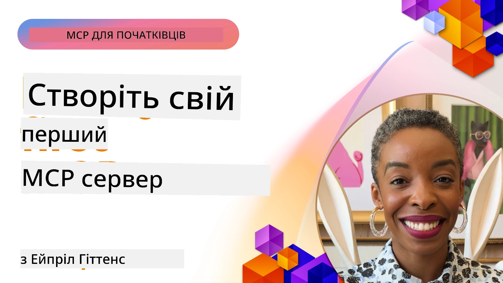

## Початок роботи  

_(Натисніть на зображення вище, щоб переглянути відеоурок цієї лекції)_

Цей розділ складається з кількох уроків:

- **1 Ваш перший сервер**, у цьому першому уроці ви навчитеся створювати свій перший сервер і досліджувати його за допомогою інструменту інспектора, цінного способу тестування та налагодження вашого сервера, [до уроку](01-first-server/README.md)

- **2 Клієнт**, у цьому уроці ви дізнаєтеся, як написати клієнта, який може підключатися до вашого сервера, [до уроку](02-client/README.md)

- **3 Клієнт із LLM**, ще кращий спосіб написання клієнта — додати до нього LLM, щоб він міг "вести переговори" з вашим сервером про подальші дії, [до уроку](03-llm-client/README.md)

- **4 Використання режиму GitHub Copilot Agent сервера в Visual Studio Code**. Тут ми розглядаємо запуск нашого MCP сервера всередині Visual Studio Code, [до уроку](04-vscode/README.md)

- **5 stdio Transport Server** stdio transport — це рекомендований стандарт для локальної комунікації MCP сервер-клієнт, що забезпечує безпечне спілкування на основі підпроцесів з вбудованою ізоляцією процесу [до уроку](05-stdio-server/README.md)

- **6 HTTP Streaming із MCP (Streamable HTTP)**. Дізнайтеся про сучасний транспорт для HTTP трансляції (рекомендований підхід для віддалених MCP серверів згідно з [MCP Specification 2025-11-25](https://spec.modelcontextprotocol.io/specification/2025-11-25/basic/transports/#streamable-http)), сповіщення про прогрес та як реалізувати масштабовані, реального часу MCP сервери та клієнти за допомогою Streamable HTTP. [до уроку](06-http-streaming/README.md)

- **7 Використання AI Toolkit для VSCode** для споживання та тестування ваших MCP клієнтів і серверів [до уроку](07-aitk/README.md)

- **8 Тестування**. Тут ми зосередимося особливо на тому, як можна тестувати наш сервер і клієнта різними способами, [до уроку](08-testing/README.md)

- **9 Розгортання**. Цей розділ розгляне різні способи розгортання ваших MCP рішень, [до уроку](09-deployment/README.md)

- **10 Розширене використання сервера**. Цей розділ охоплює розширене використання сервера, [до уроку](./10-advanced/README.md)

- **11 Авторизація**. Цей розділ охоплює, як додати просту авторизацію, від Basic Auth до використання JWT і RBAC. Вам рекомендується почати звідси, а потім вивчити Розділ 5 "Розширені теми" і виконати додаткове посилення безпеки згідно з рекомендаціями в Розділі 2, [до уроку](./11-simple-auth/README.md)

- **12 MCP Hosts**. Налаштування та використання популярних MCP хост-клієнтів, включно з Claude Desktop, Cursor, Cline та Windsurf. Ознайомлення з типами транспорту і усунення несправностей, [до уроку](./12-mcp-hosts/README.md)

- **13 MCP Inspector**. Інтерактивне налагодження та тестування ваших MCP серверів за допомогою інструменту MCP Inspector. Вивчення інструментів усунення несправностей, ресурсів і повідомлень протоколу, [до уроку](./13-mcp-inspector/README.md)

Model Context Protocol (MCP) — це відкритий протокол, що стандартизує, як додатки надають контекст для LLM. Подумайте про MCP як про USB-C порт для AI-додатків — він забезпечує стандартизований спосіб підключення AI моделей до різних джерел даних і інструментів.

## Цілі навчання

Після завершення цього уроку ви зможете:

- Налаштувати середовища розробки для MCP на C#, Java, Python, TypeScript і JavaScript
- Створювати та розгортати базові MCP сервери з користувацькими функціями (ресурси, підказки та інструменти)
- Створювати хост-додатки, які підключаються до MCP серверів
- Тестувати та налагоджувати реалізації MCP
- Розуміти поширені проблеми налаштування та їх рішення
- Підключати ваші реалізації MCP до популярних LLM сервісів

## Налаштування вашого середовища MCP

Перед тим, як почати працювати з MCP, важливо підготувати ваше середовище розробки та зрозуміти базовий робочий процес. Цей розділ проведе вас через початкові кроки, щоб забезпечити плавний старт із MCP.

### Вимоги

Перед тим, як зануритися у розвиток MCP, переконайтеся, що у вас є:

- **Середовище розробки**: для вашої обраної мови (C#, Java, Python, TypeScript або JavaScript)
- **IDE/Редактор**: Visual Studio, Visual Studio Code, IntelliJ, Eclipse, PyCharm або будь-який сучасний редактор коду
- **Менеджери пакетів**: NuGet, Maven/Gradle, pip або npm/yarn
- **API ключі**: для будь-яких AI сервісів, які ви плануєте використовувати у своїх хост-додатках

### Офіційні SDK

У наступних розділах ви побачите рішення, побудовані на Python, TypeScript, Java та .NET. Ось усі офіційно підтримувані SDK.

MCP надає офіційні SDK для кількох мов (у відповідності з [MCP Specification 2025-11-25](https://spec.modelcontextprotocol.io/specification/2025-11-25/)):
- [C# SDK](https://github.com/modelcontextprotocol/csharp-sdk) - підтримується у співпраці з Microsoft
- [Java SDK](https://github.com/modelcontextprotocol/java-sdk) - підтримується у співпраці з Spring AI
- [TypeScript SDK](https://github.com/modelcontextprotocol/typescript-sdk) - офіційна реалізація TypeScript
- [Python SDK](https://github.com/modelcontextprotocol/python-sdk) - офіційна реалізація Python (FastMCP)
- [Kotlin SDK](https://github.com/modelcontextprotocol/kotlin-sdk) - офіційна реалізація Kotlin
- [Swift SDK](https://github.com/modelcontextprotocol/swift-sdk) - підтримується у співпраці з Loopwork AI
- [Rust SDK](https://github.com/modelcontextprotocol/rust-sdk) - офіційна реалізація Rust
- [Go SDK](https://github.com/modelcontextprotocol/go-sdk) - офіційна реалізація Go

## Основні висновки

- Налаштування середовища розробки MCP просте завдяки мовно-специфічним SDK
- Створення MCP серверів включає створення та реєстрацію інструментів із чіткими схемами
- MCP клієнти підключаються до серверів і моделей, щоб використовувати розширені можливості
- Тестування та налагодження є необхідними для надійних реалізацій MCP
- Варіанти розгортання варіюються від локальної розробки до хмарних рішень

## Практика

Ми маємо набір прикладів, що доповнює вправи, які ви побачите у всіх розділах цього розділу. Додатково в кожному розділі є власні вправи та завдання.

- [Java Калькулятор](./samples/java/calculator/README.md)
- [.Net Калькулятор](../../../03-GettingStarted/samples/csharp)
- [JavaScript Калькулятор](./samples/javascript/README.md)
- [TypeScript Калькулятор](./samples/typescript/README.md)
- [Python Калькулятор](../../../03-GettingStarted/samples/python)

## Додаткові ресурси

- [Створення агентів з Model Context Protocol на Azure](https://learn.microsoft.com/azure/developer/ai/intro-agents-mcp)
- [Віддалений MCP з Azure Container Apps (Node.js/TypeScript/JavaScript)](https://learn.microsoft.com/samples/azure-samples/mcp-container-ts/mcp-container-ts/)
- [.NET OpenAI MCP Agent](https://learn.microsoft.com/samples/azure-samples/openai-mcp-agent-dotnet/openai-mcp-agent-dotnet/)

## Що далі

Почніть із першого уроку: [Створення вашого першого MCP сервера](01-first-server/README.md)

Після завершення цього модуля переходьте до: [Модуль 4: Практична реалізація](../04-PracticalImplementation/README.md)

---

<!-- CO-OP TRANSLATOR DISCLAIMER START -->
**Відмова від відповідальності**:  
Цей документ було перекладено з використанням сервісу штучного інтелекту [Co-op Translator](https://github.com/Azure/co-op-translator). Хоча ми прагнемо до точності, будь ласка, майте на увазі, що автоматичні переклади можуть містити помилки або неточності. Оригінальний документ його рідною мовою слід вважати авторитетним джерелом. Для критично важливої інформації рекомендується звертатися до професійного людського перекладу. Ми не несемо відповідальності за будь-які непорозуміння чи неправильно тлумачення, що виникли внаслідок використання цього перекладу.
<!-- CO-OP TRANSLATOR DISCLAIMER END -->