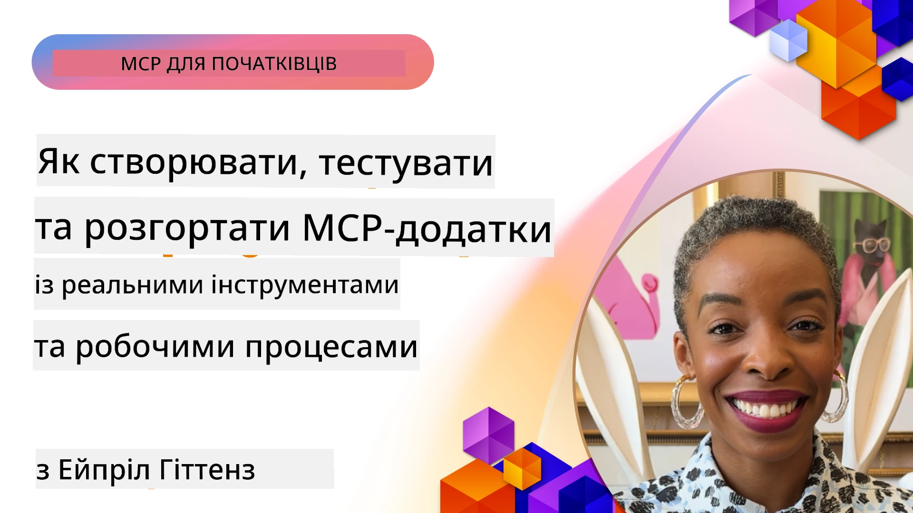
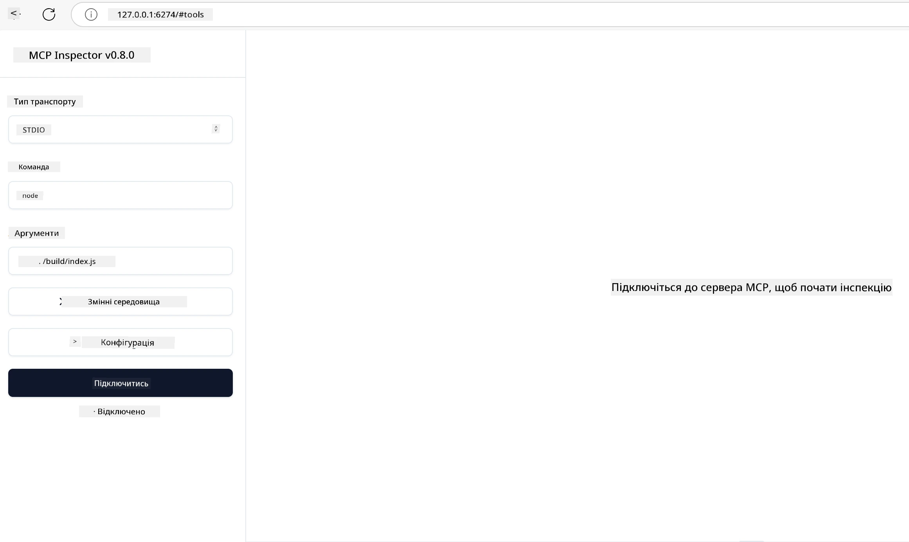

# Практична реалізація

[](https://youtu.be/vCN9-mKBDfQ)

_(Натисніть на зображення вище, щоб переглянути відео цього уроку)_

Практична реалізація — це те, де міць Model Context Protocol (MCP) стає відчутною. Хоча розуміння теорії та архітектури MCP важливе, справжня цінність виникає, коли ви застосовуєте ці концепції для створення, тестування та розгортання рішень, що вирішують реальні проблеми. Цей розділ заповнює розрив між концептуальними знаннями та практичною розробкою, проводячи вас крізь процес втілення додатків на основі MCP у життя.

Чи ви розробляєте інтелектуальних помічників, інтегруєте штучний інтелект у бізнес-процеси, чи створюєте кастомні інструменти для обробки даних, MCP надає гнучку основу. Його мова-незалежний дизайн і офіційні SDK для популярних мов програмування роблять його доступним для широкого кола розробників. Використовуючи ці SDK, ви можете швидко прототипувати, ітерувати та масштабувати ваші рішення на різних платформах і в різних середовищах.

У наступних розділах ви знайдете практичні приклади, зразки коду та стратегії розгортання, що демонструють, як реалізувати MCP на C#, Java зі Spring, TypeScript, JavaScript та Python. Ви також навчитеся налагоджувати й тестувати свої MCP сервери, керувати API та розгортати рішення в хмарі за допомогою Azure. Ці практичні ресурси покликані прискорити ваше навчання і допомогти впевнено створювати надійні MCP-додатки готові до виробництва.

## Огляд

Цей урок зосереджений на практичних аспектах реалізації MCP у кількох мовах програмування. Ми розглянемо, як використовувати MCP SDK у C#, Java зі Spring, TypeScript, JavaScript та Python для створення надійних додатків, налагодження та тестування MCP серверів, а також створення багаторазових ресурсів, промптів і інструментів.

## Цілі навчання

Після завершення цього уроку ви зможете:

- Реалізовувати рішення MCP, використовуючи офіційні SDK у різних мовах програмування
- Систематично налагоджувати й тестувати MCP сервери
- Створювати та використовувати серверні функції (Ресурси, Промпти, Інструменти)
- Проєктувати ефективні робочі процеси MCP для складних завдань
- Оптимізувати реалізації MCP за показниками продуктивності та надійності

## Офіційні SDK

Протокол Model Context Protocol пропонує офіційні SDK для кількох мов (відповідно до [MCP Specification 2025-11-25](https://spec.modelcontextprotocol.io/specification/2025-11-25/)):

- [C# SDK](https://github.com/modelcontextprotocol/csharp-sdk)
- [Java зі Spring SDK](https://github.com/modelcontextprotocol/java-sdk) **Примітка:** вимагає залежності від [Project Reactor](https://projectreactor.io). (Див. [обговорення issue 246](https://github.com/orgs/modelcontextprotocol/discussions/246).)
- [TypeScript SDK](https://github.com/modelcontextprotocol/typescript-sdk)
- [Python SDK](https://github.com/modelcontextprotocol/python-sdk)
- [Kotlin SDK](https://github.com/modelcontextprotocol/kotlin-sdk)
- [Go SDK](https://github.com/modelcontextprotocol/go-sdk)

## Робота з MCP SDK

У цьому розділі наведено практичні приклади реалізації MCP на кількох мовах програмування. Зразки коду знаходяться в директорії `samples`, організованій за мовами.

### Доступні зразки

Репозиторій містить [зразки реалізацій](../../../04-PracticalImplementation/samples) наступними мовами:

- [C#](./samples/csharp/README.md)
- [Java зі Spring](./samples/java/containerapp/README.md)
- [TypeScript](./samples/typescript/README.md)
- [JavaScript](./samples/javascript/README.md)
- [Python](./samples/python/README.md)

Кожен зразок демонструє ключові концепції MCP і шаблони реалізації для конкретної мови та екосистеми.

### Практичні посібники

Додаткові посібники з практичної реалізації MCP:

- [Пагінація та великі набори результатів](./pagination/README.md) — Обробка пагінації на основі курсора для інструментів, ресурсів і великих наборів даних

## Основні можливості сервера

MCP сервери можуть реалізовувати будь-яку комбінацію цих можливостей:

### Ресурси

Ресурси надають контекст і дані для користувача або AI-моделі:

- Репозиторії документів
- Бази знань
- Структуровані джерела даних
- Файлові системи

### Промпти

Промпти — це шаблонні повідомлення та робочі процеси для користувачів:

- Попередньо визначені шаблони розмов
- Керовані патерни взаємодії
- Спеціалізовані структури діалогів

### Інструменти

Інструменти — функції, які AI-модель може виконувати:

- Утиліти обробки даних
- Інтеграції з зовнішніми API
- Обчислювальні можливості
- Функції пошуку

## Зразки реалізацій: Реалізація на C#

Офіційний репозиторій C# SDK містить кілька зразків реалізацій, що демонструють різні аспекти MCP:

- **Базовий MCP клієнт**: Простий приклад, що показує, як створити MCP клієнта та викликати інструменти
- **Базовий MCP сервер**: Мінімальна серверна реалізація з базовою реєстрацією інструментів
- **Розширений MCP сервер**: Повнофункціональний сервер із реєстрацією інструментів, автентифікацією та обробкою помилок
- **Інтеграція з ASP.NET**: Приклади інтеграції з ASP.NET Core
- **Шаблони реалізації інструментів**: Різні шаблони для реалізації інструментів з різною складністю

C# SDK MCP знаходиться в прев’ю, і API можуть змінюватися. Ми постійно оновлюватимемо цей блог у міру розвитку SDK.

### Ключові особливості

- [C# MCP Nuget ModelContextProtocol](https://www.nuget.org/packages/ModelContextProtocol)
- Створення вашого [першого MCP сервера](https://devblogs.microsoft.com/dotnet/build-a-model-context-protocol-mcp-server-in-csharp/).

Для повних прикладів реалізації на C# відвідайте [офіційний репозиторій зразків C# SDK](https://github.com/modelcontextprotocol/csharp-sdk)

## Зразок реалізації: Реалізація на Java зі Spring

SDK Java зі Spring пропонує надійні опції реалізації MCP з функціями корпоративного рівня.

### Ключові особливості

- Інтеграція з Spring Framework
- Строга типізація
- Підтримка реактивного програмування
- Комплексна обробка помилок

Для повного зразка реалізації Java зі Spring дивіться [зразок Java зі Spring](samples/java/containerapp/README.md) у директорії зразків.

## Зразок реалізації: JavaScript

SDK JavaScript пропонує легкий і гнучкий підхід до реалізації MCP.

### Ключові особливості

- Підтримка Node.js та браузерів
- API на основі Promise
- Легка інтеграція з Express та іншими фреймворками
- Підтримка WebSocket для потокової передачі

Для повного зразка реалізації JavaScript дивіться [JavaScript зразок](samples/javascript/README.md) у директорії зразків.

## Зразок реалізації: Python

SDK Python пропонує "пітонічний" підхід до реалізації MCP з чудовою інтеграцією ML фреймворків.

### Ключові особливості

- Підтримка async/await з asyncio
- Інтеграція FastAPI``
- Проста реєстрація інструментів
- Рідна інтеграція з популярними ML бібліотеками

Для повного зразка реалізації Python дивіться [Python зразок](samples/python/README.md) у директорії зразків.

## Управління API

Azure API Management є відмінним рішенням для захисту MCP серверів. Ідея полягає в тому, щоб розмістити екземпляр Azure API Management перед вашим MCP сервером і дозволити йому керувати функціями, які вам можуть знадобитися, такими як:

- обмеження швидкості
- управління токенами
- моніторинг
- балансування навантаження
- безпека

### Зразок Azure

Ось зразок Azure, що робить саме це, тобто [створює MCP сервер і захищає його за допомогою Azure API Management](https://github.com/Azure-Samples/remote-mcp-apim-functions-python).

Дивіться, як відбувається потік авторизації на зображенні нижче:


На наведеному зображенні відбувається:

- Аутентифікація/авторизація за допомогою Microsoft Entra.
- Azure API Management працює як шлюз і використовує політики для спрямування та керування трафіком.
- Azure Monitor реєструє всі запити для подальшого аналізу.

#### Потік авторизації

Розглянемо потік авторизації детальніше:


#### Специфікація авторизації MCP

Дізнайтеся більше про [специфікацію авторизації MCP](https://spec.modelcontextprotocol.io/specification/2025-11-25/basic/authorization/)

## Розгортання віддаленого MCP сервера в Azure

Перевіримо, чи можемо розгорнути раніше згаданий зразок:

1. Клонувати репозиторій

    ```bash
    git clone https://github.com/Azure-Samples/remote-mcp-apim-functions-python.git
    cd remote-mcp-apim-functions-python
    ```

1. Зареєструвати провайдера ресурсів `Microsoft.App`.

   - Якщо ви користуєтесь Azure CLI, виконайте `az provider register --namespace Microsoft.App --wait`.
   - Якщо ви використовуєте Azure PowerShell, виконайте `Register-AzResourceProvider -ProviderNamespace Microsoft.App`. Потім через деякий час виконайте `(Get-AzResourceProvider -ProviderNamespace Microsoft.App).RegistrationState`, щоб перевірити завершення реєстрації.

1. Виконайте цю команду [azd](https://aka.ms/azd), щоб організувати службу керування API, функціональний додаток (з кодом) та всі інші необхідні ресурси Azure

    ```shell
    azd up
    ```

    Ця команда повинна розгорнути всі хмарні ресурси в Azure

### Тестування сервера з MCP Inspector

1. У **новому вікні терміналу** встановіть і запустіть MCP Inspector

    ```shell
    npx @modelcontextprotocol/inspector
    ```

    Ви побачите інтерфейс подібний до:

    

1. CTRL + клік для завантаження веб-застосунку MCP Inspector за URL, який відображає застосунок (наприклад, [http://127.0.0.1:6274/#resources](http://127.0.0.1:6274/#resources))
1. Встановіть тип транспорту в `SSE`
1. Встановіть URL на кінцеву точку SSE API Management вашого запущеного сервера, яка відображається після `azd up`, і **Підключіться**:

    ```shell
    https://<apim-servicename-from-azd-output>.azure-api.net/mcp/sse
    ```

1. **Список інструментів**. Натисніть на інструмент і **Запустіть інструмент**.

Якщо всі кроки пройшли успішно, ви тепер підключені до MCP сервера й змогли викликати інструмент.

## MCP сервери для Azure

[Remote-mcp-functions](https://github.com/Azure-Samples/remote-mcp-functions-dotnet): Цей набір репозиторіїв є шаблоном швидкого запуску для створення й розгортання кастомних віддалених MCP (Model Context Protocol) серверів за допомогою Azure Functions з Python, C# .NET або Node/TypeScript.

Зразки надають повне рішення, що дозволяє розробникам:

- Будувати та запускати локально: розробляти та налагоджувати MCP сервер на локальній машині
- Розгортати в Azure: легко розгортати в хмарі за допомогою простої команди azd up
- Підключатися з клієнтів: підключатися до MCP сервера з різних клієнтів, включно з режимом агента Copilot у VS Code та інструментом MCP Inspector

### Ключові особливості

- Безпека за замовчуванням: MCP сервер захищений за допомогою ключів і HTTPS
- Опції аутентифікації: підтримка OAuth із вбудованою автентифікацією та/або API Management
- Ізоляція мережі: забезпечує мережеву ізоляцію через Azure Virtual Networks (VNET)
- Безсерверна архітектура: використовує Azure Functions для масштабованого, подієвого виконання
- Локальна розробка: комплексна підтримка локальної розробки та налагодження
- Просте розгортання: оптимізований процес розгортання до Azure

Репозиторій містить усі необхідні конфігураційні файли, вихідний код і визначення інфраструктури для швидкого початку роботи з реалізацією MCP сервера, готового до виробництва.

- [Azure Remote MCP Functions Python](https://github.com/Azure-Samples/remote-mcp-functions-python) — Зразок реалізації MCP за допомогою Azure Functions з Python

- [Azure Remote MCP Functions .NET](https://github.com/Azure-Samples/remote-mcp-functions-dotnet) — Зразок реалізації MCP за допомогою Azure Functions з C# .NET

- [Azure Remote MCP Functions Node/Typescript](https://github.com/Azure-Samples/remote-mcp-functions-typescript) — Зразок реалізації MCP за допомогою Azure Functions з Node/TypeScript.

## Основні висновки

- SDK MCP забезпечують інструменти, специфічні для мови, для реалізації надійних MCP рішень
- Процес налагодження та тестування критичний для надійних MCP додатків
- Багаторазові шаблони промптів забезпечують послідовність взаємодії з AI
- Добре спроєктовані робочі процеси можуть координувати складні завдання з використанням кількох інструментів
- Реалізація MCP рішень вимагає врахування безпеки, продуктивності та обробки помилок

## Вправа

Спроєктуйте практичний робочий процес MCP, що вирішує реальну проблему у вашій галузі:

1. Визначте 3-4 інструменти, які були б корисними для розв’язання цієї проблеми
2. Створіть діаграму робочого процесу, що показує, як ці інструменти взаємодіють
3. Реалізуйте базову версію одного з інструментів, використовуючи вашу улюблену мову
4. Створіть шаблон промпту, який допоможе моделі ефективно використовувати ваш інструмент

## Додаткові ресурси

---

## Що далі

Далі: [Розширені теми](../05-AdvancedTopics/README.md)

---

<!-- CO-OP TRANSLATOR DISCLAIMER START -->
**Відмова від відповідальності**:
Цей документ було перекладено за допомогою сервісу автоматичного перекладу [Co-op Translator](https://github.com/Azure/co-op-translator). Хоча ми прагнемо до точності, будь ласка, пам’ятайте, що автоматичні переклади можуть містити помилки або неточності. Оригінальний документ його рідною мовою слід вважати авторитетним джерелом. Для критично важливої інформації рекомендовано звертатися до професійного перекладу людиною. Ми не несемо відповідальності за будь-які непорозуміння або неправильні тлумачення, що виникли внаслідок використання цього перекладу.
<!-- CO-OP TRANSLATOR DISCLAIMER END -->