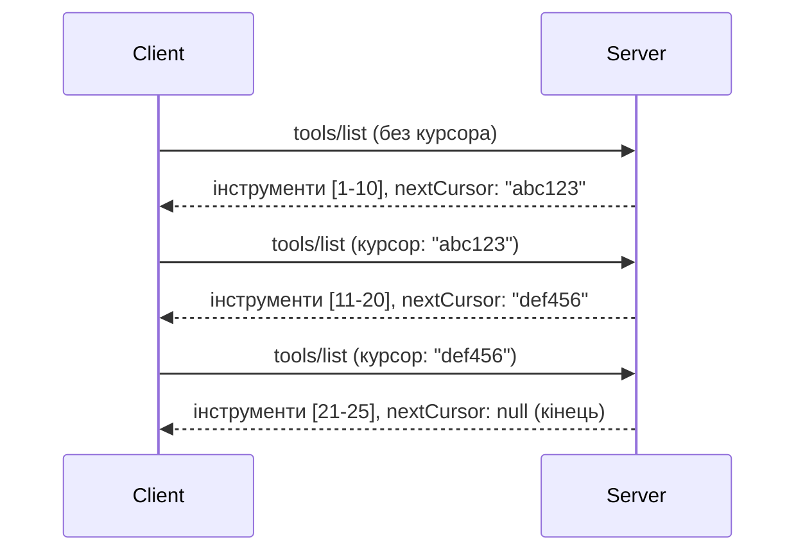

# Пагінація та великі набори результатів у MCP

Коли ваш сервер MCP обробляє великі набори даних — чи то список тисяч файлів, записів бази даних або результатів пошуку — вам потрібна пагінація для ефективного управління пам’яттю та забезпечення швидкої роботи користувачів. Цей посібник охоплює, як реалізувати та використовувати пагінацію в MCP.

## Чому пагінація важлива

Без пагінації великі відповіді можуть спричинити:

- **Виснаження пам’яті** — завантаження мільйонів записів одночасно
- **Повільний час відповіді** — користувачі очікують, поки завантажаться всі дані
- **Помилки тайм-ауту** — запити перевищують межі часу очікування
- **Погану продуктивність ШІ** — LLM важко працювати з величезним контекстом

MCP використовує **пагінацію на основі курсора** для надійного та послідовного переходу між наборами результатів.

---

## Як працює пагінація в MCP

### Концепція курсора

**Курсор** — це непрозорий рядок, який позначає ваше положення у наборі результатів. Уявіть його як закладку у довгій книзі.


### Пагінація в методах MCP

Ці методи MCP підтримують пагінацію:

| Метод | Повертає | Підтримка курсора |
|--------|---------|----------------|
| `tools/list` | Визначення інструментів | ✅ |
| `resources/list` | Визначення ресурсів | ✅ |
| `prompts/list` | Визначення підказок | ✅ |
| `resources/templates/list` | Шаблони ресурсів | ✅ |

---

## Реалізація на сервері

### Python (FastMCP)

```python
from mcp.server import Server
from mcp.types import Tool, ListToolsResult
import math

app = Server("paginated-server")

# Імітований великий набір даних
ALL_TOOLS = [
    Tool(name=f"tool_{i}", description=f"Tool number {i}", inputSchema={})
    for i in range(100)
]

PAGE_SIZE = 10

@app.list_tools()
async def list_tools(cursor: str | None = None) -> ListToolsResult:
    """List tools with pagination support."""
    
    # Розкодувати курсор, щоб отримати початковий індекс
    start_index = 0
    if cursor:
        try:
            start_index = int(cursor)
        except ValueError:
            start_index = 0
    
    # Отримати сторінку результатів
    end_index = min(start_index + PAGE_SIZE, len(ALL_TOOLS))
    page_tools = ALL_TOOLS[start_index:end_index]
    
    # Обчислити наступний курсор
    next_cursor = None
    if end_index < len(ALL_TOOLS):
        next_cursor = str(end_index)
    
    return ListToolsResult(
        tools=page_tools,
        nextCursor=next_cursor
    )
```

### TypeScript

```typescript
import { Server } from "@modelcontextprotocol/sdk/server/index.js";
import { ListToolsResultSchema } from "@modelcontextprotocol/sdk/types.js";

const server = new Server({
  name: "paginated-server",
  version: "1.0.0"
});

// Імітований великий набір даних
const ALL_TOOLS = Array.from({ length: 100 }, (_, i) => ({
  name: `tool_${i}`,
  description: `Tool number ${i}`,
  inputSchema: { type: "object", properties: {} }
}));

const PAGE_SIZE = 10;

server.setRequestHandler(ListToolsResultSchema, async (request) => {
  // Декодувати курсор
  let startIndex = 0;
  if (request.params?.cursor) {
    startIndex = parseInt(request.params.cursor, 10) || 0;
  }
  
  // Отримати сторінку результатів
  const endIndex = Math.min(startIndex + PAGE_SIZE, ALL_TOOLS.length);
  const pageTools = ALL_TOOLS.slice(startIndex, endIndex);
  
  // Обчислити наступний курсор
  const nextCursor = endIndex < ALL_TOOLS.length ? String(endIndex) : undefined;
  
  return {
    tools: pageTools,
    nextCursor
  };
});
```

### Java (Spring MCP)

```java
@Service
public class PaginatedToolService {
    
    private static final int PAGE_SIZE = 10;
    private final List<Tool> allTools;
    
    public PaginatedToolService() {
        // Ініціалізувати великий набір даних
        this.allTools = IntStream.range(0, 100)
            .mapToObj(i -> new Tool("tool_" + i, "Tool number " + i, Map.of()))
            .collect(Collectors.toList());
    }
    
    @McpMethod("tools/list")
    public ListToolsResult listTools(@Param("cursor") String cursor) {
        // Розкодувати курсор
        int startIndex = 0;
        if (cursor != null && !cursor.isEmpty()) {
            try {
                startIndex = Integer.parseInt(cursor);
            } catch (NumberFormatException e) {
                startIndex = 0;
            }
        }
        
        // Отримати сторінку результатів
        int endIndex = Math.min(startIndex + PAGE_SIZE, allTools.size());
        List<Tool> pageTools = allTools.subList(startIndex, endIndex);
        
        // Обчислити наступний курсор
        String nextCursor = endIndex < allTools.size() ? String.valueOf(endIndex) : null;
        
        return new ListToolsResult(pageTools, nextCursor);
    }
}
```

---

## Реалізація на клієнті

### Python клієнт

```python
from mcp import ClientSession

async def get_all_tools(session: ClientSession) -> list:
    """Fetch all tools using pagination."""
    all_tools = []
    cursor = None
    
    while True:
        result = await session.list_tools(cursor=cursor)
        all_tools.extend(result.tools)
        
        if result.nextCursor is None:
            break
        cursor = result.nextCursor
    
    return all_tools

# Використання
async with client_session as session:
    tools = await get_all_tools(session)
    print(f"Found {len(tools)} tools")
```

### TypeScript клієнт

```typescript
import { Client } from "@modelcontextprotocol/sdk/client/index.js";

async function getAllTools(client: Client): Promise<Tool[]> {
  const allTools: Tool[] = [];
  let cursor: string | undefined = undefined;
  
  do {
    const result = await client.listTools({ cursor });
    allTools.push(...result.tools);
    cursor = result.nextCursor;
  } while (cursor);
  
  return allTools;
}

// Використання
const tools = await getAllTools(client);
console.log(`Found ${tools.length} tools`);
```

### Патерн ледачого завантаження

Для дуже великих наборів даних завантажуйте сторінки за запитом:

```python
class PaginatedToolIterator:
    """Lazily iterate through paginated tools."""
    
    def __init__(self, session: ClientSession):
        self.session = session
        self.cursor = None
        self.buffer = []
        self.exhausted = False
    
    async def __anext__(self):
        # Повернути з буфера, якщо доступно
        if self.buffer:
            return self.buffer.pop(0)
        
        # Перевірити, чи ми вичерпали всі сторінки
        if self.exhausted:
            raise StopAsyncIteration
        
        # Отримати наступну сторінку
        result = await self.session.list_tools(cursor=self.cursor)
        self.buffer = list(result.tools)
        self.cursor = result.nextCursor
        
        if self.cursor is None:
            self.exhausted = True
        
        if not self.buffer:
            raise StopAsyncIteration
        
        return self.buffer.pop(0)
    
    def __aiter__(self):
        return self

# Використання - ефективне з точки зору пам'яті для великих наборів даних
async for tool in PaginatedToolIterator(session):
    process_tool(tool)
```

---

## Пагінація для ресурсів

Ресурсам часто потрібна пагінація для каталогів або великих наборів даних:

```python
from mcp.server import Server
from mcp.types import Resource, ListResourcesResult
import os

app = Server("file-server")

@app.list_resources()
async def list_resources(cursor: str | None = None) -> ListResourcesResult:
    """List files in directory with pagination."""
    
    directory = "/data/files"
    all_files = sorted(os.listdir(directory))
    
    # Декодувати курсор (індекс файлу)
    start_index = int(cursor) if cursor else 0
    page_size = 20
    end_index = min(start_index + page_size, len(all_files))
    
    # Створити список ресурсів для цієї сторінки
    resources = []
    for filename in all_files[start_index:end_index]:
        filepath = os.path.join(directory, filename)
        resources.append(Resource(
            uri=f"file://{filepath}",
            name=filename,
            mimeType="application/octet-stream"
        ))
    
    # Обчислити наступний курсор
    next_cursor = str(end_index) if end_index < len(all_files) else None
    
    return ListResourcesResult(
        resources=resources,
        nextCursor=next_cursor
    )
```

---

## Стратегії проєктування курсора

### Стратегія 1: на основі індексу (проста)

```python
# Курсор - це просто індекс
cursor = "50"  # Почніть з елемента 50
```

**Переваги:** проста, без стану  
**Недоліки:** результати можуть зміщуватися, якщо елементи додаються/видаляються

### Стратегія 2: на основі ID (стабільна)

```python
# Курсор — це останній переглянутий ідентифікатор
cursor = "item_abc123"  # Починайте після цього елемента
```

**Переваги:** стабільна навіть при зміні елементів  
**Недоліки:** вимагає впорядкованих ID

### Стратегія 3: закодований стан (складна)

```python
import base64
import json

def encode_cursor(state: dict) -> str:
    return base64.b64encode(json.dumps(state).encode()).decode()

def decode_cursor(cursor: str) -> dict:
    return json.loads(base64.b64decode(cursor).decode())

# Курсор містить кілька полів стану
cursor = encode_cursor({
    "offset": 50,
    "filter": "active",
    "sort": "name"
})
```

**Переваги:** може кодувати складний стан  
**Недоліки:** складніша, довші рядки курсора

---

## Кращі практики

### 1. Обирайте відповідний розмір сторінки

```python
# Врахуйте розмір даних
PAGE_SIZE_SMALL_ITEMS = 100   # Проста метадані
PAGE_SIZE_MEDIUM_ITEMS = 20   # Багатші об'єкти
PAGE_SIZE_LARGE_ITEMS = 5     # Складний контент
```

### 2. Коректно обробляйте недійсні курсори

```python
@app.list_tools()
async def list_tools(cursor: str | None = None) -> ListToolsResult:
    try:
        start_index = int(cursor) if cursor else 0
        if start_index < 0 or start_index >= len(ALL_TOOLS):
            start_index = 0  # Скинути на початок
    except (ValueError, TypeError):
        start_index = 0  # Неприпустимий курсор, почати заново
    # ...
```

### 3. Включайте загальну кількість (необов’язково)

```python
return ListToolsResult(
    tools=page_tools,
    nextCursor=next_cursor,
    # Деякі реалізації включають загальну суму для прогресу інтерфейсу користувача
    _meta={"total": len(ALL_TOOLS)}
)
```

### 4. Тестуйте крайні випадки

```python
async def test_pagination():
    # Порожній набір результатів
    result = await session.list_tools()
    assert result.tools == []
    assert result.nextCursor is None
    
    # Окрема сторінка
    result = await session.list_tools()
    assert len(result.tools) <= PAGE_SIZE
    
    # Недійсний курсор
    result = await session.list_tools(cursor="invalid")
    assert result.tools  # Повинен повертати першу сторінку
```

---

## Типові помилки

### ❌ Повернення всіх результатів, потім пагінація на боці клієнта

```python
# ПОГАНО: Завантажує все в пам’ять
@app.list_tools()
async def list_tools() -> ListToolsResult:
    all_tools = load_all_tools()  # 1 мільйон інструментів!
    return ListToolsResult(tools=all_tools)
```

### ✅ Пагінація на рівні джерела даних

```python
# ДОБРЕ: Завантажує лише те, що потрібно
@app.list_tools()
async def list_tools(cursor: str | None = None) -> ListToolsResult:
    offset = int(cursor) if cursor else 0
    tools = await db.query_tools(offset=offset, limit=PAGE_SIZE)
    return ListToolsResult(tools=tools, nextCursor=...)
```

---

## Що далі

- [Модуль 5.14 - Інженерія контексту](../../05-AdvancedTopics/mcp-contextengineering/README.md)
- [Модуль 8 - Кращі практики](../../08-BestPractices/README.md)
- [3.8 - Тестування вашого MCP сервера](../../03-GettingStarted/08-testing/README.md)

---

## Додаткові ресурси

- [Специфікація MCP - Пагінація](https://spec.modelcontextprotocol.io/specification/2025-11-25/)
- [Пояснення пагінації на основі курсора](https://slack.engineering/evolving-api-pagination-at-slack/)
- [Тести пагінації Python SDK](https://github.com/modelcontextprotocol/python-sdk/blob/main/tests/client/test_list_methods_cursor.py)

---

<!-- CO-OP TRANSLATOR DISCLAIMER START -->
**Відмова від відповідальності**:
Цей документ було перекладено за допомогою сервісу автоматичного перекладу [Co-op Translator](https://github.com/Azure/co-op-translator). Хоча ми прагнемо до точності, будь ласка, зверніть увагу, що автоматичні переклади можуть містити помилки чи неточності. Оригінальний документ рідною мовою слід вважати авторитетним джерелом. Для критично важливої інформації рекомендується професійний людський переклад. Ми не несемо відповідальності за будь-які непорозуміння або неправильні тлумачення, що виникли внаслідок використання цього перекладу.
<!-- CO-OP TRANSLATOR DISCLAIMER END -->