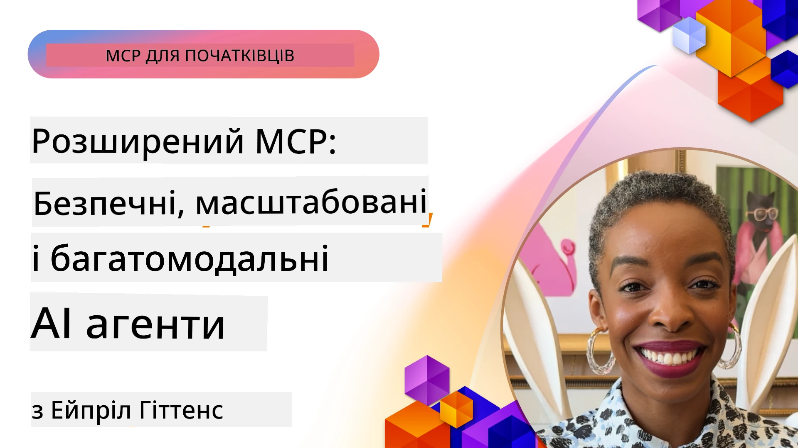

# Поглиблені теми в MCP

_(Натисніть на зображення вище, щоб переглянути відео цього уроку)_

Цей розділ охоплює низку поглиблених тем у реалізації протоколу контексту моделі (MCP), включаючи мультимодальну інтеграцію, масштабованість, найкращі практики безпеки та інтеграцію для підприємств. Ці теми є ключовими для створення надійних та готових до виробництва MCP-додатків, які можуть відповідати вимогам сучасних систем штучного інтелекту.

## Огляд

У цьому уроці досліджуються поглиблені концепції впровадження протоколу контексту моделі, зосереджуючись на мультимодальній інтеграції, масштабованості, найкращих практиках безпеки та інтеграції для підприємств. Ці теми є необхідними для створення MCP-додатків виробничого рівня, які можуть впоратися з комплексними вимогами в корпоративних середовищах.

## Навчальні цілі

До кінця цього уроку ви зможете:

- Реалізувати мультимодальні можливості всередині MCP-фреймворків
- Проєктувати масштабовані архітектури MCP для сценаріїв з високим навантаженням
- Застосовувати найкращі практики безпеки, які відповідають принципам безпеки MCP
- Інтегрувати MCP з корпоративними AI-системами та фреймворками
- Оптимізувати продуктивність і надійність у виробничих середовищах

## Уроки та демонстраційні проєкти

| Посилання | Назва | Опис |
|------|-------|-------------|
| [5.1 Integration with Azure](./mcp-integration/README.md) | Інтеграція з Azure | Дізнайтеся, як інтегрувати ваш MCP сервер на Azure |
| [5.2 Multi modal sample](./mcp-multi-modality/README.md) | Мультимодальні зразки MCP  | Зразки для аудіо, зображень та мультимодальних відповідей |
| [5.3 MCP OAuth2 sample](../../../05-AdvancedTopics/mcp-oauth2-demo) | Демонстрація MCP OAuth2 | Мінімальний Spring Boot додаток, який показує OAuth2 з MCP, як сервер авторизації та ресурсів. Демонструє безпечну видачу токенів, захищені кінцеві точки, розгортання на Azure Container Apps та інтеграцію з API Management. |
| [5.4 Root Contexts](./mcp-root-contexts/README.md) | Кореневі контексти  | Дізнайтеся більше про кореневий контекст і як його реалізувати |
| [5.5 Routing](./mcp-routing/README.md) | Маршрутизація | Ознайомтеся з різними типами маршрутизації |
| [5.6 Sampling](./mcp-sampling/README.md) | Відбір | Дізнайтеся, як працювати з вибірками |
| [5.7 Scaling](./mcp-scaling/README.md) | Масштабування  | Дізнайтеся про масштабування |
| [5.8 Security](./mcp-security/README.md) | Безпека  | Захистіть ваш MCP сервер |
| [5.9 Web Search sample](./web-search-mcp/README.md) | Веб-пошук MCP | Сервер і клієнт MCP на Python з інтеграцією SerpAPI для пошуку в реальному часі в вебі, новинах, продуктах і Q&A. Демонструє оркестрацію з кількома інструментами, інтеграцію зовнішніх API та надійну обробку помилок. |
| [5.10 Realtime Streaming](./mcp-realtimestreaming/README.md) | Потокова передача  | Потокова передача даних у реальному часі стала необхідністю у сучасному світі, де бізнеси та додатки потребують миттєвого доступу до інформації для прийняття своєчасних рішень.|
| [5.11 Realtime Web Search](./mcp-realtimesearch/README.md) | Веб-пошук | Пошук у вебі в реальному часі: як MCP трансформує реальний час веб-пошуку, забезпечуючи стандартизований підхід до управління контекстом між AI-моделями, пошуковими системами та додатками.| 
| [5.12  Entra ID Authentication for Model Context Protocol Servers](./mcp-security-entra/README.md) | Аутентифікація Entra ID | Microsoft Entra ID забезпечує надійне хмарне рішення з управління ідентичністю та доступом, допомагаючи гарантувати, що лише авторизовані користувачі та додатки можуть взаємодіяти з вашим MCP сервером.|
| [5.13 Azure AI Foundry Agent Integration](./mcp-foundry-agent-integration/README.md) | Інтеграція Azure AI Foundry | Дізнайтеся, як інтегрувати MCP сервери з агентами Azure AI Foundry, що дозволяє потужну оркестрацію інструментів і корпоративні AI-можливості з використанням стандартизованих зовнішніх підключень джерел даних.|
| [5.14 Context Engineering](./mcp-contextengineering/README.md) | Інженерія контексту | Майбутні можливості технік інженерії контексту для MCP серверів, включаючи оптимізацію контексту, динамічне керування контекстом та стратегії ефективного інжинірингу підказок у рамках MCP.|
| [5.15 MCP Custom Transport](./mcp-transport/README.md) | Користувацький транспорт | Дізнайтеся, як реалізувати користувацькі транспортні механізми для спеціалізованих сценаріїв комунікації MCP.|
| [5.16 Protocol Features Deep Dive](./mcp-protocol-features/README.md) | Особливості протоколу | Опановуйте поглиблені функції протоколу, включаючи повідомлення про прогрес, скасування запитів, шаблони ресурсів і шаблони обробки помилок.|

> **Новинки в MCP Specification 2025-11-25**: Специфікація тепер включає експериментальну підтримку **Задач (Tasks)** (довготривалі операції з відстеженням прогресу), **Анотацій інструментів (Tool Annotations)** (метадані про поведінку інструментів для безпеки), **URL Mode Elicitation** (запит конкретного URL-контенту від клієнтів) та розширені **Корені (Roots)** (для керування контекстом робочого простору). Деталі дивіться в [журналі змін MCP Specification](https://spec.modelcontextprotocol.io/).

## Додаткові посилання

Для найактуальнішої інформації про поглиблені теми MCP звертайтеся до:
- [Документація MCP](https://modelcontextprotocol.io/)
- [Специфікація MCP (2025-11-25)](https://spec.modelcontextprotocol.io/specification/2025-11-25/)
- [Репозиторій GitHub](https://github.com/modelcontextprotocol)
- [OWASP MCP Top 10](https://microsoft.github.io/mcp-azure-security-guide/mcp/) - Ризики безпеки та шляхи пом’якшення
- [MCP Security Summit Workshop (Sherpa)](https://azure-samples.github.io/sherpa/) - Практичне навчання з безпеки

## Ключові висновки

- Мультимодальні реалізації MCP розширюють можливості ШІ поза межі обробки тексту
- Масштабованість є необхідною для корпоративних розгортань і може бути забезпечена горизонтальним і вертикальним масштабуванням
- Комплексні заходи безпеки захищають дані і забезпечують належний контроль доступу
- Інтеграція з корпоративними платформами, такими як Azure OpenAI та Microsoft AI Foundry, розширює можливості MCP
- Поглиблені реалізації MCP виграють від оптимізованих архітектур і ретельного управління ресурсами

## Вправи

Спроєктуйте реалізацію MCP корпоративного рівня для конкретного сценарію використання:

1. Визначте мультимодальні вимоги для вашого випадку використання
2. Окресліть необхідні заходи безпеки для захисту чутливих даних
3. Розробіть масштабовану архітектуру, яка може впоратися з різним навантаженням
4. Сплануйте точки інтеграції з корпоративними AI-системами
5. Документуйте потенційні вузькі місця продуктивності та стратегії їх подолання

## Додаткові ресурси

- [Документація Azure OpenAI](https://learn.microsoft.com/en-us/azure/ai-services/openai/)
- [Документація Microsoft AI Foundry](https://learn.microsoft.com/en-us/ai-services/)

---

## Що далі

Огляньте уроки цього модуля, починаючи з: [5.1 MCP Integration](./mcp-integration/README.md)

Після завершення цього модуля продовжуйте до: [Модуль 6: Внески спільноти](../06-CommunityContributions/README.md)

---

<!-- CO-OP TRANSLATOR DISCLAIMER START -->
**Відмова від відповідальності**:  
Цей документ було перекладено за допомогою сервісу автоматичного перекладу [Co-op Translator](https://github.com/Azure/co-op-translator). Хоча ми прагнемо до точності, просимо враховувати, що автоматичні переклади можуть містити помилки або неточності. Оригінальний документ рідною мовою слід вважати авторитетним джерелом. Для критичної інформації рекомендується звертатися до професійного людського перекладача. Ми не несемо відповідальності за будь-які непорозуміння або неправильні тлумачення, що виникли внаслідок використання цього перекладу.
<!-- CO-OP TRANSLATOR DISCLAIMER END -->