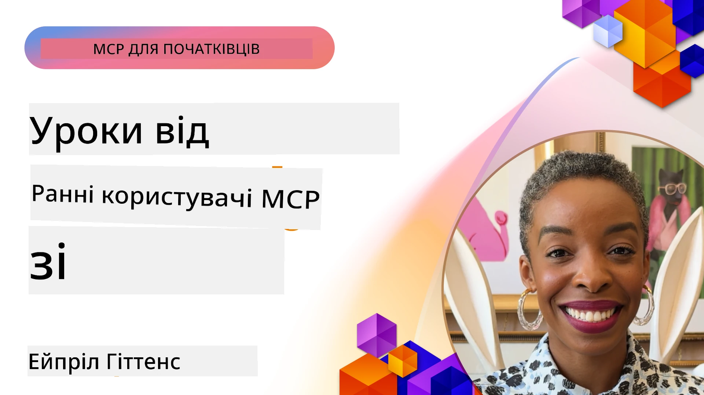

# 🌟 Уроки від ранніх користувачів

[](https://youtu.be/jds7dSmNptE)

_(Натисніть на зображення вище, щоб переглянути відео цього уроку)_

## 🎯 Що охоплює цей модуль

Цей модуль досліджує, як реальні організації та розробники використовують Model Context Protocol (MCP) для розв’язання реальних проблем і стимулювання інновацій. Через детальні кейс-стаді, практичні проєкти та приклади ви дізнаєтесь, як MCP забезпечує безпечну, масштабовану інтеграцію ШІ, що з’єднує мовні моделі, інструменти та корпоративні дані.

### 📚 Подивіться MCP у дії

Хочете побачити застосування цих принципів у продуктивних інструментах? Ознайомтеся з нашим [**10 Microsoft MCP Серверами, які трансформують продуктивність розробників**](microsoft-mcp-servers.md), де показано реальні Microsoft MCP сервери, які ви можете використовувати вже сьогодні.

## Огляд

Цей урок досліджує, як ранні користувачі застосували Model Context Protocol (MCP) для розв’язання реальних проблем та стимулювання інновацій у різних галузях. Через детальні кейс-стаді та практичні проєкти ви побачите, як MCP дозволяє стандартизовану, безпечну та масштабовану інтеграцію ШІ — об’єднуючи великі мовні моделі, інструменти та корпоративні дані в єдиній платформі. Ви отримаєте практичний досвід у проєктуванні й розробці рішень на основі MCP, навчитеся використовувати перевірені шаблони впровадження та дізнаєтесь найкращі методи впровадження MCP у виробничих середовищах. Урок також висвітлює нові тенденції, перспективи й ресурси з відкритим кодом, щоб допомогти вам залишатися на передовій технології MCP і її еволюційної екосистеми.

## Навчальні цілі

- Аналізувати реальні впровадження MCP у різних галузях
- Проєктувати та створювати повні додатки на базі MCP
- Досліджувати нові тенденції та майбутні напрямки в технології MCP
- Застосовувати найкращі практики в реальних сценаріях розробки

## Реальні впровадження MCP

### Кейc 1: Автоматизація корпоративної підтримки клієнтів

Міжнародна корпорація впровадила рішення на основі MCP для стандартизації взаємодії ШІ у їхніх службах підтримки клієнтів. Це дозволило їм:

- Створити уніфікований інтерфейс для декількох постачальників LLM
- Підтримувати послідовне управління запитами в різних відділах
- Запровадити надійні заходи безпеки та дотримання норм
- Легко перемикатися між різними ШІ моделями залежно від конкретних потреб

**Технічна реалізація:**

```python
# Реалізація сервера Python MCP для підтримки клієнтів
import logging
import asyncio
from modelcontextprotocol import create_server, ServerConfig
from modelcontextprotocol.server import MCPServer
from modelcontextprotocol.transports import create_http_transport
from modelcontextprotocol.resources import ResourceDefinition
from modelcontextprotocol.prompts import PromptDefinition
from modelcontextprotocol.tool import ToolDefinition

# Налаштування логування
logging.basicConfig(level=logging.INFO)

async def main():
    # Створення конфігурації сервера
    config = ServerConfig(
        name="Enterprise Customer Support Server",
        version="1.0.0",
        description="MCP server for handling customer support inquiries"
    )
    
    # Ініціалізація MCP сервера
    server = create_server(config)
    
    # Реєстрація ресурсів бази знань
    server.resources.register(
        ResourceDefinition(
            name="customer_kb",
            description="Customer knowledge base documentation"
        ),
        lambda params: get_customer_documentation(params)
    )
    
    # Реєстрація шаблонів підказок
    server.prompts.register(
        PromptDefinition(
            name="support_template",
            description="Templates for customer support responses"
        ),
        lambda params: get_support_templates(params)
    )
    
    # Реєстрація інструментів підтримки
    server.tools.register(
        ToolDefinition(
            name="ticketing",
            description="Create and update support tickets"
        ),
        handle_ticketing_operations
    )
    
    # Запуск сервера з HTTP транспортом
    transport = create_http_transport(port=8080)
    await server.run(transport)

if __name__ == "__main__":
    asyncio.run(main())
```
  
**Результати:** Зниження витрат на моделі на 30%, покращення послідовності відповідей на 45% та підвищення відповідності нормативам у глобальних операціях.

### Кейc 2: Медичний діагностичний асистент

Медична установа розробила інфраструктуру MCP для об’єднання кількох спеціалізованих медичних ШІ моделей, одночасно забезпечуючи захист чутливих пацієнтських даних:

- Безшовне перемикання між загальними та спеціалізованими медичними моделями
- Строгі контролі конфіденційності та аудиторські журнали
- Інтеграція з існуючими системами електронних медичних записів (EHR)
- Послідовне конструювання запитів із урахуванням медичної термінології

**Технічна реалізація:**

```csharp
// C# MCP host application implementation in healthcare application
using Microsoft.Extensions.DependencyInjection;
using ModelContextProtocol.SDK.Client;
using ModelContextProtocol.SDK.Security;
using ModelContextProtocol.SDK.Resources;

public class DiagnosticAssistant
{
    private readonly MCPHostClient _mcpClient;
    private readonly PatientContext _patientContext;
    
    public DiagnosticAssistant(PatientContext patientContext)
    {
        _patientContext = patientContext;
        
        // Configure MCP client with healthcare-specific settings
        var clientOptions = new ClientOptions
        {
            Name = "Healthcare Diagnostic Assistant",
            Version = "1.0.0",
            Security = new SecurityOptions
            {
                Encryption = EncryptionLevel.Medical,
                AuditEnabled = true
            }
        };
        
        _mcpClient = new MCPHostClientBuilder()
            .WithOptions(clientOptions)
            .WithTransport(new HttpTransport("https://healthcare-mcp.example.org"))
            .WithAuthentication(new HIPAACompliantAuthProvider())
            .Build();
    }
    
    public async Task<DiagnosticSuggestion> GetDiagnosticAssistance(
        string symptoms, string patientHistory)
    {
        // Create request with appropriate resources and tool access
        var resourceRequest = new ResourceRequest
        {
            Name = "patient_records",
            Parameters = new Dictionary<string, object>
            {
                ["patientId"] = _patientContext.PatientId,
                ["requestingProvider"] = _patientContext.ProviderId
            }
        };
        
        // Request diagnostic assistance using appropriate prompt
        var response = await _mcpClient.SendPromptRequestAsync(
            promptName: "diagnostic_assistance",
            parameters: new Dictionary<string, object>
            {
                ["symptoms"] = symptoms,
                patientHistory = patientHistory,
                relevantGuidelines = _patientContext.GetRelevantGuidelines()
            });
            
        return DiagnosticSuggestion.FromMCPResponse(response);
    }
}
```
  
**Результати:** Покращені діагностичні рекомендації для лікарів при дотриманні повної відповідності HIPAA та істотному скороченні перемикань контексту між системами.

### Кейc 3: Аналіз ризиків у фінансових послугах

Фінансова установа впровадила MCP для стандартизації процесів аналізу ризиків у різних відділах:

- Створено уніфікований інтерфейс для моделей кредитного ризику, виявлення шахрайства і інвестиційного ризику
- Запроваджено суворий контроль доступу та версіонування моделей
- Забезпечено можливість аудиту всіх рекомендацій ШІ
- Підтримано послідовний формат даних у різнорідних системах

**Технічна реалізація:**

```java
// Сервер Java MCP для оцінки фінансових ризиків
import org.mcp.server.*;
import org.mcp.security.*;

public class FinancialRiskMCPServer {
    public static void main(String[] args) {
        // Створити сервер MCP з функціями фінансової відповідності
        MCPServer server = new MCPServerBuilder()
            .withModelProviders(
                new ModelProvider("risk-assessment-primary", new AzureOpenAIProvider()),
                new ModelProvider("risk-assessment-audit", new LocalLlamaProvider())
            )
            .withPromptTemplateDirectory("./compliance/templates")
            .withAccessControls(new SOCCompliantAccessControl())
            .withDataEncryption(EncryptionStandard.FINANCIAL_GRADE)
            .withVersionControl(true)
            .withAuditLogging(new DatabaseAuditLogger())
            .build();
            
        server.addRequestValidator(new FinancialDataValidator());
        server.addResponseFilter(new PII_RedactionFilter());
        
        server.start(9000);
        
        System.out.println("Financial Risk MCP Server running on port 9000");
    }
}
```
  
**Результати:** Покращена відповідність регуляторним вимогам, на 40% швидший цикл розгортання моделей та покращена узгодженість оцінки ризиків між відділами.

### Кейc 4: Microsoft Playwright MCP Server для автоматизації браузера

Microsoft розробила [Playwright MCP сервер](https://github.com/microsoft/playwright-mcp) для безпечної, стандартизованої автоматизації браузера через Model Context Protocol. Цей готовий до виробництва сервер дозволяє агентам ШІ і LLM взаємодіяти з веб-браузерами у контрольований, аудиторський та розширюваний спосіб — дозволяючи використовувати такі сценарії, як автоматизоване тестування вебу, екстракція даних і комплексні робочі процеси.

> **🎯 Продукт, готовий до використання**
> 
> Цей кейс демонструє реальний MCP сервер, який ви можете використовувати сьогодні! Дізнайтеся більше про Playwright MCP Server і 9 інших готових до виробництва Microsoft MCP серверів у нашому [**Посібнику по Microsoft MCP серверах**](microsoft-mcp-servers.md#8--playwright-mcp-server).

**Ключові характеристики:**  
- Відкриває можливості автоматизації браузера (навігація, заповнення форм, знімки екрана тощо) як MCP інструменти  
- Забезпечує суворий контроль доступу та ізоляцію для запобігання несанкціонованих дій  
- Надає детальні аудиторські журнали для всіх взаємодій з браузером  
- Підтримує інтеграцію з Azure OpenAI та іншими постачальниками LLM для автоматизації через агентів  
- Живить GitHub Copilot Coding Agent можливостями веб-переглядача  

**Технічна реалізація:**

```typescript
// TypeScript: Реєстрація інструментів автоматизації браузера Playwright у сервері MCP
import { createServer, ToolDefinition } from 'modelcontextprotocol';
import { launch } from 'playwright';

const server = createServer({
  name: 'Playwright MCP Server',
  version: '1.0.0',
  description: 'MCP server for browser automation using Playwright'
});

// Зареєструвати інструмент для переходу за URL та зняття скріншота
server.tools.register(
  new ToolDefinition({
    name: 'navigate_and_screenshot',
    description: 'Navigate to a URL and capture a screenshot',
    parameters: {
      url: { type: 'string', description: 'The URL to visit' }
    }
  }),
  async ({ url }) => {
    const browser = await launch();
    const page = await browser.newPage();
    await page.goto(url);
    const screenshot = await page.screenshot();
    await browser.close();
    return { screenshot };
  }
);

// Запустити сервер MCP
server.listen(8080);
```
  
**Результати:**

- Забезпечила безпечну програмну автоматизацію браузера для агентів ШІ та LLM  
- Скоротила ручні тестові зусилля і покращила покриття тестування веб-застосунків  
- Надала повторно використовувану, розширювану платформу для інтеграції інструментів на базі браузера в корпоративних середовищах  
- Забезпечує можливості веб-переглядача для GitHub Copilot  

**Посилання:**

- [Playwright MCP Server GitHub Repository](https://github.com/microsoft/playwright-mcp)  
- [Microsoft AI and Automation Solutions](https://azure.microsoft.com/en-us/products/ai-services/)

### Кейc 5: Azure MCP – Платформа Model Context Protocol класу Enterprise

Azure MCP Server ([https://aka.ms/azmcp](https://aka.ms/azmcp)) — це кероване Microsoft корпоративне рішення Model Context Protocol, створене для масштабованого, безпечного та відповідного MCP серверу як хмарної служби. Azure MCP дозволяє організаціям швидко розгортати, керувати та інтегрувати MCP сервери з Azure AI, даними та службами безпеки, знижуючи операційні витрати і прискорюючи впровадження ШІ.

> **🎯 Продукт, готовий до використання**
> 
> Це реальний MCP сервер, який ви можете використовувати сьогодні! Дізнайтеся більше про Azure AI Foundry MCP Server у нашому [**Посібнику по Microsoft MCP серверах**](microsoft-mcp-servers.md).

- Повністю керований хостинг MCP серверу з вбудованим масштабуванням, моніторингом і безпекою  
- Рідна інтеграція з Azure OpenAI, Azure AI Search та іншими сервісами Azure  
- Корпоративна автентифікація і авторизація через Microsoft Entra ID  
- Підтримка користувацьких інструментів, шаблонів запитів і ресурсних конекторів  
- Відповідність корпоративним стандартам безпеки та нормативним вимогам  

**Технічна реалізація:**

```yaml
# Example: Azure MCP server deployment configuration (YAML)
apiVersion: mcp.microsoft.com/v1
kind: McpServer
metadata:
  name: enterprise-mcp-server
spec:
  modelProviders:
    - name: azure-openai
      type: AzureOpenAI
      endpoint: https://<your-openai-resource>.openai.azure.com/
      apiKeySecret: <your-azure-keyvault-secret>
  tools:
    - name: document_search
      type: AzureAISearch
      endpoint: https://<your-search-resource>.search.windows.net/
      apiKeySecret: <your-azure-keyvault-secret>
  authentication:
    type: EntraID
    tenantId: <your-tenant-id>
  monitoring:
    enabled: true
    logAnalyticsWorkspace: <your-log-analytics-id>
```
  
**Результати:**  
- Скорочення часу до отримання результату для корпоративних проєктів ШІ завдяки готовій для використання, відповідній платформі MCP серверу  
- Спрощена інтеграція LLM, інструментів та корпоративних джерел даних  
- Покращена безпека, спостережливість та операційна ефективність робочих навантажень MCP  
- Покращена якість коду завдяки найкращим практикам Azure SDK та сучасним схемам автентифікації  

**Посилання:**  
- [Azure MCP Documentation](https://aka.ms/azmcp)  
- [Azure MCP Server GitHub Repository](https://github.com/Azure/azure-mcp)  
- [Azure AI Services](https://azure.microsoft.com/en-us/products/ai-services/)  
- [Microsoft MCP Center](https://mcp.azure.com)

## Кейc 6: NLWeb  
MCP (Model Context Protocol) — це новий протокол для взаємодії чатботів і AI-асистентів з інструментами. Кожен екземпляр NLWeb також є MCP сервером, який підтримує один основний метод — ask, призначений для запитання вебсайту на природній мові. Отримана відповідь використовує schema.org — широко застосовувану словникову базу для опису веб-даних. У спрощеному вигляді MCP — це NLWeb так само, як Http є для HTML. NLWeb поєднує протоколи, формати Schema.org і зразковий код, щоб допомогти сайтам швидко створювати ці кінцеві точки, що приносять користь як людям через розмовні інтерфейси, так і машинам через природну взаємодію агент-агент.  

NLWeb складається з двох різних компонентів:  
- Протокол, дуже простий для початку: взаємодія з сайтом природною мовою та формат, що базується на JSON і schema.org для отриманих відповідей. Документація по REST API містить більше деталей.  
- Проста реалізація (1), яка використовує існуючу розмітку для сайтів, які можна абстрагувати як списки об’єктів (продукти, рецепти, атракції, огляди тощо). У поєднанні з набором віджетів користувацького інтерфейсу сайти можуть легко надавати розмовні інтерфейси до свого контенту. Документація про Life of a chat query дає більше деталей про роботу цього механізму.  

**Посилання:**  
- [Azure MCP Documentation](https://aka.ms/azmcp)  
- [NLWeb](https://github.com/microsoft/NlWeb)

### Кейc 7: Azure AI Foundry MCP Server – інтеграція корпоративних AI агентів

Azure AI Foundry MCP сервери демонструють, як MCP може використовуватися для оркестрації та управління AI агентами і робочими процесами в корпоративних середовищах. Інтегруючи MCP із Azure AI Foundry, організації можуть стандартизувати взаємодію агентів, використовувати управління робочими процесами Foundry і забезпечувати безпечне, масштабоване розгортання.

> **🎯 Продукт, готовий до використання**
> 
> Це реальний MCP сервер, який ви можете використовувати сьогодні! Дізнайтеся більше про Azure AI Foundry MCP Server у нашому [**Посібнику по Microsoft MCP серверах**](microsoft-mcp-servers.md#9--azure-ai-foundry-mcp-server).

**Ключові характеристики:**  
- Повний доступ до екосистеми Azure AI, включаючи каталоги моделей і управління розгортаннями  
- Індексація знань за допомогою Azure AI Search для додатків RAG  
- Інструменти оцінки продуктивності ШІ моделей і контролю якості  
- Інтеграція з Azure AI Foundry Catalog та Labs для роботи з передовими науково-дослідними моделями  
- Можливості управління агентами і їхньої оцінки для виробничих сценаріїв  

**Результати:**  
- Швидке прототипування та надійний моніторинг робочих процесів AI агентів  
- Безшовна інтеграція з сервісами Azure AI для складних сценаріїв  
- Уніфікований інтерфейс для побудови, розгортання та моніторингу конвеєрів агентів  
- Покращена безпека, відповідність вимогам та операційна ефективність для підприємств  
- Прискорене впровадження ШІ при збереженні контролю над складними процесами з агентами  

**Посилання:**  
- [Azure AI Foundry MCP Server GitHub Repository](https://github.com/azure-ai-foundry/mcp-foundry)  
- [Інтеграція Azure AI агентів з MCP (блог Microsoft Foundry)](https://devblogs.microsoft.com/foundry/integrating-azure-ai-agents-mcp/)

### Кейc 8: Foundry MCP Playground – експерименти та прототипування

Foundry MCP Playground пропонує готове для використання середовище для експериментів із MCP серверами та інтеграціями Azure AI Foundry. Розробники можуть швидко створювати прототипи, тестувати та оцінювати ШІ моделі і робочі процеси агентів, використовуючи ресурси з Azure AI Foundry Catalog і Labs. Плейграунд спрощує налаштування, надає зразкові проєкти і підтримує спільну розробку, що полегшує вивчення найкращих практик та нових сценаріїв з мінімальними накладними витратами. Особливо корисний для команд, які хочуть швидко перевірити ідеї, ділитися експериментами та прискорити навчання без потреби у складній інфраструктурі. Завдяки зниженню бар’єрів входу плейграунд сприяє інноваціям і внескам спільноти у екосистему MCP і Azure AI Foundry.

**Посилання:**

- [Foundry MCP Playground GitHub Repository](https://github.com/azure-ai-foundry/foundry-mcp-playground)

### Кейc 9: Microsoft Learn Docs MCP Server – AI-підсилений доступ до документації

Microsoft Learn Docs MCP Server — це хмарний сервіс, який надає AI асистентам доступ у реальному часі до офіційної документації Microsoft через Model Context Protocol. Цей готовий до використання сервер підключається до комплексної екосистеми Microsoft Learn та забезпечує семантичний пошук по всіх офіційних джерелах Microsoft.

> **🎯 Продукт, готовий до використання**
> 
> Це реальний MCP сервер, який ви можете використовувати сьогодні! Дізнайтеся більше про Microsoft Learn Docs MCP Server у нашому [**Посібнику по Microsoft MCP серверах**](microsoft-mcp-servers.md#1--microsoft-learn-docs-mcp-server).

**Ключові характеристики:**  
- Доступ у реальному часі до офіційної документації Microsoft, документації Azure і Microsoft 365  
- Розширені можливості семантичного пошуку, що розуміють контекст і наміри  
- Завжди актуальна інформація, оскільки контент Microsoft Learn публікується регулярно  
- Комплексне охоплення Microsoft Learn, документації Azure і джерел Microsoft 365  
- Повертає до 10 якісних блоків контенту з назвами статей і URL  

**Чому це важливо:**  
- Вирішує проблему «застарілих знань AI» для технологій Microsoft  
- Забезпечує AI асистентів актуальною інформацією про .NET, C#, Azure та Microsoft 365  
- Надає авторитетну інформацію з першоджерел для коректної генерації коду  
- Незамінний для розробників, які працюють з швидко розвиваючимися технологіями Microsoft  

**Результати:**  
- Значно покращена точність AI-генерованого коду для технологій Microsoft  
- Зменшено час на пошук актуальної документації та кращих практик  
- Підвищена продуктивність розробників завдяки контекстно-залежному отриманню інформації  
- Безшовна інтеграція в робочі процеси розробки без виходу з IDE  

**Посилання:**  
- [Microsoft Learn Docs MCP Server GitHub Repository](https://github.com/MicrosoftDocs/mcp)  
- [Microsoft Learn Documentation](https://learn.microsoft.com/)

## Практичні проєкти

### Проєкт 1: Створення мульти-постачальницького MCP сервера

**Мета:** Створити MCP сервер, який може спрямовувати запити до кількох постачальників моделей ШІ на основі конкретних критеріїв.

**Вимоги:**

- Підтримувати щонайменше трьох різних постачальників моделей (наприклад, OpenAI, Anthropic, локальні моделі)  
- Реалізувати механізм маршрутизації на основі метаданих запиту  
- Створити систему конфігурації для управління обліковими даними постачальників  
- Додати кешування для оптимізації продуктивності та витрат  
- Побудувати просту панель керування для моніторингу використання  

**Кроки реалізації:**

1. Налаштувати базову інфраструктуру MCP сервера  
2. Реалізувати адаптери постачальників для кожного сервісу моделей ШІ  
3. Створити логіку маршрутизації на основі атрибутів запиту  
4. Додати механізми кешування для часто повторюваних запитів  
5. Розробити панель моніторингу  
6. Провести тестування з різними шаблонами запитів  

**Технології:** Оберіть Python (.NET/Java/Python на ваш вибір), Redis для кешування та простий веб-фреймворк для панелі моніторингу.

### Проєкт 2: Система управління підказками для підприємств
**Мета:** Розробити систему на основі MCP для управління, версіювання та розгортання шаблонів запитів у межах організації.

**Вимоги:**

- Створити централізоване сховище для шаблонів запитів
- Впровадити систему версіювання та процеси затвердження
- Розробити можливості тестування шаблонів із зразками вхідних даних
- Запровадити контроль доступу на основі ролей
- Створити API для отримання та розгортання шаблонів

**Кроки реалізації:**

1. Спроєктувати схему бази даних для зберігання шаблонів
2. Створити основний API для операцій CRUD із шаблонами
3. Впровадити систему версіювання
4. Розробити процес затвердження
5. Розробити тестову платформу
6. Створити простий веб-інтерфейс для керування
7. Інтегрувати з MCP сервером

**Технології:** Ваш вибір бекенд-фреймворку, SQL або NoSQL бази даних, а також фронтенд-фреймворк для інтерфейсу керування.

### Проєкт 3: Платформа генерації контенту на основі MCP

**Мета:** Побудувати платформу генерації контенту, яка використовує MCP для забезпечення послідовних результатів для різних типів контенту.

**Вимоги:**

- Підтримка кількох форматів контенту (блог-пости, соціальні мережі, маркетингові тексти)
- Впровадження генерації на основі шаблонів з можливістю налаштування
- Створення системи перегляду контенту та зворотного зв’язку
- Відстеження показників ефективності контенту
- Підтримка версіонування та ітерацій контенту

**Кроки реалізації:**

1. Налаштувати інфраструктуру клієнта MCP
2. Створити шаблони для різних типів контенту
3. Побудувати конвеєр генерації контенту
4. Впровадити систему перегляду
5. Розробити систему відстеження показників
6. Створити користувацький інтерфейс для керування шаблонами та генерації контенту

**Технології:** Ваша улюблена мова програмування, веб-фреймворк та система баз даних.

## Майбутні напрями розвитку технології MCP

### Тенденції, що з'являються

1. **Багатомодальний MCP**
   - Розширення MCP для стандартизації взаємодії з моделями зображень, аудіо та відео
   - Розробка здатностей крос-модального розуміння
   - Стандартизовані формати запитів для різних модальностей

2. **Федеративна інфраструктура MCP**
   - Розподілені мережі MCP, які можуть спільно використовувати ресурси між організаціями
   - Стандартизовані протоколи для безпечного обміну моделями
   - Техніки обчислень із захистом приватності

3. **Маркетплейси MCP**
   - Екосистеми для спільного використання та монетизації шаблонів MCP і плагінів
   - Процеси забезпечення якості та сертифікації
   - Інтеграція з маркетплейсами моделей

4. **MCP для периферійних обчислень (edge computing)**
   - Адаптація стандартів MCP для пристроїв із обмеженими ресурсами на периферії мережі
   - Оптимізовані протоколи для середовищ із низькою пропускною здатністю
   - Спеціалізовані реалізації MCP для IoT-екосистем

5. **Регуляторні рамки**
   - Розробка розширень MCP для відповідності регуляторним вимогам
   - Стандартизовані відстеження аудиту та інтерфейси пояснюваності
   - Інтеграція з новими рамками управління AI

### MCP рішення від Microsoft

Microsoft та Azure розробили кілька репозиторіїв з відкритим кодом для допомоги розробникам у реалізації MCP у різних сценаріях:

#### Організація Microsoft

1. [playwright-mcp](https://github.com/microsoft/playwright-mcp) - MCP сервер Playwright для автоматизації і тестування браузера
2. [files-mcp-server](https://github.com/microsoft/files-mcp-server) - Реалізація MCP сервера OneDrive для локального тестування та внеску спільноти
3. [NLWeb](https://github.com/microsoft/NlWeb) - NLWeb — це збірка відкритих протоколів і пов’язаних інструментів з відкритим кодом. Основна мета — створити базовий шар для AI Web

#### Організація Azure-Samples

1. [mcp](https://github.com/Azure-Samples/mcp) - Посилання на приклади, інструменти та ресурси для побудови та інтеграції MCP серверів на Azure з підтримкою кількох мов
2. [mcp-auth-servers](https://github.com/Azure-Samples/mcp-auth-servers) - Орієнтовні MCP сервери з демонстрацією автентифікації відповідно до поточної специфікації Model Context Protocol
3. [remote-mcp-functions](https://github.com/Azure-Samples/remote-mcp-functions) - Лендінг для реалізацій Remote MCP серверів в Azure Functions з посиланнями на репозиторії мовних специфіки
4. [remote-mcp-functions-python](https://github.com/Azure-Samples/remote-mcp-functions-python) - Шаблон швидкого старту для створення та розгортання кастомних віддалених MCP серверів на базі Azure Functions з Python
5. [remote-mcp-functions-dotnet](https://github.com/Azure-Samples/remote-mcp-functions-dotnet) - Шаблон швидкого старту для створення та розгортання кастомних віддалених MCP серверів на базі Azure Functions з .NET/C#
6. [remote-mcp-functions-typescript](https://github.com/Azure-Samples/remote-mcp-functions-typescript) - Шаблон швидкого старту для створення та розгортання кастомних віддалених MCP серверів на базі Azure Functions з TypeScript
7. [remote-mcp-apim-functions-python](https://github.com/Azure-Samples/remote-mcp-apim-functions-python) - Azure API Management як AI Gateway для Remote MCP серверів з Python
8. [AI-Gateway](https://github.com/Azure-Samples/AI-Gateway) - Експерименти APIM ❤️ AI з MCP можливостями, інтеграція з Azure OpenAI та AI Foundry

Ці репозиторії надають різні реалізації, шаблони та ресурси для роботи з Model Context Protocol на різних мовах програмування та сервісах Azure. Вони охоплюють широкий спектр випадків використання - від базових серверних реалізацій до автентифікації, розгортання в хмарі та корпоративної інтеграції.

#### Каталог ресурсів MCP

[Каталог ресурсів MCP](https://github.com/microsoft/mcp/tree/main/Resources) в офіційному репозиторії Microsoft MCP містить кураторську колекцію прикладів ресурсів, шаблонів запитів і описів інструментів для роботи з MCP серверами. Цей каталог створений, щоб допомогти розробникам швидко почати роботу з MCP, пропонуючи повторно використовувані складові та найкращі практики для:

- **Шаблони запитів:** Готові до використання шаблони для розповсюджених завдань і сценаріїв AI, які можна адаптувати під власні реалізації MCP серверів.
- **Опис інструментів:** Прикладні схеми інструментів і метадані для стандартизації інтеграції та виклику інструментів у різних MCP серверах.
- **Приклади ресурсів:** Приклади визначень ресурсів для підключення до джерел даних, API та зовнішніх сервісів у рамках MCP.
- **Референсні реалізації:** Практичні приклади, які показують, як структурувати та організувати ресурси, запити та інструменти у реальних MCP проєктах.

Ці ресурси пришвидшують розробку, сприяють стандартизації та допомагають забезпечити найкращі практики під час побудови та розгортання рішень на основі MCP.

#### Каталог ресурсів MCP

- [Ресурси MCP (Приклади шаблонів, інструментів і визначень ресурсів)](https://github.com/microsoft/mcp/tree/main/Resources)

### Можливості для досліджень

- Ефективні методи оптимізації запитів у рамках MCP
- Моделі безпеки для багатокористувацьких розгортань MCP
- Бенчмаркінг продуктивності різних реалізацій MCP
- Методи формальної верифікації MCP серверів

## Висновок

Model Context Protocol (MCP) швидко формує майбутнє стандартизованої, безпечної та сумісної інтеграції AI у різних галузях. Через кейс-стаді та практичні проєкти у цьому уроці ви побачили, як ранні користувачі — включно з Microsoft та Azure — використовують MCP для вирішення реальних задач, прискорення впровадження AI, а також забезпечення відповідності, безпеки та масштабованості. Модульний підхід MCP дозволяє організаціям об’єднувати великі мовні моделі, інструменти та корпоративні дані у єдину, аудитуємому систему. У міру розвитку MCP важливо залишатися в дослідженні спільноти, використовувати відкриті ресурси і застосовувати кращі практики для створення надійних AI-рішень, готових до майбутнього.

## Додаткові ресурси

- [Репозиторій MCP Foundry GitHub](https://github.com/azure-ai-foundry/mcp-foundry)
- [Foundry MCP Playground](https://github.com/azure-ai-foundry/foundry-mcp-playground)
- [Інтеграція агентів Azure AI з MCP (блог Microsoft Foundry)](https://devblogs.microsoft.com/foundry/integrating-azure-ai-agents-mcp/)
- [MCP репозиторій GitHub (Microsoft)](https://github.com/microsoft/mcp)
- [Каталог ресурсів MCP (Приклади шаблонів, інструментів і визначень ресурсів)](https://github.com/microsoft/mcp/tree/main/Resources)
- [Спільнота MCP та документація](https://modelcontextprotocol.io/introduction)
- [Специфікація MCP (2025-11-25)](https://spec.modelcontextprotocol.io/specification/2025-11-25/)
- [Документація Azure MCP](https://aka.ms/azmcp)
- [OWASP MCP Top 10](https://microsoft.github.io/mcp-azure-security-guide/mcp/) – найкращі практики безпеки
- [Playwright MCP Server репозиторій GitHub](https://github.com/microsoft/playwright-mcp)
- [Files MCP Server (OneDrive)](https://github.com/microsoft/files-mcp-server)
- [Azure-Samples MCP](https://github.com/Azure-Samples/mcp)
- [MCP Auth Servers (Azure-Samples)](https://github.com/Azure-Samples/mcp-auth-servers)
- [Remote MCP Functions (Azure-Samples)](https://github.com/Azure-Samples/remote-mcp-functions)
- [Remote MCP Functions Python (Azure-Samples)](https://github.com/Azure-Samples/remote-mcp-functions-python)
- [Remote MCP Functions .NET (Azure-Samples)](https://github.com/Azure-Samples/remote-mcp-functions-dotnet)
- [Remote MCP Functions TypeScript (Azure-Samples)](https://github.com/Azure-Samples/remote-mcp-functions-typescript)
- [Remote MCP APIM Functions Python (Azure-Samples)](https://github.com/Azure-Samples/remote-mcp-apim-functions-python)
- [AI-Gateway (Azure-Samples)](https://github.com/Azure-Samples/AI-Gateway)
- [Рішення Microsoft для AI та автоматизації](https://azure.microsoft.com/en-us/products/ai-services/)

## Вправи

1. Проаналізуйте одне з кейс-стаді та запропонуйте альтернативний підхід до реалізації.
2. Оберіть один із проєктних ідей та створіть детальну технічну специфікацію.
3. Вивчіть галузь, що не розглядалася у кейс-стаді, і окресліть, як MCP може вирішити її специфічні проблеми.
4. Ознайомтесь з одним із майбутніх напрямів та створіть концепцію нового розширення MCP для його підтримки.

## Що далі

Досліджуйте більше: [Microsoft MCP Servers](./microsoft-mcp-servers.md)

Продовжуйте до: [Модуль 8: Найкращі практики](../08-BestPractices/README.md)

---

<!-- CO-OP TRANSLATOR DISCLAIMER START -->
**Відмова від відповідальності**:
Цей документ було перекладено за допомогою сервісу автоматичного перекладу [Co-op Translator](https://github.com/Azure/co-op-translator). Хоча ми прагнемо до точності, будь ласка, майте на увазі, що автоматичний переклад може містити помилки або неточності. Оригінальний документ рідною мовою слід вважати авторитетним джерелом. Для важливої інформації рекомендується звертатися до професійного перекладача. Ми не несемо відповідальності за будь-які непорозуміння чи неправильні тлумачення, що виникли внаслідок використання цього перекладу.
<!-- CO-OP TRANSLATOR DISCLAIMER END -->