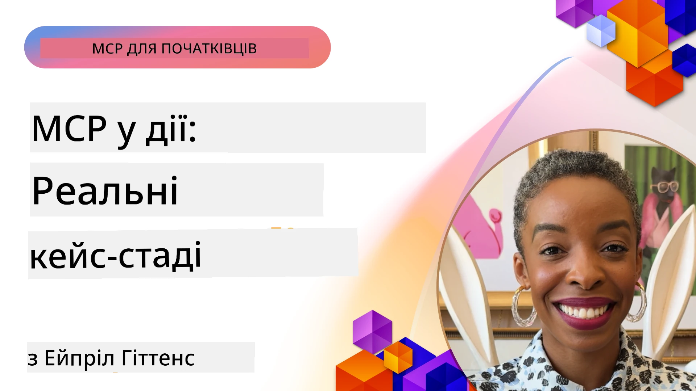

# MCP у дії: реальні кейс-стаді

_(Натисніть на зображення вище, щоб переглянути відео цього уроку)_

Протокол Model Context Protocol (MCP) змінює спосіб взаємодії AI-додатків із даними, інструментами та сервісами. У цьому розділі представлені реальні кейс-стаді, які демонструють практичне застосування MCP у різних корпоративних сценаріях.

## Огляд

Цей розділ показує конкретні приклади впровадження MCP, висвітлюючи, як організації використовують цей протокол для вирішення складних бізнес-завдань. Вивчаючи ці кейс-стаді, ви отримаєте уявлення про універсальність, масштабованість і практичні переваги MCP у реальних ситуаціях.

## Основні цілі навчання

Вивчаючи ці кейс-стаді, ви:

- Зрозумієте, як MCP може застосовуватися для вирішення конкретних бізнес-проблем
- Дізнаєтеся про різні схеми інтеграції та архітектурні підходи
- Ознайомитеся з найкращими практиками впровадження MCP у корпоративних середовищах
- Отримаєте знання про виклики та рішення, з якими зіткнулися під час реальних впроваджень
- Визначите можливості застосування подібних схем у власних проєктах

## Основні кейс-стаді

### 1. [Azure AI Travel Agents – еталонна реалізація](./travelagentsample.md)

Дане кейс-стаді розглядає комплексне еталонне рішення Microsoft, яке демонструє, як побудувати мультиагентський, AI-версований додаток для планування подорожей за допомогою MCP, Azure OpenAI і Azure AI Search. Проєкт демонструє:

- Оркестрацію мультиагентів через MCP
- Інтеграцію корпоративних даних із Azure AI Search
- Безпечну, масштабовану архітектуру з використанням сервісів Azure
- Розширювані інструменти з повторно використовуваними компонентами MCP
- Конверсійний користувацький досвід на базі Azure OpenAI

Архітектура і деталі реалізації надають цінні знання для побудови складних мультиагентських систем із MCP як координаційним шаром.

### 2. [Оновлення елементів Azure DevOps за даними YouTube](./UpdateADOItemsFromYT.md)

Цей кейс-стаді демонструє практичне застосування MCP для автоматизації робочих процесів. Він показує, як за допомогою MCP-інструментів можна:

- Отримувати дані з онлайн-платформ (YouTube)
- Оновлювати робочі елементи в системах Azure DevOps
- Створювати повторювані автоматизовані робочі процеси
- Інтегрувати дані з різних систем

Цей приклад ілюструє, як навіть відносно прості реалізації MCP можуть забезпечити значне підвищення ефективності за рахунок автоматизації рутинних завдань і поліпшення узгодженості даних між системами.

### 3. [Отримання документації в реальному часі з MCP](./docs-mcp/README.md)

Цей кейс-стаді проводить вас через процес підключення Python-консольного клієнта до сервера Model Context Protocol (MCP) для отримання та журналювання оновленої та контекстно-залежної документації Microsoft в реальному часі. Ви навчитеся:

- Підключатися до MCP-сервера за допомогою Python клієнта та офіційного SDK MCP
- Використовувати потокові HTTP-клієнти для ефективного отримання даних у реальному часі
- Викликати інструменти документації на сервері та записувати відповіді безпосередньо в консоль
- Інтегрувати актуальну документацію Microsoft у свій робочий процес без виходу з терміналу

Розділ включає практичне завдання, мінімальний робочий зразок коду та посилання на додаткові ресурси для поглибленого вивчення. Повний покроковий посібник і код дивіться у посиланні.

### 4. [Інтерактивний веб-додаток генератора навчального плану з MCP](./docs-mcp/README.md)

Цей кейс-стаді демонструє, як створити інтерактивний веб-застосунок за допомогою Chainlit і Model Context Protocol (MCP) для генерації персоналізованих навчальних планів з будь-якої теми. Користувачі можуть вказати тему (наприклад, "сертифікація AI-900") і тривалість навчання (наприклад, 8 тижнів), і додаток надасть покроковий розклад рекомендованого матеріалу на кожен тиждень. Chainlit забезпечує розмовний чат-інтерфейс, що робить взаємодію захопливою та адаптивною.

- Розмовний веб-додаток на базі Chainlit
- Керовані користувачем запити щодо теми та тривалості
- Рекомендації контенту по тижнях за допомогою MCP
- Адаптивні відповіді в чаті в режимі реального часу

Проєкт ілюструє, як можна поєднувати розмовний AI та MCP для створення динамічних, користувацьких освітніх інструментів у сучасному веб-середовищі.

### 5. [Документація у редакторі з MCP сервером у VS Code](./docs-mcp/README.md)

Цей кейс-стаді демонструє, як можна вбудувати Microsoft Learn Docs безпосередньо у ваше середовище VS Code за допомогою MCP-сервера — більше не потрібно перемикатися між вкладками браузера! Ви побачите, як:

- Миттєво шукати та читати документацію всередині VS Code через панель MCP або командну палітру
- Посилатися на документацію та вставляти посилання безпосередньо в README або markdown-файли курсів
- Використовувати GitHub Copilot та MCP разом для безперебійної AI-підтримки документації та коду
- Перевіряти та покращувати документацію за допомогою зворотного зв’язку в режимі реального часу та точності від Microsoft
- Інтегрувати MCP з робочими процесами GitHub для безперервної валідації документації

Вирішення включає:

- Приклад конфігурації `.vscode/mcp.json` для простого налаштування
- Скриншоти і покрокове керівництво по роботі у редакторі
- Поради щодо поєднання Copilot і MCP для максимальної продуктивності

Цей сценарій ідеально підходить для авторів курсів, технічних письменників і розробників, які хочуть залишатися сфокусованими у редакторі під час роботи з документацією, Copilot та інструментами перевірки — усе це на базі MCP.

### 6. [Створення MCP-сервера на базі APIM](./apimsample.md)

Цей кейс-стаді надає покроковий посібник зі створення MCP-сервера за допомогою Azure API Management (APIM). Розглядаються:

- Налаштування MCP-сервера в Azure API Management
- Впровадження API-операцій як інструментів MCP
- Конфігурація політик для обмеження частоти та безпеки
- Тестування MCP-сервера за допомогою Visual Studio Code і GitHub Copilot

Приклад ілюструє, як використати можливості Azure для створення надійного MCP-сервера, що може застосовуватись у різних додатках для поліпшення інтеграції AI-систем з корпоративними API.

### 7. [GitHub MCP Registry — прискорення агентної інтеграції](https://github.com/mcp)

Цей кейс-стаді розглядає, як GitHub MCP Registry, запущений у вересні 2025 року, вирішує критичну проблему у AI-екосистемі: фрагментований пошук та розгортання серверів Model Context Protocol (MCP).

#### Огляд
**MCP Registry** усуває проблему розкиданих MCP-серверів серед різних репозиторіїв і реєстрів, що раніше ускладнювало інтеграції і робило їх повільними та схильними до помилок. Ці сервери дають змогу AI-агентам взаємодіяти з зовнішніми системами, такими як API, бази даних і джерела документації.

#### Постановка проблеми
Розробники агентних робочих процесів стикаються з такими викликами:
- **Погана доступність** MCP-серверів на різних платформах
- **Повторювані запитання** в форумах та документації
- **Ризики безпеки** через неперевірені та недовірувані джерела
- **Відсутність стандартизації** якості та сумісності серверів

#### Архітектура рішення
GitHub MCP Registry централізує перевірені MCP-сервера з ключовими функціями:
- **Інтеграція одним кліком** у VS Code для швидкого налаштування
- **Сортування сигналу серед шуму** за зірками, активністю та підтвердженнями спільноти
- **Пряма інтеграція** з GitHub Copilot та іншими сумісними MCP-інструментами
- **Відкрита модель внесків** для спільноти та корпоративних партнерів

#### Вплив на бізнес
Реєстр забезпечив відчутні покращення:
- **Швидша адаптація** розробників завдяки інструменту Microsoft Learn MCP Server, який транслює офіційну документацію напряму агентам
- **Підвищення продуктивності** за допомогою спеціалізованих серверів, наприклад `github-mcp-server`, що забезпечують автоматизацію GitHub мовою натуральної мови (створення PR, повторні CI-запуски, сканування коду)
- **Посилення довіри екосистеми** через кураторовані списки та прозорі стандарти конфігурації

#### Стратегічна цінність
Для фахівців з управління життєвим циклом агентів та відтворюваних робочих процесів MCP Registry пропонує:
- **Модульне розгортання агентів** з стандартизованими компонентами
- **Пайплайни оцінки з підтримкою реєстру** для послідовного тестування і валідації
- **Міжінструментну сумісність** для безшовної інтеграції між різними AI-платформами

Цей кейс-стаді демонструє, що MCP Registry — це не просто довідник, а фундаментальна платформа для масштабованої інтеграції моделей і розгортання агентних систем у реальному світі.

## Висновок

Ці сім комплексних кейс-стаді демонструють видатну універсальність і практичне застосування Model Context Protocol у різноманітних реальних сценаріях. Від складних мультиагентських систем планування подорожей і корпоративного управління API до оптимізованих робочих процесів документації та революційного GitHub MCP Registry — ці приклади демонструють, як MCP забезпечує стандартизований, масштабований спосіб зв’язку AI-систем з інструментами, даними та сервісами, що дозволяють надавати виняткову цінність.

Кейс-стаді охоплюють різні аспекти впровадження MCP:
- **Корпоративна інтеграція**: Azure API Management і автоматизація Azure DevOps
- **Оркестрація мультиагентів**: планування подорожей з координацією AI-агентів
- **Продуктивність розробників**: інтеграція з VS Code та доступ до документації в реальному часі
- **Розвиток екосистеми**: GitHub MCP Registry як базова платформа
- **Освітні застосунки**: інтерактивні генератори навчальних планів і розмовні інтерфейси

Вивчаючи ці впровадження, ви отримуєте критичне розуміння:
- **Архітектурних патернів** для різних масштабів і сценаріїв використання
- **Стратегій реалізації**, що балансують функціональність і підтримуваність
- **Питань безпеки і масштабованості** для виробничого застосування
- **Найкращих практик** розробки MCP-серверів і інтеграції клієнтів
- **Концепції екосистемного мислення** для створення взаємопов’язаних AI-рішень

Ці приклади разом демонструють, що MCP — це не просто теоретична концепція, а зрілий, готовий до продуктивного використання протокол, який дозволяє реалізовувати практичні рішення для складних бізнес-завдань. Незалежно від того, чи створюєте ви прості автоматизовані інструменти, чи складні мультиагентські системи, патерни та підходи, які тут проілюстровані, забезпечують надійну основу для ваших MCP-проєктів.

## Додаткові ресурси

- [Репозиторій Azure AI Travel Agents на GitHub](https://github.com/Azure-Samples/azure-ai-travel-agents)
- [Інструмент Azure DevOps MCP](https://github.com/microsoft/azure-devops-mcp)
- [Інструмент Playwright MCP](https://github.com/microsoft/playwright-mcp)
- [MCP сервер Microsoft Docs](https://github.com/MicrosoftDocs/mcp)
- [GitHub MCP Registry — прискорення агентної інтеграції](https://github.com/mcp)
- [Приклади MCP спільноти](https://github.com/microsoft/mcp)

## Що далі

- Попередній: [Модуль 8: Найкращі практики](../08-BestPractices/README.md)
- Наступний: [Модуль 10: Оптимізація AI-робочих процесів: створення MCP-сервера з AI Toolkit](../10-StreamliningAIWorkflowsBuildingAnMCPServerWithAIToolkit/README.md)

---

<!-- CO-OP TRANSLATOR DISCLAIMER START -->
**Відмова від відповідальності**:  
Цей документ було перекладено за допомогою сервісу автоматичного перекладу [Co-op Translator](https://github.com/Azure/co-op-translator). Хоча ми прагнемо до точності, будь ласка, майте на увазі, що автоматичні переклади можуть містити помилки або неточності. Оригінальний документ рідною мовою слід вважати авторитетним джерелом. Для критичної інформації рекомендується звертатися до професійного людського перекладу. Ми не несемо відповідальності за будь-які непорозуміння чи неправильні тлумачення, що виникли внаслідок використання цього перекладу.
<!-- CO-OP TRANSLATOR DISCLAIMER END -->