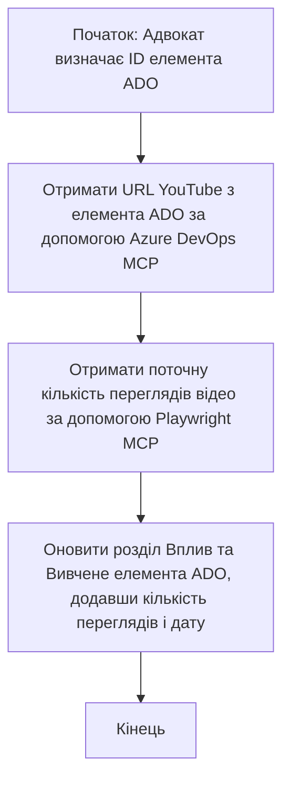

# Кейс: Оновлення елементів Azure DevOps за даними з YouTube за допомогою MCP

> **Відмова від відповідальності:** Існують готові онлайн-інструменти та звіти, які можуть автоматизувати процес оновлення елементів Azure DevOps даними з платформ, таких як YouTube. Наведений нижче сценарій подано виключно як приклад використання для ілюстрації того, як інструменти MCP можна застосувати для автоматизації та інтеграції.

## Огляд

Цей кейс демонструє один із прикладів того, як протокол Model Context Protocol (MCP) та його інструменти можуть бути використані для автоматизації оновлення робочих елементів Azure DevOps (ADO) інформацією з онлайн-платформ, таких як YouTube. Описаний сценарій є лише однією ілюстрацією ширших можливостей цих інструментів, які можна адаптувати для багатьох подібних завдань автоматизації.

У цьому прикладі адвокат відстежує онлайн-сесії за допомогою елементів ADO, де кожен елемент містить URL відео YouTube. Використовуючи інструменти MCP, адвокат може в автоматизований та повторюваний спосіб підтримувати актуальність елементів ADO, оновлюючи їх останніми метриками відео, такими як кількість переглядів. Цей підхід можна узагальнити для інших випадків, коли необхідно інтегрувати інформацію з онлайн-джерел у ADO або інші системи.

## Сценарій

Адвокат відповідає за відстеження впливу онлайн-сесій та взаємодії спільноти. Кожна сесія реєструється як робочий елемент ADO у проєкті 'DevRel', а робочий елемент містить поле для URL відео YouTube. Щоб точно відзвітувати охоплення сесії, адвокат має оновити елемент ADO поточною кількістю переглядів відео та датою отримання цієї інформації.

## Використані інструменти

- [Azure DevOps MCP](https://github.com/microsoft/azure-devops-mcp): Забезпечує програмний доступ та оновлення робочих елементів ADO через MCP.
- [Playwright MCP](https://github.com/microsoft/playwright-mcp): Автоматизує дії браузера для вилучення актуальних даних зі сторінок, наприклад статистики відео YouTube.

## Покроковий робочий процес

1. **Визначення елемента ADO**: Почніть з ідентифікатора робочого елемента ADO (наприклад, 1234) у проєкті 'DevRel'.
2. **Отримання URL YouTube**: Використовуйте інструмент Azure DevOps MCP, щоб отримати URL відео YouTube з робочого елемента.
3. **Вилучення кількості переглядів**: Використовуйте інструмент Playwright MCP, щоб перейти за URL YouTube та вилучити актуальне число переглядів.
4. **Оновлення елемента ADO**: Запишіть останню кількість переглядів і дату отримання у секцію «Вплив та уроки» робочого елемента ADO за допомогою інструменту Azure DevOps MCP.

## Приклад запиту

```bash
- Work with the ADO Item ID: 1234
- The project is '2025-Awesome'
- Get the YouTube URL for the ADO item
- Use Playwright to get the current views from the YouTube video
- Update the ADO item with the current video views and the updated date of the information
```

## Діаграма Mermaid


## Технічна реалізація

- **Оркестрація MCP**: Робочий процес керується MCP-сервером, який координує використання інструментів Azure DevOps MCP та Playwright MCP.
- **Автоматизація**: Процес може запускатися вручну або за розкладом для регулярного оновлення елементів ADO.
- **Розширюваність**: Описану схему можна розширити для оновлення елементів ADO іншими онлайн-метриками (наприклад, лайками, коментарями) або з інших платформ.

## Результати та вплив

- **Ефективність**: Зменшує ручні зусилля адвокатів завдяки автоматизації отримання та оновлення метрик відео.
- **Точність**: Забезпечує, щоб елементи ADO відображали найактуальніші дані з онлайн-джерел.
- **Повторюваність**: Надає багаторазовий робочий процес для подібних сценаріїв з іншими джерелами даних або метриками.

## Посилання

- [Azure DevOps MCP](https://github.com/microsoft/azure-devops-mcp)
- [Playwright MCP](https://github.com/microsoft/playwright-mcp)
- [Model Context Protocol (MCP)](https://modelcontextprotocol.io/)

## Що далі

- Повернутися до: [Огляд кейсів](./README.md)
- Далі: [Отримання документації в режимі реального часу з MCP](./docs-mcp/README.md)

---

<!-- CO-OP TRANSLATOR DISCLAIMER START -->
**Відмова від відповідальності**:
Цей документ було перекладено за допомогою сервісу автоматичного перекладу [Co-op Translator](https://github.com/Azure/co-op-translator). Хоча ми прагнемо до точності, зверніть увагу, що автоматичні переклади можуть містити помилки або неточності. Оригінальний документ рідною мовою слід вважати авторитетним джерелом. Для важливої інформації рекомендується звертатися до професійного людського перекладу. Ми не несемо відповідальності за будь-які непорозуміння або неправильне тлумачення, що виникли внаслідок використання цього перекладу.
<!-- CO-OP TRANSLATOR DISCLAIMER END -->