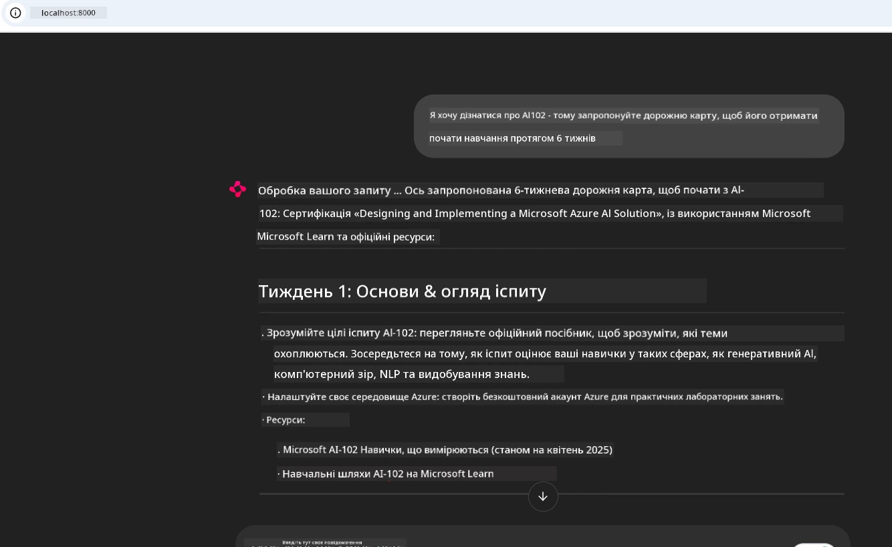
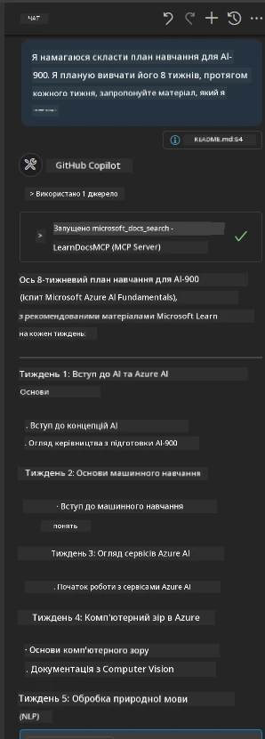

# Кейс-дослідження: Підключення до сервера Microsoft Learn Docs MCP з клієнта

Чи траплялося вам стикатися з тим, що доводиться перемикатися між сайтами документації, Stack Overflow та нескінченними вкладками пошукових систем, намагаючись розв’язати проблему у вашому коді? Можливо, у вас є другий монітор, призначений лише для документації, або ви постійно переключаєтеся між IDE та браузером. Хіба не було б краще, якби ви могли інтегрувати документацію безпосередньо у свій робочий процес — у ваші додатки, IDE або навіть власні інструменти? У цьому кейс-дослідженні ми розглянемо, як саме це зробити, підключившись безпосередньо до сервера Microsoft Learn Docs MCP зі свого клієнтського додатка.

## Огляд

Сучасна розробка — це більше, ніж просто написання коду. Це пошук потрібної інформації у потрібний час. Документація скрізь, але рідко там, де вона найбільше потрібна: всередині ваших інструментів і робочих процесів. Інтегруючи отримання документації безпосередньо у ваші додатки, ви можете зекономити час, зменшити кількість перемикань контексту й підвищити продуктивність. У цьому розділі ми покажемо, як підключити клієнта до сервера Microsoft Learn Docs MCP, щоб ви могли отримувати актуальну, контекстно-залежну документацію в реальному часі, не виходячи з вашого додатка.

Ми пройдемо весь процес: встановлення підключення, відправлення запиту та ефективну обробку потокових відповідей. Такий підхід не тільки спрощує ваш робочий процес, а й відкриває можливості для створення розумніших і корисніших інструментів для розробників.

## Цілі навчання

Навіщо це робити? Тому що найкращий досвід розробника — це той, який усуває тертя. Уявіть світ, де ваш редактор коду, чатбот або вебдодаток може миттєво відповідати на запитання щодо документації, використовуючи актуальний контент із Microsoft Learn. Наприкінці цієї глави ви дізнаєтесь, як:

- Розуміти основи комунікації сервера MCP з клієнтом для документації
- Реалізувати консольний або веб-додаток для підключення до сервера Microsoft Learn Docs MCP
- Використовувати стрімінгові HTTP-клієнти для отримання документації в реальному часі
- Логувати та інтерпретувати відповіді документації у вашому додатку

Ви побачите, як ці навички допоможуть створювати інструменти, які не просто реагують, а є справді інтерактивними та контекстно-орієнтованими.

## Сценарій 1 – Отримання документації в реальному часі за допомогою MCP

У цьому сценарії ми покажемо, як підключити клієнта до сервера Microsoft Learn Docs MCP, щоб ви могли отримувати контекстно-залежну документацію в реальному часі, не виходячи зі свого додатка. 

Перейдемо до практики. Ваше завдання — написати додаток, який підключається до сервера Microsoft Learn Docs MCP, викликає інструмент `microsoft_docs_search` і виводить потокову відповідь у консоль.

### Чому такий підхід?
Бо це основа для створення більш просунутих інтеграцій — чи то чатбот, розширення IDE, чи веб-панель.

Ви знайдете код і інструкції для цього сценарію у папці [`solution`](./solution/README.md) цього кейс-дослідження. Кроки проведуть вас через налаштування підключення:
- Використання офіційного SDK MCP та стрімінгового HTTP-клієнта для підключення
- Виклик інструменту `microsoft_docs_search` з параметром запиту для отримання документації
- Реалізація належного логування та обробки помилок
- Створення інтерактивного інтерфейсу консолі, який дозволяє користувачам вводити кілька пошукових запитів

Цей сценарій демонструє, як:
- Підключитися до сервера Docs MCP
- Надіслати запит
- Розпарсити та вивести результати

Ось як може виглядати запуск рішення:

```
Prompt> What is Azure Key Vault?
Answer> Azure Key Vault is a cloud service for securely storing and accessing secrets. ...
```

Нижче наведено мінімальний приклад рішення. Повний код і деталі доступні в папці рішення.

<details>
<summary>Python</summary>

```python
import asyncio
from mcp.client.streamable_http import streamablehttp_client
from mcp import ClientSession

async def main():
    async with streamablehttp_client("https://learn.microsoft.com/api/mcp") as (read_stream, write_stream, _):
        async with ClientSession(read_stream, write_stream) as session:
            await session.initialize()
            result = await session.call_tool("microsoft_docs_search", {"query": "Azure Functions best practices"})
            print(result.content)

if __name__ == "__main__":
    asyncio.run(main())
```

- Для повної реалізації та логування дивіться [`scenario1.py`](../../../../09-CaseStudy/docs-mcp/solution/python/scenario1.py).
- Для інструкцій з встановлення та використання дивіться файл [`README.md`](./solution/python/README.md) у тій самій папці.
</details>


## Сценарій 2 – Веб-додаток для інтерактивного генератора навчальних планів із MCP

У цьому сценарії ви навчитесь інтегрувати Docs MCP у веб-проєкт. Мета — надати користувачам можливість шукати документацію Microsoft Learn безпосередньо з веб-інтерфейсу, роблячи документацію миттєво доступною у вашому додатку чи сайті.

Ви дізнаєтесь, як:
- Налаштувати веб-додаток
- Підключитися до сервера Docs MCP
- Обробляти введення користувача та відображати результати

Ось як може виглядати запуск рішення:

```
User> I want to learn about AI102 - so suggest the roadmap to get it started from learn for 6 weeks

Assistant> Here’s a detailed 6-week roadmap to start your preparation for the AI-102: Designing and Implementing a Microsoft Azure AI Solution certification, using official Microsoft resources and focusing on exam skills areas:

---
## Week 1: Introduction & Fundamentals
- **Understand the Exam**: Review the [AI-102 exam skills outline](https://learn.microsoft.com/en-us/credentials/certifications/exams/ai-102/).
- **Set up Azure**: Sign up for a free Azure account if you don't have one.
- **Learning Path**: [Introduction to Azure AI services](https://learn.microsoft.com/en-us/training/modules/intro-to-azure-ai/)
- **Focus**: Get familiar with Azure portal, AI capabilities, and necessary tools.

....more weeks of the roadmap...

Let me know if you want module-specific recommendations or need more customized weekly tasks!
```

Нижче наведено мінімальний приклад рішення. Повний код і деталі доступні в папці рішення.



<details>
<summary>Python (Chainlit)</summary>

Chainlit — це фреймворк для створення веб-додатків з розмовним ШІ. Він полегшує створення інтерактивних чатботів і помічників, які можуть викликати інструменти MCP та відображати результати в реальному часі. Ідеально підходить для швидкого прототипування та дружніх інтерфейсів.

```python
import chainlit as cl
import requests

MCP_URL = "https://learn.microsoft.com/api/mcp"

@cl.on_message
def handle_message(message):
    query = {"question": message}
    response = requests.post(MCP_URL, json=query)
    if response.ok:
        result = response.json()
        cl.Message(content=result.get("answer", "No answer found.")).send()
    else:
        cl.Message(content="Error: " + response.text).send()
```

- Для повної реалізації дивіться [`scenario2.py`](../../../../09-CaseStudy/docs-mcp/solution/python/scenario2.py).
- Для інструкцій із налаштування та запуску дивіться [`README.md`](./solution/python/README.md).
</details>


## Сценарій 3: Документація в редакторі з MCP сервером у VS Code

Якщо ви хочете отримувати Microsoft Learn Docs безпосередньо у VS Code (а не перемикатися між вкладками браузера), ви можете використовувати сервер MCP у вашому редакторі. Це дозволяє:
- Шукати і читати документацію у VS Code, не виходячи з середовища кодування.
- Посилатися на документацію та вставляти посилання безпосередньо у README або файли курсів.
- Використовувати GitHub Copilot і MCP разом для безшовного робочого процесу з AI-підтримкою документації.

**Ви дізнаєтеся, як:**
- Додати дійсний файл `.vscode/mcp.json` у корінь вашої робочої папки (дивіться приклад нижче).
- Відкрити панель MCP або використовувати палітру команд у VS Code для пошуку та вставлення документації.
- Посилатися на документацію безпосередньо у ваших markdown-файлах під час роботи.
- Поєднати цей робочий процес із GitHub Copilot для ще більшої продуктивності.

Ось приклад налаштування сервера MCP у VS Code:

```json
{
  "servers": {
    "LearnDocsMCP": {
      "url": "https://learn.microsoft.com/api/mcp"
    }
  }
}
```

</details>

> Для детального покрокового керівництва з скріншотами дивіться [`README.md`](./solution/scenario3/README.md).



Цей підхід ідеально підходить для тих, хто створює технічні курси, пише документацію або розробляє код із частим зверненням до документації.

## Основні висновки

Інтегрувати документацію безпосередньо у ваші інструменти — це не просто зручність, це зміна правил гри для продуктивності. Підключившись до сервера Microsoft Learn Docs MCP зі свого клієнта, ви можете:

- Усунути необхідність перемикання між кодом і документацією
- Отримувати оновлену, контекстно-залежну документацію в режимі реального часу
- Створювати розумніші, більш інтерактивні інструменти для розробників

Ці навички допоможуть вам створити рішення, які не лише ефективні, а й приємні у використанні.

## Додаткові ресурси

Щоб поглибити свої знання, дослідіть ці офіційні ресурси:

- [Microsoft Learn Docs MCP Server (GitHub)](https://github.com/MicrosoftDocs/mcp)
- [Початок роботи з Azure MCP Server (mcp-python)](https://learn.microsoft.com/en-us/azure/developer/azure-mcp-server/get-started#create-the-python-app)
- [Що таке Azure MCP Server?](https://learn.microsoft.com/en-us/azure/developer/azure-mcp-server/)
- [Вступ до Model Context Protocol (MCP)](https://modelcontextprotocol.io/introduction)
- [Додавання плагінів з сервера MCP (Python)](https://learn.microsoft.com/en-us/semantic-kernel/concepts/plugins/adding-mcp-plugins)

## Що далі

- Назад до: [Огляд кейс-досліджень](../README.md)
- Продовжити до: [Модуль 10: Оптимізація AI-робочих процесів із AI Toolkit](../../10-StreamliningAIWorkflowsBuildingAnMCPServerWithAIToolkit/README.md)

---

<!-- CO-OP TRANSLATOR DISCLAIMER START -->
**Відмова від відповідальності**:
Цей документ було перекладено за допомогою автоматизованого перекладача [Co-op Translator](https://github.com/Azure/co-op-translator). Хоча ми прагнемо до точності, зверніть увагу, що автоматичні переклади можуть містити помилки або неточності. Оригінальний документ його рідною мовою слід вважати авторитетним джерелом. Для критично важливої інформації рекомендується скористатися професійним перекладом, виконаним людиною. Ми не несемо відповідальності за будь-які непорозуміння або неправильне тлумачення, що виникли внаслідок використання цього перекладу.
<!-- CO-OP TRANSLATOR DISCLAIMER END -->