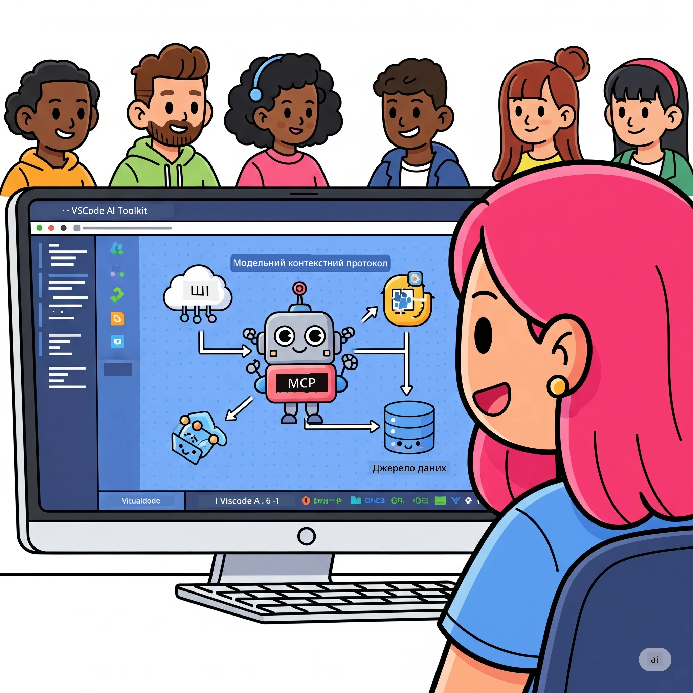
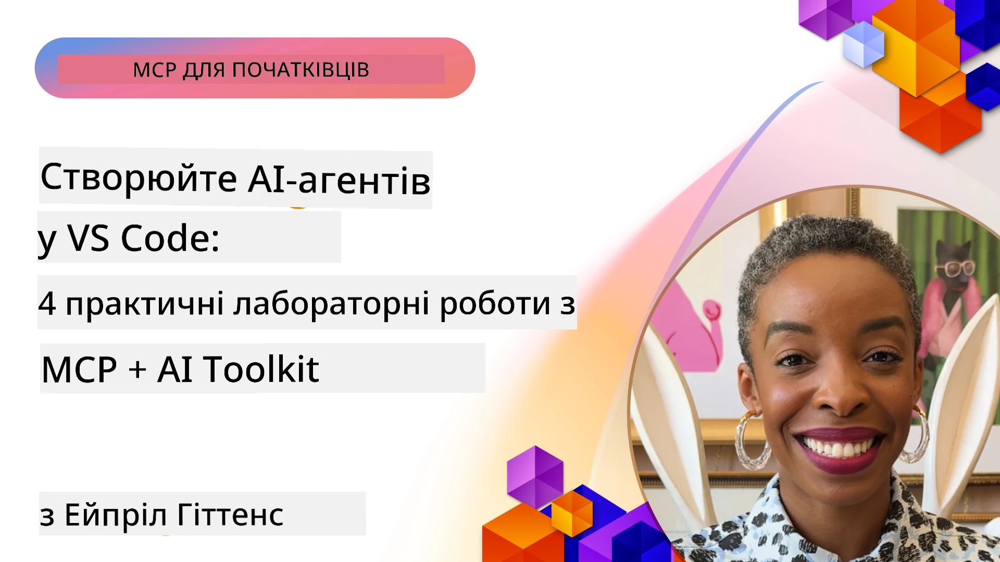

# Оптимізація AI робочих процесів: Створення MCP сервера з AI Toolkit

## 🎯 Огляд

_(Натисніть на зображення вище, щоб переглянути відео цього уроку)_

Ласкаво просимо на **Майстер-клас Model Context Protocol (MCP)**! Цей комплексний практичний семінар поєднує дві передові технології для революції у розробці AI-додатків:

- **🔗 Model Context Protocol (MCP)**: Відкритий стандарт для безшовної інтеграції AI-інструментів
- **🛠️ AI Toolkit для Visual Studio Code (AITK)**: Потужне AI-розширення від Microsoft

### 🎓 Чому ви навчитеся

Наприкінці цього майстер-класу ви опануєте мистецтво створення розумних додатків, які поєднують AI-моделі з реальними інструментами та сервісами. Від автоматизованого тестування до адаптованих API інтеграцій – ви отримаєте практичні навички для розв’язання складних бізнес-завдань.

## 🏗️ Технологічний стек

### 🔌 Model Context Protocol (MCP)

MCP — це **"USB-C для AI"** — універсальний стандарт, який з'єднує AI-моделі з зовнішніми інструментами та джерелами даних.

**✨ Основні характеристики:**

- 🔄 **Стандартизована інтеграція**: Універсальний інтерфейс для підключення AI-інструментів
- 🏛️ **Гнучка архітектура**: Локальні та віддалені сервери через stdio/SSE транспорт
- 🧰 **Багата екосистема**: Інструменти, підказки та ресурси в одному протоколі
- 🔒 **Готовність для підприємств**: Вбудована безпека та надійність

**🎯 Чому MCP важливий:**
Як USB-C усунув хаос з кабелями, так MCP ліквідує складність інтеграцій AI. Один протокол, безмежні можливості.

### 🤖 AI Toolkit для Visual Studio Code (AITK)

Провідне AI-розширення Microsoft, що перетворює VS Code на потужний AI-інструмент.

**🚀 Основні можливості:**

- 📦 **Каталог моделей**: Доступ до моделей з Azure AI, GitHub, Hugging Face, Ollama
- ⚡ **Локальний інференс**: ONNX-оптимізоване виконання на CPU/GPU/NPU
- 🏗️ **Agent Builder**: Візуальна розробка AI агентів з інтеграцією MCP
- 🎭 **Мультимодальність**: Підтримка тексту, зору та структурованого виводу

**💡 Переваги розробки:**

- Розгортання моделей без конфігурації
- Візуальна інженерія підказок
- Пісочниця для тестування в режимі реального часу
- Безшовна інтеграція MCP серверів

## 📚 Навчальний шлях

### [🚀 Модуль 1: Основи AI Toolkit](./lab1/README.md)

**Тривалість**: 15 хвилин

- 🛠️ Встановлення та налаштування AI Toolkit для VS Code
- 🗂️ Ознайомлення з Каталогом Моделей (100+ моделей з GitHub, ONNX, OpenAI, Anthropic, Google)
- 🎮 Опанування інтерактивної пісочниці для тестування моделей у режимі реального часу
- 🤖 Створення першого AI агента за допомогою Agent Builder
- 📊 Оцінка продуктивності моделей за допомогою вбудованих метрик (F1, релевантність, схожість, когерентність)
- ⚡ Вивчення пакетної обробки та мультимодальної підтримки

**🎯 Результат навчання**: Створення функціонального AI агента з повним розумінням можливостей AITK

### [🌐 Модуль 2: MCP з основами AI Toolkit](./lab2/README.md)

**Тривалість**: 20 хвилин

- 🧠 Вивчення архітектури та концепцій Model Context Protocol (MCP)
- 🌐 Ознайомлення з екосистемою MCP серверів Microsoft
- 🤖 Створення агента для автоматизації браузера з Playwright MCP сервером
- 🔧 Інтеграція MCP серверів з AI Toolkit Agent Builder
- 📊 Налаштування і тестування MCP інструментів у ваших агентах
- 🚀 Експорт та розгортання агентів з підтримкою MCP для продуктивного використання

**🎯 Результат навчання**: Розгортання AI агента з розширеними можливостями завдяки зовнішнім інструментам через MCP

### [🔧 Модуль 3: Просунута розробка MCP з AI Toolkit](./lab3/README.md)

**Тривалість**: 20 хвилин

- 💻 Створення кастомних MCP серверів за допомогою AI Toolkit
- 🐍 Налаштування та використання останнього MCP Python SDK (v1.9.3)
- 🔍 Налаштування та використання MCP Inspector для налагодження
- 🛠️ Створення Weather MCP сервера з професійними робочими процесами налагодження
- 🧪 Налагодження MCP серверів у середовищі Agent Builder та Inspector

**🎯 Результат навчання**: Розробка та налагодження кастомних MCP серверів з сучасними інструментами

### [🐙 Модуль 4: Практична розробка MCP – Кастомний GitHub Clone Server](./lab4/README.md)

**Тривалість**: 30 хвилин

- 🏗️ Створення реального GitHub Clone MCP сервера для робочих процесів розробки
- 🔄 Реалізація інтелектуального клонування репозиторіїв з валідацією та обробкою помилок
- 📁 Створення розумного керування директоріями та інтеграції з VS Code
- 🤖 Використання GitHub Copilot Agent Mode з кастомними MCP інструментами
- 🛡️ Застосування готовності до продуктивного використання з надійністю та кросплатформністю

**🎯 Результат навчання**: Розгортання готового до продуктивного використання MCP сервера, який оптимізує реальні робочі процеси розробки

## 💡 Реальні застосування та вплив

### 🏢 Кейси для підприємств

#### 🔄 Автоматизація DevOps

Трансформуйте ваш робочий процес розробки за допомогою інтелектуальної автоматизації:

- **Інтелектуальне управління репозиторіями**: AI-керований огляд коду та прийняття рішень про злиття
- **Інтелектуальний CI/CD**: Автоматична оптимізація конвеєрів на основі змін у коді
- **Тріаж інцидентів**: Автоматична класифікація та призначення багів

#### 🧪 Революція контролю якості

Покращуйте тестування завдяки AI-автоматизації:

- **Інтелектуальне генерування тестів**: Автоматичне створення комплексних тестових наборів
- **Візуальне регресійне тестування**: AI-детекція змін UI
- **Моніторинг продуктивності**: Проактивне виявлення та усунення проблем

#### 📊 Інтелектуальні дані у пайплайнах

Будуйте розумніші робочі процеси обробки даних:

- **Адаптивні ETL процеси**: Самооптимізація трансформацій даних
- **Виявлення аномалій**: Моніторинг якості даних у режимі реального часу
- **Інтелектуальний роутинг**: Розумне управління потоками даних

#### 🎧 Покращення взаємодії з клієнтами

Створюйте винятковий клієнтський досвід:

- **Контекстно-орієнтована підтримка**: AI агенти з доступом до історії клієнтів
- **Проактивне вирішення проблем**: Прогнозуючий сервіс підтримки
- **Інтеграція багатьох каналів**: Єдиний AI-досвід на різних платформах

## 🛠️ Вимоги та налаштування

### 💻 Системні вимоги

| Компонент | Вимога | Примітки |
|-----------|-------------|-------|
| **Операційна система** | Windows 10+, macOS 10.15+, Linux | Будь-яка сучасна ОС |
| **Visual Studio Code** | Остання стабільна версія | Потрібна для AITK |
| **Node.js** | v18.0+ та npm | Для розробки MCP серверів |
| **Python** | 3.10+ | Опційно для Python MCP серверів |
| **Пам'ять** | Мінімум 8ГБ ОЗП | Рекомендується 16ГБ для локальних моделей |

### 🔧 Середовище розробки

#### Рекомендовані розширення VS Code

- **AI Toolkit** (ms-windows-ai-studio.windows-ai-studio)
- **Python** (ms-python.python)
- **Python Debugger** (ms-python.debugpy)
- **GitHub Copilot** (GitHub.copilot) - Опціонально, але корисно

#### Опційні інструменти

- **uv**: Сучасний менеджер пакетів Python
- **MCP Inspector**: Візуальний інструмент налагодження MCP серверів
- **Playwright**: Для прикладів веб-автоматизації

## 🎖️ Результати навчання та сертифікація

### 🏆 Чек-лист засвоєних навичок

Завершуючи цей майстер-клас, ви досягнете рівня майстерності в:

#### 🎯 Основні компетенції

- [ ] **Майстерність MCP протоколу**: Глибоке розуміння архітектури та шаблонів реалізації
- [ ] **Професіоналізм у AITK**: Експертне використання AI Toolkit для швидкої розробки
- [ ] **Розробка кастомних серверів**: Створення, розгортання та підтримка MCP серверів у виробництві
- [ ] **Інтеграція інструментів**: Бездоганне поєднання AI з існуючими робочими процесами розробки
- [ ] **Застосування навичок розв’язання задач**: Використання знань для реальних бізнес-викликів

#### 🔧 Технічні навички

- [ ] Налаштування та конфігурація AI Toolkit у VS Code
- [ ] Проєктування та реалізація кастомних MCP серверів
- [ ] Інтеграція GitHub Models з MCP архітектурою
- [ ] Створення автоматизованих робочих процесів тестування з Playwright
- [ ] Розгортання AI агентів для продуктивного використання
- [ ] Налагодження та оптимізація продуктивності MCP серверів

#### 🚀 Просунуті можливості

- [ ] Архітектура AI інтеграцій на рівні підприємства
- [ ] Впровадження найкращих практик безпеки для AI-додатків
- [ ] Проєктування масштабованих MCP серверних архітектур
- [ ] Створення кастомних ланцюжків інструментів для специфічних галузей
- [ ] Наставництво в AI-орієнтованій розробці

## 📖 Додаткові ресурси

- [Специфікація MCP (2025-11-25)](https://spec.modelcontextprotocol.io/specification/2025-11-25/)
- [Репозиторій AI Toolkit на GitHub](https://github.com/microsoft/vscode-ai-toolkit)
- [Колекція прикладів MCP серверів](https://github.com/modelcontextprotocol/servers)
- [Посібник з найкращих практик](https://modelcontextprotocol.io/docs/best-practices)
- [OWASP MCP Top 10](https://microsoft.github.io/mcp-azure-security-guide/mcp/) - Найкращі практики безпеки

---

**🚀 Готові революціонізувати свій AI робочий процес?**

Давайте разом створювати майбутнє розумних додатків з MCP та AI Toolkit!

## Що далі

Продовжуйте: [Модуль 11: Практичні лабораторні MCP серверів](../11-MCPServerHandsOnLabs/README.md)

---

<!-- CO-OP TRANSLATOR DISCLAIMER START -->
**Відмова від відповідальності**:
Цей документ було перекладено за допомогою сервісу автоматичного перекладу [Co-op Translator](https://github.com/Azure/co-op-translator). Хоча ми докладаємо зусиль для забезпечення точності, зверніть увагу, що автоматичні переклади можуть містити помилки чи неточності. Оригінальний документ його рідною мовою слід вважати авторитетним джерелом. Для отримання критично важливої інформації рекомендується звертатися до професійного людського перекладу. Ми не несемо відповідальність за будь-які непорозуміння чи неправильні тлумачення, що виникли внаслідок використання цього перекладу.
<!-- CO-OP TRANSLATOR DISCLAIMER END -->